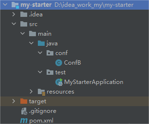
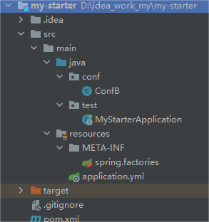
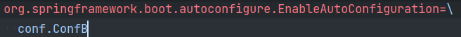
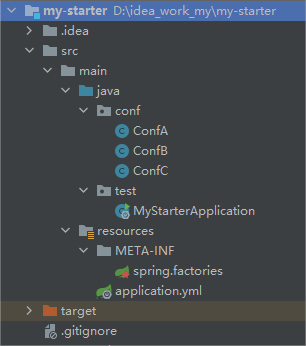
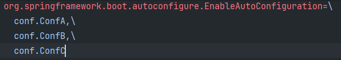
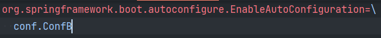
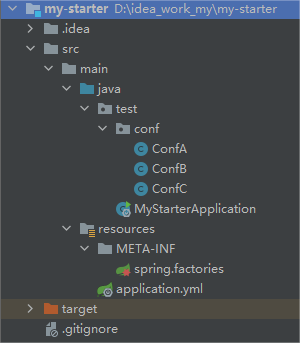
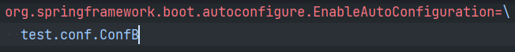

# 技术精华-Springboot中@AutoConfigureBefore和@AutoConfigureAfter的细节

# 正常利用springboot的自动装配


**ConfB**


```java
@Configuration(proxyBeanMethods=false)
public class ConfB {
    
    public ConfB(){
        System.out.println("ConfB构造方式执行...");
    }
}
```


## 不加spring.factories


**项目包结构**  



此时resources中没有spring.factories


**执行结果**


```plain
2023-02-24 13:44:49.809  INFO 33820 --- [           main] test.MyStarterApplication                : No active profile set, falling back to default profiles: default
2023-02-24 13:44:50.294  INFO 33820 --- [           main] o.s.b.w.embedded.tomcat.TomcatWebServer  : Tomcat initialized with port(s): 8080 (http)
2023-02-24 13:44:50.300  INFO 33820 --- [           main] o.apache.catalina.core.StandardService   : Starting service [Tomcat]
2023-02-24 13:44:50.300  INFO 33820 --- [           main] org.apache.catalina.core.StandardEngine  : Starting Servlet engine: [Apache Tomcat/9.0.46]
2023-02-24 13:44:50.354  INFO 33820 --- [           main] o.a.c.c.C.[Tomcat].[localhost].[/]       : Initializing Spring embedded WebApplicationContext
2023-02-24 13:44:50.354  INFO 33820 --- [           main] w.s.c.ServletWebServerApplicationContext : Root WebApplicationContext: initialization completed in 518 ms
2023-02-24 13:44:50.456  INFO 33820 --- [           main] o.s.s.concurrent.ThreadPoolTaskExecutor  : Initializing ExecutorService 'applicationTaskExecutor'
2023-02-24 13:44:50.954  INFO 33820 --- [           main] o.s.b.w.embedded.tomcat.TomcatWebServer  : Tomcat started on port(s): 8080 (http) with context path ''
2023-02-24 13:44:51.004  INFO 33820 --- [           main] test.MyStarterApplication                : Started MyStarterApplication in 1.422 seconds (JVM running for 2.013)
```


没看到`ConfB`构造方法执行，因为执行类`MyStarterApplication`在test包下，test和conf包是并列关系，所以启动时是扫描不到conf包下的内容的，又因为没有spring.factories所以没有加载到`ConfB`是正常情况。下面加 spring.factories


## 添加spring.factories


**项目包结构**  



**spring.factories**  



**执行结果**


```plain
2023-02-24 13:46:21.289  INFO 6400 --- [           main] o.s.b.w.embedded.tomcat.TomcatWebServer  : Tomcat initialized with port(s): 8080 (http)
2023-02-24 13:46:21.294  INFO 6400 --- [           main] o.apache.catalina.core.StandardService   : Starting service [Tomcat]
2023-02-24 13:46:21.294  INFO 6400 --- [           main] org.apache.catalina.core.StandardEngine  : Starting Servlet engine: [Apache Tomcat/9.0.46]
2023-02-24 13:46:21.349  INFO 6400 --- [           main] o.a.c.c.C.[Tomcat].[localhost].[/]       : Initializing Spring embedded WebApplicationContext
2023-02-24 13:46:21.349  INFO 6400 --- [           main] w.s.c.ServletWebServerApplicationContext : Root WebApplicationContext: initialization completed in 515 ms
2023-02-24 13:46:21.445  INFO 6400 --- [           main] o.s.s.concurrent.ThreadPoolTaskExecutor  : Initializing ExecutorService 'applicationTaskExecutor'
ConfB构造方式执行...
2023-02-24 13:46:21.944  INFO 6400 --- [           main] o.s.b.w.embedded.tomcat.TomcatWebServer  : Tomcat started on port(s): 8080 (http) with context path ''
2023-02-24 13:46:21.977  INFO 6400 --- [           main] test.MyStarterApplication                : Started MyStarterApplication in 1.397 seconds (JVM running for 1.97)
```


看到`ConfB`被正常加载了


其实`ConfB`已经在spring.factories中指定了，所以类上不加`@Configuration`注解也可以加载的，如果加的话也是使用`@Configuration(proxyBeanMethods=false)`


## @AutoConfigureBefore、@AutoConfigureAfter的注意事项


`@AutoConfigureBefore、@AutoConfigureAfter`是用来控制bean之间的加载顺序的，但也有很多的问题要注意


新增`ConfA`和`ConfC`  
**ConfA**


```java
public class ConfA {
    
    public ConfA(){
        System.out.println("ConfA构造方式执行...");
    }
}
```


**ConfB**


```java
@AutoConfigureAfter(ConfA.class)
@AutoConfigureBefore(ConfC.class)
public class ConfB {
    
    public ConfB(){
        System.out.println("ConfB构造方式执行...");
    }
}
```


**ConfC**


```java
public class ConfC {
    
    public ConfC(){
        System.out.println("ConfC构造方式执行...");
    }
}
```


### 正常的控制加载顺序


**项目结构**  



**spring.factories**  



**执行结果**


```plain
2023-02-24 13:49:20.099  INFO 23672 --- [           main] o.apache.catalina.core.StandardService   : Starting service [Tomcat]
2023-02-24 13:49:20.099  INFO 23672 --- [           main] org.apache.catalina.core.StandardEngine  : Starting Servlet engine: [Apache Tomcat/9.0.46]
2023-02-24 13:49:20.157  INFO 23672 --- [           main] o.a.c.c.C.[Tomcat].[localhost].[/]       : Initializing Spring embedded WebApplicationContext
2023-02-24 13:49:20.157  INFO 23672 --- [           main] w.s.c.ServletWebServerApplicationContext : Root WebApplicationContext: initialization completed in 528 ms
2023-02-24 13:49:20.253  INFO 23672 --- [           main] o.s.s.concurrent.ThreadPoolTaskExecutor  : Initializing ExecutorService 'applicationTaskExecutor'
ConfA构造方式执行...
ConfB构造方式执行...
ConfC构造方式执行...
2023-02-24 13:49:20.740  INFO 23672 --- [           main] o.s.b.w.embedded.tomcat.TomcatWebServer  : Tomcat started on port(s): 8080 (http) with context path ''
2023-02-24 13:49:20.796  INFO 23672 --- [           main] test.MyStarterApplication                : Started MyStarterApplication in 1.427 seconds (JVM running for 2.048)
```


可以看到`@AutoConfigureBefore、@AutoConfigureAfter`作用生效了`ConfA 、ConfB 、ConfC`按照指定的顺序进行了加载


### 不能进行加载


项目结构不变，把`ConfA 、ConfC`从`spring.factories`去除，然后在这两个类上加上`@Configuration(proxyBeanMethods=false)`注解再试试  
**ConfA**


```java
@Configuration(proxyBeanMethods=false)
public class ConfA {
    
    public ConfA(){
        System.out.println("ConfA构造方式执行...");
    }
}
```


**ConfC**


```java
@Configuration(proxyBeanMethods=false)
public class ConfC {
    
    public ConfC(){
        System.out.println("ConfC构造方式执行...");
    }
}
```


**spring.factories**  



**执行结果**


```plain
2023-02-24 13:52:42.244  INFO 16748 --- [           main] o.apache.catalina.core.StandardService   : Starting service [Tomcat]
2023-02-24 13:52:42.245  INFO 16748 --- [           main] org.apache.catalina.core.StandardEngine  : Starting Servlet engine: [Apache Tomcat/9.0.46]
2023-02-24 13:52:42.299  INFO 16748 --- [           main] o.a.c.c.C.[Tomcat].[localhost].[/]       : Initializing Spring embedded WebApplicationContext
2023-02-24 13:52:42.299  INFO 16748 --- [           main] w.s.c.ServletWebServerApplicationContext : Root WebApplicationContext: initialization completed in 513 ms
2023-02-24 13:52:42.394  INFO 16748 --- [           main] o.s.s.concurrent.ThreadPoolTaskExecutor  : Initializing ExecutorService 'applicationTaskExecutor'
ConfB构造方式执行...
2023-02-24 13:52:42.875  INFO 16748 --- [           main] o.s.b.w.embedded.tomcat.TomcatWebServer  : Tomcat started on port(s): 8080 (http) with context path ''
2023-02-24 13:52:42.920  INFO 16748 --- [           main] test.MyStarterApplication                : Started MyStarterApplication in 1.392 seconds (JVM running for 2.02)
```


可以看到只有`ConfB`加载成功。


结论：**使用**`@AutoConfigureBefore、@AutoConfigureAfter`**中的类必须在**`spring.factories`**中指定才行**


### 不能控制加载顺序


那么再换种思路，不在`spring.factories`中指定，但是使用`@Configuration`注解让springboot启动时自动扫描到来处理呢，试一下  
**ConfA**


```java
@Configuration(proxyBeanMethods=false)
public class ConfA {
    
    public ConfA(){
        System.out.println("ConfA构造方式执行...");
    }
}
```


**ConfB**


```java
@AutoConfigureAfter(ConfA.class)
@AutoConfigureBefore(ConfC.class)
@Configuration(proxyBeanMethods=false)
public class ConfB {
    
    public ConfB(){
        System.out.println("ConfB构造方式执行...");
    }
}
```


**ConfC**


```java
@Configuration(proxyBeanMethods=false)
public class ConfC {
    
    public ConfC(){
        System.out.println("ConfC构造方式执行...");
    }
}
```


**项目结构**  



**spring.factories**  



将conf包放到了test包下，这样springboot的启动类就能自动扫描到`ConfA、ConfB、ConfC`了  
**执行结果**


```plain
2023-02-24 13:54:38.107  INFO 27784 --- [           main] o.apache.catalina.core.StandardService   : Starting service [Tomcat]
2023-02-24 13:54:38.107  INFO 27784 --- [           main] org.apache.catalina.core.StandardEngine  : Starting Servlet engine: [Apache Tomcat/9.0.46]
2023-02-24 13:54:38.161  INFO 27784 --- [           main] o.a.c.c.C.[Tomcat].[localhost].[/]       : Initializing Spring embedded WebApplicationContext
2023-02-24 13:54:38.161  INFO 27784 --- [           main] w.s.c.ServletWebServerApplicationContext : Root WebApplicationContext: initialization completed in 515 ms
ConfA构造方式执行...
ConfC构造方式执行...
2023-02-24 13:54:38.257  INFO 27784 --- [           main] o.s.s.concurrent.ThreadPoolTaskExecutor  : Initializing ExecutorService 'applicationTaskExecutor'
ConfB构造方式执行...
2023-02-24 13:54:38.741  INFO 27784 --- [           main] o.s.b.w.embedded.tomcat.TomcatWebServer  : Tomcat started on port(s): 8080 (http) with context path ''
2023-02-24 13:54:38.797  INFO 27784 --- [           main] test.MyStarterApplication                : Started MyStarterApplication in 1.41 seconds (JVM running for 2.025)
```


可以看到`ConfA、ConfB、ConfC`没有按照指定的顺序进行加载


结论：  
**将 **`ConfA、ConfB、ConfC` 添加到 spring.factories 中。在保证不会被扫描包自动扫描到的范围内的情况下才能够保证指定顺序的加载


### 总结


+ 自定义 starter 中spring.factories 中指定的配置类，要避免被自动扫描到才行
+ `@ComponetScan`也就是自动扫描能扫描到的范围下的配置类，会立即初始化，所以这三个配置类的加载顺序也就无法保证了。
+ `spring.factories` 中的指定的配置类是不需要 `@Configuration`注解的


## @AutoConfigureBefore、@AutoConfigureAfter中参数的注意


```java
@Retention(RetentionPolicy.RUNTIME)
@Target({ ElementType.TYPE })
@Documented
public @interface AutoConfigureAfter {

	/**
	 * The auto-configure classes that should have already been applied.
	 * @return the classes
	 */
	Class<?>[] value() default {};

	/**
	 * The names of the auto-configure classes that should have already been applied.
	 * @return the class names
	 * @since 1.2.2
	 */
	String[] name() default {};

}
```


可以看到有两个参数`value`和`name`，value是指自动装配类的bean的类名字，name是指自动装配类的bean名字。


### 举例说明


```java
@AutoConfigureAfter(ConfA.class)
public class ConfB {
    
    public ConfB(){
        System.out.println("ConfB构造方式执行...");
    }
}
```


案例中，用到了`@AutoConfigureAfter`的`value`，注意：**即使项目引入了ConfA的依赖，但是ConfA没有被注入到spring容器中的话，依旧会被判定ConfA不存在，那么ConfB也不会被加载bean，因为ConfB被加载bean的条件就是要在ConfA加载bean的后面执行**


> 更新: 2024-03-26 16:28:05  
> 原文: <https://www.yuque.com/u22210564/ykdrdh/an7imeeyb0c4lbmd>