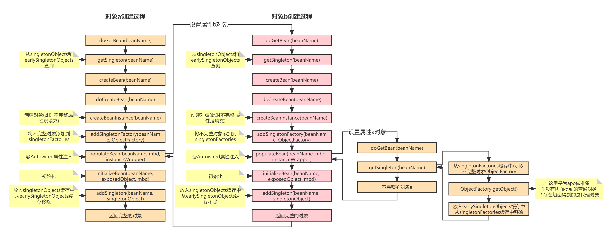

# 技术精华-Spring中循环依赖还没懂？直接帮你搞定

# 场景


存在两个Bean对象A和B，每个对象中通过`@Autowired`注入对方的对象，也就是说两个对象相互引用。


```java
@Component
public class A {

    @Autowired
    private B b;

    public void testa(){
        System.out.println("执行a对象方法");
    }
}
```


```java
@Component
public class B {

    @Autowired
    private A a;

    public void testb(){
        System.out.println("执行b对象方法");
    }
}
```


# 分析流程


## 流程图





## 缓存类型
### **1级缓存**


+ 存放的是最终创建完的完整对象


```java
Map<String, Object> singletonObjects = new ConcurrentHashMap<>(256)
```


### **2级缓存**


+ 如果不存在aop情况下，存放的是普通不完整对象，属性没有填充。
+ 如果存在aop情况下，存放的是aop的代理对象，目标对象仍然是不完整的。


```java
Map<String, Object> earlySingletonObjects = new ConcurrentHashMap<>(16)
```


### **3级缓存**


+ 当执行`createBeanInstance`创建出不完整对象(属性没有填充好)后，就会放到此缓存中
+ 类型为`ObjectFactory`的原因是根据是否存在aop从而调用`ObjectFactory.getObject()`时判断创建是普通对象还是aop代理对象


```java
Map<String, ObjectFactory<?>> singletonFactories = new HashMap<>(16)
```


## 缓存说明


+ 实例化的bean会通过`ObjectFactory`半成品提前暴露在三级缓存`singletonFactory`中
+ `singletonFactory`是传入的一个匿名内部类`ObjectFactory`，调用`ObjectFactory.getObject()`会调用到`getEarlyBeanReference`


## a和b对象加载流程


+ a首先实例化，实例化通过`ObjectFactory`将不完整的对象a存放到在三级缓存`singletonFactories`中
+ 填充属性b，发现b还未进行过加载，就会先去加载b对象
+ 再加载b的过程中，实例化，也通过`ObjectFactory`将不完整的对象b存放到在三级缓存`singletonFactories`中
+ 填充属性a的时候，这时候能够从三级缓存`singletonFactories`中拿到半成品的`ObjectFactory`类型的a对象
+ 拿到ObjectFactory对象后，调用`ObjectFactory.getObject()`方法最终会调用`getEarlyBeanReference()`方法，如果bean被AOP切面代理则返回的是代理对象，如果未被代理则返回的是原bean实例
+ 放入二级缓存`earlySingletonObjects`中，从三级缓存`singletonFactories`中移除
+ 属性a填充完毕
+ 对象b放到一级缓存`singletonObjects`
+ 对象a的属性b填充完毕
+ 对象a放到一级缓存`singletonObjects`


## 为什么需要三级缓存，而不是二级缓存


如果存在aop的情况下，`singletonFactory.getObject()`返回的是一个A的代理对象。再执行一遍`singleFactory.getObject()`方法又是一个新的代理对象，

这就会有问题了，因为A是单例的，每次执行`singleFactory.getObject()`方法又会产生新的代理对象


如果只有一级和三级缓存的话，每次从三级缓存中拿到`singleFactory`对象，执行`getObject()`方法又会产生新的代理对象，这是不行的，

因为A是单例的，所有这里我们要借助二级缓存来解决这个问题，将执行了`singleFactory.getObject()`产生的对象放到二级缓存中去，

后面去二级缓存中拿，没必要再执行一遍`singletonFactory.getObject()`方法再产生一个新的代理对象，保证始终只有一个代理对象。


既然`singleFactory.getObject()`返回的是代理对象，那么注入的也应该是代理对象，我们可以看到注入的确实是经过CGLIB或者JDK代理的A对象。所以如果没有AOP的话确实可以两级缓存就可以解决循环依赖的问题，


如果加上AOP，两级缓存是无法解决的，不可能每次执行`singleFactory.getObject()`方法都给我产生一个新的代理对象，所以还要借助另外一个缓存来保存产生的代理对象


> 更新: 2024-04-11 19:25:53  
> 原文: <https://www.yuque.com/u22210564/ykdrdh/yfia6ouugbuhfkqf>