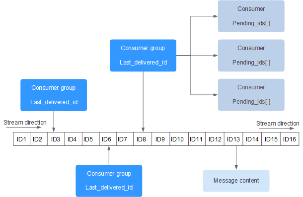

# 技术精华-全面解读RedisStream队列

# 前置介绍
使用Redis实现消息队列的方式有两种，例如：

+ **PUB/SUB，订阅/发布模式 **这种发布订阅模式是没有办法进行持久化的，如果出现网络断开、Redis宕机的话，消息就会丢失
+ **LPUSH+BRPOP** 或者 **Sorted-Set**的实现，这种可以支持了持久化，但是不支持多播，分组消费的特点

# RedisStream是什么？
Redis在5.x版本以上，新增了Stream的数据结构，从功能上看，可以说是Redis对消息队列MQ的完善实现

### 实现的功能
+ 消息ID的序列化生成
+ 消息遍历
+ 消息的阻塞和非阻塞读取
+ 消息的分组消费
+ 消息的广播消费
+ 未完成消息的处理
+ 消息队列监控


Redis Stream 提供了消息的持久化和主备复制功能，可以让任何客户端访问任何时刻的数据，并且能记住每一个客户端的访问位置，还能保证消息不丢失。


Redis Stream 的结构如下所示，它有一个消息链表，将所有加入的消息都串起来，每个消息都有一个唯一的 ID 和对应的内容：




每个 Stream 都有唯一的名称，它就是 Redis 的 key，在我们首次使用 xadd 指令追加消息时自动创建。

上图解析：

+ **Consumer Group** ：消费组，使用 XGROUP CREATE 命令创建，一个消费组有多个消费者(Consumer)。这些消费者之间是竞争关系
+ **last_delivered_id** ：游标，每个消费组会有个游标 last_delivered_id，任意一个消费者读取了消息都会使游标 last_delivered_id 往前移动
+ **pending_ids** ：消费者(Consumer)的状态变量，作用是维护消费者的未确认的 id。 pending_ids 记录了当前已经被客户端读取的消息，但是还没有 ack (Acknowledge character：确认字符）。如果客户端没有ack，这个变量里面的消息ID会越来越多，一旦某个消息被ack，它就开始减少。这个pending_ids变量在Redis官方被称之为PEL，也就是Pending Entries List，这是一个很核心的数据结构，它用来确保客户端至少消费了消息一次，而不会在网络传输的中途丢失了没处理


# 常用命令
关于详细的操作命令可参考：

[Redis Stream | 菜鸟教程](https://www.runoob.com/redis/redis-stream.html)

### 消息的添加/读取/删除
##### XADD 添加消息到队列的末尾
```shell
redis:0>xadd test_stream * areaName beijing
"1715334202451-0"
redis:0>xadd test_stream * areaName shanghai
"1715334466987-0"
redis:0>xadd test_stream * areaName nanjing
"1715334477467-0"
redis:0>xadd test_stream * areaName shenzhen
"1715334483563-0"
```

+ *号表示服务器自动生成ID，然后是消息内容 key value 的形式
+ 1715334202451-0 是生成的消息ID

##### XLEN 获取流包含的元素数量，即消息长度
```shell
redis:0>xlen test_stream
"4"
```

##### XRANGE 获取消息列表，会自动过滤已经删除的消息
```shell
redis:0>xrange test_stream - +
 1)    1)   "1715334202451-0"
  2)      1)    "areaName"
   2)    "beijing"


 2)    1)   "1715334466987-0"
  2)      1)    "areaName"
   2)    "shanghai"


 3)    1)   "1715334477467-0"
  2)      1)    "areaName"
   2)    "nanjing"


 4)    1)   "1715334483563-0"
  2)      1)    "areaName"
   2)    "shenzhen"

```

-表示最小值, +表示最大值


```shell
redis:0>xrange test_stream 1715334477467-0 +
 1)    1)   "1715334477467-0"
  2)      1)    "areaName"
   2)    "nanjing"


 2)    1)   "1715334483563-0"
  2)      1)    "areaName"
   2)    "shenzhen"

```

##### XDEL - 删除消息
```shell
redis:0>xdel test_stream 1715334202451-0
"1"
redis:0>xlen test_stream
"3"
redis:0>xdel test_stream 1715334466987-0
"1"
redis:0>xlen test_stream
"2"
redis:0>xrange test_stream - +
 1)    1)   "1715334477467-0"
  2)      1)    "areaName"
   2)    "nanjing"


 2)    1)   "1715334483563-0"
  2)      1)    "areaName"
   2)    "shenzhen"
```

### 不使用消费组的方式消费消息 
##### XREAD 以阻塞或非阻塞方式获取消息列表
此种消费方式不使用消费组，也就是可以实现 每个实例都能消费此消息，使用xread读取命令时，就可以将Stream理解成普通的list消息队列进行操作

```shell
XREAD [COUNT count] [BLOCK milliseconds] STREAMS key [key ...] id [id ...]
```

+ **<font style="color:rgb(51, 51, 51);">count</font>**<font style="color:rgb(51, 51, 51);"> </font><font style="color:rgb(51, 51, 51);">：数量</font>
+ **<font style="color:rgb(51, 51, 51);">milliseconds</font>**<font style="color:rgb(51, 51, 51);"> </font><font style="color:rgb(51, 51, 51);">：可选，阻塞毫秒数，没有设置就是非阻塞模式</font>
+ **<font style="color:rgb(51, 51, 51);">key</font>**<font style="color:rgb(51, 51, 51);"> </font><font style="color:rgb(51, 51, 51);">：队列名</font>
+ **<font style="color:rgb(51, 51, 51);">id</font>**<font style="color:rgb(51, 51, 51);"> ：消息 ID</font>

```shell
# id配置为0-0，表示从Stream第一个元素开始返回
redis:0>xread count 1 streams test_stream 0-0
 1)    1)   "test_stream"
  2)      1)        1)     "1715334477467-0"
    2)          1)      "areaName"
     2)      "nanjing"

# 后面的每次读取，都将从上次返回的最后一条数据的id，作为这次查询的起始id
redis:0>xread count 1 streams test_stream 1715334477467-0
 1)    1)   "test_stream"
  2)      1)        1)     "1715334483563-0"
    2)          1)      "areaName"
     2)      "shenzhen"
```

<font style="color:#213BC0;">使用xread命令读取消息时，要记住每次读取消息后，返回的最后一条数据的id，等下次再调用xread命令时，将这个消息id作为参数传递进去，就可以继续读取后面的消息</font>

### 使用消费组的方式消费消息
##### XGROUP CREATE 通过此命令创建消费组(Consumer Group)，需要传递起始消息ID参数用来初始化last_delivered_id变量
id说明：

+ **0-0** 表示从头开始消费消息 XGROUP CREATE mystream consumer-group-name 0-0
+ **$** 表示从尾部开始消费，只接受新消息，当前Stream消息会全部忽略 XGROUP CREATE mystream consumer-group-name $

```shell
redis:0>xgroup create test_stream test_group_1 0-0
"OK"
```

##### XINFO STEAM 获取Stream的信息
```shell
redis:0>xinfo stream test_stream
 # 消息数量信息
 1)  "length"
 # 此stream中有2个消息
 2)  "2"
 3)  "radix-tree-keys"
 4)  "1"
 5)  "radix-tree-nodes"
 6)  "2"
 7)  "last-generated-id"
 # 最后一个消息的id
 8)  "1715334483563-0"
 # 消费组的信息 
 9)  "groups"
 # 消费组的数量
 10)  "1"
 # 第一个消息
 11)  "first-entry"
 12)    1)   "1715334477467-0"
  2)      1)    "areaName"
   2)    "nanjing"
 # 最后一个消息
 13)  "last-entry"
 14)    1)   "1715334483563-0"
  2)      1)    "areaName"
   2)    "shenzhen"
```

##### XINFO GROUPS 获取Stream的消费组信息
```shell
redis:0>xinfo groups test_stream
 1)    1)   "name"
  # 消费组名字
  2)   "test_group_1"
  # 该消费中的消费者数量
  3)   "consumers"
  # 0表示没有已经消费的消息
  4)   "0"
  # 正在处理的消息数量
  5)   "pending"
  # 0表示没有正在处理的消息
  6)   "0"
  # 最后一个消息的消息id
  7)   "last-delivered-id"
  8)   "0-0"
```

##### XINFO CONSUMERS 获取stream消费组中的消费者信息
```shell
redis:0>xinfo consumers test_stream test_group_1
 1)    1)   "name"
  # 消费者名称
  2)   "consumer_1"
  3)   "pending"
  4)   "0"
  5)   "idle"
  6)   "897728"
```

##### XREADGROUP 进行消费组的消费消息
```shell
XREADGROUP GROUP group consumer [COUNT count] [BLOCK milliseconds] [NOACK] STREAMS key [key ...] ID [ID ...]
```

+ **<font style="color:rgb(51, 51, 51);">group</font>**<font style="color:rgb(51, 51, 51);"> </font><font style="color:rgb(51, 51, 51);">：消费组名</font>
+ **<font style="color:rgb(51, 51, 51);">consumer</font>**<font style="color:rgb(51, 51, 51);"> ：消费者名</font>
+ **<font style="color:rgb(51, 51, 51);">count</font>**<font style="color:rgb(51, 51, 51);"> ： 读取数量</font>
+ **<font style="color:rgb(51, 51, 51);">milliseconds</font>**<font style="color:rgb(51, 51, 51);"> ： 阻塞毫秒数</font>
+ **<font style="color:rgb(51, 51, 51);">key</font>**<font style="color:rgb(51, 51, 51);"> ： 队列名</font>
+ **<font style="color:rgb(51, 51, 51);">ID</font>**<font style="color:rgb(51, 51, 51);"> ： 消息 ID</font>

此命令的参数需要 消费组名、消费者名、起始消息ID。和xread命令相同，也可以阻塞等待新消息。读到新消息后，对应的消息ID就会进入消费者的PEL(正在处理的消息)结构里，客户端处理完毕后使用xack指令通知服务器，本条消息已经处理完毕，该消息ID就会从PEL中移除

```shell
# >号表示从消费组的last_delivered_id后面开始读, 消费者每消息一条消息，
# last_delivered_id更新一次

# 读取第一个消息
redis:0>xreadgroup group test_group_1 consumer_1 count 1 streams test_stream >
 1)    1)   "test_stream"
  2)      1)        1)     "1715334477467-0"
    2)          1)      "areaName"
     2)      "nanjing"
# 读取第二个消息
redis:0>xreadgroup group test_group_1 consumer_1 count 1 streams test_stream >
 1)    1)   "test_stream"
  2)      1)        1)     "1715334483563-0"
    2)          1)      "areaName"
     2)      "shenzhen"
# 没有消息可以读取了
redis:0>xreadgroup group test_group_1 consumer_1 count 1 streams test_stream >

redis:0>

# 再用xinfo groups命令查询消费组的信息
redis:0>xinfo groups test_stream
 1)    1)   "name"
  # 消费组名字
  2)   "test_group_1"
  # 该消费中的消费者数量
  3)   "consumers"
  # 1个消费者
  4)   "1"
  # 正在处理的消息数量
  5)   "pending"
  # 2个正在处理的消息，并没有ack确认
  6)   "2"
  7)   "last-delivered-id"
  # 最后一个消息的消息id
  8)   "1715334483563-0"
```

##### XACK 将消息进行ack确认
```shell
redis:0>xack test_stream test_group_1 1715334477467-0
"1"
redis:0>xinfo groups test_stream
 1)    1)   "name"
  2)   "test_group_1"
  3)   "consumers"
  4)   "1"
  5)   "pending"
  # 正在处理的消息数量变成了1
  6)   "1"
  7)   "last-delivered-id"
  8)   "1715334483563-0"

redis:0>xack test_stream test_group_1 1715334483563-0
"1"
redis:0>xinfo groups test_stream
 1)    1)   "name"
  2)   "test_group_1"
  3)   "consumers"
  4)   "1"
  5)   "pending"
  # 正在处理的消息数量变成了0
  6)   "0"
  7)   "last-delivered-id"
  8)   "1715334483563-0"
```

### 查询消费组中的未处理完毕的消息的详细信息
### XPENDING 命令
为了解决组内消息读取但处理期间消费者崩溃带来的消息丢失问题，STREAM 设计了 Pending 列表，用于记录读取但并未处理完毕的消息。XPENDING 用来获消费组或消费内消费者的未处理完毕的消息


这里我们添加一条消息，然后消费处理这条信息，并不ack，使用xpending命令查询相关的信息

```shell
# 添加一条消息
redis:0>xadd test_stream * areaName dalian
"1715585337107-0"
# 使用test_group_1消费组，来消费这一条信息
redis:0>xreadgroup group test_group_1 consuemr_1 count 1 streams test_stream >
 1)    1)   "test_stream"
  2)      1)        1)     "1715585337107-0"
    2)          1)      "areaName"
     2)      "dalian"
# xinfo查询消费组相关信息
redis:0>xinfo groups test_stream
 1)    1)   "name"
  2)   "test_group_1"
  3)   "consumers"
  4)   "2"
  5)   "pending"
  6)   "1"
  7)   "last-delivered-id"
  8)   "1715585337107-0"
# xpending查询消费组中的消费者相关信息
redis:0>xpending test_stream test_group_1
 # 1个已消息，但没有ack确认的消息
 1)  "1"
 # 起始的消息ID
 2)  "1715585337107-0"
 # 结束的消息ID
 3)  "1715585337107-0"
 # 消费者的名字
 4)    1)      1)    "consuemr_1"
   # 消费者consuemr_1的数量
   2)    "1"

```

# 消息id的生成
刚才添加消息后生成的id是 **1715334202451-0**，形式是timestampInMillis-sequence，表示当前的消息在毫米时间戳**1715334202451**时产生，并且是该毫秒内产生的第0条消息。消息ID可以由服务器自动生成，也可以由客户端自己指定，但是形式必须是整数-整数，而且必须是后面加入的消息的ID要大于前面的消息ID

### 关于消息id的时钟回拨问题
通常分布式id生成的方式常用的是雪花算法，雪花算法存在一个问题，就是会产生时钟回拨，那么RedisStream的消息id是否解决了这个问题呢？

XADD生成的 **1715334202451-0**，就是Redis生成的消息ID，由两部分组成:时间戳-序号。时间戳是毫秒级单位，是生成消息的Redis服务器时间，它是个64位整型（int64）。序号是在这个毫秒时间点内的消息序号，它也是个64位整型

为了保证消息是有序的，因此Redis生成的ID是单调递增有序的。由于ID中包含时间戳部分，为了避免服务器时间错误而带来的问题（例如服务器时间延后了），Redis的每个Stream类型数据都<font style="color:#0C68CA;">维护一个latest_generated_id属性</font>，用于记录最后一个消息的ID。若<font style="color:#0C68CA;">发现当前时间戳退后</font>（小于latest_generated_id所记录的），则<font style="color:#0C68CA;">采用时间戳不变而序号递增的方案来作为新消息ID</font>（这也是序号为什么使用int64的原因，保证有足够多的的序号），从而保证ID的单调递增性质。因此建议使用这种自动生成id的方式


> 更新: 2024-05-13 16:15:43  
> 原文: <https://www.yuque.com/u22210564/ykdrdh/sda8hzep9sdto2gx>