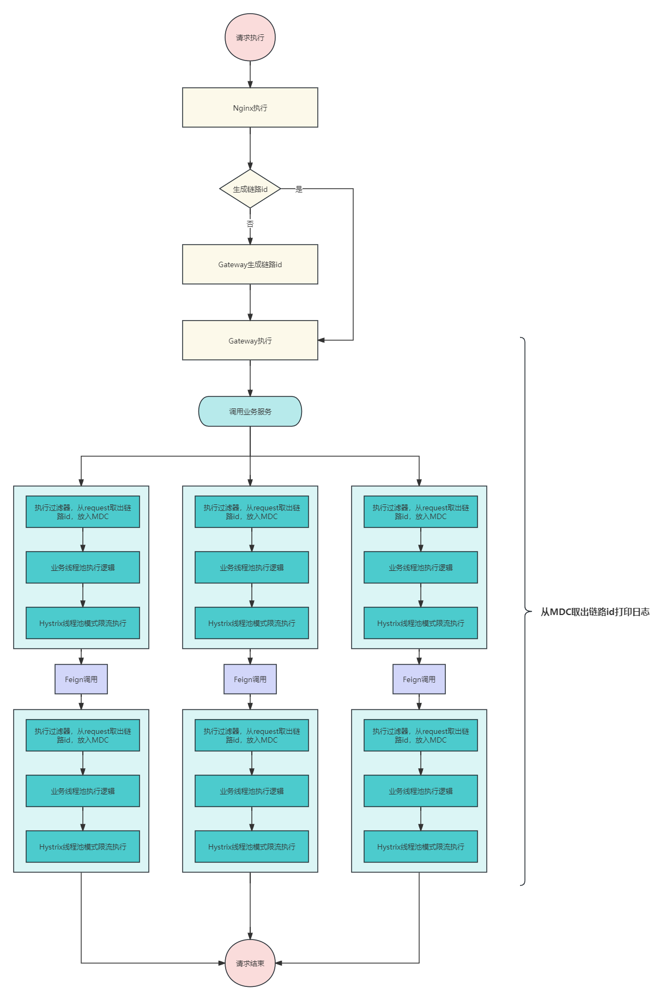

# 技术精华-只会用Skywalking？教你如何自定义分布式链路id

# 概述


微服务架构已成为当代软件开发的一项重要趋势，它通过将复杂的单体应用拆分成更小、更易于管理和扩展的服务来提高系统的灵活性和可维护性。

然而，微服务架构也带来了新的挑战，在一个请求涉及到几十个服务的调用也是很常见的，然后当这个请求出现问题进行排查时，如果排查哪些服务调用是在同一个请求中，这是非常困难的，而这时，跟踪和监控跨多个服务的请求的重要性就体现出来了。这就是分布式链路ID（Distributed Tracing ID）发挥作用的地方。


### 分布式链路ID的作用


1. **跟踪请求流程**：在一个由多个微服务组成的系统中，一个外部请求可能需要通过多个服务才能完成。分布式链路ID允许我们将这个请求经过的所有服务连接起来，形成一个完整的链路图，从而使我们能够追踪请求的整个流程。
2. **性能监控**：通过分析请求链路中各个环节的处理时间，我们可以识别出系统的性能瓶颈，为性能优化提供有力的数据支持。
3. **故障定位**：在发生错误或异常时，分布式链路ID可以帮助快速定位问题发生的服务和位置，加速故障排除和修复过程。
4. **审计和安全**：在需要审计请求或进行安全分析时，链路ID为每个请求提供了一个独一无二的标识，有助于追踪和分析潜在的安全问题。


在微服务体系下，服务之间的调用有时会特别复杂，当出现问题后就很难排查，针对这种问题，目前都会在请求开始端，例如Nginx或者业务网关Gateway/Zuul生成一个全局id然后传递下去，这样根据这个id就会将整个链路连起来


### SKywalking不可以吗？
[Apache SkyWalking](https://skywalking.apache.org/)

有的小伙伴可能会想到SKywalking这种APM的监控系统，直接用这个不就能监控到调用链路了吗？首先来说，使用SKywalking确实可以实现这个功能，但杀鸡焉用牛刀啊！

SKywalking的性能消耗其实并不低，它的原理是使用字节码增强生成代理类，然后在本地内存中进行数据的汇总，接着使用Grpc的传输协议到控制台中。

就这么一套下来，对cpu和内存其实都是有压力的，另外而言其实并不是每个链路都要图形化的显示。**但每个链路调用确实都需要链路id来串联起来。**

所以我们自己来设计出链路id的功能，这样不会怎么影响性能，也能实现这个核心功能

### 设计思路


设计一个有效的分布式链路追踪系统需要考虑以下几个关键点：


1. **唯一性**：每个请求都应该被赋予一个唯一的链路ID，确保在整个分布式系统中的唯一性，通常可以通过生成UUID或结合时间戳和一些其他信息来实现。
2. **传播机制**：当请求在微服务之间传递时，链路ID也需要跟随请求一起传递。这通常通过HTTP请求的头部信息实现，每个服务在接收到请求时读取链路ID，处理完毕后再将其加入到对下游服务的请求中。
3. **轻量级**：链路追踪系统的设计应尽可能轻量，以减少对系统性能的影响。这意味着在生成、传递和存储链路ID时需要尽量减少资源消耗。
4. **数据收集和分析**：设计一个中心化的数据收集系统来聚合和分析跨服务的链路数据是非常重要的。这个系统需要能够处理大量的数据，并支持复杂的查询，以便于快速定位问题和生成性能报告。


### 实现思路


首先这个链路id是公共参数，不能影响主业务，所以一般在网关层生成后会将id放入Request请求头中传递下去。


接受在每个业务服务会执行一个过滤器，此过滤器从Request头部取出id放入日志配置Slf4j的MDC作用域中，然后在Logback/Log4j2的配置中配置id的输出，如下


```xml
<!--输出控制台的配置-->
<Console name="Console" target="SYSTEM_OUT">
    <!-- 输出日志的格式 -->
    <PatternLayout pattern="[test-service] [%X{traceId}] %d{yyyy-MM-dd HH:mm:ss} %5p %c{1}:%L - %m%n"/>
</Console>
```


在实际的项目中，这个id是由nginx来生成的，如果请求没有经过nginx，那么gateway来生成然后传递到下一个业务服务中，然后再依次的传递下去，**然而在传递过程中会发生各种各样的问题**，让我们通过流程图来更清晰的理解整个结构





## 问题


### Feign的传递


微服务之间的调用常见的用Feign，比如A调用B服务，默认Feign并不会将A服务请求头中的id自动的传递给B服务的请求头中，所以需要我们额外配置


```java
public class FeignRequestInterceptor implements RequestInterceptor {
    
    @Override
    public void apply(final RequestTemplate template) {
        try {
            RequestAttributes ra = RequestContextHolder.getRequestAttributes();
            if (ra != null) {
                ServletRequestAttributes sra = (ServletRequestAttributes) ra;
                HttpServletRequest request = sra.getRequest();
                String traceId = request.getHeader(TRACE_ID);
                String code = request.getHeader(CODE);
                //将traceId传递到下一个服务中
                template.header(TRACE_ID,traceId);
                //将code传递到下一个服务中
                template.header(CODE,code);
            }
        }catch (Exception e) {
            log.error("FeignRequestInterceptor apply error",e);
        }
    }
}
```


#### 使用


添加依赖


```xml
<dependency>
    <groupId>com.example</groupId>
    <artifactId>damai-service-component</artifactId>
    <version>${revision}</version>
</dependency>
```


### 使用线程池的问题


**Request的作用域其实就是个ThreadLocal**，还有就是日志中的MDC本质其实也是个**ThreadLocal**，又或者有其他的数据需要放到ThreadLocal中，而ThreadLocal和线程是绑定的，这就导致了在线程池中是获取不到ThreadLocal中的数据的，ThreadLocal可以做到线程隔离原理是在每个线程存在一个Map，key是ThreadLocal对象本身，value是值。但在线程池情况下就无法传递参数了


#### Request的错误解决


通常服务中的request类型为`HttpServletRequest`,范围是跟线程绑定的。目前网上通常的说法是这样的：


1. 先从主线程中获得request。`RequestAttributes ra = RequestContextHolder.getRequestAttributes();`
2. 然后在子线程再重新设置进去。`RequestContextHolder.setRequestAttributes(requestAttributes);`


其实仔细看看RequestContextHolder的原理就知道这样做是存在隐患的。


```java
private static final ThreadLocal<RequestAttributes> requestAttributesHolder =
			new NamedThreadLocal<>("Request attributes");

private static final ThreadLocal<RequestAttributes> inheritableRequestAttributesHolder =
			new NamedInheritableThreadLocal<>("Request context");

public static RequestAttributes getRequestAttributes() {
	RequestAttributes attributes = requestAttributesHolder.get();
	if (attributes == null) {
		attributes = inheritableRequestAttributesHolder.get();
	}
	return attributes;
}

public static void setRequestAttributes(@Nullable RequestAttributes attributes, boolean inheritable) {
	if (attributes == null) {
		resetRequestAttributes();
	}
	else {
		if (inheritable) {
			inheritableRequestAttributesHolder.set(attributes);
			requestAttributesHolder.remove();
		}
		else {
			requestAttributesHolder.set(attributes);
			inheritableRequestAttributesHolder.remove();
		}
	}
}
```


可以看出本质上还是通过`ThreadLocal`和`InheritableThreadLocal`来实现父子线程公用一个request。这样做是没问题，前提是多线程或线程池中使用的是`future`这种获得异步结果阻塞式的操作，因为这样父线程会等待子线程执行完后，再清除掉request的内容。

如果使用线程的`start`或者线程池的`execute`，那么父线程开启子线程后会继续执行父线程后续业务然后清除掉request的内容，所以这时只要子线程的任务耗时一点就会可能导致request内容获取不到。


到这里，我们清楚了只是单纯的操作request还是不能从根本上解决问题，依旧要从数据入手，怎么让链路id能传递下去。而阿里提供的**TransmittableThreadLocal**确实可以解决。关于`ThreadLocal`、`InheritableThreadLocal`、`TransmittableThreadLocal`的介绍，本人有详解的讲解，小伙伴可跳转到相关文档查看

[技术精华-ThreadLocal InheritableThreadLocal TransmittableThreadLocal全攻略](https://www.yuque.com/u22210564/ykdrdh/sqn20snt0cvhoq8p)


但其实阿里的这个其实挺笨重的，如果只是传递几个参数完全可以自己对线程池进行定制，实现这个功能。也能在简历上增加自己的亮点，所以来自己实现。


思路其实和`TransmittableThreadLocal`差不多，但要精简许多，就是**每次在线程执行前，先将主线程中的数据传递到子线程中，子线程再获取一个副本，当子线程任务执行完后，再将刚才的副本设置回去。**


想使用此定义化的线程池，需要引入依赖


```xml
<dependency>
    <groupId>com.example</groupId>
    <artifactId>damai-thread-pool-framework</artifactId>
    <version>${revision}</version>
</dependency>
```


使用api


```java
BusinessThreadPool.execute(() -> System.out.println("异步任务执行"));
```


本文篇幅有限，关于线程池定制化的详细讲解部分，可跳转到相应文档查询


[组件讲解-打造专属线程池 让并发处理更高效](https://www.yuque.com/u22210564/ykdrdh/vpcqn24thenoh1f9)


### Hystrix的线程池模式的问题


虽然现在对于熔断保护的开源框架中，Sentinel的热度更加的高，但Hystrix目前仍然有很多的公司在使用中，而其中的线程池隔离模式，其内部的线程池用的就是jDK提供的，所以也会遇到request获取数据失败的情况，这个其实和上面说的线程池的情况差不多


但是Hystrix并没有直接提供让我们替换线程池的方法，所以采用我们无法直接对线程池进行定制化。所以我们无法解决这个问题了吗？并不是，Hystrix的团队其实也是考虑到了这个问题


提供了插件的方案，可以让我们对线程池的任务进行包装增强，我们就可以利用这个特点来实现，来实现对request数据的正确获取，关于此部分的详细介绍可跳转到相关文档查看


[技术精华-详解Hystrix传递ThreadLocal数据失效问题](https://www.yuque.com/u22210564/ykdrdh/dsrunfio64aat6nq)


> 更新: 2024-03-26 16:43:22  
> 原文: <https://www.yuque.com/u22210564/ykdrdh/wfpt6gdx6c2k7fvl>