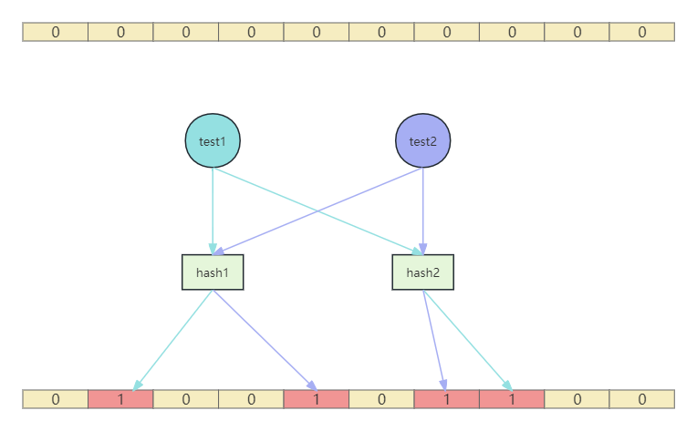

# 技术精华-完全解读布隆过滤器

# 布隆过滤器


布隆过滤器（Bloom Filter）是 1970 年由布隆提出的，是一种非常节省空间的概率数据结构，运行速度快，占用内存小。它实际上是一个很长的二进制向量和一系列随机映射函数。布隆过滤器可以用于检索一个元素是否在一个集合中。主要用于判断一个元素是否在一个集合中。主要是解决**大规模数据下不需要精确过滤**的场景，如检查垃圾邮件地址，爬虫URL地址去重，解决缓存穿透问题等。


### 优点


+ 存储空间和插入 / 查询时间都是常数O(k)
+ 支持海量数据场景下高效率判断元素是否存在
+ 存储空间小，不存储数据本身，而是存储hash结果取模运算后的位标记


### 缺点


+ 无法删除，因为可能多个元素通过哈希后，可能会产生hash碰撞，映射到布隆过滤器的同一个位置。删除该位置后，可能影响其他元素
+ 误判，由于存在hash碰撞，不同的元素经过哈希后可能映射到同一个位置，一旦产生碰撞，会被误判存在
+ 碰撞概率，让随着元素越来越大，在容量限制下，布隆过滤器被使用的位置就会越来越多，误判的几率也会越来越大


### 特点


根据布隆过滤器的特点可以知道


+ 判断如果某个元素存在，由于存在误判，这个元素不一定是存在的
+ 判断如果某个元素不存在，那这个元素一定不存在


## 原理


### 结构


布隆过滤器底层就是一个二进制的位数组，在初始状态，所有位置的位都是0


### 添加


+ 使用哈希函数对元素进行哈希计算得到索引值，将索引值对应的数组下标所在的值设置为1
+ 如果是多个哈希函数则进行上述同样的操作


### 查询


+ 对要查询的元素同样使用哈希函数进行计算，如果存在多个哈希函数则得到多个索引值
+ 判断这些索引值对应的数组下标的值是否都为1，如果是，则判断这个元素为存在。如果这些下标的值只要有一个是0，那么判断这个元素为不存在


### 流程图





## 容量估算


当我们知道了布隆过滤器的原理后，还剩下个问题，就是要估算出布隆过滤器所需要的容量，以便于配置服务器的容量


布隆过滤器的容量是和产生的碰撞概率有关的，通过布隆过滤器的原理能知道，容量和碰撞概率的关系**就是相斥的**


> 要想碰撞概率小，容量肯定就要大。
>
>  
>
> 要想容量小，碰撞概率肯定就要大
>


#### 公式


那么具体要如何估算呢，我们可以根据公式要进行计算：


$ m = -\frac{n \ast \ln p}{(\ln 2)^2}
 $


m可能算到小数，那就向上取整


**参数解释**


+ `n` 元素的样本量
+ `p` 碰撞率
+ `m` 布隆过滤器占用比特数


#### 进行计算


以用户注册业务为例，我们需要计算 **n**，也就是用户量需要多少


**2023年末2024年初,常住人口140967万人**，这里我们直接取整为**14亿**，假设这14亿人所有人都是大麦网的用户，用这个数字作为布隆过滤器的容量来说，以目前国内的用户增长量来说，五年内绝对是没有任何问题的


至于碰撞率 **p** 我们取一个比较精确的值，0.2%


将**n = 14亿** ，**p = 0.2%** 带入公式中，计算出


$ m \approx 1.8108849535 \times 10^{10}
 $


这时 **m** 的单位是bit，如果换成GB单位， 则


$ m \approx 2.108 \text{ GB}
 $


# 布隆过滤器组件


讲解完布隆过滤器后，下面就是开始使用了，在经典的开源项目**redisson**项目中提供了布隆过滤器的支持，如果小伙伴对redisson感兴趣，可跳转到对应的地址


[GitHub - redisson/redisson: Redisson - Easy Redis Java client with features of In-Memory Data Grid. Sync/Async/RxJava/Reactive API. Over 50 Redis based Java objects and services: Set, Multimap, SortedSet, Map, List, Queue, Deque, Semaphore, Lock, AtomicLong, Map Reduce, Bloom filter, Spring Cache, Tomcat, Scheduler, JCache API, Hibernate, RPC, local cache ...](https://github.com/redisson/redisson)


[目录](https://github.com/redisson/redisson/wiki/%E7%9B%AE%E5%BD%95)


本人将redisson的布隆过滤器集成到项目中了，使用起来更加简单


## 依赖


```xml
<dependency>
    <groupId>com.example</groupId>
    <artifactId>damai-bloom-filter-framework</artifactId>
    <version>${revision}</version>
</dependency>
```


## 结构


#### 属性配置


```java
@Data
@ConfigurationProperties(prefix = BloomFilterProperties.PREFIX)
public class BloomFilterProperties {

    public static final String PREFIX = "bloom-filter";
    /**
    * 布隆过滤器名字
    */
    private String name;
    /**
    * 布隆过滤器的容量
    */
    private Long expectedInsertions = 20000L;
    /**
    * 布隆过滤器碰撞率
    */
    private Double falseProbability = 0.01D;
}
```


#### 自动装配


```java
@EnableConfigurationProperties(BloomFilterProperties.class)
public class BloomFilterAutoConfiguration {
    
    /**
     * 布隆过滤器
     */
    @Bean
    public BloomFilterHandler rBloomFilterUtil(RedissonClient redissonClient, BloomFilterProperties bloomFilterProperties) {
        return new BloomFilterHandler(redissonClient, bloomFilterProperties);
    }
}
```


#### 布隆过滤器操作


```java
public class BloomFilterHandler {
    
    private final RBloomFilter<String> cachePenetrationBloomFilter;
    
    public BloomFilterHandler(RedissonClient redissonClient, BloomFilterProperties bloomFilterProperties){
        RBloomFilter<String> cachePenetrationBloomFilter = redissonClient.getBloomFilter(bloomFilterProperties.getName());
        cachePenetrationBloomFilter.tryInit(bloomFilterProperties.getExpectedInsertions(), bloomFilterProperties.getFalseProbability());
        this.cachePenetrationBloomFilter = cachePenetrationBloomFilter;
    }
    
    public boolean add(String data) {
        return cachePenetrationBloomFilter.add(data);
    }
    
    public boolean contains(String data) {
        return cachePenetrationBloomFilter.contains(data);
    }
    
    public long getExpectedInsertions() {
        return cachePenetrationBloomFilter.getExpectedInsertions();
    }
    
    public double getFalseProbability() {
        return cachePenetrationBloomFilter.getFalseProbability();
    }
    
    public long getSize() {
        return cachePenetrationBloomFilter.getSize();
    }
    
    public int getHashIterations() {
        return cachePenetrationBloomFilter.getHashIterations();
    }
    
    public long count() {
        return cachePenetrationBloomFilter.count();
    }
}
```


## 使用


在用户注册的流程中，使用了布隆过滤器判断用户手机号是否存在，下面来分析使用过程


**redis配置**


```yaml
spring:
  data:
    redis:
      database: 0
      host: 127.0.0.1
      port: 6379
      password: 123456
      timeout: 3000
```


**布隆过滤器配置**


```yaml
bloom-filter:
  name: user-register-bloom-filter
  expectedInsertions: 1000
  falseProbability: 0.01
```


**com.damai.service.UserService#doExist**


```java
public void doExist(String mobile){
    boolean contains = bloomFilterHandler.contains(mobile);
    if (contains) {
        LambdaQueryWrapper<UserMobile> queryWrapper = Wrappers.lambdaQuery(UserMobile.class)
                .eq(UserMobile::getMobile, mobile);
        UserMobile userMobile = userMobileMapper.selectOne(queryWrapper);
        if (Objects.nonNull(userMobile)) {
            throw new DaMaiFrameException(BaseCode.USER_EXIST);
        }
    }
}
```


1. 判断用户手机号在布隆过滤器中是否存在
2. 如果判断存在的话，由于布隆过滤器有碰撞率，则需要在数据库中再次判断


> 更新: 2024-07-29 17:05:37  
> 原文: <https://www.yuque.com/u22210564/ykdrdh/ueg87gph9fagw807>