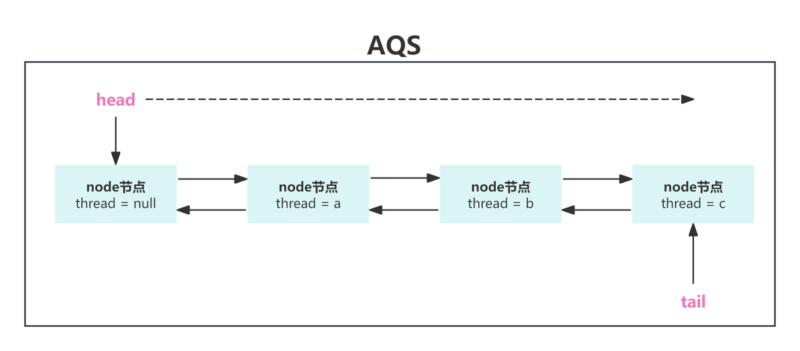

# 技术精华-并发编程工具CountDownLatch和CyclicBarrier介绍

# 线程门栓 CountDownLatch


## 介绍


从字面意思可以理解为类似一个`门栓`，能够使一个线程等待其余线程执行完后，此线程再继续执行。


## 特点


是通过一个`计数器`来实现的，`计数器`的初始值是`线程的数量`。每当一个线程执行完毕后，`计数器`的值就`-1`，当`计数器`的值为`0`时，表示所有线程都执行完毕，然后之前等待的线程就可以恢复工作了。


## 常用的方法


```java
/**
* 构造器
* @param count 计数次数
*/
public CountDownLatch(int count)
/**
* 阻塞等待，当计数不为0会一直等待
*/
public void await()
/**
* 阻塞等待
* @param timeout 等待的时间
* @param unit 时间单位
*/
public boolean await(long timeout, TimeUnit unit)
/**
* 将计数减1
*/
public void countDown()
```


## 举例1


对一个原子类的变量进行统计自增，主线程开启两个线程对这个变量自增加1，两个线程执行完后，主线程再对这个变量自增加1


```java
public static void testCountDownLatch(){
    long startTime = System.currentTimeMillis();
    
    AtomicInteger count = new AtomicInteger(0);
    
    //设置countDownLatch要计数的次数
    CountDownLatch countDownLatch = new CountDownLatch(2);

    new Thread(() -> {
        try {
            Thread.sleep(1000);
            count.incrementAndGet();
        } catch (InterruptedException e) {
            Thread.currentThread().interrupt();
        }finally {
            //计数器减1
            countDownLatch.countDown();
        }
    }).start();
    new Thread(() -> {
        try {
            Thread.sleep(1000);
            count.incrementAndGet();
        } catch (InterruptedException e) {
            Thread.currentThread().interrupt();
        }finally {
            //计数器减1
            countDownLatch.countDown();
        }
    }).start();

    try {
        countDownLatch.await();
    } catch (InterruptedException e) {
        Thread.currentThread().interrupt();
    }

    count.incrementAndGet();
    long endTime = System.currentTimeMillis();
    System.out.println("==次数:"+count.get()+",执行时间:"+(endTime - startTime)+"==");
}
```


**结果：**


```plain
==次数:3,执行时间:1037==
```


## 举例2


可以用线程安全的集合来接收线程返回的结果


```java
public static void testCountDownLatch2(){
    long startTime = System.currentTimeMillis();
    List<String> list = Collections.synchronizedList(new ArrayList<String>());
    
    //设置countDownLatch要计数的次数
    CountDownLatch countDownLatch = new CountDownLatch(2);

    Thread thread1 = new Thread(() -> {
        try {
            Thread.sleep(1000);
            list.add(Thread.currentThread().getName());
        } catch (InterruptedException e) {
            Thread.currentThread().interrupt();
        } finally {
            //计数器减1
            countDownLatch.countDown();
        }
    });
    thread1.setName("thread-1");
    thread1.start();

    Thread thread2 = new Thread(() -> {
        try {
            Thread.sleep(1000);
            list.add(Thread.currentThread().getName());
        } catch (InterruptedException e) {
            Thread.currentThread().interrupt();
        } finally {
            //计数器减1
            countDownLatch.countDown();
        }
    });
    thread2.setName("thread-2");
    thread2.start();

    try {
        countDownLatch.await();
    } catch (InterruptedException e) {
        Thread.currentThread().interrupt();
    }

    long endTime = System.currentTimeMillis();
    System.out.println("集合元素:");
    list.stream().forEach(System.out::println);
    System.out.println("执行时间:");
    System.out.println((endTime - startTime));
}
```


**结果：**


```plain
集合元素:
thread-2
thread-1
执行时间:
1042
```


## 注意


在调用`countDown()`方法时，finally代码块中调用，要保证计数器一定会成功的`减1`。


## 执行过程


1. 调用构造方法将计数值传入AQS的 **state** 变量中
2. 调用await方法将要阻塞的线程 **thread** 形成 **node** 节点，放入AQS队列中
3. 其他线程调用 **countDown** 方法将AQS中的 **state** 值进行减1，直到为0时，就会唤醒 **head** 节点的下一个 **node**
4. 唤醒后的 **node** 节点，会将其中的 thread 和前序节点置为null，此节点就为新的 **head** 节点
5. 重复以上步骤 **head** 会在队列中逐渐后移，直至队列中的 **node** 节点全部唤醒
6. 当node节点全部唤醒后，**head** 和 **tail** 为同一个 **node** 节点

# CyclicBarrier


## 介绍


从这个词的含义就能知道这是一个`栅栏`，可以指定让多个线程都在栅栏处等待住，直到到达栅栏的线程数到了指定的数量，再让通过，而且可以设置一个任务当都到达了`栅栏`时再运行。


## 常用方法


```java
/**
* 构造器
* @param parties 要在栅栏处等待的线程数量
*/
public CyclicBarrier(int parties)
/**
* 构造器
* @param parties 要在栅栏处等待的线程数量
* @param barrierAction 设置的栅栏处等待的线程都通过后执行的任务
*/
public CyclicBarrier(int parties, Runnable barrierAction)
/**
* 调用此方法表示到达了栅栏在此等待
*/
public int await()
/**
* 调用此方法表示到达了栅栏在此等待
* @param timeout 在栅栏处等待的时间
* @param unit 在栅栏处等待的时间单位
*/
public int await(long timeout, TimeUnit unit)
```


## 举例


```java
public class CyclicBarrierTest {

    public static String getThreadName(Integer i){
        return "thread-" + i;
    }
    public static void cyclicBarrierTest1(){

        ExecutorService executorService = 
                Executors.newFixedThreadPool(Runtime.getRuntime().availableProcessors() + 1);

        //设置要在栅栏等待数量为5个
        CyclicBarrier cyclicBarrier = new CyclicBarrier(5,() -> {
            System.out.println("===所有的线程都冲过了栅栏===");
        });

        List<Runnable> list = new ArrayList<>();
        for (int i = 1 ; i <= 5 ; i++) {
            int temporaryVariate = i;
            list.add(() -> {
                try{
                    System.out.println("==="+getThreadName(temporaryVariate)+"在栅栏等待====");
                    cyclicBarrier.await();
                    TimeUnit.SECONDS.sleep(2);
                    System.out.println("==="+getThreadName(temporaryVariate)+"冲过了栅栏====");
                } catch (InterruptedException e) {
                    e.printStackTrace();
                } catch (BrokenBarrierException e) {
                    e.printStackTrace();
                }
            });
        }
        for (Runnable runnable : list) {
            executorService.execute(runnable);
        }
    }

    public static void main(String[] args) {
        cyclicBarrierTest1();
    }
}
```


**结果：**


```plain
===thread-2在栅栏等待====
===thread-5在栅栏等待====
===thread-4在栅栏等待====
===thread-3在栅栏等待====
===thread-1在栅栏等待====
=====所有的线程都冲过了栅栏=====
===thread-2冲过了栅栏====
===thread-5冲过了栅栏====
===thread-1冲过了栅栏====
===thread-3冲过了栅栏====
===thread-4冲过了栅栏====
```


# Semaphore


## 介绍


从字面意思可能理解是一个`信号量`，作用是能够控制执行的线程数。


## 特点


首先设置好`信号量`的数量，当拿到了`信号量`的线程就可以运行，`信号量`就减1。执行完再把`信号量`归还回去，`信号量`就加1。而没有获得到`信号量`的线程就要等待其他的线程归还后，拿到了`信号量`才可以运行。


## 常用的方法


```java
/**
* 构造器
* @param permits 信号量的数量
*/
public Semaphore(int permits)
/**
* 构造器
* @param permits 信号量的数量
* @param fair 是否支持公平性
*/
public Semaphore(int permits, boolean fair)
/**
* 获取信号量
*/
public void acquire()
/**
* 获取信号量
* @param permits 获取信号量的数量
*/
public void acquire(int permits)
/**
* 尝试获取信号量
*/
public boolean tryAcquire()
/**
* 尝试获取信号量
* @param timeout 尝试获取的时间
* @param unit 时间单位
*/
public boolean tryAcquire(long timeout, TimeUnit unit)
/**
* 释放信号量
*/
public void release()
```


## 举例


```java
public class SemaphoreTest {
    public static String getThreadName(Integer i){
        return "thread-" + i;
    }
    public static void SemaphoreTest(){
        ExecutorService executorService = Executors
                  .newFixedThreadPool(Runtime.getRuntime().availableProcessors() + 1);
        //设置信号量为5个          
        Semaphore semaphore = new Semaphore(5);

        List<Runnable> list = new ArrayList<>();
        for (int i = 1 ; i <= 10 ; i++) {
            int temporaryVariate = i;
            list.add(() -> {
                try{
                    semaphore.acquire();
                    System.out.println("==="+getThreadName(temporaryVariate)+"拿到了信号量====");
                    TimeUnit.SECONDS.sleep(2);
                } catch (InterruptedException e) {
                    e.printStackTrace();
                } finally{
                    System.out.println("==="+getThreadName(temporaryVariate)+"归还了信号量====");
                    semaphore.release();
                }
            });
        }
        for (Runnable runnable : list) {
            executorService.execute(runnable);
        }
    }
    public static void main(String[] args) {
        SemaphoreTest();
    }
}
```


**结果：**


```plain
===thread-3拿到了信号量====
===thread-5拿到了信号量====
===thread-4拿到了信号量====
===thread-2拿到了信号量====
===thread-1拿到了信号量====
===thread-5归还了信号量====
===thread-4归还了信号量====
===thread-2归还了信号量====
===thread-3归还了信号量====
===thread-1归还了信号量====
===thread-9拿到了信号量====
===thread-10拿到了信号量====
===thread-8拿到了信号量====
===thread-7拿到了信号量====
===thread-6拿到了信号量====
===thread-7归还了信号量====
===thread-6归还了信号量====
===thread-8归还了信号量====
===thread-9归还了信号量====
===thread-10归还了信号量====
```


> 更新: 2024-04-11 19:55:39  
> 原文: <https://www.yuque.com/u22210564/ykdrdh/lirm8ril14bfzvih>