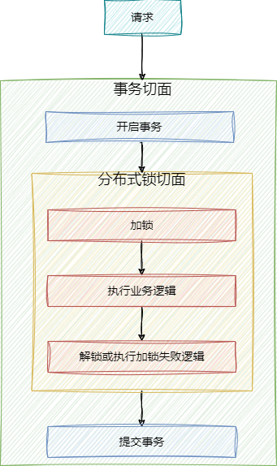
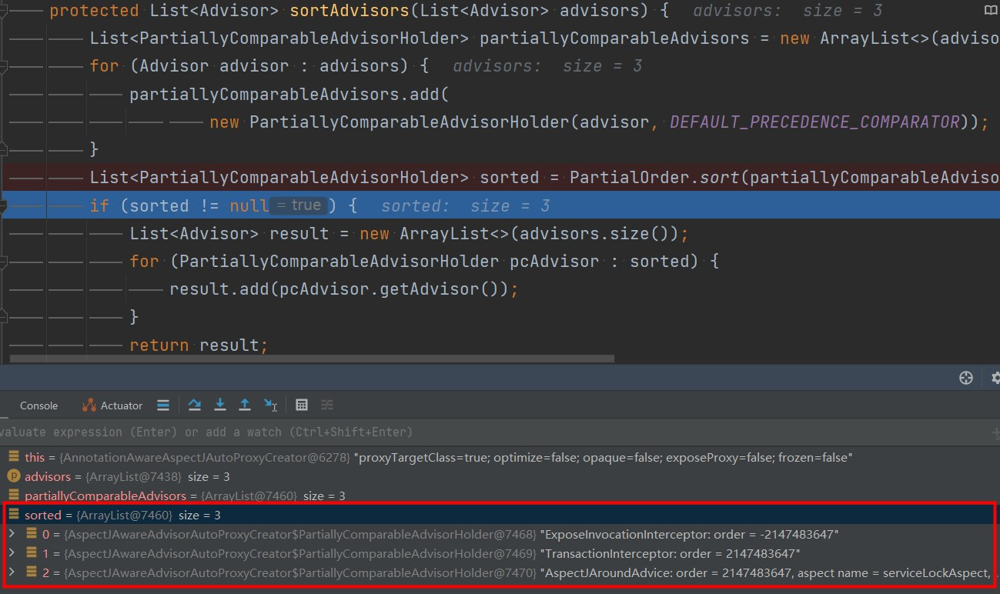
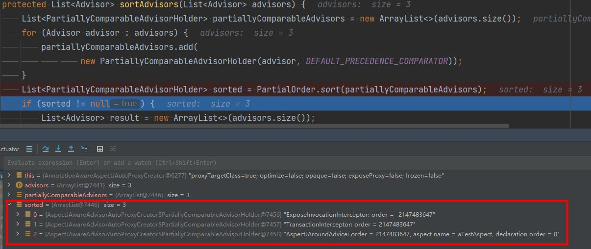
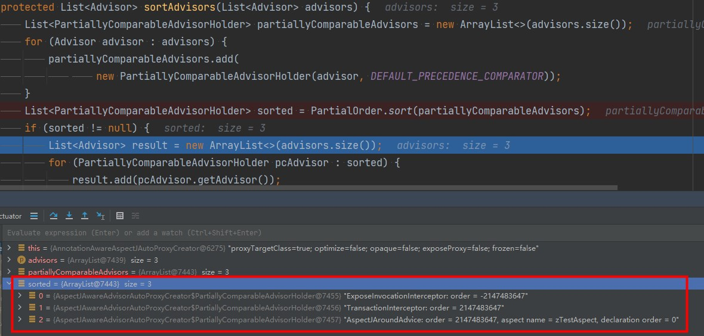
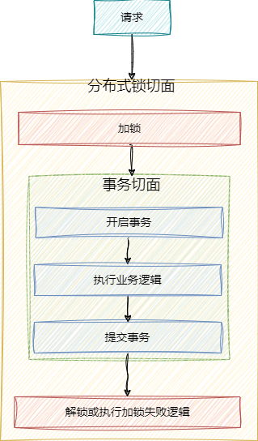
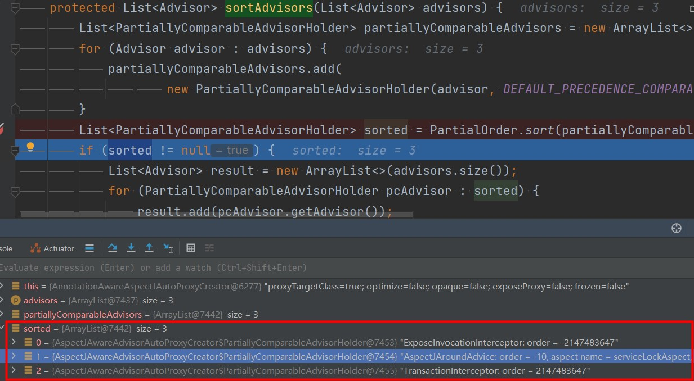

# 技术精华-深入剖析分布式锁与事务在生产中的“疑难杂症”

# 前言


这里是使用了 **Redssion ，**并在其基础上进行了封装以及使用自定义注解，并且结合了Spring的环绕切面来实现分布式锁的功能


# 代码示例


### 业务代码


```java
@RequestMapping("insertNumber/{number}/{id}")
public boolean insertNumber(@PathVariable Long number,@PathVariable Long id){
    return testService.insertNumber(number,id);
}
```


```java
@Transactional
@ServiceLock(name = "insertNumber",keys = {"#id"},waitTime = 50)
public boolean insertNumber(final Long number, final Long id) {
    Test test = testMapper.getById(id);
    Long originalNumber = test.getNumber();
    originalNumber = originalNumber + number;
    test.setNumber(originalNumber);
    testMapper.updateById(test);
    return true;
}
```


逻辑很简单，根据id查出test对象后，在原有基础上增加number值，然后更新到数据库中。


### 锁的切面


```java
@Aspect
public class ServiceLockAspect {

    @Around("@annotation(servicelock)")
    public Object around(ProceedingJoinPoint joinPoint, ServiceLock servicelock) throws Throwable {
        //解析出加锁的键
        String lockName = (joinPoint,servicelock);
        //进行加锁
        boolean reuslt = lock.lock(lockName);
        //如果加锁成功
        if (reuslt) {
            try {
                //执行业务逻辑
                return joinPoint.proceed();
            }finally{
                //解锁
                lock.unlock(lockName);
            }
        }else {
            //等待或者执行加锁失败的处理逻辑
        }
    }
}
```


#### 问题


在实际压测中发现并不能保证数据的正确性，比如设置一秒内发出1000个请求，参数number为1，正确结果应该是1000，但实际结果要比1000小


这是一个很细节的问题，在分布式锁的方法级别使用上也会存在，网上关于分布式的实例和课程有很多，但几乎都没有说到这个问题，这体现出了项目到底是不是真实性的，因为生产中会复现出非常多的细节问题，大麦网项目也是讲这些细节都会讲解到，让小伙伴真正的掌握，体现的就是**真实性**


## 分析


Spring中的事务本质上也是一个切面，这是如果在service方法加锁的话，这时也就是该方法上同时存在 **锁的切面** 和 **事务的切面**，Spring会将事务的切面和锁的切面放在一个切面 **有序集合** 中，然后依次的执行，这其实也是责任链模式。


而在执行顺序中是 **有讲究的**，如果采用上述代码，那么执行的顺序就是**<font style="color:#213BC0;"> 1事务 2锁</font>**  



### AspectJAwareAdvisorAutoProxyCreator#sortAdvisors 切面的默认加载顺序





### 切面默认加载顺序说明


这个顺序是怎么确定的呢，就要看下事务切面和锁切面都是在什么时候放在链路集合中的


#### AbstractAdvisorAutoProxyCreator#findEligibleAdvisors


```java
protected List<Advisor> findEligibleAdvisors(Class<?> beanClass, String beanName) {
  //查找切面
  List<Advisor> candidateAdvisors = findCandidateAdvisors();
  List<Advisor> eligibleAdvisors = findAdvisorsThatCanApply(candidateAdvisors, beanClass, beanName);
  extendAdvisors(eligibleAdvisors);
  if (!eligibleAdvisors.isEmpty()) {
    //将切面集合进行排序
    eligibleAdvisors = sortAdvisors(eligibleAdvisors);
  }
  return eligibleAdvisors;
}
```


#### AnnotationAwareAspectJAutoProxyCreator#findCandidateAdvisors


```java
protected List<Advisor> findCandidateAdvisors() {
  //这里从父类找到了事务切面，并放入到advisors中
  List<Advisor> advisors = super.findCandidateAdvisors();
  // Build Advisors for all AspectJ aspects in the bean factory.
  if (this.aspectJAdvisorsBuilder != null) {
    //这里找到了锁的切面，放入到advisors
    advisors.addAll(this.aspectJAdvisorsBuilder.buildAspectJAdvisors());
  }
  return advisors;
}
```


可以看到是先是父类找到了事务的切面放到了`advisors`集合中，后来又找到了锁的切面也放到了`advisors`集合中


后续的`sortAdvisors`方法是针对`@order`值来排序，而事务和锁的切面都为`Integer.MAX_VALUE`，来分析一下排序逻辑


#### org.aspectj.util.PartialOrder#sort


```java
/**
 * @param objects must all implement PartialComparable
 * 
 * @returns the same members as objects, but sorted according to their partial order. returns null if the objects are cyclical
 * 
 */
public static List sort(List objects) {
	// lists of size 0 or 1 don't need any sorting
	if (objects.size() < 2) {//一个的话，不用排序，直接返回
		return objects;
	}

	// ??? we might want to optimize a few other cases of small size

	// ??? I don't like creating this data structure, but it does give good
	// ??? separation of concerns.
    // 这里上边解释了半天，是他不想构造这个数据结构，但是又觉得这个数据结构可以分离很多复杂的逻辑
    // 下边这个方法是构造了一个SortObject，将advisors列表中每个元素，都用SortObject包装一下，包装后，里面会保存比当前这个advisor大的元素有几个，小的有几个，这样两个列表，后边的逻辑中会根据这两个列表中的值，进行具体的排序比较
	List<SortObject> sortList = new LinkedList<SortObject>(); // objects.size());
	for (Iterator i = objects.iterator(); i.hasNext();) {
		addNewPartialComparable(sortList, (PartialComparable) i.next());//将advisor包装成SortObject，并加入sortList
	}

	// System.out.println(sortList);

	// now we have built our directed graph
	// use a simple sort algorithm from here
	// can increase efficiency later
	// List ret = new ArrayList(objects.size());
	final int N = objects.size();
	//下边会进行两次嵌套的遍历，从sortList中选出最小的，放入objects中
	for (int index = 0; index < N; index++) {
		// System.out.println(sortList);
		// System.out.println("-->" + ret);

		SortObject leastWithNoSmallers = null;

		for (Iterator i = sortList.iterator(); i.hasNext();) {
			SortObject so = (SortObject) i.next();
			// System.out.println(so);
			//判断有无更小的对象，如果没有，则当前的对象为最小
			if (so.hasNoSmallerObjects()) {
				if (leastWithNoSmallers == null || 
					//fallbackCompareTo总会返回0
					so.object.fallbackCompareTo(leastWithNoSmallers.object) < 0) {
					leastWithNoSmallers = so;
				}
			}
		}

		if (leastWithNoSmallers == null) {
			return null;
		}
		//从sortList中移除最小的对象，这个会遍历sortList中的所有对象，从各个对象保存比自己小的对象的列表中移除掉
		removeFromGraph(sortList, leastWithNoSmallers);
		//从SortObject中取出advisor，放入objects列表中
		objects.set(index, leastWithNoSmallers.object);
	}

	return objects;
}
```


#### 总结


+ 初始化时，将所有切面加载到一个域成员变量的Map缓存中，加载时会将每个切面类中的切面方法进行排序
+ 切面方法中的排序方式，首先根据切面注解触发的顺序排序，然后根据字母序进行排序
+ 初始化完成后，每个切面类中的切面方法的顺序就不会再次改变了
+ 每次调用切面命中的业务代码时，会触发切面扫描，筛选出匹配的切面方法，根据切面方法所在的切面类，通过order属性的值，做一次排序，这次排序不会更改之前同一个类型中切面方法的相对顺序
+ 根据上边几步的排序结果，依次触发切面的逻辑


上面分析的排序是指业务切面之间的排序逻辑，但是当业务切面和事务切面都存在的话，如果不指定order的值，那么事务切面的执行顺序始终都会先于业务切面，不会按照切面名字来排序。


#### 事务切面和aTestAspect切面





#### 事务切面和zTestAspect切面


  


**<font style="color:#213BC0;">可以看到事务切面始终都在业务切面先执行</font>**


## 修改源码复现问题


通过上述源码级别的分析我们知道了问题就在开启事务和提交事务这部分，因为锁是在事务里面，所以 **开始事务和提交事务部分是没有被锁住的。**


为了能更好的压测出问题，本人通过修改Spring事务切面的源码，在执行业务逻辑和提交事务中间的这块加上休眠时间


#### TransactionAspectSupport 事务切面


```java
protected Object invokeWithinTransaction(Method method, @Nullable Class<?> targetClass,
        final InvocationCallback invocation) throws Throwable {

    // If the transaction attribute is null, the method is non-transactional.
    TransactionAttributeSource tas = getTransactionAttributeSource();
    final TransactionAttribute txAttr = (tas != null ? tas.getTransactionAttribute(method, targetClass) : null);
    final TransactionManager tm = determineTransactionManager(txAttr);


    PlatformTransactionManager ptm = asPlatformTransactionManager(tm);
    final String joinpointIdentification = methodIdentification(method, targetClass, txAttr);

    if (txAttr == null || !(ptm instanceof CallbackPreferringPlatformTransactionManager)) {
        // 开启事务
        TransactionInfo txInfo = createTransactionIfNecessary(ptm, txAttr, joinpointIdentification);

        Object retVal;
        try {
            //执行业务逻辑
            retVal = invocation.proceedWithInvocation();
            //休眠200ms
            Thread.sleep(200);
        }
        catch (Throwable ex) {
            //回滚事务
            completeTransactionAfterThrowing(txInfo, ex);
            throw ex;
        }
        finally {
            cleanupTransactionInfo(txInfo);
        }
        //提交事务
        commitTransactionAfterReturning(txInfo);
        return retVal;
    }
}
```


发现确实压测每秒100的请求，每次压测数据都不能保证正确性


### 解决


既然知道了原因，那么解决办法就是将锁放到事务外，保证整个事务也被锁住即可解决





那么怎么样 **才能够让锁的切面放到事务切面外呢?**


答案就是使用**@order **** **注解，让锁的切面的顺序先于事务，那么@order的值设置为多少合适呢，事务的order值默认为 **Integer.MAX_VALUE**，考虑到后续可能还要用到切面功能，也需要在锁切面的里面，所以这里我设置为-10


```java
@Aspect
@Order(-10)
public class ServiceLockAspect {
    //省略
}
```


### 使用@order后切面的加载顺序


#### AspectJAwareAdvisorAutoProxyCreator#sortAdvisors


  
可以看到使用@order后切面的顺序达到了我们想要的效果。


经过多次压测后，数据确实保证了正确性


### 总结


由于事务和业务切面的执行顺序问题导致了锁的范围没有将整个事务包裹住，解决方案：


1. 将锁的切面放在controller的方法上，这样锁的切面肯定会先于事务切面执行
2. 如果锁的切面和事务切面在一个方法上，那么指定锁切面的order值，比事务切面order值小即可(事务切面order默认为Integer.MAX_VALUE)


## 关于分布式方法级别的使用


网上有的分布式锁案例使用的是方法级别，例如


```java
lock.lock(lockName);
try {
    //执行逻辑
}finally {
    lock.unLock(lockName);
}
```


一般这都是在service层进行加锁的，所以出现的问题和上述切面问题相同，都是发生了事务切面在锁的切面之前执行，导致**锁没有把事务包裹住**


所以使用这种方法级别的分布式锁，要考虑在Controller控制层加锁或者设计出加锁层，在控制层和service层中间，当加锁后，再调用service的方法


> 更新: 2024-03-26 16:48:04  
> 原文: <https://www.yuque.com/u22210564/ykdrdh/ckv23p0omeaz5ibc>