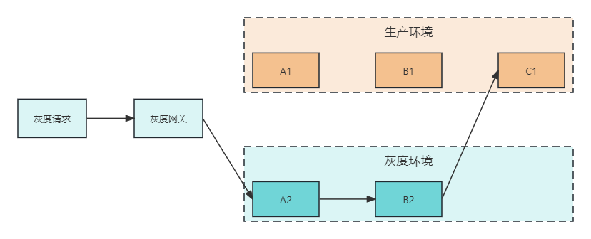

# 技术精华-给你讲透为什么需要灰度环境

# 前言

首先我们要知道为什么需要灰度环境？我发现很多培训机构没有讲到这个知识点，而恰恰这个又是直接能发现面试者有没有真实开发经验的关键。强烈建议对灰度不了解的小伙伴要看看这段详细的介绍

在软件开发中，灰度环境（也称为灰度测试环境或预发布环境）是介于测试环境（开发者用于构建和初步测试新功能的地方）和生产环境（最终用户使用的实际环境）之间的一个过渡环境。灰度环境的主要目的是模拟生产环境的设置，包括数据库、服务器配置、外部依赖等，以便能够在接近生产条件下进行进一步的测试和优化。以下是灰度环境的几个关键方面和其必要性的解释：

### 什么是灰度环境

+ **模拟生产环境**：灰度环境与生产环境非常相似，这使得开发团队可以在接近真实条件下测试新功能或更新。这包括硬件配置、软件版本、网络连接和安全性设置等
+ **逐步部署**：在灰度环境中，新功能或更新可以逐步推出，首先是给予限定的用户群体，然后根据反馈和性能指标逐步扩大至所有用户。这种方法有助于识别和修复在测试环境中可能未发现的问题

### 为什么需要灰度环境

1. **风险降低**：通过在灰度环境中部署，可以在不影响所有用户的情况下测试新功能的稳定性和可靠性。如果发现重大问题，可以轻松回滚，从而减少了对生产环境的风险
2. **性能评估**：在灰度环境中，可以评估新功能对系统性能的影响，确保在全面部署之前满足性能标准
3. **用户反馈**：逐步推出新功能可以收集早期用户的反馈，这有助于快速迭代和改进产品，提高用户满意度
4. **减少回滚的需要**：通过在灰度环境中捕获和修复问题，可以减少在生产环境中遇到的问题，从而减少了需要回滚更改的情况

在实际中的灰度环境中，灰度环境和生产环境的配置一般都是相同的，包括微服务的服务配置、数据库配置、Redis、Kafka等第三方中间件的配置等。要把这些配置全部隔离，像测试和生产完全用的两套环境这样不现实，因为灰度模拟的就是生产环境下的功能。唯一不同的就是服务，灰度环境有灰度专属的服务，生产环境有生产专属的服务。当灰度服务测试过程中出现问题的话，直接将灰度回滚即可，不会影响到生产的服务

这时就会有个问题，就是灰度服务和生产的服务所连接的服务注册中心问题，按道理来说应该灰度服务有灰度的注册中心，生产服务有生产的注册中心。这样确实可以。

但认真想想真的有必要特意用两个注册中心吗？灰度服务的特点是处于在最后一步的测试流程，一旦测试流程通过后，会发布到生产上，灰度和生产的配置还都相同，所以其实灰度和生产都在相同的注册中心上

#### 灰度/生产环境共同注册中心好处

1. **环境一致性**：共用一个服务注册中心可以确保灰度环境和生产环境在服务发现和配置管理方面保持一致。这有助于减少因环境配置差异而引起的问题，使灰度测试更加接近真实的生产条件
2. **简化运维**：维护一个共用的服务注册中心而非多个环境各自的注册中心，可以简化运维工作，减少运维成本和复杂性
3. **快速回滚和发布**：在同一个注册中心管理下，可以更加容易和快速地在灰度环境和生产环境之间进行切换，便于快速回滚或推广更新

#### 需要注意的问题

1. **隔离性问题**：最大的潜在问题是灰度环境和生产环境之间的隔离性。共用服务注册中心可能会导致灰度服务意外地被生产环境的服务消费者发现和调用，从而引入不稳定性和安全风险
2. **资源竞争**：如果灰度环境和生产环境的服务注册到同一个注册中心，可能会出现资源竞争的情况，如带宽、连接数等，这可能对生产环境的性能和稳定性产生负面影响
3. **配置管理**：共用注册中心需要非常小心地管理服务配置，以确保灰度环境的配置更新不会影响生产环境。这要求有更精细的配置管理和版本控制策略
4. **安全和访问控制**：必须确保严格的安全和访问控制措施，以防止灰度环境的服务被未授权的用户访问，特别是在处理敏感数据时

对于使用相同注册中心要实现的核心功能是保证**灰度服务调用灰度服务，生产服务调用生产服务即可**

另外在测试流程中，会有灰度服务需要调用其他的服务这一特点，所以还需要实现**当灰度服务调用灰度服务时，被调用的灰度服务不存在的情况，需要灰度服务能调用到生产的服务**，举例说明：业务中需要 A -> B，A服务为灰度环境 ，B1服务为灰度环境，B2服务为生产环境， 所以当 A -> B1时，B1如果不能存在的话，要可以实现 A -> B2

下面来完整的举例

+  生产环境中存在 A1、B1、C1服务 
+  灰度环境中存在A2、B2服务 
+  从灰度环境发出请求，调用链路为 灰度网关 -> A2 -> B2 -> C1 

以上就是将灰度环境的作用介绍完毕，而在大麦网项目中，支持这种灰度调用的功能，关于详细的设计介绍，可跳转到相关文档

[组件讲解-设计灰度环境服务调用](https://www.yuque.com/u22210564/ykdrdh/elv3nm24qh4prlmg)

> 更新: 2024-03-26 16:57:59  
> 原文: <https://www.yuque.com/u22210564/ykdrdh/eqp5r4tvlefru82h>