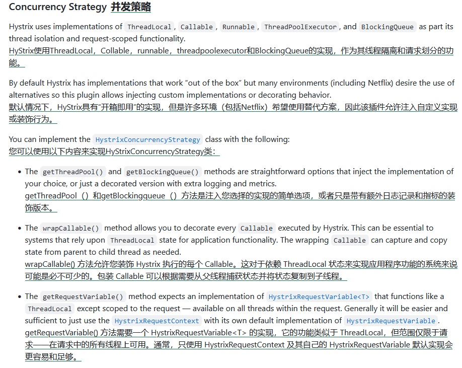

# 技术精华-详解Hystrix传递ThreadLocal数据失效问题

# 场景


在springcloud微服务体系下，从网关层开始要在request请求头放置一些重要参数，比如traceId，并要求在fegin之间的调用时，也能够一直传递下去，由于实际项目使用中，都是fegin集成了hystrix一起配合使用的，而hystrix有两种模式，一种信号量，一种线程池，我们业务中需要使用线程池模式，而且hystrix也是推荐这种。


# 问题


使用线程池模式就会存在问题，因为Tomcat中的HttpServletRequest是会复用的，当请求从发送到结束后此request就会被回收，如果在此开启线程就会出现获取request中参数为null的问题，hystrix的线程池同样会遇到此问题。详细的request与线程池的关系查看这篇文章，分析的很全面 

[千万不要把Request传递到异步线程里面！有坑！ - 掘金](https://juejin.cn/post/7121564878988378126)


# 思路


我们可以自定义线程池来解决，先从官网的github入手，有没有提供类似的方案 [hystrix官方wiki](https://github.com/Netflix/Hystrix/wiki/Plugins)  
  
重点是`HystrixConcurrencyStrategy`的`getThreadPool()`和`wrapCallable()`，尤其是`wrapCallable()`正是我们想实现的功能，那么到底具体怎么使用呢。我们需要从源码来入手


# 寻找关键点


**因为从fegin动态代理生成的，所以直接从**`**HystrixInvocationHandler**`**的**`**invoke**`**入手，来查找关键点就是线程池的创建**


```java
public Object invoke(final Object proxy, final Method method, final Object[] args)
    throws Throwable {
  
  HystrixCommand<Object> hystrixCommand =
      new HystrixCommand<Object>(setterMethodMap.get(method)) {
        /**
         * 省略
         * */
      };

  return hystrixCommand.execute();
}
```


`HystrixCommand`是核心的执行类，继续分析  
**HystrixCommand构造方法**


```java
protected HystrixCommand(Setter setter) {
    // use 'null' to specify use the default
    this(setter.groupKey, setter.commandKey, setter.threadPoolKey, null, null, setter.commandPropertiesDefaults, setter.threadPoolPropertiesDefaults, null, null, null, null, null);
}
```


注意，第五个参数是HystrixThreadPool类型，这里传入的是null，


```java
HystrixCommand(HystrixCommandGroupKey group, HystrixCommandKey key, HystrixThreadPoolKey threadPoolKey, HystrixCircuitBreaker circuitBreaker, HystrixThreadPool threadPool,
        HystrixCommandProperties.Setter commandPropertiesDefaults, HystrixThreadPoolProperties.Setter threadPoolPropertiesDefaults,
        HystrixCommandMetrics metrics, TryableSemaphore fallbackSemaphore, TryableSemaphore executionSemaphore,
        HystrixPropertiesStrategy propertiesStrategy, HystrixCommandExecutionHook executionHook) {
    super(group, key, threadPoolKey, circuitBreaker, threadPool, commandPropertiesDefaults, threadPoolPropertiesDefaults, metrics, fallbackSemaphore, executionSemaphore, propertiesStrategy, executionHook);
}
```


调用父类`AbstractCommand`的构造方法，`threadpool`传入的依然是null  
**AbstractCommand**


```java
protected AbstractCommand(HystrixCommandGroupKey group, HystrixCommandKey key, HystrixThreadPoolKey threadPoolKey, HystrixCircuitBreaker circuitBreaker, HystrixThreadPool threadPool,
        HystrixCommandProperties.Setter commandPropertiesDefaults, HystrixThreadPoolProperties.Setter threadPoolPropertiesDefaults,
        HystrixCommandMetrics metrics, TryableSemaphore fallbackSemaphore, TryableSemaphore executionSemaphore,
        HystrixPropertiesStrategy propertiesStrategy, HystrixCommandExecutionHook executionHook) {

    this.commandGroup = initGroupKey(group);
    this.commandKey = initCommandKey(key, getClass());
    this.properties = initCommandProperties(this.commandKey, propertiesStrategy, commandPropertiesDefaults);
    this.threadPoolKey = initThreadPoolKey(threadPoolKey, this.commandGroup, this.properties.executionIsolationThreadPoolKeyOverride().get());
    this.metrics = initMetrics(metrics, this.commandGroup, this.threadPoolKey, this.commandKey, this.properties);
    this.circuitBreaker = initCircuitBreaker(this.properties.circuitBreakerEnabled().get(), circuitBreaker, this.commandGroup, this.commandKey, this.properties, this.metrics);
    //这里就是在创建hystrix的threadpool，入参依旧为null
    this.threadPool = initThreadPool(threadPool, this.threadPoolKey, threadPoolPropertiesDefaults);

    //Strategies from plugins
    this.eventNotifier = HystrixPlugins.getInstance().getEventNotifier();
    this.concurrencyStrategy = HystrixPlugins.getInstance().getConcurrencyStrategy();
    HystrixMetricsPublisherFactory.createOrRetrievePublisherForCommand(this.commandKey, this.commandGroup, this.metrics, this.circuitBreaker, this.properties);
    this.executionHook = initExecutionHook(executionHook);

    this.requestCache = HystrixRequestCache.getInstance(this.commandKey, this.concurrencyStrategy);
    this.currentRequestLog = initRequestLog(this.properties.requestLogEnabled().get(), this.concurrencyStrategy);

    /* fallback semaphore override if applicable */
    this.fallbackSemaphoreOverride = fallbackSemaphore;

    /* execution semaphore override if applicable */
    this.executionSemaphoreOverride = executionSemaphore;
}
```


`this.threadPool = initThreadPool(threadPool, this.threadPoolKey, threadPoolPropertiesDefaults);`就是真正创建线程池的方法

---

```java
private static HystrixThreadPool initThreadPool(HystrixThreadPool fromConstructor, HystrixThreadPoolKey threadPoolKey, HystrixThreadPoolProperties.Setter threadPoolPropertiesDefaults) {
    //fromConstructor为null，进入if逻辑
    if (fromConstructor == null) {
        // get the default implementation of HystrixThreadPool
        // 官方注释直接说明了这里就是实现自己线程池的关键
        return HystrixThreadPool.Factory.getInstance(threadPoolKey, threadPoolPropertiesDefaults);
    } else {
        return fromConstructor;
    }
}
```


**HystrixThreadPool.Factory#getInstance**


```java
static HystrixThreadPool getInstance(HystrixThreadPoolKey threadPoolKey, HystrixThreadPoolProperties.Setter propertiesBuilder) {
    // 获取要使用的键，而不是使用对象本身，这样如果人们忘记实现equals/hashcode，事情仍然可以工作
    // 这里是@FeignClient的value值
    String key = threadPoolKey.name();

    // 查找缓存，根据线程池的key，查找对应的线程池
    HystrixThreadPool previouslyCached = threadPools.get(key);
    if (previouslyCached != null) {
        return previouslyCached;
    }

    // if we get here this is the first time so we need to initialize
    synchronized (HystrixThreadPool.class) {
        if (!threadPools.containsKey(key)) {
            //第一次创建缓存中肯定没有，这里进行创建
            threadPools.put(key, new HystrixThreadPoolDefault(threadPoolKey, propertiesBuilder));
        }
    }
    return threadPools.get(key);
}
```


下面线程池的真正创建逻辑了  
**HystrixThreadPoolDefault构造方法**


```java
public HystrixThreadPoolDefault(HystrixThreadPoolKey threadPoolKey, HystrixThreadPoolProperties.Setter propertiesDefaults) {
    //获取线程池的相关参数
    this.properties = HystrixPropertiesFactory.getThreadPoolProperties(threadPoolKey, propertiesDefaults);
    //从HystrixPlugins.getInstance()获取一个HystrixConcurrencyStrategy类型的对象
    HystrixConcurrencyStrategy concurrencyStrategy = HystrixPlugins.getInstance().getConcurrencyStrategy();
    this.queueSize = properties.maxQueueSize().get();

    this.metrics = HystrixThreadPoolMetrics.getInstance(threadPoolKey,
            //这里通过concurrencyStrategy.getThreadPool的这个操作去创建线程池
            concurrencyStrategy.getThreadPool(threadPoolKey, properties),
            properties);
    this.threadPool = this.metrics.getThreadPool();
    this.queue = this.threadPool.getQueue();

    /* strategy: HystrixMetricsPublisherThreadPool */
    HystrixMetricsPublisherFactory.createOrRetrievePublisherForThreadPool(threadPoolKey, this.metrics, this.properties);
}
```


+ `HystrixPlugins.getInstance().getConcurrencyStrategy()`得到的`HystrixConcurrencyStrategy`就是在开始时提到的官网提供的插件，可见此方法是特别的重要
+ `concurrencyStrategy.getThreadPool(threadPoolKey, properties)`就是真正创建线程池的逻辑


**HystrixPlugins.getInstance().getConcurrencyStrategy()**


```java
public HystrixConcurrencyStrategy getConcurrencyStrategy() {
    if (concurrencyStrategy.get() == null) {
        // check for an implementation from Archaius first
        //获取自定义的HystrixConcurrencyStrategy如果找到则设置，否则设置为HystrixConcurrencyStrategyDefault默认
        Object impl = getPluginImplementation(HystrixConcurrencyStrategy.class);
        if (impl == null) {
            // nothing set via Archaius so initialize with default
            concurrencyStrategy.compareAndSet(null, HystrixConcurrencyStrategyDefault.getInstance());
            // we don't return from here but call get() again in case of thread-race so the winner will always get returned
        } else {
            // we received an implementation from Archaius so use it
            concurrencyStrategy.compareAndSet(null, (HystrixConcurrencyStrategy) impl);
        }
    }
    return concurrencyStrategy.get();
}
```


下面进入`getPluginImplementation(HystrixConcurrencyStrategy.class)`看看是怎么获取自定义`HystrixConcurrencyStrategy`  
**HystrixPlugins#getPluginImplementation**


```java
private <T> T getPluginImplementation(Class<T> pluginClass) {
        //从一个动态属性中获取，如果集成了Netflix Archaius就可以动态获取属性，类似于一个配置中心，所以这个不是我们想要的
        T p = getPluginImplementationViaProperties(pluginClass, dynamicProperties);
        if (p != null) return p;
        //利用spi机制进行查找
        return findService(pluginClass, classLoader);
    }
```


```java
private static <T> T findService(
        Class<T> spi, 
        ClassLoader classLoader) throws ServiceConfigurationError {

    ServiceLoader<T> sl = ServiceLoader.load(spi,
            classLoader);
    for (T s : sl) {
        if (s != null)
            return s;
    }
    return null;
}
```


+ 获取自定义的`HystrixConcurrencyStrategy`，通过spi机制进行查找
+ 如果找不到则设置为默认的`HystrixConcurrencyStrategyDefault`


到这里我们知道了，肯定是要在此方法中通过spi机制来实现我们自定义的`HystrixConcurrencyStrategy`从而的得到自己定义的线程池或者对线程进行包装，但我们先接着分析，如果是默认的会怎么执行。


获取到了默认的`HystrixConcurrencyStrategy`也就是`HystrixConcurrencyStrategyDefault`后，接下来就是获取线程池了


**concurrencyStrategy.getThreadPool**


`HystrixConcurrencyStrategyDefault`继承了`HystrixConcurrencyStrategy`，`getThreadPool`是在`HystrixConcurrencyStrategy`中执行的


```java
public ThreadPoolExecutor getThreadPool(final HystrixThreadPoolKey threadPoolKey, HystrixThreadPoolProperties threadPoolProperties) {
    final ThreadFactory threadFactory = getThreadFactory(threadPoolKey);

    final boolean allowMaximumSizeToDivergeFromCoreSize = threadPoolProperties.getAllowMaximumSizeToDivergeFromCoreSize().get();
    final int dynamicCoreSize = threadPoolProperties.coreSize().get();
    final int keepAliveTime = threadPoolProperties.keepAliveTimeMinutes().get();
    final int maxQueueSize = threadPoolProperties.maxQueueSize().get();
    final BlockingQueue<Runnable> workQueue = getBlockingQueue(maxQueueSize);

    if (allowMaximumSizeToDivergeFromCoreSize) {
        final int dynamicMaximumSize = threadPoolProperties.maximumSize().get();
        if (dynamicCoreSize > dynamicMaximumSize) {
            logger.error("Hystrix ThreadPool configuration at startup for : " + threadPoolKey.name() + " is trying to set coreSize = " +
                    dynamicCoreSize + " and maximumSize = " + dynamicMaximumSize + ".  Maximum size will be set to " +
                    dynamicCoreSize + ", the coreSize value, since it must be equal to or greater than the coreSize value");
            return new ThreadPoolExecutor(dynamicCoreSize, dynamicCoreSize, keepAliveTime, TimeUnit.MINUTES, workQueue, threadFactory);
        } else {
            return new ThreadPoolExecutor(dynamicCoreSize, dynamicMaximumSize, keepAliveTime, TimeUnit.MINUTES, workQueue, threadFactory);
        }
    } else {
        return new ThreadPoolExecutor(dynamicCoreSize, dynamicCoreSize, keepAliveTime, TimeUnit.MINUTES, workQueue, threadFactory);
    }
}
```


到这里知道了默认就是创建的JDK的线程池


# 方案


我们知道了要继承`HystrixConcurrencyStrategy`并利用spi机制来实现自定义，看下结构  
**HystrixConcurrencyStrategy**


```java
public abstract class HystrixConcurrencyStrategy {

    private final static Logger logger = LoggerFactory.getLogger(HystrixConcurrencyStrategy.class);

    /**
     * Factory method to provide {@link ThreadPoolExecutor} instances as desired.
     * <p>
     * Note that the corePoolSize, maximumPoolSize and keepAliveTime values will be dynamically set during runtime if their values change using the {@link ThreadPoolExecutor#setCorePoolSize},
     * {@link ThreadPoolExecutor#setMaximumPoolSize} and {@link ThreadPoolExecutor#setKeepAliveTime} methods.
     * <p>
     * <b>Default Implementation</b>
     * <p>
     * Implementation using standard java.util.concurrent.ThreadPoolExecutor
     * 
     * @param threadPoolKey
     *            {@link HystrixThreadPoolKey} representing the {@link HystrixThreadPool} that this {@link ThreadPoolExecutor} will be used for.
     * @param corePoolSize
     *            Core number of threads requested via properties (or system default if no properties set).
     * @param maximumPoolSize
     *            Max number of threads requested via properties (or system default if no properties set).
     * @param keepAliveTime
     *            Keep-alive time for threads requested via properties (or system default if no properties set).
     * @param unit
     *            {@link TimeUnit} corresponding with keepAliveTime
     * @param workQueue
     *            {@code BlockingQueue<Runnable>} as provided by {@link #getBlockingQueue(int)}
     * @return instance of {@link ThreadPoolExecutor}
     */
    public ThreadPoolExecutor getThreadPool(final HystrixThreadPoolKey threadPoolKey, HystrixProperty<Integer> corePoolSize, HystrixProperty<Integer> maximumPoolSize, HystrixProperty<Integer> keepAliveTime, TimeUnit unit, BlockingQueue<Runnable> workQueue) {
        final ThreadFactory threadFactory = getThreadFactory(threadPoolKey);

        final int dynamicCoreSize = corePoolSize.get();
        final int dynamicMaximumSize = maximumPoolSize.get();

        if (dynamicCoreSize > dynamicMaximumSize) {
            logger.error("Hystrix ThreadPool configuration at startup for : " + threadPoolKey.name() + " is trying to set coreSize = " +
                    dynamicCoreSize + " and maximumSize = " + dynamicMaximumSize + ".  Maximum size will be set to " +
                    dynamicCoreSize + ", the coreSize value, since it must be equal to or greater than the coreSize value");
            return new ThreadPoolExecutor(dynamicCoreSize, dynamicCoreSize, keepAliveTime.get(), unit, workQueue, threadFactory);
        } else {
            return new ThreadPoolExecutor(dynamicCoreSize, dynamicMaximumSize, keepAliveTime.get(), unit, workQueue, threadFactory);
        }
    }

    public ThreadPoolExecutor getThreadPool(final HystrixThreadPoolKey threadPoolKey, HystrixThreadPoolProperties threadPoolProperties) {
        final ThreadFactory threadFactory = getThreadFactory(threadPoolKey);

        final boolean allowMaximumSizeToDivergeFromCoreSize = threadPoolProperties.getAllowMaximumSizeToDivergeFromCoreSize().get();
        final int dynamicCoreSize = threadPoolProperties.coreSize().get();
        final int keepAliveTime = threadPoolProperties.keepAliveTimeMinutes().get();
        final int maxQueueSize = threadPoolProperties.maxQueueSize().get();
        final BlockingQueue<Runnable> workQueue = getBlockingQueue(maxQueueSize);

        if (allowMaximumSizeToDivergeFromCoreSize) {
            final int dynamicMaximumSize = threadPoolProperties.maximumSize().get();
            if (dynamicCoreSize > dynamicMaximumSize) {
                logger.error("Hystrix ThreadPool configuration at startup for : " + threadPoolKey.name() + " is trying to set coreSize = " +
                        dynamicCoreSize + " and maximumSize = " + dynamicMaximumSize + ".  Maximum size will be set to " +
                        dynamicCoreSize + ", the coreSize value, since it must be equal to or greater than the coreSize value");
                return new ThreadPoolExecutor(dynamicCoreSize, dynamicCoreSize, keepAliveTime, TimeUnit.MINUTES, workQueue, threadFactory);
            } else {
                return new ThreadPoolExecutor(dynamicCoreSize, dynamicMaximumSize, keepAliveTime, TimeUnit.MINUTES, workQueue, threadFactory);
            }
        } else {
            return new ThreadPoolExecutor(dynamicCoreSize, dynamicCoreSize, keepAliveTime, TimeUnit.MINUTES, workQueue, threadFactory);
        }
    }

    private static ThreadFactory getThreadFactory(final HystrixThreadPoolKey threadPoolKey) {
        if (!PlatformSpecific.isAppEngineStandardEnvironment()) {
            return new ThreadFactory() {
                private final AtomicInteger threadNumber = new AtomicInteger(0);

                @Override
                public Thread newThread(Runnable r) {
                    Thread thread = new Thread(r, "hystrix-" + threadPoolKey.name() + "-" + threadNumber.incrementAndGet());
                    thread.setDaemon(true);
                    return thread;
                }

            };
        } else {
            return PlatformSpecific.getAppEngineThreadFactory();
        }
    }

    /**
     * Factory method to provide instance of {@code BlockingQueue<Runnable>} used for each {@link ThreadPoolExecutor} as constructed in {@link #getThreadPool}.
     * <p>
     * Note: The maxQueueSize value is provided so any type of queue can be used but typically an implementation such as {@link SynchronousQueue} without a queue (just a handoff) is preferred as
     * queueing is an anti-pattern to be purposefully avoided for latency tolerance reasons.
     * <p>
     * <b>Default Implementation</b>
     * <p>
     * Implementation returns {@link SynchronousQueue} when maxQueueSize <= 0 or {@link LinkedBlockingQueue} when maxQueueSize > 0.
     * 
     * @param maxQueueSize
     *            The max size of the queue requested via properties (or system default if no properties set).
     * @return instance of {@code BlockingQueue<Runnable>}
     */
    public BlockingQueue<Runnable> getBlockingQueue(int maxQueueSize) {
        /*
         * We are using SynchronousQueue if maxQueueSize <= 0 (meaning a queue is not wanted).
         * <p>
         * SynchronousQueue will do a handoff from calling thread to worker thread and not allow queuing which is what we want.
         * <p>
         * Queuing results in added latency and would only occur when the thread-pool is full at which point there are latency issues
         * and rejecting is the preferred solution.
         */
        if (maxQueueSize <= 0) {
            return new SynchronousQueue<Runnable>();
        } else {
            return new LinkedBlockingQueue<Runnable>(maxQueueSize);
        }
    }

    /**
     * Provides an opportunity to wrap/decorate a {@code Callable<T>} before execution.
     * <p>
     * This can be used to inject additional behavior such as copying of thread state (such as {@link ThreadLocal}).
     * <p>
     * <b>Default Implementation</b>
     * <p>
     * Pass-thru that does no wrapping.
     * 
     * @param callable
     *            {@code Callable<T>} to be executed via a {@link ThreadPoolExecutor}
     * @return {@code Callable<T>} either as a pass-thru or wrapping the one given
     */
    public <T> Callable<T> wrapCallable(Callable<T> callable) {
        return callable;
    }

    /**
     * Factory method to return an implementation of {@link HystrixRequestVariable} that behaves like a {@link ThreadLocal} except that it
     * is scoped to a request instead of a thread.
     * <p>
     * For example, if a request starts with an HTTP request and ends with the HTTP response, then {@link HystrixRequestVariable} should
     * be initialized at the beginning, available on any and all threads spawned during the request and then cleaned up once the HTTP request is completed.
     * <p>
     * If this method is implemented it is generally necessary to also implemented {@link #wrapCallable(Callable)} in order to copy state
     * from parent to child thread.
     * 
     * @param rv
     *            {@link HystrixRequestVariableLifecycle} with lifecycle implementations from Hystrix
     * @return {@code HystrixRequestVariable<T>}
     */
    public <T> HystrixRequestVariable<T> getRequestVariable(final HystrixRequestVariableLifecycle<T> rv) {
        return new HystrixLifecycleForwardingRequestVariable<T>(rv);
    }
    
}
```


其中`wrapCallable`方法就是我们想要实现的，官方注释说的很详细了，意思是提供在执行前包装可调用对象的机会。这可用于注入其他行为，例如复制线程状态（例如 ThreadLocal），简单看一下`wrapCallable`是怎么被调用的


**HystrixContexSchedulerAction**


```java
public class HystrixContexSchedulerAction implements Action0 {

    private final Action0 actual;
    private final HystrixRequestContext parentThreadState;
    private final Callable<Void> c;

    public HystrixContexSchedulerAction(Action0 action) {
        this(HystrixPlugins.getInstance().getConcurrencyStrategy(), action);
    }

    public HystrixContexSchedulerAction(final HystrixConcurrencyStrategy concurrencyStrategy, Action0 action) {
        this.actual = action;
        this.parentThreadState = HystrixRequestContext.getContextForCurrentThread();

        this.c = concurrencyStrategy.wrapCallable(new Callable<Void>() {

            @Override
            public Void call() throws Exception {
                HystrixRequestContext existingState = HystrixRequestContext.getContextForCurrentThread();
                try {
                    // set the state of this thread to that of its parent
                    HystrixRequestContext.setContextOnCurrentThread(parentThreadState);
                    // execute actual Action0 with the state of the parent
                    actual.call();
                    return null;
                } finally {
                    // restore this thread back to its original state
                    HystrixRequestContext.setContextOnCurrentThread(existingState);
                }
            }
        });
    }

    @Override
    public void call() {
        try {
            c.call();
        } catch (Exception e) {
            throw new RuntimeException("Failed executing wrapped Action0", e);
        }
    }

}
```


**HystrixContextScheduler.HystrixContextSchedulerWorker#schedule(rx.functions.Action0)**


```java
public Subscription schedule(Action0 action) {
    if (threadPool != null) {
        if (!threadPool.isQueueSpaceAvailable()) {
            throw new RejectedExecutionException("Rejected command because thread-pool queueSize is at rejection threshold.");
        }
    }
    return worker.schedule(new HystrixContexSchedulerAction(concurrencyStrategy, action));
}
```


+ 调用concurrencyStrategy.wrapCallable来对wrapCallable进行包装，也就是我们需要做的就是这步
+ 当hystrix执行调用，就是执行包装后的wrapCallable


## 实现自己的concurrencyStrategy对wrapCallable进行包装


### spi机制


**spi文件**


**ExtraHystrixConcurrencyStrategy**


```java
@Log4j2
public class ExtraHystrixConcurrencyStrategy extends HystrixConcurrencyStrategy {
    

    @Override
    public <T> Callable<T> wrapCallable(Callable<T> callable) {
        RequestAttributes requestAttributes = RequestContextHolder.getRequestAttributes();
        return new WrappedCallable<>(callable, requestAttributes);
    }

    static class WrappedCallable<T> implements Callable<T> {

        private final Callable<T> target;
        private final RequestAttributes requestAttributes;

        public WrappedCallable(Callable<T> target, RequestAttributes requestAttributes) {
            this.target = target;
            this.requestAttributes = requestAttributes;
        }

        @Override
        public T call() throws Exception {
            try {
                RequestContextHolder.setRequestAttributes(requestAttributes);
                return target.call();
            } finally {
                RequestContextHolder.resetRequestAttributes();
            }
        }
    }
}
```


### spring容器启动就进行设置


这里是参考sleuth的原理`org.springframework.cloud.sleuth.instrument.hystrix.SleuthHystrixConcurrencyStrategy`


```java
@Configuration(proxyBeanMethods = false)
public class ExtraHystrixAutoConfiguration {

   @Bean
   public ExtraHystrixConcurrencyStrategy extraHystrixConcurrencyStrategy(){
       return new ExtraHystrixConcurrencyStrategy();
   }
}
```


```java
public class ExtraHystrixConcurrencyStrategy extends HystrixConcurrencyStrategy {

    private HystrixConcurrencyStrategy delegate;

    public ExtraHystrixConcurrencyStrategy() {
        try {
            this.delegate = HystrixPlugins.getInstance().getConcurrencyStrategy();
            if (this.delegate instanceof ExtraHystrixConcurrencyStrategy) {
                // Welcome to singleton hell...
                return;
            }
            HystrixCommandExecutionHook commandExecutionHook = HystrixPlugins
                    .getInstance().getCommandExecutionHook();
            HystrixEventNotifier eventNotifier = HystrixPlugins.getInstance()
                    .getEventNotifier();
            HystrixMetricsPublisher metricsPublisher = HystrixPlugins.getInstance()
                    .getMetricsPublisher();
            HystrixPropertiesStrategy propertiesStrategy = HystrixPlugins.getInstance()
                    .getPropertiesStrategy();
            this.logCurrentStateOfHystrixPlugins(eventNotifier, metricsPublisher,
                    propertiesStrategy);
            HystrixPlugins.reset();
            HystrixPlugins.getInstance().registerConcurrencyStrategy(this);
            HystrixPlugins.getInstance()
                    .registerCommandExecutionHook(commandExecutionHook);
            HystrixPlugins.getInstance().registerEventNotifier(eventNotifier);
            HystrixPlugins.getInstance().registerMetricsPublisher(metricsPublisher);
            HystrixPlugins.getInstance().registerPropertiesStrategy(propertiesStrategy);
        }
        catch (Exception e) {
            log.error("Failed to register Sleuth Hystrix Concurrency Strategy", e);
        }
    }

    private void logCurrentStateOfHystrixPlugins(HystrixEventNotifier eventNotifier,
                                                 HystrixMetricsPublisher metricsPublisher,
                                                 HystrixPropertiesStrategy propertiesStrategy) {
        if (log.isDebugEnabled()) {
            log.debug("Current Hystrix plugins configuration is ["
                    + "concurrencyStrategy [" + this.delegate + "]," + "eventNotifier ["
                    + eventNotifier + "]," + "metricPublisher [" + metricsPublisher + "],"
                    + "propertiesStrategy [" + propertiesStrategy + "]," + "]");
            log.debug("Registering Sleuth Hystrix Concurrency Strategy.");
        }
    }

    @Override
    public <T> Callable<T> wrapCallable(Callable<T> callable) {
        RequestAttributes requestAttributes = RequestContextHolder.getRequestAttributes();
        return new WrappedCallable<>(callable, requestAttributes);
    }

    @Override
    public ThreadPoolExecutor getThreadPool(HystrixThreadPoolKey threadPoolKey,
                                            HystrixProperty<Integer> corePoolSize,
                                            HystrixProperty<Integer> maximumPoolSize,
                                            HystrixProperty<Integer> keepAliveTime, TimeUnit unit,
                                            BlockingQueue<Runnable> workQueue) {
        return this.delegate.getThreadPool(threadPoolKey, corePoolSize, maximumPoolSize,
                keepAliveTime, unit, workQueue);
    }

    @Override
    public ThreadPoolExecutor getThreadPool(HystrixThreadPoolKey threadPoolKey,
                                            HystrixThreadPoolProperties threadPoolProperties) {
        return this.delegate.getThreadPool(threadPoolKey, threadPoolProperties);
    }

    @Override
    public BlockingQueue<Runnable> getBlockingQueue(int maxQueueSize) {
        return this.delegate.getBlockingQueue(maxQueueSize);
    }

    @Override
    public <T> HystrixRequestVariable<T> getRequestVariable(
            HystrixRequestVariableLifecycle<T> rv) {
        return this.delegate.getRequestVariable(rv);
    }

    static class WrappedCallable<T> implements Callable<T> {

        private final Callable<T> target;
        private final RequestAttributes requestAttributes;

        public WrappedCallable(Callable<T> target, RequestAttributes requestAttributes) {
            this.target = target;
            this.requestAttributes = requestAttributes;
        }

        @Override
        public T call() throws Exception {
            try {
                RequestContextHolder.setRequestAttributes(requestAttributes);
                return target.call();
            } finally {
                MDC.clear();
                RequestContextHolder.resetRequestAttributes();
            }
        }
    }
}
```


`RequestContextHolder`本质就是一个ThreadLocal，但不建议将request放进入，可以替换为真正ThreadLocal来实现


> 更新: 2024-03-26 16:30:50  
> 原文: <https://www.yuque.com/u22210564/ykdrdh/dsrunfio64aat6nq>