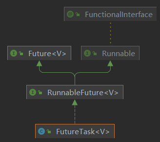

# 技术精华-超详细的Callable/Future原理解析

# Callable/Future


## 介绍


`execute特点`


1. execute 只可以接收一个 Runnable 的参数
2. execute 如果出现异常会抛出
3. execute 没有返回值


`submit特点`


1. submit 可以接收 Runable 和 Callable 这两种类型的参数，
2. 对于 submit 方法，如果传入一个 Callable，可以得到一个 Future 的返回值
3. submit 方法调用不会抛异常，除非调用 Future.get


## 使用


```java
public static void testFutureTask() throws ExecutionException, InterruptedException {
        FutureTask task = new FutureTask(() -> {
            System.out.println("执行异步call方法");
            return 1;
        });
        new Thread(task).start();
        System.out.println("异步结果:"+task.get());
}
```


想一想我们为什么需要使用回调呢？那是因为结果值是由另一线程计算的，当前线程是不知道结果值什么时候计算完成，所以它传递一个回调接口给计算线程，当计算完成时，调用这个回调接口，回传结果值。


利用 FutureTask、 Callable、 Thread 对耗时任务（如查询数据库）做预处理，在需要计算结果之前就启动计算。


## 原理


### Callable、Future、FutureTask关系图





### Callable


Callable是一个函数式接口，只有一个call方法有返回值，可以重写这个方法。


```java
@FunctionalInterface
public interface Callable<V> {
    /**
     * Computes a result, or throws an exception if unable to do so.
     *
     * @return computed result
     * @throws Exception if unable to compute a result
     */
    V call() throws Exception;
}
```


### RunnableFuture


RunnableFuture 是一个接口，它继承了 Runnable 和 Future 这两个接口


```java
public interface RunnableFuture<V> extends Runnable, Future<V> {
    /**
     * Sets this Future to the result of its computation
     * unless it has been cancelled.
     */
    void run();
}
```


### Future


Future 表示一个任务的生命周期，并提供了相应的方法来判断是否已经完成或取消，以及获取任务的结果和取消任务等.


```java
public interface Future<V> {

    boolean cancel(boolean mayInterruptIfRunning);

    // 当前的 Future 是否被取消，返回 true 表示已取消
    boolean isCancelled();

    // 当前 Future 是否已结束。包括运行完成、抛出异常以及取消，都表示当前 Future 已结束
    boolean isDone();

    // 获取 Future 的结果值。如果当前 Future 还没有结束，那么当前线程就等待，
    // 直到 Future 运行结束，那么会唤醒等待结果值的线程的。
    V get() throws InterruptedException, ExecutionException;

    // 获取 Future 的结果值。与 get()相比较多了允许设置超时时间
    V get(long timeout, TimeUnit unit)
        throws InterruptedException, ExecutionException, TimeoutException;
}
```


### FutureTask


`FutureTask` 是 `Runnable` 和 `Future` 的结合，如果我们把 Runnable 比作是生产者， Future 比作是消费者，那么 FutureTask 是被这两者共享的，生产者运行 run 方法计算结果，消费者通过 get 方法获取结果。


作为生产者消费者模式，有一个很重要的机制，就是如果生产者数据还没准备的时候，消费  
者会被阻塞。当生产者数据准备好了以后会唤醒消费者继续执行。


#### state 的含义:表示 FutureTask 当前的状态，分为七种状态


```java
    private volatile int state;
    // NEW 新建状态，表示这个 FutureTask还没有开始运行
    private static final int NEW          = 0;
    // COMPLETING 完成状态， 表示 FutureTask 任务已经计算完毕了
    // 但是还有一些后续操作，例如唤醒等待线程操作，还没有完成。
    private static final int COMPLETING   = 1;
    // FutureTask 任务完结，正常完成，没有发生异常
    private static final int NORMAL       = 2;
    // FutureTask 任务完结，因为发生异常。
    private static final int EXCEPTIONAL  = 3;
    // FutureTask 任务完结，因为取消任务
    private static final int CANCELLED    = 4;
    // FutureTask 任务完结，也是取消任务，不过发起了中断运行任务线程的中断请求
    private static final int INTERRUPTING = 5;
    // FutureTask 任务完结，也是取消任务，已经完成了中断运行任务线程的中断请求
    private static final int INTERRUPTED  = 6;
```


#### run方法


```java
public void run() {
        // 如果状态 state 不是 NEW，或者设置 runner 值失败
        // 表示有别的线程在此之前调用 run 方法，并成功设置了 runner 值
        // 保证了只有一个线程可以运行 try 代码块中的代码。
        if (state != NEW ||
            !UNSAFE.compareAndSwapObject(this, runnerOffset,
                                         null, Thread.currentThread()))
            return;
        try {
            Callable<V> c = callable;
            / 只有 c 不为 null 且状态 state 为 NEW 的情况
            if (c != null && state == NEW) {
                V result;
                boolean ran;
                try {
                    //调用 callable 的 call 方法，并获得返回结果
                    result = c.call();
                    //运行成功
                    ran = true;
                } catch (Throwable ex) {
                    result = null;
                    ran = false;
                    //设置异常结果
                    setException(ex);
                }
                if (ran)
                    //设置结果
                    set(result);
            }
        } finally {
            runner = null;
            int s = state;
            if (s >= INTERRUPTING)
                handlePossibleCancellationInterrupt(s);
        }
}
```


```java
protected void set(V v) {
        if (UNSAFE.compareAndSwapInt(this, stateOffset, NEW, COMPLETING)) {
            outcome = v;
            UNSAFE.putOrderedInt(this, stateOffset, NORMAL); // final state
            finishCompletion();
        }
}

private void finishCompletion() {
        // assert state > COMPLETING;
        for (WaitNode q; (q = waiters) != null;) {
            if (UNSAFE.compareAndSwapObject(this, waitersOffset, q, null)) {
                for (;;) {
                    Thread t = q.thread;
                    if (t != null) {
                        q.thread = null;
                        //任务执行完或出现异常后，将此线程进行唤醒
                        LockSupport.unpark(t);
                    }
                    WaitNode next = q.next;
                    if (next == null)
                        break;
                    q.next = null; // unlink to help gc
                    q = next;
                }
                break;
            }
        }

        done();

        callable = null;        // to reduce footprint
}
```


其实 `run` 方法作用非常简单，就是调用 callable 的 `call` 方法返回结果值 result，根据是否发生异常，调用 set(result)或 setException(ex)方法表示 FutureTask 任务完结。  
不过因为 FutureTask 任务都是在多线程环境中使用，所以要注意并发冲突问题。注意在 run 方法中，我们没有使用 synchronized 代码块或者 Lock 来解决并发问题，而是使用了 CAS 这个乐观锁来实现并发安全，保证只有一个线程能运行 FutureTask 任务。


#### get方法


get 方法就是阻塞获取线程执行结果，这里主要做了两个事情


1. 判断当前的状态，如果状态小于等于 COMPLETING，表示 FutureTask 任务还没有完结，所以调用 awaitDone 方法，让当前线程等待。
2. report 返回结果值或者抛出异常


```java
public V get() throws InterruptedException, ExecutionException {
        int s = state;
        if (s <= COMPLETING)
            s = awaitDone(false, 0L);
        return report(s);
}
```


#### awaitDone方法


如果当前的结果还没有被执行完，把当前线程线程和插入到等待队列。被阻塞的线程，会等到 run 方法执行结束之后被唤醒


```java
private int awaitDone(boolean timed, long nanos)
        throws InterruptedException {
        final long deadline = timed ? System.nanoTime() + nanos : 0L;
        WaitNode q = null;
        // 节点是否已添加
        boolean queued = false;
        for (;;) {
            // 如果当前线程中断标志位是 true，
            // 那么从列表中移除节点 q，并抛出 InterruptedException 异常
            if (Thread.interrupted()) {
                removeWaiter(q);
                throw new InterruptedException();
            }

            int s = state;
            // 当状态大于 COMPLETING 时,表示 FutureTask 任务已结束。
            if (s > COMPLETING) {
                if (q != null)
                    // 将节点 q 线程设置为 null，因为线程没有阻塞等待
                    q.thread = null;
                return s;
            }
            // 表示还有一些后序操作没有完成，那么当前线程让出执行权
            else if (s == COMPLETING) // cannot time out yet
                Thread.yield();
            //表示状态是 NEW，那么就需要将当前线程阻塞等待。
            // 就是将它插入等待线程链表中，
            else if (q == null)
                q = new WaitNode();
            else if (!queued)
                // 使用 CAS 函数将新节点添加到链表中，如果添加失败，那么queued 为 false，
                // 下次循环时，会继续添加，知道成功。
                queued = UNSAFE.compareAndSwapObject(this, waitersOffset,
                                                     q.next = waiters, q);
            // timed 为 true 表示需要设置超时
            else if (timed) {
                nanos = deadline - System.nanoTime();
                if (nanos <= 0L) {
                    removeWaiter(q);
                    return state;
                }
                // 让当前线程等待 nanos 时间
                LockSupport.parkNanos(this, nanos);
            }
            else
                LockSupport.park(this);
        }
}
```


#### report(int s)


report 方法就是根据传入的状态值 s，来决定是抛出异常，还是返回结果值。 这个两种情况都表示FutureTask 完结了


```java
private V report(int s) throws ExecutionException {
        //表示 call 的返回值
        Object x = outcome;
        // 表示正常完结状态，所以返回结果值
        if (s == NORMAL)
            return (V)x;
        // 大于或等于 CANCELLED，都表示手动取消 FutureTask 任务，
        // 所以抛出 CancellationException 异常
        if (s >= CANCELLED)
            throw new CancellationException();
        // 否则就是运行过程中，发生了异常，这里就抛出这个异常
        throw new ExecutionException((Throwable)x);
}
```


> 更新: 2024-03-26 16:17:11  
> 原文: <https://www.yuque.com/u22210564/ykdrdh/cuo9w518gp38s05g>