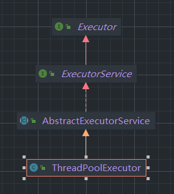
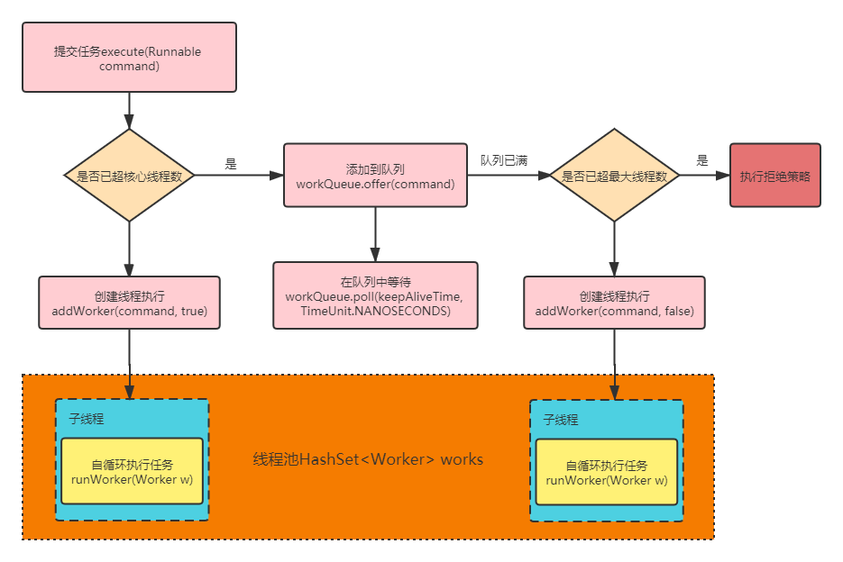
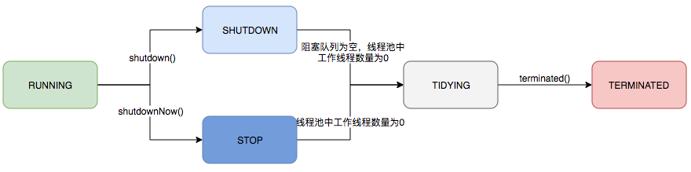
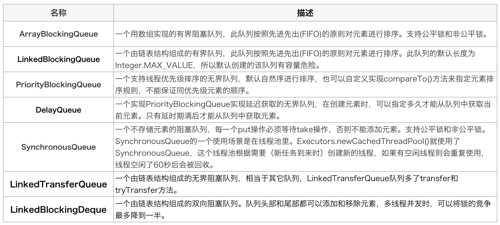
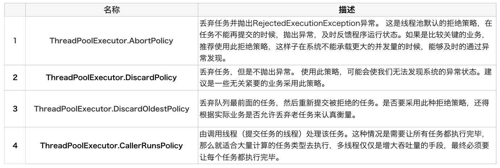

# 技术精华-超详细的线程池原理解析

# 说明


线程池作为常用的并发工具重要性不言而喻，本文针对线程池进行了抽丝剥茧般的深入解析，希望大家看后会有帮助。


# 1 ThreadPoolExecutor结构关系图





# 2 参数结构


```java
public ThreadPoolExecutor(    int corePoolSize,//核心线程数量
                              int maximumPoolSize,//最大线程数
                              long keepAliveTime,//超时时间,默认超出核心线程数量以外的线程空余存活时间
                              TimeUnit unit,//存活时间单位
                              BlockingQueue<Runnable> workQueue,//保存执行任务的队列
                              ThreadFactory threadFactory,//创建新线程使用的工厂
                              RejectedExecutionHandler handler//当任务无法执行的时候的处理方式) {
        if (corePoolSize < 0 ||
            maximumPoolSize <= 0 ||
            maximumPoolSize < corePoolSize ||
            keepAliveTime < 0)
            throw new IllegalArgumentException();
        if (workQueue == null || threadFactory == null || handler == null)
            throw new NullPointerException();
        this.acc = System.getSecurityManager() == null ?
                null :
                AccessController.getContext();
        this.corePoolSize = corePoolSize;
        this.maximumPoolSize = maximumPoolSize;
        this.workQueue = workQueue;
        this.keepAliveTime = unit.toNanos(keepAliveTime);
        this.threadFactory = threadFactory;
        this.handler = handler;
}
```


其实在线程池初始化时是不创建线程的，当执行任务会创建核心线程，当任务执行完后，核心线程会挂起等待，当再次有任务执行时，这些核心线程就会执行新的任务，从而实现了线程复用的效果。


# 3 线程池执行过程


## 3.1 执行流程图





## 3.2 运行状态
| 运行状态 | 状态描述 |
| --- | --- |
| RUNNING | 能够处理新提交的任务，也能处理阻塞队列中的任务 |
| SHUTDOWN | 不能处理新提交的任务，但能处理阻塞队列中的任务 |
| STOP | 不能处理新提交任务，也不处理队列中任务，会中断正在处理任务的线程 |
| TIDYING | 所有任务都终止了，workerCount(有效线程为0) |
| TERMINATED | 在terminated()方法执行完后进入该状态 |


线程池使用了一个`ctl变量`来维护运行状态(runState)和worker数量 (workerCount)两个值。高3位保存runState，低29位保存workerCount。


通过阅读线程池源代码也可以发现，经常出现要同时判断线程池运行状态和线程数量的情况。线程池也提供了若干方法去供用户获得线程池当前的运行状态、线程个数。这里都使用的是位运算的方式，相比于基本运算，速度也会快很多。


```java
// 1. `ctl`，可以看做一个int类型的数字，高3位表示线程池状态，低29位表示worker数量
private final AtomicInteger ctl = new AtomicInteger(ctlOf(RUNNING, 0));
```


关于内部封装的获取生命周期状态、获取线程池线程数量的计算方法如以下代码所示：


```java
// `runStateOf()`，获取线程池状态，通过按位与操作，低29位将全部变成0
private static int runStateOf(int c)     { return c & ~CAPACITY; }
// `workerCountOf()`，获取线程池worker数量，通过按位与操作，高3位将全部变成0
private static int workerCountOf(int c)  { return c & CAPACITY; }
// `ctlOf()`，根据线程池状态和线程池worker数量，生成ctl值
private static int ctlOf(int rs, int wc) { return rs | wc; }
```


## 3.3 状态的转化





## 3.4 阻塞队列成员





## 3.5 拒绝策略


任务拒绝模块是线程池的保护部分，线程池有一个最大的容量，当线程池的任务缓存队列已满，并且线程池中的线程数目达到`maximumPoolSize`时，就需要拒绝掉该任务，采取任务拒绝策略，保护线程池。


拒绝策略是一个接口，其设计如下：


```java
public interface RejectedExecutionHandler {
    void rejectedExecution(Runnable r, ThreadPoolExecutor executor);
}
```


用户可以通过实现这个接口去定制拒绝策略，也可以选择JDK提供的四种已有拒绝策略





# 4 源码解析


## 4.1 常用变量的解释


```java
// 1. `ctl`，可以看做一个int类型的数字，高3位表示线程池状态，低29位表示worker数量
private final AtomicInteger ctl = new AtomicInteger(ctlOf(RUNNING, 0));
// 2. `COUNT_BITS`，`Integer.SIZE`为32，所以`COUNT_BITS`为29
private static final int COUNT_BITS = Integer.SIZE - 3;
// 3. `CAPACITY`，线程池允许的最大线程数。1左移29位，然后减1，即为 2^29 - 1
private static final int CAPACITY   = (1 << COUNT_BITS) - 1;

// runState is stored in the high-order bits
// 4. 线程池有5种状态，按大小排序如下：RUNNING < SHUTDOWN < STOP < TIDYING < TERMINATED
private static final int RUNNING    = -1 << COUNT_BITS;
private static final int SHUTDOWN   =  0 << COUNT_BITS;
private static final int STOP       =  1 << COUNT_BITS;
private static final int TIDYING    =  2 << COUNT_BITS;
private static final int TERMINATED =  3 << COUNT_BITS;

// Packing and unpacking ctl
// 5. `runStateOf()`，获取线程池状态，通过按位与操作，低29位将全部变成0
private static int runStateOf(int c)     { return c & ~CAPACITY; }
// 6. `workerCountOf()`，获取线程池worker数量，通过按位与操作，高3位将全部变成0
private static int workerCountOf(int c)  { return c & CAPACITY; }
// 7. `ctlOf()`，根据线程池状态和线程池worker数量，生成ctl值
private static int ctlOf(int rs, int wc) { return rs | wc; }

/*
 * Bit field accessors that don't require unpacking ctl.
 * These depend on the bit layout and on workerCount being never negative.
 */
// 8. `runStateLessThan()`，线程池状态小于xx
private static boolean runStateLessThan(int c, int s) {
    return c < s;
}
// 9. `runStateAtLeast()`，线程池状态大于等于xx
private static boolean runStateAtLeast(int c, int s) {
    return c >= s;
}
```


## 4.2 提交任务的过程


```java
public void execute(Runnable command) {
    if (command == null)
        throw new NullPointerException();
    int c = ctl.get();
    // worker数量比核心线程数小，直接创建worker执行任务
    if (workerCountOf(c) < corePoolSize) {
        if (addWorker(command, true))
            return;
        c = ctl.get();
    }
    // worker数量超过核心线程数，但任务队列未满，任务直接进入队列
    if (isRunning(c) && workQueue.offer(command)) {
        int recheck = ctl.get();
        // 线程池状态不是RUNNING状态，说明执行过shutdown命令，需要对新加入的任务执行reject()操作。
        // 这儿为什么需要recheck，是因为任务入队列前后，线程池的状态可能会发生变化。
        if (! isRunning(recheck) && remove(command))
            //如果线程池处于非运行状态，并且把当前的任务从任务队列中移除成功，则拒绝该任务
            reject(command);
        // 这儿为什么需要判断0值，主要是在线程池构造方法中，核心线程数允许为0
        // 如果之前的线程已被销毁完，新建一个线程
        else if (workerCountOf(recheck) == 0)
            addWorker(null, false);
    }
    // 如果线程池不是运行状态，或者任务进入队列失败，则尝试创建worker执行任务。
    // 这儿有3点需要注意：
    // 1. 线程池不是运行状态时，addWorker内部会判断线程池状态
    // 2. addWorker第2个参数表示是否创建核心线程
    // 3. addWorker返回false，则说明任务执行失败，需要执行reject操作
    else if (!addWorker(command, false))
        reject(command);
}
```


## 4.3 addworker解析


```java
private boolean addWorker(Runnable firstTask, boolean core) {
    //goto 语句,避免死循环
    retry:
    // 外层自旋
    for (;;) {
        int c = ctl.get();
        int rs = runStateOf(c);

        // 这个条件写得比较难懂，我对其进行了调整，和下面的条件等价
        // (rs > SHUTDOWN) || 
        // (rs == SHUTDOWN && firstTask != null) || 
        // (rs == SHUTDOWN && workQueue.isEmpty())
        // 1. 线程池状态大于SHUTDOWN时，直接返回false
        // 2. 线程池状态等于SHUTDOWN，且firstTask不为null，直接返回false
        // 3. 线程池状态等于SHUTDOWN，且队列为空，直接返回false
        
            //通俗的解释
            //(1). 线程池已经 shutdown 后，还要添加新的任务，拒绝
            //(2).（第二个判断）SHUTDOWN 状态不接受新任务，但仍然会执行已经加入任务队列的任
                //务，所以当进入SHUTDOWN 状态，而传进来的任务为空，并且任务队列不为空的时候，
                //是允许添加新线程的,如果把这个条件取反，就表示不允许添加 worker
        if (rs >= SHUTDOWN &&
            ! (rs == SHUTDOWN &&
               firstTask == null &&
               ! workQueue.isEmpty()))
            return false;

        // 内层自旋
        for (;;) {
            //获得 Worker 的工作线程数
            int wc = workerCountOf(c);
            // worker数量超过容量，直接返回false
            if (wc >= CAPACITY ||
                wc >= (core ? corePoolSize : maximumPoolSize))
                return false;
            // 使用CAS的方式增加worker数量。如果 cas 失败，则直接重试
            // 若增加成功，则直接跳出外层循环进入到第二部分
            if (compareAndIncrementWorkerCount(c))
                break retry;
            //再次获取 ctl 的值
            c = ctl.get();
            // //这里如果不想等，说明线程的状态发生了变化，继续重试
            if (runStateOf(c) != rs)
                continue retry;
            // 其他情况，直接内层循环进行自旋即可
        } 
    }
    //上面这段代码主要是对 worker 数量做原子+1 操作,下面的逻辑才是正式构建一个 worker

    //工作线程是否启动的标识
    boolean workerStarted = false;
    //工作线程是否已经添加成功的标识
    boolean workerAdded = false;
    Worker w = null;
    try {
        //构建一个 Worker，这个 worker 是什么呢？我们可以看到构造方法里面传入了一个 Runnable 对象
        w = new Worker(firstTask);
        //从 worker 对象中取出线程
        final Thread t = w.thread;
        if (t != null) {
            final ReentrantLock mainLock = this.mainLock;
            // worker的添加必须是串行的，因此需要加锁
            mainLock.lock();
            try {
                // Recheck while holding lock.
                // Back out on ThreadFactory failure or if
                // shut down before lock acquired.
                // 这儿需要重新检查线程池状态
                int rs = runStateOf(ctl.get());
                //只有当前线程池是正在运行状态,[或是 SHUTDOWN 且 firstTask 为空],才能添加到 workers集合中
                if (rs < SHUTDOWN ||
                    (rs == SHUTDOWN && firstTask == null)) {
                    // worker已经调用过了start()方法，则不再创建worker
                    if (t.isAlive()) // precheck that t is startable
                        throw new IllegalThreadStateException();
                    // worker创建并添加到workers成功
                    workers.add(w);
                    // 更新`largestPoolSize`变量
                    int s = workers.size();
                    //如果集合中的工作线程数大于最大线程数，这个最大线程数表示线程池曾经出现过的最大线程数
                    if (s > largestPoolSize)
                        //更新线程池出现过的最大线程数
                        largestPoolSize = s;
                    //表示工作线程创建成功了
                    workerAdded = true;
                }
            } finally {
                //释放锁
                mainLock.unlock();
            }
            //如果 worker 添加成功
            if (workerAdded) {
                //启动worker线程
                t.start();
                workerStarted = true;
            }
        }
    } finally {
        //如果添加失败，就需要做一件事，就是递减实际工作线程数(还记得我们最开始的时候增加了工作线程数吗)
        if (! workerStarted)
            addWorkerFailed(w);
    }
    return workerStarted;
}
```


## 4.4 addWorkerFailed的解析


此方法是在添加Worker和启动失败而做的处理工作。主要做了这几个逻辑：


1. 如果`worker`已经构造好了，则从`workers`集合中移除这个`worker`
2. 使用cas进行原子递减核心线程数（因为之前addWorker 方法中先做了cas原子增加）
3. 尝试去关闭线程池


```java
private void addWorkerFailed(Worker w) {
        final ReentrantLock mainLock = this.mainLock;
        mainLock.lock();
        try {
            if (w != null)
                workers.remove(w);
            decrementWorkerCount();
            tryTerminate();
        } finally {
            mainLock.unlock();
        }
}
```


## 4.5 Work类的说明


可以看到在addWorker方法种，最核心的是构建了一个`Worker类`，然后将任务`firstTask`放入到`Work`中。添加成功的话则执行`Worker`的`run`方法  
Worker类实现了继承了`AbstractQueuedSynchronizer(AQS`)类，实现了`Runnable`接口。  
其中有两个成员属性尤为重要。


```java
 final Thread thread;
        
 Runnable firstTask;
```


这两个属性是在通过Worker的构造方法中传入的


```java
Worker(Runnable firstTask) {
            setState(-1); // inhibit interrupts until runWorker
            this.firstTask = firstTask;
            this.thread = getThreadFactory().newThread(this);
}
```


`firstTask`用它来保存传入的任务； `thread`是在调用构造方法时通过 ThreadFactory 来创建的线程，是用来处理任务的线程。


在调用构造方法时，需要传入任务，这里通过 `getThreadFactory().newThread(this);`来新建一个线程，`newThread`方法传入的参数是 `this`，因为`Worker`本身继承了`Runnable`接口，也就是一个线程，所以在之前的`addWorker`方法中如果`work`添加到`workers`结合成功的话就会调用`Worke`类中的`run`方法。


Worker 继承了 AQS，使用 AQS 来实现独占锁的功能。为什么不使用 ReentrantLock 来实现呢？可以看到 tryAcquire 方法，它是不允许重入的，而 ReentrantLock 是允许重入的：lock 方法一旦获取了独占锁，表示当前线程正在执行任务中； 那么它会有以下几个作用


1. 如果正在执行任务，则不应该中断线程；
2. 如果该线程现在不是独占锁的状态，也就是空闲的状态，说明它没有在处理任务，这时可以对该线程进行中断；
3. 线程池在执行 `shutdown` 方法或 `tryTerminate` 方法时会调用 `interruptIdleWorkers` 方法来中断空闲的线程， `interruptIdleWorkers` 方法会使用 `tryLock` 方法来判断线程池中的线程是否是空闲状态。
4. 之所以设置为不可重入，是因为我们不希望任务在调用像 `setCorePoolSize` 这样的线程池控制方法时重新获取锁，这样会中断正在运行的线程


## 4.6 Worker类的解析


```java
private final class Worker
    extends AbstractQueuedSynchronizer
    implements Runnable
{
    //真正执行task任务的线程，可知是在构造函数中由ThreadFactory创建的
    final Thread thread;
    //需要执行的任务task
    Runnable firstTask;
    //完成的任务数，用于线程池统计
    volatile long completedTasks;

    Worker(Runnable firstTask) {
        //初始状态 -1,防止在调用 runWorker()，也就是真正执行 task前中断 thread。
        setState(-1); 
        //提交的任务
        this.firstTask = firstTask;
        // 这儿是Worker的关键所在，使用了线程工厂创建了一个线程。传入的参数为当前worker
        this.thread = getThreadFactory().newThread(this);
    }

    //执行任务
    public void run() {
        runWorker(this);
    }

    // 省略...
}
```


## 4.7 runWorker方法解析


由以上可知Worker类中的run方法，也就是`runWorker`方法，是实现执行任务的真正逻辑。主要做了这几种逻辑。


1. 获取Worker中的`firstTask`任务，不为空则执行任务
2. 如果`firstTask`为空，则执行`getTask`方法去阻塞队列中获取任务，获取到则执行。
3. 当任务执行完后，在while循环中继续执行`getTask`方法


```java
final void runWorker(Worker w) {
    Thread wt = Thread.currentThread();
    Runnable task = w.firstTask;
    w.firstTask = null;
    // unlock，表示当前 worker 线程允许中断，
    // 因为 new Worker 默认的 state=-1,此处是调用
    // Worker 类的 tryRelease()方法，将 state 置为 0，
    // 而 interruptIfStarted()中只有 state>=0 才允许调用中断
    w.unlock(); 
    // 这个变量用于判断是否进入过自旋（while循环）
    boolean completedAbruptly = true;
    try {
        // 这儿是自旋
        // 1. 如果firstTask不为null，则执行firstTask；
        // 2. 如果firstTask为null，则调用getTask()从队列获取任务。
        // 3. 阻塞队列的特性就是：当队列为空时，当前线程会被阻塞等待
        while (task != null || (task = getTask()) != null) {
            // 这儿对worker进行加锁，是为了达到下面的目的
            // 1. 降低锁范围，提升性能
            // 2. 保证每个worker执行的任务是串行的
            w.lock();
            // 线程池为 stop状态时不接受新任务，不执行已经加入任务队列的任务，还中断正在执行的任务
            //所以对于 stop 状态以上是要中断线程的
            //(Thread.interrupted() &&runStateAtLeast(ctl.get(), STOP)确保线程中断标志位为 true 且是 stop 状态以上，接着清除了中断标志
            //!wt.isInterrupted()则再一次检查保证线程需要设置中断标志位
            if ((runStateAtLeast(ctl.get(), STOP) ||
                 (Thread.interrupted() &&
                  runStateAtLeast(ctl.get(), STOP))) &&
                !wt.isInterrupted())
                wt.interrupt();
            // 执行任务，且在执行前后通过`beforeExecute()`和`afterExecute()`来扩展其功能。
            // 这两个方法在当前类里面为空实现。可以自己进行重写
            try {
                beforeExecute(wt, task);
                Throwable thrown = null;
                try {
                    //执行任务中的 run 方法
                    task.run();
                } catch (RuntimeException x) {
                    thrown = x; throw x;
                } catch (Error x) {
                    thrown = x; throw x;
                } catch (Throwable x) {
                    thrown = x; throw new Error(x);
                } finally {
                    afterExecute(task, thrown);
                }
            } finally {
                //将task为null，这样当下次循环时，就需要再通过getTask()获取。
                task = null;
                //记录该 Worker 完成任务数量加1
                w.completedTasks++;
                //解锁
                w.unlock();
            }
        }
        completedAbruptly = false;
    } finally {
        // 自旋操作被退出，说明线程池正在结束
        processWorkerExit(w, completedAbruptly);
    }
}
```


## 4.8 getTask方法解析


每个worker都会执行`getTask`从阻塞队列中拿取任务，这是一个典型的消费者的角色。根据线程池中的线程数来判断是拿取任务方法是poll有超时，还是take一直阻塞，从而实现核心线程的复用和最大线程的回收。


```java
private Runnable getTask() {
    boolean timedOut = false; // Did the last poll() time out?
    //进行自循环
    for (;;) {
        int c = ctl.get();
        int rs = runStateOf(c);

        //对线程池状态的判断，两种情况会 workerCount-1，并且返回 null
        //1. 线程池状态为 shutdown，且 workQueue 为空（反映了 shutdown 状态的线程池还是
        //要执行 workQueue 中剩余的任务的）
        //2. 线程池状态为 stop（shutdownNow()会导致变成 STOP）（此时不用考虑 workQueue的情况）
        if (rs >= SHUTDOWN && (rs >= STOP || workQueue.isEmpty())) {
            //将工作线程数减1
            decrementWorkerCount();
            //返回null，此线程就会结束
            return null;
        }
        //获取工作线程数    
        int wc = workerCountOf(c);

        //timed变量的含义是，
        //如果我们自己设置了allowCoreThreadTimeOut为true(默认false)，
        //或者工作线程池大于了核心线程数.
        //那么就会进行超时的控制
        boolean timed = allowCoreThreadTimeOut || wc > corePoolSize;

        //线程数量超过 maximumPoolSize 可能是线程池在运行时被调用了 setMaximumPoolSize()
        //被改变了大小，否则已经 addWorker()成功不会超过 maximumPoolSize

        //timed && timedOut 如果为 true，表示当前操作需要进行超时控制，并且上次从阻塞队列中
        //获取任务发生了超时.其实就是体现了空闲线程的存活时间
        if ((wc > maximumPoolSize || (timed && timedOut)) && (wc > 1 || workQueue.isEmpty())){
            if (compareAndDecrementWorkerCount(c))
                return null;
            continue;
        }

        try {
            //根据 timed 来判断，如果为 true，则通过阻塞队列 poll 方法进行超时控制，如果在
            //keepaliveTime 时间内没有获取到任务，则返回 null.
            //如果为 false，则通过 take 方法阻塞式获取队列中的任务
            Runnable r = timed ?
                workQueue.poll(keepAliveTime, TimeUnit.NANOSECONDS) :
                workQueue.take();
            //如果任务存在不为空，则返回给上一个addWorker方法进行执行。
            if (r != null)
                return r;
            //如果为true，说明超时了也没去到任务，在下次循环时就会返回null结束。
            timedOut = true;
        } catch (InterruptedException retry) {
            // 如果获取任务时当前线程发生了中断，则设置 timedOut 为false 并返回循环重试
            timedOut = false;
        }
    }
}
```


由上述分析可知此方法的核心逻辑在于控制线程池的线程数量。


在执行  `execute` 方法时，如果当前线程池的线程数量超过了 `corePoolSize` 且小于`maximumPoolSize`，并且 `workQueue` 已满时，则可以增加工作线程，但这时如果超时没有获取到任务，也就是 timedOut 为 true 的情况，说明 `workQueue` 已经为空了，也就说明了当前线程池中不需要那么多线程来执行任务了，可以把多于 `corePoolSize` 数量的线程销毁掉，保持线程数量在 `corePoolSize` 即可。


什么时候会销毁？当然是 `runWorker` 方法执行完之后，也就是 Worker 中的 `run` 方法执行完，由 JVM 自动回收。  
`getTask` 方法返回 null 时，在 `runWorker` 方法中会跳出 while 循环，然后会执行 `processWorkerExit` 方法。


### processWorkerExit方法解析


在 `runWorker` 方法中，while中的 `task` 或者 `getTask` 方法 为null后会执行 `processWorkerExit`


```java
private void processWorkerExit(Worker w, boolean completedAbruptly) {
    //completedAbruptly为true，说明task任务执行时也就是run方法发生了异常，则需要将工作线程数减1。
    //那么如果task任务正常执行的呢，那么在getTask方法中已经做了减1操作了。
    if (completedAbruptly) 
        decrementWorkerCount();
 
    final ReentrantLock mainLock = this.mainLock;
    mainLock.lock();
    try {
        //将worker中的任务完成数量汇总到线程池中的完成任务数量
        completedTaskCount += w.completedTasks;
        //将Set集合移除此worker
        workers.remove(w);
    } finally {
        mainLock.unlock();
    }
 

    //尝试终止线程池，主要判断线程池是否满足终止状态条件，如果满足但还有线程，尝试进行中断。
    //没有线程的话 tidying状态改为terminated状态
    tryTerminate();
 
    
    
    int c = ctl.get();
    //如果状态是running、shutdown，即tryTerminate()没有成功终止线程池，尝试再添加一个worker
    if (runStateLessThan(c, STOP)) {
        //不是突然完成的，即没有task任务可以获取而完成的，计算min，并根据当前worker数量判断是否需要addWorker()
        if (!completedAbruptly) {
            //allowCoreThreadTimeOut默认为false，即min默认为corePoolSize
            int min = allowCoreThreadTimeOut ? 0 : corePoolSize; 
             
            //如果min为0，即不需要维持核心线程数量，且workQueue不为空，至少保持一个线程
            if (min == 0 && ! workQueue.isEmpty())
                min = 1;
             
            //如果线程数量大于最少数量，直接返回，否则下面至少要addWorker一个
            if (workerCountOf(c) >= min)
                return; // replacement not needed
        }
         
        //添加一个没有firstTask的worker
        //只要worker是completedAbruptly突然终止的，或者线程数量小于要维护的数量，
        //就新添一个worker线程，即使是shutdown状态
        addWorker(null, false);
    }
}
```


流程：


1. `worker`数量-1


+ 如果是突然终止，说明是task执行时异常情况导致，即run()方法执行时发生了异常，那么正在工作的worker线程数量需要-1
+ 如果不是突然终止，说明是worker线程没有task可执行了，不用-1，因为已经在getTask()方法中-1了


2. `从Workers Set`中移除`worker`，删除时需要上锁mainlock
3. `tryTerminate()：`在对线程池有负效益的操作时，都需要“尝试终止”线程池，大概逻辑：  
判断线程池是否满足终止的状态 
    - 如果状态满足，但还有线程池还有线程，尝试对其发出中断响应，使其能进入退出流程
    - 没有线程了，更新状态为tidying->terminated
4. 是否需要增加`worker`线程，如果线程池还没有完全终止，仍需要保持一定数量的线程线程池状态是`running` 或 `shutdown` 
    - 如果当前线程是突然终止的，addWorker()
    - 如果当前线程不是突然终止的，但当前线程数量 < 要维护的线程数量，addWorker()，故如果调用线程池shutdown()，直到workQueue为空前，线程池都会维持corePoolSize个线程，然后再逐渐销毁这corePoolSize个线程


## 4.9 reject(Runnable command)解析


回到 `execute(Runnable command)` 方法，发现当队列中的任务已满，线程也超过最大线程数时，会执行异常策略也就是 `reject(Runnable command)` 方法


```java
final void reject(Runnable command) {
        handler.rejectedExecution(command, this);
}
```


逻辑很简单，执行RejectedExecutionHandler接口中的 `rejectedExecution` 方法。详细拒绝策略已在上文做介绍。


# 5 Executors提供的线程池


```java
public static ExecutorService newFixedThreadPool(int nThreads) {
        return new ThreadPoolExecutor(nThreads, nThreads,
                                      0L, TimeUnit.MILLISECONDS,
                                      new LinkedBlockingQueue<Runnable>());
}


public static ExecutorService newSingleThreadExecutor() {
        return new FinalizableDelegatedExecutorService
            (new ThreadPoolExecutor(1, 1,
                                    0L, TimeUnit.MILLISECONDS,
                                    new LinkedBlockingQueue<Runnable>()));
}


public static ExecutorService newCachedThreadPool() {
        return new ThreadPoolExecutor(0, Integer.MAX_VALUE,
                                      60L, TimeUnit.SECONDS,
                                      new SynchronousQueue<Runnable>());
}

public static ScheduledExecutorService newScheduledThreadPool(int corePoolSize) {
        return new ScheduledThreadPoolExecutor(corePoolSize);
}

public ScheduledThreadPoolExecutor(int corePoolSize) {
        super(corePoolSize, Integer.MAX_VALUE, 0, NANOSECONDS,
              new DelayedWorkQueue());
}
```


以上是Executors提供的常用的几种封装好的线程池，这几种需要注意


1. `newFixedThreadPool` , `newSingleThreadExecutor` 阻塞队列长度为Integer.MAX_VALUE
2. `newCachedThreadPool` 最大线程数为Integer.MAX_VALUE
3. `newScheduledThreadPool` 最大线程数为Integer.MAX_VALUE


所以这几种在使用时，要注意。 阿里开发手册不建议使用这几种线程池，最好是自己定制


> 更新: 2024-03-26 16:18:25  
> 原文: <https://www.yuque.com/u22210564/ykdrdh/qhtsfdla5qinto3g>