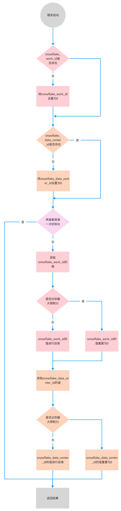

# 组件讲解-分布式ID生成器揭秘，保障数据唯一性的核心组件

# 背景


分布式ID在构建大规模分布式系统时扮演着至关重要的角色，主要用于确保在分布式环境中数据的唯一性和一致性。以下是分布式ID的几个主要作用：


1. **确保唯一性**：在分布式系统中，可能有成千上万个实例同时请求ID。分布式ID生成系统能保证即使在高并发的情况下也能生成全局唯一的ID，避免数据冲突和覆盖
2. **便于水平扩展**：分布式系统通常需要水平扩展以支持更多的用户和业务。分布式ID生成机制允许系统在不同的机器、数据中心甚至地理区域中扩展，同时仍然能够生成唯一的ID，无需担心ID冲突
3. **提高性能**：通过避免依赖中心化的数据库序列生成ID，分布式ID生成机制可以显著提高应用性能。这些机制通常在内存中进行，减少了网络延迟和磁盘I/O，从而加快了ID的生成速度
4. **减少系统依赖**：分布式ID生成不依赖特定的数据库或存储系统，减少了系统组件之间的耦合。这种独立性使得系统更加健壮，减少了因数据库故障导致的ID生成问题
5. **时间有序性**：某些分布式ID生成策略（如雪花算法）能够生成大致按时间顺序递增的ID。这对于需要跟踪记录创建顺序或进行时间序列分析的应用来说是一个重要特性
6. **支持事务和日志追踪**：在复杂的分布式系统中，分布式ID可以用来追踪和管理跨多个系统和组件的事务和日志。每个操作都可以关联一个唯一ID，使得问题定位和性能监控变得更加容易。
7. **安全性和隐私保护**：通过生成不可预测的唯一ID，分布式ID机制还可以增加系统的安全性，防止恶意用户通过ID预测和访问未授权的数据


而对于分布式id应用最出名的莫过于经典的雪花算法了，本人也有对雪花算法做了详细的介绍，想了解的小伙伴可跳转


[输入密码 · 语雀](https://www.yuque.com/u22210564/ugnoev/iyxwyiy6ga7p4rqi)


雪花算法中，最需要考虑的就是**datacenterId** 和 **workerId** 了，**datacenterId** 表示机房ID，**workerId** 表示机器ID。而在**Mybatis-Plus**中，对这两个字段都有进行了配置，但这种配置在k8s的环境下，依然会发生重复问题，本人也有介绍，可跳转文档查询


[技术精华-为什么Mybatis-plus生成的id在k8s环境会发生重复 · 语雀](https://www.yuque.com/u22210564/ugnoev/ipseyyua7fybh4y8)


在大麦网中，**分布式id生成器**对**Mybatis-Plus**中的雪花算法进行了改造优化，通过依靠redis来配置**datacenterId** 和 **workerId**，从而解决这个重复的问题，并且也集成了百度开源的**UidGenerator**，将依靠数据库自增的方式替换成了依靠redis自增，下面来详解的介绍此组件的原理和使用


# 分布式id生成器


## 配置


#### 依赖


```xml
<dependency>
    <groupId>com.example</groupId>
    <artifactId>damai-id-generator-framework</artifactId>
    <version>${revision}</version>
</dependency>
```


#### redis配置


```yaml
spring:
  redis:
    database: 0
    host: 127.0.0.1
    port: 6379
    password: 123456
    timeout: 3000
```


#### 使用


```java
@Autowired
private SnowflakeIdGenerator snowflakeIdGenerator;

public void testId(){
    long id = snowflakeIdGenerator.nextId();
}
```


## 介绍


首先我们来介绍对Mybatis-Plus中雪花算法的改造，这里没有选择去适配Mybatis-Plus的接口**IdentifierGenerator**


```java
/**
 * Id生成器接口
 *
 * @author nieqiuqiu
 * @since 2019-10-15
 * @since 3.3.0
 */
public interface IdentifierGenerator {

    /**
     * 判断是否分配 ID
     *
     * @param idValue 主键值
     * @return true 分配 false 无需分配
     */
    default boolean assignId(Object idValue) {
        return StringUtils.checkValNull(idValue);
    }

    /**
     * 生成Id
     *
     * @param entity 实体
     * @return id
     */
    Number nextId(Object entity);

    /**
     * 生成uuid
     *
     * @param entity 实体
     * @return uuid
     */
    default String nextUUID(Object entity) {
        return IdWorker.get32UUID();
    }
}
```


没有适配此接口的原因是为了脱离框架依赖，如果以后出现了比Mybatis-Plus更高效的持久化框架，可以更加方便的去替换。


所以选择直接将Mybatis-Plus的雪花算法移植到组件中，并进行了优化


#### IdGeneratorAutoConfig


```java
public class IdGeneratorAutoConfig {
    
    @Bean
    public WorkAndDataCenterIdHandler workAndDataCenterIdHandler(StringRedisTemplate stringRedisTemplate){
        return new WorkAndDataCenterIdHandler(stringRedisTemplate);
    }
    
    @Bean
    public WorkDataCenterId workDataCenterId(WorkAndDataCenterIdHandler workAndDataCenterIdHandler){
        return workAndDataCenterIdHandler.getWorkAndDataCenterId();
    }
    
    @Bean
    public SnowflakeIdGenerator snowflakeIdGenerator(WorkDataCenterId workDataCenterId){
        return new SnowflakeIdGenerator(workDataCenterId);
    }
}
```


#### WorkAndDataCenterIdHandler


```java
@Slf4j
public class WorkAndDataCenterIdHandler {
    
    private final String SNOWFLAKE_WORK_ID_KEY = "snowflake_work_id";
    
    private final String SNOWFLAKE_DATA_CENTER_ID_key = "snowflake_data_center_id";
    
    
    public final List<String> keys = Stream.of(SNOWFLAKE_WORK_ID_KEY,SNOWFLAKE_DATA_CENTER_ID_key).collect(Collectors.toList());
    
    private StringRedisTemplate stringRedisTemplate;
    
    private DefaultRedisScript<String> redisScript;
    
    public WorkAndDataCenterIdHandler(StringRedisTemplate stringRedisTemplate){
        this.stringRedisTemplate = stringRedisTemplate;
        try {
            redisScript = new DefaultRedisScript<>();
            redisScript.setScriptSource(new ResourceScriptSource(new ClassPathResource("lua/workAndDataCenterId.lua")));
            redisScript.setResultType(String.class);
        } catch (Exception e) {
            log.error("redisScript init lua error",e);
        }
    }
    
    public WorkDataCenterId getWorkAndDataCenterId(){
        WorkDataCenterId workDataCenterId = new WorkDataCenterId();
        try {
            String[] data = new String[2];
            data[0] = String.valueOf(IdGeneratorConstant.MAX_WORKER_ID);
            data[1] = String.valueOf(IdGeneratorConstant.MAX_DATA_CENTER_ID);
            String result = stringRedisTemplate.execute(redisScript, keys, data);
            workDataCenterId = JSON.parseObject(result,WorkDataCenterId.class);
        }catch (Exception e) {
            log.error("getWorkAndDataCenterId error",e);
        }
        return workDataCenterId;
    }
}
```


#### WorkDataCenterId


```java
@Data
public class WorkDataCenterId {

    private Long workId;
    
    private Long dataCenterId;
}
```


`WorkAndDataCenterIdHandler`是执行lua脚本的执行器，执行完脚本后获得了`WorkDataCenterId`的实体，包好了`workId`和`dataCenterId`


`WorkDataCenterId`在注入到spring上下文的过程中，就调用了`WorkAndDataCenterIdHandler#getWorkAndDataCenterId`方法在redis中加载`workId`和`dataCenterId`


下面就来分析下加载`workId`和`dataCenterId`的详细过程


#### workAndDataCenterId.lua


```lua
-- redis中work_id的key
local snowflake_work_id_key = KEYS[1]
-- redis中data_center_id的key
local snowflake_data_center_id_key = KEYS[2]
-- worker_id的最大阈值
local max_worker_id = tonumber(ARGV[1])
-- data_center_id的最大阈值
local max_data_center_id = tonumber(ARGV[2])
-- 返回的work_id
local return_worker_id = 0
-- 返回的data_center_id
local return_data_center_id = 0
-- work_id初始化flag
local snowflake_work_id_flag = false
-- data_center_id初始化flag
local snowflake_data_center_id_flag = false
-- 构建并返回JSON字符串
local json_result = string.format('{"%s": %d, "%s": %d}',
        'workId', return_worker_id,
        'dataCenterId', return_data_center_id)

-- 如果work_id不存在，则将值初始化为0
if (redis.call('exists', snowflake_work_id_key) == 0) then
    redis.call('set',snowflake_work_id_key,0)
    snowflake_work_id_flag = true
end
-- 如果data_center_id不存在，则将值初始化为0
if (redis.call('exists', snowflake_data_center_id_key) == 0) then
    redis.call('set',snowflake_data_center_id_key,0)
    snowflake_data_center_id_flag = true
end
-- 如果work_id和data_center_id都是初始化了，那么执行返回初始化的值
if (snowflake_work_id_flag and snowflake_data_center_id_flag) then
    return json_result
end
-- 获得work_id的值
local snowflake_work_id = tonumber(redis.call('get',snowflake_work_id_key))
-- 获得data_center_id的值
local snowflake_data_center_id = tonumber(redis.call('get',snowflake_data_center_id_key))

-- 如果work_id的值达到了最大阈值
if (snowflake_work_id == max_worker_id) then
    -- 如果data_center_id的值也达到了最大阈值
    if (snowflake_data_center_id == max_data_center_id) then
        -- 将work_id的值初始化为0
        redis.call('set',snowflake_work_id_key,0)
        -- 将data_center_id的值初始化为0
        redis.call('set',snowflake_data_center_id_key,0)
    else
        -- 如果data_center_id的值没有达到最大值，将进行自增，并将自增的结果返回
        return_data_center_id = redis.call('incr',snowflake_data_center_id_key)
    end
else
    -- 如果work_id的值没有达到最大值，将进行自增，并将自增的结果返回
    return_worker_id = redis.call('incr',snowflake_work_id_key)
end
return string.format('{"%s": %d, "%s": %d}',
        'workId', return_worker_id,
        'dataCenterId', return_data_center_id)
```


为了更加方便理解，可结合流程图体会整个执行的过程




这样将得到了加载后的包含**datacenterId** 和 **workerId** 的**WorkDataCenterId**对象，当创建**SnowflakeIdGenerator**时，将**WorkDataCenterId**注入进去


```java
public SnowflakeIdGenerator(WorkDataCenterId workDataCenterId) {
    if (Objects.nonNull(workDataCenterId.getDataCenterId())) {
        this.workerId = workDataCenterId.getWorkId();
        this.datacenterId = workDataCenterId.getDataCenterId();
    }else {
        this.datacenterId = getDatacenterId(maxDatacenterId);
        workerId = getMaxWorkerId(datacenterId, maxWorkerId);
    }
}
```


下面来看下**SnowflakeIdGenerator**的完整代码


```java
@Slf4j
public class SnowflakeIdGenerator {
    
    /**
     * 时间起始标记点，作为基准，一般取系统的最近时间（一旦确定不能变动）
     */
    private static final long BASIS_TIME = 1288834974657L;
    /**
     * 机器标识位数
     */
    private final long workerIdBits = 5L;
    private final long datacenterIdBits = 5L;
    private final long maxWorkerId = -1L ^ (-1L << workerIdBits);
    private final long maxDatacenterId = -1L ^ (-1L << datacenterIdBits);
    /**
     * 毫秒内自增位
     */
    private final long sequenceBits = 12L;
    private final long workerIdShift = sequenceBits;
    private final long datacenterIdShift = sequenceBits + workerIdBits;
    /**
     * 时间戳左移动位
     */
    private final long timestampLeftShift = sequenceBits + workerIdBits + datacenterIdBits;
    private final long sequenceMask = -1L ^ (-1L << sequenceBits);
    
    private final long workerId;
    
    /**
     * 数据标识 ID 部分
     */
    private final long datacenterId;
    /**
     * 并发控制
     */
    private long sequence = 0L;
    /**
     * 上次生产 ID 时间戳
     */
    private long lastTimestamp = -1L;
    /**
     * IP 地址
     */
    private InetAddress inetAddress;
    
    public SnowflakeIdGenerator(WorkDataCenterId workDataCenterId) {
        if (Objects.nonNull(workDataCenterId.getDataCenterId())) {
            this.workerId = workDataCenterId.getWorkId();
            this.datacenterId = workDataCenterId.getDataCenterId();
        }else {
            this.datacenterId = getDatacenterId(maxDatacenterId);
            workerId = getMaxWorkerId(datacenterId, maxWorkerId);
        }
    }

    public SnowflakeIdGenerator(InetAddress inetAddress) {
        this.inetAddress = inetAddress;
        this.datacenterId = getDatacenterId(maxDatacenterId);
        this.workerId = getMaxWorkerId(datacenterId, maxWorkerId);
        initLog();
    }

    private void initLog() {
        if (log.isDebugEnabled()) {
            log.debug("Initialization SnowflakeIdGenerator datacenterId:" + this.datacenterId + " workerId:" + this.workerId);
        }
    }

    /**
     * 有参构造器
     *
     * @param workerId     工作机器 ID
     * @param datacenterId 序列号
     */
    public SnowflakeIdGenerator(long workerId, long datacenterId) {
        Assert.isFalse(workerId > maxWorkerId || workerId < 0,
            String.format("worker Id can't be greater than %d or less than 0", maxWorkerId));
        Assert.isFalse(datacenterId > maxDatacenterId || datacenterId < 0,
            String.format("datacenter Id can't be greater than %d or less than 0", maxDatacenterId));
        this.workerId = workerId;
        this.datacenterId = datacenterId;
        initLog();
    }

    /**
     * 获取 maxWorkerId
     */
    protected long getMaxWorkerId(long datacenterId, long maxWorkerId) {
        StringBuilder mpid = new StringBuilder();
        mpid.append(datacenterId);
        String name = ManagementFactory.getRuntimeMXBean().getName();
        if (StringUtils.isNotBlank(name)) {
            /*
             * GET jvmPid
             */
            mpid.append(name.split("@")[0]);
        }
        /*
         * MAC + PID 的 hashcode 获取16个低位
         */
        return (mpid.toString().hashCode() & 0xffff) % (maxWorkerId + 1);
    }

    /**
     * 数据标识id部分
     */
    protected long getDatacenterId(long maxDatacenterId) {
        long id = 0L;
        try {
            if (null == this.inetAddress) {
                this.inetAddress = InetAddress.getLocalHost();
            }
            NetworkInterface network = NetworkInterface.getByInetAddress(this.inetAddress);
            if (null == network) {
                id = 1L;
            } else {
                byte[] mac = network.getHardwareAddress();
                if (null != mac) {
                    id = ((0x000000FF & (long) mac[mac.length - 2]) | (0x0000FF00 & (((long) mac[mac.length - 1]) << 8))) >> 6;
                    id = id % (maxDatacenterId + 1);
                }
            }
        } catch (Exception e) {
            log.warn(" getDatacenterId: " + e.getMessage());
        }
        return id;
    }
    
    public long getBase(){
        int five = 5;
        long timestamp = timeGen();
        //闰秒
        if (timestamp < lastTimestamp) {
            long offset = lastTimestamp - timestamp;
            if (offset <= five) {
                try {
                    wait(offset << 1);
                    timestamp = timeGen();
                    if (timestamp < lastTimestamp) {
                        throw new RuntimeException(String.format("Clock moved backwards.  Refusing to generate id for %d milliseconds", offset));
                    }
                } catch (Exception e) {
                    throw new RuntimeException(e);
                }
            } else {
                throw new RuntimeException(String.format("Clock moved backwards.  Refusing to generate id for %d milliseconds", offset));
            }
        }
        
        if (lastTimestamp == timestamp) {
            // 相同毫秒内，序列号自增
            sequence = (sequence + 1) & sequenceMask;
            if (sequence == 0) {
                // 同一毫秒的序列数已经达到最大
                timestamp = tilNextMillis(lastTimestamp);
            }
        } else {
            // 不同毫秒内，序列号置为 1 - 2 随机数
            sequence = ThreadLocalRandom.current().nextLong(1, 3);
        }
        
        lastTimestamp = timestamp;
        
        return timestamp;
    }

    /**
     * 获取分布式id
     *
     * @return id
     */
    public synchronized long nextId() {
        long timestamp = getBase();

        // 时间戳部分 | 数据中心部分 | 机器标识部分 | 序列号部分
        return ((timestamp - BASIS_TIME) << timestampLeftShift)
            | (datacenterId << datacenterIdShift)
            | (workerId << workerIdShift)
            | sequence;
    }
    
    /**
     * 获取订单编号
     *
     * @return orderNumber
     */
    public synchronized long getOrderNumber(long userId,long tableCount) {
        long timestamp = getBase();
        long sequenceShift = log2N(tableCount);
        // 时间戳部分 | 数据中心部分 | 机器标识部分 | 序列号部分 | 用户id基因
        return ((timestamp - BASIS_TIME) << timestampLeftShift)
                | (datacenterId << datacenterIdShift)
                | (workerId << workerIdShift)
                | (sequence << sequenceShift)
                | (userId % tableCount);
    }

    protected long tilNextMillis(long lastTimestamp) {
        long timestamp = timeGen();
        while (timestamp <= lastTimestamp) {
            timestamp = timeGen();
        }
        return timestamp;
    }

    protected long timeGen() {
        return SystemClock.now();
    }

    /**
     * 反解id的时间戳部分
     */
    public static long parseIdTimestamp(long id) {
        return (id>>22)+ BASIS_TIME;
    }
    
    /**
    * 求log2(N)
    * */
    public long log2N(long count) {
        return (long)(Math.log(count)/ Math.log(2));
    }
    
    public long getMaxWorkerId() {
        return maxWorkerId;
    }
    
    public long getMaxDatacenterId() {
        return maxDatacenterId;
    }
}
```


#### 总结


+ 在构建`SnowflakeIdGenerator`时，如果通过lua执行加载获取`workDataCenterId`失败，则还采取Mybiats-plus的生成策略
+ `nextId`方法就是获取分布式id的方法，其内部`getBase()`是更新时间戳的部分，由 **时间戳部分 | 数据中心部分 | 机器标识部分 | 序列号部分** 这四个部分组成
+ `getOrderNumber`方法是生成订单编号，使用了基因替换法，来解决在分库分表情况下，使用订单id和用户id查询订单时的全路由问题，关于基因法的详细介绍，可跳转到相关文档 

[技术精华-解锁分库分表新姿势：基因法完全解读](https://www.yuque.com/u22210564/ykdrdh/lnsmfsas4e7b3cvs)


## 适配 百度uid-generator


[uid-generator](https://github.com/baidu/uid-generator)对雪花算法进行了改造，指定机器 & 同一时刻 & 某一并发序列，是唯一的。据此可生成一个64 bits的唯一ID（long）。默认采用上图字节分配方式：


+ sign(1bit)  
固定1bit符号标识，即生成的UID为正数。
+ delta seconds (28 bits)  
当前时间，相对于时间基点"2016-05-20"的增量值，单位：秒，最多可支持约8.7年
+ worker id (22 bits)  
机器id，最多可支持约420w次机器启动。内置实现为在启动时由数据库分配，默认分配策略为用后即弃，后续可提供复用策略。
+ sequence (13 bits)  
每秒下的并发序列，13 bits可支持每秒8192个并发。


**以上参数均可通过Spring进行自定义**


并使用了**CachedUidGenerator**的缓存技术来更加高效的生成id，但**workerNodeId**的自增是使用数据库表id的自增来实现，这样实际使用起来只能作为一个独立的服务，然后其他服务调用此服务，这样存在网络消耗，对于id生成这种要求高效率业务特点来说，这么做还是不够好


所以，本人进行了改造，改为使用redis来实现对**workerNodeId**的自增，因为redis可以说是每个服务都要使用的中间件，并且执行起来也够高效


### 使用


```java
@Autowired
private UidGenerator uidGenerator;

public void test(){
    //uid-generator生成的
    long uid = uidGenerator.getUid();
    //mybatis-plus优化后的雪花算法生成的
    long uid = uidGenerator.getId();
    //订单编号
    long orderNumber = getOrderNumber(long userId,long tableCount);
}
```


> 更新: 2024-08-15 11:22:47  
> 原文: <https://www.yuque.com/u22210564/ykdrdh/ahgwiywela7xxego>