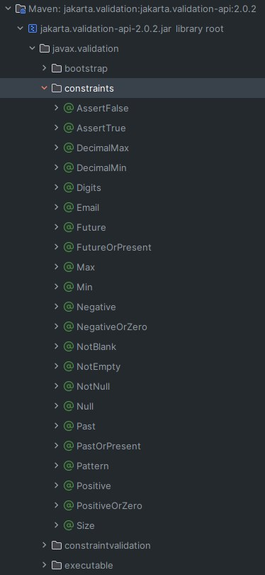
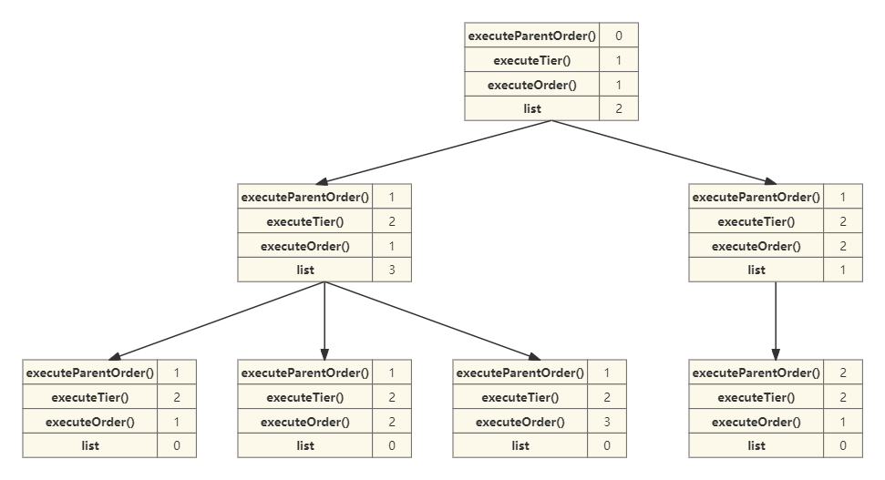
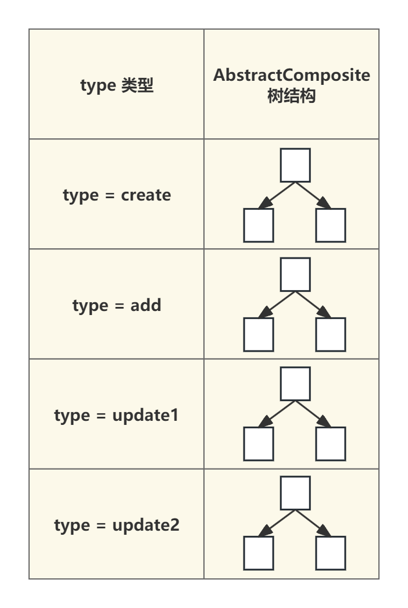

# 组件讲解-利用组合模式打造强大验证功能，轻松应对复杂验证需求

# 介绍


后端在设计接口的时候，对于参数验证的功能是相当常见的，比如说入参实体字段的必填和格式限制等相关的基础类型的验证功能，我们可以直接使用`javax.validation`来进行验证，本项目也是引入了此框架，较少了人为的验证工作


```xml
<dependency>
    <groupId>org.springframework.boot</groupId>
    <artifactId>spring-boot-starter-validation</artifactId>
</dependency>
```


通过此框架直接在相应的实体属性上添加即可实现验证功能


以节目票档添加接口为例


```java
@ApiOperation(value = "添加")
@PostMapping(value = "/add")
public ApiResponse<Long> add(@Valid @RequestBody TicketCategoryAddDto ticketCategoryAddDto) {
    return ApiResponse.ok(ticketCategoryService.add(ticketCategoryAddDto));
}
```


在控制层中，方法的入参前加入`@Valid`即可开启验证功能。`@RequestBody`是`spring-web`提供的，将前端传入的`json`映射成实体类


入参实体


```java
@Data
@ApiModel(value="TicketCategoryAddDto", description ="节目票档添加")
public class TicketCategoryAddDto {
    
    @ApiModelProperty(name ="programId", dataType ="Long", value ="节目表id",required = true)
    @NotNull
    private Long programId;
    
    @ApiModelProperty(name ="introduce", dataType ="String", value ="介绍",required = true)
    @NotBlank
    private String introduce;
    
    @ApiModelProperty(name ="price", dataType ="BigDecimal", value ="价格",required = true)
    @NotNull
    private BigDecimal price;
    
    @ApiModelProperty(name ="totalNumber", dataType ="Long", value ="总数量",required = true)
    @NotNull
    private Long totalNumber;
    
    @ApiModelProperty(name ="remainNumber", dataType ="Long", value ="剩余数量",required = true)
    @NotNull
    private Long remainNumber;
    
    
}
```


+ `@NotNull` 用于验证必填的字段
+ `@NotBlank` 用于验证必填的字符串类型的字段


除了这两种常用的，`javax.validation`来提供了多种验证类型




可以看到有很多中验证方式，根据需求进行使用即可


## 思考


我们发现使用`javax.validation`只能实现基础的规范性验证，但是对于具体的业务验证来说，还是需要我们自己来开发的，当接口变多了后，有些验证的逻辑是多个接口公共需要的，大部分程序员都是将此验证逻辑抽取到一个方法放到service层里，其他接口来调用这个方法来实现的。


然后随着验证业务的逻辑变得越来越复杂了后，这些验证业务的逻辑还存在的父子层级和执行顺序的关系，如果还是采用上述方案的话，管理起来会非常的混乱，想查找某个接口的验证逻辑有哪些，查找起来只能一行一行代码的看，效率非常的低。所以为了解决复用和结构性的问题，本人利用了组合模式 + 策略模式 + 算法来创建出树形结构，来解决此问题


## 设计模式的重要性


在这里，我们讲讲**为什么要去使用设计模式？**


其实不使用设计模式完全也可以完成开发工作，但当项目业务越来越复杂，代码越来越多后，随之产生的对代码复杂性的问题也就产生了，不用设计模式，当下次查找或者添加新功能时，就会体验到其中的痛苦了，正所谓编程5分钟，梳理1小时，有这时间摸鱼不香吗


另外，到底**怎么学习设计模式？** ，绝对不是说在网上看一篇讲解文章，感觉讲的不错，自己也看懂了，就算学会了，这是错的！这根本就没有算真正的学会，正确的学习一定是先学习别人的代码，然后理解这个设计模式在项目中的作用，然后再应用到自己的项目中。当熟练了后，才真正达到融会贯通的程度。大麦网项目应用了大量的设计模式，小伙伴们可以慢慢的学习，详细当你认真的看完后，保证会提高一个层次。


下面我们来讲解如何利用组合模式和策略模式来优化参数验证功能


# 讲解


**模块**


```xml
<dependency>
    <groupId>com.example</groupId>
    <artifactId>damai-service-initialize</artifactId>
    <version>${revision}</version>
</dependency>
```


## 树结构


**AbstractComposite**


```java
public abstract class AbstractComposite<T> {
    
    /**
     * 存储子节点的列表
     * 
     */
    protected List<AbstractComposite<T>> list = new ArrayList<>(); 
    
    /**
     * 执行具体业务的抽象方法，由子类具体实现。
     * @param param 泛型参数，用于业务执行。
     */
    protected abstract void execute(T param);
    
    /**
     * 获取返回组件的类型
     * @return 返回组件的类型。
     */
    public abstract String type();
    
    /**
     * 返回父级执行顺序，用于建立层级关系.(根节点的话返回值为0)
     * @return 返回父级执行顺序，用于建立层级关系.(根节点的话返回值为0)
     */
    public abstract Integer executeParentOrder();
    
    /**
     * 返回组件的执行层级。
     * @return 返回组件的执行层级。
     */
    public abstract Integer executeTier();
    
    /**
     * 返回组件在同一层级中的执行顺序。
     * @return 返回组件在同一层级中的执行顺序。
     */
    public abstract Integer executeOrder();
    
    /**
     * 将子组件添加到当前组件的子列表中。
     * @param abstractComposite 子组件实例。
     */
    public void add(AbstractComposite<T> abstractComposite) {
        list.add(abstractComposite);
    }
    
    /**
     * 按层次结构执行每个组件的业务逻辑。
     * @param param 泛型参数，用于业务执行。
     */
    public void allExecute(T param) {
        Queue<AbstractComposite<T>> queue = new LinkedList<>();
        // 将当前对象加入队列
        queue.add(this); 
        
        while (!queue.isEmpty()) {
            // 当前层的大小
            int levelSize = queue.size(); 
            
            for (int i = 0; i < levelSize; i++) {
                // 从队列中取出一个元素
                AbstractComposite<T> current = queue.poll(); 
                
                // 执行当前元素的业务逻辑
                assert current != null;
                current.execute(param);
                
                // 将当前元素的子元素加入队列，以便在下一次迭代中处理
                queue.addAll(current.list);
            }
        }
    }
}
```


+ `protected List<AbstractComposite<T>> list = new ArrayList<>()` 存储当前节点的所以子节点集合
+ `protected abstract void execute(T param)` 执行具体业务的抽象方法，由子类具体实现
+ `public abstract String type()` 获取返回组件的类型
+ `public abstract Integer executeParentOrder()` 返回父级执行顺序，用于建立层级关系**.(**根节点的话返回值为0)
+ `public abstract Integer executeTier()`  返回组件的执行层级
+ `public abstract Integer executeOrder()` 返回组件在同一层级中的执行顺序
+ `public void add(AbstractComposite<T> abstractComposite)` 将子组件添加到当前组件的子列表中
+ `public void allExecute(T param)` 按层次结构执行每个组件的业务逻辑


看上去很复杂，没关系 我们逐步来讲解，加上流程图分析，就很容易理解了，`AbstractComposite`就是树中的一个一个节点，以某个树节点为例




## 树的构建


**com.damai.initialize.impl.composite.init.CompositeInit**


```java
@AllArgsConstructor
public class CompositeInit extends AbstractApplicationStartEventListenerHandler {
    
    private final CompositeContainer compositeContainer;
    
    @Override
    public Integer executeOrder() {
        return 1;
    }
    
    @Override
    public void executeInit(ConfigurableApplicationContext context) {
        compositeContainer.init(context);
    }
}
```


`CompositeInit`是在服务启动后进行初始化操作执行`executeInit`方法加载执行的，关于是如何初始化执行操作的详细介绍，可查看相关文档


[组件讲解-统一服务初始化操作，提升系统启动效率的秘诀](https://www.yuque.com/u22210564/ykdrdh/nw8op985wkbv43gs)


下面来详细分析树的构建步骤


```java
public class CompositeContainer<T> {
    
    private final Map<String, AbstractComposite> allCompositeInterfaceMap = new HashMap<>();

    /**
     * 初始化构建树结构
     * */
    public void init(ConfigurableApplicationContext applicationEvent){
        // 获取所有 AbstractComposite 类型的 Bean
        Map<String, AbstractComposite> compositeInterfaceMap = applicationEvent.getBeansOfType(AbstractComposite.class);
        // 查找出AbstractComposite类型，然后根据type进行分组
        Map<String, List<AbstractComposite>> collect = compositeInterfaceMap.values().stream().collect(Collectors.groupingBy(AbstractComposite::type));
        collect.forEach((k,v) -> {
            // 构建组件树结构
            AbstractComposite root = build(v);
            // 如果根节点存在，则执行业务逻辑
            if (Objects.nonNull(root)) {
                allCompositeInterfaceMap.put(k, root);
            }
        });
    }

    /**
     * 执行树中的节点
     * */
    public void execute(String type,T param){
        AbstractComposite compositeInterface = Optional.ofNullable(allCompositeInterfaceMap.get(type))
                .orElseThrow(() -> new DaMaiFrameException(BaseCode.COMPOSITE_NOT_EXIST));
        compositeInterface.allExecute(param);
    }    
    
    
    /**
     * 构建组件树的辅助方法。
     * @param groupedByTier 按层级组织的组件映射。
     * @param currentTier 当前处理的层级。
     */
    private static void buildTree(Map<Integer, Map<Integer, AbstractComposite>> groupedByTier, int currentTier) {
        Map<Integer, AbstractComposite> currentLevelComponents = groupedByTier.get(currentTier);
        Map<Integer, AbstractComposite> nextLevelComponents = groupedByTier.get(currentTier + 1);
        
        if (currentLevelComponents == null) {
            // 当前层级没有组件时，直接返回
            return;
        }
        
        if (nextLevelComponents != null) {
            for (AbstractComposite child : nextLevelComponents.values()) {
                Integer parentOrder = child.executeParentOrder();
                if (parentOrder == null || parentOrder == 0) {
                    // 跳过根节点
                    continue;
                }
                AbstractComposite parent = currentLevelComponents.get(parentOrder);
                if (parent != null) {
                    // 将子节点添加到父节点的子列表中
                    parent.add(child);
                }
            }
        }
        
        // 递归构建下一层级的树结构
        buildTree(groupedByTier, currentTier + 1);
    }
    
    /**
     * 根据提供的组件集合构建组件树，并返回根节点。
     * @param components 组件集合。
     * @return 根节点。
     */
    private static AbstractComposite build(Collection<AbstractComposite> components) {
        // 按层级和执行顺序组织组件
        Map<Integer, Map<Integer, AbstractComposite>> groupedByTier = new TreeMap<>();
        
        for (AbstractComposite component : components) {
            groupedByTier.computeIfAbsent(component.executeTier(), k -> new HashMap<>(16))
                    // 使用 executeOrder 作为键
                    .put(component.executeOrder(), component);
        }
        
        // 找到最小层级
        Integer minTier = groupedByTier.keySet().stream().min(Integer::compare).orElse(null);
        if (minTier == null) {
            // 没有组件时返回空
            return null;
        }
        
        // 构建组件树
        buildTree(groupedByTier, minTier);
        
        // 找到并返回根节点
        return groupedByTier.get(minTier).values().stream()
                .filter(c -> c.executeParentOrder() == null || c.executeParentOrder() == 0)
                .findFirst()
                .orElse(null);
    }
}
```


当执行初始化的调用时，会调用`CompositeContainer`的`init`方法进行树的构建


+ 获取所有 `AbstractComposite` 类型的 Bean集合
+ 将集合通过`type()`进行分组成`Map<String, List <AbstractComposite>>`
+ 循环`map`进行构建树结构
+ 构建后放入`CompositeContainer`容器的`allCompositeInterfaceMap`中，类型为`Map<String, AbstractComposite> allCompositeInterfaceMap`


看上去构建树结构的过程比较复杂，对这段理解比较困难的小伙伴可以跳过，不影响整个验证功能的掌握，**只需知道构建后，存放到**`**CompositeContainer**`**容器中即可**


**allCompositeInterfaceMap结构**


`Map<String, AbstractComposite> allCompositeInterfaceMap`


+ **key** `String` type 验证策略类型
+ **value** `AbstractComposite` 树结构




经过以上的步骤后，所有的验证策略就已经构建完毕了，等到相应的业务需要进行验证的时候，调用执行方法进行验证业务即可


**com.damai.initialize.impl.composite.CompositeContainer#execute**


```java
public void execute(String type,T param){
    //根据类型获取树结构
    AbstractComposite compositeInterface = Optional.ofNullable(allCompositeInterfaceMap.get(type))
            .orElseThrow(() -> new DaMaiFrameException(BaseCode.COMPOSITE_NOT_EXIST));
    compositeInterface.allExecute(param);
}
```


```java
/**
 * 按层次结构执行每个组件的业务逻辑
 * @param param 泛型参数，用于业务执行
 */
public void allExecute(T param) {
    Queue<AbstractComposite<T>> queue = new LinkedList<>();
    // 将当前对象加入队列
    queue.add(this); 

    while (!queue.isEmpty()) {
        // 当前层的大小
        int levelSize = queue.size(); 

        for (int i = 0; i < levelSize; i++) {
            // 从队列中取出一个元素
            AbstractComposite<T> current = queue.poll(); 

            // 执行当前元素的业务逻辑
            assert current != null;
            current.execute(param);

            // 将当前元素的子元素加入队列，以便在下一次迭代中处理
            queue.addAll(current.list);
        }
    }
}
```


如果小伙伴对树结构的执行过程理解比较困难的话，可直接跳过，**只需要知道执行过程是按照树的层级依次执行的即可**


1. 执行第一层的所有节点
2. 执行第二层的所有节点
3. 执行第三层的所有节点
4. 执行第...层的所有节点


关于业务中具体的验证执行的操作，可跳转到相应的文档进行查看。


用户注册的验证逻辑应用


[业务讲解-用户注册-如何巧妙应对缓存穿透](https://www.yuque.com/u22210564/ykdrdh/gengzl7y9btv2tmv)


生成节目订单的验证逻辑应用


[业务讲解-如何应对高并发下的购票压力](https://www.yuque.com/u22210564/ykdrdh/schg4ewp7pupbb88)


> 更新: 2024-08-15 11:36:45  
> 原文: <https://www.yuque.com/u22210564/ykdrdh/baixnwbm4fhze9w7>