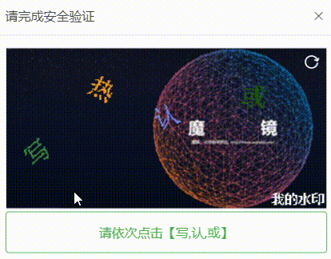
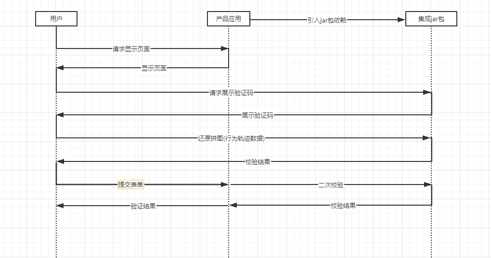

# 组件讲解-图形验证码使用全解析，提升系统安全性的必备技巧

# 背景


在如今越来越多人使用互联网程序的背景下，很多的项目也为了应对高并发而想出了各种应对方案，其中就包括防刷和并发缓解，不少公司为了验证不是机器人或者绑定手机号，用的是短发发送验证码的方法。这种现在基本上是通用的方案了


但还有种情况，比如说热门的促销或者活动，使得大量的用户在一瞬间购买某项产品，这里除了要考虑经典的扣减库存问题外，还要考虑当并发量达到了项目规定的限制后，需要先缓解一下，让瞬间请求降下来，那么怎么缓解而且不影响用户体验呢？**图形验证码**就是经典的解决方案，相信大家在使用各种购买类型的程序时，如电商，购票等，肯定遇到过需要滑动验证码的操作。


而在本人在此大麦网项目中，为了应对**用户注册而可能会产生的缓存穿透问题**，使用了图形验证码的功能，极大了缓解了数据库的压力


下面来介绍下图形验证码的功能


# 图形验证码


目前开源项目已提供了图形验证码功能，gitee的地址为


[anji-plus/AJ-Captcha](https://gitee.com/anji-plus/captcha)


## 介绍


行为验证码采用嵌入式集成方式，接入方便，安全，高效。抛弃了传统字符型验证码展示-填写字符-比对答案的流程，采用验证码展示-采集用户行为-分析用户行为流程，用户只需要产生指定的行为轨迹，不需要键盘手动输入，极大优化了传统验证码用户体验不佳的问题；同时，快速、准确的返回人机判定结果。目前对外提供两种类型的验证码，其中包含滑动拼图、文字点选。如图1-1、1-2所示。若希望不影响原UI布局，可采用弹出式交互。


后端基于Java实现，提供纯Java.jar和SpringBoot Starter。前端提供了Android、iOS、Futter、Uni-App、ReactNative、Vue、Angular、Html、Php等多端示例。

| 滑动拼图 | 文字点选 |
| --- | --- |
|  |  |
| 图1-1 | 图1-2 |


### 概念术语描述
| 术语 | 描述 |
| --- | --- |
| 验证码类型 | 1）滑动拼图 blockPuzzle  2）文字点选 clickWord |
| 验证 | 用户拖动/点击一次验证码拼图即视为一次“验证”，不论拼图/点击是否正确 |
| 二次校验 | 验证数据随表单提交到后台后，后台需要调用captchaService.verification做二次校验。目的是核实验证数据的有效性。 |


### 交互流程


①   用户访问应用页面，请求显示行为验证码


②   用户按照提示要求完成验证码拼图/点击


③   用户提交表单，前端将第二步的输出一同提交到后台


④   验证数据随表单提交到后台后，后台需要调用captchaService.verification做二次校验


⑤   第4步返回校验通过/失败到产品应用后端，再返回到前端。如下图所示





关于更详细的介绍可直接查看gitee项目 [aj-captcha](https://gitee.com/anji-plus/captcha)


# 图形验证码组件


为了更加方便的使用`aj-captcha`验证码功能，本人将此项目集成到了大麦网项目中，作为基础组件来使用，并且将验证码缓存的方式修改成了改为redis来存储，因为在生产环境服务多实例情况下，使用本地缓存肯定是不行的


**模块：**`damai-captcha-framework`


```xml
<dependency>
    <groupId>com.example</groupId>
    <artifactId>damai-captcha-framework</artifactId>
    <version>${revision}</version>
</dependency>
```


组件保留了`aj-captcha`的所有验证功能，并且提供了获取验证码和校验验证码的api，可以根据业务需求来灵活使用


## 讲解


### 验证码缓存方式


首先我们看下`aj-captcha`中是怎么进行加载缓存数据的


### Springboot3方式
**org.springframework.boot.autoconfigure.AutoConfiguration.imports**

```plain
com.damai.config.AjCaptchaAutoConfiguration
com.damai.config.CaptchaAutoConfig
```


### Springboot2方式
**spring.factories**

```plain
org.springframework.boot.autoconfigure.EnableAutoConfiguration=com.anji.captcha.config.AjCaptchaAutoConfiguration
```


使用了springboot的自动装配功能


**AjCaptchaAutoConfiguration**


```java
@Configuration
@EnableConfigurationProperties(AjCaptchaProperties.class)
@ComponentScan("com.anji.captcha")
@Import({AjCaptchaServiceAutoConfiguration.class, AjCaptchaStorageAutoConfiguration.class})
public class AjCaptchaAutoConfiguration {
}
```


`AjCaptchaStorageAutoConfiguration`就是缓存数据的配置


```java
@Configuration
public class AjCaptchaStorageAutoConfiguration {

    @Bean(name = "AjCaptchaCacheService")
    public CaptchaCacheService captchaCacheService(AjCaptchaProperties ajCaptchaProperties){
        //缓存类型redis/local/....
        return CaptchaServiceFactory.getCache(ajCaptchaProperties.getCacheType().name());
    }
}
```


能够看到是通过`ajCaptchaProperties.getCacheType().name()`属性从`CaptchaServiceFactory`工厂中获取


属性通过`aj.captcha.cache-type`来配置


下面来分析下`CaptchaServiceFactory`工厂的加载流程


```java
public static CaptchaCacheService getCache(String cacheType) {
    return cacheService.get(cacheType);
}

public volatile static Map<String, CaptchaService> instances = new HashMap();
public volatile static Map<String, CaptchaCacheService> cacheService = new HashMap();

static {
    ServiceLoader<CaptchaCacheService> cacheServices = ServiceLoader.load(CaptchaCacheService.class);
    for (CaptchaCacheService item : cacheServices) {
        cacheService.put(item.type(), item);
    }
    logger.info("supported-captchaCache-service:{}", cacheService.keySet().toString());
    ServiceLoader<CaptchaService> services = ServiceLoader.load(CaptchaService.class);
    for (CaptchaService item : services) {
        instances.put(item.captchaType(), item);
    }
    ;
    logger.info("supported-captchaTypes-service:{}", instances.keySet().toString());
}
```


`cacheService`中存在的就是缓存处理类，key为类型， value为`CaptchaCacheService`的实现类


+  spring启动后，会执行被`@Bean`修饰的`captchaCacheService`方法 
+  当`CaptchaServiceFactory`的`getCache`方法时，会加载`CaptchaServiceFactory`类，从而加载static静态块 
+  通过**java spi**机制扫描出`CaptchaCacheService`的实现类，然后添加到`cacheService`中 
+  这时调用`CaptchaServiceFactory`的`getCache`方法时，就会根据缓存类型从`cacheService`中取出 


在`aj-captcha`中，默认的缓存策略使用的是本地缓存


```java
private StorageType cacheType = local;
```


`CaptchaCacheServiceMemImpl`就是本地缓存策略的实现


```java
/**
 * 对于分布式部署的应用，我们建议应用自己实现CaptchaCacheService，比如用Redis，参考service/spring-boot代码示例。
 * 如果应用是单点的，也没有使用redis，那默认使用内存。
 * 内存缓存只适合单节点部署的应用，否则验证码生产与验证在节点之间信息不同步，导致失败。
 * @Title: 默认使用内存当缓存
 * @author lide1202@hotmail.com
 * @date 2020-05-12
 */
public class CaptchaCacheServiceMemImpl implements CaptchaCacheService {
    @Override
    public void set(String key, String value, long expiresInSeconds) {

        CacheUtil.set(key, value, expiresInSeconds);
    }

    @Override
    public boolean exists(String key) {
        return CacheUtil.exists(key);
    }

    @Override
    public void delete(String key) {
        CacheUtil.delete(key);
    }

    @Override
    public String get(String key) {
        return CacheUtil.get(key);
    }

	@Override
	public Long increment(String key, long val) {
    	Long ret = Long.valueOf(CacheUtil.get(key))+val;
		CacheUtil.set(key,ret+"",0);
		return ret;
	}

	@Override
    public String type() {
        return "local";
    }
}
```


在生产中高并发的项目肯定都是多实例部署的，所以本地缓存这种方式肯定不行，我们改用redis的方式


使用redis我们要借助springboot提供的redis操作`StringRedisTemplate`


但要注意，这里缓存策略的实现都是用的**java spi加载得到的**，而且**并没有被spring管理**，所以直接通过构造器注入`StringRedisTemplate`是不行的，需要主动调用方法来进行注入，下面介绍如何改用redis的保存方式


## 改造缓存方式


既然是用**java spi加载得到的**，所以我们要借助spi加载的特点


**java spi的特点：**


+ 在资源目录下新建`META-INF/services`文件夹，此文件夹下的文件名为要实现接口的全限定名，包名+类名
+ 文件内容为实现类的全限定名，包名+类名


我们知道了spi的特点，按照规则，在资源目录下新建`META-INF/services`文件夹，在此文件夹下创建文件，文件名为`com.anji.captcha.service.CaptchaCacheService`，内容为`com.damai.service.CaptchaCacheServiceRedisImpl`


**CaptchaCacheServiceRedisImpl**


```java
public class CaptchaCacheServiceRedisImpl implements CaptchaCacheService {

    @Override
    public String type() {
        return "redis";
    }

    public void setStringRedisTemplate(StringRedisTemplate stringRedisTemplate) {
        this.stringRedisTemplate = stringRedisTemplate;
    }

    private StringRedisTemplate stringRedisTemplate;

    @Override
    public void set(String key, String value, long expiresInSeconds) {
        stringRedisTemplate.opsForValue().set(key, value, expiresInSeconds, TimeUnit.SECONDS);
    }

    @Override
    public boolean exists(String key) {
        return Boolean.TRUE.equals(stringRedisTemplate.hasKey(key));
    }

    @Override
    public void delete(String key) {
        stringRedisTemplate.delete(key);
    }

    @Override
    public String get(String key) {
        return stringRedisTemplate.opsForValue().get(key);
    }
    
    @Override
    public Long increment(String key, long val) {
        return stringRedisTemplate.opsForValue().increment(key,val);
    }
}
```


到这里还有个问题解决，那就是`StringRedisTemplate`要怎么注入到`CaptchaCacheServiceRedisImpl`中呢？我们再来看一下`aj-captcha`生成缓存bean的方式


```java
@Configuration
public class AjCaptchaStorageAutoConfiguration {

    @Bean(name = "AjCaptchaCacheService")
    public CaptchaCacheService captchaCacheService(AjCaptchaProperties ajCaptchaProperties){
        //缓存类型redis/local/....
        return CaptchaServiceFactory.getCache(ajCaptchaProperties.getCacheType().name());
    }
}
```


`**captchaCacheService方法**`**其实是可以被替换的，我们从这里入手，自己重新写一个springboot的自动装配配置类，然后重写一个生成缓存bean的方式来替换掉现有的**


**spring.factories**


```plain
org.springframework.boot.autoconfigure.EnableAutoConfiguration=\
  com.damai.config.CaptchaAutoConfig
```


**CaptchaAutoConfig**


```java
public class CaptchaAutoConfig {
    
    @Bean
    public CaptchaHandle captchaHandle(CaptchaService captchaService){
        return new CaptchaHandle(captchaService);
    }
    
    @Bean(name = "AjCaptchaCacheService")
    @Primary
    public CaptchaCacheService captchaCacheService(AjCaptchaProperties config, StringRedisTemplate redisTemplate){
        //缓存类型redis/local/....
        CaptchaCacheService ret = CaptchaServiceFactory.getCache(config.getCacheType().name());
        if(ret instanceof CaptchaCacheServiceRedisImpl){
            ((CaptchaCacheServiceRedisImpl)ret).setStringRedisTemplate(redisTemplate);
        }
        return ret;
    }
}
```


`captchaCacheService`方法被`@Primary`修饰，表示当spring容器中存在多个`CaptchaCacheService`类型的bean时，选择此方法的bean。


在此方法中使用类型转换，如果是`CaptchaCacheServiceRedisImpl`的对象，那么直接调用`setStringRedisTemplate`方法来将`StringRedisTemplate`注入进去


到这里，主要的问题就解决了，下面就是提供额外的获取验证码和校验验证码的方法，来供其他项目来使用了


**CaptchaHandle**


```java
@AllArgsConstructor
public class CaptchaHandle {
    
    private final CaptchaService captchaService;
    
    /**
    * 获取验证码
    */
    public ResponseModel getCaptcha(CaptchaVO captchaVO) {
        RequestAttributes requestAttributes = RequestContextHolder.getRequestAttributes();
        assert requestAttributes != null;
        HttpServletRequest request = ((ServletRequestAttributes) requestAttributes).getRequest();
        captchaVO.setBrowserInfo(RemoteUtil.getRemoteId(request));
        return captchaService.get(captchaVO);
    }
    
    /**
    * 校验验证码
    */
    public ResponseModel checkCaptcha(CaptchaVO captchaVO) {
        RequestAttributes requestAttributes = RequestContextHolder.getRequestAttributes();
        assert requestAttributes != null;
        HttpServletRequest request = ((ServletRequestAttributes) requestAttributes).getRequest();
        captchaVO.setBrowserInfo(RemoteUtil.getRemoteId(request));
        return captchaService.verification(captchaVO);
    }
}
```


另外，我把`aj-captcha`中的`springboot`示例项目中的图片也都保存到了`damai-captcha-framework`组件中，图片文件夹的问题也没有变


+ images 
    - jigsaw 
        * original
        * slidingBlock
    - pic-click


如果有小伙伴想修改图形验证码的样式，那么直接把新的图片放到对应文件夹即可


以上就是将图形验证码组件介绍完毕，而在用户注册流程中有完整使用图形验证码的部分，可跳转到相应的文档来查看


[业务讲解-用户注册-到底如何使用图形验证码](https://www.yuque.com/u22210564/ykdrdh/at4sfd4okszze60i)


> 更新: 2024-07-24 14:37:08  
> 原文: <https://www.yuque.com/u22210564/ykdrdh/rtr7n0n38mlhdcb6>