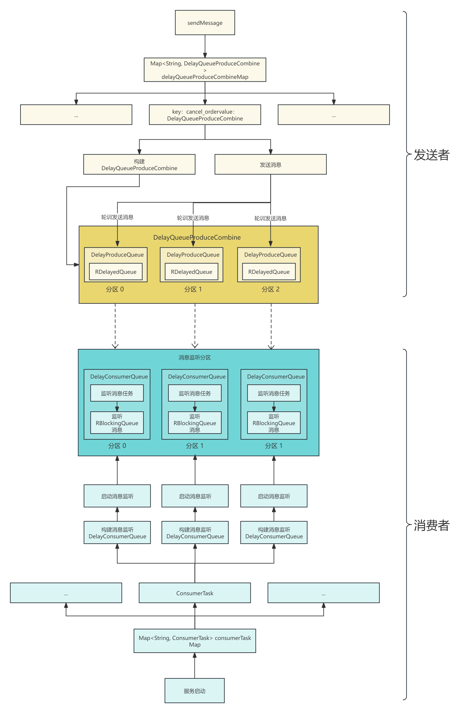

# 组件讲解-如何实现高性能延迟队列-消费消息

在本文中，我们来介绍延迟队列组件**damai-service-delay-queue-framework**消费消息的流程，关于组件的使用和发送消息的流程，可跳转到相应文档查看


[组件讲解-如何实现高性能延迟队列-发送消息](https://www.yuque.com/u22210564/ykdrdh/zhgo0z2smmvnz6ah)


建议小伙伴先学习完发送消息的流程后，再来学习本人内容。


# 消费消息


## 使用


下面我们来开始分析，以订单延迟关闭为例，


```java
@Slf4j
@Component
public class DelayOrderCancelConsumer implements ConsumerTask {
    
    @Autowired
    private OrderService orderService;
    
    @Override
    public void execute(String content) {
        log.info("延迟订单取消消息进行消费 content : {}", content);
        if (StringUtil.isEmpty(content)) {
            log.error("延迟队列消息不存在");
            return;
        }
        DelayOrderCancelDto delayOrderCancelDto = JSON.parseObject(content, DelayOrderCancelDto.class);
        
        //取消订单
        OrderCancelDto orderCancelDto = new OrderCancelDto();
        orderCancelDto.setOrderNumber(delayOrderCancelDto.getOrderNumber());
        boolean cancel = orderService.cancel(orderCancelDto);
        if (cancel) {
            log.info("延迟订单取消成功 orderCancelDto : {}",content);
        }else {
            log.error("延迟订单取消失败 orderCancelDto : {}",content);
        }
    }
    
    @Override
    public String topic() {
        return SpringUtil.getPrefixDistinctionName() + "-" + DELAY_ORDER_CANCEL_TOPIC;
    }
}
```


**DelayOrderCancelConsumer**是监听消息的处理类，实现了


```java
public interface ConsumerTask {
    
    /**
     * 消费任务
     * @param content 具体参数
     * */
    void execute(String content);
    /**
     * 主题
     * @return 主题
     * */
    String topic();
}
```


使用起来很简单，只要实现**ConsumerTask**接口的方法即可，然后注入到Spring中即可，


> **<font style="color:#213BC0;">要注意同一个topic下的发送者和消费者配置的分区数要相同，默认为5</font>**
>


```java
delay.queue.isolationRegionCount = 5
```


## 分析


从服务启动来入手


### DelayQueueInitHandler


```java
@AllArgsConstructor
public class DelayQueueInitHandler implements ApplicationListener<ApplicationStartedEvent> {
    
    private final DelayQueueBasePart delayQueueBasePart;
    
    @Override
    public void onApplicationEvent(ApplicationStartedEvent event) {
        //获取ConsumerTask集合
        Map<String, ConsumerTask> consumerTaskMap = event.getApplicationContext().getBeansOfType(ConsumerTask.class);
        if (CollectionUtil.isEmpty(consumerTaskMap)) {
            return;
        }
        for (ConsumerTask consumerTask : consumerTaskMap.values()) {
            //构建消息主题数据
            DelayQueuePart delayQueuePart = new DelayQueuePart(delayQueueBasePart,consumerTask);
            //获取分区数
            Integer isolationRegionCount = delayQueuePart.getDelayQueueBasePart().getDelayQueueProperties()
                    .getIsolationRegionCount();
            //根据分区数来创建消息消费队列
            for(int i = 0; i < isolationRegionCount; i++) {
                DelayConsumerQueue delayConsumerQueue = new DelayConsumerQueue(delayQueuePart, 
                        delayQueuePart.getConsumerTask().topic() + "-" + i);
                //创建队列后监听消息
                delayConsumerQueue.listenStart();
            }
        }
    } 
}
```


+ 项目启动后执行`onApplicationEvent`方法，从Spring中获取**ConsumerTask**，也就是消息消费的业务bean对象集合
+ 循环集合，构建**DelayQueuePart** 消息主题数据
+ 获取主题的分区数**isolationRegionCount**
+ 根据分区数来创建出消息消费队列**DelayConsumerQueue**，将**DelayQueuePart** 消息主题数据和**分区topic**传入
+ 创建好**DelayConsumerQueue**后，启动监听消息


#### DelayQueuePart构建


```java
@Data
public class DelayQueuePart {
    
    /**
     * 延迟队列配置信息
     * */
    private final DelayQueueBasePart delayQueueBasePart;
    /**
     * 客户端对象
     * */
    private final ConsumerTask consumerTask;
    
    public DelayQueuePart(DelayQueueBasePart delayQueueBasePart, ConsumerTask consumerTask){
        this.delayQueueBasePart = delayQueueBasePart;
        this.consumerTask = consumerTask;
    }
}
```


#### 消息主题分区(重点!!!)


**<font style="color:#213BC0;">delayQueuePart.getConsumerTask().topic() + "-" + i</font>**** **是根据分区数，来将主题进行分片，比如说分区数是5，那么就把主题分成了5份。top为`d_delay_order_cancel_topic`，分区后实际的主题为`d_delay_order_cancel_topic-0` ... `d_delay_order_cancel_topic-4`


#### DelayConsumerQueue构建


```java
@Slf4j
public class DelayConsumerQueue extends DelayBaseQueue{
    
    /**
     * 监听消息线程数
     * */
    private final AtomicInteger listenStartThreadCount = new AtomicInteger(1);
    
    /**
     * 消费消息线程数
     * */
    private final AtomicInteger executeTaskThreadCount = new AtomicInteger(1);
    
    /**
     * 监听消息线程池
     * */
    private final ThreadPoolExecutor listenStartThreadPool;
    
    /**
     * 消费消息线程池
     * */
    private final ThreadPoolExecutor executeTaskThreadPool;
    
    /**
     * 监控消费启动标识
     * */
    private final AtomicBoolean runFlag = new AtomicBoolean(false);
    
    /**
     * 消息处理
     * */
    private final ConsumerTask consumerTask;
    
    public DelayConsumerQueue(DelayQueuePart delayQueuePart, String relTopic){
        //构建RBlockingQueue
        super(delayQueuePart.getDelayQueueBasePart().getRedissonClient(),relTopic);
        //监听消息线程池
        this.listenStartThreadPool = new ThreadPoolExecutor(1,1,60, 
                TimeUnit.SECONDS,new LinkedBlockingQueue<>(),r -> new Thread(Thread.currentThread().getThreadGroup(), r,
                "listen-start-thread-" + listenStartThreadCount.getAndIncrement()));
        //消费消息线程池
        this.executeTaskThreadPool = new ThreadPoolExecutor(
                delayQueuePart.getDelayQueueBasePart().getDelayQueueProperties().getCorePoolSize(),
                delayQueuePart.getDelayQueueBasePart().getDelayQueueProperties().getMaximumPoolSize(),
                delayQueuePart.getDelayQueueBasePart().getDelayQueueProperties().getKeepAliveTime(),
                delayQueuePart.getDelayQueueBasePart().getDelayQueueProperties().getUnit(),
                new LinkedBlockingQueue<>(delayQueuePart.getDelayQueueBasePart().getDelayQueueProperties().getWorkQueueSize()),
                r -> new Thread(Thread.currentThread().getThreadGroup(), r, 
                        "delay-queue-consume-thread-" + executeTaskThreadCount.getAndIncrement()));
        //消息处理逻辑
        this.consumerTask = delayQueuePart.getConsumerTask();
    }
    
    /**
     * 启动消息监听
     * */
    public synchronized void listenStart(){
        if (!runFlag.get()) {
            runFlag.set(true);
            listenStartThreadPool.execute(() -> {
                while (!Thread.interrupted()) {
                    try {
                        assert blockingQueue != null;
                        String content = blockingQueue.take();
                        executeTaskThreadPool.execute(() -> {
                            try {
                                consumerTask.execute(content);
                            }catch (Exception e) {
                                log.error("consumer execute error",e);
                            }
                        });
                    } catch (InterruptedException e) {
                        destroy(executeTaskThreadPool);
                    } catch (Throwable e) {
                        log.error("blockingQueue take error",e);
                    }
                }
            });
        }
    }
    
    public void destroy(ExecutorService executorService) {
        try {
            if (Objects.nonNull(executorService)) {
                executorService.shutdown();
            }
        } catch (Exception e) {
            log.error("destroy error",e);
        }
    }
}
```


下面我们来详细分析每步骤的作用


#### super(delayQueuePart.getDelayQueueBasePart().getRedissonClient(),relTopic)


```java
@Slf4j
public class DelayBaseQueue {
    
    protected final RedissonClient redissonClient;
    protected final RBlockingQueue<String> blockingQueue;
    
    
    public DelayBaseQueue(RedissonClient redissonClient,String relTopic){
        this.redissonClient = redissonClient;
        this.blockingQueue = redissonClient.getBlockingQueue(relTopic);
    }
}
```


在构建**DelayConsumerQueue**时，先构建父类**DelayBaseQueue**，将**RBlockingQueue**构建出来，


这样消息消费队列**DelayConsumerQueue**就含有Redisson的**RBlockingQueue**了。


> 将**RBlockingQueue**单独抽取出来的原因是，发送者和消费者都需要**RBlockingQueue**，单独抽取出来就可以实现共用了
>


#### listenStartThreadPool


```java
//监听消息线程池
this.listenStartThreadPool = new ThreadPoolExecutor(1,1,60, 
TimeUnit.SECONDS,new LinkedBlockingQueue<>(),r -> new Thread(Thread.currentThread().getThreadGroup(), r,
"listen-start-thread-" + listenStartThreadCount.getAndIncrement()));
```


**listenStartThreadPool**的作用是异步启动消息监听，核心线程为1，因为只执行消息监听即可


#### executeTaskThreadPool


```java
//消费消息线程池
this.executeTaskThreadPool = new ThreadPoolExecutor(
        delayQueuePart.getDelayQueueBasePart().getDelayQueueProperties().getCorePoolSize(),
        delayQueuePart.getDelayQueueBasePart().getDelayQueueProperties().getMaximumPoolSize(),
        delayQueuePart.getDelayQueueBasePart().getDelayQueueProperties().getKeepAliveTime(),
        delayQueuePart.getDelayQueueBasePart().getDelayQueueProperties().getUnit(),
        new LinkedBlockingQueue<>(delayQueuePart.getDelayQueueBasePart().getDelayQueueProperties().getWorkQueueSize()),
        r -> new Thread(Thread.currentThread().getThreadGroup(), r, 
                "delay-queue-consume-thread-" + executeTaskThreadCount.getAndIncrement()));
```


**executeTaskThreadPool**的作用是当监听到了消息后，用来执行消息处理逻辑的，线程池的参数可根据业务特点来调整，参数在**DelayQueueProperties**，我们再来回顾一下


```java
@Data
@ConfigurationProperties(prefix = PREFIX)
public class DelayQueueProperties {

    public static final String PREFIX = "delay.queue";
    
    /**
     * 从队列拉取数据的线程池中的核心线程数量，如果业务过慢可调大
     * */
    private Integer corePoolSize = 4;
    /**
     * 从队列拉取数据的线程池中的最大线程数量，如果业务过慢可调大
     * */
    private Integer maximumPoolSize = 4;
    
    /**
     * 从队列拉取数据的线程池中的最大线程回收时间
     * */
    private long keepAliveTime = 30;
    /**
     * 从队列拉取数据的线程池中的最大线程回收时间的时间单位
     * */
    private TimeUnit unit = TimeUnit.SECONDS;
    /**
     * 从队列拉取数据的线程池中的队列数量，如果业务过慢可调大
     * */
    private Integer workQueueSize = 256;
    
    /**
     * 延时队列的隔离分区数，延时有瓶颈时 可调大次数，但会增大redis的cpu消耗(同一个topic发送者和消费者的隔离分区数必须相同)
     * */
    private Integer isolationRegionCount = 5;
}
```


#### delayQueuePart.getConsumerTask()


```java
//消息处理逻辑
this.consumerTask = delayQueuePart.getConsumerTask();
```


**consumerTask**就是对消息进行消费的业务处理了


到这里就是将**DelayConsumerQueue**构建完毕了，我们再回顾一下初始化的部分


```java
@AllArgsConstructor
public class DelayQueueInitHandler implements ApplicationListener<ApplicationStartedEvent> {
    
    private final DelayQueueBasePart delayQueueBasePart;
    
    @Override
    public void onApplicationEvent(ApplicationStartedEvent event) {
        //获取ConsumerTask集合
        Map<String, ConsumerTask> consumerTaskMap = event.getApplicationContext().getBeansOfType(ConsumerTask.class);
        if (CollectionUtil.isEmpty(consumerTaskMap)) {
            return;
        }
        for (ConsumerTask consumerTask : consumerTaskMap.values()) {
            //构建消息主题数据
            DelayQueuePart delayQueuePart = new DelayQueuePart(delayQueueBasePart,consumerTask);
            //获取分区数
            Integer isolationRegionCount = delayQueuePart.getDelayQueueBasePart().getDelayQueueProperties()
                    .getIsolationRegionCount();
            //根据分区数来创建消息消费队列
            for(int i = 0; i < isolationRegionCount; i++) {
                DelayConsumerQueue delayConsumerQueue = new DelayConsumerQueue(delayQueuePart, 
                        delayQueuePart.getConsumerTask().topic() + "-" + i);
                //创建队列后监听消息
                delayConsumerQueue.listenStart();
            }
        }
    } 
}
```


当构建好**DelayConsumerQueue**后，接着执行**delayConsumerQueue.listenStart()**开始启动监听消息的线程


### delayConsumerQueue.listenStart()


```java
/**
 * 启动消息监听
 * */
public synchronized void listenStart(){
    //如果runFlag为false，说明监听没有启动过
    if (!runFlag.get()) {
        //将runFlag为true
        runFlag.set(true);
        //异步执行监听逻辑
        listenStartThreadPool.execute(() -> {
            while (!Thread.interrupted()) {
                try {
                    assert blockingQueue != null;
                    //从Redisson的RBlockingQueue中监听消息
                    String content = blockingQueue.take();
                    //如果监听到消息，则执行处理逻辑
                    executeTaskThreadPool.execute(() -> {
                        try {
                            consumerTask.execute(content);
                        }catch (Exception e) {
                            log.error("consumer execute error",e);
                        }
                    });
                } catch (InterruptedException e) {
                    //如果出现中断异常，则将线程池关闭
                    destroy(executeTaskThreadPool);
                } catch (Throwable e) {
                    log.error("blockingQueue take error",e);
                }
            }
        });
    }
}

public void destroy(ExecutorService executorService) {
    try {
        if (Objects.nonNull(executorService)) {
            executorService.shutdown();
        }
    } catch (Exception e) {
        log.error("destroy error",e);
    }
}
```


通过 **String content = blockingQueue.take()**; 监听到消息后，调用 **executeTaskThreadPool.execut**e 线程池来异步消费消息


#### 总结


+ 如果没有启动过监听，则将监听消息的任务进行异步启动
+ 启动监听消息任务后，从**RBlockingQueue**执行take方法，等待消息的到来
+ 当消息到来后，执行通过**executeTaskThreadPool**线程池异步执行消息处理任务


以上就是将消息的消费流程分析完毕，下面来结合流程图帮助小伙伴更加清晰的理解




> 更新: 2024-08-15 11:31:22  
> 原文: <https://www.yuque.com/u22210564/ykdrdh/acr9dg80m26zq9hq>