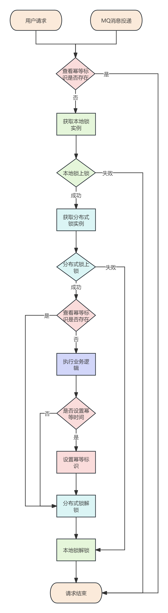

# 组件讲解-如何打造高效幂等组件，确保数据一致性

# 前言


首先，我们来介绍什么是幂等，**幂等（Idempotent）**是一个数学和计算机科学中的概念，主要描述的是一种属性，即一个操作可以被多次应用，但结果仍然保持不变。在数学中，幂等通常用于描述某些运算或函数的特性。例如，对于单目运算，如果一个运算对于在范围内的所有数，多次进行该运算所得的结果和进行一次该运算所得的结果相同，那么该运算就是幂等的。在双目运算中，如果当参与运算的两个值是等值的情况下，运算结果与参与运算的两个值相等，那么该运算也是幂等的


在web项目中，幂等性同样是一个重要的概念。这主要是因为在网络和分布式系统中，由于网络的不稳定性和其他潜在问题，可能会导致请求被重复发送。如果一个操作不是幂等的，那么重复执行该操作可能会产生不一致的结果或副作用。例如，一个非幂等的操作可能会导致数据被重复添加、更新或删除，从而破坏数据的一致性


因此，JavaWeb项目需要保证幂等性，主要是为了确保无论请求被发送一次还是多次，系统都能产生相同的结果。这有助于避免由于重复请求导致的数据不一致或其他潜在问题。实现幂等性的方法有很多种，包括但不限于使用数据库唯一索引、乐观锁、分布式锁、令牌等技术


总的来说，幂等性是JavaWeb项目中一个非常重要的概念，它有助于确保系统的稳定性和数据的一致性。通过实现幂等性，我们可以有效地处理重复请求，并减少由于网络不稳定或其他原因导致的潜在问题


而关于实现幂等的常见方法和技术：


1.  **唯一标识符（Unique Identifiers）**：  
为每个请求生成一个唯一的标识符（如UUID），并将其作为请求的一部分发送。当接收到请求时，服务器可以检查该标识符是否已处理过。如果已处理，则拒绝或忽略该请求；如果未处理，则处理该请求并记录标识符 
2.  **数据库唯一约束**：  
使用数据库的唯一约束（如主键或唯一索引）来确保即使多次尝试插入相同的数据，也只有一条记录会被保存。如果尝试插入重复的数据，数据库会抛出异常，服务器可以捕获这个异常并返回幂等性的响应 
3.  **乐观锁（Optimistic Locking）**：  
使用版本号或时间戳来检查数据是否已被其他操作修改过。在更新数据时，如果版本号或时间戳与预期的不符，则拒绝更新并返回冲突信息。这样，即使多次尝试更新相同的数据，也只有一次会成功 
4.  **分布式锁（Distributed Locking）**：  
在分布式系统中，可以使用分布式锁来确保同一时间只有一个节点能够执行某个操作。这可以防止多个节点同时处理相同的请求，从而实现幂等性 


而今天我们介绍的幂等性组件，不仅仅是单纯实现幂等，而是要在保证实现幂等的前提下，还要考虑高并发下的高效率执行，不能影响程序的性能和吞吐量


基于上述这些要求，最终选择利用redis来实现，而在对使用redis上，Redisson又是非常优秀的开源中间件，其中的分布式锁是非常的经典，项目中也对分布式锁做了封装，使用起来灵活而方便，而这次幂等组件也是对Redisson基础上进行封装，保证了性能，支持MQ中间件和用户请求的幂等。


#### 为什么不直接使用分布式锁


可能小伙伴会有这样的疑惑，直接使用分布式锁不就行了，为什么还要额外设计出幂等组件？首先直接使用分布式锁是可以实现幂等的，当然业务逻辑验证也要做验证，但其实分布式锁会浪费一些性能


> <font style="color:#213BC0;">分布式锁的特点是多个请求并发执行，这些请求是来自不同的用户，</font>**<font style="color:#213BC0;">也就是这些请求虽然要依次等待锁执行，但最终还是要把这些请求都执行完的</font>**<font style="color:#213BC0;">(执行时间太长超时的异常情况排除)，总结起来就是都要获得锁，没有获得锁的请求，也要争取获得锁接着执行</font>
>
> <font style="color:#213BC0;"> </font>
>
> <font style="color:#213BC0;">幂等的特点也是多个请求并发执行，但这些请求是来自同一个用户，</font>**<font style="color:#213BC0;">也就是说这些请求只要保证第一个请求能执行，其余的请求要直接拒绝掉</font>**<font style="color:#213BC0;">，总结起来就是只有</font>**<font style="color:#213BC0;">第一个请求获得锁执行就可以，其余的请求看到已经上了锁，那么就要直接结束掉</font>**
>


这个也是我在面试别人时，经常会问的问题，知道这个特点后，才真正能掌握为什么需要幂等。所以建议小伙伴认真学习此文章，下来我们就来详细的介绍幂等组件


# damai-repeat-execute-limit-framework


## 使用
#### 1 在Springboot配置redis地址
#### 2 添加依赖
```xml
<dependency>
    <groupId>com.example</groupId>
    <artifactId>damai-repeat-execute-limit-framework</artifactId>
    <version>${revision}</version>
</dependency>
```

#### 3 指定方法
```java
@RepeatExecuteLimit(name = RepeatExecuteLimitConstants.CONSUMER_API_DATA_MESSAGE,keys = {"#apiData.id"})
public void saveApiData(ApiData apiData){
    ApiData dbApiData = apiDataMapper.selectById(apiData.getId());
    if (Objects.isNull(dbApiData)) {
        log.info("saveApiData apiData:{}", JSON.toJSONString(apiData));
        apiDataMapper.insert(apiData);
    }
}
```


## @RepeatExecuteLimit注解属性
| 属性值 | 类型 | 可否默认 | 含义 | 备注 |
| --- | --- | --- | --- | --- |
| name | String | Y | 业务名 | 如：consumerApiDataMessage |
| keys | String[] | N | 幂等唯一标识 | 可指定多个，并支持SpEL表达式，如{"#apiData.id"} |
| durationTime | long | Y | 在多长时间内一直保持幂等，如果不配置则以执行方法为准 | 默认0 |
| message | String | Y | 当消息执行已经出发防重复执行的限制时，提示信息 | 默认 提交频繁，请稍后重试 |


以上就是幂等性组件的使用，可以看到使用起来非常的简单，只需添加依赖，在要保证幂等的方法上添加注解即可。


接下来详细的讲解幂等性组件的设计


## 流程


这里先列出流程图，帮助小伙伴更好梳理流程，当小伙伴看到整个流程解析后，再回过头来看，也能更加的帮助理解




## 设计


#### RepeatExecuteLimitAutoConfiguration


```java
public class RepeatExecuteLimitAutoConfiguration {
    
    @Bean(LockInfoType.REPEAT_EXECUTE_LIMIT)
    public LockInfoHandle repeatExecuteLimitHandle(){
        return new RepeatExecuteLimitLockInfoHandle();
    }
    
    @Bean
    public RepeatExecuteLimitAspect repeatExecuteLimitAspect(LocalLockCache localLockCache,
                                                             LockInfoHandleFactory lockInfoHandleFactory,
                                                             ServiceLockFactory serviceLockFactory,
                                                             RedissonDataHandle redissonDataHandle){
        return new RepeatExecuteLimitAspect(localLockCache, lockInfoHandleFactory,serviceLockFactory,redissonDataHandle);
    }
}
```


**RepeatExecuteLimitAutoConfiguration**是自动装配类，用于加载需要的对象，**repeatExecuteLimitHandle**是锁键名处理器、**repeatExecuteLimitAspect**是幂等切面


接下来按照请求流程来讲解幂等过程，经过多年的文档写作经验，还是这样线程讲解更容易让人理解


### RepeatExecuteLimitAspect


```java
@Slf4j
@Aspect
@Order(-11)
@AllArgsConstructor
public class RepeatExecuteLimitAspect {
    
    private final LocalLockCache localLockCache;
    
    private final LockInfoHandleFactory lockInfoHandleFactory;
    
    private final ServiceLockFactory serviceLockFactory;
    
    private final RedissonDataHandle redissonDataHandle;
    
    
    @Around("@annotation(repeatLimit)")
    public Object around(ProceedingJoinPoint joinPoint, RepeatExecuteLimit repeatLimit) throws Throwable {
        //指定保持幂等的时间
        long durationTime = repeatLimit.durationTime();
        //提示信息
        String message = repeatLimit.message();
        Object obj;
        //获取锁信息
        LockInfoHandle lockInfoHandle = lockInfoHandleFactory.getLockInfoHandle(LockInfoType.REPEAT_EXECUTE_LIMIT);
        //解析锁名字
        String lockName = lockInfoHandle.getLockName(joinPoint,repeatLimit.name(), repeatLimit.keys());
        //幂等标识
        String repeatFlagName = PREFIX_NAME + lockName;
        //获得幂等标识
        String flagObject = redissonDataHandle.get(repeatFlagName);
        //如果幂等标识的值为success，说明已经有请求在执行了，这次请求直接结束
        if (SUCCESS_FLAG.equals(flagObject)) {
            throw new DaMaiFrameException(message);
        }
        //获取本地锁
        ReentrantLock localLock = localLockCache.getLock(lockName,false);
        //本地锁获取锁
        boolean localLockResult = localLock.tryLock();
        //如果上锁失败，说明已经有请求在执行了，这次请求直接结束
        if (!localLockResult) {
            throw new DaMaiFrameException(message);
        }
        try {
            //获取分布式锁
            ServiceLocker lock = serviceLockFactory.getLock(LockType.Reentrant);
            //分布式锁获取锁
            boolean result = lock.tryLock(lockName, TimeUnit.SECONDS, 0);
            //加锁成功执行
            if (result) {
                try{
                    //再次获取幂等标识
                    flagObject = redissonDataHandle.get(repeatFlagName);
                    //如果幂等标识的值为success，说明已经有请求在执行了，这次请求直接结束
                    if (SUCCESS_FLAG.equals(flagObject)) {
                        throw new DaMaiFrameException(message);
                    }
                    //执行业务逻辑
                    obj = joinPoint.proceed();
                    if (durationTime > 0) {
                        try {
                            //业务逻辑执行成功 并且 指定了设置幂等保持时间 设置请求标识
                            redissonDataHandle.set(repeatFlagName,SUCCESS_FLAG,durationTime,TimeUnit.SECONDS);
                        }catch (Exception e) {
                            log.error("getBucket error",e);
                        }
                    }
                    return obj;
                } finally {
                    lock.unlock(lockName);
                }
            }else{
                //获取锁失败，说明已经有请求在执行了，这次请求直接结束
                throw new DaMaiFrameException(message);
            }
        }finally {
            localLock.unlock();
        }
    }
}
```


**RepeatExecuteLimitAspect**是负责幂等执行的切面也是核心流程，大家注意这里设置了**@Order(-11) **** **，这么做的原因分布式锁也使用了切面的实现方式，而分布式锁的**Order是-10**，而幂等要在分布式前执行，所以order的值要比分布式锁小。至于为什么分布式锁设置是-10，而不是其他值，原因是为了给其他的业务切面预留


下面我们来对关键部分做详细的解析


#### 获取锁键名处理器


```java
LockInfoHandle lockInfoHandle = lockInfoHandleFactory.getLockInfoHandle(LockInfoType.REPEAT_EXECUTE_LIMIT);
```


```java
public LockInfoHandle getLockInfoHandle(String lockInfoType){
    return applicationContext.getBean(lockInfoType,LockInfoHandle.class);
}
```


从Spring容器中获取幂等锁键名处理器


```java
@Bean(LockInfoType.REPEAT_EXECUTE_LIMIT)
public LockInfoHandle serviceLockInfoHandle(){
    return new RepeatExecuteLimitLockInfoHandle();
}
```


我们来看下**RepeatExecuteLimitLockInfoHandle**的结构


```java
public class RepeatExecuteLimitLockInfoHandle extends AbstractLockInfoHandle {

    public static final String PREFIX_NAME = "REPEAT_EXECUTE_LIMIT";
    
    @Override
    protected String getLockPrefixName() {
        return PREFIX_NAME;
    }
}
```


**RepeatExecuteLimitLockInfoHandle** 继承了 **AbstractLockInfoHandle**


```java
public abstract class AbstractLockInfoHandle implements LockInfoHandle {
    
    private static final String LOCK_DISTRIBUTE_ID_NAME_PREFIX = "LOCK_DISTRIBUTE_ID";

    private final ParameterNameDiscoverer nameDiscoverer = new DefaultParameterNameDiscoverer();

    private final ExpressionParser parser = new SpelExpressionParser();
    
    /**
     * 锁信息前缀
     * @return 具体前缀
     * */
    protected abstract String getLockPrefixName();
    /**
     * 解析出锁的键
     * @param joinPoint 切点
     * @param name 业务名
     * @param keys 参数值
     * @return 解析后的锁的键
     * 
     * */
    @Override
    public String getLockName(JoinPoint joinPoint,String name,String[] keys){
        return SpringUtil.getPrefixDistinctionName() + "-" + getLockPrefixName() + SEPARATOR + name + getRelKey(joinPoint, keys);
    }
    
    /**
     * 解析出锁的键
     * @param name 业务名
     * @param keys 参数名
     * @return 解析后的锁的键
     *
     * */
    @Override
    public String simpleGetLockName(String name,String[] keys){
        List<String> definitionKeyList = new ArrayList<>();
        for (String key : keys) {
            if (StringUtil.isNotEmpty(key)) {
                definitionKeyList.add(key);
            }
        }
        return SpringUtil.getPrefixDistinctionName() + "-" + 
                LOCK_DISTRIBUTE_ID_NAME_PREFIX + SEPARATOR + name + SEPARATOR + String.join(SEPARATOR, definitionKeyList);
    }

    /**
     * 获取自定义键
     * @param joinPoint 切点
     * @param keys 参数名
     * @return 获取自定义键
     * */
    private String getRelKey(JoinPoint joinPoint, String[] keys){
        Method method = getMethod(joinPoint);
        List<String> definitionKeys = getSpElKey(keys, method, joinPoint.getArgs());
        return SEPARATOR + String.join(SEPARATOR, definitionKeys);
    }
    
    /**
     * 获取自定义键
     * @param joinPoint 切点
     * @return 切点的方法
     * */
    private Method getMethod(JoinPoint joinPoint) {
        MethodSignature signature = (MethodSignature) joinPoint.getSignature();
        Method method = signature.getMethod();
        if (method.getDeclaringClass().isInterface()) {
            try {
                method = joinPoint.getTarget().getClass().getDeclaredMethod(signature.getName(),
                        method.getParameterTypes());
            } catch (Exception e) {
                log.error("get method error ",e);
            }
        }
        return method;
    }
    
    /**
     * 获取自定义键
     * @param definitionKeys 参数名
     * @param method 方法
     * @param parameterValues 参数值
     * @return 切点的方法
     * */
    private List<String> getSpElKey(String[] definitionKeys, Method method, Object[] parameterValues) {
        List<String> definitionKeyList = new ArrayList<>();
        for (String definitionKey : definitionKeys) {
            if (!ObjectUtils.isEmpty(definitionKey)) {
                EvaluationContext context = new MethodBasedEvaluationContext(null, method, parameterValues, nameDiscoverer);
                Object objKey = parser.parseExpression(definitionKey).getValue(context);
                definitionKeyList.add(ObjectUtils.nullSafeToString(objKey));
            }
        }
        return definitionKeyList;
    }

}
```


**AbstractLockInfoHandle** 是解析锁信息的核心处理类，使用Spel进行解析就是在此类进行执行的，之所以将逻辑抽取到**AbstractLockInfoHandle**的原因是除了幂等组件需要处理锁信息外，分布式锁组件也需要此功能。


#### 解析锁信息


为了将幂等组件和分布式锁组件的锁的键区分开，避免重复，所以需要前缀不同，所以在**getLockName**方法中进行组装锁的信息时，预留了抽象方法**getLockPrefixName**给具体的幂等组件和分布式锁组件来实现。这种策略就是经典的**模版模式**


```java
/**
 * 锁信息前缀
 * @return 具体前缀
 * */
protected abstract String getLockPrefixName();

@Override
public String getLockName(JoinPoint joinPoint,String name,String[] keys){
	return SpringUtil.getPrefixDistinctionName() + "-" + getLockPrefixName() + SEPARATOR + name + getRelKey(joinPoint, keys);
}
```


当获取的了锁键名后，就开始了验证幂等的流程


#### 获取标识


```java
public static final String PREFIX_NAME = "repeat_flag";

String repeatFlagName = PREFIX_NAME + lockName;
String flagObject = redissonDataHandle.get(repeatFlagName);
if (SUCCESS_FLAG.equals(flagObject)) {
    throw new DaMaiFrameException(message);
}
```


将获取的锁键名**lockName**再拼接前缀，原因是将幂等的锁的键名区分开


获得标识**flagObject**后，如果flagObject = success，说明上一个请求已经执行完毕设置了幂等标识，那么这次请求直接结束掉


如果没有标识，那么继续执行请求


#### 本地锁


```java
ReentrantLock localLock = localLockCache.getLock(lockName,true);
boolean localLockResult = localLock.tryLock();
if (!localLockResult) {
    throw new DaMaiFrameException(message);
}
```


**localLockCache**是本地锁缓存，可根据锁名和锁类型(公平锁/非公平锁)来获得ReentrantLock的实例


#### LocalLockCache


```java
public class LocalLockCache {
    
    /**
     * 本地锁缓存
     * */
    private Cache<String, ReentrantLock> localLockCache;
    /**
     * 本地锁的过期时间(小时单位)
     * */
    @Value("${durationTime:2}")
    private Integer durationTime;
    
    @PostConstruct
    public void localLockCacheInit(){
        localLockCache = Caffeine.newBuilder()
                .expireAfterWrite(durationTime, TimeUnit.HOURS)
                .build();
    }
    
    /**
     * 获得锁，Caffeine的get是线程安全的
     * */
    public ReentrantLock getLock(String lockKey,boolean fair){
        return localLockCache.get(lockKey, key -> new ReentrantLock(fair));
    }
}
```


**LocalLockCache**其实是用Caffeine缓存来保存的锁信息，并可以设置锁实例的保存时间，默认是2小时，这个时间可以根据`durationTime`来进行配置，如果时间过大，那么锁的实例就会过多，对项目的内存就会有压力。如果时间过小，那么构建锁的频率就会增加，性能就会受到影响，使用时，可根据业务特点进行灵活配置


**Caffeine**是基于Java 1.8的高性能本地缓存库，由Guava改进而来，而且在Spring5开始的默认缓存实现就将Caffeine代替原来的Google Guava，官方说明指出，其缓存命中率已经接近最优值。实际上Caffeine这样的本地缓存和ConcurrentMap很像，即支持并发，并且支持O(1)时间复杂度的数据存取。二者的主要区别在于：


+ ConcurrentMap将存储所有存入的数据，直到你显式将其移除；
+ Caffeine将通过给定的配置，自动移除“不常用”的数据，以保持内存的合理占用。


因此，一种更好的理解方式是：Cache是一种带有存储和移除策略的Map。


官网地址：

[GitHub - ben-manes/caffeine: A high performance caching library for Java](https://github.com/ben-manes/caffeine)


当获得本地锁实例后，会去尝试加锁，如果加锁失败，说明之前已经有请求获得了锁在执行中没有释放掉，那么这次请求直接结束


##### 本地锁的作用


> <font style="color:#213BC0;">之所以先使用本地锁去加锁的原因是，可以很大程度上节省分布式锁的资源，虽然分布式锁是利用reids实现的，redis的性能又非常的高，但是它再高，依旧存在网络损耗，而本地锁的操作都是基于内存中，</font>**<font style="color:#213BC0;">一个是内存中操作，一个是网络操作，前者的效率可是后者的几十倍差距。</font>**
>
> <font style="color:#213BC0;"> </font>
>
> <font style="color:#213BC0;">如果一秒内有100个请求，服务的实例有5个，那么每个实例就有20个请求，这20个请求就可以靠本地锁来拦截掉，那么到分布式锁那里，就有5个请求来获得锁了，其余的95个请求都可以被提前结束掉</font>
>
> <font style="color:#213BC0;"> </font>
>
> <font style="color:#213BC0;">这是一个经典的思想，优先考虑本地内存操作，经过本地内存操作后，再去操作第三方中间件。这种思想在选择节目后进行下单的业务中也会应用，等小伙伴阅读此章节，就会体会到</font>
>


#### 分布式锁


当本地锁获得了锁之后，还要用分布式锁去尝试获得锁，因为本地锁只能保证当前自己的实例范围内能锁住请求，微服务多个实例部署的话，就需要分布式锁了


```java
//加锁成功执行
if (result) {
    try{
        //再次获取幂等标识
        flagObject = redissonDataHandle.get(repeatFlagName);
        //如果幂等标识的值为success，说明已经有请求在执行了，这次请求直接结束
        if (SUCCESS_FLAG.equals(flagObject)) {
            throw new DaMaiFrameException(message);
        }
        //执行业务逻辑
        obj = joinPoint.proceed();
        if (durationTime > 0) {
            try {
                //业务逻辑执行成功 并且 指定了设置幂等保持时间 设置请求标识
                redissonDataHandle.set(repeatFlagName,SUCCESS_FLAG,durationTime,TimeUnit.SECONDS);
            }catch (Exception e) {
                log.error("getBucket error",e);
            }
        }
        return obj;
    } finally {
        lock.unlock(lockName);
    }
}else{
    //获取锁失败，说明已经有请求在执行了，这次请求直接结束
    throw new DaMaiFrameException(message);
}
```


当通过分布式锁工厂获取到客户端实例后，就会尝试去获取分布式锁了，如果加锁失败，说明之前已经有请求获得了锁在执行中没有释放掉，那么这次请求直接结束


如果加锁成功则执行业务逻辑**joinPoint.proceed()**


+ 如果执行业务逻辑成功，如果设置了幂等保持时间，那么设置幂等标识
+ 如果执行业务逻辑失败，那么直接释放锁


#### 设置幂等标识的作用


> <font style="color:#213BC0;">有的小伙伴可能会好奇，为什么要设置幂等标识？直接使用本地锁+分布式锁不就可以实现幂等了吗？为什么多此一举？只使用本地锁+分布式锁的方法确实能实现幂等，但此项目是为了高并发的，考虑的细节要全面。</font>
>
> <font style="color:#213BC0;"> </font>
>
> <font style="color:#213BC0;">幂等包括用户请求幂等和MQ消息幂等</font>
>
> <font style="color:#213BC0;"> </font>
>
> <font style="color:#213BC0;">要介绍这两种的特点</font>
>
> <font style="color:#213BC0;"> </font>
>
> <font style="color:#213BC0;">用户请求的幂等特点是用户在短时间内多次的点击，比如说一秒内发出了10次请求，那么就第1次请求正常执行，而剩余9次请求要全部被拦截将请求直接结束掉，特点是</font>**<font style="color:#213BC0;">短时间内的多次请求</font>**
>
> <font style="color:#213BC0;"> </font>
>
> <font style="color:#213BC0;">MQ消息幂等特点是MQ为了保证消息的可靠性。在有些异常情况确实会重复投递的，比如说 某个服务监听到了消息，接着执行业务逻辑，但在执行过程中，这个服务宕机了，没有给MQ发送消息提交机制，MQ就会认为消息没有消费成功，就会再次投递。但其实这个逻辑都执行成功了，就差给MQ提交确认了。</font>
>
> <font style="color:#213BC0;"> </font>
>
> <font style="color:#213BC0;">这就需要保证幂等。而MQ的重试就没有用户多次重复请求那么频繁，可能会1分钟 5分钟 10分钟，这种情况就需要幂等标识，当有了标识后逻辑直接结束</font>
>


### 注意


有的小伙伴刚接触开发，对并发产生的细节问题不太清楚，比如幂等和分布式锁，直接使用就觉的没有问题了，但其实并不是这样，我们来举一个例子，比如说添加用户的操作


1. 请求获得锁得到执行
2. 开启事务
3. 向数据库中添加用户
4. 提交事务


这个流程其实是有问题的，比如说第一个请求添加了用户后释放了锁，第二个请求是重复提交的，也添加了用户，这两个用户就是重复的。所以要在第2步后，要有验证用户是否存在的步骤，这个属于业务验证，需要业务来实现，**组件只能防止并发重复，并不能防止业务重复**。正确的流程：


1. 请求获得锁得到执行
2. 开启事务
3. 查询用户是否已存在
4. 向数据库中添加用户
5. 提交事务


> 更新: 2024-09-30 11:32:52  
> 原文: <https://www.yuque.com/u22210564/ykdrdh/ro5vey3tmlgzdw0p>