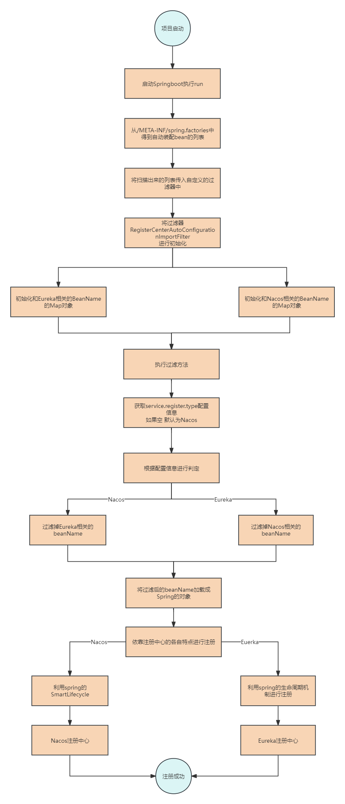

# 组件讲解-实现灵活切换注册中心

# 前言
Springboot3遗弃了Eureka，所以不存在切换的说法，在项目的Springboot3版本中移除了此组件，如果对此组件功能想学习的小伙伴，要去项目的Springboot2版本中学习<font style="color:#DF2A3F;">（切换到main-Springboot-2分支即可）</font>

# 问题


大家开发的项目如果是给多个甲方合作的话，会涉及到代码和环境一致性的问题，尤其是在项目架构升级的时候，各种各样你想不到的问题都会发生。没办法，谁让甲方是大哥呢！本文介绍的就是其中一个很常见的升级问题


项目一开始时，选择使用的注册中心是Eureka，然后就正常的开发迭代，这时已经有和几个甲方合作了。接着随着时间的推移，这些技术框架也会面临着过时，或者不再维护的风险，就比如说Eureka，现如今Eureka不再维护，性能也比较弱了，并且也不能进行很好的进行监控，而Nacos作为热度很高的注册中心，无论是社区的热度，问题的及时解决，以及性能上，可以说是吊打Eureka了，


随着项目服务越来越多，Eureka也确实出现了不少的问题，所以经过研究决定要将注册中心切换为Nacos，这时就出现问题了，就是不同的客户要求不一样，如果是新客户就可以直接使用Nacos的注册中心，但有的是之前的旧客户，不允许对架构进行大改动，不允许更换注册中心，所以还需继续使用Eureka，但代码都是维护的同一套，这就需要实现能在不同的环境中注册到不同的注册中心上


# 思考


解决这个问题其实可以从**Springboot**入手，Springboot依赖框架的特点就是**Starter**，而Starter的特点就是**自动装配**，而这两者注册中心核心都是依靠**自动装配**进行加载Bean对象，然后依靠Spring容器来执行注册的逻辑，就比如Nacos的注册就是依靠Spring中的**SmartLifecycle**


所以我们可以利用Springboot的自动装配机制，在自动装配的过程中，有着可以**过滤掉自动装配bean对象的方法**，我们可以利用这一点，在配置文件中加一个配置，来指定注册中心，然后通过此配置来**排除相应的自动装配bean**


# 分析过程


建议大家先阅读[技术精华-到底为什么要使用自动装配？而不是@Configuration](https://www.yuque.com/u22210564/ykdrdh/nbz9x32povuvwezr)这篇文档，详细的解释了到底为什么要使用自动装配机制，以及相应的原理。此文的重点是给出将注册中心的切换实现过程的方案


### 从Springboot启动入口进行分析


```java
public ConfigurableApplicationContext run(String... args) {
    /**
     * 省略。。。
     * */
    
    //这里会执行spring的启动流程
    refreshContext(context);
    
    /**
     * 省略。。。
     * */
}
```


### Spring中最重要的启动流程核心 refresh()


```java
public void refresh() throws BeansException, IllegalStateException {
    synchronized (this.startupShutdownMonitor) {
        /**
         * 省略。。。
         * */
         
        // 在这里执行所有的BeanFactoryPostProcessor也就是后置处理器
        invokeBeanFactoryPostProcessors(beanFactory);

        /**
         * 省略。。。
         * */
    }
}
```


在众多的有一个`ConfigurationClassPostProcessor`,`ConfigurationClassPostProcessor`实现了`BeanDefinitionRegistryPostProcessor`接口的`postProcessBeanDefinitionRegistry`方法，此方法作用就是向容器中加载bean配置。


```java
public void postProcessBeanDefinitionRegistry(BeanDefinitionRegistry registry) {
    /**
    * 省略。。。
    * */

    
    processConfigBeanDefinitions(registry);
}
```


`processConfigBeanDefinitions`是重点，此方法非常复杂，我们只分析本文重点


```java
public void processConfigBeanDefinitions(BeanDefinitionRegistry registry) {
    //省略
    do {
        StartupStep processConfig = this.applicationStartup.start("spring.context.config-classes.parse");
        //重点，进入分析
        parser.parse(candidates);
        parser.validate();

        Set<ConfigurationClass> configClasses = new LinkedHashSet<>(parser.getConfigurationClasses());
        configClasses.removeAll(alreadyParsed);

        //省略
    }
    while (!candidates.isEmpty());

    //省略
}
```


`parser.parse(candidates);`中的方法及其复杂，我们直接调到`AutoConfigurationImportSelector#getAutoConfigurationEntry`方法，此方法是关键


### getAutoConfigurationEntry 获取自动装配类


```java
protected AutoConfigurationEntry getAutoConfigurationEntry(AnnotationMetadata annotationMetadata) {
	if (!isEnabled(annotationMetadata)) {
		return EMPTY_ENTRY;
	}
	AnnotationAttributes attributes = getAttributes(annotationMetadata);
	//重点！！！ configurations就是自动装配扫描的类集合
	List<String> configurations = getCandidateConfigurations(annotationMetadata, attributes);
	configurations = removeDuplicates(configurations);
	Set<String> exclusions = getExclusions(annotationMetadata, attributes);
	checkExcludedClasses(configurations, exclusions);
	configurations.removeAll(exclusions);
    //这里就是我们要重点关注的
    //getConfigurationClassFilter()获得过滤器
    //filter进行具体的过滤
	configurations = getConfigurationClassFilter().filter(configurations);
	fireAutoConfigurationImportEvents(configurations, exclusions);
	return new AutoConfigurationEntry(configurations, exclusions);
}
```


### getCandidateConfigurations


自动装配查找，从META-INF/spring.factories文件中获取


```java
protected List<String> getCandidateConfigurations(AnnotationMetadata metadata, AnnotationAttributes attributes) {
	List<String> configurations = SpringFactoriesLoader.loadFactoryNames(getSpringFactoriesLoaderFactoryClass(),
			getBeanClassLoader());
	Assert.notEmpty(configurations, "No auto configuration classes found in META-INF/spring.factories. If you "
			+ "are using a custom packaging, make sure that file is correct.");
	return configurations;
}
```


```java
protected Class<?> getSpringFactoriesLoaderFactoryClass() {
    return EnableAutoConfiguration.class;
}
```


很明显这里就是从`META-INF/spring.factories`文件中读取以`EnableAutoConfiguration`为key指定的自动装配类，其实Eureka和Nacos也是在此文件设置的装配


### getConfigurationClassFilter()


自动装配过滤器查找，从**META-INF/spring.factories**文件中获取


```java
private ConfigurationClassFilter getConfigurationClassFilter() {
    if (this.configurationClassFilter == null) {
        //在这里获取过滤器
        List<AutoConfigurationImportFilter> filters = getAutoConfigurationImportFilters();
        for (AutoConfigurationImportFilter filter : filters) {
            invokeAwareMethods(filter);
        }
        this.configurationClassFilter = new ConfigurationClassFilter(this.beanClassLoader, filters);
    }
    return this.configurationClassFilter;
}
```


```java
protected List<AutoConfigurationImportFilter> getAutoConfigurationImportFilters() {
    return SpringFactoriesLoader.loadFactories(AutoConfigurationImportFilter.class, this.beanClassLoader);
}
```


可以看到这里和查找自动装配的流程相同，区别就是从`META-INF/spring.factories`文件中读取以`AutoConfigurationImportFilter`为key指定的自动装配过滤类，我们就要通过此方法来自定义一个过滤器


### filter(configurations)


```java
List<String> filter(List<String> configurations) {
    long startTime = System.nanoTime();
    String[] candidates = StringUtils.toStringArray(configurations);
    boolean skipped = false;
    //在这里就会将上一步读取到的所有装配过滤器，进行循环，然后挨个执行过滤逻辑
    for (AutoConfigurationImportFilter filter : this.filters) {
        boolean[] match = filter.match(candidates, this.autoConfigurationMetadata);
        for (int i = 0; i < match.length; i++) {
            if (!match[i]) {
                candidates[i] = null;
                skipped = true;
            }
        }
    }
    if (!skipped) {
        return configurations;
    }
    List<String> result = new ArrayList<>(candidates.length);
    for (String candidate : candidates) {
        if (candidate != null) {
            result.add(candidate);
        }
    }
    if (logger.isTraceEnabled()) {
        int numberFiltered = configurations.size() - result.size();
        logger.trace("Filtered " + numberFiltered + " auto configuration class in "
                + TimeUnit.NANOSECONDS.toMillis(System.nanoTime() - startTime) + " ms");
    }
    return result;
}
```


# 实现过程


通过上述讲解，我们已经把完整的过程分析了一遍，思路也很明显了，就是要在`META-INF/spring.factories`文件中设置以`AutoConfigurationImportFilter`为key指定的自动装配过滤类，并实现`AutoConfigurationImportFilter`接口，实现`match`方法，在此方法中进行具体的过滤


#### EurekaAutoConfigurationBean


此类是配置进行过滤的eureka所有装配bean


```java
public class EurekaAutoConfigurationBean {
    
    private static final String DiscoveryClientOptionalArgsConfiguration = "org.springframework.cloud.netflix.eureka.config.DiscoveryClientOptionalArgsConfiguration";
    
    private static final String EurekaClientAutoConfiguration = "org.springframework.cloud.netflix.eureka.EurekaClientAutoConfiguration";
    
    private static final String RibbonEurekaAutoConfiguration = "org.springframework.cloud.netflix.ribbon.eureka.RibbonEurekaAutoConfiguration";
    
    private static final String EurekaDiscoveryClientConfiguration = "org.springframework.cloud.netflix.eureka.EurekaDiscoveryClientConfiguration";
    
    private static final String EurekaReactiveDiscoveryClientConfiguration = "org.springframework.cloud.netflix.eureka.reactive.EurekaReactiveDiscoveryClientConfiguration";
    
    private static final String LoadBalancerEurekaAutoConfiguration = "org.springframework.cloud.netflix.eureka.loadbalancer.LoadBalancerEurekaAutoConfiguration";
    
    private static final Map<String,String> map = new HashMap<>(10);
    
    static {
        map.put(DiscoveryClientOptionalArgsConfiguration,DiscoveryClientOptionalArgsConfiguration);
        map.put(EurekaClientAutoConfiguration,EurekaClientAutoConfiguration);
        map.put(RibbonEurekaAutoConfiguration,RibbonEurekaAutoConfiguration);
        map.put(EurekaDiscoveryClientConfiguration,EurekaDiscoveryClientConfiguration);
        map.put(EurekaReactiveDiscoveryClientConfiguration,EurekaReactiveDiscoveryClientConfiguration);
        map.put(LoadBalancerEurekaAutoConfiguration,LoadBalancerEurekaAutoConfiguration);
    }
    
    public static Map<String,String> autoConfigurationBeanNameMap() {
        return map;
    }
}
```


#### NacosAutoConfigurationBean


此类是配置进行过滤的eureka所有装配bean


```java
public class NacosAutoConfigurationBean {
    
    private static final String nacosDiscoveryAutoConfiguration = "com.alibaba.cloud.nacos.discovery.NacosDiscoveryAutoConfiguration";
    
    private static final String ribbonNacosAutoConfiguration = "com.alibaba.cloud.nacos.ribbon.RibbonNacosAutoConfiguration";
    
    private static final String nacosDiscoveryEndpointAutoConfiguration = "com.alibaba.cloud.nacos.endpoint.NacosDiscoveryEndpointAutoConfiguration";
    
    private static final String nacosServiceRegistryAutoConfiguration = "com.alibaba.cloud.nacos.registry.NacosServiceRegistryAutoConfiguration";
    
    private static final String nacosDiscoveryClientConfiguration = "com.alibaba.cloud.nacos.discovery.NacosDiscoveryClientConfiguration";
    
    private static final String nacosReactiveDiscoveryClientConfiguration = "com.alibaba.cloud.nacos.discovery.reactive.NacosReactiveDiscoveryClientConfiguration";
    
    private static final String nacosConfigServerAutoConfiguration = "com.alibaba.cloud.nacos.discovery.configclient.NacosConfigServerAutoConfiguration";
    
    private static final String nacosServiceAutoConfiguration = "com.alibaba.cloud.nacos.NacosServiceAutoConfiguration";
    
    private static final String nacosDiscoveryClientConfigServiceBootstrapConfiguration = "com.alibaba.cloud.nacos.discovery.configclient.NacosDiscoveryClientConfigServiceBootstrapConfiguration";
    
    private static final String nacosServiceConfig = "com.nacosrefresh.conf.NacosServiceConfig";
    
    private static final Map<String,String> map = new HashMap<>(10);
    
    static {
        map.put(nacosDiscoveryAutoConfiguration,nacosDiscoveryAutoConfiguration);
        map.put(ribbonNacosAutoConfiguration,ribbonNacosAutoConfiguration);
        map.put(nacosDiscoveryEndpointAutoConfiguration,nacosDiscoveryEndpointAutoConfiguration);
        map.put(nacosServiceRegistryAutoConfiguration,nacosServiceRegistryAutoConfiguration);
        map.put(nacosDiscoveryClientConfiguration,nacosDiscoveryClientConfiguration);
        map.put(nacosReactiveDiscoveryClientConfiguration,nacosReactiveDiscoveryClientConfiguration);
        map.put(nacosConfigServerAutoConfiguration,nacosConfigServerAutoConfiguration);
        map.put(nacosServiceAutoConfiguration,nacosServiceAutoConfiguration);
        map.put(nacosDiscoveryClientConfigServiceBootstrapConfiguration,nacosDiscoveryClientConfigServiceBootstrapConfiguration);
        map.put(nacosServiceConfig,nacosServiceConfig);
    }
    
    public static Map<String,String> autoConfigurationBeanNameMap() {
        return map;
    }
}
```


#### RegisterCenterAutoConfigurationImportFilter


自定义的装配bean过滤器


```properties
org.springframework.boot.autoconfigure.AutoConfigurationImportFilter=\
  com.example.registercenter.RegisterCenterAutoConfigurationImportFilter
```


```java
public class RegisterCenterAutoConfigurationImportFilter implements AutoConfigurationImportFilter, EnvironmentAware {
    
    private Environment environment;
    
    private static final String NACOS = "nacos";
    
    private static final String EUREKA = "eureka";
    
    private static final Map<String,String> eurekaAutoConfigurationBeanNameMap = EurekaAutoConfigurationBean.autoConfigurationBeanNameMap();
    
    private static final Map<String,String> nacosAutoConfigurationBeanNameMap = NacosAutoConfigurationBean.autoConfigurationBeanNameMap(); 
    
    
    @Override
    public boolean[] match(final String[] autoConfigurationClasses, final AutoConfigurationMetadata autoConfigurationMetadata) {
        //从配置中读取service.register.type的配置，如果读取不到则默认使用nacos
        String type = Optional.ofNullable(environment.getProperty("service.register.type")).filter(StringUtil::isNotEmpty).orElse(NACOS);
        
        boolean[] match = new boolean[autoConfigurationClasses.length];
        //如果是nacos则将eureka相关的装配bean进行排除
        if (NACOS.equals(type)) {
            for (int i = 0; i < autoConfigurationClasses.length; i++) {
                match[i] = eurekaAutoConfigurationBeanNameMap.get(autoConfigurationClasses[i]) == null;
            }
        //如果是eureka则将eureka相关的装配bean进行排除    
        }else if (EUREKA.equals(type)) {
            for (int i = 0; i < autoConfigurationClasses.length; i++) {
                match[i] = nacosAutoConfigurationBeanNameMap.get(autoConfigurationClasses[i]) == null;
            }
        }else {
            for (int i = 0; i < autoConfigurationClasses.length; i++) {
                match[i] = true;
            }
        }
        return match;
    }
    /**
     * 设置environment，用来读取配置
     * */
    @Override
    public void setEnvironment(final Environment environment) {
        this.environment = environment;
    }
}
```


## 流程图



### 使用


引入依赖


```xml
<dependency>
    <groupId>com.example</groupId>
    <artifactId>damai-service-component</artifactId>
    <version>${revision}</version>
</dependency>
```


添加配置


```yaml
service:
	register:
		type: nacos(默认)/eureka
```


> 更新: 2025-02-08 09:41:31  
> 原文: <https://www.yuque.com/u22210564/ykdrdh/ueu7e6bndhyvf7sq>