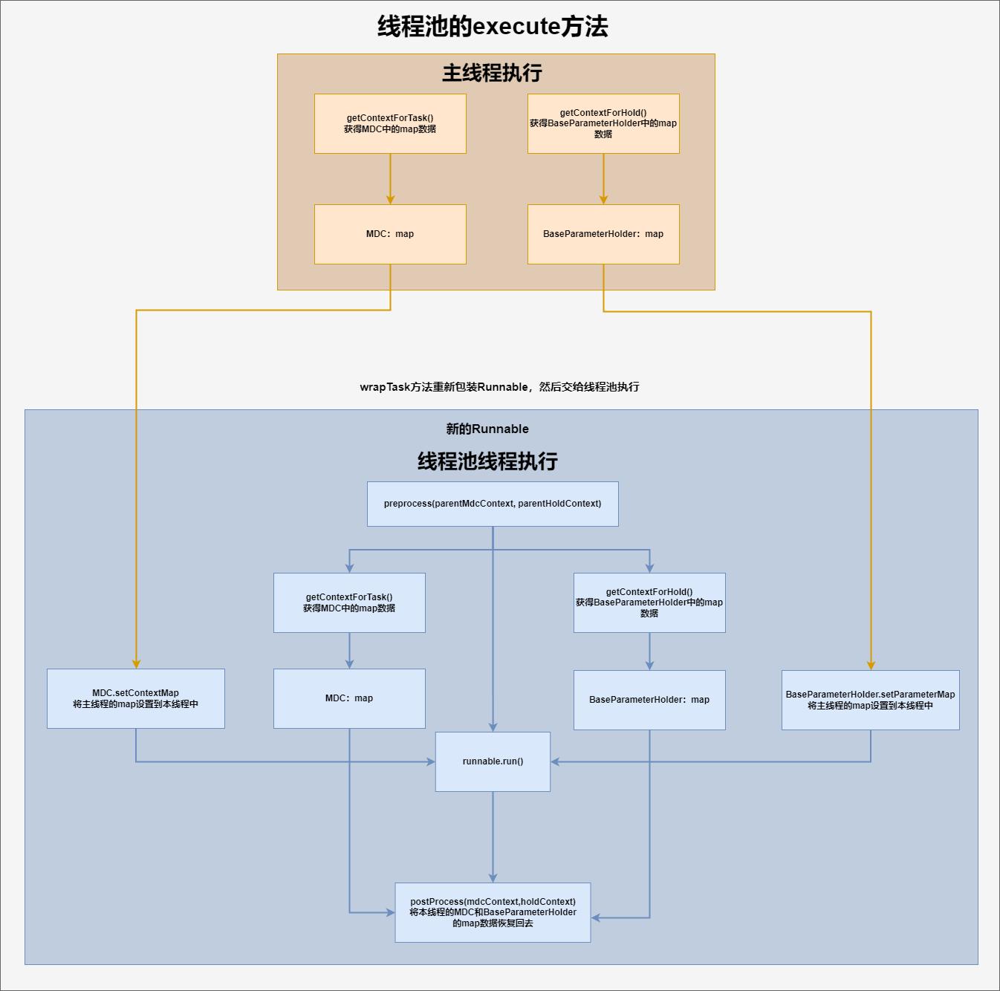

# 组件讲解-打造专属线程池 让并发处理更高效

# 介绍


线程池是一种在程序执行过程中用于管理和复用线程的技术，它可以有效地减少在创建和销毁线程时所需的开销，并且可以控制并发线程的最大数量，提高系统资源的利用率和程序的稳定性。


在Java中，线程池主要通过**ThreadPoolExecutor**实现类来实现。而在此类的父接口**ExecutorService**提供了封装的线程池功能，比如任务提交、线程池管理（启动、关闭）等。


线程池工作原理是，当提交一个任务时，如果线程池从来没有执行过任务，那么会创建新的线程来执行此任务。如果之前执行任务的话，则会使用已有的空闲核心线程来执行该任务，如果正在执行的任务数量超过了核心线程数的话，新的任务会被放入队列中等待执行。如果此时任务很多，队列的容量也已经放不下的话，就会创建新的线程来处理任务。如果线程数已达到了最大线程参数的值，那么就要执行拒绝策略。


关于线程池的详细介绍和原理解析部分，可跳转到相应文档查询


[技术精华-超详细的线程池原理解析 · 语雀](https://www.yuque.com/u22210564/ugnoev/qhtsfdla5qinto3g)


看这里，我们再看一下使用Executors提供的线程池的问题


```java
public static ExecutorService newFixedThreadPool(int nThreads) {
        return new ThreadPoolExecutor(nThreads, nThreads,
                                      0L, TimeUnit.MILLISECONDS,
                                      new LinkedBlockingQueue<Runnable>());
}


public static ExecutorService newSingleThreadExecutor() {
        return new FinalizableDelegatedExecutorService
            (new ThreadPoolExecutor(1, 1,
                                    0L, TimeUnit.MILLISECONDS,
                                    new LinkedBlockingQueue<Runnable>()));
}


public static ExecutorService newCachedThreadPool() {
        return new ThreadPoolExecutor(0, Integer.MAX_VALUE,
                                      60L, TimeUnit.SECONDS,
                                      new SynchronousQueue<Runnable>());
}

public static ScheduledExecutorService newScheduledThreadPool(int corePoolSize) {
        return new ScheduledThreadPoolExecutor(corePoolSize);
}

public ScheduledThreadPoolExecutor(int corePoolSize) {
        super(corePoolSize, Integer.MAX_VALUE, 0, NANOSECONDS,
              new DelayedWorkQueue());
}
```


以上是Executors提供的常用的几种封装好的线程池，这几种需要注意


1. `newFixedThreadPool` , `newSingleThreadExecutor` 阻塞队列长度为Integer.MAX_VALUE
2. `newCachedThreadPool` 最大线程数为Integer.MAX_VALUE
3. `newScheduledThreadPool` 最大线程数为Integer.MAX_VALUE


阿里开发规范手册中不建议使用提供这几种线程池，建议是自己实现**ThreadPoolExecutor**来实现线程池


而在此组件中，对**ThreadPoolExecutor**进行了完整的实现，设计出了功能完整的线程池，接下来我们来详细介绍此组件


# damai-thread-pool-framework


## 使用


### 依赖


```xml
<dependency>
    <groupId>com.example</groupId>
    <artifactId>damai-thread-pool-framework</artifactId>
    <version>${revision}</version>
</dependency>
```


### BusinessThreadPool 提供的api


```java
/**
 * 执行任务
 *
 * @param r 提交的任务
 * @return
 */
public static void execute(Runnable r);

/**
* 执行带返回值任务
*
* @param c 提交的任务
* @return
*/
public static <T> Future<T> submit(Callable<T> c);
```


### 示例


```java
BusinessThreadPool.execute(() -> System.out.println("异步任务执行"));
```


## 讲解


在设计线程池时，不仅仅是对**ThreadPoolExecutor**接口进行实现就结束了，要考虑的有很多，例如 线程池核心线程数的大小、最大线程数的大小、阻塞队列的容量大小、参数的传递等等，下面我们来依次的介绍


### BusinessThreadPool 线程池


```java
public class BusinessThreadPool extends BaseThreadPool {
    private static ThreadPoolExecutor execute = null;

    static {
        execute = new ThreadPoolExecutor(
                // 核心线程数
                Runtime.getRuntime().availableProcessors() + 1,
                // 最大线程数
                maximumPoolSize(),
                // 线程存活时间
                60,
                // 存活时间单位
                TimeUnit.SECONDS,
                // 队列容量
                new ArrayBlockingQueue<>(600),
                // 线程工厂
                new BusinessNameThreadFactory(),
                // 拒绝策略
                new ThreadPoolRejectedExecutionHandler.BusinessAbortPolicy());
    }

    private static Integer maximumPoolSize() {
        return new BigDecimal(Runtime.getRuntime().availableProcessors())
                .divide(new BigDecimal("0.2"), 0, BigDecimal.ROUND_HALF_UP).intValue();
    }
    
    /**
     * 执行任务
     *
     * @param r 提交的任务
     * @return
     */
    public static void execute(Runnable r) {
        execute.execute(wrapTask(r, getContextForTask(), getContextForHold()));
    }

    /**
     * 执行带返回值任务
     *
     * @param c 提交的任务
     * @return
     */
    public static <T> Future<T> submit(Callable<T> c) {
        return execute.submit(wrapTask(c, getContextForTask(), getContextForHold()));
    }
}
```


#### 总结


核心线程数是通过 **Runtime.getRuntime().availableProcessors() + 1 **计算出，


+ 用于获取当前系统的CPU处理器数量（通常对应于逻辑处理器的数量，它可能是物理核心的两倍，如果使用了超线程技术）。
+ 在这个表达式中，通过获取CPU处理器的数量，并在此基础上加1，来设置线程池的核心线程数。这样做的原理和优势如下： 
    1. **并发与并行**：理论上，为了最大化CPU的使用效率，线程的数量应该与处理器的数量相匹配，这样每个处理器就可以同时执行一个线程。但是，在实际应用中，由于线程可能因为I/O操作（如读写文件、网络通信等）而阻塞，所以在处理器数量的基础上增加额外的线程可以保证CPU在等待I/O操作时，仍有额外的线程可以运行，从而提高CPU的利用率。
    2. **提高响应性**：多出的那1个线程可以提高程序对并发任务的响应性，尤其是在多任务环境下，额外的线程可以在其他线程等待I/O操作或进行长时间计算时，执行新的任务。
    3. **灵活性和容错性**：在实际的并发应用中，任务的执行时间和需求可能会有很大的波动。通过设置核心线程数为处理器数加一，可以为突增的任务提供更好的处理能力，同时也为线程池的运行提供了一定的灵活性和容错性。


总的来说，将线程池的核心线程数设置为 `Runtime.getRuntime().availableProcessors() + 1` 是一种试图在充分利用CPU资源和提高程序响应性之间找到平衡的做法。这种设置适用于大多数情况，但最佳的线程数配置还应该根据应用程序的具体需求和运行环境进行调整。


最大线程数是通过 **maximumPoolSize** 计算出，其核心思想是基于系统可用的处理器（CPU核心）数量来动态计算最大线程数，从而使得线程池的配置能够适应不同的硬件环境，提高程序的并发性和响应速度。


方法的实现步骤如下：


1. `Runtime.getRuntime().availableProcessors()`方法被调用来获取当前系统可用的处理器（CPU核心）数量。
2. 这个处理器数量通过`BigDecimal`的构造函数转换成`BigDecimal`对象，这样做是为了使用`BigDecimal`提供的精确小数运算功能。
3. 接着，这个处理器数量的`BigDecimal`对象被`divide`方法除以`0.2`。这个除法操作的意图是基于一个假设：每个CPU核心在理想情况下能够有效地支持并发执行5个线程（即1/0.2=5）。这是一种常见的估算方法，旨在平衡CPU使用率和线程上下文切换的成本。
4. `divide`方法的第二个参数是`0`，表示在进行除法运算时，结果将四舍五入到整数位。
5. 最后，`intValue`方法被调用，将`BigDecimal`的结果转换为`Integer`，这个整数值就是计算出的线程池的最大线程数。


通过这种方式计算出的最大线程数，旨在充分利用CPU资源，同时避免因线程数过多导致的过度竞争和上下文切换开销。这是一种试图在性能和资源使用之间寻找平衡的策略。


阻塞队列使用**ArrayBlockingQueue**类型，是一个基于数组结构的有界阻塞队列，这意味着它的容量在初始化时被固定，不能被扩展。在这个上下文中，容量被设置为600，代表队列最多可以同时存放600个任务。


自定义线程工厂**BusinessNameThreadFactory**，用于设置线程名


```java
public class BusinessNameThreadFactory extends AbstractNameThreadFactory {

    /**
     * 将线程池工厂的前缀
     * 例子:task-pool--1(线程池的数量)
     */
    @Override
    public String getNamePrefix() {
        return "task-pool" + "--" + POOL_NUM.getAndIncrement();
    }
}
```


自定义线程的拒绝策略**ThreadPoolRejectedExecutionHandler.BusinessAbortPolicy()**


```java
public class ThreadPoolRejectedExecutionHandler {
    
    
    public static class BusinessAbortPolicy implements RejectedExecutionHandler {

        public BusinessAbortPolicy() {
        }

        @Override
        public void rejectedExecution(Runnable r, ThreadPoolExecutor executor) {

            throw new RejectedExecutionException("threadPoolApplicationName business task " + r.toString() +
                    " rejected from " +
                    executor.toString());
        }
    }
}
```


以上这些是常规的实现线程池时，所需要指定的参数配置，但有这些仅仅还是不够的，比如说分布式链路id的传递，关于分布式链路id的作用和详细介绍部分，可跳转到相关文档


[技术精华-只会用Skywalking？教你如何自定义分布式链路id](https://www.yuque.com/u22210564/ykdrdh/wfpt6gdx6c2k7fvl)


### 额外定制


而通常链路id是放在Request的请求头中进行存储的的，而**Request的作用域其实就是个ThreadLocal**，还有就是日志中的MDC本质其实也是个**ThreadLocal**，又或者有其他的数据需要放到ThreadLocal中，而ThreadLocal和线程是绑定的，这就导致了在线程池中是获取不到ThreadLocal中的数据的，这就需要我们将设计出的线程池要解决这个问题。


### BaseThreadPool 对线程池的增强


```java
public class BaseThreadPool {

    /**
     * 在执行线程池任务前，先获取父线程的MDC上下文
     */

    protected static Map<String, String> getContextForTask() {
        return MDC.getCopyOfContextMap();
    }
    
    /**
     * 在执行线程池任务前，先获取父线程的hold上下文
     */
    protected static Map<String,String> getContextForHold() {
        return BaseParameterHolder.getParameterMap();
    }

    /**
     * 对要执行的execute任务进行包装
     *
     * @param runnable 任务
     * @param parentMdcContext 父线程的MDC上下文
     * @param parentHoldContext 父线程的hold上下文
     */
    protected static Runnable wrapTask(final Runnable runnable, final Map<String, String> parentMdcContext, final Map<String, String> parentHoldContext) {
        return () -> {
            Map<String, Map<String, String>> preprocess = preprocess(parentMdcContext, parentHoldContext);
            Map<String, String> holdContext = preprocess.get("holdContext");
            Map<String, String> mdcContext = preprocess.get("mdcContext");
            try {
                //执行任务
                runnable.run();
            } finally {
                postProcess(mdcContext,holdContext);
            }
        };
    }

    /**
     * 对要执行的submit任务进行包装
     *
     * @param task    任务
     * @param parentMdcContext 父线程的MDC上下文
     * @param parentHoldContext 父线程的hold上下文
     */
    protected static <T> Callable<T> wrapTask(Callable<T> task, final Map<String, String> parentMdcContext, final Map<String, String> parentHoldContext) {
        return () -> {
            Map<String, Map<String, String>> preprocess = preprocess(parentMdcContext, parentHoldContext);
            Map<String, String> holdContext = preprocess.get("holdContext");
            Map<String, String> mdcContext = preprocess.get("mdcContext");
            try {
                //执行任务
                return task.call();
            } finally {
                postProcess(mdcContext,holdContext);
            }
        };
    }
    
    private static Map<String,Map<String,String>> preprocess(final Map<String, String> parentMdcContext, final Map<String, String> parentHoldContext){
        Map<String,Map<String,String>> map = new HashMap<>();
        //获取本线程的hold上下文
        Map<String, String> holdContext = BaseParameterHolder.getParameterMap();
        //获取本线程的MDC上下文
        Map<String, String> mdcContext = MDC.getCopyOfContextMap();
        //如果父线程的MDC上下文为空，则清空子线程的
        if (parentMdcContext == null) {
            MDC.clear();
        } else {
            //否则将父线程的设置到这次本线程中
            MDC.setContextMap(parentMdcContext);
        }
        //如果父线程的hold上下文为空，则清空子线程的
        if (parentHoldContext == null) {
            BaseParameterHolder.removeParameterMap();
        } else {
            //否则将父线程的设置到这次本线程中
            BaseParameterHolder.setParameterMap(parentHoldContext);
        }
        map.put("holdContext",holdContext);
        map.put("mdcContext",mdcContext);
        return map;
    }
    
    private static void postProcess(Map<String, String> mdcContext, Map<String, String> holdContext){
        //如果本线程MDC上下文为空，直接清除掉
        if (mdcContext == null) {
            MDC.clear();
        } else {
            //否则，将本线程的上下文恢复回去
            MDC.setContextMap(mdcContext);
        }
        //如果本线程hold上下文为空，直接清除掉
        if (holdContext == null) {
            BaseParameterHolder.removeParameterMap();
        } else {
            //否则，将本线程的上下文恢复回去
            BaseParameterHolder.setParameterMap(holdContext);
        }
    }
}
```


### RequestParamContextFilter 分布式链路id的过滤器


```java
public class RequestParamContextFilter extends OncePerRequestFilter {
    @Override
    protected void doFilterInternal(HttpServletRequest request, HttpServletResponse response, FilterChain filterChain) throws ServletException, IOException {
        String traceId = request.getHeader(TRACE_ID);
        if (StringUtil.isNotEmpty(traceId)){
            MDC.put(TRACE_ID,traceId);
        }
        try {
            filterChain.doFilter(request, response);
        }finally {
            MDC.remove(TRACE_ID);
        }
    }
}
```


此过滤器的作用是当请求进入到服务时，从**request**请求头中获取到分布式链路id **traceId**，然后将**traceId**放入**MDC**中，用于日志的打印


### MDC获取traceId打印


```xml
<Property name="PATTERN">[program-service] [%X{traceId}] %d{yyyy-MM-dd HH:mm:ss} %5p %c{1}:%L - %m%n</Property>
```


## 流程总结


+  当请求进入到服务中会执行 **RequestParamContextFilter** 过滤器，将从**request**取到的**traceId**放入到**MDC**中 
+  当定制线程池执行**execute**方法时，先执行**wrapTask**方法进行包装任务 
    -  执行`getContextForTask()`和`getContextForHold()`这两个方法是在主线程执行 
        * `getContextForTask()`，获取MDC的map数据
        * `getContextForHold()`，获取BaseParameterHolder的map数据
    -  包装新的Runnable类型的任务 
        *  `preprocess`方法的作用就是将主线程的数据，设置到子线程中 
        *  获取`MDC`的map数据，获取`BaseParameterHolder`的map数据 
        *  将主线程中的`MDC`的map数据和`BaseParameterHolder`的map数据设置到新包装的Runnable也就是子线程中的`MDC`的map数据和`BaseParameterHolder`的map数据 
        *  `runnable.run()`，执行业务逻辑 
        *  `postProcess(mdcContext,holdContext)`，将子线程中获取到的MDC的map数据和BaseParameterHolder的map数据再恢复回去 
    -  将包装后的Runnable类型的任务交给jdk的线程池`ThreadPoolExecutor`执行 


## 流程图



> 更新: 2024-10-09 21:50:27  
> 原文: <https://www.yuque.com/u22210564/ykdrdh/vpcqn24thenoh1f9>