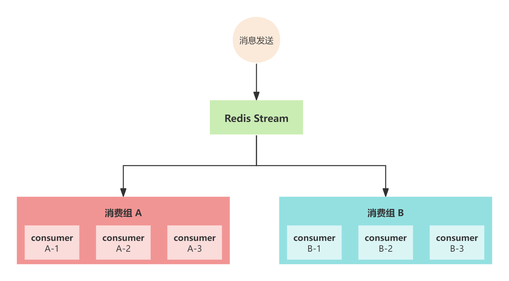
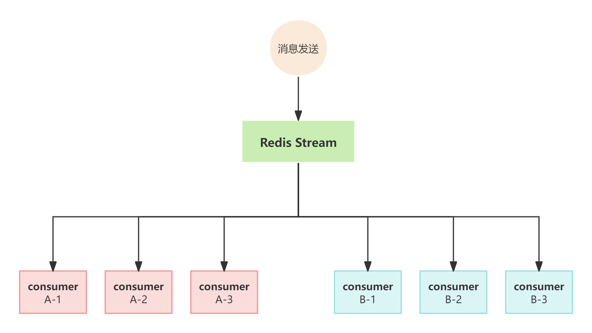

# 组件讲解-打造高性能的RedisStream队列

## RedisStream特点
Redis Stream 5.x版本引入的一种数据结构，用于处理时间序列数据、消息队列和日志流。它提供了高吞吐量、持久性、有序、可扩展的消息传递解决方案,并提供了以下主要特性：

+ **多生产者和多消费者：**多个生产者可以同时向 Stream 中写入消息，而多个消费者可以独立订阅并消费消息。每个消费者可以有不同的消费速率。
+ **消费组：**Redis Stream引入了消费者组的概念，多个消费者可以加入同一个消费者组并共同消费消息，这确保了消息在消费时不会被多次处理。
+ **消费者阻塞：**消费者可以使用 XREADGROUP 命令以阻塞方式获取消息，只有当有新消息到达时才会被推送给消费者。
+ **消费者自动确认：**Redis Stream 支持自动确认消息，消费者可以告诉 Redis 何时确认已经成功处理了一条消息。
+ **多 Stream 支持：**你可以创建多个 Stream 来存储不同种类的数据，并分别处理它们。
+ **有序性：**消息在 Stream 中按照消息的时间戳有序存储，因此你可以按照消息的顺序读取数据。
+ **持久性存储：**Redis Stream 使用内存数据结构，但也支持将数据异步保存到磁盘，以确保数据不会丢失。


关于RedisStream的详细介绍，以及相关命令的使用，小伙伴可跳转到相应的章节来学习

[技术精华-全面解读RedisStream队列](https://www.yuque.com/u22210564/ykdrdh/sda8hzep9sdto2gx)


然而在SpringBoot中操作RedisStream还是比较复杂的，需要配置消息的发送、序列化、消息的监听配置、拉取时间、消息类型等等，还有各种繁琐的api操作

所以针对上述问题，本人设计了RedisStream的组件，使用此组件操作RedisStram会变得非常的简单，默认情况下无需考虑上述配置的细节问题，下面就来介绍此组件的设计原理

# 使用
### 依赖
```xml
<dependency>
    <groupId>com.example</groupId>
    <artifactId>damai-redis-stream-framework</artifactId>
    <version>${revision}</version>
</dependency>
```

### 配置信息
```yaml
spring:
  data:
    # redis配置
    redis:
      database: 0
      host: 127.0.0.1
      port: 6379
      timeout: 3000
      # redisStream配置
      stream:
        # stream名字
        streamName: test_stream
        # 消费组名字
        consumerGroup: test_group
        # 消费者名
        consumerName: test_consumer_1
        # 消费方式 group:消费组(默认)/broadcast:广播
        consumerType: group
```

### 发送消息
```java
public void test(ProgramGetDto programGetDto) {
    redisStreamPushHandler.push(JSON.toJSONString(programGetDto));
}
```

### 监听消息
实现 **MessageConsumer** 接口，并注入到Spring中即可

```java
@Slf4j
@Component
public class TestRedisStreamConsumer implements MessageConsumer {
    @Override
    public void accept(final ObjectRecord<String, String> message) {
        String value = message.getValue();
        log.info("====处理消息 : {}=====",value);
    }
}
```


可以看到使用起来是非常的简单，下面就来介绍其设计原理


# 设计原理
### 序列化
在使用SpringBoot的RedisTemplate来操作Redis时，要先配置序列化的方式，而RedisStream组件和Redis操作组件都使用了同一个公共模块 <font style="color:#213BC0;">damai-redis-common-framework</font> 来配置序列化

```java
public class RedisFrameWorkAutoConfig {

    @Bean("redisToolRedisTemplate")
    public RedisTemplate redisTemplate(RedisConnectionFactory redisConnectionFactory) {
        RedisTemplate redisTemplate = new RedisTemplate();
        redisTemplate.setDefaultSerializer(new StringRedisSerializer());
        redisTemplate.setConnectionFactory(redisConnectionFactory);
        return redisTemplate;
    }

    @Bean("redisToolStringRedisTemplate")
    public StringRedisTemplate stringRedisTemplate(RedisConnectionFactory redisConnectionFactory) {
        StringRedisTemplate myStringRedisTemplate = new StringRedisTemplate();
        myStringRedisTemplate.setDefaultSerializer(new StringRedisSerializer());
        myStringRedisTemplate.setConnectionFactory(redisConnectionFactory);
        return myStringRedisTemplate;
    }
}
```

RedisStream组件中的RedisTemplate使用的是StringRedisTemplate

### 配置信息
```java
@Data
@ConfigurationProperties(prefix = RedisStreamConfigProperties.PREFIX)
public class RedisStreamConfigProperties {
    
    public static final String PREFIX = "spring.data.redis.stream";
    
    /**
     * stream名字
     * */
    private String streamName;
    
    /**
     * 消费组名字
     * */
    private String consumerGroup;
    
    /**
     * 消费者名
     * */
    private String consumerName;
    
    /**
     * 消费方式 group:消费组(默认)/broadcast:广播
     */
    private String consumerType = RedisStreamConstant.GROUP;
}
```

### 自动装配的相关配置
```java
@Slf4j
@EnableConfigurationProperties(RedisStreamConfigProperties.class)
public class RedisStreamAutoConfig {
    
    /**
     * 消息发送配置
     * */
    @Bean
    public RedisStreamPushHandler redisStreamPushHandler(StringRedisTemplate stringRedisTemplate, 
                                                         RedisStreamConfigProperties redisStreamConfigProperties) {
        return new RedisStreamPushHandler(stringRedisTemplate, redisStreamConfigProperties);
    }
    
    /**
     * 消息操作配置
     * */
    @Bean
    public RedisStreamHandler redisStreamHandler(RedisStreamPushHandler redisStreamPushHandler, 
                                                 StringRedisTemplate stringRedisTemplate) {
        return new RedisStreamHandler(redisStreamPushHandler, stringRedisTemplate);
    }
    
    /**
     * 主要做的是将OrderStreamListener监听绑定消费者，用于接收消息
     *
     * @param redisConnectionFactory redis连接工厂
     * @return StreamMessageListenerContainer
     */
    @Bean
    @ConditionalOnBean(MessageConsumer.class)
    public StreamMessageListenerContainer<String, ObjectRecord<String, String>> streamMessageListenerContainer(
            RedisConnectionFactory redisConnectionFactory, 
            RedisStreamConfigProperties redisStreamConfigProperties, 
            RedisStreamHandler redisStreamHandler, 
            MessageConsumer messageConsumer) {
        //消息侦听容器，创建后，StreamMessageListenerContainer可以订阅Redis流并使用传入的消息
        StreamMessageListenerContainer.StreamMessageListenerContainerOptions<String, ObjectRecord<String, String>> 
                options = StreamMessageListenerContainer.StreamMessageListenerContainerOptions.builder()
                    //拉取消息超时时间
                    .pollTimeout(Duration.ofSeconds(5))
                    //批量抓取消息的数量
                    .batchSize(10)
                    //传递的数据类型
                    .targetType(String.class)
                    //获取消息的过程或获取到消息给具体的消息者处理的过程中，发生了异常的处理
                    .errorHandler(t -> log.error("出现异常", t))
                    //执行拉取任务的执行线程池
                    .executor(createThreadPool()).build();
        StreamMessageListenerContainer<String, ObjectRecord<String, String>> container = 
                StreamMessageListenerContainer.create(redisConnectionFactory, options);
        //检查消费类型，消费组或者广播
        checkConsumerType(redisStreamConfigProperties.getConsumerType());
        //监听器
        RedisStreamListener redisStreamListener = new RedisStreamListener(messageConsumer);
        //如果是分组消费
        if (RedisStreamConstant.GROUP.equals(redisStreamConfigProperties.getConsumerType())) {
            //绑定stream和消费组
            redisStreamHandler.streamBindingGroup(redisStreamConfigProperties.getStreamName(), 
                    redisStreamConfigProperties.getConsumerGroup());
            //这里用的是ack自动提交
            container.receiveAutoAck(Consumer.from(redisStreamConfigProperties.getConsumerGroup(), 
                    redisStreamConfigProperties.getConsumerName()), 
                    StreamOffset.create(redisStreamConfigProperties.getStreamName(), ReadOffset.lastConsumed()), 
                    redisStreamListener);
        } else {
            //如果是广播消费
            container.receive(StreamOffset.fromStart(redisStreamConfigProperties.getStreamName()), redisStreamListener);
        }
        //启动监听
        container.start();
        return container;
    }
    
    public ThreadPoolExecutor createThreadPool(){
        //线程池
        int coreThreadCount = Runtime.getRuntime().availableProcessors();
        AtomicInteger threadCount = new AtomicInteger(1);
        return new ThreadPoolExecutor(
                coreThreadCount,
                2 * coreThreadCount,
                30,
                TimeUnit.SECONDS,
                new ArrayBlockingQueue<>(100),
                r -> {
                    Thread thread = new Thread(r);
                    thread.setName("thread-consumer-stream-task-" + threadCount.getAndIncrement());
                    return thread;
                });
    }
    
    public void checkConsumerType(String consumerType){
        if ((!RedisStreamConstant.GROUP.equals(consumerType)) && (!RedisStreamConstant.BROADCAST.equals(consumerType))) {
            throw new DaMaiFrameException(BaseCode.REDIS_STREAM_CONSUMER_TYPE_NOT_EXIST);
        }
    }
}
```

### 总结
##### 1 创建出 StreamMessageListenerContainer 消息侦听容器
+ <font style="color:#213BC0;">pollTimeout(Duration.ofSeconds(5))</font> 拉取消息超时时间为5s
+ <font style="color:#213BC0;">batchSize(10)</font> 批量抓取消息的数量为10
+ <font style="color:#213BC0;">targetType(String.class)</font> 传递的数据类型，默认是string类型，如果是对象，需要指定类型
+ <font style="color:#213BC0;">errorHandler(t -> log.error("出现异常", t))</font> 获取消息的过程发生的异常处理
+ <font style="color:#213BC0;">executor(createThreadPool())</font> 执行拉取任务的执行线程池

##### 2 检查消费类型，消费组或者广播
```java
checkConsumerType(redisStreamConfigProperties.getConsumerType())
```

提供了分组和广播消费的两种类型，可通过 spring.data.redis.stream.consumerType 来配置，group(分组)/broadcast(广播) 两种

#### 3 监听器
```java
RedisStreamListener redisStreamListener = new RedisStreamListener(messageConsumer);
```

当监听到消息后，进行处理


##### 4 配置消息提交的方式
<font style="color:#213BC0;">如果是分组消费：</font>

+ 绑定stream和消费组：在第一次生成时，需要把消费组绑定该stream的key，否则会报错，具体执行逻辑可以看streamBindingGroup()方法

```java
redisStreamHandler.streamBindingGroup(redisStreamConfigProperties.getStreamName(), 
                    redisStreamConfigProperties.getConsumerGroup())
```

+ 消息ack自动提交 

```java
container.receiveAutoAck(Consumer.from(redisStreamConfigProperties.getConsumerGroup(), 
                    redisStreamConfigProperties.getConsumerName()), 
                    StreamOffset.create(redisStreamConfigProperties.getStreamName(), ReadOffset.lastConsumed()), 
                    redisStreamListener);
```

通过此代码实现分组监听消息，绑定了消费组和消费者的名字，以及消息监听器。然后使用的自动ack的方式回复stream确认接收到了消息

如果要使用手动ack，那么使用以下配置

```java
container.receive(Consumer.from(redisStreamConfigProperties.getConsumerGroup(),
                    redisStreamConfigProperties.getConsumerName()), 
                    StreamOffset.create(redisStreamConfigProperties.getStreamName(), ReadOffset.lastConsumed()),
                    redisStreamListener);
```

<font style="color:#213BC0;"></font>

<font style="color:#213BC0;">如果是广播消费：</font>

+ 则无需绑定消费组，以广播的方式监听该stream key中的所有消息

```java
container.receive(StreamOffset.fromStart(redisStreamConfigProperties.getStreamName()), redisStreamListener)
```


### 分组消费和广播消费的区别
#### 分组消费


使用分组的方式，要将消费组和stream key进行绑定，在同一个消费组内，只能有一个成员可以消费到消息，当然如果绑定了多个组，每个组接收不听的消息


#### 广播消费


使用广播的方式，不需要绑定消费组，可以直接和stream进行绑定，即可实现广播的效果，每次有消息发送到该指定节点的stream后，每个实例节点都可以接收到消息

### 消息发送处理器
```java
@Slf4j
@AllArgsConstructor
public class RedisStreamPushHandler {

    
    private final StringRedisTemplate stringRedisTemplate;
    
    private final RedisStreamConfigProperties redisStreamConfigProperties;

    public RecordId push(String msg){
        // 创建消息记录, 以及指定stream
        ObjectRecord<String, String> record = StreamRecords.newRecord()
                //streamName
                .in(redisStreamConfigProperties.getStreamName())
                //消息数据
                .ofObject(msg) 
                .withId(RecordId.autoGenerate());
        // 将消息添加至消息队列中
        RecordId recordId = this.stringRedisTemplate.opsForStream().add(record);
        log.info("redis streamName : {} message : {}", redisStreamConfigProperties.getStreamName(),msg);
        return recordId;
    }
}
```

<font style="color:#213BC0;">RedisStreamPushHandler</font><font style="color:#101E60;"> </font>是消息发送者，配置<font style="color:#213BC0;">stream key，消息数据，以及自动生成消息id的形式</font>，然后将消息放入到stream中

### 消息操作处理器
```java
@Slf4j
@AllArgsConstructor
public class RedisStreamHandler {
    
    private final RedisStreamPushHandler redisStreamPushHandler;
    
    private final StringRedisTemplate stringRedisTemplate;
    
    /**
     * 用来创建绑定流和组
     */
    public void addGroup(String streamName, String groupName){
        stringRedisTemplate.opsForStream().createGroup(streamName,groupName);
    }
    
    
    /**
     * 用来判断key是否存在
     */
    public Boolean hasKey(String key){
        if(Objects.isNull(key)){
            return false;
        }else{
            return stringRedisTemplate.hasKey(key);
        }
        
    }
    /**
     * 用来删除掉消费了的消息
     */
    public void del(String key, RecordId recordIds){
        stringRedisTemplate.opsForStream().delete(key,recordIds);
    }
    
    /**
     * 用来初始化 实现绑定key和消费组
     */
    public void streamBindingGroup(String streamName, String group){
        //判断key是否存在，如果不存在则创建
        boolean hasKey = hasKey(streamName);
        if(!hasKey){
            Map<String,Object> map = new HashMap<>(2);
            map.put("key","value");
            RecordId recordId = redisStreamPushHandler.push(JSON.toJSONString(map));
            //第一次初始化时需要把Stream和group绑定
            addGroup(streamName,group);
            //清除掉该条无用数据
            del(streamName,recordId);
            log.info("initStream streamName : {} group : {}",streamName,group);
        }
    }
}
```

<font style="color:#213BC0;">RedisStreamHandler</font> 是对stream的额外处理，提供了 <font style="color:#213BC0;">将stream和group进行绑定，删除消息，初始化stream </font>的相关操作

### 消息业务处理接口
对消息进行业务处理的话，实现此接口，然后注入到Spring即可

```java
@FunctionalInterface
public interface MessageConsumer {
    
    /**
     * 消息处理
     * @param message 消息
     * 
     * */
    void accept(ObjectRecord<String, String> message);
}
```

### 消息的监听
```java
@Slf4j
@AllArgsConstructor
public class RedisStreamListener implements StreamListener<String, ObjectRecord<String, String>> {
    
    private final MessageConsumer messageConsumer;

    @Override
    public void onMessage(ObjectRecord<String, String> message) {
        try{
            //消息id
            RecordId messageId = message.getId();
            //消息
            String value = message.getValue();
            log.info("redis stream 消费到了数据 messageId : {}, streamName : {}, message : {}", 
                    messageId, message.getStream(), value);
            //处理消息
            messageConsumer.accept(message);
        }catch (Exception e){
            log.error("onMessage error",e);
        }
    }
}
```

当监听到消息后，就会执行 **onMessage(ObjectRecord<String, String> message)** 方法，会拿到消息id和消息内容，这里为了更加的方便使用，本人额外设计了 **MessageConsumer** 的接口，使用时，不需要配置此监听消息处理类，只要实现 **MessageConsumer** 接口，实现其中的 accept 方法，然后注入到Spring中即可


这里从Spring中获取 **MessageConsumer** 类型，然后执行 **messageConsumer.accept(message)** 的方法来处理消息，这种方式是利用了设计模式中的 **命令模式**

****

如果消费后，使用手动ack确认消息的话，需要添加以下配置

```java
stringRedisTemplate.opsForStream().acknowledge(redisStreamConfigProperties.getStreamName(),
                    redisStreamConfigProperties.getConsumerGroup(),"recordId");
```


> 更新: 2024-07-18 17:11:13  
> 原文: <https://www.yuque.com/u22210564/ykdrdh/tpssspi8i9v7l1hb>