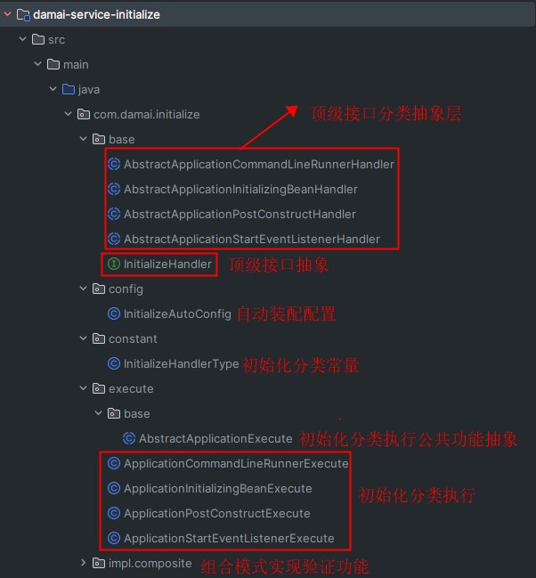

# 组件讲解-统一服务初始化操作，提升系统启动效率的秘诀

# 背景


在我们开发的时候，会经常有一些服务启动后初始化的一些操作，就比如从从阻塞队列中取出任务执行或者加载字典信息的


一般都是实现`CommandLineRunner`接口或者在方法上添加`@PostConstruct`注解这些方案，其实还有另外几种，别着急，我都会挨个介绍的。但要是这些初始化的操作变得越来越多，彼此之间还要求执行顺序，如果不统一进行管理的话，就会越来越混乱，左一个，右一个，当出现问题排除出来就会难上加难。本人就因为这个问题踩过很多的坑！所以本文要介绍的就是如何将这几种初始化操作进行集中的管理


## 示例


在我们介绍统一管理组件之前，我们先来回忆下这几种初始化的操作是怎么使用的


**CommandLineRunner**


```java
@Component
public class TestCommandLineRunner implements CommandLineRunner {
    
    @Override
    public void run(final String... args) {
        System.out.println("======run执行======");
    }
}
```


**InitializingBean**


```java
@Component
public class TestInitializingBean implements InitializingBean {
    
    @Override
    public void afterPropertiesSet() {
        System.out.println("======afterPropertiesSet执行======");
    }
}
```


**PostConstruct**


```java
@Component
public class TestPostConstruct {
    
    @PostConstruct
    public void postConstruct(){
        System.out.println("======postConstruct执行======");
    }
}
```


**ApplicationListener**


```java
@Component
public class TestEventListener implements ApplicationListener<ApplicationStartedEvent> {
    
    @Override
    public void onApplicationEvent(ApplicationStartedEvent event) {
        System.out.println("======ApplicationStartedEvent执行======");
    }
}
```


**结果**


```latex
======afterPropertiesSet执行======
======postConstruct执行======
======ApplicationStartedEvent执行======
======run执行======
```


可以看到这四种都是在服务启动后会执行，执行顺序是`afterPropertiesSet` > `postConstruct` > `ApplicationStartedEvent` > `run`


这里的`ApplicationStartedEvent`比较特殊，是用的事件监听机制来实现，本示例选择的是监听`ApplicationStartedEvent`这一事件，顾名思义也就是服务启动后会发布这个事件，关于事件其实还有很多种类型，关于这部分的详细介绍，可跳转相关文档

[Springboot事件和bean的生命周期执行机制](https://www.yuque.com/u22210564/ykdrdh/srwqirgw47q12mpw)


以上示例是将常用的几种初始化操作都演示了一遍，如果小伙们想进一步详细了解这几种初始化的操作底层原理到底是如何执行的？可跳转相关文档

[SpringBoot常用注解的执行原理_1](https://www.yuque.com/u22210564/ykdrdh/pe9ddpkoxg3kh35v)

[SpringBoot常用注解的执行原理_2](https://www.yuque.com/u22210564/ykdrdh/gm2viwk0a07emlvo)


# 讲解


经过上面的铺垫，接下来我们详细的介绍大麦项目中是如何将这些详细操作进行集中式管理的


**模块**`damai-service-initialize`


```xml
<dependency>
    <groupId>com.example</groupId>
    <artifactId>damai-service-initialize</artifactId>
    <version>${revision}</version>
</dependency>
```


### 结构



**InitializeHandler**


```java
public interface InitializeHandler {
    /**
     * 初始化执行 类型
     * @return 类型
     * */
    String type();
    
    /**
     * 执行顺序
     * @return 顺序
     * */
    Integer executeOrder();
    
    /**
     * 执行逻辑
     * @param context 容器上下文
     * */
    void executeInit(ConfigurableApplicationContext context);
    
}
```


+  type() 初始化操作的类型 在`InitializeHandlerType`进行了管理 

```java
public class InitializeHandlerType {
    
    public static final String APPLICATION_EVENT_LISTENER = "application_event_listener";
    
    public static final String APPLICATION_POST_CONSTRUCT = "application_post_construct";
    
    public static final String APPLICATION_INITIALIZING_BEAN = "application_initializing_bean";
    
    public static final String APPLICATION_COMMAND_LINE_RUNNER = "application_command_line_runner";
}
```

 

+  executeOrder() 初始化操作的执行顺序 
+  executeInit(_ConfigurableApplicationContext_ context) 具体的初始化操作执行逻辑 


但仅仅是设计成这样还是不够的，比如说要使用`PostConstruct`这种方式，那么我们的实现类中就要实现`type()`方法，也就是


```java
@Override
public String type() {
    return APPLICATION_POST_CONSTRUCT;
}
```


但想想，如果使用`PostConstruct`这种方式有很多的话，那每个实现类都要实现这个`type()`方法，逻辑也都是相同的，这是不是产生冗余了呢？


所以为了解决这个问题，将`InitializeHandler`再次进行分层，将`type()`进行默认实现不就可以了嘛


**AbstractApplicationCommandLineRunnerHandler**


```java
public abstract class AbstractApplicationCommandLineRunnerHandler implements InitializeHandler {
    
    @Override
    public String type() {
        return APPLICATION_COMMAND_LINE_RUNNER;
    }
}
```


**AbstractApplicationInitializingBeanHandler**


```java
public abstract class AbstractApplicationInitializingBeanHandler implements InitializeHandler {
    
    @Override
    public String type() {
        return APPLICATION_INITIALIZING_BEAN;
    }
}
```


**AbstractApplicationPostConstructHandler**


```java
public abstract class AbstractApplicationPostConstructHandler implements InitializeHandler {
    
    @Override
    public String type() {
        return APPLICATION_POST_CONSTRUCT;
    }
}
```


**AbstractApplicationStartEventListenerHandler**


```java
public abstract class AbstractApplicationStartEventListenerHandler implements InitializeHandler {

    @Override
    public String type() {
        return APPLICATION_EVENT_LISTENER;
    }
}
```


使用抽象类将每个初始化类型的`type()`公共方法进行了实现，而剩下的`executeOrder()`和`executeInit(*ConfigurableApplicationContext* context)`还是交给具体的实现类自己去实现。


这样我们在使用的时候只需要继承相应的抽象类就可以了，而项目服务的初始化操作就是继承了`AbstractApplicationPostConstructHandler`


```java
@Component
public class ProgramCategoryInitData extends AbstractApplicationPostConstructHandler
```


```java
@Slf4j
@Component
public class ProgramElasticsearchInitData extends AbstractApplicationPostConstructHandler
```


```java
@Component
public class ProgramShowTimeRenewal extends AbstractApplicationPostConstructHandler
```


关于项目服务初始化操作的详细介绍，可跳转到相关文档查询


[业务讲解-节目服务的数据初始化统一管理](https://www.yuque.com/u22210564/ykdrdh/vmvabhdvn1a30mi5)


以上是有了要执行初始化操作的业务了，那么如何去执行它们呢？并且保证执行的顺序？下面我们来详细的介绍


### 执行


**AbstractApplicationExecute**


```java
@AllArgsConstructor
public abstract class AbstractApplicationExecute {
    
    private final ConfigurableApplicationContext applicationContext;
    
    public void execute(){
        //从spring中获取InitializeHandler类型的bean集合
        Map<String, InitializeHandler> initializeHandlerMap = applicationContext.getBeansOfType(InitializeHandler.class);
        initializeHandlerMap.values()
                .stream()
            	//通过type()方法进行过滤
                .filter(initializeHandler -> initializeHandler.type().equals(type()))
                //通过executeOrder()进行排序
            	.sorted(Comparator.comparingInt(InitializeHandler::executeOrder))
                .forEach(initializeHandler -> {
                    //循环执行初始化业务逻辑
                    initializeHandler.executeInit(applicationContext);
                });
    }
    /**
     * 初始化执行 类型
     * @return 类型
     * */
    public abstract String type();
}
```


负责执行的公共抽象层，将公共的操作集中放到了这里


+ 从spring中获取InitializeHandler类型的bean集合
+ 将集合的type方法和具体实现类的type()方法进行匹配
+ 将集合中匹配到的元素通过executeOrder()方法进行排序
+ 将排序后的集合进行循环执行executeInit方法


这里留出了`type()`方法用于给不同实现类来实现，从而识别出各自的初始化类型


**ApplicationCommandLineRunnerExecute**


```java
public class ApplicationCommandLineRunnerExecute extends AbstractApplicationExecute implements CommandLineRunner {
    
    public ApplicationCommandLineRunnerExecute(ConfigurableApplicationContext applicationContext){
        super(applicationContext);
    }
    
    @Override
    public void run(final String... args) {
        execute();
    }
    
    @Override
    public String type() {
        return APPLICATION_COMMAND_LINE_RUNNER;
    }
}
```


**ApplicationInitializingBeanExecute**


```java
public class ApplicationInitializingBeanExecute extends AbstractApplicationExecute implements InitializingBean {

    public ApplicationInitializingBeanExecute(ConfigurableApplicationContext applicationContext){
        super(applicationContext);
    }

    @Override
    public void afterPropertiesSet() {
        execute();
    }

    @Override
    public String type() {
        return APPLICATION_INITIALIZING_BEAN;
    }
}
```


**ApplicationPostConstructExecute**


```java
public class ApplicationPostConstructExecute extends AbstractApplicationExecute {
    
    public ApplicationPostConstructExecute(ConfigurableApplicationContext applicationContext){
        super(applicationContext);
    }
    
    @PostConstruct
    public void postConstructExecute() {
        execute();
    }
    
    @Override
    public String type() {
        return APPLICATION_POST_CONSTRUCT;
    }
}
```


**ApplicationStartEventListenerExecute**


```java
public class ApplicationStartEventListenerExecute extends AbstractApplicationExecute implements ApplicationListener<ApplicationStartedEvent> {
    
    public ApplicationStartEventListenerExecute(ConfigurableApplicationContext applicationContext){
        super(applicationContext);
    }
    
    @Override
    public void onApplicationEvent(ApplicationStartedEvent event) {
        execute();
    }
    
    @Override
    public String type() {
        return APPLICATION_EVENT_LISTENER;
    }
}
```


+ `ApplicationCommandLineRunnerExecute`就是执行`CommandLineRunner`类型
+ `ApplicationInitializingBeanExecute`就是执行`InitializingBean`类型
+ `ApplicationPostConstructExecute`就是执行`@PostConstruct`类型
+ `ApplicationStartEventListenerExecute`就是执行`ApplicationListener*<ApplicationStartedEvent>`类型


这种将公共的操作集中到抽象类中，然后留出一个方法来给具体的实现类来实现的这种设计就是**经典的模版设计模式**


除了刚才提到的项目服务的数据初始化操作用到了`@PostConstruct`类型，还有验证参数业务的功能用到了`ApplicationListener*<ApplicationStartedEvent>`类型


关于验证参数业务的功能详细介绍，可跳转至相关的文档进行查看


[组件讲解-利用组合模式打造强大验证功能，轻松应对复杂验证需求](https://www.yuque.com/u22210564/ykdrdh/baixnwbm4fhze9w7)


> 更新: 2025-09-11 13:07:08  
> 原文: <https://www.yuque.com/u22210564/ykdrdh/nw8op985wkbv43gs>