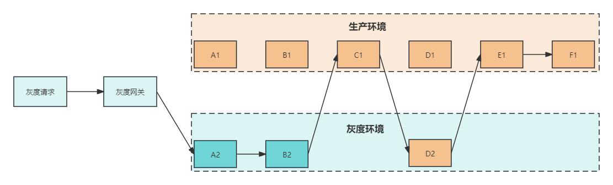

# 组件讲解-设计灰度环境服务调用(Springboot2版本)

# 前言
本章节讲解的是Springboot2版本下，基于Ribbon的负载均衡方式，进行的灰度服务的过滤，而在Springboot3版本下，Ribbon已经被废弃，采用了Loadbalancer的方式，关于Springboot3版本会在另一篇文档来讲解

[组件讲解-设计灰度环境服务调用(Springboot3版本)](https://www.yuque.com/u22210564/ykdrdh/pz1q4r2wkvxvgomx)


# 灰度调用组件
[技术精华-给你讲透为什么需要灰度环境](https://www.yuque.com/u22210564/ykdrdh/eqp5r4tvlefru82h) 的文章中，介绍了什么是灰度环境，以及灰度和生产环境共用同一个注册中心，服务是如何调用。


在本文中，就来介绍灰度调用组件是如何实现灰度和生产环境隔离和调用的

# 使用
#### gateway依赖
```xml
<dependency>
    <groupId>com.example</groupId>
    <artifactId>damai-service-gray-transition-gateway-framework</artifactId>
    <version>${revision}</version>
</dependency>
```


#### web服务依赖
```xml
<dependency>
    <groupId>com.example</groupId>
    <artifactId>damai-service-gray-transition-webmvc-framework</artifactId>
    <version>${revision}</version>
</dependency>
```


#### 配置
```yaml
spring:
  cloud:
    nacos:
      discovery:
        metadata:
          gray: true
```


#### 请求
+ 如果是灰度环境，则在请求头添加`gray=true`即可
+ 如果是生产环境，则无需配置

# 介绍
### 请求的流程
+ 灰度环境中的请求在开始时，在请求头中添加一个标识`gray=true`，然后开发一个过滤ribbon负载均衡服务的过滤器，在这里进行过滤服务
+ 如果请求标识含有`gray=true`，那么就是来自灰度的请求，那么就调用元数据配置了`gray=true`的服务，如果没有标识`gray=true`的服务，那么就是说明没有灰度只有生产服务，那么就直接调用生产的服务
+ 如果请求的请求头中没有标识`gray=true`，那么就是来自生产的请求，那么就必须调用没有标识`gray=true`也就是只能调用生产环境的服务


# 设计
#### Constant
```java
public static final String SERVER_GRAY = "${spring.cloud.nacos.discovery.metadata.gray:false}";
```


**SERVER_GRAY**是配置灰度标识，如果配置了值为true，那么说明此服务是在灰度环境


#### Request请求头不同


我们使用Request请求头中获取`gray`的标识，来判断是否是灰度服务，但这时有个问题，就是Gateway服务和WebMvc的服务中的Request对象是不同的


+ **ServerHttpRequest**：Gateway的Request对象，由Gateway中的**ServerWebExchange**来获得
+ **HttpServletRequest**：WebMvc的Request对象，由**ServletRequestAttributes**来获得


这就需要将不同的操作抽取出来形成不同的maven模块，将灰度过滤的核心逻辑和获取请求头抽象的层放到公共部分，然后Gateway服务和WebMvc服务来分别集成公共部分模块，再实现各自的请求头获取逻辑


# 模块结构


+ **damai-service-gray-transition-base-framework** 灰度过滤的核心逻辑和获取请求头抽象
+ **damai-service-gray-transition-gateway-framework** Gateway服务的灰度组件
+ **damai-service-gray-transition-webmvc-framework** WebMvc服务的灰度组件


接下来讲解详细的模块结构

# 灰度公共模块 damai-service-gray-transition-base-framework


##### ContextHandler
```java
public interface ContextHandler {
    
    /***
     * 从request请求头获取值
     * @param name 值的名
     * @return 具体值
     * 
     */
    String getValueFromHeader(String name);
}
```


**ContextHandler**就是从请求头获取数据的抽象，Gateway和WebMvc会分别实现此方法


##### ExtraRibbonAutoConfiguration


```plain
@RibbonClients(defaultConfiguration = { WorkLoadBalanceConfiguration.class })
public class ExtraRibbonAutoConfiguration {
}
```


```latex
org.springframework.boot.autoconfigure.EnableAutoConfiguration=\
  com.damai.balance.config.ExtraRibbonAutoConfiguration
```


**ExtraRibbonAutoConfiguration**是自动装配类，加载了自定义的负载均衡过滤适配器**CustomEnabledRule**，在Ribbon的负载均衡中，并不能直接注入自定义过滤器对象来让Ribbon去执行，需要借助适配器来进行适配才可以


##### WorkLoadBalanceConfiguration


```java
public static final String SERVER_GRAY = "${spring.cloud.nacos.discovery.metadata.gray:false}";
```


```java
@AutoConfigureBefore(RibbonClientConfiguration.class)
public class WorkLoadBalanceConfiguration {
    
    /**
    * 灰度标识
    */
    @Value(SERVER_GRAY)
    private String serverGray;

    @RibbonClientName
    private String serviceId = "client";


    @Bean
    public IRule ribbonRule(PropertiesFactory propertiesFactory, IClientConfig config, ContextHandler contextHandler) {
        if (propertiesFactory.isSet(IRule.class, serviceId)) {
            return propertiesFactory.get(IRule.class, config, serviceId);
        }
        //创建灰度版本选择负载均衡选择器适配
        ExtraZoneAvoidanceRuleEnhance extraZoneAvoidanceRuleEnhance = new ExtraZoneAvoidanceRuleEnhance();
        //构建过滤器
        extraZoneAvoidanceRuleEnhance.initWithNiwsConfig(config);
        
        ExtraZoneAvoidancePredicate cookPatchEnabledPredicate = extraZoneAvoidanceRuleEnhance.getCookPatchEnabledPredicate();
        //灰度标识
        cookPatchEnabledPredicate.setServerGray(serverGray);
        //请求头获取数据的接口
        cookPatchEnabledPredicate.setContextHandler(contextHandler);
        return extraZoneAvoidanceRuleEnhance;
    }
}
```


**WorkLoadBalanceConfiguration**负责构建出灰度过滤适配增强器**ExtraZoneAvoidanceRuleEnhance**，以及将灰度标识**gray**和请求头获取接口**ContextHandler**传入过滤器**ExtraZoneAvoidancePredicate**


##### ExtraZoneAvoidanceRuleEnhance


```java
public class ExtraZoneAvoidanceRuleEnhance extends ZoneAvoidanceRuleEnhance {
    private CompositePredicate compositePredicate;
    @Getter
    private ExtraZoneAvoidancePredicate extraZoneAvoidancePredicate;
    
    /**
     * 使用无参构造方法的原因是Ribbon在定时任务中，会创建此适配器，而创建的方法是使用反射来构建
     * */
    public ExtraZoneAvoidanceRuleEnhance() {
        super();
        init(null);
    }

    private CompositePredicate createCompositePredicate(ExtraZoneAvoidancePredicate cookPatchEnabledPredicate, AvailabilityPredicate availabilityPredicate) {
        return CompositePredicate.withPredicates(cookPatchEnabledPredicate, availabilityPredicate)
                .build();
    }

    @Override
    public void initWithNiwsConfig(IClientConfig clientConfig) {
        init(clientConfig);
    }

    public void init(IClientConfig clientConfig){
        //将自定义的过滤器构建出来
        extraZoneAvoidancePredicate = new ExtraZoneAvoidancePredicate(this, clientConfig);
        AvailabilityPredicate availabilityPredicate = new AvailabilityPredicate(this, clientConfig);
        //将自定义的过滤器赋值给predicate
        compositePredicate = createCompositePredicate(extraZoneAvoidancePredicate, availabilityPredicate);
    }
    
    /**
     * 当请求执行到Ribbon时，会执行到 过滤器适配器的获得过滤器方法 {@link PredicateBasedRule#choose(Object)}
     * */
    @Override
    public AbstractServerPredicate getPredicate() {
        return compositePredicate;
    }
    
}
```


在构建适配器的注入到Spirng的过程中，会执行**initWithNiwsConfig**创建出自定义的过滤器**ExtraZoneAvoidancePredicate**，紧接着就会执行过滤器的**apply**方法，此方法就是实现灰度过滤的核心方法逻辑


下面我们就来详细介绍自定义过滤器的执行流程，看它是怎么实现灰度和生产服务隔离的


##### ExtraZoneAvoidancePredicate


```java
@Slf4j
@Setter
public class ExtraZoneAvoidancePredicate extends ZoneAvoidancePredicate {
    
    private String serverGray;
    
    private ContextHandler contextHandler;
    
    private final Map<String,String> map = new HashMap<>();

    public ExtraZoneAvoidancePredicate(IRule rule, IClientConfig clientConfig) {
        super(rule, clientConfig);
        this.map.put(GRAY_FLAG_FALSE, GRAY_FLAG_FALSE);
        this.map.put(GRAY_FLAG_TRUE, GRAY_FLAG_TRUE);
    }
    
    @Override
    public boolean apply(PredicateKey input) {
            boolean result;
            try {
                //从请求头获取灰度标识
                String grayFromRequest = Optional.ofNullable(contextHandler.getValueFromHeader(GRAY_PARAMETER))
                        .filter(StringUtil::isNotEmpty)
                        .orElseGet(() -> BaseParameterHolder.getParameter(GRAY_PARAMETER));
                //如果请求头获取灰度标识为空，则从服务配置中获取
                grayFromRequest = Optional.ofNullable(grayFromRequest).filter(StringUtil::isNotEmpty).orElse(serverGray);
                NacosServer nacosServer = (NacosServer) input.getServer();
                //获取服务配置中的灰度标识
                String grayFromMetaData = Optional.ofNullable(nacosServer.getInstance().getMetadata())
                        .filter(CollectionUtil::isNotEmpty)
                        .map(metadata -> metadata.get(GRAY_PARAMETER))
                        .filter(StringUtil::isNotEmpty)
                        .orElse(GRAY_FLAG_FALSE);
                //判断如果被调用端没有灰度配置则默认配置为生产环境
                grayFromMetaData = Optional.ofNullable(map.get(grayFromMetaData.toLowerCase())).orElse(GRAY_FLAG_FALSE);
                //判断如果请求端没有灰度标识则默认配置为生产环境
                grayFromRequest = Optional.ofNullable(map.get(grayFromRequest.toLowerCase())).orElse(GRAY_FLAG_FALSE);
                //如果请求的灰度标识和被调用服务配置的灰度标识相同，说明服务匹配到了，直接可以调用
                result = grayFromMetaData.equalsIgnoreCase(grayFromRequest);
                
                /* 如果这时result还是为false，再做一次匹配
                 * 如果所有服务端的配置均为spring.cloud.nacos.discovery.metadata.gray=true,而调用请求端的请求头中的 gray 为true，
                 * 则也允许结果返回true做负载均衡
                 * 
                 * 反之如果所有服务端的配置为spring.cloud.nacos.discovery.metadata.gray=true,而调用请求端的请求头中的 gray 为false，
                 * 则结果返回false,不允许做负载均衡
                 */
                if (!result && grayFromRequest.equalsIgnoreCase(GRAY_FLAG_TRUE)) {
                    List<Server> servers = Optional.ofNullable(rule.getLoadBalancer())
                            .map(ILoadBalancer::getReachableServers)
                            .filter(CollectionUtil::isNotEmpty)
                            .orElseThrow(() -> new DaMaiFrameException(BaseCode.SERVER_LIST_NOT_EXIST));
                    Map<String,String> map = new HashMap<>(servers.size());
                    for (Server server : servers) {
                        NacosServer nacosServerInstance = (NacosServer) server;
                        //服务中配置的灰度标识
                        String balanceGray = nacosServerInstance.getInstance().getMetadata().get(GRAY_PARAMETER);
                        //判断如果被调用端没有灰度配置则默认配置为生产环境
                        if (StringUtil.isEmpty(balanceGray) || Objects.isNull(map.get(balanceGray.toLowerCase()))) {
                            balanceGray = GRAY_FLAG_FALSE;
                        }
                        map.put(balanceGray,balanceGray);
                    }
                    if(Objects.isNull(map.get(GRAY_FLAG_TRUE))) {
                        //能够执行到这里，说明请求是灰度的，要被调用的服务中实例列表都是生产的，可以进行匹配
                        result = true;
                    }
                }
            }catch (Exception e) {
                result = false;
                log.error("CustomAwarePredicate#apply error",e);
            } 
            return result;
    }
}
```


#### 核心流程总结：


> + _<font style="color:#213BC0;">请求服务中请求头中的参数</font>_<font style="color:#213BC0;">  gray=false:请求生产的服务。 gray=true:请求灰度的服务</font>
> + <font style="color:#213BC0;">被调用服务的配置： </font>
>     - <font style="color:#213BC0;">spring.cloud.nacos.discovery.metadata.gray=false:代表生产的服务</font>
>     - <font style="color:#213BC0;">spring.cloud.nacos.discovery.metadata.gray=true:代表灰度的服务</font>
>
> <font style="color:#213BC0;"> </font>
>
> + <font style="color:#213BC0;">如果请求服务中请求头没有gray参数，或者该参数中的值不是true或false字符串(不区分大小写)则认为gray=false</font>
> + <font style="color:#213BC0;">如果被调用服务的 spring.cloud.nacos.discovery.metadata.gray 配置项没有配置，或者为空，或者该配置项中的值不是true或false字符串(不区分大小写)则认为gray=false</font>
> + <font style="color:#213BC0;">判断逻辑： </font>
>     - <font style="color:#213BC0;">如果所有被调用服务端的配置项 --spring.cloud.nacos.discovery.metadata.gray=true，并且请求中的Header参数 gray=true，则在该请求的n次调用中apply()函数都返回true，走负载均衡</font>
>     - <font style="color:#213BC0;">否则被调用服务端的配置项 --spring.cloud.nacos.discovery.metadata.gray 必须与请求中的Header参数 gray 值相等 apply()函数才会返回true</font>
>
> <font style="color:#213BC0;">总结：</font>
>
> <font style="color:#213BC0;">	生产的请求必须是生产的服务(没有部署生产服务就熔断)，灰度的请求在有灰度服务部署的情况下必须执行灰度的，没有灰度服务的情况下再调用生产的服务</font>
>


以上就是灰度过滤的详细执行流程了，接下来分析请求头实现的逻辑


# 灰度Gateway模块 damai-service-gray-transition-gateway-framework


##### GatewayContextAutoConfiguration


```java
public class GatewayContextAutoConfiguration {
    
    @Bean
    public GlobalFilter gatewayWorkRouteFilter() {
        return new GatewayWorkRouteFilter();
    }
    
    @Bean
    public GlobalFilter gatewayWorkClearFilter() {
        return new GatewayWorkClearFilter();
    }
    
    @Bean
    public ContextHandler webMvcContext(){
        return new GatewayContextHandler();
    }
}
```


**GatewayContextAutoConfiguration**是自动装配类，负责需要的配置，我们先直接看对请求头实现


##### GatewayContextHandler


```java
public class GatewayContextHandler implements ContextHandler {
    @Override
    public String getValueFromHeader(final String name) {
        return Optional.ofNullable(getServerHttpRequest())
                .map(request -> request.getHeaders().getFirst(name))
                .orElse(null);
    }
    
    public ServerWebExchange getExchange() {
        return GatewayContextHolder.getCurrentGatewayContext().getExchange();
    }
    
    public ServerHttpRequest getServerHttpRequest() {
        return Optional.ofNullable(getExchange()).map(ServerWebExchange::getRequest).orElse(null);
    }
}
```


其实Gateway中的request是从**ServerWebExchange**，而ServerWebExchange并没有像Servlet环境中可以直接通用Holder来获取，所以这里使用了**GatewayContextHolder**工具来获取**ServerWebExchange**对象


**GatewayContextHolder**本质其实是一个**ThreadLocal**，ThreadLocal常用的场景之一就是先将核心参数进行绑定，然后在需要的地方进行获取，而且可以做到线程的隔离


##### GatewayContextHolder


```java
@Setter
@Getter
public class GatewayContextHolder {
    
    private static final ThreadLocal<GatewayContextHolder> THREAD_LOCAL = ThreadLocal.withInitial(GatewayContextHolder::new);

    private ServerWebExchange exchange;

    public static GatewayContextHolder getCurrentGatewayContext() {
        return THREAD_LOCAL.get();
    }

    public static void removeCurrentGatewayContext() {
        THREAD_LOCAL.remove();
    }
    
}
```


**GatewayContextHolder**的ThreadLocal其实绑定的泛型对象就是自己，这么做的好处是可以设置和取值方便，在设置和取值的过程中，先通过ThreadLocal拿到自身的对象，然后就可以进行设置和拿取**ServerWebExchange**


但这里我们只看到了获取**ServerWebExchange**的过程，那么在什么时候放入**ServerWebExchange**的呢？其实Gateway的灰度组件又额外设计了filter过滤器，专门用来存放和清除**ServerWebExchange**的操作


##### GatewayWorkRouteFilter 数据存放过滤器


```java
public class GatewayWorkRouteFilter implements GlobalFilter, Ordered {
    
    @Override
    public Mono<Void> filter(final ServerWebExchange exchange, final GatewayFilterChain chain) {
        //把ServerWebExchange放入ThreadLocal中
        GatewayContextHolder.getCurrentGatewayContext().setExchange(exchange);
        return chain.filter(exchange);
    }
    
    @Override
    public int getOrder() {
        return HIGHEST_PRECEDENCE;
    }
}
```


##### GatewayWorkClearFilter 数据清除过滤器


```java
public class GatewayWorkClearFilter implements GlobalFilter, Ordered {
    @Override
    public Mono<Void> filter(final ServerWebExchange exchange, final GatewayFilterChain chain) {
        GatewayContextHolder.removeCurrentGatewayContext();
        return chain.filter(exchange);
    }
    
    @Override
    public int getOrder() {
        return LOWEST_PRECEDENCE - 1;
    }
}
```


##### 总结


+ **GatewayContextHandler**实现了请求头获取数据的接口**ContextHandler**，但获取过程需要借助**ServerWebExchange**
+ **ServerWebExchange**的获取需要借助线程数据绑定工具**GatewayContextHolder**
+ **GatewayContextHolder**的数据存放时机需要借助Gateway的过滤器来进行设值和清除
+ **GatewayWorkRouteFilter**数据设值过滤器，**GatewayWorkClearFilter**数据清除过滤器


# 灰度WebMvc模块 damai-service-gray-transition-webmvc-framework


##### WebMvcContextAutoConfiguration


```java
public class WebMvcContextAutoConfiguration {
    
    @Bean
    public ContextHandler webMvcContext(){
        return new WebMvcContextHandler();
    }
}
```


##### WebMvcContextHandler


```plain
public class WebMvcContextHandler implements ContextHandler {
    @Override
    public String getValueFromHeader(final String name) {
        HttpServletRequest request = getHttpServletRequest();
        if (Objects.nonNull(request)) {
            return request.getHeader(name);
        }
        return null;
    }
    
    public HttpServletRequest getHttpServletRequest() {
        ServletRequestAttributes attributes = getRestAttributes();
        if (attributes == null) {
            return null;
        }
        
        return attributes.getRequest();
    }
    
    public ServletRequestAttributes getRestAttributes() {
        RequestAttributes requestAttributes = RequestContextHolder.getRequestAttributes();
        if (requestAttributes == null) {
            return null;
        }
        return (ServletRequestAttributes) requestAttributes;
    }
}
```


WebMvc的Request的获取就非常简单了，可以借助**spring-web**包中**RequestContextHolder**工具来获取，它其实也是一个ThreadLocal


##### RequestContextHolder


```java
public abstract class RequestContextHolder  {

    private static final boolean jsfPresent =
            ClassUtils.isPresent("javax.faces.context.FacesContext", RequestContextHolder.class.getClassLoader());

    private static final ThreadLocal<RequestAttributes> requestAttributesHolder =
            new NamedThreadLocal<>("Request attributes");

    private static final ThreadLocal<RequestAttributes> inheritableRequestAttributesHolder =
            new NamedInheritableThreadLocal<>("Request context");


    //省略...

}
```


#### 流程图



总结起来核心一句话：**如果是灰度请求，有灰度服务，优先调用灰度服务。没有灰度服务，再调用生产服务**


# 其他问题


除了自定义服务过滤器外，还需要考虑额外的问题，这里将服务调用流程中，会有经过哪些关键全部列举出来


> **服务请求 -----> Gateway网关  -----> A服务 -----> 线程池执行业务 -----> B服务 -----> Hystrix熔断(线程池模式) -----> B服务**
>


这里要注意的就是**线程池执行和Hystrix的线程池隔离**会导致灰度请求标识的丢失！


> **Request的作用域其实就是个ThreadLocal**，还有就是日志中的MDC本质其实也是个**ThreadLocal**，又或者有其他的数据需要放到ThreadLocal中，而ThreadLocal和线程是绑定的，这就导致了在线程池中是获取不到ThreadLocal中的数据的，ThreadLocal可以做到线程隔离原理是在每个线程存在一个Map，key是ThreadLocal对象本身，value是值。但在线程池情况下就无法传递参数了，应用在Hystrix的线程池也是同理
>


关于更详细的介绍可查看[技术精华-只会用Skywalking？教你如何自定义分布式链路id](https://www.yuque.com/u22210564/ykdrdh/wfpt6gdx6c2k7fvl)这一章节，有详细的讲解


所以如果要使用线程池，则需要借助线程池组件


```xml
<dependency>
    <groupId>com.example</groupId>
    <artifactId>damai-thread-pool-framework</artifactId>
    <version>${revision}</version>
</dependency>
```


线程池组件详细介绍：[组件讲解-打造专属线程池 让并发处理更高效](https://www.yuque.com/u22210564/ykdrdh/vpcqn24thenoh1f9)


如果要使用Hystrix的线程池熔断，则需要借助Hystrix组件


```xml
<dependency>
    <groupId>com.example</groupId>
    <artifactId>damai-service-hystrix</artifactId>
    <version>${revision}</version>
</dependency>
```


Hystrix组件详细介绍：[技术精华-详解Hystrix传递ThreadLocal数据失效问题](https://www.yuque.com/u22210564/ykdrdh/dsrunfio64aat6nq)


> 更新: 2024-08-15 11:42:51  
> 原文: <https://www.yuque.com/u22210564/ykdrdh/elv3nm24qh4prlmg>