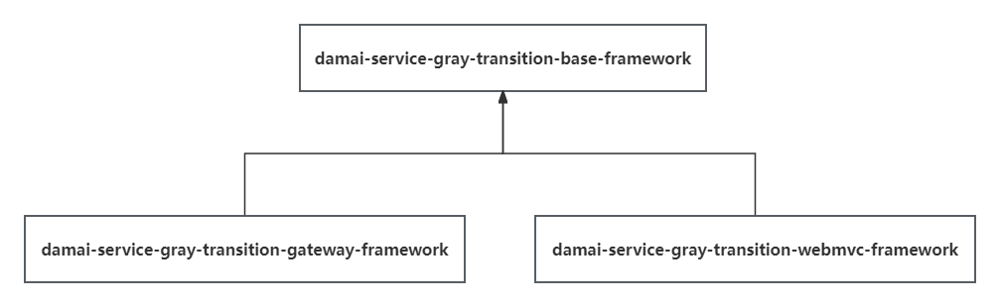

# 组件讲解-设计灰度环境服务调用(Springboot3版本)

# 前言
本章节讲解的是Springboot3版本下，基于Loadbalancer的负载均衡方式，进行的灰度服务的过滤

如果想学习关于Springboot2 Ribbon的负载均衡方式，请跳转到Springboot2版本的讲解


# 灰度调用组件
[技术精华-给你讲透为什么需要灰度环境](https://www.yuque.com/u22210564/ykdrdh/eqp5r4tvlefru82h) 的文章中，介绍了什么是灰度环境，以及灰度和生产环境共用同一个注册中心，服务是如何调用。


在本文中，就来介绍灰度调用组件是如何实现灰度和生产环境隔离和调用的


# 使用
#### gateway依赖


```xml
<dependency>
    <groupId>com.example</groupId>
    <artifactId>damai-service-gray-transition-gateway-framework</artifactId>
    <version>${revision}</version>
</dependency>
```


#### web服务依赖
```xml
<dependency>
    <groupId>com.example</groupId>
    <artifactId>damai-service-gray-transition-webmvc-framework</artifactId>
    <version>${revision}</version>
</dependency>
```


#### 配置
```yaml
spring:
  cloud:
    nacos:
      discovery:
        metadata:
          gray: true
```


#### 请求
+ 如果是灰度环境，则在请求头添加`gray=true`即可
+ 如果是生产环境，则无需配置


## 介绍


### 请求的流程
+ 灰度环境中的请求在开始时，在请求头中添加一个标识`gray=true`，然后开发一个过滤ribbon负载均衡服务的过滤器，在这里进行过滤服务
+ 如果请求标识含有`gray=true`，那么就是来自灰度的请求，那么就调用元数据配置了`gray=true`的服务，如果没有标识`gray=true`的服务，那么就是说明没有灰度只有生产服务，那么就直接调用生产的服务
+ 如果请求的请求头中没有标识`gray=true`，那么就是来自生产的请求，那么就必须调用没有标识`gray=true`也就是只能调用生产环境的服务


### 设计


#### Constant
```java
public static final String SERVER_GRAY = "${spring.cloud.nacos.discovery.metadata.gray:false}";
```


**SERVER_GRAY**是配置灰度标识，如果配置了值为true，那么说明此服务是在灰度环境


#### Request请求头不同


我们使用Request请求头中获取`gray`的标识，来判断是否是灰度服务，但这时有个问题，就是Gateway服务和WebMvc的服务中的Request对象是不同的


+ **ServerHttpRequest**：Gateway的Request对象，由Gateway中的**ServerWebExchange**来获得
+ **HttpServletRequest**：WebMvc的Request对象，由**ServletRequestAttributes**来获得


这就需要将不同的操作抽取出来形成不同的maven模块，将灰度过滤的核心逻辑和获取请求头抽象的层放到公共部分，然后Gateway服务和WebMvc服务来分别集成公共部分模块，再实现各自的请求头获取逻辑


#### 模块结构





+ **damai-service-gray-transition-base-framework** 灰度过滤的核心逻辑和获取请求头抽象
+ **damai-service-gray-transition-gateway-framework** Gateway服务的灰度组件
+ **damai-service-gray-transition-webmvc-framework** WebMvc服务的灰度组件


接下来讲解详细的模块结构


## 灰度公共模块 damai-service-gray-transition-base-framework
### ContextHandler
```java
public interface ContextHandler {
    
    /***
     * 从request请求头获取值
     * @param name 值的名
     * @return 具体值
     * 
     */
    String getValueFromHeader(String name);
}
```

**ContextHandler**就是从请求头获取数据的抽象，Gateway和WebMvc会分别实现此方法


### GrayLoadBalanceAutoConfiguration
```java
@LoadBalancerClients(defaultConfiguration = {EnhanceLoadBalancerClientConfiguration.class, ReactiveSupportConfiguration.class, BlockingSupportConfiguration.class})
public class GrayLoadBalanceAutoConfiguration {
    
    @Bean
    public DefaultFilterLoadBalance defaultFilterLoadBalance(List<AbstractServerFilter> strategyEnabledFilterList){
        return new DefaultFilterLoadBalance(strategyEnabledFilterList);
    }
    
    @Bean
    public AbstractServerFilter serverGrayFilter(ContextHandler contextHandler) {
        return new ServerGrayFilter(contextHandler);
    }
}
```

**GrayLoadBalanceAutoConfiguration** 是自动配置类

****

通过**<font style="color:#213BC0;">@LoadBalancerClients</font>**直接指定了加载 **EnhanceLoadBalancerClientConfiguration ，**此类是对原有的 **LoadBalancerClientConfiguration **进行增强

****

**DefaultFilterLoadBalance **是找到过滤器，然后执行过滤器的过滤，**AbstractServerFilter **就是具体的过滤器


### **EnhanceLoadBalancerClientConfiguration**
此类是对 **LoadBalancerClientConfiguration **的增强，其实就是将源码拿过来，替换成我们自己的过滤器，不需要将此类全部解析，只需要看在哪部分进行替换即可

```java
@AutoConfigureBefore(LoadBalancerClientConfiguration.class)
public class EnhanceLoadBalancerClientConfiguration {

	@Configuration(proxyBeanMethods = false)
	@ConditionalOnReactiveDiscoveryEnabled
	@Order(REACTIVE_SERVICE_INSTANCE_SUPPLIER_ORDER)
	public static class ReactiveSupportConfiguration {

		@Bean
		@ConditionalOnBean(ReactiveDiscoveryClient.class)
		@Conditional(DefaultConfigurationCondition.class)
		public ServiceInstanceListSupplier discoveryClientServiceInstanceListSupplier(
				ConfigurableApplicationContext context,
				FilterLoadBalance filterLoadBalance) {
			return new EnhanceServiceInstanceListSupplierBuilder(filterLoadBalance).withDiscoveryClient().withCaching().build(context);
		}

		//省略

	}
}
```

此类的代码非常的多，我们只要在构建ServiceInstanceListSupplier类型的bean时，替换成了我们自己的 **EnhanceServiceInstanceListSupplierBuilder **即可


### **EnhanceServiceInstanceListSupplierBuilder**
```java
public final class EnhanceServiceInstanceListSupplierBuilder {

	private static final Log LOG = LogFactory.getLog(EnhanceServiceInstanceListSupplierBuilder.class);

	private Creator baseCreator;

	private final List<DelegateCreator> creators = new ArrayList<>();
	
	private final FilterLoadBalance filterLoadBalance;

	public EnhanceServiceInstanceListSupplierBuilder(FilterLoadBalance filterLoadBalance) {
		this.filterLoadBalance = filterLoadBalance;
	}

	
	public EnhanceServiceInstanceListSupplierBuilder withCaching() {
		DelegateCreator creator = (context, delegate) -> {
			ObjectProvider<LoadBalancerCacheManager> cacheManagerProvider = context
					.getBeanProvider(LoadBalancerCacheManager.class);
			if (cacheManagerProvider.getIfAvailable() != null) {
				//这里就是我们的增强
				return new ExtCachingServiceInstanceListSupplier(delegate, cacheManagerProvider.getIfAvailable(),filterLoadBalance);
			}
			if (LOG.isWarnEnabled()) {
				LOG.warn("LoadBalancerCacheManager not available, returning delegate without caching.");
			}
			return delegate;
		};
		creators.add(creator);
		return this;
	}
}
```

代码同样也是非常的多，我们只需要知道在构建**EnhanceServiceInstanceListSupplierBuilder**时，传入了FilterLoadBalance类型的对象，此对象就是我们自己写的过滤器


在调用负载均衡时，会执行withCaching()方法，里面会构建自定义的增强 **ExtCachingServiceInstanceListSupplier**


### **ExtCachingServiceInstanceListSupplier**
```java
public class ExtCachingServiceInstanceListSupplier extends CachingServiceInstanceListSupplier {
    
    private final FilterLoadBalance filterLoadBalance;
    
    public ExtCachingServiceInstanceListSupplier(ServiceInstanceListSupplier delegate, 
                                                 CacheManager cacheManager,
                                                 FilterLoadBalance filterLoadBalance) {
        super(delegate, cacheManager);
        this.filterLoadBalance = filterLoadBalance;
    }
    
    @Override
    public Flux<List<ServiceInstance>> get() {
        Flux<List<ServiceInstance>> listFlux = super.get();
        listFlux = listFlux.map(serviceInstances -> {
            List<ServiceInstance> allServers = new ArrayList<>();
            Optional.ofNullable(serviceInstances).ifPresent(allServers::addAll);
            //在这里就是执行过滤逻辑
            filterLoadBalance.selectServer(allServers);
            return allServers;
        });
        return listFlux;
    }
}
```

到这里看的就清晰多了，**ExtCachingServiceInstanceListSupplier 是对 CachingServiceInstanceListSupplier **的增强，重写了get()方法，


get()方法中调用了filterLoadBalance.selectServer(allServers)的逻辑，我们始终要记住这个 **filterLoadBalance**

****

### FilterLoadBalance
```java
public interface FilterLoadBalance {
    
    /**
     * 服务过滤操作
     * @param servers 服务列表
     * */
    void selectServer(List<ServiceInstance> servers);
}
```

****

### DefaultFilterLoadBalance
```java
@AllArgsConstructor
public class DefaultFilterLoadBalance implements FilterLoadBalance {

    protected final List<AbstractServerFilter> strategyFilterList;

    @Override
    public void selectServer(List<ServiceInstance> servers) {
        for (AbstractServerFilter strategyEnabledFilter : strategyFilterList) {
            strategyEnabledFilter.filter(servers);
        }
    }
}
```

FilterLoadBalance 的默认实现就是 DefaultFilterLoadBalance 其中就是查找所有AbstractServerFilter类型的过滤器，然后遍历这些过滤器，挨个的执行


### AbstractServerFilter
```java
public abstract class AbstractServerFilter implements Ordered {
    
    public void filter(List<? extends ServiceInstance> servers) {
        Iterator<? extends ServiceInstance> iterator = servers.iterator();
        while (iterator.hasNext()) {
            ServiceInstance server = iterator.next();
            boolean enabled = doFilter(servers, server);
            if (!enabled) {
                iterator.remove();
            }
        }
    }

    /**
     * 执行真正地过滤行为
     * @param servers 被调用的所有服务列表
     * @param server 当前被调用的服务
     * @return 过滤的结果
     * */
    public abstract boolean doFilter(List<? extends ServiceInstance> servers, ServiceInstance server);
}
```

**AbstractServerFilter **就是真正过滤器的基类，设计成了抽象类，继承此类要实现doFilter方法，此方式就是真正要进行服务的过滤，此设计是运用了模板设计模式


如果要添加额外的过滤器，只要继承 **AbstractServerFilter**，然后注入到Spring中即可，非常的方便


目前有一个过滤器，是 **ServerGrayFilter**

****

### **ServerGrayFilter**
```java
@Slf4j
public class ServerGrayFilter extends AbstractServerFilter {
    
    /**
     * 此服务的灰度标识
     * */
    @Value(SERVER_GRAY)
    private String serverGray;
    
    private final ContextHandler contextHandler;
    
    private final Map<String,String> map = new HashMap<>();
    
    public ServerGrayFilter(ContextHandler contextHandler){
        this.contextHandler = contextHandler;
        this.map.put(GRAY_FLAG_FALSE, GRAY_FLAG_FALSE);
        this.map.put(GRAY_FLAG_TRUE, GRAY_FLAG_TRUE);
    }
    

    @Override
    public boolean doFilter(List<? extends ServiceInstance> servers, ServiceInstance server) {
        boolean result;
        try {
            //从请求头获取灰度标识
            String grayFromRequest = Optional.ofNullable(contextHandler.getValueFromHeader(GRAY_PARAMETER))
                    .filter(StringUtil::isNotEmpty)
                    .orElseGet(() -> BaseParameterHolder.getParameter(GRAY_PARAMETER));
            //如果请求头获取灰度标识为空，则从服务配置中获取
            grayFromRequest = Optional.ofNullable(grayFromRequest).filter(StringUtil::isNotEmpty).orElse(serverGray);
            NacosServiceInstance nacosServiceInstance = (NacosServiceInstance)server;
            //获取服务配置中的灰度标识
            String grayFromMetaData = Optional.ofNullable(nacosServiceInstance.getMetadata())
                    .filter(CollectionUtil::isNotEmpty)
                    .map(metadata -> metadata.get(GRAY_PARAMETER))
                    .filter(StringUtil::isNotEmpty)
                    .orElse(GRAY_FLAG_FALSE);
            //判断如果被调用端没有灰度配置则默认配置为生产环境
            grayFromMetaData = Optional.ofNullable(map.get(grayFromMetaData.toLowerCase())).orElse(GRAY_FLAG_FALSE);
            //判断如果请求端没有灰度标识则默认配置为生产环境
            grayFromRequest = Optional.ofNullable(map.get(grayFromRequest.toLowerCase())).orElse(GRAY_FLAG_FALSE);
            //如果请求的灰度标识和被调用服务配置的灰度标识相同，说明服务匹配到了，直接可以调用
            result = grayFromMetaData.equalsIgnoreCase(grayFromRequest);
            
            /* 如果这时result还是为false，再做一次匹配
             * 如果所有服务端的配置均为spring.cloud.nacos.discovery.metadata.gray=true,而调用请求端的请求头中的 gray 为true，
             * 则也允许结果返回true做负载均衡
             *
             * 反之如果所有服务端的配置为spring.cloud.nacos.discovery.metadata.gray=true,而调用请求端的请求头中的 gray 为false，
             * 则结果返回false,不允许做负载均衡
             */
            if (!result && grayFromRequest.equalsIgnoreCase(GRAY_FLAG_TRUE)) {
                if (CollectionUtil.isEmpty(servers)) {
                    throw new DaMaiFrameException(BaseCode.SERVER_LIST_NOT_EXIST);
                }
                Map<String,String> map = new HashMap<>(servers.size());
                for (ServiceInstance serviceInstance : servers) {
                    NacosServiceInstance instance = (NacosServiceInstance)serviceInstance;
                    //服务中配置的灰度标识
                    String balanceGray = instance.getMetadata().get(GRAY_PARAMETER);
                    //判断如果被调用端没有灰度配置则默认配置为生产环境
                    if (StringUtil.isEmpty(balanceGray) || Objects.isNull(map.get(balanceGray.toLowerCase()))) {
                        balanceGray = GRAY_FLAG_FALSE;
                    }
                    map.put(balanceGray,balanceGray);
                }
                if(Objects.isNull(map.get(GRAY_FLAG_TRUE))) {
                    //能够执行到这里，说明请求是灰度的，要被调用的服务中实例列表都是生产的，可以进行匹配
                    result = true;
                }
            }
        }catch (Exception e) {
            result = false;
            log.error("ServerGrayFilter#doFilter error",e);
        }
        return result;
    }

    @Override
    public int getOrder() {
        return HIGHEST_PRECEDENCE;
    }
}
```


#### 核心流程总结：
> + _<font style="color:#213BC0;">请求服务中请求头中的参数</font>_<font style="color:#213BC0;">  gray=false:请求生产的服务。 gray=true:请求灰度的服务</font>
> + <font style="color:#213BC0;">被调用服务的配置： </font>
>     - <font style="color:#213BC0;">spring.cloud.nacos.discovery.metadata.gray=false:代表生产的服务</font>
>     - <font style="color:#213BC0;">spring.cloud.nacos.discovery.metadata.gray=true:代表灰度的服务</font>
>
> <font style="color:#213BC0;"> </font>
>
> + <font style="color:#213BC0;">如果请求服务中请求头没有gray参数，或者该参数中的值不是true或false字符串(不区分大小写)则认为gray=false</font>
> + <font style="color:#213BC0;">如果被调用服务的 spring.cloud.nacos.discovery.metadata.gray 配置项没有配置，或者为空，或者该配置项中的值不是true或false字符串(不区分大小写)则认为gray=false</font>
> + <font style="color:#213BC0;">判断逻辑： </font>
>     - <font style="color:#213BC0;">如果所有被调用服务端的配置项 --spring.cloud.nacos.discovery.metadata.gray=true，并且请求中的Header参数 gray=true，则在该请求的n次调用中apply()函数都返回true，走负载均衡</font>
>     - <font style="color:#213BC0;">否则被调用服务端的配置项 --spring.cloud.nacos.discovery.metadata.gray 必须与请求中的Header参数 gray 值相等 apply()函数才会返回true</font>
>
> <font style="color:#213BC0;">总结：</font>
>
> <font style="color:#213BC0;">	生产的请求必须是生产的服务(没有部署生产服务就熔断)，灰度的请求在有灰度服务部署的情况下必须执行灰度的，没有灰度服务的情况下再调用生产的服务</font>
>


到这里灰度过滤的核心逻辑 **damai-service-gray-transition-base-framework** 模块就讲解完毕了


关于 灰度Gateway模块**damai-service-gray-transition-gateway-framework** 和 灰度WebMvc模块**damai-service-gray-transition-webmvc-framework **已经在Springboot2版本中详细讲解了，这里就不再赘述


> 更新: 2024-07-19 16:47:19  
> 原文: <https://www.yuque.com/u22210564/ykdrdh/pz1q4r2wkvxvgomx>