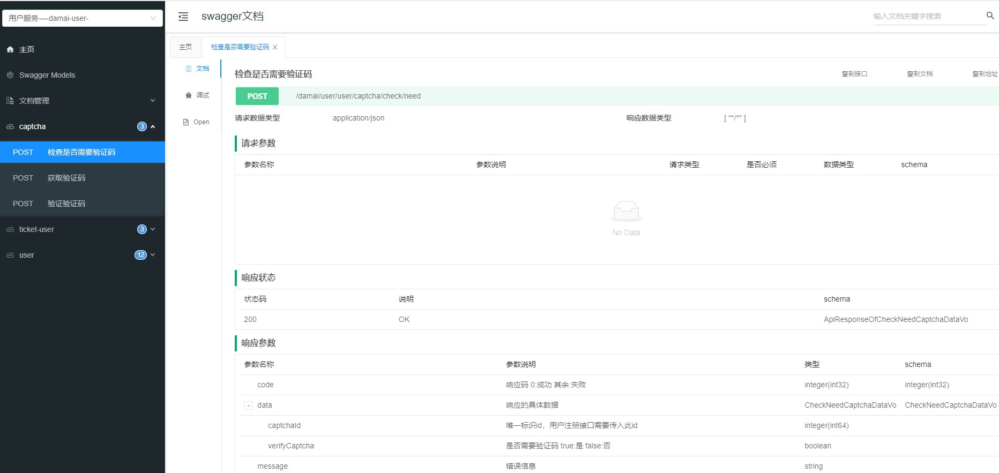

# 配置讲解-全局服务配置攻略，让系统运行更高效

无论是单体的SpringBoot项目还是SpringCloud微服务，在操作数据库方面都需要进行配置，本项目是引入了Mybatisplus的持久框架，将需要的配置抽取出来到了基础组件中


# damai-service-common


### 依赖


```xml
<dependency>
    <groupId>com.example</groupId>
    <artifactId>damai-service-common</artifactId>
    <version>${revision}</version>
</dependency>
```


## BaseTableData


在设计数据库表时，每张表都必须有这三个基础字段，包括：


+ 实体类属性`createTime`，对应的表字段`create_time`，含义是表中数据的创建时间
+ 实体类属性`editTime`，对应的表字段`edit_ime`，含义是表中数据的修改时间
+ 实体类属性`status`，对应的表字段`status`，含义是表中数据的状态 1:正常  0:删除


而每个表实体类中也要这三个属性，所以将这三个公共属性抽取成一个基础实体**BaseTableData**，每个表实体只要继承即可


## BasePageDto


在进行分页查询时，入参的实体中需要传入`pageNumber`，`pageSize`这两个参数，每个分页查询接口的入参实体都要有这两个参数，接口多了就造成了冗余，同样将这两个参数抽取成一个公共实体**BasePageDto**，再有分页查询时，参数实体只要继承即可


## MybatisPlusAutoConfiguration/MybatisPlusMetaObjectHandler


```java
public class MybatisPlusAutoConfiguration {
    
    /**
     * 必须字段自动填充
     * */
    @Bean
    public MetaObjectHandler metaObjectHandler(){
        return new MybatisPlusMetaObjectHandler();
    }
    
    /**
     * 分页插件
     */
    @Bean
    public MybatisPlusInterceptor mybatisPlusInterceptor() {
        MybatisPlusInterceptor interceptor = new MybatisPlusInterceptor();
        interceptor.addInnerInterceptor(new PaginationInnerInterceptor(DbType.MYSQL));
        return interceptor;
    }
}
```


**MybatisPlusAutoConfiguration**为配置装配，添加了字段自动填充和分页插件的配置


#### MybatisPlusMetaObjectHandler 字段自动填充


在开发项目时，有些数据库表的信息不应该由用户来执行，应该是随着内容的添加或者修改自动的执行，比如说创建时间和修改时间


MybatisPlus提供了这种自动填充的功能，官网介绍：[自动填充功能](https://baomidou.com/pages/4c6bcf/)


```java
@Slf4j
public class MybatisPlusMetaObjectHandler implements MetaObjectHandler {
    
    @Override
    public void insertFill(MetaObject metaObject) {
        log.info("start insert fill ....");
        this.strictInsertFill(metaObject, "createTime", DateUtils::now, Date.class);
        this.strictInsertFill(metaObject, "editTime", DateUtils::now, Date.class);
    }
    
    @Override
    public void updateFill(MetaObject metaObject) {
        log.info("start update fill ....");
        this.strictUpdateFill(metaObject, "editTime", DateUtils::now, Date.class);
    }
}
```


#### MybatisPlusInterceptor 分页插件


#### 支持的数据库


+ mysql，oracle，db2，h2，hsql，sqlite，postgresql，sqlserver，Phoenix，Gauss ，clickhouse，Sybase，OceanBase，Firebird，cubrid，goldilocks，csiidb，informix，TDengine，redshift
+ 达梦数据库，虚谷数据库，人大金仓数据库，南大通用(华库)数据库，南大通用数据库，神通数据库，瀚高数据库，优炫数据库，星瑞格数据库


官网介绍：[分页插件](https://baomidou.com/pages/97710a/#paginationinnerinterceptor)


```java
/**
 * 分页插件
 */
@Bean
public MybatisPlusInterceptor mybatisPlusInterceptor() {
    MybatisPlusInterceptor interceptor = new MybatisPlusInterceptor();
    interceptor.addInnerInterceptor(new PaginationInnerInterceptor(DbType.MYSQL));
    return interceptor;
}
```


## 分页工具


看到这里，可能有小伙伴有疑惑，MybatisPlus不是已经提供了分页工具了吗，为什么还要个工具？一个是因为MybatisPlus的分页实体就在它自己的包中，如果以后不使用MybatisPlus了，那岂不分页功能也没了？已经开发好的功能也不能再次修改，所以要减少对MybatisPlus的强依赖

另一个是封装的elasticsearch工具类也有分页功能，使用的包是pagehelper，为了将这两者的分页统一。 所以基于以上两个原因，设计出分页的工具


#### PageVo 分页实体


```java
@Data
@NoArgsConstructor
@AllArgsConstructor
@ApiModel(value="UserVo", description ="分页返回数据")
public class PageVo<T> implements Serializable {

    private static final long serialVersionUID = 1L;

    /**
     * 页码
     */
    @ApiModelProperty(name ="pageNum", dataType ="String", value ="页码")
    private long pageNum;

    /**
     * 页大小
     */
    @ApiModelProperty(name ="pageSize", dataType ="String", value ="页大小")
    private long pageSize;

    /**
     * 记录总数
     */
    @ApiModelProperty(name ="totalSize", dataType ="String", value ="记录总数")
    private long totalSize;

    /**
     * 数据
     */
    @ApiModelProperty(name ="list", dataType ="List", value ="数据")
    private List<T> list;
}
```


#### PageUtil 分页工具


```java
public class PageUtil {
    
    /**
     * 组装分页参数
     * */
    public static <T> IPage<T> getPageParams(BasePageDto basePageDto) {
        return getPageParams(basePageDto.getPageNumber(), basePageDto.getPageSize());
    }
    
    /**
     * 组装分页参数
     * */
    public static <T> IPage<T> getPageParams(int pageNumber, int pageSize) {
        return new Page<>(pageNumber, pageSize);
    }
    
    /**
     * 转换分页对象
     * @param pageInfo PageInfo类型的分页对象
     * @param function 分页中的数据加工接口
     * @param <OLD> 旧数据实体类型
     * @param <NEW> 新数据实体类型
     * */
    public static <OLD,NEW> PageVo<NEW> convertPage(PageInfo<OLD> pageInfo, Function<? super OLD, ? extends NEW> function){
        return new PageVo<>(pageInfo.getPageNum(),
                pageInfo.getPageSize(),
                pageInfo.getTotal(),
                pageInfo.getList().stream().map(function).collect(Collectors.toList()));
    }
    
    /**
     * 转换分页对象
     * @param iPage IPage类型的分页对象
     * @param function 分页中的数据加工接口
     * @param <OLD> 旧数据实体类型
     * @param <NEW> 新数据实体类型
     * */
    public static <OLD,NEW> PageVo<NEW> convertPage(IPage<OLD> iPage, Function<? super OLD, ? extends NEW> function){
        return new PageVo<>(iPage.getCurrent(),
                iPage.getSize(),
                iPage.getTotal(),
                iPage.getRecords().stream().map(function).collect(Collectors.toList()));
    }
}
```


**组装分页参数**在查看节目列表业务中使用，因为在MybatisPlus中如果要自定义sql查询，并且使用分页功能的话，需要将分页参数传入


```java
IPage<ProgramV2> iPage = programMapper.selectPage(PageUtil.getPageParams(programPageListDto), programPageListDto);
```


**转换分页对象**在数据库分页查询和elasticsearch分页查询中使用，为了将两者分页进行整合


```java
PageInfo<ProgramListVo> programListVoPageInfo = businessEsHandle.queryPage(
                    SpringUtil.getPrefixDistinctionName() + "-" + ProgramDocumentParamName.INDEX_NAME,
                    ProgramDocumentParamName.INDEX_TYPE, esDataQueryDtoList, programPageListDto.getPageNumber(),
                    programPageListDto.getPageSize(), ProgramListVo.class);
            pageVo = PageUtil.convertPage(programListVoPageInfo, programListVo -> programListVo);
```


```java
IPage<ProgramV2> iPage = programMapper.selectPage(PageUtil.getPageParams(programPageListDto), programPageListDto);
return PageUtil.convertPage(iPage,programV2 -> {
    ProgramListVo programListVo = new ProgramListVo();
    BeanUtil.copyProperties(programV2, programListVo);
    //区域名字
    programListVo.setAreaName(areaMap.get(programV2.getAreaId()));
    //节目名字
    programListVo.setProgramCategoryName(programCategoryMap.get(programV2.getProgramCategoryId()));
    //最低价
    programListVo.setMinPrice(Optional.ofNullable(ticketCategorieMap.get(programV2.getId())).map(TicketCategoryAggregate::getMinPrice).orElse(null));
    //最高价
    programListVo.setMaxPrice(Optional.ofNullable(ticketCategorieMap.get(programV2.getId())).map(TicketCategoryAggregate::getMaxPrice).orElse(null));
    return programListVo;
});
```


# 订单表的分库分表算法


**DatabaseOrderComplexGeneArithmetic**是分库算法，**TableOrderComplexGeneArithmetic**是分表算法


放在公共服务配置的原因是为了方便小伙伴以SpringBoot单体模式，`damai-single-service`项目启动，在`damai-single-service`项目中有对订单表的分表，在`damai-order-service`项目中有对订单表的分库分表，分表算法是都需要的，所以把订单的分库分表都放在了公共服务配置模块


## SwaggerConfiguration 接口文档配置


Swagger 是一个规范和完整的框架，用于生成、描述、调用和可视化 RESTful 风格的 Web 服务。最初由 Wordnik 开发，并于 2015 年捐赠给了 Linux 基金会。Swagger 的主要目标是使文档成为开发过程的中心部分，以简化API的设计、构建、测试和使用


Swagger 提供的工具和功能包括：


1. **Swagger Editor**：一个基于浏览器的编辑器，可以编写 OpenAPI 规范（以前称为 Swagger 规范）
2. **Swagger UI**：一个可视化工具，用于将 Swagger 规范文件渲染成交互式的 API 文档，用户可以在其中尝试 API 调用
3. **Swagger Codegen**：可以从 Swagger 规范自动生成服务器端和客户端代码的工具


Swagger 规范现已演进为 OpenAPI 规范，成为行业标准，由 OpenAPI Initiative（OAI）维护，OAI 是一个在 Linux 基金会下的项目，旨在促进API技术的开放开发和使用


Knife4j 是为了增强 Swagger 生态，专门为 SpringBoot 应用提供的一个界面美化和功能增强工具。它基于 Swagger 生成的 API 文档，提供了更加友好的UI界面和一些额外的功能，比如文档离线查看、接口调试等，旨在提高开发者使用 Swagger 生成 API 文档的体验


Knife4j 的主要特点包括：


1. **界面美化**：相比于默认的 Swagger UI，Knife4j 提供了更加现代和美观的界面
2. **增强功能**：例如接口调试、分组功能、全局参数配置等，这些功能使得管理和测试API变得更加便捷
3. **离线文档**：支持导出 API 文档为 HTML 格式，便于离线查看


总之，Swagger 提供了一套完整的解决方案，用于API的设计、测试和文档化，而 Knife4j 在此基础上进一步增强了 Swagger 对于 SpringBoot 应用的支持，提供了更加丰富的功能和更好的用户体验


### 业务服务配置
****

**SwaggerConfiguration通用配置**

```java
@Configuration
public class SwaggerConfiguration {
    
    @Bean
    public OpenAPI customOpenApi() {
        
        return new OpenAPI()
                .info(new Info()
                        .title("前端使用")
                        .version("1.0")
                        .description("项目学习")
                        .contact(new Contact()
                                .name("阿星不是程序员")
                        ));
        
    }
}
```


**Swagger和Knife4j的yml配置**

```yaml
springdoc:
  swagger-ui:
    path: /swagger-ui.html
    tags-sorter: alpha
    operations-sorter: alpha
  api-docs:
    path: /v3/api-docs
  group-configs:
    - group: 'default'
      paths-to-match: '/**'
      #生成文档所需的扫包路径，一般为启动类目录
      packages-to-scan: com.damai.controller
#knife4j配置
knife4j:
  #是否启用增强设置
  enable: true
  #开启生产环境屏蔽
  production: false
  #是否启用登录认证
  basic:
    enable: false
  setting:
    language: zh_cn
    enable-version: true
    enable-swagger-models: true
```


**Swagger集成Knife4j的界面**




> 更新: 2024-08-15 10:35:09  
> 原文: <https://www.yuque.com/u22210564/ykdrdh/eod7nzipwghodx0p>