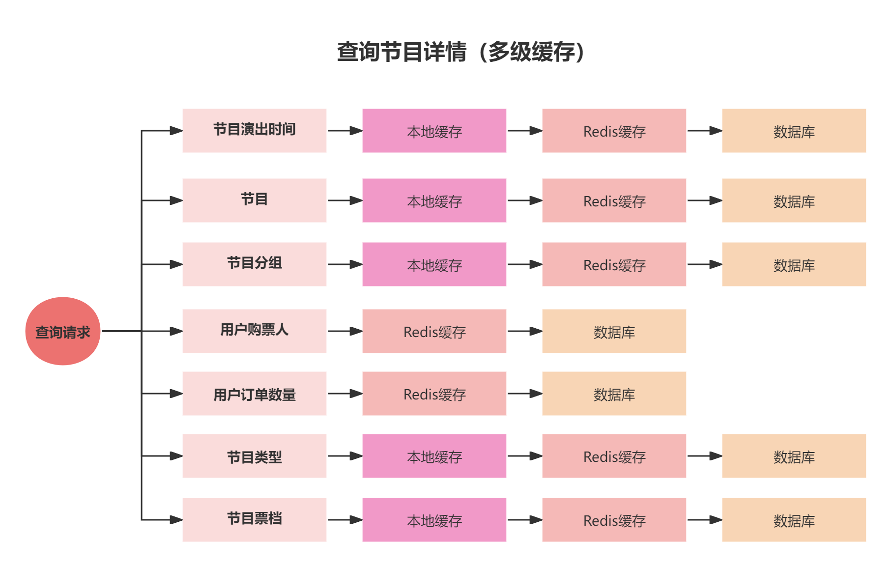

# Redis性能真的足够吗？百万并发的终极杀招 "多级缓存"

# 前置知识讲解
[如何应对突发性热点数据暴增导致系统压力过大问题？](https://www.yuque.com/u22210564/ykdrdh/gt9k8yde2d87w6rq)

在节目详情中，我们利用了双重检查思想和Redis缓存来优化查询的效率，但在百万的高并发情况下，Redis的性能也会支撑不了的，有的人可能会说 可以使用Redis的集群架构啊，这样不就能把数据分散到不同的节点上而从降低压力了吗

这种使用Redis集群的方案其实要分情况来考虑的

1. 比如说100W个并发请求，查询100个节目，每1W个请求查询同一个节目，这种查询不同的节目，使用集群确实可以的
2. 还是100W个并发请求，查询同一个节目，这100W个请求仍然会落到同一个Redis节点上，使用集群仍然解决不了

## 解决的方案
所以这里我们要引用本地缓存来解决高并发的压力，原因有这几点：

1. 使用JVM的内存作为本地缓存，其效率是Reids的几十倍以上
2. 使用本地缓存不存在网络性能损耗

## 引入本地缓存要考虑的问题
1. 如何设计本地缓存？
2. 如何管理本地缓存、Redis缓存这种多层级的缓存？
3. 本地缓存要怎么考虑容量和过期时间来避免内存溢出的问题？
4. 缓存一致性要怎么解决？多实例情况怎么解决？


接下来我们详细的介绍如何引入多级缓存

## 本地缓存的选型
一般设计这种缓存基本都是用的Map结构，线程不安全的有 **HashMap**，线程安全的有**ConcurrentHashMap**，但这两种结构并没有主动设置过期时间的功能

这里我们引入一种高性能的本地缓存中间件 **Caffeine，**基于Java 1.8的高性能本地缓存库，由Guava改进而来，而且在Spring5开始的默认缓存实现就将Caffeine代替原来的Google Guava

官方说明指出，其缓存命中率已经接近最优值。实际上Caffeine这样的本地缓存和ConcurrentMap很像，即支持并发，并且支持O(1)时间复杂度的数据存取。二者的主要区别在于：

+ ConcurrentMap将存储所有存入的数据，直到你显式将其移除；
+ Caffeine将通过给定的配置，自动移除“不常用”的数据，以保持内存的合理占用。

因此，一种更好的理解方式是：Cache是一种带有存储和移除策略的Map。

##### 官方地址：
[GitHub - ben-manes/caffeine: A high performance caching library for Java](https://github.com/ben-manes/caffeine)


# 流程介绍
此流程是基于查询节目详情V1基础上进行优化而来的，建议小伙伴先去学习V1版本的流程，然后再学习V2的流程

[业务讲解-如何实现高性能节目详情展示功能](https://www.yuque.com/u22210564/ykdrdh/kpc3q7invdzn7gev)


接下来详细介绍项目的多级缓存流程，从查询节目详情流程入手，这里另外写了V2版本的方法，方便小伙伴和V1版本进行对比

```java
public ProgramVo getDetailV2(ProgramGetDto programGetDto) {
    //查询节目演出时间
    ProgramShowTime programShowTime =
            programShowTimeService.selectProgramShowTimeByProgramIdMultipleCache(programGetDto.getId());
    
    //从节目表获取数据，以及区域信息
    ProgramVo programVo = programService.getByIdMultipleCache(programGetDto.getId(),programShowTime.getShowTime());
    programVo.setShowTime(programShowTime.getShowTime());
    programVo.setShowDayTime(programShowTime.getShowDayTime());
    programVo.setShowWeekTime(programShowTime.getShowWeekTime());
    
    //从节目分组表获取数据
    ProgramGroupVo programGroupVo = programService.getProgramGroupMultipleCache(programVo.getProgramGroupId());
    programVo.setProgramGroupVo(programGroupVo);

    //预先加载用户购票人
    preloadTicketUserList(programVo.getHighHeat());

    //预先加载用户下节目订单数量
    preloadAccountOrderCount(programVo.getId());
    
    //设置节目类型相关信息
    ProgramCategory programCategory = getProgramCategoryMultipleCache(programVo.getProgramCategoryId());
    if (Objects.nonNull(programCategory)) {
        programVo.setProgramCategoryName(programCategory.getName());
    }
    ProgramCategory parentProgramCategory = getProgramCategoryMultipleCache(programVo.getParentProgramCategoryId());
    if (Objects.nonNull(parentProgramCategory)) {
        programVo.setParentProgramCategoryName(parentProgramCategory.getName());
    }
    //查询节目票档
    List<TicketCategoryVo> ticketCategoryVoList = ticketCategoryService
            .selectTicketCategoryListByProgramIdMultipleCache(programVo.getId(),programShowTime.getShowTime());
    programVo.setTicketCategoryVoList(ticketCategoryVoList);
    
    return programVo;
}
```


接下来就是将各个缓存模块部分进行详细拆分讲解


## 查询节目演出时间
```java
/**
 * 查询节目演出时间(结合多级缓存查询)
 * */
public ProgramShowTime selectProgramShowTimeByProgramIdMultipleCache(Long programId){
    return localCacheProgramShowTime.getCache(RedisKeyBuild.createRedisKey
            (RedisKeyManage.PROGRAM_SHOW_TIME, programId).getRelKey(),
            key -> selectProgramShowTimeByProgramId(programId));
}
```

**localCacheProgramShowTime** 是查询节目演出时间的本地缓存，本地缓存中存在的话直接返回，如果不存在则执行 **selectProgramShowTimeByProgramId(programId)** 从数据库查询节目演出时间数据，然后放入Redis缓存中，执行完后，再放入本地缓存中


我们来看一下节目演出时间的本地缓存结构

### 节目演出时间本地缓存
```java
@Component
public class LocalCacheProgramShowTime {
    
    /**
     * 本地缓存
     * */
    private Cache<String, ProgramShowTime> localCache;
    
    
    /**
     * 本地缓存的容量
     * */
    @Value("${maximumSize:10000}")
    private Long maximumSize;
    
    @PostConstruct
    public void localLockCacheInit(){
        localCache = Caffeine.newBuilder()
                .maximumSize(maximumSize)
                .expireAfter(new Expiry<String, ProgramShowTime>() {
                    @Override
                    public long expireAfterCreate(@NonNull final String key, @NonNull final ProgramShowTime value, 
                                                  final long currentTime) {
                        return TimeUnit.SECONDS.toNanos(DateUtils.countBetweenSecond(DateUtils.now(),value.getShowTime()));
                    }
                    
                    @Override
                    public long expireAfterUpdate(@NonNull final String key, @NonNull final ProgramShowTime value, 
                                                  final long currentTime, @NonNegative final long currentDuration) {
                        return currentDuration;
                    }
                    
                    @Override
                    public long expireAfterRead(@NonNull final String key, @NonNull final ProgramShowTime value, 
                                                final long currentTime, @NonNegative final long currentDuration) {
                        return currentDuration;
                    }
                })
                .build();
    }
    
    /**
     * Caffeine的get是线程安全的
     * */
    public ProgramShowTime getCache(String id, Function<String, ProgramShowTime> function){
        return localCache.get(id,function);
    }
}
```

+ 存放的容量阈值 默认为10000，可通过配置项 **maximumSize** 来设置
+ 在向缓存中存放数据时，设置了expireAfter方法，来指定了使用节目演出时间作为过期时间的时长
+ **getCache **方法用来获取数据，当缓存中不存在时，执行function函数接口，将数据放入，整个过程是线程安全的


这里再把从数据库中查询放入Redis缓存的流程贴出来，方便小伙伴直接查看

```java
/**
 * 查询节目演出时间
 * */
@ServiceLock(lockType= LockType.Read,name = PROGRAM_SHOW_TIME_LOCK,keys = {"#programId"})
public ProgramShowTime selectProgramShowTimeByProgramId(Long programId){
    //从缓存中查询数据
    ProgramShowTime programShowTime = redisCache.get(RedisKeyBuild.createRedisKey(RedisKeyManage.PROGRAM_SHOW_TIME, 
            programId), ProgramShowTime.class);
    //如果存在直接返回数据
    if (Objects.nonNull(programShowTime)) {
        return programShowTime;
    }
    //加锁
    RLock lock = serviceLockTool.getLock(LockType.Reentrant, GET_PROGRAM_SHOW_TIME_LOCK, 
            new String[]{String.valueOf(programId)});
    lock.lock();
    try {
        //再从缓存中查询，如果缓存不存在则从数据库中查询再放入到缓存中
        programShowTime = redisCache.get(RedisKeyBuild.createRedisKey(RedisKeyManage.PROGRAM_SHOW_TIME,
                programId), ProgramShowTime.class);
        if (Objects.isNull(programShowTime)) {
            //缓存还查询不到，只能从数据库中查询
            LambdaQueryWrapper<ProgramShowTime> programShowTimeLambdaQueryWrapper =
                    Wrappers.lambdaQuery(ProgramShowTime.class).eq(ProgramShowTime::getProgramId, programId);
            programShowTime = Optional.ofNullable(programShowTimeMapper.selectOne(programShowTimeLambdaQueryWrapper))
                    .orElseThrow(() -> new DaMaiFrameException(BaseCode.PROGRAM_SHOW_TIME_NOT_EXIST));
            //将查询出的数据放入到缓存中，缓存的过期时间设置到所属节目的演出时间
            redisCache.set(RedisKeyBuild.createRedisKey(RedisKeyManage.PROGRAM_SHOW_TIME, programId),programShowTime
                    ,DateUtils.countBetweenSecond(DateUtils.now(),programShowTime.getShowTime()),TimeUnit.SECONDS);
        }
        return programShowTime;
    }finally {
        lock.unlock();   
    }
}
```


## 查询节目
```java
/**
 * 查询节目(结合多级缓存查询)
 * */
public ProgramVo getByIdMultipleCache(Long programId, Date showTime){
    return localCacheProgram.getCache(RedisKeyBuild.createRedisKey(RedisKeyManage.PROGRAM, programId).getRelKey(),
            key -> {
                ProgramVo programVo = getById(programId,DateUtils.countBetweenSecond(DateUtils.now(),showTime),
                        TimeUnit.SECONDS);
                programVo.setShowTime(showTime);
                return programVo;
            });
}
```

+ **localCacheProgram**是查询节目的本地缓存，本地缓存中存在的话直接返回，如果不存在则执行 **getById(programId,DateUtils.countBetweenSecond(DateUtils.now(),showTime)** 从数据库查询节目数据，然后放入Redis缓存中，执行完后，再放入本地缓存中
+ **programVo.setShowTime(showTime) **这一段代码的作用是在放入本地缓存时，用来从节目对象中获取演出时间而从设置本地缓存的过期时间 


我们来看一下节目的本地缓存结构

### 节目本地缓存
```java
@Component
public class LocalCacheProgram {
    
    /**
     * 本地缓存
     * */
    private Cache<String, ProgramVo> localCache;
    
    
    /**
     * 本地缓存的容量
     * */
    @Value("${maximumSize:10000}")
    private Long maximumSize;
    
    @PostConstruct
    public void localLockCacheInit(){
        localCache = Caffeine.newBuilder()
                .maximumSize(maximumSize)
                .expireAfter(new Expiry<String, ProgramVo>() {
                    @Override
                    public long expireAfterCreate(@NonNull final String key, @NonNull final ProgramVo value, 
                                                  final long currentTime) {
                        return TimeUnit.MILLISECONDS.toNanos(DateUtils.countBetweenSecond(DateUtils.now(),value.getShowTime()));
                    }
                    
                    @Override
                    public long expireAfterUpdate(@NonNull final String key, @NonNull final ProgramVo value, 
                                                  final long currentTime, @NonNegative final long currentDuration) {
                        return currentDuration;
                    }
                    
                    @Override
                    public long expireAfterRead(@NonNull final String key, @NonNull final ProgramVo value, 
                                                final long currentTime, @NonNegative final long currentDuration) {
                        return currentDuration;
                    }
                })
                .build();
    }
    
    /**
     * Caffeine的get是线程安全的
     * */
    public ProgramVo getCache(String id, Function<String, ProgramVo> function){
        return localCache.get(id,function);
    }
}
```

+ 存放的容量阈值 默认为10000，可通过配置项 **maximumSize** 来设置
+ 在向缓存中存放数据时，设置了expireAfter方法，来指定了使用节目演出时间作为过期时间的时长
+ **getCache **方法用来获取数据，当缓存中不存在时，执行function函数接口，将数据放入，整个过程是线程安全的


这里再把从数据库中查询放入Redis缓存的流程贴出来，方便小伙伴直接查看

```java
/**
 * 查询节目
 * */
@ServiceLock(lockType= LockType.Read,name = PROGRAM_LOCK,keys = {"#programId"})
public ProgramVo getById(Long programId,Long expireTime,TimeUnit timeUnit) {
    //先从缓存中查询
    ProgramVo programVo = 
            redisCache.get(RedisKeyBuild.createRedisKey(RedisKeyManage.PROGRAM, programId), ProgramVo.class);
    //如果存在直接返回数据
    if (Objects.nonNull(programVo)) {
        return programVo;
    }
    //加锁
    RLock lock = serviceLockTool.getLock(LockType.Reentrant, GET_PROGRAM_LOCK, new String[]{String.valueOf(programId)});
    lock.lock();
    try {
        //再从缓存中查询，如果缓存不存在则从数据库中查询再放入到缓存中
        return redisCache.get(RedisKeyBuild.createRedisKey(RedisKeyManage.PROGRAM,programId)
                ,ProgramVo.class,
                () -> createProgramVo(programId)
                //缓存的过期时间设置到节目的演出时间
                ,expireTime,
                timeUnit);
    }finally {
        //解锁
        lock.unlock();
    }
}
```


## 查询节目分组
```java
/**
 * 查询节目分组(结合多级缓存查询)
 * */
public ProgramGroupVo getProgramGroupMultipleCache(Long programGroupId){
    return localCacheProgramGroup.getCache(
            RedisKeyBuild.createRedisKey(RedisKeyManage.PROGRAM_GROUP, programGroupId).getRelKey(),
            key -> getProgramGroup(programGroupId));
}
```

**localCacheProgramGroup** 是查询节目分组的本地缓存，本地缓存中存在的话直接返回，如果不存在则执行 **getProgramGroup(programGroupId)** 从数据库查询节目分组数据，然后放入Redis缓存中，执行完后，再放入本地缓存中


我们来看一下节目分组的本地缓存结构

### 节目分组本地缓存
```java
@Component
public class LocalCacheProgramGroup {
    
    /**
     * 本地缓存
     * */
    private Cache<String, ProgramGroupVo> localCache;
    
    
    /**
     * 本地缓存的容量
     * */
    @Value("${maximumSize:10000}")
    private Long maximumSize;
    
    @PostConstruct
    public void localLockCacheInit(){
        localCache = Caffeine.newBuilder()
                .maximumSize(maximumSize)
                .expireAfter(new Expiry<String, ProgramGroupVo>() {
                    @Override
                    public long expireAfterCreate(@NonNull final String key, @NonNull final ProgramGroupVo value,
                                                  final long currentTime) {
                        return TimeUnit.MILLISECONDS.toNanos
                                (DateUtils.countBetweenSecond(DateUtils.now(),value.getRecentShowTime()));
                    }
                    
                    @Override
                    public long expireAfterUpdate(@NonNull final String key, @NonNull final ProgramGroupVo value,
                                                  final long currentTime, @NonNegative final long currentDuration) {
                        return currentDuration;
                    }
                    
                    @Override
                    public long expireAfterRead(@NonNull final String key, @NonNull final ProgramGroupVo value,
                                                final long currentTime, @NonNegative final long currentDuration) {
                        return currentDuration;
                    }
                })
                .build();
    }
    
    /**
     * Caffeine的get是线程安全的
     * */
    public ProgramGroupVo getCache(String id, Function<String, ProgramGroupVo> function){
        return localCache.get(id,function);
    }
}
```

+ 存放的容量阈值 默认为10000，可通过配置项 **maximumSize** 来设置
+ 在向缓存中存放数据时，设置了expireAfter方法，来指定了 **使用节目分组的节目集合中，最近的节目演出时间作为过期时间的时长**
+ **getCache **方法用来获取数据，当缓存中不存在时，执行function函数接口，将数据放入，整个过程是线程安全的


这里再把从数据库中查询放入Redis缓存的流程贴出来，方便小伙伴直接查看

```java
@ServiceLock(lockType= LockType.Read,name = PROGRAM_GROUP_LOCK,keys = {"#programGroupId"})
public ProgramGroupVo getProgramGroup(Long programGroupId) {
    //先从缓存中查询
    ProgramGroupVo programGroupVo =
            redisCache.get(RedisKeyBuild.createRedisKey(RedisKeyManage.PROGRAM_GROUP, programGroupId), ProgramGroupVo.class);
    //如果存在直接返回数据
    if (Objects.nonNull(programGroupVo)) {
        return programGroupVo;
    }
    //加锁
    RLock lock = serviceLockTool.getLock(LockType.Reentrant, GET_PROGRAM_LOCK, new String[]{String.valueOf(programGroupId)});
    lock.lock();
    try {
        //再从缓存中查询，如果缓存不存在则从数据库中查询再放入到缓存中
        programGroupVo = redisCache.get(RedisKeyBuild.createRedisKey(RedisKeyManage.PROGRAM_GROUP, programGroupId), 
                ProgramGroupVo.class);
        if (Objects.isNull(programGroupVo)) {
            //缓存还查询不到，只能从数据库中查询
            programGroupVo = createProgramGroupVo(programGroupId);
            //将查询出的数据放入到缓存中，缓存的过期时间设置节目分组中节目的最近演出时间
            redisCache.set(RedisKeyBuild.createRedisKey(RedisKeyManage.PROGRAM_GROUP, programGroupId),programGroupVo,
                    DateUtils.countBetweenSecond(DateUtils.now(),programGroupVo.getRecentShowTime()),TimeUnit.SECONDS);
        }
        return programGroupVo;
    }finally {
        lock.unlock();
    }
}
```


## 查询节目类型
```java
public ProgramCategory getProgramCategoryMultipleCache(Long programCategoryId){
    return localCacheProgramCategory.get(String.valueOf(programCategoryId),
            key -> getProgramCategory(programCategoryId));
}
```

这里的本地缓存拿取和存放流程和存放节目数据时的多级缓存流程相同，就不再赘述


我们来看一下节目分组的本地缓存结构

### 节目类型本地缓存
```java
@Component
public class LocalCacheProgramCategory {
    
    /**
     * 本地缓存
     * */
    private Cache<String, ProgramCategory> localCache;
    
    @PostConstruct
    public void localLockCacheInit(){
        localCache = Caffeine.newBuilder().build();
    }
    
    /**
     * 获得锁，Caffeine的get是线程安全的
     * */
    public ProgramCategory get(String id, Function<String, ProgramCategory> function){
        return localCache.get(id,function);
    }
}
```

能看到节目类型的本地缓存设计比较简单，因为这类数据属于字典信息，不会变动，所以不需要设置容量和过期时间


## 查询节目票档
```java
public List<TicketCategoryVo> selectTicketCategoryListByProgramIdMultipleCache(Long programId, Date showTime){
    return localCacheTicketCategory.getCache(programId,key -> selectTicketCategoryListByProgramId(programId, 
            DateUtils.countBetweenSecond(DateUtils.now(),showTime), TimeUnit.SECONDS));
}
```

这里的本地缓存拿取和存放流程和存放节目数据时的多级缓存流程相同，就不再赘述


我们来看一下节目票档的本地缓存结构

### 节目票档本地缓存
```java
@Component
public class LocalCacheTicketCategory {
    
    /**
     * 本地缓存
     * */
    private Cache<Long, List<TicketCategoryVo>> localCache;
    
    /**
     * 本地缓存的容量
     * */
    @Value("${maximumSize:10000}")
    private Long maximumSize;
    
    @Autowired
    private RedisCache redisCache;
    
    @PostConstruct
    public void localLockCacheInit(){
        localCache = Caffeine.newBuilder()
                .maximumSize(maximumSize)
                .expireAfter(new Expiry<Long, List<TicketCategoryVo>>() {
                    @Override
                    public long expireAfterCreate(@NonNull final Long key, @NonNull final List<TicketCategoryVo> value,
                                                  final long currentTime) {
                        Long expire = redisCache.getExpire(RedisKeyBuild.createRedisKey
                                (RedisKeyManage.PROGRAM_TICKET_CATEGORY_LIST, key),TimeUnit.MILLISECONDS);
                        return TimeUnit.MILLISECONDS.toNanos(expire);
                    }
                    
                    @Override
                    public long expireAfterUpdate(@NonNull final Long key, @NonNull final List<TicketCategoryVo> value,
                                                  final long currentTime, @NonNegative final long currentDuration) {
                        return currentDuration;
                    }
                    
                    @Override
                    public long expireAfterRead(@NonNull final Long key, @NonNull final List<TicketCategoryVo> value,
                                                final long currentTime, @NonNegative final long currentDuration) {
                        return currentDuration;
                    }
                })
                .build();
    }
    
    /**
     * Caffeine的get是线程安全的
     * */
    public List<TicketCategoryVo> getCache(Long id, Function<Long, List<TicketCategoryVo>> function){
        return localCache.get(id,function);
    }
}
```

+ 存放的容量阈值 默认为10000，可通过配置项 **maximumSize** 来设置
+ **getCache **方法用来获取数据，当缓存中不存在时，执行function函数接口，将数据放入，整个过程是线程安全的

#### 过期时间的设置
节目票档数据并没有节目演出时间的字段，所以没有办法直接使用来设置过期时间，但我们可以利用一个技巧，在放入本地缓存前，会放到Redis缓存，而存放Redis缓存时会设置过期时间，就可以利用这一点，**在放入本地缓存的过程中，从Redis中获取此数据的过期时间，来作为本地缓存的过期时间**


重点在expireAfter方法中：

```java
public long expireAfterCreate(@NonNull final Long key, @NonNull final List<TicketCategoryVo> value,
                              final long currentTime) {
    Long expire = redisCache.getExpire(RedisKeyBuild.createRedisKey
            (RedisKeyManage.PROGRAM_TICKET_CATEGORY_LIST, key),TimeUnit.MILLISECONDS);
    return TimeUnit.MILLISECONDS.toNanos(expire);
}
```


### 流程图
## 总结
+ 在查询节目详情的流程中，分别对<font style="color:#0C68CA;">节目演出时间、节目、节目分组、节目类型、节目票档</font>设计了本地缓存和Redis的多级缓存
+ 对于 节目演出时间、节目、节目分组、节目类型、节目票档，这几类数据不会经常修改，所以适合存放在本地缓存中

## 思考
而对于如果有修改的操作，那该如何去解决缓存一致性呢？又比如缓存中数据都是根据节目演出时间来设置的，如果遇到了突发情况，要求节目提前下线，要如何在缓存中提前过期呢？

关于这部分的详细讲解，小伙伴可跳转到相应的文档来学习

[如何确保多级缓存的一致性？](https://www.yuque.com/u22210564/ykdrdh/lxi8wr6g8ae8z758)


> 更新: 2024-07-23 16:39:50  
> 原文: <https://www.yuque.com/u22210564/ykdrdh/btstcv96moecnvnv>