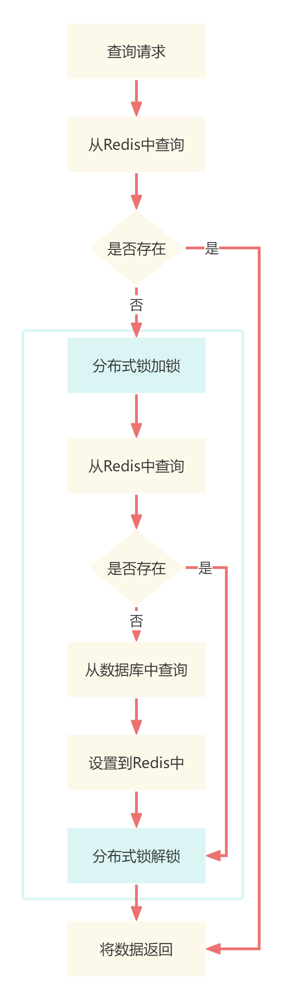
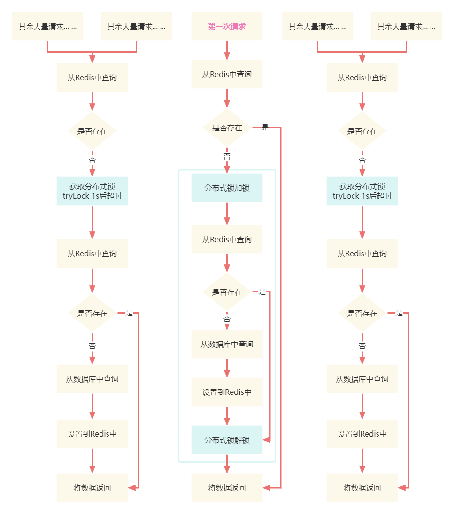

# 如何应对突发性热点数据暴增导致系统压力过大问题？

建议小伙伴先跳转到相应文档学习什么是缓存击穿？

[技术精华-如何解决缓存击穿？](https://www.yuque.com/u22210564/ykdrdh/uourinkbtd5dp0mc)


在上述的文档说，使用了分布式锁的方式来解决缓存击穿，最后留下了问题，这段代码哪里可以进行优化？这里我们再来分析下这段代码

```java
public String getDataV2(String id){
    RedisTemplate<String,String> redisTemplate = redisCache.getInstance();
    String cachedValue = redisTemplate.opsForValue().get(id);
    if (StringUtil.isEmpty(cachedValue)) {
        RLock lock = serviceLockTool.getLock(LockType.Reentrant, id);
        lock.lock();
        try {
            Program program = programMapper.selectById(id);
            if (Objects.nonNull(program)) {
                redisTemplate.opsForValue().set(id,JSON.toJSONString(program));
                cachedValue = JSON.toJSONString(program);
            }
        } finally {
            lock.unlock();
        }
    }
    return cachedValue;
}
```

这里面其实存在查询的问题，每个请求确实是串行执行了，但每个请求获得锁之后还是去查询数据库了，其实完全没有必要都去查询数据库的，当第一个请求从数据库查询出来放入缓存后，之后的请求都应该从缓存中查询才对，那要怎么样才能够实现呢？

### 双重检测锁的单例模式
大家在学习单例模式的使用，应该都知道 **双重检测锁** 这种方式

```java
public class DCLSingleton {

    // 单例
    private static volatile DCLSingleton singleton = null;

    // 私有构造方法
    private DCLSingleton() {
    }

    public static DCLSingleton getInstance() {
        if (null == singleton) {
            synchronized (DCLSingleton.class) {
                if (null == singleton) {
                    singleton = new  DCLSingleton();
                }
            }
        }
        return singleton;
    }
}
```

先是判断对象是否为空，如果为空的话，则加锁，在锁的逻辑中再判断一次对象是否为空，如果还是为空的话，则进行创建对象

我们就可以利用这种双重检测的方式，来对其进行优化

# 分布式锁+双重检测的方案
```java
public String getDataV3(String id){
    RedisTemplate<String,String> redisTemplate = redisCache.getInstance();
    String cachedValue = redisTemplate.opsForValue().get(id);
    if (StringUtil.isEmpty(cachedValue)) {
        RLock lock = serviceLockTool.getLock(LockType.Reentrant, id);
        lock.lock();
        try {
            cachedValue = redisTemplate.opsForValue().get(id);
            if (StringUtil.isEmpty(cachedValue)) {
                Program program = programMapper.selectById(id);
                if (Objects.nonNull(program)) {
                    redisTemplate.opsForValue().set(id,JSON.toJSONString(program));
                    cachedValue = JSON.toJSONString(program);
                }
            }
        } finally {
            lock.unlock();
        }
    }
    return cachedValue;
}
```

当请求获得锁后，先去缓存中查询，如果存在就直接将数据返回，如果还是不存在再从数据库查询然后放到缓存中

这样就能实现当第一个请求将数据库中数据放入缓存后，之后的请求可以直接从缓存中读取



# 项目中的解决方案
建议小伙伴先去查看关于节目详情流程的部分，知道了具体的业务后再回来看是怎么在原有基础上做优化的

[业务讲解-如何实现高性能节目详情展示功能](https://www.yuque.com/u22210564/ykdrdh/kpc3q7invdzn7gev)

#### 接下来我们就来看看对节目详情的流程中使用双重检测锁
**com.damai.service.ProgramService#getDetail**

```java
public ProgramVo getDetail(ProgramGetDto programGetDto) {
    //查询节目演出时间
    ProgramShowTime programShowTime = programShowTimeService.selectProgramShowTimeByProgramId(programGetDto.getId());
    
    //从节目表获取数据，以及区域信息
    ProgramVo programVo = programService.getById(programGetDto.getId(),DateUtils.countBetweenSecond(DateUtils.now(),
                    programShowTime.getShowTime()), TimeUnit.SECONDS);
    programVo.setShowTime(programShowTime.getShowTime());
    programVo.setShowDayTime(programShowTime.getShowDayTime());
    programVo.setShowWeekTime(programShowTime.getShowWeekTime());
    
    //从节目分组表获取数据
    ProgramGroupVo programGroupVo = programService.getProgramGroup(programGetDto.getId());
    programVo.setProgramGroupVo(programGroupVo);
    
    //预先加载用户购票人
    preloadTicketUserList(programVo.getHighHeat());
    
    //设置节目类型相关信息
    ProgramCategory programCategory = getProgramCategory(programVo.getProgramCategoryId());
    if (Objects.nonNull(programCategory)) {
        programVo.setProgramCategoryName(programCategory.getName());
    }
    ProgramCategory parentProgramCategory = getProgramCategory(programVo.getParentProgramCategoryId());
    if (Objects.nonNull(parentProgramCategory)) {
        programVo.setParentProgramCategoryName(parentProgramCategory.getName());
    }
    
    //查询节目票档
    List<TicketCategoryVo> ticketCategoryVoList = 
            ticketCategoryService.selectTicketCategoryListByProgramId(programVo.getId(),
                    DateUtils.countBetweenSecond(DateUtils.now(),programShowTime.getShowTime()), TimeUnit.SECONDS);
    programVo.setTicketCategoryVoList(ticketCategoryVoList);
    
    return programVo;
}
```

接下来就是将各个缓存模块部分进行详细拆分讲解


## 查询节目演出时间
```java
/**
 * 查询节目演出时间
 * */
@ServiceLock(lockType= LockType.Read,name = PROGRAM_SHOW_TIME_LOCK,keys = {"#programId"})
public ProgramShowTime selectProgramShowTimeByProgramId(Long programId){
    //从缓存中查询数据
    ProgramShowTime programShowTime = redisCache.get(RedisKeyBuild.createRedisKey(RedisKeyManage.PROGRAM_SHOW_TIME, 
            programId), ProgramShowTime.class);
    //如果存在直接返回数据
    if (Objects.nonNull(programShowTime)) {
        return programShowTime;
    }
    //加锁
    RLock lock = serviceLockTool.getLock(LockType.Reentrant, GET_PROGRAM_SHOW_TIME_LOCK, 
            new String[]{String.valueOf(programId)});
    lock.lock();
    try {
        //再从缓存中查询，如果缓存不存在则从数据库中查询再放入到缓存中
        programShowTime = redisCache.get(RedisKeyBuild.createRedisKey(RedisKeyManage.PROGRAM_SHOW_TIME,
                programId), ProgramShowTime.class);
        if (Objects.isNull(programShowTime)) {
            //缓存还查询不到，只能从数据库中查询
            LambdaQueryWrapper<ProgramShowTime> programShowTimeLambdaQueryWrapper =
                    Wrappers.lambdaQuery(ProgramShowTime.class).eq(ProgramShowTime::getProgramId, programId);
            programShowTime = Optional.ofNullable(programShowTimeMapper.selectOne(programShowTimeLambdaQueryWrapper))
                    .orElseThrow(() -> new DaMaiFrameException(BaseCode.PROGRAM_SHOW_TIME_NOT_EXIST));
            //将查询出的数据放入到缓存中，缓存的过期时间设置到所属节目的演出时间
            redisCache.set(RedisKeyBuild.createRedisKey(RedisKeyManage.PROGRAM_SHOW_TIME, programId),programShowTime
                    ,DateUtils.countBetweenSecond(DateUtils.now(),programShowTime.getShowTime()),TimeUnit.SECONDS);
        }
        return programShowTime;
    }finally {
        lock.unlock();   
    }
}
```

#### 总体流程就是应用了双重检测锁的思想：
+ 先从缓存中查询数据
+ 如果缓存中不存在，则上锁查询库
+ 分布式锁加锁
+ 再从缓存中查询数据
+ 缓存中还不存在，则从数据库中查询
+ 将数据库中查询到的数据放到缓存中
+ 分布式锁解锁
+ 返回数据


#### 过期时间的优化
在缓存的过期时间设计上也进行了优化，将之前统一的设置过期时间，优化成了根据所属节目的演出时间来设置。

这样可以防止因设置统一过期时间而带来的同一时间产生的大量缓存过期，而带来的 **<font style="color:#2F8EF4;">缓存雪崩</font>** 问题

## 从节目表获取数据，以及区域信息
```java
//从节目表获取数据，以及区域信息
ProgramVo programVo = programService.getById(programGetDto.getId(),DateUtils.countBetweenSecond(DateUtils.now(),
                programShowTime.getShowTime()), TimeUnit.SECONDS);
```

```java
/**
 * 查询节目
 * */
@ServiceLock(lockType= LockType.Read,name = PROGRAM_LOCK,keys = {"#programId"})
public ProgramVo getById(Long programId,Long expireTime,TimeUnit timeUnit) {
    //先从缓存中查询
    ProgramVo programVo = 
            redisCache.get(RedisKeyBuild.createRedisKey(RedisKeyManage.PROGRAM, programId), ProgramVo.class);
    //如果存在直接返回数据
    if (Objects.nonNull(programVo)) {
        return programVo;
    }
    //加锁
    RLock lock = serviceLockTool.getLock(LockType.Reentrant, GET_PROGRAM_LOCK, new String[]{String.valueOf(programId)});
    lock.lock();
    try {
        //再从缓存中查询，如果缓存不存在则从数据库中查询再放入到缓存中
        return redisCache.get(RedisKeyBuild.createRedisKey(RedisKeyManage.PROGRAM,programId)
                ,ProgramVo.class,
                () -> createProgramVo(programId)
                //缓存的过期时间设置到节目的演出时间
                ,expireTime,
                timeUnit);
    }finally {
        //解锁
        lock.unlock();
    }
}
```

这里的redisCache.get方法是用到了 **命令模式**，通过 **Supplier **接口来执行数据库查看的逻辑，而 **Supplier 是函数式声明接口，**所以可以结合Lamba表达式来实现


```java
public <T> T get(RedisKeyBuild redisKeyBuild, Class<T> clazz, Supplier<T> supplier, long ttl, TimeUnit timeUnit) {
    T t = get(redisKeyBuild, clazz);
    if (CacheUtil.isEmpty(t)) {
        t = supplier.get();
        if (CacheUtil.isEmpty(t)) {
            return null;
        }
        set(redisKeyBuild,t,ttl,timeUnit);
    }
    return t;
}
```

+ 先调用get方法从缓存中查询
+ 如果查询数据不存在，则调用Supplier接口的get方法
+ 将得到的结果设置到缓存中


```java
private ProgramVo createProgramVo(long programId){
    ProgramVo programVo = new ProgramVo();
    //根据id查询到节目
    Program program = 
            Optional.ofNullable(programMapper.selectById(programId))
                    .orElseThrow(() -> new DaMaiFrameException(BaseCode.PROGRAM_NOT_EXIST));
    BeanUtil.copyProperties(program,programVo);
    //查询区域
    AreaGetDto areaGetDto = new AreaGetDto();
    areaGetDto.setId(program.getAreaId());
    ApiResponse<AreaVo> areaResponse = baseDataClient.getById(areaGetDto);
    if (Objects.equals(areaResponse.getCode(), ApiResponse.ok().getCode())) {
        if (Objects.nonNull(areaResponse.getData())) {
            programVo.setAreaName(areaResponse.getData().getName());
        }
    }else {
        log.error("base-data rpc getById error areaResponse:{}", JSON.toJSONString(areaResponse));
    }
    return programVo;
}
```

#### 也是应用了双重检测锁的思想：
+ 先从缓存中查询数据
+ 如果缓存中不存在，则上锁查询库
+ 分布式锁加锁
+ 再从缓存中查询数据
+ 缓存中还不存在，则从数据库中查询
+ 将数据库中查询到的数据放到缓存中
+ 分布式锁解锁
+ 返回数据


剩下的模块查询也都是相同的流程，都用到了双重检测锁，这里把代码贴出来


## 查询节目分组
```java
@ServiceLock(lockType= LockType.Read,name = PROGRAM_GROUP_LOCK,keys = {"#programGroupId"})
public ProgramGroupVo getProgramGroup(Long programGroupId) {
    //先从缓存中查询
    ProgramGroupVo programGroupVo =
            redisCache.get(RedisKeyBuild.createRedisKey(RedisKeyManage.PROGRAM_GROUP, programGroupId), ProgramGroupVo.class);
    //如果存在直接返回数据
    if (Objects.nonNull(programGroupVo)) {
        return programGroupVo;
    }
    //加锁
    RLock lock = serviceLockTool.getLock(LockType.Reentrant, GET_PROGRAM_LOCK, new String[]{String.valueOf(programGroupId)});
    lock.lock();
    try {
        //再从缓存中查询，如果缓存不存在则从数据库中查询再放入到缓存中
        programGroupVo = redisCache.get(RedisKeyBuild.createRedisKey(RedisKeyManage.PROGRAM_GROUP, programGroupId), 
                ProgramGroupVo.class);
        if (Objects.isNull(programGroupVo)) {
            //缓存还查询不到，只能从数据库中查询
            programGroupVo = createProgramGroupVo(programGroupId);
            //将查询出的数据放入到缓存中，缓存的过期时间设置节目分组中节目的最近演出时间
            redisCache.set(RedisKeyBuild.createRedisKey(RedisKeyManage.PROGRAM_GROUP, programGroupId),programGroupVo,
                    DateUtils.countBetweenSecond(DateUtils.now(),programGroupVo.getRecentShowTime()),TimeUnit.SECONDS);
        }
        return programGroupVo;
    }finally {
        lock.unlock();
    }
}
```

```java
 ProgramGroupVo createProgramGroupVo(Long programGroupId){
    ProgramGroupVo programGroupVo = new ProgramGroupVo();
    //从数据库中查询节目分组数据
    ProgramGroup programGroup =
            Optional.ofNullable(programGroupMapper.selectById(programGroupId))
                    .orElseThrow(() -> new DaMaiFrameException(BaseCode.PROGRAM_GROUP_NOT_EXIST));
    programGroupVo.setId(programGroup.getId());
    programGroupVo.setProgramSimpleInfoVoList(JSON.parseArray(programGroup.getProgramJson(), ProgramSimpleInfoVo.class));
    return programGroupVo;
}
```


### 节目分组缓存过期时间的设置
<font style="color:#0C68CA;">这里的过期时间并不能直接使用节目的演出时间，首先我们要知道节目分组表中的节目分组字段中保存的就是</font>**<font style="color:#0C68CA;">属于同一个的节目但不同的城市的节目集合</font>**

<font style="color:#0C68CA;">所以节目分组的过期时间应该为，这些节目集合中最近的节目演出时间，这样设计的话，当过期时间到达了每次最近的节目演出时间，缓存中被清除，下一次再查询节目详情时，就会被最新的节目分组数据放到缓存</font><font style="color:#2F8EF4;">中</font>


## 查询节目票档
```java
@ServiceLock(lockType= LockType.Read,name = TICKET_CATEGORY_LOCK,keys = {"#programId"})
public List<TicketCategoryVo> selectTicketCategoryListByProgramId(Long programId,Long expireTime,TimeUnit timeUnit){
    //从缓存中查询
    List<TicketCategoryVo> ticketCategoryVoList = 
            redisCache.getValueIsList(RedisKeyBuild.createRedisKey(RedisKeyManage.PROGRAM_TICKET_CATEGORY_LIST, 
                    programId), TicketCategoryVo.class);
    //如果缓存中存在直接返回数据
    if (CollectionUtil.isNotEmpty(ticketCategoryVoList)) {
        return ticketCategoryVoList;
    }
    //加锁
    RLock lock = serviceLockTool.getLock(LockType.Reentrant, GET_TICKET_CATEGORY_LOCK, 
            new String[]{String.valueOf(programId)});
    lock.lock();
    try {
        //再从缓存中查询，如果缓存不存在则从数据库中查询再放入到缓存中
        return redisCache.getValueIsList(
                RedisKeyBuild.createRedisKey(RedisKeyManage.PROGRAM_TICKET_CATEGORY_LIST, programId),
                TicketCategoryVo.class,
                () -> {
                    LambdaQueryWrapper<TicketCategory> ticketCategoryLambdaQueryWrapper =
                            Wrappers.lambdaQuery(TicketCategory.class).eq(TicketCategory::getProgramId, programId);
                    List<TicketCategory> ticketCategoryList =
                            ticketCategoryMapper.selectList(ticketCategoryLambdaQueryWrapper);
                    return ticketCategoryList.stream().map(ticketCategory -> {
                        ticketCategory.setRemainNumber(null);
                        TicketCategoryVo ticketCategoryVo = new TicketCategoryVo();
                        BeanUtil.copyProperties(ticketCategory, ticketCategoryVo);
                        return ticketCategoryVo;
                    }).collect(Collectors.toList());
                }, expireTime, timeUnit);
    }finally {
        //解锁
        lock.unlock();
    }
}
```


# 读写锁
到这里，小伙伴应该懂得了双重检测锁的用法了，有的人可能会想方法上面的 **@ServiceLock(lockType= LockType.Read)，**这怎么还用了切面形式的锁，用的还是读锁？

其实这里为了解决查询时的缓存和数据库一致性问题

在修改数据的时候的时候用的是写锁，而在读取数据的时候用的是读锁，写和写、写和读是互斥的。读和读是不互斥的。这种在读多，写少的场景是非常合适的


比如在修改节目状态、座位状态、余票数量时候用的是写锁，读取数据的时候用的是读锁，只有在修改的时候，查询的请求才会等待修改完成，而在全都是查询的请求时，并不会被阻塞等待

## 思考
小伙伴可以再接着思考，优化到这步了，引入了双重检测锁了，还有没有什么问题？也是先自己思考下，然后再接着往下看

### 存在的问题
我们再来看使用双重检测锁优化后的这段代码

```java
private ProgramVo getById(Long programId) {
    //先从缓存中查询
    ProgramVo programVo = 
            redisCache.get(RedisKeyBuild.createRedisKey(RedisKeyManage.PROGRAM, programId), ProgramVo.class);
    //如果存在直接返回数据
    if (Objects.nonNull(programVo)) {
        return programVo;
    }
    //加锁
    RLock lock = serviceLockTool.getLock(LockType.Reentrant, GET_PROGRAM_LOCK, new String[]{String.valueOf(programId)});
    lock.lock();
    try {
        //再从缓存中查询，如果缓存不存在则从数据库中查询再放入到缓存中
        return redisCache.get(RedisKeyBuild.createRedisKey(RedisKeyManage.PROGRAM,programId)
                ,ProgramVo.class,
                () -> createProgramVo(programId)
                ,EXPIRE_TIME,
                TimeUnit.DAYS);
    }finally {
        //解锁
        lock.unlock();
    }
}
```

<font style="color:#213BC0;">小伙伴们有没有发现，现在除了第一次请求外，其余的请求确实是能从缓存中获得了，但所有的请求还是要挨个去竞争锁的，每个请求依旧还是有获取锁，加锁以及再解锁的过程，还是要挨个的串行处理请求的，依旧不能实现并发的处理</font>

**<font style="color:#213BC0;">假设查看同一个节目的并发请求有100w，假设Redis处理锁的请求执行1毫秒就完成，那么等到最后一个请求，还是要等待999999毫秒，约等于16分钟左右</font>**

<font style="color:#213BC0;">事实上只要第一次请求获得锁，然后从数据库中拿到数据放入缓存就好了，</font>**<font style="color:#213BC0;">其余的请求其实 不用再去竞争锁了 能直接从缓存拿不就完事了嘛！</font>**<font style="color:#213BC0;">，所以我们要优化的就是想办法 </font>**<font style="color:#213BC0;">来减少锁的竞争</font>**

# 减少分布式锁的竞争
但要怎么做才能实现只有第一个请求获得了锁，其余的请求不用竞争锁，并且还能从缓存中获取呢？

其实不难，只要改变锁的竞争方式就可以

```java
private ProgramVo getById(Long programId,Long expireTime,TimeUnit timeUnit) {
    //先从缓存中查询
    ProgramVo programVo = 
            redisCache.get(RedisKeyBuild.createRedisKey(RedisKeyManage.PROGRAM, programId), ProgramVo.class);
    //如果存在直接返回数据
    if (Objects.nonNull(programVo)) {
        return programVo;
    }
    //加锁
    RLock lock = serviceLockTool.getLock(LockType.Reentrant, GET_PROGRAM_LOCK, new String[]{String.valueOf(programId)});
    boolean lockResult;
    try {
        //等待锁的时间为1s，超过1s后，继续执行
        lockResult = lock.tryLock(1, TimeUnit.SECONDS);
    } catch (InterruptedException e) {
        throw new DaMaiFrameException("线程中断异常",e);
    }
    try {
        //再从缓存中查询，如果缓存不存在则从数据库中查询再放入到缓存中
        return redisCache.get(RedisKeyBuild.createRedisKey(RedisKeyManage.PROGRAM,programId)
                ,ProgramVo.class,
                () -> createProgramVo(programId)
                ,expireTime,
                timeUnit);
    }finally {
        if (lockResult) {
            lock.unlock();
        }
    }
}
```

这里是将锁的竞争方式从**lock改为了tryLock**，**等待时间为1s**，意思也就是说请求等待锁的时间为1s，如果1s后还没有获得到锁的后，就不再继续等待，直接返回获得锁的结果，程序接着往下执行



如果是这种方式的话，流程就变成了：

+ **<font style="color:#213BC0;">第一个请求获得了锁，从缓存中不存在，然后从数据库中查询再放入到缓存中</font>**
+ **<font style="color:#213BC0;">其余的请求等待1s来获得锁，如果超过1s，就不再竞争锁，程序继续往下执行，由于第一个请求将已经放数据放入到缓存中了，所以可以直接从缓存中查询到，将数据返回</font>**

同样假设并发请求有100W，还是每个请求执行1毫秒，那么就变成了除了**第一个请求执行1s时间，其余的请求执行都是1s+1ms的时间**

## 思考
那么用这种方式是不是就不会有问题了呢？，答案 并不是。万一第一个请求的执行时间大于了1s，还没有来的及将数据库的数据放到缓存中，而这时其他的请求等待锁超过了1s，就会继续接着执行，仍然有可能集中到了数据库部分，数据库的压力还是会很大

这就需要根据业务来设置等待锁的时间，设置一个比较底限的值，保证不会超出的一个时间，但想设置一个百分之百不能超过的一个值，确实需要经过大量时间的业务运算来进行估算

## 总结
用 tryLock 的方式确实能并发处理但是丢失了绝对的安全，其实设计方案就是这样，**没有存在银弹的技术，既能保证这个又能保证这个**，设计方案最重要的就是根据业务来做出 **<font style="color:#213BC0;">权衡 </font>**，判断要保证哪部分，可以抛弃哪部分，这也是要经过多次协商、多次讨论才能总结出的

而本人也是通过此项目将不同的方案都列举了出来，也希望小伙伴能真正的掌握

## 问题
我们看到这里，觉得就没有问题了吗？答案并不是，在真正的高并发面前，Redis的性能也是存在很大的压力的，这时就要引入最高性能的缓存，但什么样的缓存比Redis的性能还要高？

大道至简，其实就是JVM的内存本地缓存，本地缓存的性能可是比Redis高出了几十倍不止，并且也不存在网络性能损耗，抗住百万并发是没什么问题的

但引入了本地缓存要思考的问题就很多了，比如 如何设计本地缓存？如何管理本地缓存、Redis缓存这种多层级的缓存、本地缓存要怎么考虑容量和过期时间来避免内存溢出的问题？

关于多级缓存的详细讲解，小伙伴可跳转到相应的文档来学习

[Redis性能真的足够吗？百万并发的终极杀招 "多级缓存"](https://www.yuque.com/u22210564/ykdrdh/btstcv96moecnvnv)


> 更新: 2024-10-06 11:52:23  
> 原文: <https://www.yuque.com/u22210564/ykdrdh/gt9k8yde2d87w6rq>