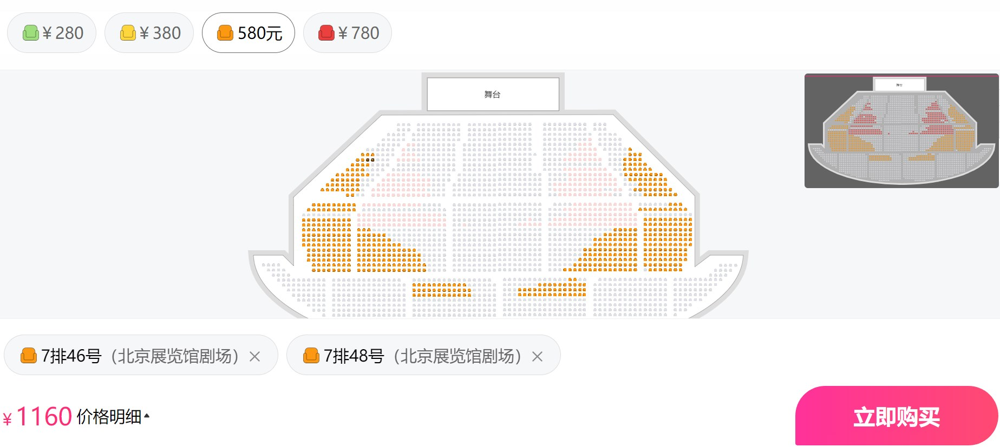
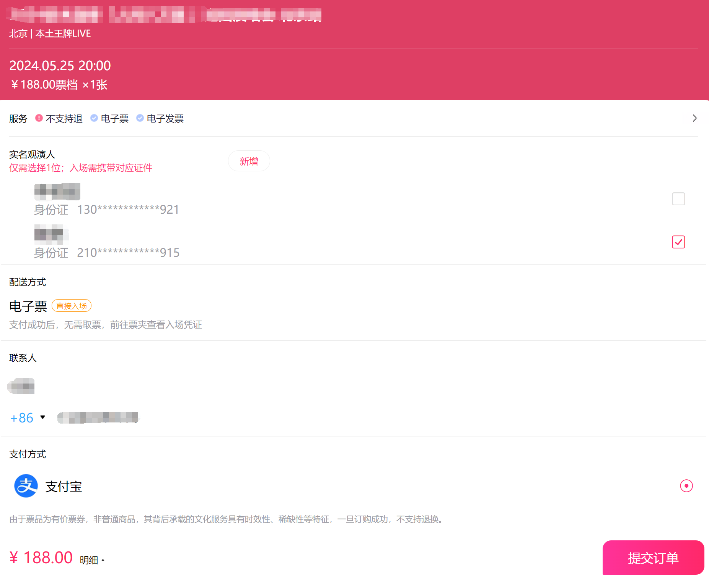
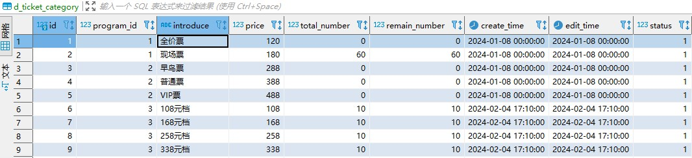
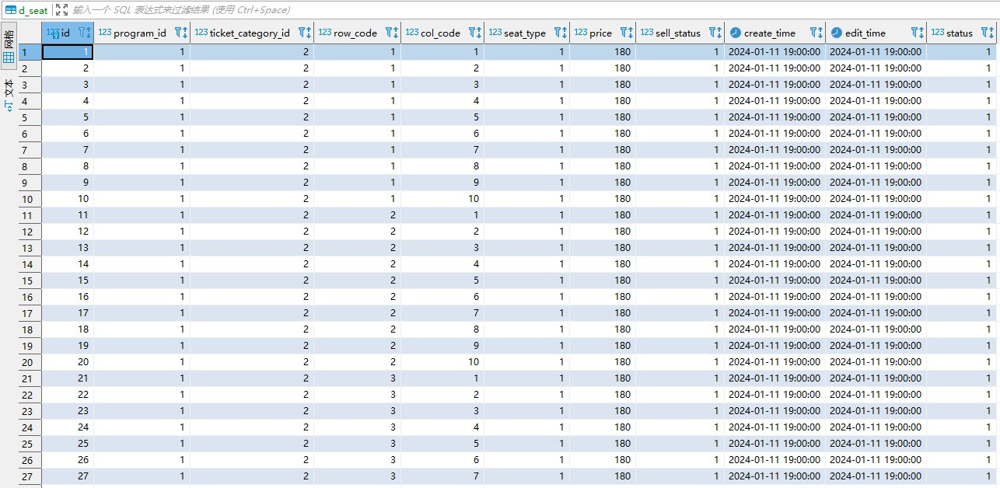
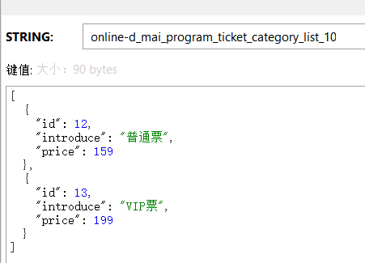
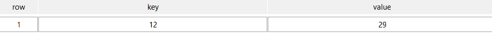
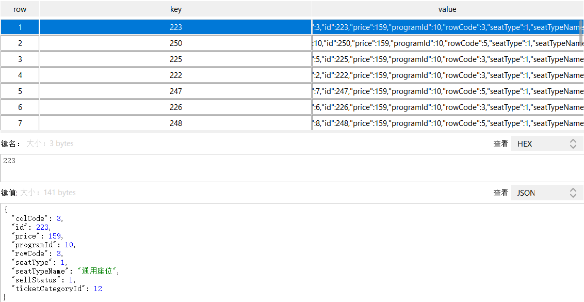
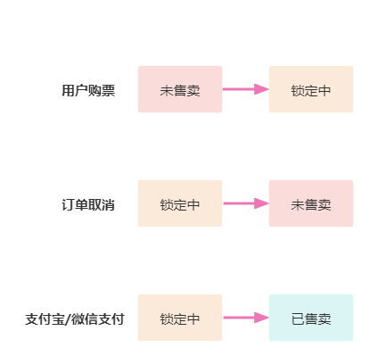
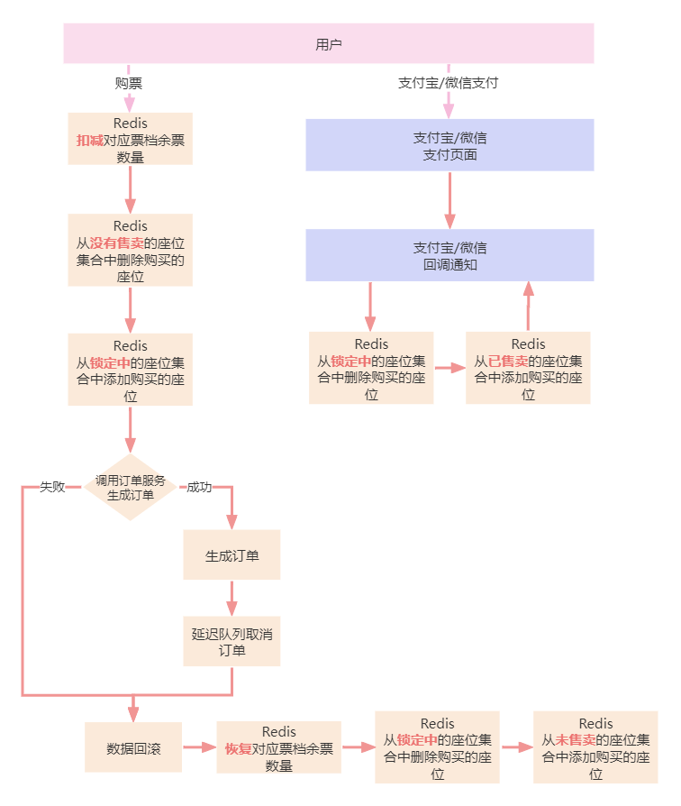

# 详解用户购票背后的余票更新机制

[业务讲解-如何应对高并发下的购票压力](https://www.yuque.com/u22210564/ykdrdh/schg4ewp7pupbb88)中讲解了用户购票的流程


[业务讲解-订单生成失败和取消订单时如何快速回滚数据](https://www.yuque.com/u22210564/ykdrdh/zuuu0ggcadzwgw0w)中讲解了支付失败时的数据回滚过程


[业务讲解-如何保障节目数据在缓存与数据库间的一致性](https://www.yuque.com/u22210564/ykdrdh/ooct03hg94q4ve21)又介绍了数据库和缓存的一致性问题怎么解决的


这三篇文章里面都提到了关于余票和座位的数据修改，但并没有单独详细的讲解，为了让小伙伴更加的理解透余票和座位是如何修改的，本文将会详细的介绍关于这两部分数据的详细流程


#### 节目选座说明


让我们再次查看节目对于是否可以手动选择座位的规定，根据节目表中的字段`permit_choose_seat`来判断可以选择座位，如果可以选座在节目详情页面会有可选座的说明


#### 手动选座


可以点击选座购买，接着会跳转到选择座位的页面





#### 提交订单


选择相应的座位后或者不允许选座直接进行购买，就会进入订单生成的页面





当用户提交订单后，就开始真正的进入支付流程了，紧接着就会开始进行余票数量和座位的扣减


### 数据库中结构


#### 票档表结构


```sql
CREATE TABLE `d_ticket_category` (
  `id` bigint(20) NOT NULL COMMENT '主键id',
  `program_id` bigint(20) NOT NULL COMMENT '节目表id',
  `introduce` varchar(256) NOT NULL COMMENT '介绍',
  `price` decimal(10,0) NOT NULL COMMENT '价格',
  `total_number` bigint(20) NOT NULL COMMENT '总数量',
  `remain_number` bigint(20) NOT NULL COMMENT '剩余数量',
  `create_time` datetime NOT NULL COMMENT '创建时间',
  `edit_time` datetime NOT NULL COMMENT '编辑时间',
  `status` tinyint(1) NOT NULL DEFAULT '1' COMMENT '1:正常 0:删除',
  PRIMARY KEY (`id`)
) ENGINE=InnoDB DEFAULT CHARSET=utf8mb4 COMMENT='节目票档表';
```


#### 票档表数据





#### 座位表结构


```sql
CREATE TABLE `d_seat` (
  `id` bigint(20) NOT NULL COMMENT '主键id',
  `program_id` bigint(20) NOT NULL COMMENT '节目表id',
  `ticket_category_id` bigint(20) NOT NULL COMMENT '节目票档id',
  `row_code` int(11) NOT NULL COMMENT '排号',
  `col_code` int(11) NOT NULL COMMENT '列号',
  `seat_type` int(3) NOT NULL COMMENT '座位类型 详见seatType枚举',
  `price` decimal(10,0) NOT NULL COMMENT '座位价格',
  `sell_status` int(3) NOT NULL DEFAULT '1' COMMENT '1未售卖 2锁定 3已售卖',
  `create_time` datetime NOT NULL COMMENT '创建时间',
  `edit_time` datetime NOT NULL COMMENT '编辑时间',
  `status` tinyint(1) NOT NULL DEFAULT '1' COMMENT '1:正常 0:删除',
  PRIMARY KEY (`id`)
) ENGINE=InnoDB DEFAULT CHARSET=utf8mb4 COMMENT='座位表';
```


#### 座位表数据





### 缓存结构


#### 票档


为了方便在redis中进行扣除余票数量，将票档表拆分为了2部分存放到redis中：


+ 第1部分key为**damai-d_mai_program_ticket_category_list_节目id**为了查看票档介绍和价格
+ 第2部分key为**damai-d_mai_program_ticket_remain_number_hash_resolution_节目id_票档id**，为了更新余票数量


**damai-d_mai_program_ticket_category_list_10**





**damai-d_mai_program_ticket_remain_number_hash_resolution_10_12**





#### 座位


redis中是将未售卖、锁定中、已售卖三种状态的座位来分开存放的，都是使用Hash结构，这三种座位状态对应的**Hash的键值**分别是(去掉个人前缀 默认:damai)

+ **d_mai_program_seat_no_sold_resolution_hash_节目id_票档id**
+ **d_mai_program_seat_lock_resolution_hash_节目id_票档id**
+ **d_mai_program_seat_sold_resolution_hash_节目id_票档id**

而在Hash结构中，Hash的key为座位id，Hash的value为座位对象


这里以未售卖的节目为例，看下redis存放的真实结构


**damai-d_mai_program_seat_no_sold_resolution_hash_10_12**





### 余票的扣减


余票的扣减很简单，从redis中直接扣除即可，如果对余票数量进行还原，也直接从redis中还原就行


### 座位状态的变更


而对于座位的状态是在三种状态中间进行转换，并且需要在redis中对相应状态的座位集合进行删除和添加，就是根据状态来进行移动数据





#### 座位状态的枚举


**com.damai.enums.SellStatus**


```java
public enum SellStatus {
    /**
     * 售卖状态
     * */
    NO_SOLD(1,"未售卖"),
    LOCK(2,"锁定"),
    SOLD(3,"已售卖"),
    ;

    private Integer code;

    private String msg;

    SellStatus(Integer code, String msg) {
        this.code = code;
        this.msg = msg;
    }

}
```


### 支付流程中余票数量和座位状态的转换过程图





关于余票和座位状态的具体修改操作都是在 **lua+redis** 中执行的，这样可以保证整个执行命令的原子性，关于详细的流程讲解和具体的代码讲解，在购票流程和取消流程中都有细致的讲解，这里就不再赘述了


本人介绍了redis中如果修改余票数量和座位的，并没有提高数据库中的数据是什么时候修改的，以及缓存和数据库一致性的问题，关于这部分的详细介绍，可跳转到相应文档阅读


[业务讲解-如何保障节目数据在缓存与数据库间的一致性](https://www.yuque.com/u22210564/ykdrdh/ooct03hg94q4ve21)


> 更新: 2025-02-20 17:13:22  
> 原文: <https://www.yuque.com/u22210564/ykdrdh/zboy6gr6lu44z5k1>