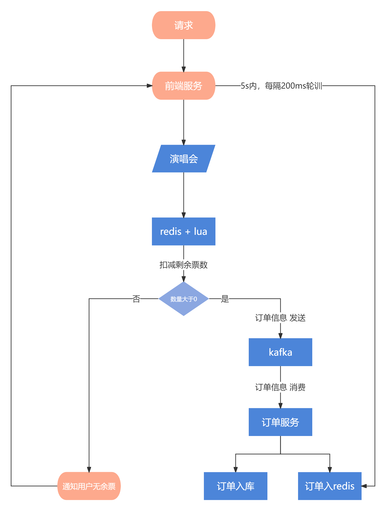

# 颠覆认知！高并发场景下订单也能异步处理？揭秘新策略

# 指定调用生成订单接口版本
由于为了更好的讲解高并发下是如何将生成订单流程进行逐步优化的，所以生成订单接口已经讲解了3个版本，而此章节要介绍v4版本，为了方便小伙伴切换调用不同的订单接口版本，所以本人在前端项目指定了调用生成订单接口版本的配置


在 **.env.development** 文件中的 **<font style="color:#080808;background-color:#ffffff;">VITE_CREATE_ORDER_VERSION</font>**<font style="color:#080808;background-color:#ffffff;"> 配置，值为1到4。对应的就是相应的调用接口的版本</font>

# 前提
此文档属于项目后期阶段，所以建议大家先学习 **详细业务讲解中 生成订单 **的业务流程后，再来学习此内容，这里把要提前学习的文档章节整理出来：


+ 生成订单v1版本：

[业务讲解-如何应对高并发下的购票压力](https://www.yuque.com/u22210564/ykdrdh/schg4ewp7pupbb88)

+ 生成订单v2版本：

[业务讲解-如何对锁进行优化更好的缓解购票压力](https://www.yuque.com/u22210564/ykdrdh/fs2pbqaxyekxg9y3)

+ 生成订单v3版本：

[业务讲解-解决高并发下购票压力的终极杀招 "无锁化!"](https://www.yuque.com/u22210564/ykdrdh/zyr9pd9ogzqyas2z)


通过上述的三个版本，分别从redis修改节目相关数据、有分布式锁的优化、将逻辑全部放在redis中执行，经过这三个版本的迭代后，其实优化的已经很全面了


但我们再仔细想想，难道这就是最终方案了吗？答案是 No！为了应对高并发场景，我们要从每一个地方来着手，思考还存在着什么瓶颈?

瓶颈其实是在调用订单服务生成订单这个步骤中，项目之间使用的是 **Feign** 的框架进行调用，Feign的底层其实是http调用，虽然可以替换连接池，比如 **feign-okhttp，**来提高性能，但是本质还是基于http的方式，性能就会受到影响

那么既然是高并发场景，在同一时间会有大量的订单请求，那么就要将生成订单的步骤变成异步，那么如何才能异步呢？这时我们就要借助mq中间件，现在我们直接开门见山，介绍整个流程到底是怎样的？

## 流程图


当用户选择演唱会后，通过前端服务，向后端服务发送进行扣减的操作


在redis通过lua判断余票扣减后数量是否充足，如果不充足，则直接通知用户无余票。如果充足，进行相应的扣除后，就可以构建订单信息直接交给mq了，然后把订单编号直接返回给前端服务。


这时，订单服务会一直消费mq的消息，收到后进行订单入库和订单入redis的操作


但这里还没有完，虽然第2步返回了订单编号，但由于异步场景，不一定真正的入库了，所以前端要有个定时任务，不断的去轮训订单是否真的存在，如果查询到了，才说明订单是真正的创建成功


由于是高并发场景，会有大量的订单请求，所以前端的定时任务也不能一直的去轮训，要设置个超时时间，在项目中**设置的是在5s内，每隔200ms去轮训一次订单是否存在**，如果存在，则停止定时任务，订单生成成功，跳转支付页面，如果超过了5s还没有轮训到，那么直接通知用户生成订单失败


到这里还有个问题，那就是前端轮训超过了5s没有查询到订单，提示了订单失败，但其实后端ma中间件消费延迟了，超过了5s才消费到，这时我们就不要再入库了，**直接把这个超过5s的订单丢弃！**

## 代码
com.damai.controller.ProgramOrderController#createV4

```java
@ApiOperation(value = "购票V4")
@PostMapping(value = "/create/v4")
public ApiResponse<String> createV4(@Valid @RequestBody ProgramOrderCreateDto programOrderCreateDto) {
    return ApiResponse.ok(programOrderLock.createV4(programOrderCreateDto));
}
```

```java
@RepeatExecuteLimit(
        name = RepeatExecuteLimitConstants.CREATE_PROGRAM_ORDER,
        keys = {"#programOrderCreateDto.userId","#programOrderCreateDto.programId"})
public String createV4(ProgramOrderCreateDto programOrderCreateDto) {
    compositeContainer.execute(CompositeCheckType.PROGRAM_ORDER_CREATE_CHECK.getValue(),programOrderCreateDto);
    return localLockCreateOrder(PROGRAM_ORDER_CREATE_V4,programOrderCreateDto,
            () -> programOrderService.createNewAsync(programOrderCreateDto));
}
```

```java
public String createNewAsync(ProgramOrderCreateDto programOrderCreateDto) {
    //通过reids+lua进行余票数量的判断，进行扣减，以及座位状态的锁定
    List<SeatVo> purchaseSeatList = createOrderOperateProgramCacheResolution(programOrderCreateDto);
    return doCreateV2(programOrderCreateDto,purchaseSeatList);
}
```

**createOrderOperateProgramCacheResolution** 中的流程是通过reids+lua进行余票数量的判断，进行扣减，以及座位状态的锁定，关于此流程的详细介绍在生成订单v3版本中详细的进行了介绍，这里就不再赘述，相应的章节如下：

[业务讲解-解决高并发下购票压力的终极杀招 "无锁化!"](https://www.yuque.com/u22210564/ykdrdh/zyr9pd9ogzqyas2z)


### 构建订单发送给消息队列
##### 构建订单
当成功扣减后，接下来就是进行购机订单信息，然后发送给kafka的操作了

```java
private String doCreateV2(ProgramOrderCreateDto programOrderCreateDto,List<SeatVo> purchaseSeatList){
    //构建主订单和购票人订单信息
    OrderCreateDto orderCreateDto = buildCreateOrderParam(programOrderCreateDto, purchaseSeatList);
    //发送给kafka
    String orderNumber = createOrderByMq(orderCreateDto,purchaseSeatList);
    //延迟队列关闭订单发送
    DelayOrderCancelDto delayOrderCancelDto = new DelayOrderCancelDto();
    delayOrderCancelDto.setOrderNumber(orderCreateDto.getOrderNumber());
    delayOrderCancelSend.sendMessage(JSON.toJSONString(delayOrderCancelDto));
    
    return orderNumber;
}
```

****

**buildCreateOrderParam** 中的流程是构建主订单和购票人订单信息，关于此步骤的详细介绍在生成订单v1版本中详细的进行了介绍，这里就不再赘述，相应的章节如下：

[业务讲解-如何应对高并发下的购票压力](https://www.yuque.com/u22210564/ykdrdh/schg4ewp7pupbb88)


#### 发送kafka
createOrderByMq 中的流程是发送kafka

```java
private String createOrderByMq(OrderCreateDto orderCreateDto,List<SeatVo> purchaseSeatList){
    CreateOrderMqDomain createOrderMqDomain = new CreateOrderMqDomain();
    CountDownLatch latch = new CountDownLatch(1);
    //发送kafka
    createOrderSend.sendMessage(JSON.toJSONString(orderCreateDto),sendResult -> {
        //发送成功
        createOrderMqDomain.orderNumber = String.valueOf(orderCreateDto.getOrderNumber());
        assert sendResult != null;
        log.info("创建订单kafka发送消息成功 topic : {}",sendResult.getRecordMetadata().topic());
        latch.countDown();
    },ex -> {
        //发送失败
        log.error("创建订单kafka发送消息失败 error",ex);
        log.error("创建订单失败 需人工处理 orderCreateDto : {}",JSON.toJSONString(orderCreateDto));
        updateProgramCacheDataResolution(orderCreateDto.getProgramId(),purchaseSeatList,OrderStatus.CANCEL);
        createOrderMqDomain.daMaiFrameException = new DaMaiFrameException(ex);
        latch.countDown();
    });
    try {
        //使用CountDownLatch等待发送结果
        latch.await();
    } catch (InterruptedException e) {
        log.error("createOrderByMq InterruptedException",e);
        throw new DaMaiFrameException(e);
    }
    //如果发送失败，则直接抛出异常
    if (Objects.nonNull(createOrderMqDomain.daMaiFrameException)) {
        throw createOrderMqDomain.daMaiFrameException;
    }
    return createOrderMqDomain.orderNumber;
}
```

在调用发送kafka的api时，使用了带有回调方式，当发送成功或者发送失败后，可以进行回调，但有一点要注意，**此回调是异步执行的！**所以我们如果想要知道发送后到底是成功还是失败，需要进行等待


那么如果才能等待呢？这里我们使用了jdk中并发包下的工具 **CountDownLatch**，俗称门栓，当发送给kafka后，会直接到 **latch.await()**，由于没有门栓没有释放，所以这里会阻塞


当发送后进行了回调后，无论是成功还是失败，都会执行  **latch.countDown()**，此方法是进行门栓的释放，当释放后，上一步的阻塞就可以被唤醒，然后继续执行流程


执行到这里后，就可以借助 CreateOrderMqDomain对象，判断到底是发送成功了还是失败了，如果存在了异常，说明确实发送失败了，则直接抛出异常。如果没有异常说明发送成功了，则把订单编号返回


然后还是通过延迟队列发送订单关闭的消息，此流程在之前文章已经详细的讲解过，这里就不再赘述


### 消费消息队列的订单消息
当订单成功发送给kafka后，就会开始执行消息的消费流程

com.damai.service.kafka.CreateOrderConsumer

```java
@Slf4j
@AllArgsConstructor
@Component
public class CreateOrderConsumer {
    
    @Autowired
    private OrderService orderService;
    
    public static Long MESSAGE_DELAY_TIME = 5000L;
    
    @KafkaListener(topics = {SPRING_INJECT_PREFIX_DISTINCTION_NAME+"-"+"${spring.kafka.topic:create_order}"})
    public void consumerOrderMessage(ConsumerRecord<String,String> consumerRecord){
        try {
            Optional.ofNullable(consumerRecord.value()).map(String::valueOf).ifPresent(value -> {
                
                OrderCreateDto orderCreateDto = JSON.parseObject(value, OrderCreateDto.class);
                
                long createOrderTimeTimestamp = orderCreateDto.getCreateOrderTime().getTime();
                
                long currentTimeTimestamp = System.currentTimeMillis();
                
                long delayTime = currentTimeTimestamp - createOrderTimeTimestamp;
                
                log.info("消费到kafka的创建订单消息 消息体: {} 延迟时间 : {} 毫秒",value,delayTime);
                //如果消费到消息时，延迟时间超过了5s，那么此订单丢弃，将库存回滚回去
                if (currentTimeTimestamp - createOrderTimeTimestamp > MESSAGE_DELAY_TIME) {
                    log.info("消费到kafka的创建订单消息延迟时间大于了 {} 毫秒 此订单消息被丢弃 订单号 : {}",
                            delayTime,orderCreateDto.getOrderNumber());
                    Map<Long, List<OrderTicketUserCreateDto>> orderTicketUserSeatList =
                            orderCreateDto.getOrderTicketUserCreateDtoList().stream().collect(Collectors.groupingBy(OrderTicketUserCreateDto::getTicketCategoryId));
                    Map<Long,List<Long>> seatMap = new HashMap<>(orderTicketUserSeatList.size());
                    orderTicketUserSeatList.forEach((k,v) -> {
                        seatMap.put(k,v.stream().map(OrderTicketUserCreateDto::getSeatId).collect(Collectors.toList()));
                    });
                    //数据恢复
                    orderService.updateProgramRelatedDataMq(orderCreateDto.getProgramId(),seatMap, OrderStatus.CANCEL);
                }else {
                    String orderNumber = orderService.createMq(orderCreateDto);
                    log.info("消费到kafka的创建订单消息 创建订单成功 订单号 : {}",orderNumber);
                }
            });
        }catch (Exception e) {
            log.error("处理消费到kafka的创建订单消息失败 error",e);
        }
    }
}
```

当消息到消息时，要判断延时时间是否大于了5s，如果大于了，此订单就要被丢弃，丢弃此订单也要将数据进行回滚，因为之前在节目服务中通过redis+lua进行了扣减余票数量，座位的状态锁定操作，所以要把这些数据要恢复回去，关于数据恢复的详细流程在之前也有介绍，这里不再赘述


如果延迟时间没有大于5s，此订单要进行入库操作

```java
@RepeatExecuteLimit(name = CREATE_PROGRAM_ORDER_MQ,keys = {"#orderCreateDto.orderNumber"})
@Transactional(rollbackFor = Exception.class)
public String createMq(OrderCreateDto orderCreateDto){
    //将订单数据入库
    String orderNumber = create(orderCreateDto);
    //将订单编号放入redis
    redisCache.set(RedisKeyBuild.createRedisKey(RedisKeyManage.ORDER_MQ,orderNumber),orderNumber,5, TimeUnit.MINUTES);
    return orderNumber;
}
```

```java
@Transactional(rollbackFor = Exception.class)
public String create(OrderCreateDto orderCreateDto) {
    LambdaQueryWrapper<Order> orderLambdaQueryWrapper = 
            Wrappers.lambdaQuery(Order.class).eq(Order::getOrderNumber, orderCreateDto.getOrderNumber());
    Order oldOrder = orderMapper.selectOne(orderLambdaQueryWrapper);
    if (Objects.nonNull(oldOrder)) {
        throw new DaMaiFrameException(BaseCode.ORDER_EXIST);
    }
    Order order = new Order();
    BeanUtil.copyProperties(orderCreateDto,order);
    order.setDistributionMode("电子票");
    order.setTakeTicketMode("请使用购票人身份证直接入场");
    List<OrderTicketUser> orderTicketUserList = new ArrayList<>();
    for (OrderTicketUserCreateDto orderTicketUserCreateDto : orderCreateDto.getOrderTicketUserCreateDtoList()) {
        OrderTicketUser orderTicketUser = new OrderTicketUser();
        BeanUtil.copyProperties(orderTicketUserCreateDto,orderTicketUser);
        orderTicketUser.setId(uidGenerator.getUid());
        orderTicketUserList.add(orderTicketUser);
    }
    orderMapper.insert(order);
    orderTicketUserService.saveBatch(orderTicketUserList);
    redisCache.incrBy(RedisKeyBuild.createRedisKey(
            RedisKeyManage.ACCOUNT_ORDER_COUNT,
                    orderCreateDto.getUserId(),
                    orderCreateDto.getProgramId()),
            orderCreateDto.getOrderTicketUserCreateDtoList().size());
    return String.valueOf(order.getOrderNumber());
}
```

到这里就可以将订单数据进行入库操作了，但这里除了添加到数据库中，还将订单编号放大了redis中，这是为什么？


其实是为了前端服务在轮训时，能更快的查询到。因为redis的性能要比数据库强太多，所以让前端服务直接去redis查询就可以了，数据也不用复杂，订单编号就可以。但是不能一直存放，要设置一个过期时间，这里设置了1分钟


### 轮训查询订单
当订单成功发送给kafka后，会直接将订单编号返回给前端，前端就要开启定时轮训去查询订单的操作，由于上面介绍了放在redis中提高查询消息，所以要写一个查询的接口

com.damai.controller.OrderController#getCache

```java
@ApiOperation(value = "查看缓存中的订单")
@PostMapping(value = "/get/cache")
public ApiResponse<String> getCache(@Valid @RequestBody OrderGetDto orderGetDto) {
    return ApiResponse.ok(orderService.getCache(orderGetDto));
}
```

```java
public String getCache(OrderGetDto orderGetDto) {
    return redisCache.get(RedisKeyBuild.createRedisKey(RedisKeyManage.ORDER_MQ,orderGetDto.getOrderNumber()),String.class);
}
```


到这里生成订单v4的版本就讲解完毕了，有的小伙伴可能会想，这种订单生成的效率确实是高，但是使用消息队列创建来进行订单入库，这样是不是不保险啊？

严格来说，这样做确实是不如同步创建订单保险，但我们要考虑实际应用的场景，能使用这种方式的一定是生成订单的并发非常高的，这时的痛点是要怎么解决高并发的tps问题，想办法提高吞吐量。至于丢订单问题，就算真的丢了又怎么样呢，订单并发量这么高，丢少量的单其实没有什么问题，依旧能保证全部售卖完毕


> 更新: 2024-07-24 10:12:36  
> 原文: <https://www.yuque.com/u22210564/ykdrdh/hg0rxf1cofc94z9x>