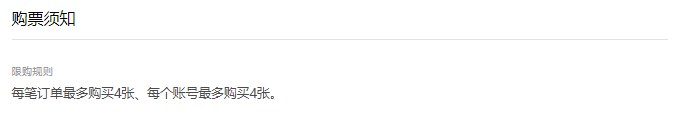
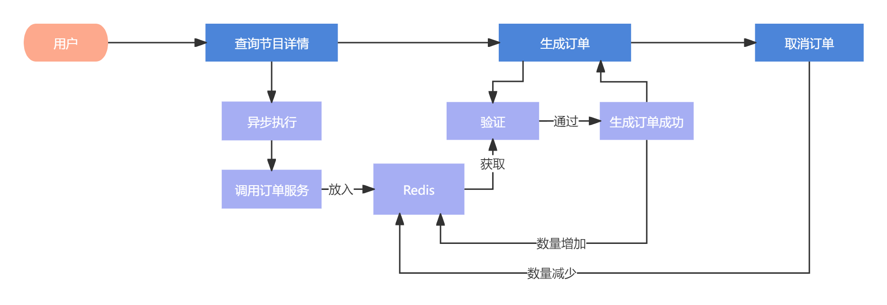

# 高并发场景下用户购票数量的优化限制方案

# 前提
此文档属于项目后期阶段，所以建议大家先学习 **详细业务讲解** 模块后，再来学习此内容

# 介绍
在节目的购票须知介绍中，会有这样的限制：



+ 每笔订单最多购买4张
+ 每个账号最多购买4张


这是两个验证条件，一个是验证每个订单的购票数量限制，一个是账号下此节目的购买限制


首先这两个限制在节目表中肯定是要存在的，节目表 d_program 中相关的字段：

```sql
`per_order_limit_purchase_count` int(11) DEFAULT '6' COMMENT '每笔订单最多购买数量',
`per_account_limit_purchase_count` int(11) DEFAULT '6' COMMENT '每个账号最多购买数量',
```

# 思考
有了限制规则后，接下来就是如何实现限制了，有的小伙伴可能回想，在用户生成订单时，直接从数据中查询数量做验证不就可以了吗

要是普通的项目确实没什么问题，但此项目是一切以 **高并发** 为前提的，从数据库中查询并发的效率又降下来了，所以还是要借助Redis来实现，并且设计的键值操作起来也要高效才可以

验证的逻辑其实不难，从Redis中查询数量，然后验证数量是否符合限制内即可，关键是要什么时机放入Redis呢？这时，要从业务特点来入手：

> + 这是一个下订单的验证功能，所以肯定是在用户生成订单的逻辑中执行的，既然用户都生成订单了，那么肯定是在查询节目详情之后的操作，而且还必须是登录状态
> + 其实登录的用户也不一定是要下单的，但是不登录的用户一定不会下单的
>


这里也就提取到了两个关键字，就是 **<font style="color:#213BC0;">查询节目详情</font>** 和 **<font style="color:#213BC0;">登录状态</font>**

也就是说 **<font style="color:#213BC0;">在查询节目详情时，用户并且登录的状态下，将这个订单的统计数量放入Redis中</font>**


放进去了，但还有个问题，很有可能用户买了这次节目后，下一次可能要很久才会再购买别的节目，这样一直放在Redis中不太合适，需要设置个过期时间才行

那么设置过期时间多长合适呢？很简单，就是 **<font style="color:#213BC0;">用户登录的时间</font>**，当用户登录时间达到限制后，就可以将此统计数量从Redis中清除了

# 流程图
当小伙伴将此章节从头到尾学习完毕后，再来看此流程图，逻辑会更加的清晰




## 将统计的用户节目订单数量放入Redis中
### 方法：
com.damai.service.ProgramService#getDetail

com.damai.service.ProgramService#getDetailV2


在查询节目详情的getDetail方法和getDetailV2方法中都执行了预先加载用户节目订单数量的操作

```java
preloadAccountOrderCount(programVo.getId());
```

```java
private void preloadAccountOrderCount(Long programId){
    //获取userId
    String userId = BaseParameterHolder.getParameter(USER_ID);
    //平台code
    String code = BaseParameterHolder.getParameter(CODE);
    if (StringUtil.isEmpty(userId) || StringUtil.isEmpty(code)) {
        return;
    }
    //获取用户登录状态
    Boolean userLogin =
            redisCache.hasKey(RedisKeyBuild.createRedisKey(RedisKeyManage.USER_LOGIN, code, userId));
    //如果不是登录状态，则直接返回
    if (!userLogin) {
        return;
    }
    //异步执行
    BusinessThreadPool.execute(() -> {
        try {
            //如果redis中不存在，则调用订单服务
            if (!redisCache.hasKey(RedisKeyBuild.createRedisKey(RedisKeyManage.ACCOUNT_ORDER_COUNT,userId,programId))) {
                AccountOrderCountDto accountOrderCountDto = new AccountOrderCountDto();
                accountOrderCountDto.setUserId(Long.parseLong(userId));
                accountOrderCountDto.setProgramId(programId);
                ApiResponse<AccountOrderCountVo> apiResponse = orderClient.accountOrderCount(accountOrderCountDto);
                if (Objects.equals(apiResponse.getCode(), BaseCode.SUCCESS.getCode())) {
                    //调用订单服务成功，则将数据放入到redis中
                    Optional.ofNullable(apiResponse.getData())
                            .ifPresent(accountOrderCountVo -> redisCache.set(
                                    RedisKeyBuild.createRedisKey(RedisKeyManage.ACCOUNT_ORDER_COUNT,userId,programId),
                                    accountOrderCountVo.getCount(), tokenExpireManager.getTokenExpireTime() + 1,
                                    TimeUnit.MINUTES));
                }else {
                    log.warn("orderClient.accountOrderCount 调用失败 apiResponse : {}",JSON.toJSONString(apiResponse));
                }
            }
        }catch (Exception e) {
            log.error("预热加载账户订单数量失败",e);
        }
    });
}
```

+ 首先获取从gateway网关传过来的userId和code
+ 异步执行更新逻辑
+ 用户必须是登录中的状态
+ 如果redis中不能存在，则调用订单服务数据
+ 然后将数据更新到缓存中

### 调用订单服务统计
```java
@ApiOperation(value = "账户下某个节目的订单数量(不提供给前端调用，只允许内部program服务调用)")
@PostMapping(value = "/account/order/count")
public ApiResponse<AccountOrderCountVo> accountOrderCount(@Valid @RequestBody AccountOrderCountDto accountOrderCountDto) {
    return ApiResponse.ok(orderService.accountOrderCount(accountOrderCountDto));
}
```

```java
public AccountOrderCountVo accountOrderCount(AccountOrderCountDto accountOrderCountDto) {
    AccountOrderCountVo accountOrderCountVo = new AccountOrderCountVo();
    //通过userId和programId查询出订单数量
    accountOrderCountVo.setCount(orderMapper.accountOrderCount(accountOrderCountDto.getUserId(),
            accountOrderCountDto.getProgramId()));
    return accountOrderCountVo;
}
```

```xml
<mapper namespace="com.damai.mapper.OrderMapper">
    <select id="accountOrderCount" resultType="java.lang.Integer">
        select
            count(*)
        from d_order
        where ( order_status = 1 or order_status = 3)
        and user_id = #{userId,jdbcType=BIGINT}
        and program_id = #{programId,jdbcType=BIGINT}
    </select>
</mapper>
```

根据userId和programId从订单表中查询出数量，注意 **订单表中的user_id和program_id这两个字段一定要建立好索引**


在订单服务中查询好结果后，就可以返回给节目服务了

### 将数据存放到缓存中
从订单服务查询好数据后，就要放入Redis中了，但要采取哪种数据结构呢？这里多和小伙伴说一句，**我们在设计方案的时候，一切都是围绕着业务角度出来，八股文是死板的，但人是活的，希望大家一定要记住这一点。**

这里我们也从业务角度来思考，首先就是这个数据的特点是什么呢？是更新和验证，那么此数据的特点就是**多读多写**的场景

那么就要求操作此数据一定要高效，既然是高效，那么就尽量避免放入集合这种复杂的数据结构，越简单越好，什么是简单的？没错  就是单纯的**key-value**，而且redis还提供了自增和自减的操作，那么决定就直接用key-value的结构

#### key的命名
既然决定了使用key-value的结构，那么key的命名要怎么设计呢？答案就是 直接占位符的方式 **d_mai_account_order_count_用户id_节目id**

这样直接就能命中key了，最为高效，而且还避免了大key的问题

这里也是使用了Redis的组件来操作，将key统一管理起来

```java
ACCOUNT_ORDER_COUNT("d_mai_account_order_count_%S_%S","账户下订单数量的key","账户下订单数量","k")
```


#### 过期时间
```java
redisCache.set(RedisKeyBuild.createRedisKey(RedisKeyManage.ACCOUNT_ORDER_COUNT,
                                programOrderCreateDto.getUserId(),
                                programOrderCreateDto.getProgramId()),
                        count, tokenExpireManager.getTokenExpireTime() + 1, TimeUnit.MINUTES);
```

过期时间使用了tokenExpireManager来管理

```java
@Data
@Component
public class TokenExpireManager {
    
    @Value("${token.expire.time:40}")
    private Long tokenExpireTime;
}
```

这里的 **tokenExpireTime** 和用户登录的保持时间相同，在放入数据时，过期时间设置了tokenExpireManager.getTokenExpireTime() + 1 也就是用户登录的保持时间再加1分钟，这么设计是多出一点余量，防止出现 用户还在登录，但统计数量的数据已经过期清除的情况


将数据放入缓存后，接下来就是验证逻辑了

## 用户生成订单时的验证逻辑
验证逻辑分为2部分 

+ 每笔订单最多购买数量
+ 每个账号最多购买数量

### 每笔订单最多购买数量
com.damai.service.composite.impl.ProgramDetailCheckHandler

```java
package com.damai.service.composite.impl;


import com.damai.dto.ProgramGetDto;
import com.damai.dto.ProgramOrderCreateDto;
import com.damai.enums.BaseCode;
import com.damai.enums.BusinessStatus;
import com.damai.exception.DaMaiFrameException;
import com.damai.service.ProgramService;
import com.damai.service.composite.AbstractProgramCheckHandler;
import com.damai.vo.ProgramVo;
import org.springframework.beans.factory.annotation.Autowired;
import org.springframework.stereotype.Component;

import java.util.List;
import java.util.Objects;
import java.util.Optional;

/**
 * @program: 极度真实还原大麦网高并发实战项目。 添加 阿星不是程序员 微信，添加时备注 大麦 来获取项目的完整资料 
 * @description: 节目检查
 * @author: 阿星不是程序员
 **/
@Component
public class ProgramDetailCheckHandler extends AbstractProgramCheckHandler {
    
    @Autowired
    private ProgramService programService;
    
    @Override
    protected void execute(final ProgramOrderCreateDto programOrderCreateDto) {
        //查询要购买的节目
        ProgramGetDto programGetDto = new ProgramGetDto();
        programGetDto.setId(programOrderCreateDto.getProgramId());
        ProgramVo programVo = programService.detail(programGetDto);
        //如果节目不允许选择座位，但传入的了手动座位，则抛出异常
        if (programVo.getPermitChooseSeat().equals(BusinessStatus.NO.getCode())) {
            if (Objects.nonNull(programOrderCreateDto.getSeatDtoList())) {
                throw new DaMaiFrameException(BaseCode.PROGRAM_NOT_ALLOW_CHOOSE_SEAT);
            }
        }
        //手动选择座位时，选择座位的数量
        Integer seatCount = Optional.ofNullable(programOrderCreateDto.getSeatDtoList()).map(List::size).orElse(0);
        //自动匹配座位时，购买票的数量
        Integer ticketCount = Optional.ofNullable(programOrderCreateDto.getTicketCount()).orElse(0);
        //只要有一个超过了规定的数量，那么就直接拒绝
        if (seatCount > programVo.getPerOrderLimitPurchaseCount() || ticketCount > programVo.getPerOrderLimitPurchaseCount()) {
            throw new DaMaiFrameException(BaseCode.PER_ORDER_PURCHASE_COUNT_OVER_LIMIT);
        }
    }
    
    @Override
    public Integer executeParentOrder() {
        return 1;
    }
    
    @Override
    public Integer executeTier() {
        return 2;
    }
    
    @Override
    public Integer executeOrder() {
        return 1;
    }
}

```

每笔订单最多购买数量 的验证逻辑并不复杂，从入参中获取 手动座位数量或者自动座位时票档数量，然后验证即可

### 每个账号最多购买数量
```java
package com.damai.service.composite.impl;

import cn.hutool.core.collection.CollectionUtil;
import com.alibaba.fastjson.JSON;
import com.damai.client.OrderClient;
import com.damai.client.UserClient;
import com.damai.common.ApiResponse;
import com.damai.core.RedisKeyManage;
import com.damai.dto.AccountOrderCountDto;
import com.damai.dto.ProgramGetDto;
import com.damai.dto.ProgramOrderCreateDto;
import com.damai.dto.TicketUserListDto;
import com.damai.enums.BaseCode;
import com.damai.exception.DaMaiFrameException;
import com.damai.redis.RedisCache;
import com.damai.redis.RedisKeyBuild;
import com.damai.service.ProgramService;
import com.damai.service.composite.AbstractProgramCheckHandler;
import com.damai.service.tool.TokenExpireManager;
import com.damai.vo.AccountOrderCountVo;
import com.damai.vo.ProgramVo;
import com.damai.vo.TicketUserVo;
import lombok.extern.slf4j.Slf4j;
import org.springframework.beans.factory.annotation.Autowired;
import org.springframework.stereotype.Component;

import java.util.List;
import java.util.Map;
import java.util.Objects;
import java.util.Optional;
import java.util.concurrent.TimeUnit;
import java.util.stream.Collectors;

/**
 * @program: 极度真实还原大麦网高并发实战项目。 添加 阿星不是程序员 微信，添加时备注 大麦 来获取项目的完整资料 
 * @description: 用户检查
 * @author: 阿星不是程序员
 **/
@Slf4j
@Component
public class ProgramUserExistCheckHandler extends AbstractProgramCheckHandler {
    
    @Autowired
    private UserClient userClient;
    
    @Autowired
    private RedisCache redisCache;
    
    @Autowired
    private OrderClient orderClient;
    
    @Autowired
    private ProgramService programService;
    
    @Autowired
    private TokenExpireManager tokenExpireManager;
    
    @Override
    protected void execute(ProgramOrderCreateDto programOrderCreateDto) {
        //验证用户和购票人信息正确性
        //先从缓存中查询
        List<TicketUserVo> ticketUserVoList = redisCache.getValueIsList(RedisKeyBuild.createRedisKey(
                RedisKeyManage.TICKET_USER_LIST, programOrderCreateDto.getUserId()), TicketUserVo.class);
        //缓存不存在，再调用用户服务查询
        if (CollectionUtil.isEmpty(ticketUserVoList)) {
            TicketUserListDto ticketUserListDto = new TicketUserListDto();
            ticketUserListDto.setUserId(programOrderCreateDto.getUserId());
            ApiResponse<List<TicketUserVo>> apiResponse = userClient.list(ticketUserListDto);
            if (Objects.equals(apiResponse.getCode(), BaseCode.SUCCESS.getCode())) {
                ticketUserVoList = apiResponse.getData();
            }else {
                log.error("user client rpc getUserAndTicketUserList select response : {}", JSON.toJSONString(apiResponse));
                throw new DaMaiFrameException(apiResponse);
            }
        }
        //如果没有购票人则抛出异常
        if (CollectionUtil.isEmpty(ticketUserVoList)) {
            throw new DaMaiFrameException(BaseCode.TICKET_USER_EMPTY);
        }
        Map<Long, TicketUserVo> ticketUserVoMap = ticketUserVoList.stream()
                .collect(Collectors.toMap(TicketUserVo::getId, ticketUserVo -> ticketUserVo, (v1, v2) -> v2));
        //如果传入的购票人在查询出的购票人中不存在，则抛出异常
        for (Long ticketUserId : programOrderCreateDto.getTicketUserIdList()) {
            if (Objects.isNull(ticketUserVoMap.get(ticketUserId))) {
                throw new DaMaiFrameException(BaseCode.TICKET_USER_EMPTY);
            }
        }
        //查询节目信息
        ProgramGetDto programGetDto = new ProgramGetDto();
        programGetDto.setId(programOrderCreateDto.getProgramId());
        ProgramVo programVo = programService.detail(programGetDto);
        if (Objects.isNull(programVo)) {
            throw new DaMaiFrameException(BaseCode.PROGRAM_NOT_EXIST);
        }
        //如果redis中存在账户节目订单数量，则直接从redis中查询
        Integer count = 0;
        if (redisCache.hasKey(RedisKeyBuild.createRedisKey(RedisKeyManage.ACCOUNT_ORDER_COUNT,
                programOrderCreateDto.getUserId(),programOrderCreateDto.getProgramId()))) {
            count = redisCache.get(RedisKeyBuild.createRedisKey(RedisKeyManage.ACCOUNT_ORDER_COUNT,
                    programOrderCreateDto.getUserId(),programOrderCreateDto.getProgramId()), Integer.class);
        }else {
            //如果redis不存在，则调用订单服务查询，然后再放入redis中
            AccountOrderCountDto accountOrderCountDto = new AccountOrderCountDto();
            accountOrderCountDto.setUserId(programOrderCreateDto.getUserId());
            accountOrderCountDto.setProgramId(programOrderCreateDto.getProgramId());
            ApiResponse<AccountOrderCountVo> apiResponse = orderClient.accountOrderCount(accountOrderCountDto);
            if (Objects.equals(apiResponse.getCode(), BaseCode.SUCCESS.getCode())) {
                count = Optional.ofNullable(apiResponse.getData()).map(AccountOrderCountVo::getCount).orElse(0);
                redisCache.set(RedisKeyBuild.createRedisKey(RedisKeyManage.ACCOUNT_ORDER_COUNT,
                                programOrderCreateDto.getUserId(),
                                programOrderCreateDto.getProgramId()),
                        count, tokenExpireManager.getTokenExpireTime() + 1, TimeUnit.MINUTES);
            }
        }
        
        Integer seatCount = Optional.ofNullable(programOrderCreateDto.getSeatDtoList()).map(List::size).orElse(0);
        
        Integer ticketCount = Optional.ofNullable(programOrderCreateDto.getTicketCount()).orElse(0);
        //如果手动选择座位，那么就累加手动座位的数量
        if (seatCount != 0) {
            count = count + seatCount;
        }else if (ticketCount != 0) {
            //如果自动选择座位，那么就累加票档的数量
            count = count + ticketCount;
        }
        //验证该用户该节目下的订单数量是否超过了限制
        if (count > programVo.getPerAccountLimitPurchaseCount()) {
            throw new DaMaiFrameException(BaseCode.PER_ACCOUNT_PURCHASE_COUNT_OVER_LIMIT);
        }
    }
    
    @Override
    public Integer executeParentOrder() {
        return 1;
    }
    
    @Override
    public Integer executeTier() {
        return 2;
    }
    
    @Override
    public Integer executeOrder() {
        return 3;
    }
}

```

+ 从redis中查询订单统计的数量，如何查询不到，则去订单服务中查询（其实通过之前的查询节目详情逻辑中已经进行了预加载的操作，到了这里redis中是存在的，但毕竟预加载是异步操作，这里也是为了避免万一）
+ 将 手动/自动 选择座位的购票数量和订单统计数量加在一起，然后验证是否大于规定的限制，**注意：这里一定要将购票数量和订单统计数量累加完后，再去验证，如果直接拿订单统计数量去验证，逻辑是不对的**


如果验证失败，则直接异常拒绝，如果验证成功，则继续执行生成订单功能

## 将统计的用户节目订单数量进行增加
验证的逻辑介绍完毕，下面就是什么时候将订单统计数量进行增加了，增加说明是订单生成成功了，那么肯定是在订单服务的生成订单逻辑中

com.damai.service.OrderService#create

```java
@Transactional(rollbackFor = Exception.class)
public String create(OrderCreateDto orderCreateDto) {
    LambdaQueryWrapper<Order> orderLambdaQueryWrapper = 
            Wrappers.lambdaQuery(Order.class).eq(Order::getOrderNumber, orderCreateDto.getOrderNumber());
    Order oldOrder = orderMapper.selectOne(orderLambdaQueryWrapper);
    if (Objects.nonNull(oldOrder)) {
        throw new DaMaiFrameException(BaseCode.ORDER_EXIST);
    }
    Order order = new Order();
    BeanUtil.copyProperties(orderCreateDto,order);
    order.setDistributionMode("电子票");
    order.setTakeTicketMode("请使用购票人身份证直接入场");
    List<OrderTicketUser> orderTicketUserList = new ArrayList<>();
    for (OrderTicketUserCreateDto orderTicketUserCreateDto : orderCreateDto.getOrderTicketUserCreateDtoList()) {
        OrderTicketUser orderTicketUser = new OrderTicketUser();
        BeanUtil.copyProperties(orderTicketUserCreateDto,orderTicketUser);
        orderTicketUser.setId(uidGenerator.getUid());
        orderTicketUserList.add(orderTicketUser);
    }
    orderMapper.insert(order);
    orderTicketUserService.saveBatch(orderTicketUserList);
    //对用户该节目下的订单数量进行增加操作
    redisCache.incrBy(RedisKeyBuild.createRedisKey(
                RedisKeyManage.ACCOUNT_ORDER_COUNT,
                        orderCreateDto.getUserId(),
                        orderCreateDto.getProgramId()),
                orderCreateDto.getOrderTicketUserCreateDtoList().size());
    return String.valueOf(order.getOrderNumber());
}
```

## 将统计的用户节目订单数量进行减少
有生成订单增加操作，自然就有取消订单减少操作


手动取消订单，延迟队列取消订单，都会执行此方法

com.damai.service.OrderService#cancel

```java
/**
 * 订单取消，以订单编号加锁
 * */
@RepeatExecuteLimit(name = CANCEL_PROGRAM_ORDER,keys = {"#orderCancelDto.orderNumber"})
@ServiceLock(name = UPDATE_ORDER_STATUS_LOCK,keys = {"#orderCancelDto.orderNumber"})
@Transactional(rollbackFor = Exception.class)
public boolean cancel(OrderCancelDto orderCancelDto){
    updateOrderRelatedData(orderCancelDto.getOrderNumber(),OrderStatus.CANCEL);
    return true;
}
```

```java
/**
 * 更新订单和购票人订单状态以及操作缓存数据
 * */
@Transactional(rollbackFor = Exception.class)
public void updateOrderRelatedData(Long orderNumber,OrderStatus orderStatus){
    if (!(Objects.equals(orderStatus.getCode(), OrderStatus.CANCEL.getCode()) ||
            Objects.equals(orderStatus.getCode(), OrderStatus.PAY.getCode()))) {
        throw new DaMaiFrameException(BaseCode.OPERATE_ORDER_STATUS_NOT_PERMIT);
    }
    //更新订单状态
    LambdaQueryWrapper<Order> orderLambdaQueryWrapper =
            Wrappers.lambdaQuery(Order.class).eq(Order::getOrderNumber, orderNumber);
    Order order = orderMapper.selectOne(orderLambdaQueryWrapper);
    checkOrderStatus(order);
    Order updateOrder = new Order();
    updateOrder.setId(order.getId());
    updateOrder.setOrderStatus(orderStatus.getCode());
    //更新购票人订单状态
    OrderTicketUser updateOrderTicketUser = new OrderTicketUser();
    updateOrderTicketUser.setOrderStatus(orderStatus.getCode());
    if (Objects.equals(orderStatus.getCode(), OrderStatus.PAY.getCode())) {
        updateOrder.setPayOrderTime(DateUtils.now());
        updateOrderTicketUser.setPayOrderTime(DateUtils.now());
    } else if (Objects.equals(orderStatus.getCode(), OrderStatus.CANCEL.getCode())) {
        updateOrder.setCancelOrderTime(DateUtils.now());
        updateOrderTicketUser.setCancelOrderTime(DateUtils.now());
    }
    //执行更新订单状态
    LambdaUpdateWrapper<Order> orderLambdaUpdateWrapper =
            Wrappers.lambdaUpdate(Order.class).eq(Order::getOrderNumber, order.getOrderNumber());
    int updateOrderResult = orderMapper.update(updateOrder,orderLambdaUpdateWrapper);
    
    LambdaUpdateWrapper<OrderTicketUser> orderTicketUserLambdaUpdateWrapper =
            Wrappers.lambdaUpdate(OrderTicketUser.class).eq(OrderTicketUser::getOrderNumber, order.getOrderNumber());
    int updateTicketUserOrderResult =
            orderTicketUserMapper.update(updateOrderTicketUser,orderTicketUserLambdaUpdateWrapper);
    if (updateOrderResult <= 0 || updateTicketUserOrderResult <= 0) {
        throw new DaMaiFrameException(BaseCode.ORDER_CANAL_ERROR);
    }
    LambdaQueryWrapper<OrderTicketUser> orderTicketUserLambdaQueryWrapper =
            Wrappers.lambdaQuery(OrderTicketUser.class).eq(OrderTicketUser::getOrderNumber, order.getOrderNumber());
    List<OrderTicketUser> orderTicketUserList = orderTicketUserMapper.selectList(orderTicketUserLambdaQueryWrapper);
    if (CollectionUtil.isEmpty(orderTicketUserList)) {
        throw new DaMaiFrameException(BaseCode.TICKET_USER_ORDER_NOT_EXIST);
    }
    //如果是订单取消操作，则对用户该节目下的订单数量进行增加减少
    if (Objects.equals(orderStatus.getCode(), OrderStatus.CANCEL.getCode())) {
        redisCache.incrBy(RedisKeyBuild.createRedisKey(
                RedisKeyManage.ACCOUNT_ORDER_COUNT,order.getUserId(),order.getProgramId()),-updateTicketUserOrderResult);
    }
    Long programId = order.getProgramId();
    Map<Long, List<OrderTicketUser>> orderTicketUserSeatList = 
            orderTicketUserList.stream().collect(Collectors.groupingBy(OrderTicketUser::getTicketCategoryId));
    Map<Long,List<Long>> seatMap = new HashMap<>(orderTicketUserSeatList.size());
    orderTicketUserSeatList.forEach((k,v) -> {
        seatMap.put(k,v.stream().map(OrderTicketUser::getSeatId).collect(Collectors.toList()));
    });
    
    updateProgramRelatedDataResolution(programId,seatMap,orderStatus);
}
```


> 更新: 2025-09-01 09:58:35  
> 原文: <https://www.yuque.com/u22210564/ykdrdh/ldg8waesngqo46tr>