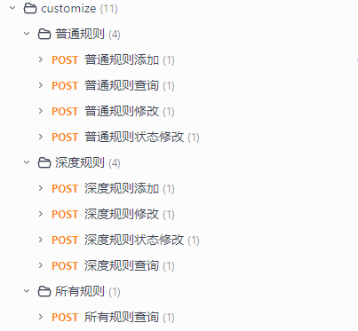
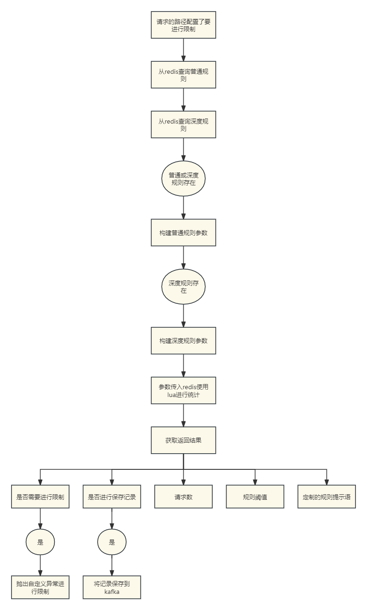
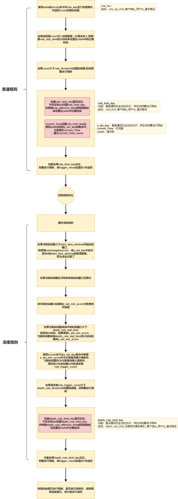

# 业务讲解-API接口定制化防刷策略实现

# 业务场景


对于高并发的项目或者热度很高的程序又或者数据重要的项目，比如说淘宝，京东的电商、12306的售票、医疗号源的挂号等。对于这些程序不可避免存在一个问题，就是 **防刷**

**防刷** 指的是采取一系列措施来防止恶意用户或自动化脚本对网站或应用程序的接口（API）进行频繁的访问或请求，这种行为通常被称为"刷请求"。防刷的目的是保护网站或应用的正常运营，防止资源被滥用，确保服务的可用性和安全性，以及保护用户数据不被非法获取。


### 为什么要防刷


1. **保护服务器资源**：频繁的请求可能会消耗大量的服务器资源，包括带宽、CPU、内存等，导致正常用户的请求处理变慢，甚至服务器崩溃。
2. **防止数据泄露**：恶意用户可能通过刷接口的方式试图获取敏感信息，如用户数据、系统信息等。
3. **避免业务损失**：特别是电商、票务等领域，通过刷接口可以进行不公平的商品抢购、票务抢订等，损害正常用户的权益，对企业造成经济损失。
4. **防止服务被滥用**：一些免费服务或API有使用限额，恶意刷取可能导致服务快速达到限额，使得正常用户无法使用。
5. **维护系统安全**：频繁的请求可能是对系统进行探测，寻找系统的安全漏洞，为后续的攻击做准备。


### 中间件提供的熔断保护
你可能会想，微服务中不是有了类似保护机制吗？例如Hystrix和Sentinel，这是新手很爱模糊的地方，我也面试过不少人，很多就栽在了这个地方。其实这两个根本不是一回事


Hystrix和Sentinel的重点是对整个服务架构的熔断保护，是从架构层面考虑的，可以说是在业务防刷后的最后一层保证，可以理解成电路中的保险丝。而所谓的熔断是指


> **当链路中的某个微服务不可用或者响应的时间太长时，会进行服务的降级，进而熔断该节点微服务的调用，快速返回错误的响应信息，当检测到该节点微服务调用响应正常后，恢复调用链路**
>


而在业务防刷中，灵活度就要高了，比如说在哪个时间段内，在多长时间内，请求数达到了指定的限制，限制执行多长时间等。而且还希望这些配置能灵活的修改，并且修改后能立即生效。


针对这些特点，而在大麦网中具备了有业务防刷的功能，所以本文来详细的介绍


页面如下：


# Api接口定制化防刷的实现


## 思考过程


+ 这是一个统计流量的操作，如果放在业务服务统计的话，那么就会占据其他服务或者本服务下其他接口的流量请求，当达到一定的数量后就会直接触发熔断，所以放在业务服务是不可取的。
+ 既然要统计流量就说明对性能是有要求的，不能和数据库频繁的操作，也不能进行多次IO请求交互，这样会极大的影响性能。
+ 这又是一个统计计算，如果一个服务有多个节点那么就不能在单机内存进行统计计算。
+ 通过以上分析，最终决定在Gateway网关层用**Redis**并结合**Lua**语言来实现 
    - Gateway是网关层，是请求的开始端，如果超过规则的请求直接被拒绝，就不会继续执行了
    - Redis的性能非常的高，就算是在集群环境下在主从同步过程发生了数据丢失，顶多就是计算不是百分百的准确，这种情况是允许的
    - 使用Lua语言来保证原子性，并且只和Redis发生一次交互即可


## 具体实现


+ 建立两种数据库表，普通限制，深度限制，添加相应的配置后存在数据库中，每次和数据库的操作后更新到**Redis**中，采用**Hash**结构
+ 在配置中添加要被防刷限制的路径
+ 请求发起后，在Gateway中查询Redis是否存在限制规则
+ 存在限制的话根据Lua脚本进行规则的检查，包括普通规则和深度规则
+ 将超过异常的请求通过kafka发送防刷记录
+ 业务服务消费此kafka的topic来存放数据
+ 并利用幂等组件和主键插入来保证kafka消费的幂等性


## 核心代码部分
### 规则的添加和修改


在`customize`模块中，详情的接口调用查看swagger  



### Gateway的规则检查
配置要进行防刷的api

```yaml
api:
  limit:
    paths: /**/customize/test/test
```


**com.damai.service.ApiRestrictService#apiRestrict**


```java
public void apiRestrict(String id, String url, ServerHttpRequest request) {
    //请求的路径在配置范围内的话
    if (checkApiRestrict(url)) {
        long triggerResult = 0L;
        long triggerCallStat = 0L;
        long apiCount;
        long threshold;
        long messageIndex;
        String message = "";
        //获得请求客户端地址
        String ip = getIpAddress(request);
        
        StringBuilder stringBuilder = new StringBuilder(ip);
        if (StringUtil.isNotEmpty(id)) {
            stringBuilder.append("_").append(id);
        }
        String commonKey = stringBuilder.append("_").append(url).toString();
        try {
            List<DepthRuleVo> depthRuleVoList = new ArrayList<>();
            //查询规则 Hash结构 
            //普通规则
            RuleVo ruleVo = redisCache.getForHash(RedisKeyBuild.createRedisKey(RedisKeyManage.ALL_RULE_HASH), RedisKeyBuild.createRedisKey(RedisKeyManage.RULE).getRelKey(),RuleVo.class);
            //深度规则
            String depthRuleStr = redisCache.getForHash(RedisKeyBuild.createRedisKey(RedisKeyManage.ALL_RULE_HASH), RedisKeyBuild.createRedisKey(RedisKeyManage.DEPTH_RULE).getRelKey(),String.class);
            if (StringUtil.isNotEmpty(depthRuleStr)) {
                depthRuleVoList = JSON.parseArray(depthRuleStr,DepthRuleVo.class);
            }
            //规则类型 0：不存在 1：普通规则 2：深度规则
            int apiRuleType = ApiRuleType.NO_RULE.getCode();
            if (Optional.ofNullable(ruleVo).isPresent()) {
                apiRuleType = ApiRuleType.RULE.getCode();
                message = ruleVo.getMessage();
            }
            if (Optional.ofNullable(ruleVo).isPresent() && CollectionUtil.isNotEmpty(depthRuleVoList)) {
                apiRuleType = ApiRuleType.DEPTH_RULE.getCode();
            }
            if (apiRuleType == ApiRuleType.RULE.getCode() || apiRuleType == ApiRuleType.DEPTH_RULE.getCode()) {
                
                assert ruleVo != null;
                //普通规则构建
                JSONObject parameter = getRuleParameter(apiRuleType,commonKey,ruleVo);
                
                if (apiRuleType == ApiRuleType.DEPTH_RULE.getCode()) {
                    //深度规则构建
                    parameter = getDepthRuleParameter(parameter,commonKey,depthRuleVoList);
                }
                ApiRestrictData apiRestrictData = apiRestrictCacheOperate
                        .apiRuleOperate(Collections.singletonList(JSON.toJSONString(parameter)), new Object[]{});
                //是否需要进行限制
                triggerResult = apiRestrictData.getTriggerResult();
                //是否进行保存记录
                triggerCallStat = apiRestrictData.getTriggerCallStat();
                //请求数
                apiCount = apiRestrictData.getApiCount();
                //规则阈值
                threshold = apiRestrictData.getThreshold();
                //定制的规则提示语
                messageIndex = apiRestrictData.getMessageIndex();
                if (messageIndex != -1) {
                    message = Optional.ofNullable(depthRuleVoList.get((int)messageIndex))
                            .map(DepthRuleVo::getMessage)
                            .filter(StringUtil::isNotEmpty)
                            .orElse(message);
                }
                log.info("api rule [key : {}], [triggerResult : {}], [triggerCallStat : {}], [apiCount : {}], [threshold : {}]",commonKey,triggerResult,triggerCallStat,apiCount,threshold);
            }
        }catch (Exception e) {
            log.error("redis Lua eror", e);
        }
        if (triggerResult == 1) {
            if (triggerCallStat == ApiRuleType.RULE.getCode() || triggerCallStat == ApiRuleType.DEPTH_RULE.getCode()) {
                saveApiData(request, url, (int)triggerCallStat);
            }
            String defaultMessage = BaseCode.API_RULE_TRIGGER.getMsg();
            if (StringUtil.isNotEmpty(message)) {
                defaultMessage = message;
            }
            throw new DaMaiFrameException(BaseCode.API_RULE_TRIGGER.getCode(),defaultMessage);
        }
    }
}
```


```java
/**
 * 普通规则构建
 * */
public JSONObject getRuleParameter(int apiRuleType, String commonKey, RuleVo ruleVo){
    JSONObject parameter = new JSONObject();
    
    parameter.put("apiRuleType",apiRuleType);
    //普通规则中要进行统计请求数
    String ruleKey = "rule_api_limit" + "_" + commonKey;
    parameter.put("ruleKey",ruleKey);
    //普通规则中进行统计的时间
    parameter.put("statTime",String.valueOf(Objects.equals(ruleVo.getStatTimeType(), RuleTimeUnit.SECOND.getCode()) ? ruleVo.getStatTime() : ruleVo.getStatTime() * 60));
    //普通规则中进行统计的阈值
    parameter.put("threshold",ruleVo.getThreshold());
    //普通规则超过阈值后限制的时间
    parameter.put("effectiveTime",String.valueOf(Objects.equals(ruleVo.getEffectiveTimeType(), RuleTimeUnit.SECOND.getCode()) ? ruleVo.getEffectiveTime() : ruleVo.getEffectiveTime() * 60));
    //实现普通规则执行限制
    parameter.put("ruleLimitKey", RedisKeyBuild.createRedisKey(RedisKeyManage.RULE_LIMIT,commonKey).getRelKey());
    //进行统计超过普通规则的数量sorted set结构
    parameter.put("zSetRuleStatKey", RedisKeyBuild.createRedisKey(RedisKeyManage.Z_SET_RULE_STAT,commonKey).getRelKey());
    
    return parameter;
}
```


```java
/**
 * 深度规则构建
 * */
public JSONObject getDepthRuleParameter(JSONObject parameter,String commonKey,List<DepthRuleVo> depthRuleVoList){
    //深度规则构建
    //将限制时间窗口进行排序
    depthRuleVoList = sortStartTimeWindow(depthRuleVoList);
    //深度规则的个数
    parameter.put("depthRuleSize",String.valueOf(depthRuleVoList.size()));
    //当前时间戳
    parameter.put("currentTime",System.currentTimeMillis());
    
    List<JSONObject> depthRules = new ArrayList<>();
    for (int i = 0; i < depthRuleVoList.size(); i++) {
        JSONObject depthRule = new JSONObject();
        DepthRuleVo depthRuleVo = depthRuleVoList.get(i);
        //深度规则中进行统计的时间
        depthRule.put("statTime",Objects.equals(depthRuleVo.getStatTimeType(), RuleTimeUnit.SECOND.getCode()) ? depthRuleVo.getStatTime() : depthRuleVo.getStatTime() * 60);
        //深度规则中进行统计的阈值
        depthRule.put("threshold",depthRuleVo.getThreshold());
        //深度规则超过阈值后限制的时间
        depthRule.put("effectiveTime",String.valueOf(Objects.equals(depthRuleVo.getEffectiveTimeType(), RuleTimeUnit.SECOND.getCode()) ? depthRuleVo.getEffectiveTime() : depthRuleVo.getEffectiveTime() * 60));
        //实现深度规则执行限制
        depthRule.put("depthRuleLimit", RedisKeyBuild.createRedisKey(RedisKeyManage.DEPTH_RULE_LIMIT,i,commonKey).getRelKey());
        //深度规则限制开始时间窗口
        depthRule.put("startTimeWindowTimestamp",depthRuleVo.getStartTimeWindowTimestamp());
        //深度规则限制结束时间窗口
        depthRule.put("endTimeWindowTimestamp",depthRuleVo.getEndTimeWindowTimestamp());
        
        depthRules.add(depthRule);
    }
    
    parameter.put("depthRules",depthRules);
    
    return parameter;
}
```


**Lua**


```lua
-- 是否需要进行限制
local trigger_result = 0
-- 是否进行保存记录
local trigger_call_Stat = 0
-- 请求数
local api_count = 0
-- 规则阈值
local threshold = 0
-- 规则对象
local apiRule = cjson.decode(KEYS[1])
-- 规则类型
local api_rule_type = apiRule.apiRuleType
-- 普通规则中要进行统计请求数
local rule_key = apiRule.ruleKey
-- 普通规则中进行统计的时间
local rule_stat_time = apiRule.statTime
-- 普通规则中进行统计的阈值
local rule_threshold = apiRule.threshold
-- 普通规则超过阈值后限制的时间
local rule_effective_time = apiRule.effectiveTime
-- 实现普通规则执行限制
local rule_limit_key = apiRule.ruleLimitKey
-- 进行统计超过普通规则的数量sorted set结构  score当前时间 member唯一值(当前时间_请求数)
local z_set_key = apiRule.zSetRuleStatKey
-- 当前时间
local current_Time = apiRule.currentTime
-- 定制的规则提示语索引
local message_index = -1
-- 请求数
local count = tonumber(redis.call('incrby', rule_key, 1))
-- 第一次设置普通规则的统计时间
if (count == 1) then
    redis.call('expire', rule_key, rule_stat_time)
end
-- 如果在普通规则的统计时间下请求数超过了阈值
if ((count - rule_threshold) >= 0) then
    -- 如果普通规则之前没有生效限制过或者限制已经失效
    if (redis.call('exists', rule_limit_key) == 0) then
        redis.call('set', rule_limit_key, rule_limit_key)
        redis.call('expire', rule_limit_key, rule_effective_time)
        -- 进行这一轮的初次限制要保存记录
        trigger_call_Stat = 1
        -- 每一轮发生初次限制保存到sorted set
        local z_set_member = current_Time .. "_" .. tostring(count)
        redis.call('zadd',z_set_key,current_Time,z_set_member)
    end
    -- 发生了限制
    trigger_result = 1
end
-- 普通规则还在生效限制中
if (redis.call('exists', rule_limit_key) == 1) then
    -- 发生了限制
    trigger_result = 1
end
api_count = count
threshold = rule_threshold
-- 如果深度规则存在的话
if (api_rule_type == 2) then
    -- 获取所有的深度规则
    local depthRules = apiRule.depthRules
    -- 循环深度规则
    for index,depth_rule in ipairs(depthRules)  do
        -- 深度规则的开始时间范围
        local start_time_window = depth_rule.startTimeWindowTimestamp
        -- 深度规则的结束时间范围
        local end_time_window = depth_rule.endTimeWindowTimestamp
        -- 深度规则中进行统计的时间
        local depth_rule_stat_time = depth_rule.statTime
        -- 深度规则中进行统计的阈值
        local depth_rule_threshold = depth_rule.threshold
        -- 深度规则超过阈值后限制的时间
        local depth_rule_effective_time = depth_rule.effectiveTime
        -- 实现深度规则执行限制
        local depth_rule_limit_key = depth_rule.depthRuleLimit

        threshold = depth_rule_threshold
        -- 将当前时间之前的时间范围的普通规则统计清除掉，因为这些过期了
        if (current_Time > start_time_window) then
            redis.call('zremrangebyscore',z_set_key,0,start_time_window - 1000)
        end
        -- 如果当前时间在设置的时间范围内
        if (current_Time >= start_time_window and current_Time <= end_time_window) then
            -- 开始时间范围
            local z_set_min_score = start_time_window;
            -- 结束时间范围
            local z_set_max_score = current_Time;
            -- 此操作是更新开始时间范围
            if ((current_Time - start_time_window) > depth_rule_stat_time * 1000) then
                z_set_min_score = current_Time - (depth_rule_stat_time * 1000)
            end
            -- 根据时间范围获得普通规则的限制数量
            local rule_trigger_count = tonumber(redis.call('zcount',z_set_key,z_set_min_score,z_set_max_score))
            api_count = rule_trigger_count
            -- 如果统计的数量超过限制的话
            if ((rule_trigger_count - depth_rule_threshold) >= 0) then
                -- 如果深度规则之前没有生效限制过或者限制已经失效
                if (redis.call('exists', depth_rule_limit_key) == 0) then
                    redis.call('set', depth_rule_limit_key, depth_rule_limit_key)
                    redis.call('expire', depth_rule_limit_key, depth_rule_effective_time)
                    -- 发生了限制
                    trigger_result = 1
                    -- 进行这一轮的初次限制要保存记录
                    trigger_call_Stat = 2
                    -- 提示信息的索引值
                    message_index = index
                    return string.format('{"triggerResult": %d, "triggerCallStat": %d, "apiCount": %d, "threshold": %d, 		                     "messageIndex": %d}',trigger_result,trigger_call_Stat,api_count,threshold,message_index)
                end
            end
            -- 普通规则还在生效限制中
            if (redis.call('exists', depth_rule_limit_key) == 1) then
                -- 发生了限制
                trigger_result = 1
                -- 提示信息的索引值
                message_index = index
                return string.format('{"triggerResult": %d, "triggerCallStat": %d, "apiCount": %d, "threshold": %d,                             "messageIndex": %d}',trigger_result,trigger_call_Stat,api_count,threshold,message_index)
            end
        end
    end
end
return string.format('{"triggerResult": %d, "triggerCallStat": %d, "apiCount": %d, "threshold": %d, "messageIndex": %d}'
,trigger_result,trigger_call_Stat,api_count,threshold,message_index)
```


### 规则参数查询和构建流程图





### lua脚本执行流程图





### 此业务亮点


+ 使用Redis进行操作，使用了hash、set、expire、sorted set多种结构
+ 使用Lua脚本
+ 复杂的规则限制逻辑，需要考虑两种规则的交互，以及可以根据时间窗口范围进行限制
+ 使用kafka中间件进行异步解耦化


> 更新: 2024-10-29 17:05:43  
> 原文: <https://www.yuque.com/u22210564/ykdrdh/tv9a5gxrf3pqaz24>