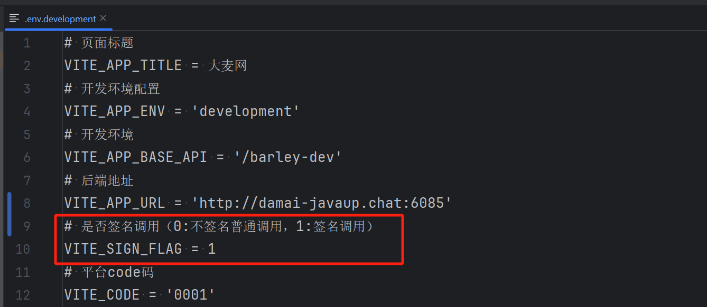

# 业务讲解-参数加解密过程

## 概述


大麦的Gateway业务网关，主要承载了对接口的参数解密和验证签名、将解密后的请求体传递给业务服务、指定接口进行规则限制防刷、将返回的数据进行加密等操作，项目中都是真实项目中使用的，小伙伴们不仅可以学习，而且如果所在的公司有这方面的需求，可以参考进行使用


## 格式


+  在传递参数时，统一使用post的方式，参数使用json请求体传递 
+  如果不跳过参数验证，正常使用签名和加密的功能时，必须有`code`、`businessBody`、`sign` 这三个必要参数 


## 作用


+ `code` 基础参数，关于基础参数是如何配置的请查看 [业务讲解-参数加解密配置 ](https://www.yuque.com/u22210564/ykdrdh/iscvnmgpah5usqos)这一章节
+ `businessBody` 业务参数
+ `sign` 签名，关于如何进行签名下文有详细的讲解


## 参数加密验证功能


#### 跳过参数验证


如果请求头添加`no_verify = true`，则跳过参数的验证，直接传递正常的业务参数即可


```json
{
    "id": "111"
}
```


#### 版本1 验证签名(默认)


前端将业务参数和基础参数拼接用`RSA`的私钥生成签名，Gateway网关根据相应`code`参数查询出对应的公钥信息进行签名验证


```json
{
    "code": "1234",
    "businessBody": "{\"id\":\"1111\",\"sleepTime\":10}",
    "sign": "JdTXuqMTCMGmM5zs7LoHwcEwFS5HQo/9bttao0GAAdoI/MpUpg7Eb5RN3Tmm4QT6FZVdJGVLqK48QKBAhJUlrBA8D14SJj7teMtPGboSxJ475+rGvgdycQbGKf7o40YBXwJGJeOG6xNJz913+Z8Zf/R9Sbd9gjF1QBXvSZy5i/sTNxhDOGydhLetInUcC/iMsqzoCk4e9MKltUSf4rQV4LQ0E171n93DtKLI4RZ9gPRzTBT7tPkpuPZ2GoJ5pJTQiNcjiDDYtHBPBeemrXtqumDblIJJuOBrcQk+1sYicQFy9ZQY1PAMoHjCTCPKNxUAULsodpXEj1TYJUl+q2jTwg=="
}
```


#### 版本2 参数加密并签名


+ 请求头添加`encrypt = v2`，则将参数加密等级升级
+ 前端将业务参数通过`RSA`公钥加密，将未加密的业务参数和基础参数进行拼接用`RSA`私钥生成签名
+ Gateway网关将加密的业务参数用`RSA`私钥解密，然后将解密后的业务参数和基础参数进行拼接用`RSA`公钥进行验签
+ 接口返回时，Gateway用`RSA`的公钥将返回的参数进行加密，前端要进行解密


**注意**


业务参数加解密和签名验签的`RSA`分别是两套公私钥


```json
{
    "code": "1234",
    "businessBody": "SWwqEci1ci3Dog/iIKXirjirt+Va01RO2zlcBjPkpFBx1y2LPbKdgfLlGc+QnCgTXjbp/KkqFdqCcFBTJstdhy7+RNzxESBXKuuMlUwyXIPpNyIgLmSyu7Saoy2VbHw1Z2pXYTNdf7u3CL4MRuVjLszN6OY4qQozQAlp87sek2QLvh+wyi0csbXqJgvDDlh2LfpcFe7ycSxMDcTkYVOAqbHtXXzLI/I3W1KHcErHCZVuc+f6tk7Y4iBnR6MeFeqvOeziSBZVUBAQHlKr9Bm6fY1xHYx5NLavS8q/S4USwenntlG37J6Tb09D0+KahtAcguxLqTikbVxrcWpYv/tWRw==",
    "sign": "EfxdpQB8GGWbQFNA1hBTnHhf4nWJerIsK+6NcuIptuzzooWgL+sFmGu9J9kG3hptiWRqkhW6DPDDRmfmUblvMuX9tC0jHoTnSeZBDkFi7+IJ+fdPg5iyi7+XHBCcR7pVilJgvjHXsDMjN3oaF1k4I56L5fYCfvcgSi6VQoGt+dB0kd4zWHWEGOu1c/TrowYCFaHElVq1fXPEd7dglbF2g4qHE8yrfELt6NXfO0K+P9elqB8NGnRcBQeM0d37+nQrCxOY5Mml2AKANs0UkLxZfrbqc95MjCWvDdRiQGGJnCIL1LZtMTsopgB2nGo8yMoqFVn4eE6G6wSFu1z1e5q4nQ=="
}
```


## Gateway网关的处理流程


+  关于请求的参数如何解密和验签可查看此文档  


[业务讲解-Gateway处理请求的流程](https://www.yuque.com/u22210564/ykdrdh/psovmckslgg6s2sy)

## 使用java模拟前端的签名和加密


`**damai-common**`**模块 com.damai.util.RsaSignTool**


```java
/**
 * rsa签名私钥
 * */
public static String signPrivateKey = "MIIEvAIBADANBgkqhkiG9w0BAQEFAASCBKYwggSiAgEAAoIBAQCht3FKchtYAS4Gcjb2bEOfAXA+vcVSZjTV3JaS7sqOSFbDGDV2o1nLuPktdr5ByjUtA+SOBJuzEKm3qWueVq8jGAl9FiLie0TiWnHrre95zPQRe1PE8LvqQnk81mFAYv3KZWyTFb6Ky4O6CWnr2zGI1QM5JNA+Jm/AhwDxWXjN1yVzNhWi3fdBPl3WajI/hI+WWwqs9Vm3GI0e3IfN1cDxyecjoWbJKIZ1quzRm+FcifcjQaDF72+QHtnik1BaNKzbmvVmJGypvi9X450wPnUJNvhOl/t0CUfbdSeihseo2WOf+Z9p5NQUuRdKFgISRT6yxd9746liqXkpxm4NMIahAgMBAAECggEAFtoiUz/Op1/7TgPjymzAHX8JioQslxlETBhQ2tCNpQ+J2yXXoD0zGju4UnleJ1PYsdTD/mGeUu5+3So+v/BF7XKfHKL9KP38XPQk9wXsOk0BDFteGg1esJrWIQe2VG/opyov7pT7CQf7RFXCNwcRd+GKBBA0sSOjVRR+yJw5GvUbm6Ytf/EkCwLNXrsEFhlcXyE5N29TARrHau9JA1DkjX10O1f3Q80p4q4IaNXm7NIWJ8M4TAhN8KTYyTNZruXD5vHlv/NPTdCaCIAS863Mg46qkXXJ3wrjsCKy48GWAKWQiiMHf9p7F9cUPLQZdjuyxmfrJwWeiLzoFo63tDbpcQKBgQDQHtcKnYIB6vTkf8FOXl2wwd0INkZjr2YVJG8MJzB4HdRwuyYYHGbzR4Xk9ag+kg5En3nykA+cMxn+54eQmQo1aMX8En/bla6UJ8AvBVLP068JzR9KdQ49AQqq/74aLEFr0lL8ectXRCJz1pohZ8Gs7DtuMio/4AXJqL9gisolVQKBgQDG66qPH2GK6Hdn4ZTv5qPw7CpogKzZGpVKg4Q8Bztxnj+p22MoiMDdZ89O0mgEytecPSRro7ziyhp1zoJzULru9NdxTPqx1OZW9nj46elYfZAqbo3NJByNjDQrBZDtxwUfz4rkpegliZ/ljRJjWh/Oa8UyGSJwfnsVRaDnx2EcHQKBgFFKGnhc+TDCkxDFDb4Mgc/OiQTyHiBFnDvZ1T4L+JSSIi4+Cy0Tuup/Hz9E7Ig0CDqph7pEprQ+CYNU79B81k3yNJK2rxYXqu7Xb+ttyuC+L/pGEljEy+DsDTypU5lpe8wfhKZ09AWL6WERi3ZMzos6YiQyl+oHGHuh285bp4VZAoGAF3WZotFvnoM1+dFX0EciFHq1sadjOyNwcd46zR2JPCgOmAiglBo0rKfeggw8ajxF2042ql8gGpr9LeGR7umZci777YfHlQtnst/Uen6Tn3UHeImbPZNBrsvXJy+73N740ryWQ8rxKuQlMFxHy+HIGH8LPZJLRnsUJvkUNeGEqV0CgYAr9K/w9ruTVKs5/Q2dGMhZLVadsKMo6b4rMzuO5/iH94q2XgzHKw+to4zUJUyCiwxW9w2rM4xSZu20zfBl4Lt4VNllHbLAWU0onPa24ZBiHv9IZKBtzPpyYdi6Y5/D6DfNNTQO6B/XvyzCikhtBFlZSVj23rLqhFD9N/gWP/kMaA==";
/**
 * rsa签名公钥
 * */
public static String signPublicKey = "MIIBIjANBgkqhkiG9w0BAQEFAAOCAQ8AMIIBCgKCAQEAobdxSnIbWAEuBnI29mxDnwFwPr3FUmY01dyWku7KjkhWwxg1dqNZy7j5LXa+Qco1LQPkjgSbsxCpt6lrnlavIxgJfRYi4ntE4lpx663vecz0EXtTxPC76kJ5PNZhQGL9ymVskxW+isuDuglp69sxiNUDOSTQPiZvwIcA8Vl4zdclczYVot33QT5d1moyP4SPllsKrPVZtxiNHtyHzdXA8cnnI6FmySiGdars0ZvhXIn3I0Ggxe9vkB7Z4pNQWjSs25r1ZiRsqb4vV+OdMD51CTb4Tpf7dAlH23UnoobHqNljn/mfaeTUFLkXShYCEkU+ssXfe+OpYql5KcZuDTCGoQIDAQAB";

/**
 * rsa数据加密私钥
 * */
public static String dataPublicKey = "MIIBIjANBgkqhkiG9w0BAQEFAAOCAQ8AMIIBCgKCAQEAirLDI4SPxLXAjk+CMJWrdREnQjJJQgEd7RAw+ZCPZKBFfkoPa5YjcYQzqtc4RPOszBZhPmGr732WLA0O2U0WFnPG6vva9x7pYQot4u5IoncRl7kBb89d1XdR5DZxKovQyDM91CkLikq8h0sBVTkfX2Jz34LmYd8TPQ4BSHUDE5h+f42WkUYG9PCaXvPg+yv4+1AwJeXI/wW181h1JQ5cmogFXIHEFOxS/wwtnoijwmRv/3nKhdyYZbpC2V7F2xq9jWuTBL01Oj3sRhbykHDW2aK2oJ53U5vqlaC6XsheCabMqeqjDPCa8rUjp10pWy7LneYxVigVuONOmlvt56ja7QIDAQAB";

/**
 * rsa数据解密私钥
 * */
public static String dataPrivateKey = "MIIEvQIBADANBgkqhkiG9w0BAQEFAASCBKcwggSjAgEAAoIBAQCKssMjhI/EtcCOT4Iwlat1ESdCMklCAR3tEDD5kI9koEV+Sg9rliNxhDOq1zhE86zMFmE+YavvfZYsDQ7ZTRYWc8bq+9r3HulhCi3i7kiidxGXuQFvz13Vd1HkNnEqi9DIMz3UKQuKSryHSwFVOR9fYnPfguZh3xM9DgFIdQMTmH5/jZaRRgb08Jpe8+D7K/j7UDAl5cj/BbXzWHUlDlyaiAVcgcQU7FL/DC2eiKPCZG//ecqF3JhlukLZXsXbGr2Na5MEvTU6PexGFvKQcNbZoragnndTm+qVoLpeyF4Jpsyp6qMM8JrytSOnXSlbLsud5jFWKBW4406aW+3nqNrtAgMBAAECggEAbCHOTSSOSZhBlTGbmHE3iT9kUhGOV60zPZ0/8XGouZTSWRE4UHJvE5M0DN9Z+TfY4gwYqF/RghdxOsq7ZuLYc4yz6oOMRNmOrZ8YAzIu4qrdxmHwItGSoFg0Oi3PsJHspgh9DakqXBjEPt5VHbI5KU5CdGFDZ85Y22LN0UWYrm8wOj6P4qJU/bXIOYYl4LfQRIdF6z/0a/ooi0JvQWfgiVMjymTaeF/aRNxqt2Mm09hWEfKUzYX96LINrCJ0DG/Rz+xyShW3rajOHxdY61gyIPybQcXehtacGW+DE/4M6KrWZYUoH/X3KUaXjq0Ed+Sj2cSmv30idcdyDsRmSK7VaQKBgQDOTVoMVhrzDAZf1DywMwSyObQJ4tFr1MwNLXD1wqRJta07448IuRGOdXoq4hoEw1gBAcHyWlIT/8hY7fiBvMi0YETL2gN+PWLhJL24dxR92ACsKP1j3cYM6b0HmfyrbTUuzk+dWcI835ADzWq+b093+EUI/7VZUAALowk2o/DtQwKBgQCsHEgxK7cW6nRLevssnnBIWQ5IlJlUsp/tqyn+IKwuUyJzJWRXvxag4UdMUcMOB/syw9XFyqBgEc+cY1jgoMVsacFyeAkUjfaxGro83H/Inx2Ge25zH/OxZkmL7kkz+bApKhmtHva8mCGu4ZHh0B6PFoffZV6idiAokgVmir/8DwKBgQCrDv5cfkUIRG9ApFXR7+uz8B61l8n39FFhl80zKjpZF/hVUUF3hSTmj8hFqIbUbjkZVKDBWFz4Uj2IZ4GH6cYtsik5MkN1OGc1seZR/wMRuboNBkvcs7YVXPYtSGR2rC3N6qmfGh7xpJngXUJmNxuYqVZsuMJhFPGEtKHeGZ+aywKBgHEPsyz59rCLHBJpm47YFhKwzf1IAOHu5biPdGqItBNKcZsKuTwbP5Y350pve59ABvh2RXxFe80gZi3p5XzKoGZzoqy7xdtG1wPI9wb8IsV8IT0y4H+oQcIL28ycoGIQaHTiPzPG33dMyPPFIrwgp7J/ropGYUCAMOf15K5T/4JpAoGAHwLE5jaJxK5VKKe9x4uPWcPLMgJY3s9J2dn1ZrZTOKqE0d9GCbSEhZNtGOrAzAmWdy3GC0rmP0Fs2DIyTJg9iPsn/ISt0PYvIzSJ6CQeAuEtsjdEdKiVa/um10XeD4dT4vAyMHJpg9WV2NR/vjiuk2YIM1CXo/r/7Gp6aiHY+Bc=";


public static void main(String[] args) {
    //v1加密版本
    parameterTransferV1();
    //v2加密版本
    parameterTransferV2();
}

public static void parameterTransferV1() {
    Map<String, String> map = new HashMap<>(8);
    //基础参数
    map.put("code", "1234");
    //业务参数
    map.put("businessBody", "{\"id\":\"1111\",\"sleepTime\":10}");
    //签名
    String sign = RsaSignTool.rsaSign256(map, signPrivateKey);
    System.out.println("签名:" + sign);
    map.put("sign", sign);
    //验签
    boolean result = RsaSignTool.verifyRsaSign256(map, signPublicKey);
    System.out.println("签名结果:" + result);
}

public static void parameterTransferV2() {
    Map<String, String> map = new HashMap<>(8);
    //基础参数
    map.put("code","1234");

    //参数加密后再签名
    Map<String, Object> businessMap = new HashMap<>(8);
    businessMap.put("id","1111");
    businessMap.put("sleepTime",10);

    //将业务参数进行加密
    String encrypt = RsaTool.encrypt(JSON.toJSONString(businessMap), dataPublicKey);
    System.out.println("参数加密后:" + encrypt);

    String decrypt = RsaTool.decrypt(encrypt, dataPrivateKey);
    System.out.println("参数解密后:" + decrypt);

    //将未加密的业务参数和基础参数进行拼接
    map.put("businessBody", JSON.toJSONString(businessMap));
    //rsa生成签名
    String sign = RsaSignTool.rsaSign256(map, signPrivateKey);
    System.out.println("签名:" + sign);
    map.put("sign",sign);
    //rsa进行验签
    boolean result = RsaSignTool.verifyRsaSign256(map, signPublicKey);
    System.out.println("签名结果:" + result);
}
```

## 项目切换接口调用方式
为了让小伙伴方便的切换 不签名普通调用/签名调用 的两种方式，本人在前端项目加了配置项，直接修改配置想就可以切换，不需要修改后端的代码

搜索项目的文件 **.env.development** ，然后修改 **VITE_SIGN_FLAG** 配置。0:不签名普通调用，1:签名调用




> 更新: 2025-08-15 11:15:10  
> 原文: <https://www.yuque.com/u22210564/ykdrdh/xqzvgs1q4vo5a69b>