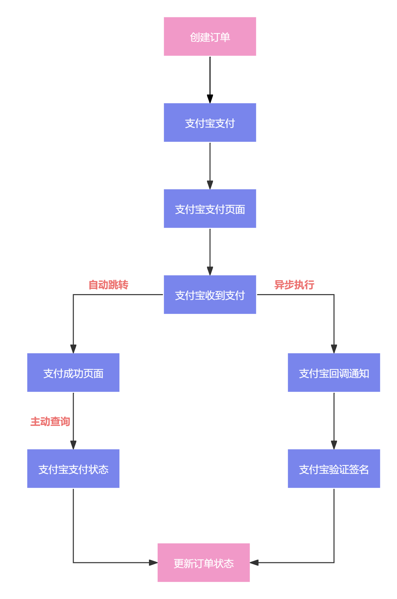

# 业务讲解-整体支付流程讲解

在支付流程中关于支付宝收到支付请求后，会执行两条分支

1. 支付宝支付后跳转到我们设置的支付成功页面，在此页面根据订单编号去主动查询支付宝的支付状态，然后对订单进行相应的更新
2. 支付宝支付后会回调通知我们设置的接口，在此接口中先验证签名信息是否正确，然后更新订单状态

这两条分支，哪条分支先更新订单，就以哪条为准

## 思考
到这里，觉得支付的流程就完善了吗？其实并没有，还存在一个极端场景：

> 用户在订单快要延迟关闭的时候，点击了支付，跳转到了支付宝/微信的支付页面，这时候订单到了延迟时间进行关闭了，但这时用户发起了支付，支付宝/微信 支持成功了
>

**这种场景其实不常见，流程也介绍了，是用户要正好卡在订单要关闭的时候，还要停留在支付宝/微信的支付页面，等待订单关闭了，再支付**

一般人肯定不会这么干的，但既然有了这种场景我们就要考虑进去，目前京东给出的方案是，如果在这种场景下，用户支付成功了，那么等到支付回调或者主动检测时，发现订单已经关闭了，这时就再发起退款的请求，通知用户

在我们大麦项目中，要实现这种方案也并不难，同样当支付成功后，发生了支付回调或者主动检查时，发现订单已经关闭了，那么就进行退款。 而对应的座位状态、余票数量 已经在订单延迟关闭时进行重置了，所以这里不需要再处理了

关于这部分的详解介绍，在主动查询和异步回调查询的讲解章节中都有详细的介绍到，这里就不再赘述

# 第一条分支 主动查询
支付宝本身具备支付后回调通知的功能，那为什么还要在主动查询呢？很简单，就是怕异步回调通知不及时，或者回调没有成功执行

在真实的项目中都是主动查询和异步调用同时存在的

[业务讲解-支付后如何主动检查状态](https://www.yuque.com/u22210564/ykdrdh/zk3kme275tulz22v)

# 第二条分支 异步回调查询
这是支付宝本身就具有的功能，需要我们开发接受异步回调通知的接口，并且此接口的地址要设置成公网可以访问才可以，关于如何配置接口以及如何让本地网络转为公网可访问，小伙伴可跳转到相应的章节来学习：

[如何启用支付功能](https://www.yuque.com/u22210564/ykdrdh/mdl1hv5rk96tkgr6)

当服务收到通知后，就要做验签，如果成功，那么就开始更新库中的订单状态和座位状态(从锁定中 -> 已售卖)

关于此部分的详细讲解，小伙伴可跳转到相应的章节来学习：

[业务讲解-接收支付宝回调通知后如何进行数据更新](https://www.yuque.com/u22210564/ykdrdh/fg5m1zqgfm3l4r80)

> 更新: 2024-07-16 11:04:30  
> 原文: <https://www.yuque.com/u22210564/ykdrdh/gterrogvayyyc7rp>