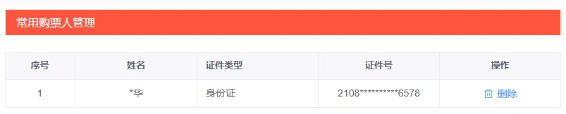

# 业务讲解-为什么说购票人的功能不容小觑

# 购票人的业务


#### 购票人列表页面



#### com.damai.controller.TicketUserController


```java
@RestController
@RequestMapping("/ticket/user")
@Api(tags = "ticket-user", value = "购票人")
public class TicketUserController {
    
    @Autowired
    private TicketUserService ticketUserService;
    
    @ApiOperation(value = "查询购票人列表")
    @PostMapping(value = "/select")
    public ApiResponse<List<TicketUserVo>> select(@Valid @RequestBody TicketUserListDto ticketUserListDto){
        return ApiResponse.ok(ticketUserService.select(ticketUserListDto));
    }
    
    @ApiOperation(value = "添加购票人")
    @PostMapping(value = "/add")
    public ApiResponse<Void> add(@Valid @RequestBody TicketUserDto ticketUserDto){
        ticketUserService.add(ticketUserDto);
        return ApiResponse.ok();
    }
    
    @ApiOperation(value = "删除购票人")
    @PostMapping(value = "/delete")
    public ApiResponse<Void> delete(@Valid @RequestBody TicketUserIdDto ticketUserIdDto){
        ticketUserService.delete(ticketUserIdDto);
        return ApiResponse.ok();
    }
}
```


# 购票人功能为什么重要


可能看到这里，有的小伙伴会有疑惑，为什么说购票人的功能重要？不就是用户下的购票人吗，顶多也就是添加修改操作。还有就是生成订单时，用户选择了购票人信息后，传入购票人信息不就可以了吗？没啥复杂的啊


小伙伴听我娓娓道来，其实真的没有这么简单。


+ 首先在生成订单时，涉及到调用购票人列表接口，给用户展示购票人列表信息
+ 在生成订单接口中，也要查询购票人列表信息，验证传入的购票人信息是否正确


注意这两次操作都是要从数据库中查询，购票人的数据库表是用的user_id作为分库分表的分片键，所以不会有读扩撒导致全路由的问题。


#### 购票人表结构


```sql
CREATE TABLE `d_ticket_user` (
  `id` bigint(20) NOT NULL COMMENT '主键id',
  `user_id` bigint(20) NOT NULL COMMENT '用户id',
  `rel_name` varchar(256) NOT NULL COMMENT '用户真实名字',
  `id_type` int(11) NOT NULL DEFAULT '1' COMMENT '证件类型 1:身份证 2:港澳台居民居住证 3:港澳居民来往内地通行证 4:台湾居民来往内地通行证 5:护照 6:外国人永久居住证',
  `id_number` varchar(512) NOT NULL COMMENT '证件号码',
  `create_time` datetime NOT NULL COMMENT '创建时间',
  `edit_time` datetime NOT NULL COMMENT '编辑时间',
  `status` tinyint(1) NOT NULL DEFAULT '1' COMMENT '1:正常 0:删除',
  PRIMARY KEY (`id`)
) ENGINE=InnoDB DEFAULT CHARSET=utf8mb4 COMMENT='购票人表';
```


但仅仅是将购票人数据进行分库分表是不够的


查询购票人信息的操作是在生成订单过程中，也就是**抢票业务**。抢票业务可是大麦项目的核心高并发业务，当大量的用户来抢票的话，这个购票人列表的查询可是对数据库的压力很大的，不夸张的说，当请求到达了一定量级了，数据库超时现象很快就能爆出来。


既然数据库的压力这么大，解决的最好方法还是使用缓存，并且购票人修改的概率很低，所以缓存和数据库一致性的问题也很好解决


# 缓存的设计


我们确定了使用缓存，但有个问题，就是**什么时候来将购票人的信息放入缓存中？**


有的人会想那在生成订单过程中，把购票人信息放入缓存不就可以了吗，这么做其实不可行，首先从业务入手，大麦网的高并发特点是用户会一瞬间抢购同一场演唱会，抢不到就抢不到了。下一次演唱会的抢购就不知道什么时候了。也就说**用户的购票人信息短时间内是不会复用的**，之所以放入缓存，是为了解决这一瞬间数据库的压力。也就是说放入缓存的时机要在生成订单前


还有另一个问题，**需要将所有用户的购票人信息放进缓存中吗**，如果都这么放入了，那缓存的内存压力会非常的大


为了解决这两个问题，我们再从业务入手，首先来说并不是所有的演唱会都是热门需要去抢购的，对于二三线的明星演唱会来说，一瞬间的并发量并没有很高，只有超一线的明星，例如周杰伦、林俊杰这种明星的演唱会并发量确实会很高


<font style="color:#0C68CA;">基于这个业务特点，我们就可以在生成订单之前，也就是查看演唱会详情时，如果这场演唱会是热门的话，将购票人添加到缓存</font>


到这里，还有个问题解决，就是查看演唱会详情是不需要登录的，有的用户就是浏览浏览，点击进去看看演唱会详情，虽然查看了，但并不一定会抢票。那么通过什么办法能知道用户是为了想抢票而去点进看演唱会详情的呢？

<font style="color:#0C68CA;">答案就是 </font>**<font style="color:#0C68CA;">登录</font>**<font style="color:#0C68CA;">。其实登录的用户也不一定是要抢票的，但是</font>**<font style="color:#0C68CA;">不登录的用户一定不是抢票的</font>**


所以基于以上的考虑，最终确定**是热门的演唱会，并且用户是登录的状态下，才将用户购票人放入缓存中**


方案确定了，我们来分析流程：

+ 首先是用户在登陆状态下来查看热门的演唱会详情，这时将用户购票人列表放入缓存中
+ 但还有另一种情况，就是用户在没有登录的状态下查看热门的演唱会详情，这时不把用户购票人列表放入缓存


如果这时，用户想要抢票了，就必须要登录，然后再去调用演唱会详情，接着会跳转到生成订单或者选座位的页面，而在这个**再去调用演唱会详情的过程中，就还可以将购票人列表放入缓存**


### 节目详情中预先加载购票人列表


#### com.damai.service.ProgramService#preloadTicketUserList


```java
/***
 * 预先加载用户下的购票人
 */
private void preloadTicketUserList(Integer highHeat){
    //如果节目是热度不高的，那么不用预先加载了
    if (Objects.equals(highHeat, BusinessStatus.NO.getCode())) {
        return;
    }

    String userId = BaseParameterHolder.getParameter(USER_ID);
    String code = BaseParameterHolder.getParameter(CODE);
    //如果用户id或者code有一个为空，那么判断不了用户登录状态，也不用预先加载了
    if (StringUtil.isEmpty(userId) || StringUtil.isEmpty(code)) {
        return;
    }
    //异步加载购票人信息，别耽误查询节目详情的主线程
    BusinessThreadPool.execute(() -> {
        try {
            Boolean userLogin = redisCache.hasKey(RedisKeyBuild.createRedisKey(RedisKeyManage.USER_LOGIN, code, userId));
            //如果用户没有登录，也不用预先加载了
            if (!userLogin) {
                return;
            }
            //如果已经预热加载了，就不用再执行了
            if (redisCache.hasKey(RedisKeyBuild.createRedisKey(RedisKeyManage.TICKET_USER_LIST,userId))) {
                return;
            }
            TicketUserListDto ticketUserListDto = new TicketUserListDto();
            ticketUserListDto.setUserId(Long.parseLong(userId));
            ApiResponse<List<TicketUserVo>> apiResponse = userClient.select(ticketUserListDto);
            if (Objects.equals(apiResponse.getCode(), BaseCode.SUCCESS.getCode())) {
                Optional.ofNullable(apiResponse.getData()).filter(CollectionUtil::isNotEmpty)
                        .ifPresent(ticketUserVoList -> redisCache.set(RedisKeyBuild.createRedisKey(
                                RedisKeyManage.TICKET_USER_LIST,userId),ticketUserVoList));
            }else {
                log.warn("userClient.select 调用失败 apiResponse : {}",JSON.toJSONString(apiResponse));
            }
        }catch (Exception e) {
            log.error("预热加载投票人列表失败",e);
        }
    });
}
```


代码的逻辑不是很复杂，**核心流程还是判断演唱会是热门，并且用户在登录状态中。那么就去异步执行将购票人的列表放入到缓存中**。


### 代码技巧


在此方法中，**当判断的条件不符合业务要求时，使用return将流程提前结束。**这样可以减少if分支的数量，当if的嵌套数量过多时，就会很可能有未知的问题，一般建议分支数量不要超过3个


我们来模拟不使用这种提前结束的技巧，使用常规的if判断 代码是怎么样的

```java
/***
 * 预先加载用户下的购票人
 */
private void preloadTicketUserList(Integer highHeat){
    if (Objects.equals(highHeat, BusinessStatus.YES.getCode())) {
        String userId = BaseParameterHolder.getParameter(USER_ID);
        String code = BaseParameterHolder.getParameter(CODE);
        if (StringUtil.isNotEmpty(userId) && StringUtil.isNotEmpty(code)) {
            BusinessThreadPool.execute(() -> {
                try {
                    Boolean userLogin = redisCache.hasKey(RedisKeyBuild.createRedisKey(RedisKeyManage.USER_LOGIN, code, userId));
                    if (userLogin) {
                        if (!redisCache.hasKey(RedisKeyBuild.createRedisKey(RedisKeyManage.TICKET_USER_LIST,userId))) {
                            TicketUserListDto ticketUserListDto = new TicketUserListDto();
                			ticketUserListDto.setUserId(Long.parseLong(userId));
                			ApiResponse<List<TicketUserVo>> apiResponse = userClient.select(ticketUserListDto);
                            if (Objects.equals(apiResponse.getCode(), BaseCode.SUCCESS.getCode())) {
                                Optional.ofNullable(apiResponse.getData()).filter(CollectionUtil::isNotEmpty)
                                        .ifPresent(ticketUserVoList -> redisCache.set(RedisKeyBuild.createRedisKey(
                                                RedisKeyManage.TICKET_USER_LIST,userId),ticketUserVoList));
                            }else {
                                log.warn("userClient.select 调用失败 apiResponse : {}",JSON.toJSONString(apiResponse));
                            }
                        }
                    }
                }catch (Exception e) {
                    log.error("预热加载投票人列表失败",e);
                }
            });
        }
    }
}
```

能看到不优化的话，if的分支非常的多，代码看起来也不够简洁干练


#### 优化技巧


这里面有个细节，也是使用缓存的一个技巧，**就是双重判定，**就是这行


```java
if (redisCache.hasKey(RedisKeyBuild.createRedisKey(RedisKeyManage.TICKET_USER_LIST,userId))) {
    return;
}
```


当用户第一个查看节目详情的请求来加载购票人列表放入缓存后，用户再查看别的演唱会详情再次执行到这行时，就会发现购票人列表已经存在缓存中，那么就不会再往下执行去调用用户服务了。这种技巧基本上只要有业务使用了缓存，就可以利用这个技巧。


### 查看购票人列表


当将购票人列表预热加载到缓存后，等用户进行下单查看购票人列表时，就可以直接从缓存中获取了


```java
@ApiOperation(value = "查询购票人列表")
@PostMapping(value = "/select")
public ApiResponse<List<TicketUserVo>> select(@Valid @RequestBody TicketUserListDto ticketUserListDto){
    return ApiResponse.ok(ticketUserService.select(ticketUserListDto));
}
```


```java
public List<TicketUserVo> select(TicketUserListDto ticketUserListDto) {
    //先从缓存中查询
    List<TicketUserVo> ticketUserVoList = redisCache.getValueIsList(RedisKeyBuild.createRedisKey(
            RedisKeyManage.TICKET_USER_LIST, ticketUserListDto.getUserId()), TicketUserVo.class);
    if (CollectionUtil.isNotEmpty(ticketUserVoList)) {
        return ticketUserVoList;
    }
    LambdaQueryWrapper<TicketUser> ticketUserLambdaQueryWrapper = Wrappers.lambdaQuery(TicketUser.class)
            .eq(TicketUser::getUserId, ticketUserListDto.getUserId());
    List<TicketUser> ticketUsers = ticketUserMapper.selectList(ticketUserLambdaQueryWrapper);
    return BeanUtil.copyToList(ticketUsers,TicketUserVo.class);
}
```


#### 缓存和数据库不一致问题


至于缓存和数据库不一致的问题，很好解决，从业务上考虑，每个用户只会看自己的购票人信息。每个用户也只会修改自己的购票人信息。也就是说不会有修改购票人信息的并发问题。除非这个用户在不同的平台，比如app和pc同时的修改自己用户的购票人信息。不过谁也不会这么做。


当修改购票人信息后，直接将缓存中数据删除掉即可。等用户去看热门的演唱会时，还会将数据加载到缓存中


> 更新: 2024-07-09 15:38:34  
> 原文: <https://www.yuque.com/u22210564/ykdrdh/uv0dq17dze2k6rq1>