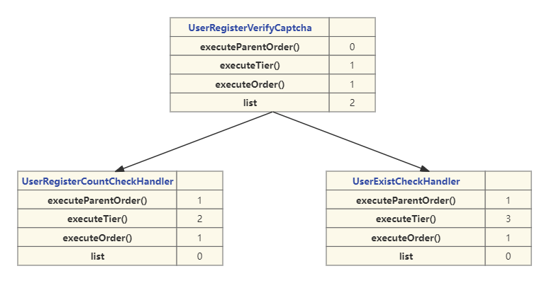
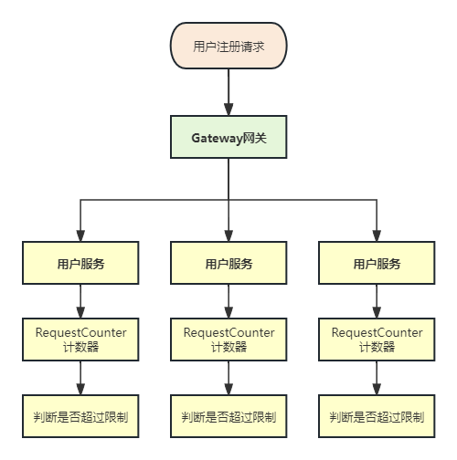

# 业务讲解-用户注册-使用组合模式处理复杂的验证功能

## 思考


对于并发量不高的普通项目来说，注册用户的逻辑很简单，先验证参数，然后判断库中是否已经有此用户，如果没有进行添加用户即可。看似岁月静好


#### 高并发下的问题


但对于大麦这种在一瞬间进行抢票的高并发来说，注册用户的过程中，考虑的问题就需要很多了。


+  首先就是数据库表中的数据很多的话，就要考虑进行分库分表操作，关于此问题的详细介绍，可查看用户的分库分表相关文档

[分库分表-用户服务-用户表](https://www.yuque.com/u22210564/ykdrdh/etrdd3hhzbqb5xzh)

+  还有情况，有大量的用户其实是第一次购买，用户买票前要进行注册的操作，那么这种注册的操作当并发量高时就会产生很多的问题。比如一般都是将用户信息会放到缓存中保存一份，用来降低数据库的压力，但是如果用户注册操作的话，缓存中是不存在用户信息的，那么请求最终还是会落到数据库上，这就是经典的缓存穿透问题，关于此问题的详细介绍，可查看相关文档

[业务讲解-用户注册-如何巧妙应对缓存穿透](https://www.yuque.com/u22210564/ykdrdh/gengzl7y9btv2tmv)


接下来我们正式的开始分析用户注册的详细过程


# 讲解


**模块：**`damai-user-service`


```xml
<dependency>
    <groupId>com.example</groupId>
    <artifactId>damai-user-service</artifactId>
    <version>${revision}</version>
</dependency>
```


```java
@Transactional(rollbackFor = Exception.class)
@ServiceLock(lockType= LockType.Write,name = REGISTER_USER_LOCK,keys = {"#userRegisterDto.mobile"})
public void register(UserRegisterDto userRegisterDto) {
    //参数验证业务
    compositeContainer.execute(CompositeCheckType.USER_REGISTER_CHECK.getValue(),userRegisterDto);
    //用户表添加
    User user = new User();
    BeanUtils.copyProperties(userRegisterDto,user);
    user.setId(uidGenerator.getUid());
    userMapper.insert(user);
    //用户手机表添加
    UserMobile userMobile = new UserMobile();
    userMobile.setId(uidGenerator.getUid());
    userMobile.setUserId(user.getId());
    userMobile.setMobile(userRegisterDto.getMobile());
    userMobileMapper.insert(userMobile);
    bloomFilterHandler.add(userMobile.getMobile());
}
```


### 流程


+ 开启事务
+ 加分布式锁防止并发问题
+ 使用组合模式进行参数验证
+ 向用户表中添加数据
+ 向用户手机表中添加数据
+ 向布隆过滤器中添加数据


## 参数验证业务


**参数验证的问题**


参数验证是相当常见的，对于字段的必填和格式限制等，我们可以直接使用`javax.validation`来进行验证，本项目也是引入了此框架，较少了人为的验证工作，


但是对于验证业务来说，还是需要我们自己来开发的，而有些验证的逻辑是多个接口都需要的，另外当验证业务的逻辑变得复杂了后，这些验证业务的逻辑还存在的父子和执行顺序的关系，为了解决复用和结构性的问题，本人利用了组合模式和算法来创建出树形结构，来解决此问题，关于此问题的详细介绍，可查看相关文档


[组件讲解-利用组合模式打造强大验证功能，轻松应对复杂验证需求](https://www.yuque.com/u22210564/ykdrdh/baixnwbm4fhze9w7)


通过阅读组合模式实现复杂的验证功能文档后，我们知道了验证功能的树结构是如何构建的了，下面我们就来分析下，用户注册验证逻辑的树结构构建过程


```java
public enum CompositeCheckType {
    /**
     * 组合模式类型
     * */
    USER_REGISTER_CHECK(1,"user_register_check","用户注册")
}
```


用户注册验证逻辑的类型为`USER_REGISTER_CHECK`，验证的逻辑有


+  验证每秒用户注册请求是否超过最大限制 
+  验证验证码是否正确 
+  验证是否已注册用户 


#### 思考


我们思考一个问题，这三个验证逻辑，都是`USER_REGISTER_CHECK`类型，也就是说这三个验证类都要实现`AbstractComposite`的`type()`方法，类型都是相同的，如果以后再加一个验证逻辑的话，那么还要再实现一遍，这是不是就产生冗余了呢？


为此，为了解决此问题，我们可以再设计一个抽象层，将相同类型的`type`方法抽象出来，其余的方法仍旧由验证实现类来实现


**com.damai.service.composite.register.AbstractUserRegisterCheckHandler**


```java
/**
 * @program: 极度真实还原大麦网高并发实战项目。 添加 阿宽不是程序员 微信，添加时备注 damai 来获取项目的完整资料 
 * @description: 用户注册验证基类，用户注册的相关验证逻辑继承此类
 * @author: 阿宽不是程序员
 **/
public abstract class AbstractUserRegisterCheckHandler extends AbstractComposite<UserRegisterDto> {
    
    @Override
    public String type() {
        return CompositeCheckType.USER_REGISTER_CHECK.getValue();
    }
}
```


`AbstractUserRegisterCheckHandler`作为抽象类，集成了`AbstractComposite`验证接口，将`type()`进行了实现，类型为`USER_REGISTER_CHECK`，以后所有的用户注册的验证逻辑，只需继承`AbstractUserRegisterCheckHandler`即可


目前用户注册的验证功能有三种， `UserRegisterVerifyCaptcha` 、 `UserRegisterCountCheckHandler` 、`UserExistCheckHandler`都继承了`AbstractUserRegisterCheckHandler`


这三种验证功能的具体验证逻辑稍后再详细介绍，我们先看来这三个验证功能的层级关系和执行顺序，直接用流程图来体现




通过流程图可以看到用户注册验证的树结构，以及彼此之间的层级关系


+ 第一层只有一个节点 `UserRegisterVerifyCaptcha` 其子节点`list` 有2个
+ 第二层有两个节点 `UserRegisterCountCheckHandler` ，`UserExistCheckHandler`，父节点为 `UserRegisterCountCheckHandler` ，都没有子节点


执行的顺序依次为`UserRegisterVerifyCaptcha` -> `UserRegisterCountCheckHandler` -> `UserExistCheckHandler`


接下来我们详细的介绍这三个验证逻辑的执行过程


### 流程


#### UserRegisterVerifyCaptcha


```java
/**
 * @program: 极度真实还原大麦网高并发实战项目。 添加 阿宽不是程序员 微信，添加时备注 damai 来获取项目的完整资料 
 * @description: 用户注册检查
 * @author: 阿宽不是程序员
 **/
@Component
public class UserRegisterVerifyCaptcha extends AbstractUserRegisterCheckHandler {
    
    @Autowired
    private CaptchaHandle captchaHandle;
    
    @Autowired
    private RedisCache redisCache;
    
    /**
     * 验证验证码是否正确
     * */
    @Override
    protected void execute(UserRegisterDto param) {
        //验证密码
        String password = param.getPassword();
        String confirmPassword = param.getConfirmPassword();
        if (!password.equals(confirmPassword)) {
            throw new DaMaiFrameException(BaseCode.TWO_PASSWORDS_DIFFERENT);
        }
        String verifyCaptcha = redisCache.get(RedisKeyBuild.createRedisKey(RedisKeyManage.VERIFY_CAPTCHA_ID,param.getCaptchaId()), String.class);
        if (StringUtil.isEmpty(verifyCaptcha)) {
            throw new DaMaiFrameException(BaseCode.VERIFY_CAPTCHA_ID_NOT_EXIST);
        }
        if (VerifyCaptcha.YES.getValue().equals(verifyCaptcha)) {
            if (StringUtil.isEmpty(param.getCaptchaType())) {
                throw new DaMaiFrameException(BaseCode.CAPTCHA_TYPE_EMPTY);
            }
            if (StringUtil.isEmpty(param.getPointJson())) {
                throw new DaMaiFrameException(BaseCode.POINT_JSON_EMPTY);
            }
            if (StringUtil.isEmpty(param.getToken())) {
                throw new DaMaiFrameException(BaseCode.CAPTCHA_TOKEN_JSON_EMPTY);
            }
            CaptchaVO captchaVO = new CaptchaVO();
            captchaVO.setCaptchaType(param.getCaptchaType());
            captchaVO.setPointJson(param.getPointJson());
            captchaVO.setToken(param.getToken());
            ResponseModel responseModel = captchaHandle.checkCaptcha(captchaVO);
            if (!responseModel.isSuccess()) {
                throw new DaMaiFrameException(responseModel.getRepCode(),responseModel.getRepMsg());
            }
        }
    }
    
    @Override
    public Integer executeParentOrder() {
        return 0;
    }
    
    @Override
    public Integer executeTier() {
        return 1;
    }
    
    @Override
    public Integer executeOrder() {
        return 1;
    }
}
```


+ 通过验证码id从redis获取验证标识 yes或者no，以此来判断是否要做验证码的验证逻辑
+ 如果没有从redis中获取到数据，那么直接抛出异常，不再将用户注册逻辑执行
+ 如果从redis中获取的数据是yes，说明要进行验证码逻辑的验证，执行验证码是否正确
+ 如果验证不通过，则抛出异常


通过分析能够看出，其实`UserRegisterVerifyCaptcha`的验证逻辑，就是判断是否需要进行验证码的验证，如果需要，则执行验证逻辑


### 前置条件-图形验证码的介绍


关于图形验证码到底是什么？以及是如何生成的？请先跳转到相关文档进行查看，然后再继续学习此文档


图形验证码的介绍、作用以及使用 可以跳转到相应的文档查看


[组件讲解-图形验证码使用全解析，提升系统安全性的必备技巧](https://www.yuque.com/u22210564/ykdrdh/rtr7n0n38mlhdcb6)


关于图形验证码在用户注册业务流程中是如何生成的，可以跳转到相应的文档查看


[业务讲解-用户注册-到底如何使用图形验证码](https://www.yuque.com/u22210564/ykdrdh/at4sfd4okszze60i)


到这里说明小伙伴对验证码已经有了了解了，下面来分析校验验证码操作


#### captchaHandle.checkCaptcha


```java
public ResponseModel checkCaptcha(CaptchaVO captchaVO) {
    RequestAttributes requestAttributes = RequestContextHolder.getRequestAttributes();
    assert requestAttributes != null;
    HttpServletRequest request = ((ServletRequestAttributes) requestAttributes).getRequest();
    captchaVO.setBrowserInfo(RemoteUtil.getRemoteId(request));
    return captchaService.verification(captchaVO);
}
```


到这里就是调用验证码组件的api了，captchaService就是`AJ-Captcha`提供的api，如果小伙伴想对`AJ-Captcha`项目也有兴趣，可留言，本人会在后续计划安排


如果校验验证码通过的话，那么进行下一个用户注册验证的逻辑


#### UserRegisterCountCheckHandler


```java
/**
 * @program: 极度真实还原大麦网高并发实战项目。 添加 阿宽不是程序员 微信，添加时备注 damai 来获取项目的完整资料 
 * @description: 用户注册请求数检查
 * @author: 阿宽不是程序员
 **/
@Component
public class UserRegisterCountCheckHandler extends AbstractUserRegisterCheckHandler {
    
    @Autowired
    private RequestCounter requestCounter;
    
    /**
     * 验证每秒用户注册请求是否超过最大限制
     * */
    @Override
    protected void execute(final UserRegisterDto param) {
        boolean result = requestCounter.onRequest();
        if (result) {
            throw new DaMaiFrameException(BaseCode.USER_REGISTER_FREQUENCY);
        }
    }
    
    @Override
    public Integer executeParentOrder() {
        return 1;
    }
    
    @Override
    public Integer executeTier() {
        return 2;
    }
    
    @Override
    public Integer executeOrder() {
        return 1;
    }
}
```


此验证逻辑是通过调用`requestCounter`计数器，判断当前计算出的每秒的请求数是否大于了配置的最大值，如果大于了，则直接返回异常信息给前端，提示用户注册频繁


```json
{
    "code":"40013",
    "message":"用户注册频繁",
    "data":null
}
```


**RequestCounter**


```java
/**
 * @program: 极度真实还原大麦网高并发实战项目。 添加 阿宽不是程序员 微信，添加时备注 damai 来获取项目的完整资料 
 * @description: 计数器
 * @author: 阿宽不是程序员
 **/
@Component
public class RequestCounter {
    
    private final AtomicInteger count = new AtomicInteger(0);
    private final AtomicLong lastResetTime = new AtomicLong(System.currentTimeMillis());
    @Value("${request_count_threshold:1000}")
    private int maxRequestsPerSecond = 1000;
    
    public synchronized boolean onRequest() {
        long currentTime = System.currentTimeMillis();
        // 如果当前时间和上次重置时间差超过1秒
        long differenceValue = 1000;
        if (currentTime - lastResetTime.get() >= differenceValue) {
            // 重置计数器
            count.set(0);
            // 更新重置时间
            lastResetTime.set(currentTime);
        }
        
        if (count.incrementAndGet() > maxRequestsPerSecond) {
            log.warn("请求超过每秒{}次限制",maxRequestsPerSecond);
            // 超过限制后重置计数器
            count.set(0);
            // 更新重置时间
            lastResetTime.set(System.currentTimeMillis());
            return true;
        }
        return false;
    }
}
```


接下来介绍`RequestCounter`计数器是怎么计算的


+ 将整个方法加上`synchronized`锁，防止并发问题
+ 得到当前的时间戳
+ 如果当前时间戳和上次更新的时间戳相差大于了1秒，说明这次请求和上次请求相差在1秒以上，那么直接将`count`当前计数值归0，并将最新的更新时间更新为当前时间戳
+ 如果`count`当前计数值大于了`maxRequestsPerSecond`最大值限制，那么将`count`当前计数值归0，并将最新的更新时间更新为当前时间戳，返回结果`true`，说明确实是超过了限制
+ 如果以上请求都没有反正，说明没有超过最大限制，将结果返回`false`


这里的`maxRequestsPerSecond`是可以通过`request_count_threshold`进行配置的，默认是1000，@Value注解修饰的变量，在`Apollo`和`Nacos`的配置中心都是支持热加载的，并不需要将服务重启，这样可以根据**业务的并发量灵活的进行修改限制**


但是要注意，这个计数器只是计算当前本地JVM的请求数，但生产中的用户服务可能会部署多台实例，也就是说请求数会被分发到不同的实例上，比如：




比如在一秒内的用户注册请求有300个，用户服务的实例有3台，那么请求数经过Gateway网关后，通过Ribbon的负责均衡策略(默认为轮训)，也就是**这300的请求会被平均分配到这3台实例上**，**每台实例的接收到的请求数为100**，**每个计数器计算的就是每台实例自己的最大限制数**，如果计数器最大限制为100，那么就触发了限制，直接将限制信息返回，如果计数器最大限制为200，那么就不会触发限制，用户注册的逻辑会继续执行


这时有人会提出疑问，**为什么不用  是否校验验证码接口里的逻辑   用lua + redis做计数器呢**，还是设置成最大阈值限制为300，**每台实例还是依靠lua + redis计数器进行计算**，这样就是直接当前所有的请求数了，清晰还直观，多好啊。


首先说，这么做确实是可以的，直接用redis计算确实更加简单，不需要考虑被多台实例平分后的问题。但要记住，本人设计的大麦网项目是**始终围绕高并发的问题而思考的**，在设计方案的时候要时时刻刻考虑效率的问题，redis的效率确实是很高，但是再高，它也是**有网络请求损耗**的，也是要占用redis的执行的，所以我们要尽可能设计高效率的执行。


**UserRegisterCountCheckHandler**作为验证码通过后，下一步的验证，本质是防止缓存穿透的最后一步的限制了，所以要充分考虑健壮性和高效性，所以用**jvm本地锁的策略来实现**，不借助redis这种第三方工具。


不要以为加了**synchronized**锁，觉得效率会很低，`synchronized`在经过jdk1.5版本后的优化，其效率是非常之快的，而且加锁的方法内部只是有判断、赋值变量的操作，没有网络请求、数据库这些耗时的操作，所以执行的效率是非常高的，而且只是用在用户注册这一个功能上，所以**不要以为加了锁就担心，该用的时候就要用**


让我们回到`UserRegisterCountCheckHandler`中，当限制没有超过计数器的话，说明此验证是通过的，那么开始执行下一个验证


#### UserExistCheckHandler


```java
@Component
public class UserExistCheckHandler extends AbstractUserRegisterCheckHandler {

    @Autowired
    private UserService userService;

    /**
     * 验证是否已注册用户
     * */
    @Override
    public void execute(final UserRegisterDto userRegisterDto) {
        userService.doExist(userRegisterDto.getMobile());
    }
    
    @Override
    public Integer executeParentOrder() {
        return 1;
    }
    
    @Override
    public Integer executeTier() {
        return 2;
    }

    @Override
    public Integer executeOrder() {
        return 2;
    }
}
```


```java
public void doExist(String mobile){
    boolean contains = bloomFilterHandler.contains(mobile);
    if (contains) {
        LambdaQueryWrapper<UserMobile> queryWrapper = Wrappers.lambdaQuery(UserMobile.class)
                .eq(UserMobile::getMobile, mobile);
        UserMobile userMobile = userMobileMapper.selectOne(queryWrapper);
        if (Objects.nonNull(userMobile)) {
            throw new DaMaiFrameException(BaseCode.USER_EXIST);
        }
    }
}
```


到这里就是真正的验证用户是否存在的逻辑了，先通过**bloomFilterHandler**布隆过滤器判断，如果布隆过滤器判断存在的话，为了防止布隆过滤器的误判，再从数据库中判断是否存在。


### 布隆过滤器的特点


+ 如果元素判断存在，由于存在误判，这个元素不一定真正存在
+ 如果元素判断不存在，那么这个元素一定不存在


布隆过滤器是现在面试爱问的知识点，关于布隆过滤器详细介绍原理和大麦网中布隆过滤器的使用，可跳转到相应的文档查看


[技术精华-完全解读布隆过滤器](https://www.yuque.com/u22210564/ykdrdh/ueg87gph9fagw807)


> 更新: 2024-08-15 10:42:00  
> 原文: <https://www.yuque.com/u22210564/ykdrdh/gh8b0iazadk9p5gk>