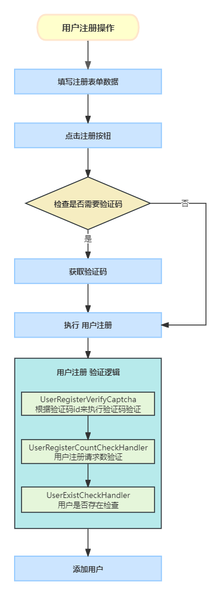

# 业务讲解-用户注册-如何巧妙应对缓存穿透

# 背景
在如今微服务遍地的互联网项目来说，使用缓存，常见的比如**Redis**，是最常用的提高效率的手段，尤其是在读多，写少的情况下更为适用。能很大程度的降低数据库的压力，但引入缓存同样也造成了一系列的问题需要解决，常见的比如缓存雪崩、缓存穿透。本文要介绍的就是关于缓存穿透的解决方案

# 缓存穿透
## 定义
**缓存穿透是指查询的数据在缓存和数据库中都不存在**，导致每次查询这条数据都会穿透过缓存，直接去查询数据库，相当于没有缓存一样。

## 危害
一般存在缓存是为了缓解数据库的压力，如果短时间内发生了大量的请求并缓存穿透，就会试数据库的压力猛增，数据库的抗压能力比Redis要差的多得多，完全不是一个级别，所以如果是高并发的缓存穿透，极有可能造成系统宕机。

## 原因
+ 业务代码或者数据出现了问题
+ 恶意攻击、爬虫等造成大量缓存穿透请求

## 解决方案
### 缓存空对象
当查询的数据在缓存中和数据库中都不存在时，就缓存一个空结果，比如null，并将这个空结果返回给前端，并设置一个过期时间，避免消耗太多的内存

拿用户注册逻辑来说

+ 用户1注册用户使用用户1自己的手机号，查询缓存和数据库都不存在，接着在缓存中设置一个空值，过期时间30s
+ 用户2注册用户使用用户2自己的手机号，查询缓存和数据库都不存在，接着在缓存中设置一个空值，过期时间30s

#### 问题

当短时间内大量用户来注册，**每个用户都是用自己的手机号，缓存空值没有得到复用，除非手机号重复了，但这也不可能。所以还是穿透了缓存，请求都落到了数据库上**，所以这种方案适合缓存空值能复用的场景。对于用户注册业务来说，不太适合

### 分布式锁

可以说使用分布式锁是防止并发问题最常用的解决方案了，**核心就是加一把锁**，每次只有一个请求能获得到锁，没有获得锁的请求等待获得锁的请求执行完后释放锁，然后再次竞争。所以解决缓存穿透也是可以的。

拿用户注册逻辑来说

用户1注册用户请求获得锁执行注册逻辑，用户2注册用户的请求需要等待锁的释放，当用户1注册的请求释放完锁后，用户2再注册

#### 问题

每次只有一个请求执行，其他请求只能等待，这样会降低项目的并发量，对于并大量不高的项目来说，这种方案是可以的，但是对于大麦网高并发的项目来说，短时间的大量用户请求需要一个一个的执行，非常的影响用户体验，所以这种方案也不是很适合

### 布隆过滤器

布隆过滤器实际上是一个很长的二进制向量和一系列随机映射函数。布隆过滤器可以用于检索一个元素是否在一个集合中。主要用于判断一个元素是否在一个集合中。

#### 特点

+ 存储空间和插入 / 查询时间都是常数O(k)
+ 支持海量数据场景下高效率判断元素是否存在
+ 无法删除，因为可能多个元素通过哈希后，可能会产生hash碰撞，映射到布隆过滤器的同一个位置。删除该位置后，可能影响其他元素
+ 误判，由于存在hash碰撞，不同的元素经过哈希后可能映射到同一个位置，一旦产生碰撞，会被误判存在

关于布隆过滤器的详细介绍和大麦网项目对布隆过滤器的封装，可跳转到相关文档查看

[技术精华-完全解读布隆过滤器](https://www.yuque.com/u22210564/ykdrdh/ueg87gph9fagw807)

关于布隆过滤器有一个致命缺点就是**当判断某个元素是存在时，会有误判的概率**

## 用户注册业务解决方案

通过上文介绍发现每个方案都有各自的问题，那么要怎么解决这个令人头疼的问题呢？正所谓技术都是围绕业务来服务的，一定要从业务的角度出发，既然是用户注册业务就从业务本身出发。

大家在别的平台进行注册或者登录时，应该会遇到这个操作，提交完相关数据，点击注册或者登录时，会跳出来个**图形验证码，让你滑动拼接或者点击相关文字**，验证成功了，就正常执行，否在还要再次验证。这个动作的作用一是为了缓解突发激增的流量，二是为了防刷

所以在大麦网中就引入了这么图形验证码，并且在此基础上又加了一层请求数限制逻辑作为多层防御，然后再使用布隆过滤器

1. 当用户填写完数据后，提交前需要去**检查是否需要验证码**
2. 如果需要则去**获取验证码**
3. 当用户做验证码校验后将相关数据一并传入到用户注册接口中
4. 执行到用户注册校验逻辑 
    - 根据相关数据来进行验证码的校验，如果校验成功，则进行一下步校验
    - 用户注册请求数校验，判断每秒的用户注册请求数是否大于规定的限制，这是一个兜底方案，根据数据库的性能来做相应的配置，不超过，则进行下一步校验
    - 检查用户是否存在，先用布隆过滤器检查，如果检查存在的话，由于存在误判，再去数据库中检查一遍

通过**图形验证码 + 请求数限制 + 布隆过滤器 + 数据库索引** 的方式来实现用户注册业务时的缓存穿透以及请求防刷。

关于图形验证码的详细部分，可跳转到相应文档查看

[组件讲解-图形验证码使用全解析，提升系统安全性的必备技巧](https://www.yuque.com/u22210564/ykdrdh/rtr7n0n38mlhdcb6)

[业务讲解-用户注册-到底如何使用图形验证码](https://www.yuque.com/u22210564/ykdrdh/at4sfd4okszze60i)

关于用户注册验证逻辑的详细部分，可跳转到相应文档查看

[业务讲解-用户注册-使用组合模式处理复杂的验证功能](https://www.yuque.com/u22210564/ykdrdh/gh8b0iazadk9p5gk)

> 更新: 2024-08-15 10:39:12  
> 原文: <https://www.yuque.com/u22210564/ykdrdh/gengzl7y9btv2tmv>