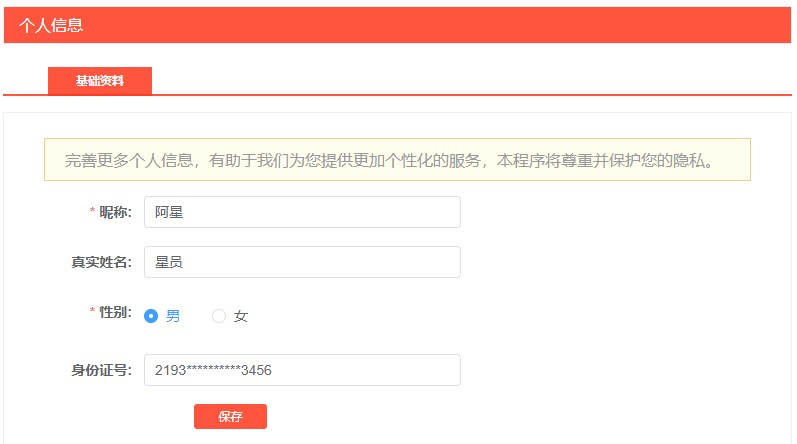

# 业务讲解-用户私密信息如何脱敏展示

# 前言


用户敏感信息展示脱敏是为了保护个人隐私和数据安全，防止敏感信息泄露导致的风险，包括身份盗窃、金融诈骗等。这种做法在很多领域都被广泛采用，尤其是在金融、医疗、教育等行业，其中涉及大量的个人敏感信息。脱敏处理可以确保在不必要的情况下，用户的敏感信息不会被暴露给无关人员，即便是在数据被未经授权访问的情况下也能够提供一定程度的保护


通常需要脱敏处理的数据类型涉及任何可能识别、定位或以其他方式侵犯个人隐私的敏感信息。这些数据类型广泛分布在各个行业，特别是金融、医疗保健、教育、电子商务和社交媒体等领域。以下是一些常见需要脱敏的数据类型示例：


1. **个人身份信息 (PII)**： 
    - 姓名
    - 身份证号、社会安全号码（SSN）、驾照号码等
    - 出生日期
    - 家庭住址
    - 电子邮箱地址
    - 电话号码
2. **金融信息**： 
    - 银行账号和账户详情
    - 信用卡和借记卡号码
    - 投资记录
    - 财产和财务状况信息
3. **医疗信息**： 
    - 病历记录和病史
    - 保险信息
    - 个人健康信息（PHI），比如诊断信息、治疗情况、医疗保险号等
4. **网络标识信息**： 
    - IP地址
    - 位置数据
    - 设备标识符
    - 浏览器和操作系统类型
    - 用户名
5. **就业和教育信息**： 
    - 工作经历
    - 教育背景
    - 薪资信息
    - 学生记录


这些信息的脱敏处理通常涉及将数据转换为去标识化或匿名化的形式，使个人信息不再可识别，或者其识别难度大大增加，从而在不影响数据用途的前提下保护个人隐私。例如，可以通过替换、掩码、哈希处理或伪造数据等技术手段来实现脱敏。在进行数据分析、数据共享或公开展示等场合时，脱敏展示成为了保护个人隐私的重要手段


# 项目中的脱敏


在大麦项目中，涉及到的脱敏展示有 个人信息的身份证号，购票人的姓名姓氏和证件号，如图




### 可选择的方案


在Spring Boot项目中实现敏感数据脱敏，可以通过不同的方法和技术来保护敏感信息。以下是一些常见的实现方式：


#### 1. 使用自定义注解实现脱敏


可以通过创建自定义注解来标记需要脱敏的字段，然后在序列化对象时自动对这些字段进行脱敏处理。这种方法的好处是易于使用，且不侵入业务代码


+ **定义注解**：首先定义一个注解，用于标记需要脱敏的字段
+ **实现脱敏逻辑**：通过AOP（面向切面编程）或自定义序列化器来拦截对象的序列化过程，对标有自定义注解的字段进行脱敏处理


#### 2. AOP（面向切面编程）


AOP允许你对方法调用进行拦截，可以在返回数据前对其进行脱敏处理。你可以定义一个切面（Aspect），在这个切面中实现脱敏逻辑


+ **定义切面**：创建一个切面类，使用`@Aspect`注解。
+ **拦截返回值**：使用`@AfterReturning`注解来拦截方法返回值，然后对返回值进行检查和脱敏处理


#### 3. 自定义序列化器


对于使用Jackson等库序列化对象为JSON的场景，可以通过自定义序列化器来实现字段的脱敏


+ **自定义Jackson序列化器**：继承`StdSerializer<T>`类来创建自己的序列化器，并在其中实现脱敏逻辑
+ **注册序列化器**：通过在Spring Boot的配置中注册这个自定义序列化器，使其生效


#### 4. 利用Hibernate Validator


如果使用Hibernate Validator进行数据校验，可以结合自定义注解和校验器来实现在校验阶段的脱敏


+ **定义校验注解**：创建一个自定义的校验注解
+ **实现校验逻辑**：编写一个校验器，实现`ConstraintValidator`接口，在校验方法中添加脱敏逻辑


其实这四种各自都有各自的问题


+ **自定义+AOP** 由于AOP需要借助Spirng环境，就脱敏功能而言，使用AOP的方式确实显得过于笨重，还要考虑到抽取成组件，AOP不太适合
+ **自定义序列化** 不少人使用的是此方案，事实上此方案也确实可用。但就是考虑到项目中json序列化有没有进行定制，jackson有没有被替换掉
+ **Hibernate Validator** 应用场景有限，并不是所有的实体都需要Hibernate Validator


### 实现的方案


其实从实体类VO入手，实体类默认使用了**@Data  **注解，不需要我们手动再写set/get方法，而对象的序列化以及json的转化其实都需要调用set/get方法，那么我们可以利用这个特点自己来显示指定get方法，来实现脱敏逻辑。


以购票人列表信息展示为例


**com.damai.vo.TicketUserVo**


```java
@Data
@ApiModel(value="TicketUserVo", description ="购票人数据")
public class TicketUserVo implements Serializable {

    private static final long serialVersionUID = 1L;
    
    @ApiModelProperty(name ="id", dataType ="Long", value ="购票人id")
    private Long id;
    
    @ApiModelProperty(name ="userId", dataType ="Long", value ="用户id")
    private Long userId;
    
    @ApiModelProperty(name ="relName", dataType ="String", value ="用户真实名字")
    private String relName;
    
    @ApiModelProperty(name ="idType", dataType ="Integer", value ="证件类型 1:身份证 2:港澳台居民居住证 3:港澳居民来往内地通行证 4:台湾居民来往内地通行证 5:护照 6:外国人永久居住证")
    private Integer idType;
    
    @ApiModelProperty(name ="idNumber", dataType ="String", value ="证件号码")
    private String idNumber;
    
    public String getRelName() {
        if (StringUtil.isNotEmpty(relName)) {
            return StrUtil.hide(relName, 0, 1);
        }
        return relName;
    }
    
    public String getIdNumber() {
        if (StringUtil.isNotEmpty(idNumber)) {
            return DesensitizedUtil.idCardNum(idNumber, 4, 4);
        }else {
            return idNumber;
        }
    }
}
```


在真实名字和证件号码的属性上，指定了get方法，使用了hutool提供的工具类，来实现脱敏。


工具类源码：


```java
/**
 * 替换指定字符串的指定区间内字符为"*"
 * 俗称：脱敏功能，后面其他功能，可以见：DesensitizedUtil(脱敏工具类)
 *
 * 
<pre>
 * CharSequenceUtil.hide(null,*,*)=null
 * CharSequenceUtil.hide("",0,*)=""
 * CharSequenceUtil.hide("jackduan@163.com",-1,4)   ****duan@163.com
 * CharSequenceUtil.hide("jackduan@163.com",2,3)    ja*kduan@163.com
 * CharSequenceUtil.hide("jackduan@163.com",3,2)    jackduan@163.com
 * CharSequenceUtil.hide("jackduan@163.com",16,16)  jackduan@163.com
 * CharSequenceUtil.hide("jackduan@163.com",16,17)  jackduan@163.com
 * </pre>
 *
 * @param str          字符串
 * @param startInclude 开始位置（包含）
 * @param endExclude   结束位置（不包含）
 * @return 替换后的字符串
 * @since 4.1.14
 */
public static String hide(CharSequence str, int startInclude, int endExclude) {
    return replace(str, startInclude, endExclude, '*');
}
```


```java
/**
 * 【身份证号】前1位 和后2位
 *
 * @param idCardNum 身份证
 * @param front     保留：前面的front位数；从1开始
 * @param end       保留：后面的end位数；从1开始
 * @return 脱敏后的身份证
 */
public static String idCardNum(String idCardNum, int front, int end) {
    //身份证不能为空
    if (StrUtil.isBlank(idCardNum)) {
        return StrUtil.EMPTY;
    }
    //需要截取的长度不能大于身份证号长度
    if ((front + end) > idCardNum.length()) {
        return StrUtil.EMPTY;
    }
    //需要截取的不能小于0
    if (front < 0 || end < 0) {
        return StrUtil.EMPTY;
    }
    return StrUtil.hide(idCardNum, front, idCardNum.length() - end);
}
```


> 更新: 2024-07-09 16:15:34  
> 原文: <https://www.yuque.com/u22210564/ykdrdh/nssgn9si3lgm9dge>