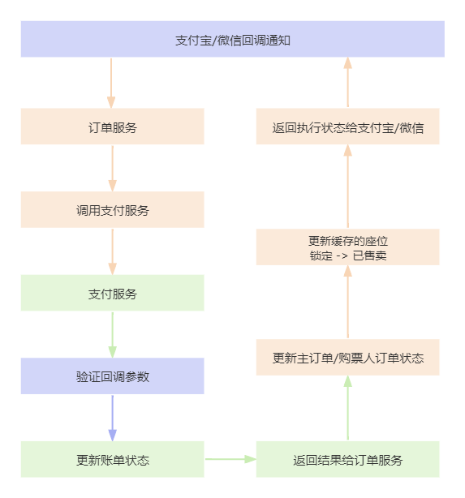
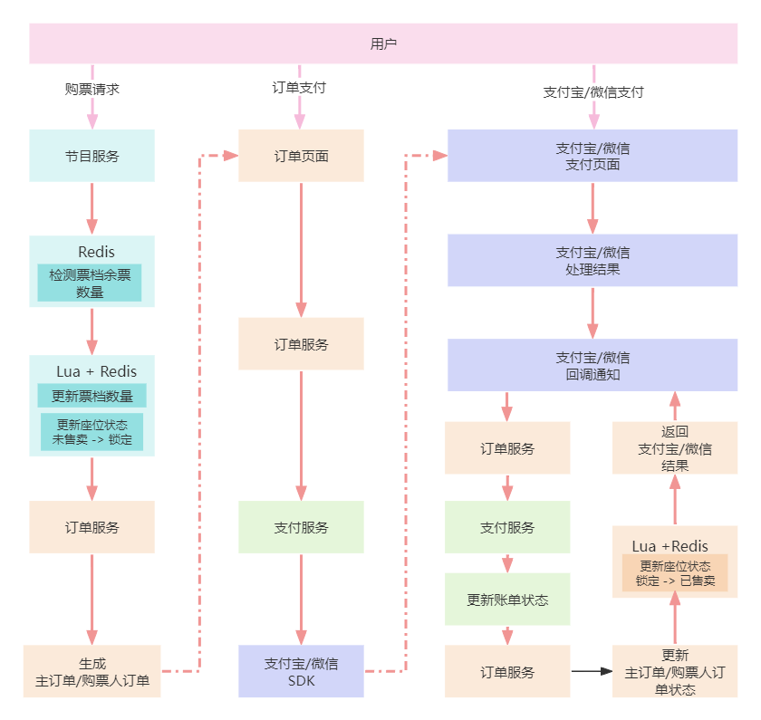

# 业务讲解-如何保障节目数据在缓存与数据库间的一致性

## 概述
[业务讲解-如何应对高并发下的购票压力](https://www.yuque.com/u22210564/ykdrdh/schg4ewp7pupbb88)


[业务讲解-如何对锁进行优化更好的缓解购票压力](https://www.yuque.com/u22210564/ykdrdh/fs2pbqaxyekxg9y3)


[业务讲解-解决高并发下购票压力的终极杀招 "无锁化!"](https://www.yuque.com/u22210564/ykdrdh/zyr9pd9ogzqyas2z)


这三篇文章讲解了用户购票时从分布式锁到lua的优化整个过程，总体都是围绕着用户购票生成订单的业务


[业务讲解-详解订单支付流程](https://www.yuque.com/u22210564/ykdrdh/lpu4oizpgzxbcfcw)


讲解了对生成的订单进行支付的流程


[业务讲解-接收支付宝回调通知后如何进行数据更新](https://www.yuque.com/u22210564/ykdrdh/fg5m1zqgfm3l4r80)


讲解了支付宝处理支付后，回调接口的流程。这里把支付宝回调的流程图再贴出来




在整个流程中：


+  用户购票生成订单过程 把缓存中的余票数量扣除了，缓存中的座位从未售卖修改为锁定中 
+  支付回调过程把缓存中的座位从锁定中修改为已售卖 


之所以把这些数据存到缓存中，是因为缓存的效率执行起来比数据库要快的多，但有没有注意到，从始至终都是操作的缓存，**到现在都没有关于数据库的余票数量和座位的操作啊**


而本文就是要介绍数据库的状态是什么时候更新的，缓存和数据库的一致性要如何保证


### 更新数据库中的余票数量和座位状态


让我们再去看一下支付回调执行的到的 **updateProgramRelatedDataResolution **方法


**com.damai.service.OrderService#updateProgramRelatedDataResolution**


```java
public void updateProgramRelatedDataResolution(Long programId,List<String> seatIdList,OrderStatus orderStatus){
    
    //订单状态修改成了已支付 缓存中的余票扣除了，座位修改成已售卖了...
    
    if (Objects.equals(orderStatus.getCode(), OrderStatus.PAY.getCode())) {
        ProgramOperateDataDto programOperateDataDto = new ProgramOperateDataDto();
        programOperateDataDto.setProgramId(programId);
        //要将锁定修改已售卖的座位id集合
        programOperateDataDto.setSeatIdList(unLockSeatIdList);
        //票档数量
        programOperateDataDto.setTicketCategoryCountDtoList(ticketCategoryCountDtoList);
        //修改为已售卖状态
        programOperateDataDto.setSellStatus(SellStatus.SOLD.getCode());
        //放到延迟队列中
        delayOperateProgramDataSend.sendMessage(JSON.toJSONString(programOperateDataDto));
    }
}
```


**com.damai.dto.ProgramOperateDataDto**


```java
@Data
@ApiModel(value="ProgramOperateDataDto", description ="节目数据操作")
public class ProgramOperateDataDto {
    
    @ApiModelProperty(name ="programId", dataType ="Long", value ="节目id",required = true)
    @NotNull
    private Long programId;
    
    @ApiModelProperty(name ="ticketCategoryCountMap", dataType ="List<TicketCategoryCountDto>",required = true)
    @NotNull
    private List<TicketCategoryCountDto> ticketCategoryCountDtoList;
    
    @ApiModelProperty(name ="seatIdList", dataType ="List<Long>", value ="座位id集合",required = true)
    @NotNull
    private List<Long> seatIdList;
    
    @ApiModelProperty(name ="sellStatus", dataType ="Long", value ="座位状态",required = true)
    @NotNull
    private Integer sellStatus;
}
```


**com.damai.service.delaysend.DelayOperateProgramDataSend**


```java
@Slf4j
@Component
public class DelayOperateProgramDataSend {
    
    @Autowired
    private DelayQueueContext delayQueueContext;
    
    public void sendMessage(String message){
        try {
            delayQueueContext.sendMessage(SpringUtil.getPrefixDistinctionName() + "-" + DELAY_OPERATE_PROGRAM_DATA_TOPIC,
                    message, DELAY_OPERATE_PROGRAM_DATA_TIME, DELAY_OPERATE_PROGRAM_DATA_TIME_UNIT);
        }catch (Exception e) {
            log.error("send message error message : {}",message,e);
        }
        
    }
}
```


到这里就明确了，其实**<font style="color:#213BC0;">当支付回调执行把订单状态和缓存的数据都成功执行后，发送更新节目和座位的数据消息到延迟队列中，由节目服务来消费消息进行数据库中的更新</font>**，有小伙伴可能会想了，这使用延迟队列，缓存和数据库不就不能保证一致性了吗？这里先卖个关子，先继续介绍，下文中会有答案


我们再去节目服务查看，是如何消费消息的


### 节目服务消费消息更新数据库


#### 消息监听器


**com.damai.service.delayconsumer.DelayOperateProgramDataConsumer**


```java
@Slf4j
@Component
public class DelayOperateProgramDataConsumer implements ConsumerTask {
    
    @Autowired
    private ProgramService programService;
    
    @Override
    public void execute(String content) {
        log.info("延迟操作节目数据消息进行消费 content : {}", content);
        if (StringUtil.isEmpty(content)) {
            log.error("延迟队列消息不存在");
            return;
        }
        ProgramOperateDataDto programOperateDataDto = JSON.parseObject(content, ProgramOperateDataDto.class);
        programService.operateProgramData(programOperateDataDto);
    }
    
    @Override
    public String topic() {
        return SpringUtil.getPrefixDistinctionName() + "-" + DELAY_OPERATE_PROGRAM_DATA_TOPIC;
    }
}
```


**com.damai.service.ProgramService#operateProgramData**


```java
@RepeatExecuteLimit(name = CANCEL_PROGRAM_ORDER,keys = {"#programOperateDataDto.programId","#programOperateDataDto.seatIdList"})
@Transactional(rollbackFor = Exception.class)
public void operateProgramData(ProgramOperateDataDto programOperateDataDto){
    List<TicketCategoryCountDto> ticketCategoryCountDtoList = programOperateDataDto.getTicketCategoryCountDtoList();
    //从库中查询座位集合
    List<Long> seatIdList = programOperateDataDto.getSeatIdList();
    //根据节目id和座位id查询座位集合	
    LambdaQueryWrapper<Seat> seatLambdaQueryWrapper = 
                Wrappers.lambdaQuery(Seat.class)
                        .eq(Seat::getProgramId,programOperateDataDto.getProgramId())
                        .in(Seat::getId, seatIdList);
    List<Seat> seatList = seatMapper.selectList(seatLambdaQueryWrapper);
    //如果库中的座位集合为空，则抛出异常
    if (CollectionUtil.isEmpty(seatList)) {
            throw new DaMaiFrameException(BaseCode.SEAT_NOT_EXIST);
    }
    //如果库中的座位集合数量和传入的座位数量不相同，则抛出异常
    if (seatList.size() != seatIdList.size()) {
        throw new DaMaiFrameException(BaseCode.SEAT_UPDATE_REL_COUNT_NOT_EQUAL_PRESET_COUNT);
    }
    for (Seat seat : seatList) {
        //如果库中的座位有一个已经是已售卖的状态，则抛出异常
        if (Objects.equals(seat.getSellStatus(), SellStatus.SOLD.getCode())) {
            throw new DaMaiFrameException(BaseCode.SEAT_SOLD);
        }
    }
    //将库中的座位集合批量更新为售卖状态
    LambdaUpdateWrapper<Seat> seatLambdaUpdateWrapper = 
                Wrappers.lambdaUpdate(Seat.class)
                        .eq(Seat::getProgramId,programOperateDataDto.getProgramId())
                        .in(Seat::getId, seatIdList);
    Seat updateSeat = new Seat();
    updateSeat.setSellStatus(SellStatus.SOLD.getCode());
    seatMapper.update(updateSeat,seatLambdaUpdateWrapper);

    //将库中的对应票档进行更新库存
    int updateRemainNumberCount = 
            ticketCategoryMapper.batchUpdateRemainNumber(ticketCategoryCountDtoList,programOperateDataDto.getProgramId());
    if (updateRemainNumberCount != ticketCategoryCountDtoList.size()) {
        throw new DaMaiFrameException(BaseCode.UPDATE_TICKET_CATEGORY_COUNT_NOT_CORRECT);
    }
}
```


这里在执行前通过节目id+座位id集合来验证是否幂等。

里面的流程比较简单，先验证状态，然后更新座位状态，再更新票档数量。这里的票档数量是使用的自定义sql来更新


```java
int batchUpdateRemainNumber(@Param("ticketCategoryCountDtoList") 
                                List<TicketCategoryCountDto> ticketCategoryCountDtoList,
                                @Param("programId")
                                Long programId);
```


```xml
<update id="batchUpdateRemainNumber">
    <foreach collection="ticketCategoryCountDtoList" item="ticketCategoryCountDto" index="index">
        update
            d_ticket_category
        set remain_number = remain_number - #{ticketCategoryCountDto.count,jdbcType=BIGINT}
        where id = #{ticketCategoryCountDto.ticketCategoryId,jdbcType=BIGINT}
        and program_id = #{programId,jdbcType=BIGINT}
    </foreach>
</update>
```


### 注意
查询更新座位的条件

```java
LambdaQueryWrapper<Seat> seatLambdaQueryWrapper = 
                Wrappers.lambdaQuery(Seat.class)
                        .eq(Seat::getProgramId,programOperateDataDto.getProgramId())
                        .in(Seat::getId, seatIdList);
```

更新座位的条件

```java
LambdaUpdateWrapper<Seat> seatLambdaUpdateWrapper = 
                Wrappers.lambdaUpdate(Seat.class)
                        .eq(Seat::getProgramId,programOperateDataDto.getProgramId())
                        .in(Seat::getId, seatIdList);
```

这里都用上了 **节目id和座位id**，因为座位表是使用 **<font style="color:#213BC0;">节目id</font>** 作为分片键的，任何操作都要带有分片键，否则会发生**读扩散的问题！**

### 整体流程


为了让小伙伴对整个流程更加的清晰，本人画了张总体流程图来概括从购票到最后购买完整的执行过程


**并使用不同颜色来分别代表不同的服务执行**



## 数据库和缓存一致性问题


接下来我们说说数据库和缓存一致性问题


在开始购票流程前，都要先去查看节目详情，也就是把数据都放到了缓存中。而在流程图中可以看到，在购票流程时，始终都是先用redis的余票数量来做验证，而在对余票数量进行扣减和还原时，也都是直接使用lua+redis中进行的修改，**<font style="color:#213BC0;">所以并不会出现超卖的情况</font>**


也就是说 **<font style="color:#213BC0;">数据库和缓存的一致性带来的问题就进一步降低成了，只是显示不一致而已</font>**


如果真出现不一致了，也就是数据库余票数量大于缓存中的余票数量，用户体验就会出现明明余票有数量但是购买时会出现余票不足的提示


但这个问题正好规避掉了，因为大麦网中并不显示余票数量 哈哈


但话说回来，<font style="color:#213BC0;">就算有余票数量显示的功能，数量不一致那又怎么样呢</font>。本人在常见的订票系统像12306、携程、去哪网都订过票，发现它们的余票数量也都不是实时显示的，也会有订票了后，数量没有更新的时候，甚至过了10分钟后，数量也没更新


在大麦项目中，订单服务更新了缓存数据后，发送消息到延迟队列中，然后节目服务消费消息更新数据库中的数据，这里可以把延迟队列替换成Kafka或者其他的消息中间件，所以数据库和缓存的不一致的延迟时间取决于消息中间件的延迟时间，但消息中间件的效率执行起来非常的高，并不是想象中的那么脆弱


> 更新: 2024-10-29 17:32:50  
> 原文: <https://www.yuque.com/u22210564/ykdrdh/ooct03hg94q4ve21>