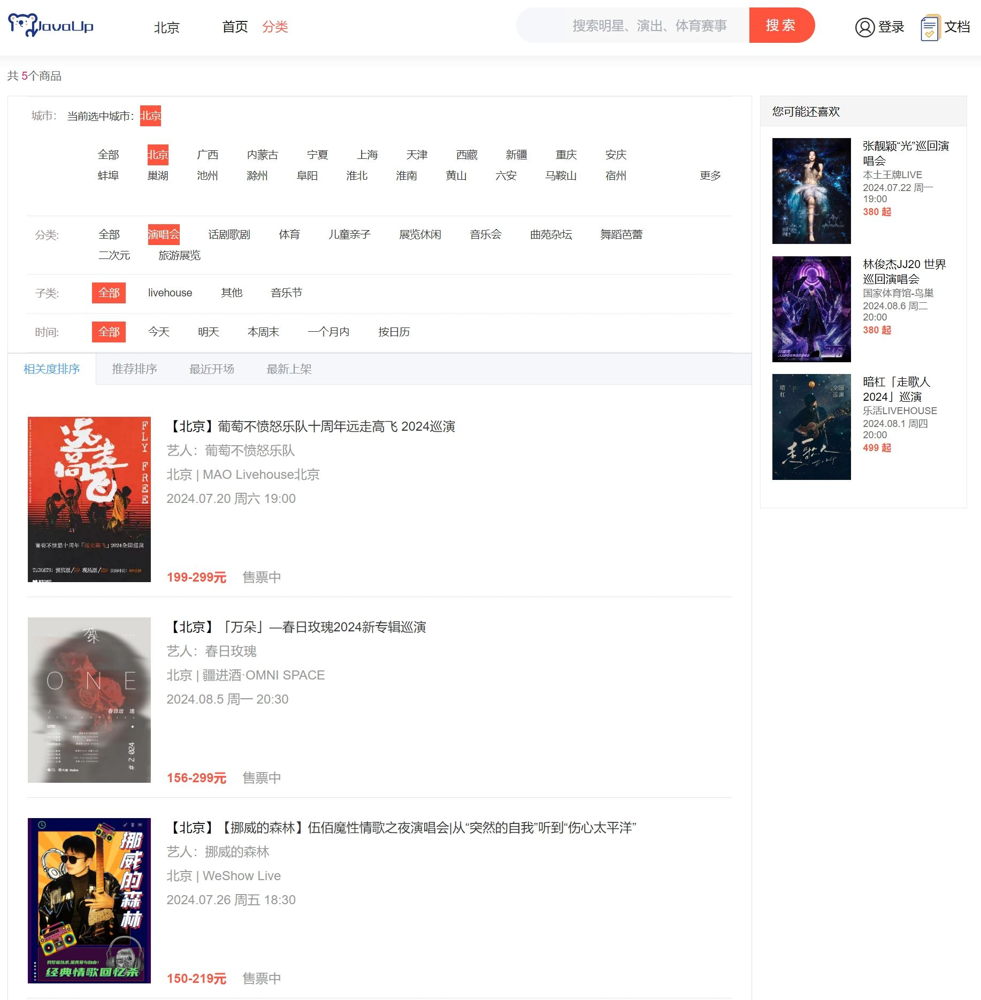
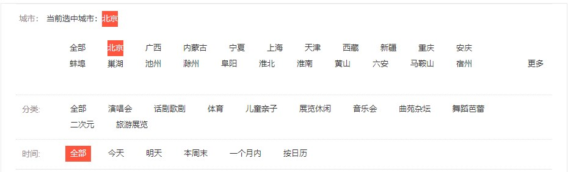

# 业务讲解-如何在分库分表情况下分页显示节目列表

### 分页列表样式





接下来我们来详细的讲解分页的数据是如何进行显示的


# damai-program-service
### 接口
**ProgramPageListDto**

```java
@Data
@ApiModel(value="ProgramPageListDto", description ="节目分页")
public class ProgramPageListDto extends BasePageDto{
    
    @ApiModelProperty(name ="areaId", dataType ="Long", value ="所在区域id")
    private Long areaId;
    
    @ApiModelProperty(name ="parentProgramCategoryId", dataType ="Long", value ="父节目类型id")
    private Long parentProgramCategoryId;
    
    @ApiModelProperty(name ="programCategoryId", dataType ="Long", value ="节目类型id")
    private Long programCategoryId;
    
    @ApiModelProperty(name ="timeType", dataType ="Integer", value ="0:全部 1:今天 2:明天 3:一周内 4:一个月内 5:按日历",required = true)
    @NotNull
    private Integer timeType;
    
    @ApiModelProperty(name ="startDateTime", dataType ="Date", value ="开始时间(如果timeType = 5，此项必填)")
    private Date startDateTime;
    
    @ApiModelProperty(name ="endDateTime", dataType ="Date", value ="结束时间(如果timeType = 5，此项必填)")
    private Date endDateTime;
    
    @ApiModelProperty(name ="type", dataType ="Integer", value ="查询方式 1:相关度排序(默认) 2:推荐排序 3:最近开场 4:最新上架")
    private Integer type = 1;
}
```


**ProgramPageListDto**继承了**BasePageDto**，BasePageDto是分页的入参基础类，里面是分页必传的参数


```java
@Data
@ApiModel(value="BasePageDto", description ="分页")
public class BasePageDto {
    
    @ApiModelProperty(name ="pageNumber", dataType ="Integer", value ="页码",required = true)
    @NotNull
    private Integer pageNumber;
    
    @ApiModelProperty(name ="pageSize", dataType ="Integer", value ="页大小",required = true)
    @NotNull
    private Integer pageSize;
}
```


这个入参需要详细的讲解下，入参实体的字段和分页查询的条件是一一对应起来的




+ **areaId** 选择全部，则不用传参数。选择具体城市，则传入对应的地区id
+ **parentProgramCategoryId** 选择全部，则不用传参数。选择具体分类，则传入对应的父节目类型id
+ **programCategoryId** 选择全部，则不用传参数。选择具体子类，则传入对应的节目类型id
+ **timeType** 按时间范围传入对应的状态 0:全部 1:今天 2:明天 3:一周内 4:一个月内 5:按日历
+ **startDateTime**和**endDateTime** 在timeType = 5时，两个参数必填，都为选择的日期即可 时间精确到日，如 2024-03-11
+ **type** 查询方式 1:相关度排序(默认) 2:推荐排序 3:最近开场 4:最新上架


### 控制层
**com.damai.controller.ProgramController#selectPage**

```java
@ApiOperation(value = "查询分页列表")
@PostMapping(value = "/page")
public ApiResponse<PageVo<ProgramListVo>> selectPage(@Valid @RequestBody ProgramPageListDto programPageListDto) {
    return ApiResponse.ok(programService.selectPage(programPageListDto));
}
```


这里要注意**ProgramPageListDto**中的**timeType**的处理，要根据不同的状态来设置不同的时间范围参数，这点在下面会详细的讲解


### service层
**com.damai.service.ProgramService#selectPage**

```java
public PageVo<ProgramListVo> selectPage(ProgramPageListDto programPageListDto) {
    //处理时间范围参数
    setQueryTime(programPageListDto);
    //使用elasticsearch查询
    PageVo<ProgramListVo> pageVo = programEs.selectPage(programPageListDto);
    if (CollectionUtil.isNotEmpty(pageVo.getList())) {
        return pageVo;
    }
    //elasticsearch查询不到，在数据库中查询
    return dbSelectPage(programPageListDto);
}
```


先是处理时间范围查询参数，然后去elasticsearch查询，如果查询不到，最后再去数据库中查询。<font style="color:#213BC0;">之所以用elasticsearch查询的原因是，因为查询的条件中没有节目主键id分片键，所以在数据库中查询会造成读扩散全路由的问题</font>，这个问题在主页列表显示中同样存在，也是用elasticsearch来解决的，但如果elasticsearch查询不到，那就只能去数据库中查询了


#### 处理时间范围参数
```java
public void setQueryTime(ProgramPageListDto programPageListDto){
    switch (programPageListDto.getTimeType()) {
        //今天
        case ProgramTimeType.TODAY:
            programPageListDto.setStartDateTime(DateUtils.now(FORMAT_DATE));
            programPageListDto.setEndDateTime(DateUtils.now(FORMAT_DATE));
            break;
        //明天
        case ProgramTimeType.TOMORROW:
            programPageListDto.setStartDateTime(DateUtils.now(FORMAT_DATE));
            programPageListDto.setEndDateTime(DateUtils.addDay(DateUtils.now(FORMAT_DATE),1));
            break;
        //一周内
        case ProgramTimeType.WEEK:
            programPageListDto.setStartDateTime(DateUtils.now(FORMAT_DATE));
            programPageListDto.setEndDateTime(DateUtils.addWeek(DateUtils.now(FORMAT_DATE),1));
            break;
        //一个月内
        case ProgramTimeType.MONTH:
            programPageListDto.setStartDateTime(DateUtils.now(FORMAT_DATE));
            programPageListDto.setEndDateTime(DateUtils.addMonth(DateUtils.now(FORMAT_DATE),1));
            break;
        //按日历
        case ProgramTimeType.CALENDAR:
            if (Objects.isNull(programPageListDto.getStartDateTime())) {
                throw new DaMaiFrameException(BaseCode.START_DATE_TIME_NOT_EXIST);
            }
            if (Objects.isNull(programPageListDto.getEndDateTime())) {
                throw new DaMaiFrameException(BaseCode.END_DATE_TIME_NOT_EXIST);
            }
            break;
        //默认(全部)
        default:
            programPageListDto.setStartDateTime(null);
            programPageListDto.setEndDateTime(null);
            break;
    }
}
```


在此方法中，通过入参对象中的**timeType**状态值不同，来分别对**startDateTime**和**endDateTime**进行设值，今天、明天、一周内、一个月内是自动设置上开始时间和结束时间参数。**按日历是直接使用传入的参数值**。全部是将两个参数值设为空，不作为条件查询


#### 使用elasticsearch查询


**com.damai.service.es.ProgramEs#selectPage**

```java
public PageVo<ProgramListVo> selectPage(ProgramPageListDto programPageListDto) {
    PageVo<ProgramListVo> pageVo = new PageVo<>();
    try {
        List<EsDataQueryDto> esDataQueryDtoList = new ArrayList<>();
        
        if (Objects.nonNull(programPageListDto.getAreaId())) {
                //地区id条件
                EsDataQueryDto areaIdQueryDto = new EsDataQueryDto();
                areaIdQueryDto.setParamName(ProgramDocumentParamName.AREA_ID);
                areaIdQueryDto.setParamValue(programPageListDto.getAreaId());
                esDataQueryDtoList.add(areaIdQueryDto);
        }else {
            //如果查全部地区，那么需要指定同一个节目分组内的主要节目
            EsDataQueryDto primeQueryDto = new EsDataQueryDto();
            primeQueryDto.setParamName(ProgramDocumentParamName.PRIME);
            primeQueryDto.setParamValue(BusinessStatus.YES.getCode());
            esDataQueryDtoList.add(primeQueryDto);
        }
        //父节目类型条件
        if (Objects.nonNull(programPageListDto.getParentProgramCategoryId())) {
            EsDataQueryDto parentProgramCategoryIdQueryDto = new EsDataQueryDto();
            parentProgramCategoryIdQueryDto.setParamName(ProgramDocumentParamName.PARENT_PROGRAM_CATEGORY_ID);
            parentProgramCategoryIdQueryDto.setParamValue(programPageListDto.getParentProgramCategoryId());
            esDataQueryDtoList.add(parentProgramCategoryIdQueryDto);
        }
        //节目类型条件
        if (Objects.nonNull(programPageListDto.getProgramCategoryId())) {
            EsDataQueryDto programCategoryIdQueryDto = new EsDataQueryDto();
            programCategoryIdQueryDto.setParamName(ProgramDocumentParamName.PROGRAM_CATEGORY_ID);
            programCategoryIdQueryDto.setParamValue(programPageListDto.getProgramCategoryId());
            esDataQueryDtoList.add(programCategoryIdQueryDto);
        }
        //开始日期和结束日期条件
        if (Objects.nonNull(programPageListDto.getStartDateTime()) && 
                Objects.nonNull(programPageListDto.getEndDateTime())) {
            EsDataQueryDto showDayTimeQueryDto = new EsDataQueryDto();
            showDayTimeQueryDto.setParamName(ProgramDocumentParamName.SHOW_DAY_TIME);
            showDayTimeQueryDto.setStartTime(programPageListDto.getStartDateTime());
            showDayTimeQueryDto.setEndTime(programPageListDto.getEndDateTime());
            esDataQueryDtoList.add(showDayTimeQueryDto);
        }
        //构建排序信息
        ProgramPageOrder programPageOrder = getProgramPageOrder(programPageListDto);

        PageInfo<ProgramListVo> programListVoPageInfo = businessEsHandle.queryPage(
                SpringUtil.getPrefixDistinctionName() + "-" + ProgramDocumentParamName.INDEX_NAME,
                ProgramDocumentParamName.INDEX_TYPE, esDataQueryDtoList, programPageOrder.sortParam, 
                programPageOrder.sortOrder, programPageListDto.getPageNumber(), programPageListDto.getPageSize(), 
                ProgramListVo.class);
        pageVo = PageUtil.convertPage(programListVoPageInfo, programListVo -> programListVo);
    }catch (Exception e) {
        log.error("selectPage error",e);
    }
    return pageVo;
}
```


这里使用了对elasticsearch进行封装的组件**damai-elasticsearch-framework**，关于此组件的详细介绍，可跳转到

[组件讲解-如何对Elasticsearch进行高效封装](https://www.yuque.com/u22210564/ykdrdh/ti6u5ovgfuhftlum)


### 注意
主页的列表数据要显示的并不是只有节目表中的数据，还有`programCategoryName、showTime、showDayTime、showWeekTime、minPrice、maxPrice`这些都是要从其他表中获取的，至于为什么从elasticsearch中可以直接查询出来，是因为在项目初始化时，将这些数据都已经组装好了，才放入到elasticsearch中的，


关于是如何将数据组装好后放入elasticsearch中的，可跳转到相应介绍部分详细查看

[业务讲解-项目服务的数据初始化统一管理](https://www.yuque.com/u22210564/ykdrdh/vmvabhdvn1a30mi5)


elasticsearch中的存储结构：

```json
{
  "_index": "damai-program",
  "_id": "O0cw-48BBcQ0HdIVEfy0",
  "_version": 1,
  "_score": 0,
  "_source": {
    "prime": 1,
    "high_heat": 0,
    "showWeekTime": "周二",
    "parentProgramCategoryId": 1,
    "showDayTime": 1719849600000,
    "issueTime": -458816512,
    "parentProgramCategoryName": "演唱会",
    "showTime": 1719921600000,
    "title": "韦礼安「一直都在」音乐会",
    "actor": "韦礼安",
    "programGroupId": 2,
    "areaId": 2,
    "areaName": "北京",
    "itemPicture": "https://s21.ax1x.com/2024/06/06/pkYEY9K.png",
    "minPrice": 288,
    "programCategoryId": 1,
    "id": 2,
    "place": "JDG英特尔电子竞技中心",
    "maxPrice": 488,
    "programCategoryName": "演唱会"
  },
  "fields": {
    "high_heat": [
      0
    ],
    "issueTime": [
      "1969-12-26T16:33:03.488Z"
    ],
    "actor.keyword": [
      "韦礼安"
    ],
    "title": [
      "韦礼安「一直都在」音乐会"
    ],
    "title.keyword": [
      "韦礼安「一直都在」音乐会"
    ],
    "itemPicture.keyword": [
      "https://s21.ax1x.com/2024/06/06/pkYEY9K.png"
    ],
    "areaName": [
      "北京"
    ],
    "itemPicture": [
      "https://s21.ax1x.com/2024/06/06/pkYEY9K.png"
    ],
    "programCategoryId": [
      1
    ],
    "place": [
      "JDG英特尔电子竞技中心"
    ],
    "id": [
      2
    ],
    "programCategoryName": [
      "演唱会"
    ],
    "showWeekTime": [
      "周二"
    ],
    "prime": [
      1
    ],
    "parentProgramCategoryId": [
      1
    ],
    "showDayTime": [
      "2024-07-01T16:00:00.000Z"
    ],
    "parentProgramCategoryName": [
      "演唱会"
    ],
    "showTime": [
      "2024-07-02T12:00:00.000Z"
    ],
    "parentProgramCategoryName.keyword": [
      "演唱会"
    ],
    "showWeekTime.keyword": [
      "周二"
    ],
    "areaName.keyword": [
      "北京"
    ],
    "actor": [
      "韦礼安"
    ],
    "programCategoryName.keyword": [
      "演唱会"
    ],
    "programGroupId": [
      2
    ],
    "areaId": [
      2
    ],
    "minPrice": [
      288
    ],
    "maxPrice": [
      488
    ],
    "place.keyword": [
      "JDG英特尔电子竞技中心"
    ]
  }
}
```


### 从数据库中查询
**com.damai.service.ProgramService#dbSelectPage**

当从elasticsearch中查询不到的话，就只有从数据库中查询了，全路由查询也比没有数据要好

```java
public PageVo<ProgramListVo> dbSelectPage(ProgramPageListDto programPageListDto) {
    //需要program和program_show_time连表查询
    IPage<ProgramJoinShowTime> iPage = 
            programMapper.selectPage(PageUtil.getPageParams(programPageListDto), programPageListDto);
    //如果查询的节目列表为空，则直接返回pageVo对象
    if (CollectionUtil.isEmpty(iPage.getRecords())) {
        return new PageVo<>(iPage.getCurrent(), iPage.getSize(), iPage.getTotal(), new ArrayList<>());
    }
    //根据节目列表获得节目类型id列表
    Set<Long> programCategoryIdList = 
            iPage.getRecords().stream().map(Program::getProgramCategoryId).collect(Collectors.toSet());
    //根据id来查询节目类型列表map，key：节目类型id，value：节目类型名
    Map<Long, String> programCategoryMap = selectProgramCategoryMap(programCategoryIdList);

    //节目id集合
    List<Long> programIdList = iPage.getRecords().stream().map(Program::getId).collect(Collectors.toList());
    //根据节目id统计出票档的最低价和最高价的集合map, key：节目id，value：票档
    Map<Long, TicketCategoryAggregate> ticketCategorieMap = selectTicketCategorieMap(programIdList);
    //查询区域
    Map<Long,String> tempAreaMap = new HashMap<>(64);
    AreaSelectDto areaSelectDto = new AreaSelectDto();
    areaSelectDto.setIdList(iPage.getRecords().stream().map(Program::getAreaId).distinct().collect(Collectors.toList()));
    ApiResponse<List<AreaVo>> areaResponse = baseDataClient.selectByIdList(areaSelectDto);
    if (Objects.equals(areaResponse.getCode(), ApiResponse.ok().getCode())) {
        if (CollectionUtil.isNotEmpty(areaResponse.getData())) {
            tempAreaMap = areaResponse.getData().stream()
                    .collect(Collectors.toMap(AreaVo::getId,AreaVo::getName,(v1,v2) -> v2));
        }
    }else {
        log.error("base-data selectByIdList rpc error areaResponse:{}", JSON.toJSONString(areaResponse));
    }

    Map<Long,String> areaMap = tempAreaMap;
    return PageUtil.convertPage(iPage, programJoinShowTime -> {
        ProgramListVo programListVo = new ProgramListVo();
        BeanUtil.copyProperties(programJoinShowTime, programListVo);
        //区域名字
        programListVo.setAreaName(areaMap.get(programJoinShowTime.getAreaId()));
        //节目名字
        programListVo.setProgramCategoryName(programCategoryMap.get(programJoinShowTime.getProgramCategoryId()));
        //最低价
        programListVo.setMinPrice(Optional.ofNullable(ticketCategorieMap.get(programJoinShowTime.getId()))
                .map(TicketCategoryAggregate::getMinPrice).orElse(null));
        //最高价
        programListVo.setMaxPrice(Optional.ofNullable(ticketCategorieMap.get(programJoinShowTime.getId()))
                .map(TicketCategoryAggregate::getMaxPrice).orElse(null));
        return programListVo;
    });
}
```


接下来一步步的详细分析查询过程


#### program和program_show_time连表查询
```java
IPage<ProgramJoinShowTime> iPage = 
        programMapper.selectPage(PageUtil.getPageParams(programPageListDto), programPageListDto);
//如果查询的节目列表为空，则直接返回pageVo对象
if (CollectionUtil.isEmpty(iPage.getRecords())) {
    return new PageVo<>(iPage.getCurrent(), iPage.getSize(), iPage.getTotal(), new ArrayList<>());
}
```


这里因为时间范围的参数要根据**show_day_time**查询，所以要**program和program_show_time连表查询**，既然是连表查询那么就要自定义sql，自定义sql的分页需要将Mybatisplus的分页对象传入，这里写个分页工具类**PageUtil**，来支持此功能


**com.damai.page.PageUtil#getPageParams(com.damai.dto.BasePageDto)**


```java
public static <T> IPage<T> getPageParams(BasePageDto basePageDto) {
    return getPageParams(basePageDto.getPageNumber(), basePageDto.getPageSize());
}

public static <T> IPage<T> getPageParams(int pageNumber, int pageSize) {
    return new Page<>(pageNumber, pageSize);
}
```


**自定义连表sql**


```java
/**
 * 分页查询
 * @param page 分页对象
 * @param programPageListDto 参数
 * @return 结果
 * */
IPage<ProgramJoinShowTime> selectPage(IPage<ProgramJoinShowTime> page, 
                                      @Param("programPageListDto")ProgramPageListDto programPageListDto);
```


```xml
<select id="selectPage" parameterType="com.damai.dto.ProgramPageListDto" resultType="com.damai.entity.ProgramJoinShowTime">
    select
        dp.id,dp.area_id,dp.program_category_id,dp.parent_program_category_id,dp.title,dp.actor,
        dp.place,dp.item_picture,ds.show_time,ds.show_week_time,ds.show_day_time
    from 
        d_program dp left join d_program_show_time ds
    on dp.id = ds.program_id
    where 
        dp.status = 1 and ds.status = 1 and dp.program_status = 1
        <if test ='programPageListDto.areaId == null'>
            and dp.prime = 1
        </if>
        <if test ='programPageListDto.areaId != null'>
         and dp.area_id = #{programPageListDto.areaId,jdbcType=BIGINT} 
        </if>
        <if test = 'programPageListDto.programCategoryId != null'>
            and dp.program_category_id = #{programPageListDto.programCategoryId,jdbcType=BIGINT}
        </if>
        <if test = 'programPageListDto.parentProgramCategoryId != null'>
            and dp.parent_program_category_id = #{programPageListDto.parentProgramCategoryId,jdbcType=BIGINT}
        </if>
        <if test = 'programPageListDto.startDateTime != null'>
          and ds.show_day_time &gt;= #{programPageListDto.startDateTime}
        </if>
        <if test = 'programPageListDto.endDateTime != null'>
          and ds.show_day_time &lt;= #{programPageListDto.endDateTime}
        </if>
    <if test="programPageListDto.type == 2">
        order by dp.high_heat desc
    </if>
    <if test="programPageListDto.type == 3">
        order by ds.show_time asc
    </if>
    <if test="programPageListDto.type == 4">
        order by dp.issue_time asc
    </if>
</select>
```


查询的条件也是入参传入的参数，这里的返回实体类是**com.damai.entity.ProgramJoinShowTime**，因为是连表查询，要把演出时间数据也要映射到实体中，**Program**实体是对节目表的映射实体，连表的数据不适合放在此中，所以额外有一个连表的实体对象来映射起来


**com.damai.entity.ProgramJoinShowTime**

```java
@Data
public class ProgramJoinShowTime extends Program implements Serializable {

    private static final long serialVersionUID = 1L;
    
    /**
     * 演出时间
     */
    private Date showTime;
    
    /**
     * 演出时间(精确到天)
     */
    private Date showDayTime;
    
    /**
     * 演出时间所在的星期
     */
    private String showWeekTime;
}
```


其实就是继承了**Program**，额外添加了`showTime、showDayTime、showWeekTime`


#### 查询节目类型数据
```java
//根据节目列表获得节目类型id列表
Set<Long> programCategoryIdList = 
        iPage.getRecords().stream().map(Program::getProgramCategoryId).collect(Collectors.toSet());
//根据id来查询节目类型列表map，key：节目类型id，value：节目类型名
Map<Long, String> programCategoryMap = selectProgramCategoryMap(programCategoryIdList);
```


```java
/**
 * 根据节目类型id集合查询节目类型名字
 * @param programCategoryIdList 节目类型id集合
 * @return Map<Long, String> key：节目类型id value：节目类型名字
 * */
public Map<Long, String> selectProgramCategoryMap(Collection<Long> programCategoryIdList){
    LambdaQueryWrapper<ProgramCategory> pcLambdaQueryWrapper = Wrappers.lambdaQuery(ProgramCategory.class)
            .in(ProgramCategory::getId, programCategoryIdList);
    List<ProgramCategory> programCategoryList = programCategoryMapper.selectList(pcLambdaQueryWrapper);
    return programCategoryList
            .stream()
            .collect(Collectors.toMap(ProgramCategory::getId, ProgramCategory::getName, (v1, v2) -> v2));
}
```


#### 统计出票档的最低价和最高价
```java
//节目id集合
List<Long> programIdList = iPage.getRecords().stream().map(Program::getId).collect(Collectors.toList());
//根据节目id统计出票档的最低价和最高价的集合map, key：节目id，value：票档
Map<Long, TicketCategoryAggregate> ticketCategorieMap = selectTicketCategorieMap(programIdList);
```


```java
public Map<Long, TicketCategoryAggregate> selectTicketCategorieMap(List<Long> programIdList){
    //根据节目id统计出票档的最低价和最高价的集合
    List<TicketCategoryAggregate> ticketCategorieList = ticketCategoryMapper.selectAggregateList(programIdList);
    //将集合转换为map，key：节目id，value：票档
    return ticketCategorieList
            .stream()
            .collect(Collectors.toMap(TicketCategoryAggregate::getProgramId, ticketCategory -> ticketCategory, (v1, v2) -> v2));
}
```


#### 查询区域名
```java
//查询区域
Map<Long,String> tempAreaMap = new HashMap<>(64);
AreaSelectDto areaSelectDto = new AreaSelectDto();
areaSelectDto.setIdList(iPage.getRecords().stream().map(Program::getAreaId).distinct().collect(Collectors.toList()));
ApiResponse<List<AreaVo>> areaResponse = baseDataClient.selectByIdList(areaSelectDto);
if (Objects.equals(areaResponse.getCode(), ApiResponse.ok().getCode())) {
    if (CollectionUtil.isNotEmpty(areaResponse.getData())) {
        tempAreaMap = areaResponse.getData().stream()
                .collect(Collectors.toMap(AreaVo::getId,AreaVo::getName,(v1,v2) -> v2));
    }
}else {
    log.error("base-data selectByIdList rpc error areaResponse:{}", JSON.toJSONString(areaResponse));
}
```


#### 组装分页列表需要的数据
```java
Map<Long,String> areaMap = tempAreaMap;
return PageUtil.convertPage(iPage, programJoinShowTime -> {
    ProgramListVo programListVo = new ProgramListVo();
    BeanUtil.copyProperties(programJoinShowTime, programListVo);
    //区域名字
    programListVo.setAreaName(areaMap.get(programJoinShowTime.getAreaId()));
    //节目名字
    programListVo.setProgramCategoryName(programCategoryMap.get(programJoinShowTime.getProgramCategoryId()));
    //最低价
    programListVo.setMinPrice(Optional.ofNullable(ticketCategorieMap.get(programJoinShowTime.getId()))
            .map(TicketCategoryAggregate::getMinPrice).orElse(null));
    //最高价
    programListVo.setMaxPrice(Optional.ofNullable(ticketCategorieMap.get(programJoinShowTime.getId()))
            .map(TicketCategoryAggregate::getMaxPrice).orElse(null));
    return programListVo;
});
```


**Map<Long,String> areaMap = tempAreaMap;**这么做的原因是lambda表达式中的变量默认是final，也就是一旦生成不允许再次赋值，在查询区域名的流程中，对tempAreaMap进行了二次赋值，所以重新创建一个areaMap


使用**PageUtil.convertPage**来对Mybatisplus的分页对象进行转换，并完成集合中的泛型 programJoinShowTime 转换为 programListVo 的操作


**com.damai.page.PageUtil#convertPage**

```java
public static <OLD,NEW> PageVo<NEW> convertPage(IPage<OLD> iPage, Function<? super OLD, ? extends NEW> function){
    return new PageVo<>(iPage.getCurrent(),
            iPage.getSize(),
            iPage.getTotal(),
            iPage.getRecords().stream().map(function).collect(Collectors.toList()));
}
```


将数据组装好后，就可以直接返回前端了，返回数据示例：

```json
{
    "code": "0",
    "message": "",
    "data": {
        "pageNum": "1",
        "pageSize": "10",
        "totalSize": "1",
        "list": [
            {
                "id": "3",
                "title": "冬季恋歌—《请回答1988》韩剧主题曲演唱会",
                "actor": "冬季恋歌",
                "place": "秦乐宫剧院",
                "itemPicture": "img.alicdn.com/bao/uploaded/https://img.alicdn.com/imgextra/i2/2251059038/O1CN01tEJkEK2GdSYJ19cF5_!!2251059038.jpg_q60.jpg_.webp",
                "areaId": "2",
                "areaName": "北京",
                "programCategoryId": "1",
                "programCategoryName": "演唱会",
                "showTime": "2024-03-14 19:30:00",
                "showDayTime": "2024-03-14 00:00:00",
                "showWeekTime": "周四",
                "minPrice": "108",
                "maxPrice": "338"
            }
        ]
    }
}
```


> 更新: 2024-07-09 16:36:31  
> 原文: <https://www.yuque.com/u22210564/ykdrdh/ssmp7d1c8cy0q8gr>