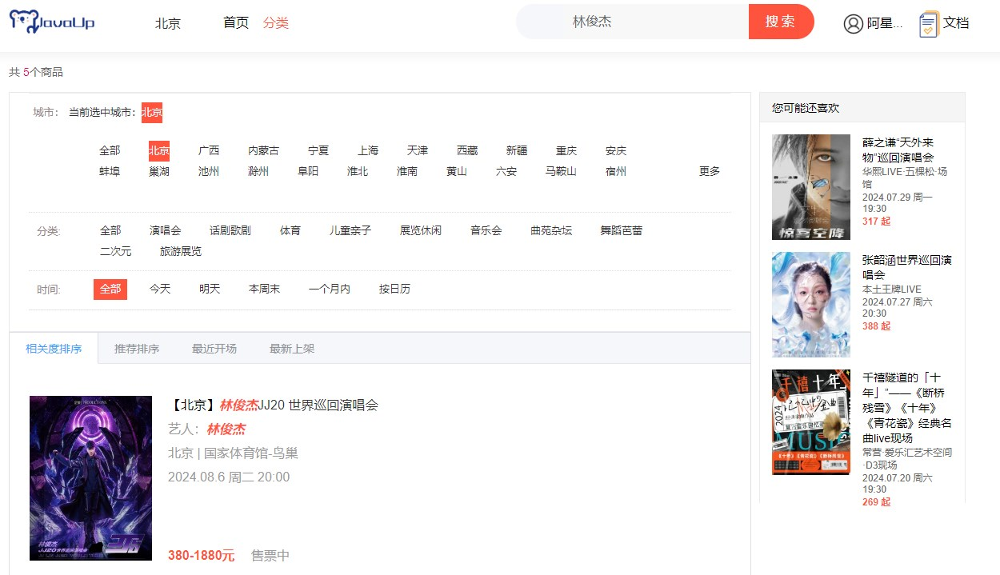

# 业务讲解-如何实现节目智能搜索功能

### 搜索功能样式



搜索功能需要对明星或者节目标题进行搜索，而且可以将输入的内容进行**分词搜索**，这没什么好说的了，直接用elasticsearch


# damai-program-service
### 接口
**com.damai.dto.ProgramSearchDto**

```java
@Data
@ApiModel(value="ProgramSearchDto", description ="节目搜索")
public class ProgramSearchDto extends ProgramPageListDto{
    
    @ApiModelProperty(name ="content", dataType ="String", value ="搜索内容")
    private String content;
}
```


**ProgramSearchDto**继承了**ProgramPageListDto**，因为搜索也会传入`areaId、parentProgramCategoryId、timeType、startDateTime、endDateTime`的查询条件


```java
@Data
@ApiModel(value="ProgramPageListDto", description ="节目分页")
public class ProgramPageListDto extends BasePageDto{
    
    @ApiModelProperty(name ="areaId", dataType ="Long", value ="所在区域id")
    private Long areaId;
    
    @ApiModelProperty(name ="parentProgramCategoryId", dataType ="Long", value ="父节目类型id")
    private Long parentProgramCategoryId;
    
    @ApiModelProperty(name ="programCategoryId", dataType ="Long", value ="节目类型id")
    private Long programCategoryId;
    
    @ApiModelProperty(name ="timeType", dataType ="Integer", value ="0:全部 1:今天 2:明天 3:一周内 4:一个月内 5:按日历",required = true)
    @NotNull
    private Integer timeType;
    
    @ApiModelProperty(name ="startDateTime", dataType ="Date", value ="开始时间(如果timeType = 5，此项必填)")
    private Date startDateTime;
    
    @ApiModelProperty(name ="endDateTime", dataType ="Date", value ="结束时间(如果timeType = 5，此项必填)")
    private Date endDateTime;
    
        @ApiModelProperty(name ="type", dataType ="Integer", value ="查询方式 1:相关度排序(默认) 2:推荐排序 3:最近开场 4:最新上架")
    private Integer type = 1;
}
```


**ProgramPageListDto**又继承了**BasePageDto**，BasePageDto是分页的入参基础类，里面是分页必传的参数


```java
@Data
@ApiModel(value="BasePageDto", description ="分页")
public class BasePageDto {
    
    @ApiModelProperty(name ="pageNumber", dataType ="Integer", value ="页码",required = true)
    @NotNull
    private Integer pageNumber;
    
    @ApiModelProperty(name ="pageSize", dataType ="Integer", value ="页大小",required = true)
    @NotNull
    private Integer pageSize;
}
```


这个入参在分页节目显示功能中已经讲解了，这里再复习下，入参实体的字段和分页查询的条件是一一对应起来的


+ **areaId** 选择全部，则不用传参数。选择具体城市，则传入对应的地区id
+ **programCategoryId** 选择全部，则不用传参数。选择具体子类，则传入对应的节目类型id
+ **timeType** 按时间范围传入对应的状态 0:全部 1:今天 2:明天 3:一周内 4:一个月内 5:按日历
+ **startDateTime**和**endDateTime** 在timeType = 5时，两个参数必填，都为选择的日期即可 时间精确到日，如 2024-03-11
+ **type** 查询方式 1:相关度排序(默认) 2:推荐排序 3:最近开场 4:最新上架


### 控制层
**com.damai.controller.ProgramController#search**

```java
@ApiOperation(value = "搜索")
@PostMapping(value = "/search")
public ApiResponse<PageVo<ProgramListVo>> search(@Valid @RequestBody ProgramSearchDto programSearchDto) {
    return ApiResponse.ok(programService.search(programSearchDto));
}
```


这里要注意**ProgramPageListDto**中的**timeType**的处理，要根据不同的状态来设置不同的时间范围参数，这点在下面会详细的讲解


### service层


**com.damai.service.ProgramService#search**

```java
public PageVo<ProgramListVo> search(ProgramSearchDto programSearchDto) {
    //处理时间范围参数
    setQueryTime(programSearchDto);
    //使用elasticsearch查询
    return programEs.search(programSearchDto);
}
```


#### 处理时间范围参数
```java
public void setQueryTime(ProgramPageListDto programPageListDto){
    switch (programPageListDto.getTimeType()) {
        //今天
        case ProgramTimeType.TODAY:
            programPageListDto.setStartDateTime(DateUtils.now(FORMAT_DATE));
            programPageListDto.setEndDateTime(DateUtils.now(FORMAT_DATE));
            break;
        //明天
        case ProgramTimeType.TOMORROW:
            programPageListDto.setStartDateTime(DateUtils.now(FORMAT_DATE));
            programPageListDto.setEndDateTime(DateUtils.addDay(DateUtils.now(FORMAT_DATE),1));
            break;
        //一周内
        case ProgramTimeType.WEEK:
            programPageListDto.setStartDateTime(DateUtils.now(FORMAT_DATE));
            programPageListDto.setEndDateTime(DateUtils.addWeek(DateUtils.now(FORMAT_DATE),1));
            break;
        //一个月内
        case ProgramTimeType.MONTH:
            programPageListDto.setStartDateTime(DateUtils.now(FORMAT_DATE));
            programPageListDto.setEndDateTime(DateUtils.addMonth(DateUtils.now(FORMAT_DATE),1));
            break;
        //按日历
        case ProgramTimeType.CALENDAR:
            if (Objects.isNull(programPageListDto.getStartDateTime())) {
                throw new DaMaiFrameException(BaseCode.START_DATE_TIME_NOT_EXIST);
            }
            if (Objects.isNull(programPageListDto.getEndDateTime())) {
                throw new DaMaiFrameException(BaseCode.END_DATE_TIME_NOT_EXIST);
            }
            break;
        //默认(全部)
        default:
            programPageListDto.setStartDateTime(null);
            programPageListDto.setEndDateTime(null);
            break;
    }
}
```


在此方法中，通过入参对象中的**timeType**状态值不同，来分别对**startDateTime**和**endDateTime**进行设值：

+ 今天、明天、一周内、一个月内是自动设置上开始时间和结束时间参数
+ 按日历查询是直接使用传入的参数值
+ 全部查询是将两个参数值设为空，不作为条件查询


### 使用elasticsearch查询


**com.damai.service.es.ProgramEs#search**

```java
public PageVo<ProgramListVo> search(ProgramSearchDto programSearchDto) {
    PageVo<ProgramListVo> pageVo = new PageVo<>();
    try {
        //创建最外层的 BoolQueryBuilder
        BoolQueryBuilder boolQuery = QueryBuilders.boolQuery();
        //areaId条件查询
        if (Objects.nonNull(programSearchDto.getAreaId())) {
            QueryBuilder builds = QueryBuilders.termQuery(ProgramDocumentParamName.AREA_ID, programSearchDto.getAreaId());
            boolQuery.must(builds);
        }
        //父节目类型id条件查询
        if (Objects.nonNull(programSearchDto.getParentProgramCategoryId())) {
            QueryBuilder builds = QueryBuilders.termQuery(ProgramDocumentParamName.PARENT_PROGRAM_CATEGORY_ID, programSearchDto.getParentProgramCategoryId());
            boolQuery.must(builds);
        }
        //时间范围条件查询
        if (Objects.nonNull(programSearchDto.getStartDateTime()) &&
                Objects.nonNull(programSearchDto.getEndDateTime())) {
            QueryBuilder builds = QueryBuilders.rangeQuery(ProgramDocumentParamName.SHOW_DAY_TIME)
                    .from(programSearchDto.getStartDateTime()).to(programSearchDto.getEndDateTime()).includeLower(true);
            boolQuery.must(builds);
        }
        //输入内容条件查询
        if (StringUtil.isNotEmpty(programSearchDto.getContent())) {
            // 创建内层的 BoolQueryBuilder 用于处理 title 或 actor 的 OR 查询
            BoolQueryBuilder innerBoolQuery = QueryBuilders.boolQuery();
            //按节目标题搜索
            innerBoolQuery.should(QueryBuilders.matchQuery(ProgramDocumentParamName.TITLE, programSearchDto.getContent()));
            //按艺人名字搜索
            innerBoolQuery.should(QueryBuilders.matchQuery(ProgramDocumentParamName.ACTOR, programSearchDto.getContent()));
            // 确保至少有一个 should 条件匹配
            innerBoolQuery.minimumShouldMatch(1);
            // 将内层的 BoolQueryBuilder 添加到最外层的查询中
            boolQuery.must(innerBoolQuery);
        }
        //使用 SearchSourceBuilder 构建最终的查询
        SearchSourceBuilder searchSourceBuilder = new SearchSourceBuilder();
        //构建排序信息
        ProgramPageOrder programPageOrder = getProgramPageOrder(programSearchDto);
        if (Objects.nonNull(programPageOrder.sortParam) && Objects.nonNull(programPageOrder.sortOrder)) {
            FieldSortBuilder sort = SortBuilders.fieldSort(programPageOrder.sortParam);
            sort.order(programPageOrder.sortOrder);
            searchSourceBuilder.sort(sort);
        }
        searchSourceBuilder.query(boolQuery);
        //设置是否计算总命中数
        searchSourceBuilder.trackTotalHits(true);
        //页码
        searchSourceBuilder.from((programSearchDto.getPageNumber() - 1) * programSearchDto.getPageSize());
        //页大小
        searchSourceBuilder.size(programSearchDto.getPageSize());
        //设置高亮显示字段
        searchSourceBuilder.highlighter(getHighlightBuilder(Arrays.asList(ProgramDocumentParamName.TITLE,
                    ProgramDocumentParamName.ACTOR)));
        //构建分页对象
        List<ProgramListVo> list = new ArrayList<>();
        PageInfo<ProgramListVo> pageInfo = new PageInfo<>(list);
        pageInfo.setPageNum(programSearchDto.getPageNumber());
        pageInfo.setPageSize(programSearchDto.getPageSize());
        //执行查询
        businessEsHandle.executeQuery(SpringUtil.getPrefixDistinctionName() + "-" + ProgramDocumentParamName.INDEX_NAME,
                ProgramDocumentParamName.INDEX_TYPE,list,pageInfo,ProgramListVo.class,searchSourceBuilder);
		//将PageInfo转换成PageVo
        pageVo = PageUtil.convertPage(pageInfo,programListVo -> programListVo);
    }catch (Exception e) {
        log.error("search error",e);
    }
    return pageVo;
}
```


搜索的功能查询的条件中，标题和艺人的条件搜索存在着**<font style="color:#213BC0;">多层的嵌套关系</font>**，所以用`damai-elasticsearch-framework`组件的查询方法是解决不了了，直接使用Springboot中的工具类**QueryBuilders**来查询，正好趁这个机会让小伙伴体会Springboot提供的**QueryBuilders**具体是怎么使用


### 构建查询条件
这里我们介绍到底如何构建条件的工具类**QueryBuilders**


`QueryBuilders`是Elasticsearch客户端提供的一个工具类，它用于构造各种类型的查询。`QueryBuilders`属于Elasticsearch的Java客户端库，它简化了查询的构建过程，使开发者能够以链式调用的方式快速构造出复杂的查询语句。这在与Spring Boot结合使用时特别有用，因为它允许开发者以Java的方式操作Elasticsearch，而不需要直接写复杂的JSON或DSL查询


#### **QueryBuilders**的主要作用：
1. **构造查询**：它提供了一系列静态方法来构造各种类型的查询，如全文搜索、布尔查询、范围查询等。这些查询可以用于执行精确匹配、模糊匹配、组合条件查询等
2. **简化查询语法**：开发者不需要深入了解Elasticsearch查询的具体语法，就可以利用`QueryBuilders`提供的方法来构建查询。这降低了学习和使用Elasticsearch的门槛


接着介绍在上述的搜索方法中，分别使用的**QueryBuilders**提供的方法都有什么作用


1. `**QueryBuilders.boolQuery()**`： 
    - Bool查询是一种复合查询，它结合了多个查询子句，并支持`must`（必须）、`should`（应该）、`must_not`（必须不）和`filter`（过滤）四种条件。这些条件可以帮助你构建逻辑复杂的查询
    - `must`表示返回的文档必须满足`must`子句的条件
    - `should`用于提供查询的软性条件，至少满足一个`should`子句（与`minimum_should_match`参数相关）
    - `must_not`指定返回的文档不得满足`must_not`子句中的条件
    - `filter`用于过滤文档，但不影响评分（适用于过滤性能优化）
2. `**QueryBuilders.termQuery(String fieldName, Object value)**`： 
    - Term查询是用于精确匹配的，它要求指定字段的值完全匹配提供的文本值。这种查询通常用于过滤确切值，如状态码、ID等
3. `**QueryBuilders.rangeQuery(String fieldName)**`： 
    - Range查询允许你在指定字段上设置范围条件，支持`from`（开始值）、`to`（结束值）、`includeLower`（是否包含下界）、`includeUpper`（是否包含上界）等设置。这种查询适用于需要根据数字范围、日期等进行筛选的场景
4. `**innerBoolQuery.should(QueryBuilder queryBuilder)**`： 
    - 这实际上是在构建一个Bool查询时，使用的`should`条件的方法。`innerBoolQuery`表示这是一个嵌套在其他查询内部的Bool查询，`should`方法允许你添加一个查询条件作为`Bool`查询的一部分。这个条件的文档不必满足所有`should`子句中的条件，但满足越多，文档的得分越高
5. `**QueryBuilders.matchQuery(String fieldName, Object text)**`： 
    - Match查询提供了对文本进行全文搜索的能力，它在指定字段中搜索与提供的文本匹配的文档。与Term查询不同，Match查询在进行匹配前会对字段值和查询文本进行分词处理，适合用于文本或内容的模糊匹配


#### 查询条件QueryBuilders构造好后，放入SearchSourceBuilder
`QueryBuilders` 提供的查询是 `SearchSourceBuilder` 的一部分。首先，使用 `QueryBuilders` 创建一个或多个 `QueryBuilder` 对象来定义你想要执行的查询条件。然后，将这些 `QueryBuilder` 对象通过 `SearchSourceBuilder` 的 `query` 方法设置到搜索请求中。`SearchSourceBuilder` 允许你进一步细化这个请求，


`**SearchSourceBuilder**`：这个类用于构建搜索请求的主体。它不仅包含了查询本身（通过`query(QueryBuilder queryBuilder)`方法设置），还可以设置搜索请求的其他方面：


1. **构建查询条件**：可以通过`SearchSourceBuilder`设置查询主体，例如使用`query(QueryBuilder queryBuilder)`方法传递一个由`QueryBuilders`创建的查询
2. **设置分页参数**：通过`from(int from)`和`size(int size)`方法，可以指定从结果集中的哪一条数据开始返回，以及返回多少条数据。这对于实现结果的分页显示非常有用
3. **排序**：可以通过添加排序条件来排序搜索结果，使用`sort(SortBuilder sort)`方法。例如，可以按照特定字段的值或者查询相关性（得分）进行排序
4. **高亮显示**：如果你希望在搜索结果中高亮显示匹配的文本，可以使用`highlighter(HighlightBuilder highlightBuilder)`方法来设置高亮显示的相关参数
5. **包含或排除字段**：使用`fetchSource(String[] includes, String[] excludes)`方法可以指定返回的文档中应包含或排除哪些字段。这对于减少响应大小和专注于特定数据非常有用
6. **聚合查询**：可以通过`aggregation(AggregationBuilder aggregation)`方法添加聚合查询，用于对数据进行分组统计分析


#### 设置高亮显示字段
```java
public HighlightBuilder getHighlightBuilder(List<String> fieldNameList){
    // 创建一个HighlightBuilder
    HighlightBuilder highlightBuilder = new HighlightBuilder();
    for (String fieldName : fieldNameList) {
        // 为特定字段添加高亮设置
        HighlightBuilder.Field highlightTitle = new HighlightBuilder.Field(fieldName);
        highlightTitle.preTags("<em>");
        highlightTitle.postTags("</em>");
        highlightBuilder.field(highlightTitle);
    }
    return highlightBuilder;
}
```


循环高亮显示集合**fieldNameList**，然后循环此集合，每个循环通过构建**HighlightBuilder**来使得高亮显示字段生效，并指定显示字段的前后标签


#### 当构建好查询条件后，然后再使用组件封装的执行方法**executeQuery**来执行


将SearchSourceBuilder构建好后，传入封装的**executeQuery**方法，进行执行然后再解析结果


**com.damai.util.BusinessEsHandle#executeQuery**


```java
/**
 * 执行查询
 * */
public <T> void executeQuery(String indexName, String indexType,List<T> list,PageInfo<T> pageInfo,Class<T> clazz, 
                             SearchSourceBuilder sourceBuilder,List<String> highLightFieldNameList) throws IOException {
    String string = sourceBuilder.toString();
    //设置请求头的操作类型，为json
    HttpEntity entity = new NStringEntity(string, ContentType.APPLICATION_JSON);
    StringBuilder endpointStringBuilder = new StringBuilder("/" + indexName);
    //如果开启type，则进行拼接
    if (esTypeSwitch) {
        endpointStringBuilder.append("/").append(indexType).append("/_search");
    }else {
        //没有开启type
        endpointStringBuilder.append("/_search");
    }
    String endpoint = endpointStringBuilder.toString();
    log.info("query execute query dsl : {}",string);
    Request request = new Request("POST",endpoint);
    request.setEntity(entity);
    request.addParameters(Collections.emptyMap());
    //执行请求
    Response response = restClient.performRequest(request);
    String result = EntityUtils.toString(response.getEntity());
    if (StringUtil.isEmpty(result)) {
        return;
    }
    //解析结果
    JSONObject resultJsonObject =  JSONObject.parseObject(result);
    if (Objects.isNull(resultJsonObject)) {
        return;
    }
    JSONObject hits = resultJsonObject.getJSONObject("hits");
    if (Objects.isNull(hits)) {
        return;
    }
    // 总条数
    Long value = null;
    if (esTypeSwitch) {
        value = hits.getLong("total");
    }else {
        JSONObject totalJsonObject = hits.getJSONObject("total");
        if (Objects.nonNull(totalJsonObject)) {
            value = totalJsonObject.getLong("value");
        }
    }
    if (Objects.nonNull(pageInfo) && Objects.nonNull(value)) {
        pageInfo.setTotal(value);
    }
    //解析数据
    JSONArray arrayData = hits.getJSONArray("hits");
    if (Objects.isNull(arrayData) || arrayData.isEmpty()) {
        return;
    }
    for (int i = 0, size = arrayData.size(); i < size; i++) {
        JSONObject data = arrayData.getJSONObject(i);
        if (Objects.isNull(data)) {
            continue;
        }
        //数据
        JSONObject jsonObject = data.getJSONObject("_source");
        //排序字段
        JSONArray jsonArray = data.getJSONArray("sort");
        if (Objects.nonNull(jsonArray) && !jsonArray.isEmpty()) {
            Long sort = jsonArray.getLong(0);
            jsonObject.put("sort",sort);
        }
        //高亮显示字段
        JSONObject highlight = data.getJSONObject("highlight");
        if (Objects.nonNull(highlight) && Objects.nonNull(highLightFieldNameList)) {
            for (String highLightFieldName : highLightFieldNameList) {
                JSONArray highLightFieldValue = highlight.getJSONArray(highLightFieldName);
                if (Objects.isNull(highLightFieldValue) || highLightFieldValue.isEmpty()) {
                    continue;
                }
                jsonObject.put(highLightFieldName,highLightFieldValue.get(0));
            }
        }
        list.add(JSONObject.parseObject(jsonObject.toJSONString(),clazz));
    }
}
```


#### 实际的执行语句
这里把实际生成的语句也贴出来，小伙伴一遍照着生成的语句一遍看着代码，可以更好的理解


```json
post damai-program/_search
{
    "from": 0,
    "size": 10,
    "query": {
        "bool": {
            "must": [
                {
                    "bool": {
                        "should": [
                            {
                                "match": {
                                    "title": {
                                        "query": "韦礼安",
                                        "operator": "OR",
                                        "prefix_length": 0,
                                        "max_expansions": 50,
                                        "fuzzy_transpositions": true,
                                        "lenient": false,
                                        "zero_terms_query": "NONE",
                                        "auto_generate_synonyms_phrase_query": true,
                                        "boost": 1
                                    }
                                }
                            },
                            {
                                "match": {
                                    "actor": {
                                        "query": "韦礼安",
                                        "operator": "OR",
                                        "prefix_length": 0,
                                        "max_expansions": 50,
                                        "fuzzy_transpositions": true,
                                        "lenient": false,
                                        "zero_terms_query": "NONE",
                                        "auto_generate_synonyms_phrase_query": true,
                                        "boost": 1
                                    }
                                }
                            }
                        ],
                        "adjust_pure_negative": true,
                        "minimum_should_match": "1",
                        "boost": 1
                    }
                }
            ],
            "adjust_pure_negative": true,
            "boost": 1
        }
    },
    "track_total_hits": 2147483647,
    "highlight": {
        "fields": {
            "title": {
                "pre_tags": [
                    "<em>"
                ],
                "post_tags": [
                    "</em>"
                ]
            },
            "actor": {
                "pre_tags": [
                    "<em>"
                ],
                "post_tags": [
                    "</em>"
                ]
            }
        }
    }
}
```


#### 执行后返回的实际结果


```json
{
  "took": 1,
  "timed_out": false,
  "_shards": {
    "total": 3,
    "successful": 3,
    "skipped": 0,
    "failed": 0
  },
  "hits": {
    "total": {
      "value": 3,
      "relation": "eq"
    },
    "max_score": 12.883024,
    "hits": [
      {
        "_index": "damai-program",
        "_id": "O0cw-48BBcQ0HdIVEfy0",
        "_score": 12.883024,
        "_source": {
          "prime": 1,
          "high_heat": 0,
          "showWeekTime": "周二",
          "parentProgramCategoryId": 1,
          "showDayTime": 1719849600000,
          "issueTime": -458816512,
          "parentProgramCategoryName": "演唱会",
          "showTime": 1719921600000,
          "title": "韦礼安「一直都在」音乐会",
          "actor": "韦礼安",
          "programGroupId": 2,
          "areaId": 2,
          "areaName": "北京",
          "itemPicture": "https://s21.ax1x.com/2024/06/06/pkYEY9K.png",
          "minPrice": 288,
          "programCategoryId": 1,
          "id": 2,
          "place": "JDG英特尔电子竞技中心",
          "maxPrice": 488,
          "programCategoryName": "演唱会"
        },
        "highlight": {
          "actor": [
            "<em>韦</em><em>礼</em><em>安</em>"
          ],
          "title": [
            "<em>韦</em><em>礼</em><em>安</em>「一直都在」音乐会"
          ]
        }
      },
      {
        "_index": "damai-program",
        "_id": "ZEcw-48BBcQ0HdIVIfx-",
        "_score": 2.230493,
        "_source": {
          "prime": 1,
          "high_heat": 0,
          "showWeekTime": "周二",
          "parentProgramCategoryId": 3,
          "showDayTime": 1721059200000,
          "issueTime": 1873983488,
          "parentProgramCategoryName": "体育",
          "showTime": 1721131200000,
          "title": "2024中超联赛北京国安主场赛事",
          "actor": "",
          "programGroupId": 39,
          "areaId": 2,
          "areaName": "北京",
          "itemPicture": "https://s21.ax1x.com/2024/05/21/pkMPC0H.png",
          "minPrice": 580,
          "programCategoryId": 3,
          "id": 39,
          "place": "工人体育场",
          "maxPrice": 780,
          "programCategoryName": "体育"
        },
        "highlight": {
          "title": [
            "2024中超联赛北京国<em>安</em>主场赛事"
          ]
        }
      },
      {
        "_index": "damai-program",
        "_id": "W0cw-48BBcQ0HdIVHvxX",
        "_score": 1.7794118,
        "_source": {
          "prime": 1,
          "high_heat": 0,
          "showWeekTime": "周五",
          "parentProgramCategoryId": 4,
          "showDayTime": 1718899200000,
          "issueTime": 1873983488,
          "parentProgramCategoryName": "儿童亲子",
          "showTime": 1718969400000,
          "title": "经典童话再现《再见安徒生》全新原创亲子儿童互动剧",
          "actor": "",
          "programGroupId": 21,
          "areaId": 2,
          "areaName": "北京",
          "itemPicture": "https://s21.ax1x.com/2024/03/21/pFfrVxS.webp",
          "minPrice": 300,
          "programCategoryId": 4,
          "id": 21,
          "place": "磁场剧场NH剧场",
          "maxPrice": 300,
          "programCategoryName": "儿童亲子"
        },
        "highlight": {
          "title": [
            "经典童话再现《再见<em>安</em>徒生》全新原创亲子儿童互动剧"
          ]
        }
      }
    ]
  }
}
```


> 更新: 2024-07-09 16:44:22  
> 原文: <https://www.yuque.com/u22210564/ykdrdh/cms4ru6et55nw133>