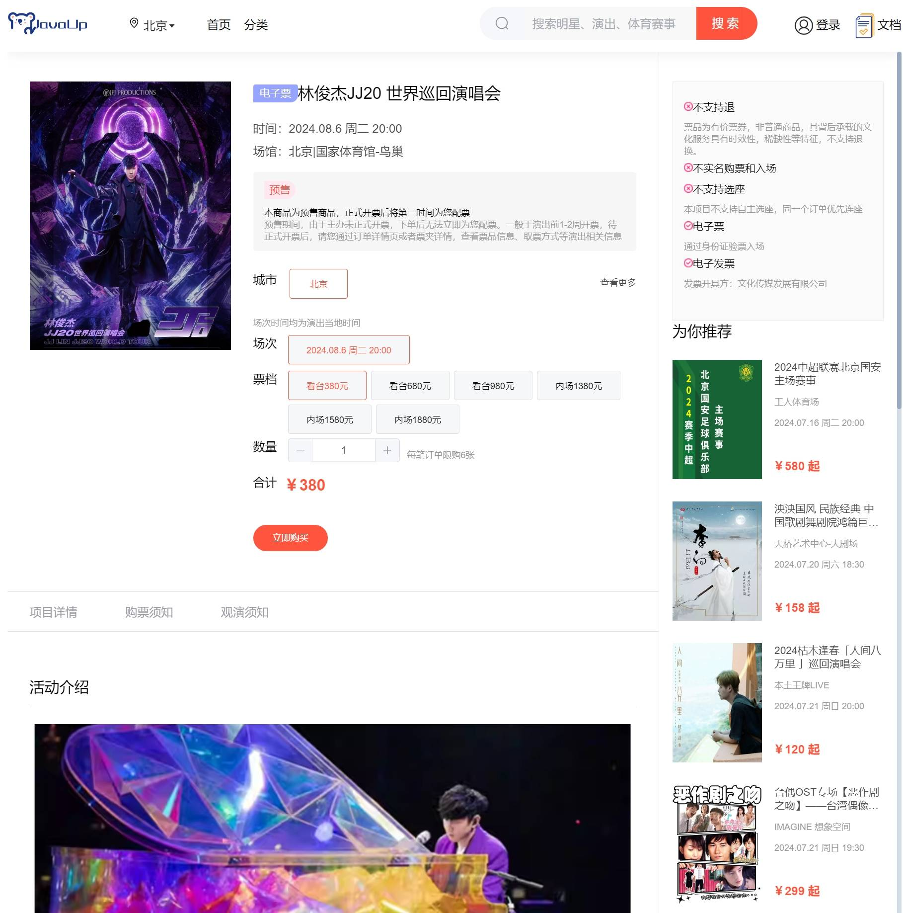
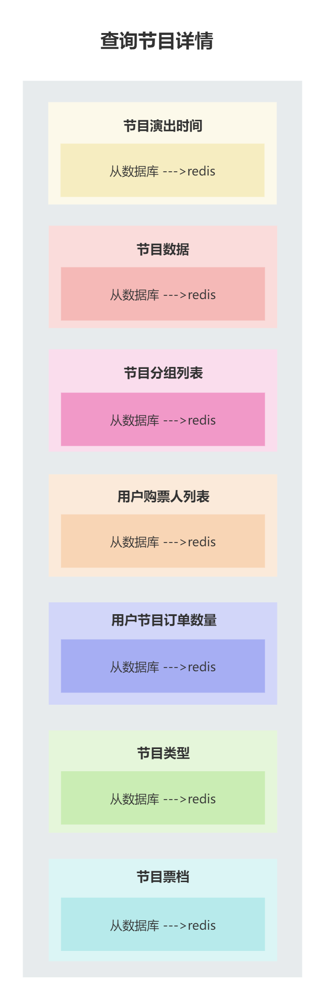
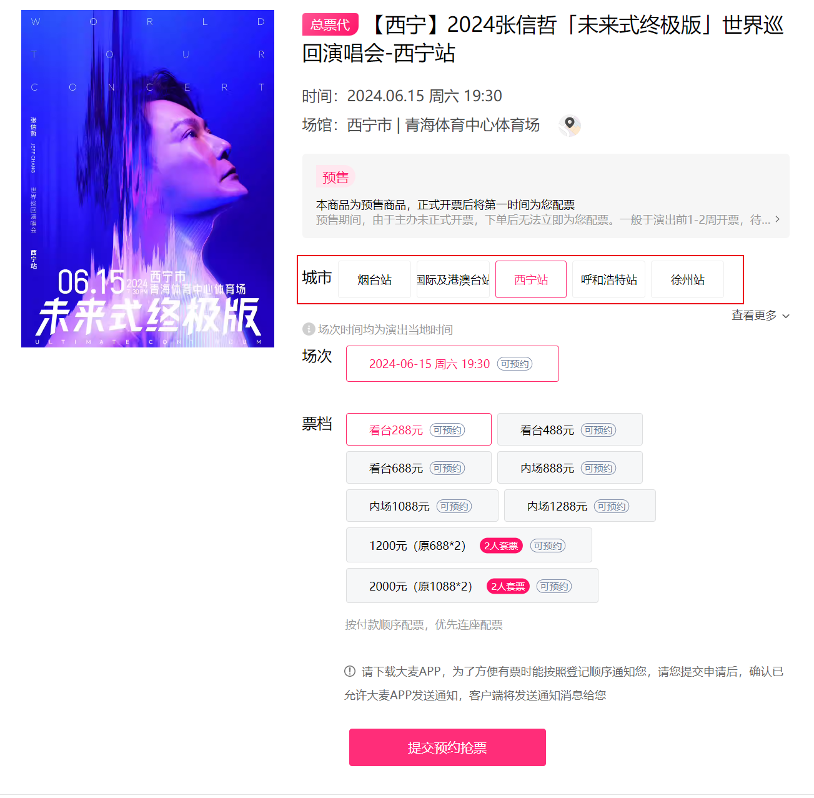
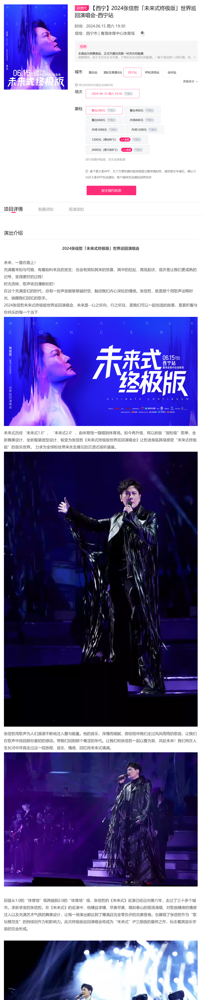

# 业务讲解-如何实现高性能节目详情展示功能

### 节目详情图





## 接口
**com.damai.controller.ProgramController#getDetail**

```java
@ApiOperation(value = "查询详情(根据id)")
@PostMapping(value = "/detail")
public ApiResponse<ProgramVo> getDetail(@Valid @RequestBody ProgramGetDto programGetDto) {
    return ApiResponse.ok(programService.getDetail(programGetDto));
}
```


**com.damai.service.ProgramService#getDetail**

```java
public ProgramVo getDetail(ProgramGetDto programGetDto) {
    //查询节目演出时间
    ProgramShowTime programShowTime = programShowTimeService.selectProgramShowTimeByProgramId(programGetDto.getId());
    
    //从节目表获取数据，以及区域信息
    ProgramVo programVo = programService.getById(programGetDto.getId(),DateUtils.countBetweenSecond(DateUtils.now(),
                    programShowTime.getShowTime()), TimeUnit.SECONDS);
    programVo.setShowTime(programShowTime.getShowTime());
    programVo.setShowDayTime(programShowTime.getShowDayTime());
    programVo.setShowWeekTime(programShowTime.getShowWeekTime());
    
    //从节目分组表获取数据
    ProgramGroupVo programGroupVo = programService.getProgramGroup(programVo.getProgramGroupId());
    programVo.setProgramGroupVo(programGroupVo);
    
    //预先加载用户购票人
    preloadTicketUserList(programVo.getHighHeat());

    //预先加载用户下节目订单数量
    preloadAccountOrderCount(programVo.getId());
    
    //设置节目类型相关信息
    ProgramCategory programCategory = getProgramCategory(programVo.getProgramCategoryId());
    if (Objects.nonNull(programCategory)) {
        programVo.setProgramCategoryName(programCategory.getName());
    }
    ProgramCategory parentProgramCategory = getProgramCategory(programVo.getParentProgramCategoryId());
    if (Objects.nonNull(parentProgramCategory)) {
        programVo.setParentProgramCategoryName(parentProgramCategory.getName());
    }
    
    //查询节目票档
    List<TicketCategoryVo> ticketCategoryVoList = 
            ticketCategoryService.selectTicketCategoryListByProgramId(programVo.getId(),
                    DateUtils.countBetweenSecond(DateUtils.now(),programShowTime.getShowTime()), TimeUnit.SECONDS);
    programVo.setTicketCategoryVoList(ticketCategoryVoList);
    
    return programVo;
}
```


## 查看详情流程


**查看节目详情的查询可拆分为几部分**



下面开始进行分析查看详情的具体流程

### 查询节目演出时间
```java
ProgramShowTime redisProgramShowTime = programShowTimeService.selectProgramShowTimeByProgramId(redisProgramVo.getId());
```


```java
/**
 * 查询节目演出时间
 * */
@ServiceLock(lockType= LockType.Read,name = PROGRAM_SHOW_TIME_LOCK,keys = {"#programId"})
public ProgramShowTime selectProgramShowTimeByProgramId(Long programId){
    return redisCache.get(RedisKeyBuild.createRedisKey(RedisKeyManage.PROGRAM_SHOW_TIME,programId),ProgramShowTime.class,() -> {
        LambdaQueryWrapper<ProgramShowTime> programShowTimeLambdaQueryWrapper =
                Wrappers.lambdaQuery(ProgramShowTime.class).eq(ProgramShowTime::getProgramId, programId);
        return Optional.ofNullable(programShowTimeMapper.selectOne(programShowTimeLambdaQueryWrapper))
                .orElseThrow(() -> new DaMaiFrameException(BaseCode.PROGRAM_SHOW_TIME_NOT_EXIST));
    },EXPIRE_TIME, TimeUnit.DAYS);
}
```


这里依旧是根据节目id先从redis中查询，如果redis中不存在，再去数据库中查询，再放入到redis中


这里可能有人会有疑惑，为什么节目的演出时间为什么要单独设计出节目演出时间表，为什么不直接放在节目表中呢？

**这是因为一场节目可以举办多次，也就有了多个节目演出时间，又或者在不同城市可以有不同的演出时间**


节目演出时间表的分库分表策略也是**用节目id做的分片键，所以并不存在因为读扩撒导致的全路由问题**

### 从节目表获取数据，以及区域信息
```java
//从节目表获取数据，以及区域信息
ProgramVo redisProgramVo = programService.getById(programGetDto.getId());
```


```java
@ServiceLock(lockType= LockType.Read,name = PROGRAM_LOCK,keys = {"#programId"})
public ProgramVo getById(Long programId) {
    return redisCache.get(RedisKeyBuild.createRedisKey(RedisKeyManage.PROGRAM,programId)
            ,ProgramVo.class,
            () -> createProgramVo(programId)
            ,EXPIRE_TIME, 
            TimeUnit.DAYS);
}
```


```java
private ProgramVo createProgramVo(long programId){
    ProgramVo programVo = new ProgramVo();
    //根据id查询到节目
    Program program = 
            Optional.ofNullable(programMapper.selectById(programId))
                    .orElseThrow(() -> new DaMaiFrameException(BaseCode.PROGRAM_NOT_EXIST));
    BeanUtil.copyProperties(program,programVo);
    //查询区域
    AreaGetDto areaGetDto = new AreaGetDto();
    areaGetDto.setId(program.getAreaId());
    ApiResponse<AreaVo> areaResponse = baseDataClient.getById(areaGetDto);
    if (Objects.equals(areaResponse.getCode(), ApiResponse.ok().getCode())) {
        if (Objects.nonNull(areaResponse.getData())) {
            programVo.setAreaName(areaResponse.getData().getName());
        }
    }else {
        log.error("base-data rpc getById error areaResponse:{}", JSON.toJSONString(areaResponse));
    }
    return programVo;
}
```


首先添加分布式锁，锁的类型为**<font style="color:#DF2A3F;">读锁</font>**，写锁是在节目添加接口。使用读写锁可以减少锁的竞争。当其他用户进行查看节目详情时，都是读锁，<font style="color:#DF2A3F;">读锁和读锁之间不会引起锁的竞争</font>


接下来就是从redis中查询，使用的是com.damai.redis.RedisCache#get

```java
/**
 * 获取字符串对象(如果缓存中不存在，则执行给定的supplier接口)
 *
 * @param redisKeyBuild   RedisKeyBuild
 * @param clazz 类对象
 * @param <T>   T
 * @param supplier 缓存为空时，执行的逻辑
 * @param ttl      过期时间
 * @param timeUnit 时间单位
 * @return T 普通对象
 */
<T> T get(RedisKeyBuild redisKeyBuild, Class<T> clazz, Supplier<T> supplier, long ttl, TimeUnit timeUnit);
```


如果redis中不存在的话，**执行supplier，也就是从数据库中查询**，再放入redis中


根据节目id从数据库查询节目，然后调用基础数据服务获取节目所属的地区名areaName


### 从节目分组表获取数据
```java
//从节目分组表获取数据
ProgramGroupVo programGroupVo = programService.getProgramGroup(programVo.getProgramGroupId());
```

```java
@ServiceLock(lockType= LockType.Read,name = PROGRAM_GROUP_LOCK,keys = {"#programGroupId"})
public ProgramGroupVo getProgramGroup(Long programGroupId) {
    return redisCache.get(RedisKeyBuild.createRedisKey(RedisKeyManage.PROGRAM_GROUP,programGroupId)
        ,ProgramGroupVo.class,
        () -> createProgramGroupVo(programGroupId)
        ,EXPIRE_TIME, 
        TimeUnit.DAYS);
}
```

```java
private ProgramGroupVo createProgramGroupVo(Long programGroupId){
    ProgramGroupVo programGroupVo = new ProgramGroupVo();
    ProgramGroup programGroup =
            Optional.ofNullable(programGroupMapper.selectById(programGroupId))
                    .orElseThrow(() -> new DaMaiFrameException(BaseCode.PROGRAM_GROUP_NOT_EXIST));
    programGroupVo.setId(programGroup.getId());
    programGroupVo.setProgramSimpleInfoVoList(JSON.parseArray(programGroup.getProgramJson(), ProgramSimpleInfoVo.class));
    return programGroupVo;
}
```

和节目表的流程大概相同，首先添加分布式锁，锁的类型为读锁，写锁是在节目分组添加接口。使用读写锁可以减少锁的竞争。当其他用户进行查看节目详情时，都是读锁，读锁和读锁之间不会引起锁的竞争，从redis中查询，使用的是com.damai.redis.RedisCache#get

#### 解析节目分组的原理
有的小伙伴可能没有懂节目分组的作用，这里我们看下某个节目详情



某个节目可能会在多个城市进行演出，这里有的小伙伴会想，直接在设计个节目城市表不就行了吗，查询节目详情时，去节目城市表查询有哪些城市不就能实现了吗

说实话一开始我也这么想的，但其实并没有那么简单，我们看下同一个节目在不同城市下的详情介绍


##### 西宁城市的节目详情



##### 呼和浩特城市的节目详情


能看出虽然是同一个节目，但是 **<font style="color:#4861E0;">在不同的城市下的节目详情介绍是不同的</font>**

> **虽然是同一个节目，但是不同城市的节目仍然分别作为独立的一条数据保存到节目表中，每个节目存在program_group_id(节目分组id)，关联到节目分组，这些在不同城市的相同节目归属于同一个节目分组中** 
>


这样在查询节目详情时，将节目分组列表也查询出来，这样就可以知道该节目下的所有城市演出，当用户选择城市时，根据所在的节目id再去查询节目详情接口


###### 节目详情接口返回的数据中关于节目分组的部分：
```json
"programGroupVo": {
    "id": "22",
    "programSimpleInfoVoList": [
        {
            "programId": "22",
            "areaId": "2",
            "areaIdName": "北京"
        },
        {
            "programId": "24",
            "areaId": "244",
            "areaIdName": "沈阳"
        },
        {
            "programId": "26",
            "areaId": "211",
            "areaIdName": "长春"
        },
        {
            "programId": "28",
            "areaId": "167",
            "areaIdName": "哈尔滨"
        },
        {
            "programId": "30",
            "areaId": "77",
            "areaIdName": "深圳"
        }
    ]
}
```


### 预先加载用户购票人
```java
preloadTicketUserList(redisProgramVo.getHighHeat());
```


```java
/***
 * 预先加载用户下的购票人
 */
private void preloadTicketUserList(Integer highHeat){
    //如果节目是热度不高的，那么不用预先加载了
    if (Objects.equals(highHeat, BusinessStatus.NO.getCode())) {
        return;
    }

    String userId = BaseParameterHolder.getParameter(USER_ID);
    String code = BaseParameterHolder.getParameter(CODE);
    //如果用户id或者code有一个为空，那么判断不了用户登录状态，也不用预先加载了
    if (StringUtil.isEmpty(userId) || StringUtil.isEmpty(code)) {
        return;
    }
    Boolean userLogin = redisCache.hasKey(RedisKeyBuild.createRedisKey(RedisKeyManage.USER_LOGIN, code, userId));
    //如果用户没有登录，也不用预先加载了
    if (!userLogin) {
        return;
    }
    //如果已经预热加载了，就不用再执行了
    if (redisCache.hasKey(RedisKeyBuild.createRedisKey(RedisKeyManage.TICKET_USER_LIST,userId))) {
        return;
    }
    //异步加载购票人信息，别耽误查询节目详情的主线程
    BusinessThreadPool.execute(() -> {
        try {
            UserIdDto userIdDto = new UserIdDto();
            userIdDto.setId(Long.parseLong(userId));
            ApiResponse<List<TicketUserVo>> apiResponse = userClient.list(userIdDto);
            if (Objects.equals(apiResponse.getCode(), BaseCode.SUCCESS.getCode())) {
                Optional.ofNullable(apiResponse.getData()).filter(CollectionUtil::isNotEmpty)
                        .ifPresent(ticketUserVoList -> redisCache.set(RedisKeyBuild.createRedisKey(
                                RedisKeyManage.TICKET_USER_LIST,userId),ticketUserVoList));
            }else {
                log.warn("userClient.select 调用失败 apiResponse : {}",JSON.toJSONString(apiResponse));
            }
        }catch (Exception e) {
            log.error("预热加载投票人列表失败",e);
        }
    });
}
```


代码的逻辑不是很复杂，核心流程还是判断演唱会是热门，并且用户在登录状态中。那么就去异步执行将购票人的列表放入到缓存中。

### 预先加载用户下的节目订单数量
```java
preloadAccountOrderCount(programVo.getId());
```

```java
private void preloadAccountOrderCount(Long programId){
    String userId = BaseParameterHolder.getParameter(USER_ID);
    String code = BaseParameterHolder.getParameter(CODE);
    if (StringUtil.isEmpty(userId) || StringUtil.isEmpty(code)) {
        return;
    }
    //判断是否登录
    Boolean userLogin =
            redisCache.hasKey(RedisKeyBuild.createRedisKey(RedisKeyManage.USER_LOGIN, code, userId));
    //如果没有登录直接返回
    if (!userLogin) {
        return;
    }
    BusinessThreadPool.execute(() -> {
        try {
            //如果redis中不存在则调用订单服务查询该用户下此节目的订单数量(未支付、已支付状态)
            if (!redisCache.hasKey(RedisKeyBuild.createRedisKey(RedisKeyManage.ACCOUNT_ORDER_COUNT,userId,programId))) {
                AccountOrderCountDto accountOrderCountDto = new AccountOrderCountDto();
                accountOrderCountDto.setUserId(Long.parseLong(userId));
                accountOrderCountDto.setProgramId(programId);
                ApiResponse<AccountOrderCountVo> apiResponse = orderClient.accountOrderCount(accountOrderCountDto);
                if (Objects.equals(apiResponse.getCode(), BaseCode.SUCCESS.getCode())) {
                    Optional.ofNullable(apiResponse.getData())
                            //放入redis中
                            .ifPresent(accountOrderCountVo -> redisCache.set(
                                    RedisKeyBuild.createRedisKey(RedisKeyManage.ACCOUNT_ORDER_COUNT,userId,programId),
                                    accountOrderCountVo.getCount(), tokenExpireManager.getTokenExpireTime() + 1,
                                    TimeUnit.MINUTES));
                }else {
                    log.warn("orderClient.accountOrderCount 调用失败 apiResponse : {}",JSON.toJSONString(apiResponse));
                }
            }
        }catch (Exception e) {
            log.error("预热加载账户订单数量失败",e);
        }
    });
}
```

### 设置节目类型相关信息
```java
//设置节目类型相关信息
ProgramCategory programCategory = getProgramCategory(programVo.getProgramCategoryId());
if (Objects.nonNull(programCategory)) {
    programVo.setProgramCategoryName(programCategory.getName());
}
ProgramCategory parentProgramCategory = getProgramCategory(programVo.getParentProgramCategoryId());
if (Objects.nonNull(parentProgramCategory)) {
    programVo.setParentProgramCategoryName(parentProgramCategory.getName());
}
```

```java
public ProgramCategory getProgramCategory(Long programCategoryId){
    return programCategoryService.getProgramCategory(programCategoryId);
}
```

```java
public ProgramCategory getProgramCategory(Long programCategoryId){
    //从redis中查询
    ProgramCategory programCategory = redisCache.getForHash(RedisKeyBuild.createRedisKey(
            RedisKeyManage.PROGRAM_CATEGORY_HASH), String.valueOf(programCategoryId), ProgramCategory.class);
    //如果redis中不存在，从数据库查询
    if (Objects.isNull(programCategory)) {
        Map<String, ProgramCategory> programCategoryMap = programCategoryRedisDataInit();
        return programCategoryMap.get(String.valueOf(programCategoryId));
    }
    return programCategory;
}
```

```java
@ServiceLock(lockType= LockType.Write,name = PROGRAM_CATEGORY_LOCK,keys = {"#all"})
public Map<String, ProgramCategory> programCategoryRedisDataInit(){
    Map<String, ProgramCategory> programCategoryMap = new HashMap<>(64);
    QueryWrapper<ProgramCategory> lambdaQueryWrapper = Wrappers.emptyWrapper();
    //从数据库中查询
    List<ProgramCategory> programCategoryList = programCategoryMapper.selectList(lambdaQueryWrapper);
    if (CollectionUtil.isNotEmpty(programCategoryList)) {
        //放入redis中
        programCategoryMap = programCategoryList.stream().collect(
                Collectors.toMap(p -> String.valueOf(p.getId()), p -> p, (v1, v2) -> v2));
        redisCache.putHash(RedisKeyBuild.createRedisKey(RedisKeyManage.PROGRAM_CATEGORY_HASH),programCategoryMap);
    }
    return programCategoryMap;
}
```

这里从redis中查询节目类型的数据，结构是使用hash类型，键为`d_mai_program_category_hash`，**hash的key为节目类型id，hash的value为节目类型对象**。通过节目类型id，从redis获取具体的节目类型名字，然后设置到节目详情中


这里可以看到了先从redis获取节目类型数据，如果redis中没有则再从数据库中查询，然后再放入redis

### 查询节目票档
```java
List<TicketCategoryVo> ticketCategoryVoList = ticketCategoryService.selectTicketCategoryListByProgramId(redisProgramVo.getId());
redisProgramVo.setTicketCategoryVoList(ticketCategoryVoList);
```


```java
public List<TicketCategoryVo> selectTicketCategoryListByProgramId(Long programId){
    return redisCache.getValueIsList(RedisKeyBuild.createRedisKey(RedisKeyManage.PROGRAM_TICKET_CATEGORY_LIST, programId), 
            TicketCategoryVo.class, 
            () -> {
                LambdaQueryWrapper<TicketCategory> ticketCategoryLambdaQueryWrapper = 
                        Wrappers.lambdaQuery(TicketCategory.class).eq(TicketCategory::getProgramId, programId);
                List<TicketCategory> ticketCategoryList = 
                        ticketCategoryMapper.selectList(ticketCategoryLambdaQueryWrapper);
                return ticketCategoryList.stream().map(ticketCategory -> {
                    ticketCategory.setRemainNumber(null);
                    TicketCategoryVo ticketCategoryVo = new TicketCategoryVo();
                    BeanUtil.copyProperties(ticketCategory, ticketCategoryVo);
                    return ticketCategoryVo;
                }).collect(Collectors.toList());
            }, EXPIRE_TIME, TimeUnit.DAYS);
}
```


查询节目票档的流程也是先从redis中查询，如果查询不到，去数据库中查询，接着再放入缓存中


这里有个细节就是**ticketCategory.setRemainNumber(null)**将票档的余票数量清空，清空的原因是**余票的准确数量确实是在redis中更新的**，而数据库中的余票数量并不是实时和redis相同，存在着延迟。但大麦并没有把票据数量展示给用户看，用户能看的也是座位的状态。所以这里也是直接将余票数量直接置空，不展示给前端


以上就是查询节目详情的流程，通过执行此流程后，节目的相关数据都存在在了redis中，等其他用户再查看时，也就是从redis查询了，大大缓解了数据库的压力


### 问题
以上是节目详情流程的第一版，但其实是存在一些问题的，小伙伴先自己想一想到底有哪些问题？然后跳转到节目详情流程优化的章节中来学习，看看是不是和自己想到的问题一样

[如何应对突发性热点数据暴增导致系统压力过大问题？](https://www.yuque.com/u22210564/ykdrdh/gt9k8yde2d87w6rq)


> 更新: 2024-07-24 15:26:16  
> 原文: <https://www.yuque.com/u22210564/ykdrdh/kpc3q7invdzn7gev>