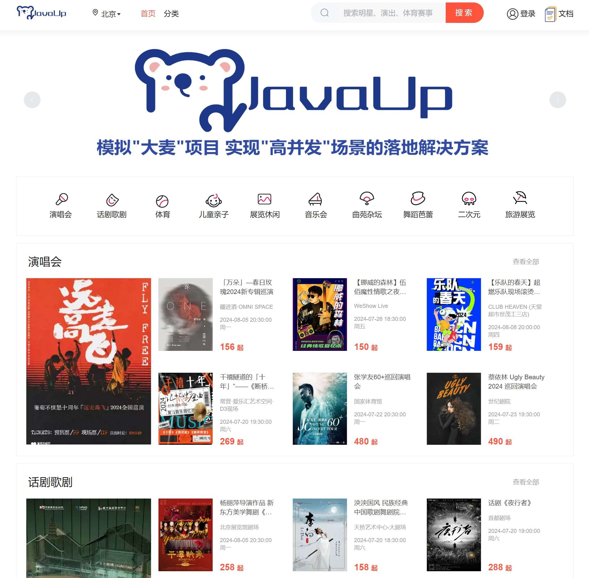

# 业务讲解-如何实现高效的主页节目列表显示

### 主页样式



接下来我们来详细的讲解主页数据是如何进行显示的


# damai-program-service
## 接口
### 入参实体


```java
@Data
@ApiModel(value="ProgramListDto", description ="主页节目列表")
public class ProgramListDto {
    
    @ApiModelProperty(name ="areaId", dataType ="Long", value ="所在区域id")
    private Long areaId;
    
    @ApiModelProperty(name ="parentProgramCategoryIds", dataType ="Long[]", value ="父节目类型id集合",required = true)
    @NotNull
    @Size(max = 4)
    private List<Long> parentProgramCategoryIds;
}
```


这里使用了**jakarta.validation**的注解来做参数验证，区域id不能为空，父节目类型id集合不能为空并且长度最大为4


### 控制层
**com.damai.controller.ProgramController#selectHomeList**

```java
@ApiOperation(value = "查询主页列表")
@PostMapping(value = "/home/list")
public ApiResponse<List<ProgramHomeVo>> selectHomeList(@Valid @RequestBody ProgramListDto programPageListDto) {
    return ApiResponse.ok(programService.selectHomeList(programPageListDto));
}
```


#### 问题思考
> 到这里我们先不急着往下看，先思考个问题，主页列表的查询条件有区域id和父节目类型id集合。而节目表进行了分库分表，分片键是主键id。这不就造成了读扩散导致全路由查询了，那效率绝对慢啊。这怎么处理？
>
>  
>
> 首先采取用户表那种额外加路由表的方案行不通了，以用户手机表为例，先用手机号去用户手机表查询到用户id，再用用户id查询用户表。这个去用户表查询的条件只有一个条件，就是用户id。而在此业务中，需要同时传入地区id和父节目类型id这两个条件，要是设计了节目地区路由表和父节目类型路由表，这两个表之间独立，建立不了关系，也就**查询不到两者的交集**。所以路由表的方案解决不了
>
>  
>
> 至于用基因法更是不行，基因法只能允许订单号和用户id一起充当分片键，**但是查询还只能用一个条件**，要么用订单号查询、要么用用户id查询
>
>  
>
> 似乎陷入了死局中，但真的解决不了了吗？我们完全可以借助分布式的查询引擎啊，也就是大名鼎鼎的**elasticsearch**，将节目表的数据存放到elasticsearch中不就可以了吗
>
>  
>
> elasticsearch中只存放节目表的数据，余票数量还是放到redis中，这样就不能在余票数据不一致的问题了
>
>  
>
> 至于内存压力的问题，我们可以这样解决，我们可以设置定时任务，将过期的节目从elasticsearch中删除掉，elasticsearch只保存可以订票的节目不就可以了吗
>


但只使用elasticsearch是不行的，应该还有个兜底策略，当从elasticsearch查询不到的话，再从数据库中查询，就算全路由查询了，那也比什么都查询不到强


### com.damai.service.ProgramService#selectHomeList


```java
public List<ProgramHomeVo> selectHomeList(ProgramListDto programPageListDto) {
    //先从elasticsearch查询
    List<ProgramHomeVo> programHomeVoList = programEs.selectHomeList(programPageListDto);
    if (CollectionUtil.isNotEmpty(programHomeVoList)) {
        return programHomeVoList;
    }
    //elasticsearch中查询不到，再去数据库中查询
    return dbSelectHomeList(programPageListDto);
}
```


### com.damai.service.es.ProgramEs#selectHomeList


```java
@Slf4j
@Component
public class ProgramEs {
    
    @Autowired
    private BusinessEsHandle businessEsHandle;
    
    public List<ProgramHomeVo> selectHomeList(ProgramListDto programPageListDto) {
        List<ProgramHomeVo> programHomeVoList = new ArrayList<>();
        
        try {
            //按照父节目id集合来进行循环从es中查询，主页页面是4个父节目，也就是循环4次
            for (Long parentProgramCategoryId : programPageListDto.getParentProgramCategoryIds()) {
                List<EsDataQueryDto> programEsQueryDto = new ArrayList<>();
                if (Objects.nonNull(programPageListDto.getAreaId())) {
                    //地区id
                    EsDataQueryDto areaIdQueryDto = new EsDataQueryDto();
                    areaIdQueryDto.setParamName(ProgramDocumentParamName.AREA_ID);
                    areaIdQueryDto.setParamValue(programPageListDto.getAreaId());
                    programEsQueryDto.add(areaIdQueryDto);
                }else {
                    //如果查全部地区则需要查询同一个节目分组内的主要节目
                    EsDataQueryDto primeQueryDto = new EsDataQueryDto();
                    primeQueryDto.setParamName(ProgramDocumentParamName.PRIME);
                    primeQueryDto.setParamValue(BusinessStatus.YES.getCode());
                    programEsQueryDto.add(primeQueryDto);
                }
                //父节目类型id集合
                EsDataQueryDto parentProgramCategoryIdQueryDto = new EsDataQueryDto();
                parentProgramCategoryIdQueryDto.setParamName(ProgramDocumentParamName.PARENT_PROGRAM_CATEGORY_ID);
                parentProgramCategoryIdQueryDto.setParamValue(parentProgramCategoryId);
                programEsQueryDto.add(parentProgramCategoryIdQueryDto);
                //查询前7条
                PageInfo<ProgramListVo> pageInfo = businessEsHandle.queryPage(
                        SpringUtil.getPrefixDistinctionName() + "-" + ProgramDocumentParamName.INDEX_NAME,
                        ProgramDocumentParamName.INDEX_TYPE, programEsQueryDto, 1, 7, ProgramListVo.class);
                if (!pageInfo.getList().isEmpty()) {
                    ProgramHomeVo programHomeVo = new ProgramHomeVo();
                    programHomeVo.setCategoryName(pageInfo.getList().get(0).getParentProgramCategoryName());
                    programHomeVo.setCategoryId(pageInfo.getList().get(0).getParentProgramCategoryId());
                    programHomeVo.setProgramListVoList(pageInfo.getList());
                    programHomeVoList.add(programHomeVo);
                }
            }
        }catch (Exception e) {
            log.error("businessEsHandle.queryPage error",e);
        }
        return programHomeVoList;
    }
}
```


这里使用了对elasticsearch进行封装的组件**damai-elasticsearch-framework**，关于此组件的详细介绍，可跳转到


[组件讲解-如何对Elasticsearch进行高效封装](https://www.yuque.com/u22210564/ykdrdh/ti6u5ovgfuhftlum)


这里将传入的父类型的节目id集合进行查询，每个循环内根据地区id和父节目类型id来查询出前7条，接着放入`programListVoMap`中，key为类型名，value为节目列表


#### 注意


主页的列表数据要显示的并不是只有节目表中的数据，还有`programCategoryName、showTime、showDayTime、showWeekTime、minPrice、maxPrice`这些都是要从其他表中获取的，至于为什么从elasticsearch中可以直接查询出来，是因为在项目初始化时，将这些数据都已经组装好了，才放入到elasticsearch中的，


关于是如何将数据组装好后放入elasticsearch中的，可跳转到相应介绍部分详细查看

[业务讲解-项目服务的数据初始化统一管理](https://www.yuque.com/u22210564/ykdrdh/vmvabhdvn1a30mi5)


elasticsearch中的存储结构：


```json
{
  "_index": "damai-program",
  "_id": "Ckf98Y8BBcQ0HdIVE_u8",
  "_version": 1,
  "_score": 0,
  "_source": {
    "prime": 1,
    "showWeekTime": "周五",
    "parentProgramCategoryId": 1,
    "showDayTime": 1720108800000,
    "parentProgramCategoryName": "演唱会",
    "showTime": 1720182600000,
    "title": "「万朵」—春日玫瑰2024新专辑巡演",
    "actor": "春日玫瑰",
    "programGroupId": 6,
    "areaId": 2,
    "areaName": "北京",
    "itemPicture": "https://s21.ax1x.com/2024/06/06/pkYEDAI.webp",
    "minPrice": 156,
    "programCategoryId": 1,
    "id": 6,
    "place": "疆进酒·OMNI SPACE",
    "maxPrice": 299,
    "programCategoryName": "演唱会"
  },
  "fields": {
    "actor.keyword": [
      "春日玫瑰"
    ],
    "title": [
      "「万朵」—春日玫瑰2024新专辑巡演"
    ],
    "title.keyword": [
      "「万朵」—春日玫瑰2024新专辑巡演"
    ],
    "itemPicture.keyword": [
      "https://s21.ax1x.com/2024/06/06/pkYEDAI.webp"
    ],
    "areaName": [
      "北京"
    ],
    "itemPicture": [
      "https://s21.ax1x.com/2024/06/06/pkYEDAI.webp"
    ],
    "programCategoryId": [
      1
    ],
    "id": [
      6
    ],
    "place": [
      "疆进酒·OMNI SPACE"
    ],
    "programCategoryName": [
      "演唱会"
    ],
    "showWeekTime": [
      "周五"
    ],
    "prime": [
      1
    ],
    "parentProgramCategoryId": [
      1
    ],
    "showDayTime": [
      "2024-07-04T16:00:00.000Z"
    ],
    "parentProgramCategoryName": [
      "演唱会"
    ],
    "showTime": [
      "2024-07-05T12:30:00.000Z"
    ],
    "parentProgramCategoryName.keyword": [
      "演唱会"
    ],
    "showWeekTime.keyword": [
      "周五"
    ],
    "areaName.keyword": [
      "北京"
    ],
    "actor": [
      "春日玫瑰"
    ],
    "programCategoryName.keyword": [
      "演唱会"
    ],
    "programGroupId": [
      6
    ],
    "areaId": [
      2
    ],
    "minPrice": [
      156
    ],
    "maxPrice": [
      299
    ],
    "place.keyword": [
      "疆进酒·OMNI SPACE"
    ]
  }
}
```


### com.damai.service.ProgramService#dbSelectHomeList


当从elasticsearch中查询不到的话，就只有从数据库中查询了，全路由查询也比没有数据要好

```java
private List<ProgramHomeVo> dbSelectHomeList(ProgramListDto programPageListDto){
    List<ProgramHomeVo> programHomeVoList = new ArrayList<>();
    //根据父节目类型id来查询节目类型map，key：节目类型id，value：节目类型名
    Map<Long, String> programCategoryMap = selectProgramCategoryMap(programPageListDto.getParentProgramCategoryIds());
    //查询节目列表
    List<Program> programList = programMapper.selectHomeList(programPageListDto);
    //如果节目列表为空，那么直接返回空map
    if (CollectionUtil.isEmpty(programList)) {
        return programHomeVoList;
    }
    //节目id集合
    List<Long> programIdList = programList.stream().map(Program::getId).collect(Collectors.toList());
    //根据节目id集合查询节目演出时间集合
    LambdaQueryWrapper<ProgramShowTime> programShowTimeLambdaQueryWrapper = Wrappers.lambdaQuery(ProgramShowTime.class)
            .in(ProgramShowTime::getProgramId, programIdList);
    List<ProgramShowTime> programShowTimeList = programShowTimeMapper.selectList(programShowTimeLambdaQueryWrapper);
    //将节目演出集合根据节目id进行分组成map，key：节目id，value：节目演出时间集合
    Map<Long, List<ProgramShowTime>> programShowTimeMap = 
            programShowTimeList.stream().collect(Collectors.groupingBy(ProgramShowTime::getProgramId));
    //根据节目id统计出票档的最低价和最高价的集合map, key：节目id，value：票档
    Map<Long, TicketCategoryAggregate> ticketCategorieMap = selectTicketCategorieMap(programIdList);
    //将节目结合按照父节目类型id进行分组成map，key：父节目类型id，value：节目集合
    Map<Long, List<Program>> programMap = programList.stream()
            .collect(Collectors.groupingBy(Program::getParentProgramCategoryId));
    //循环此map
    for (Entry<Long, List<Program>> programEntry : programMap.entrySet()) {
        //父节目类型id
        Long key = programEntry.getKey();
        //节目集合
        List<Program> value = programEntry.getValue();
        List<ProgramListVo> programListVoList = new ArrayList<>();
        //循环节目集合
        for (Program program : value) {
            ProgramListVo programListVo = new ProgramListVo();
            BeanUtil.copyProperties(program,programListVo);
            //演出时间
            programListVo.setShowTime(Optional.ofNullable(programShowTimeMap.get(program.getId()))
                    .filter(list -> !list.isEmpty())
                    .map(list -> list.get(0))
                    .map(ProgramShowTime::getShowTime)
                    .orElse(null));
            //演出时间(精确到天)
            programListVo.setShowDayTime(Optional.ofNullable(programShowTimeMap.get(program.getId()))
                    .filter(list -> !list.isEmpty())
                    .map(list -> list.get(0))
                    .map(ProgramShowTime::getShowDayTime)
                    .orElse(null));
            //演出时间所在的星期
            programListVo.setShowWeekTime(Optional.ofNullable(programShowTimeMap.get(program.getId()))
                    .filter(list -> !list.isEmpty())
                    .map(list -> list.get(0))
                    .map(ProgramShowTime::getShowWeekTime)
                    .orElse(null));
            //节目最高价
            programListVo.setMaxPrice(Optional.ofNullable(ticketCategorieMap.get(program.getId()))
                    .map(TicketCategoryAggregate::getMaxPrice).orElse(null));
            //节目最低价
            programListVo.setMinPrice(Optional.ofNullable(ticketCategorieMap.get(program.getId()))
                    .map(TicketCategoryAggregate::getMinPrice).orElse(null));
            programListVoList.add(programListVo);
        }
        ProgramHomeVo programHomeVo = new ProgramHomeVo();
        //节目类型名
        programHomeVo.setCategoryName(programCategoryMap.get(key));
        //节目类型id
        programHomeVo.setCategoryId(key);
        programHomeVo.setProgramListVoList(programListVoList);
        //节目列表
        programHomeVoList.add(programHomeVo);
    }
    return programHomeVoList;
}
```


从数据库中查询没有办法像从elasticsearch中直接查询的数据都是全的，`programCategoryName、showTime、showDayTime、showWeekTime、minPrice、maxPrice`这些仍然要从其他表中获取的，这些查询中都带有分片键，所以并不需要担心全路由的问题


#### 查询节目类型名字
```java
//根据父节目类型id来查询节目类型map，key：节目类型id，value：节目类型名
Map<Long, String> programCategoryMap = selectProgramCategoryMap(programPageListDto.getParentProgramCategoryIds());
```


```java
/**
 * 根据节目类型id集合查询节目类型名字
 * @param programCategoryIdList 节目类型id集合
 * @return Map<Long, String> key：节目类型id value：节目类型名字
 * */
public Map<Long, String> selectProgramCategoryMap(Collection<Long> programCategoryIdList){
    LambdaQueryWrapper<ProgramCategory> pcLambdaQueryWrapper = Wrappers.lambdaQuery(ProgramCategory.class)
            .in(ProgramCategory::getId, programCategoryIdList);
    List<ProgramCategory> programCategoryList = programCategoryMapper.selectList(pcLambdaQueryWrapper);
    return programCategoryList
            .stream()
            .collect(Collectors.toMap(ProgramCategory::getId, ProgramCategory::getName, (v1, v2) -> v2));
}
```


根据传入的`parentProgramCategoryIds`父节目类型id集合，获取相关数据


#### 查询节目列表
```java
List<Program> programList = programMapper.selectHomeList(programPageListDto);
```


这个查询的要求是查询根据每个parentProgramCategoryId查询出节目列表，并且取前7条，要用sql实现的话，就要这么做，前端传入参数以此为例：


```json
{
    "areaId":"2",
    "parentProgramCategoryIds":["1","2"]
}
```


形成的sql为


```sql
select
        dp.id,dp.area_id,dp.program_category_id,dp.parent_program_category_id,dp.title,dp.actor,
        dp.place,dp.item_picture
    from
        d_program dp
    where
        dp.program_status = 1
    and
        dp.area_id = 2
    and
        dp.parent_program_category_id = 1 limit 7
) as tmp
union all  
select * from (
    select
        dp.id,dp.area_id,dp.program_category_id,dp.parent_program_category_id,dp.title,dp.actor,
        dp.place,dp.item_picture
    from
        d_program dp
    where
        dp.program_status = 1
    and
        dp.area_id = 2
    and
        dp.parent_program_category_id = 2 limit 7
) as tmp
```


每个根据父节目id的查询都是一个个独立的sql，然后靠**union all **来拼接起来，要想在代码中实现这种效果，就需要使用Mybatis来动态拼接sql，自定义写我们的sql查询逻辑


#### com.damai.mapper.ProgramMapper#selectHomeList
```java
/**
 * 主页查询
 * @param programListDto 参数
 * @return 结果
 * */
List<Program> selectHomeList(@Param("programListDto")ProgramListDto programListDto);
```


对应的xml文件


```xml
<select id="selectHomeList" parameterType="com.damai.dto.ProgramListDto" resultType="com.damai.entity.Program">
    <if test = 'programListDto.parentProgramCategoryIds != null and programListDto.parentProgramCategoryIds.size>0'>
        <foreach collection='programListDto.parentProgramCategoryIds' item='parentProgramCategoryId' index='index' separator=' union all '>
            select * from (
                select
                    dp.id,dp.area_id,dp.program_category_id,dp.parent_program_category_id,dp.title,dp.actor,
                    dp.place,dp.item_picture
                from
                    d_program dp
                where
                    dp.program_status = 1
                <if test ='programListDto.areaId == null'>
                    and dp.prime = 1
                </if>
                <if test ='programListDto.areaId != null'>
                    and dp.area_id = #{programListDto.areaId,jdbcType=BIGINT}
                </if>
                and
                    dp.parent_program_category_id = #{parentProgramCategoryId,jdbcType=BIGINT} limit 7
            ) as tmp
        </foreach>
    </if>
</select>
```


使用了**foreach**循环标签，来循环**parentProgramCategoryIds**，并使用标签的**separator**属性，来将**union all**进行分隔，这样就能查询出节目列表了


接下来就是接着去别的表中查询需要的数据


#### 查询节目演出时间
```java
//节目id集合
List<Long> programIdList = programList.stream().map(Program::getId).collect(Collectors.toList());
//根据节目id集合查询节目演出时间集合
LambdaQueryWrapper<ProgramShowTime> programShowTimeLambdaQueryWrapper = Wrappers.lambdaQuery(ProgramShowTime.class)
        .in(ProgramShowTime::getProgramId, programIdList);
List<ProgramShowTime> programShowTimeList = programShowTimeMapper.selectList(programShowTimeLambdaQueryWrapper);
//将节目演出集合根据节目id进行分组成map，key：节目id，value：节目演出时间集合
Map<Long, List<ProgramShowTime>> programShowTimeMap = 
        programShowTimeList.stream().collect(Collectors.groupingBy(ProgramShowTime::getProgramId));
```


#### 根据节目id统计出票档的最低价和最高价的集合
```java
//根据节目id统计出票档的最低价和最高价的集合map, key：节目id，value：票档
Map<Long, TicketCategoryAggregate> ticketCategorieMap = selectTicketCategorieMap(programIdList);
```


```java
public Map<Long, TicketCategoryAggregate> selectTicketCategorieMap(List<Long> programIdList){
    //根据节目id统计出票档的最低价和最高价的集合
    List<TicketCategoryAggregate> ticketCategorieList = ticketCategoryMapper.selectAggregateList(programIdList);
    //将集合转换为map，key：节目id，value：票档
    return ticketCategorieList
            .stream()
            .collect(Collectors.toMap(TicketCategoryAggregate::getProgramId, ticketCategory -> ticketCategory, (v1, v2) -> v2));
}
```


**selectAggregateList**也是自定义的sql，来统计出每个节目对应的票档最低价和最高价


```xml
<select id="selectAggregateList" resultType="com.damai.entity.TicketCategoryAggregate">
    select
        program_id,min(price) as min_price,max(price) as max_price
    from d_ticket_category
    where program_id in
    <foreach collection='programIdList' item='programId' index='index' open='(' close=')' separator=','>
        #{programId,jdbcType=BIGINT}
    </foreach>
    group by program_id
</select>
```


当这些数据都查询出来后，接下来就是进行组装了


#### 组装主页列表需要的数据
```java
//将节目结合按照父节目类型id进行分组成map，key：父节目类型id，value：节目集合
Map<Long, List<Program>> programMap = programList.stream()
        .collect(Collectors.groupingBy(Program::getParentProgramCategoryId));
//循环此map
for (Entry<Long, List<Program>> programEntry : programMap.entrySet()) {
    //父节目类型id
    Long key = programEntry.getKey();
    //节目集合
    List<Program> value = programEntry.getValue();
    List<ProgramListVo> programListVoList = new ArrayList<>();
    //循环节目集合
    for (Program program : value) {
        ProgramListVo programListVo = new ProgramListVo();
        BeanUtil.copyProperties(program,programListVo);
        //演出时间
        programListVo.setShowTime(Optional.ofNullable(programShowTimeMap.get(program.getId()))
                .filter(list -> !list.isEmpty())
                .map(list -> list.get(0))
                .map(ProgramShowTime::getShowTime)
                .orElse(null));
        //演出时间(精确到天)
        programListVo.setShowDayTime(Optional.ofNullable(programShowTimeMap.get(program.getId()))
                .filter(list -> !list.isEmpty())
                .map(list -> list.get(0))
                .map(ProgramShowTime::getShowDayTime)
                .orElse(null));
        //演出时间所在的星期
        programListVo.setShowWeekTime(Optional.ofNullable(programShowTimeMap.get(program.getId()))
                .filter(list -> !list.isEmpty())
                .map(list -> list.get(0))
                .map(ProgramShowTime::getShowWeekTime)
                .orElse(null));
        //节目最高价
        programListVo.setMaxPrice(Optional.ofNullable(ticketCategorieMap.get(program.getId()))
                .map(TicketCategoryAggregate::getMaxPrice).orElse(null));
        //节目最低价
        programListVo.setMinPrice(Optional.ofNullable(ticketCategorieMap.get(program.getId()))
                .map(TicketCategoryAggregate::getMinPrice).orElse(null));
        programListVoList.add(programListVo);
    }
    ProgramHomeVo programHomeVo = new ProgramHomeVo();
    //节目类型名
    programHomeVo.setCategoryName(programCategoryMap.get(key));
    programHomeVo.setProgramListVoList(programListVoList);
    //节目列表
    programHomeVoList.add(programHomeVo);
}
return programHomeVoList;
```


将节目列表按照父节目id进行分组，组装成**programMap**，接着循环此map，再循环map的value的集合


在循环中，将这些数据组装上去，组装后放在**programHomeVoList**中，泛型为**ProgramHomeVo**

****

#### **ProgramHomeVo结构**
```java
@Data
@ApiModel(value="ProgramHomeVo", description ="节目主页列表")
public class ProgramHomeVo implements Serializable  {
    
    private static final long serialVersionUID = 1L;
    
    @ApiModelProperty(name ="categoryName", dataType ="String", value ="类型名字")
    private String categoryName;
    
    @ApiModelProperty(name ="categoryId", dataType ="Long", value ="类型id")
    private Long categoryId;
    
    @ApiModelProperty(name ="programListVoList", dataType ="array", value ="节目列表")
    private List<ProgramListVo> programListVoList;
}
```


可以看一下组装后给前端返回的数据：

```json
{
    "code": "0",
    "message": "",
    "data": [
        {
            "categoryName": "演唱会",
            "categoryId": "1",
            "programListVoList": [
                {
                    "id": "4",
                    "title": "葡萄不愤怒乐队十周年远走高飞 2024巡演",
                    "actor": "葡萄不愤怒乐队",
                    "place": "MAO Livehouse北京",
                    "itemPicture": "https://s21.ax1x.com/2024/06/06/pkYENcD.webp",
                    "areaId": "2",
                    "areaName": "北京",
                    "programCategoryId": "1",
                    "programCategoryName": "演唱会",
                    "parentProgramCategoryId": "1",
                    "parentProgramCategoryName": "演唱会",
                    "showTime": "2024-07-20 19:00:00",
                    "showDayTime": "2024-07-20 00:00:00",
                    "showWeekTime": "周六",
                    "minPrice": "199",
                    "maxPrice": "299"
                },
                {
                    "id": "10",
                    "title": "【乐队的春天】超燃乐队现场滚烫开燥｜蹦迪开火车｜室内音乐节式LIVE｜ 乐队迷大聚会！HOT乐队歌单",
                    "actor": "",
                    "place": "CLUB HEAVEN (天堂超市世茂工三店)",
                    "itemPicture": "https://s21.ax1x.com/2024/06/06/pkYE5En.jpg",
                    "areaId": "2",
                    "areaName": "北京",
                    "programCategoryId": "1",
                    "programCategoryName": "演唱会",
                    "parentProgramCategoryId": "1",
                    "parentProgramCategoryName": "演唱会",
                    "showTime": "2024-08-08 20:00:00",
                    "showDayTime": "2024-08-08 00:00:00",
                    "showWeekTime": "周四",
                    "minPrice": "159",
                    "maxPrice": "199"
                },
                {
                    "id": "14",
                    "title": "2024【真的爱你】致敬BEYOND·黄家驹演唱会重现91殿堂级演唱会",
                    "actor": "",
                    "place": "MAO Livehouse北京",
                    "itemPicture": "https://s21.ax1x.com/2024/06/07/pktiAc4.jpg",
                    "areaId": "2",
                    "areaName": "北京",
                    "programCategoryId": "1",
                    "programCategoryName": "演唱会",
                    "parentProgramCategoryId": "1",
                    "parentProgramCategoryName": "演唱会",
                    "showTime": "2024-07-20 18:30:00",
                    "showDayTime": "2024-07-20 00:00:00",
                    "showWeekTime": "周六",
                    "minPrice": "139",
                    "maxPrice": "189"
                },
                {
                    "id": "22",
                    "title": "暗杠「走歌人2024」巡演",
                    "actor": "",
                    "place": "WeShow Live",
                    "itemPicture": "https://s21.ax1x.com/2024/04/30/pkF5T54.jpg",
                    "areaId": "2",
                    "areaName": "北京",
                    "programCategoryId": "1",
                    "programCategoryName": "演唱会",
                    "parentProgramCategoryId": "1",
                    "parentProgramCategoryName": "演唱会",
                    "showTime": "2024-07-24 20:00:00",
                    "showDayTime": "2024-07-24 00:00:00",
                    "showWeekTime": "周三",
                    "minPrice": "499",
                    "maxPrice": "599"
                },
                {
                    "id": "36",
                    "title": "张学友60+巡回演唱会",
                    "actor": "张学友",
                    "place": "国家体育馆",
                    "itemPicture": "https://s21.ax1x.com/2024/06/07/pkYz139.jpg",
                    "areaId": "2",
                    "areaName": "北京",
                    "programCategoryId": "1",
                    "programCategoryName": "演唱会",
                    "parentProgramCategoryId": "1",
                    "parentProgramCategoryName": "演唱会",
                    "showTime": "2024-07-22 20:30:00",
                    "showDayTime": "2024-07-22 00:00:00",
                    "showWeekTime": "周一",
                    "minPrice": "480",
                    "maxPrice": "2280"
                },
                {
                    "id": "2",
                    "title": "韦礼安「一直都在」音乐会",
                    "actor": "韦礼安",
                    "place": "JDG英特尔电子竞技中心",
                    "itemPicture": "https://s21.ax1x.com/2024/06/06/pkYEY9K.png",
                    "areaId": "2",
                    "areaName": "北京",
                    "programCategoryId": "1",
                    "programCategoryName": "演唱会",
                    "parentProgramCategoryId": "1",
                    "parentProgramCategoryName": "演唱会",
                    "showTime": "2024-08-02 20:00:00",
                    "showDayTime": "2024-08-02 00:00:00",
                    "showWeekTime": "周五",
                    "minPrice": "288",
                    "maxPrice": "488"
                },
                {
                    "id": "6",
                    "title": "「万朵」—春日玫瑰2024新专辑巡演",
                    "actor": "春日玫瑰",
                    "place": "疆进酒·OMNI SPACE",
                    "itemPicture": "https://s21.ax1x.com/2024/06/06/pkYEDAI.webp",
                    "areaId": "2",
                    "areaName": "北京",
                    "programCategoryId": "1",
                    "programCategoryName": "演唱会",
                    "parentProgramCategoryId": "1",
                    "parentProgramCategoryName": "演唱会",
                    "showTime": "2024-08-05 20:30:00",
                    "showDayTime": "2024-08-05 00:00:00",
                    "showWeekTime": "周一",
                    "minPrice": "156",
                    "maxPrice": "299"
                }
            ]
        },
        {
            "categoryName": "话剧歌剧",
            "categoryId": "2",
            "programListVoList": [
                {
                    "id": "15",
                    "title": "俄罗斯芭蕾国家剧院《天鹅湖》",
                    "actor": "",
                    "place": "天桥剧场",
                    "itemPicture": "https://s21.ax1x.com/2024/03/20/pFWozc9.webp",
                    "areaId": "2",
                    "areaName": "北京",
                    "programCategoryId": "2",
                    "programCategoryName": "话剧歌剧",
                    "parentProgramCategoryId": "2",
                    "parentProgramCategoryName": "话剧歌剧",
                    "showTime": "2024-07-16 20:30:00",
                    "showDayTime": "2024-07-16 00:00:00",
                    "showWeekTime": "周二",
                    "minPrice": "375",
                    "maxPrice": "415"
                },
                {
                    "id": "17",
                    "title": "泱泱国风 民族经典 中国歌剧舞剧院鸿篇巨制舞剧《李白》",
                    "actor": "",
                    "place": "天桥艺术中心-大剧场 ",
                    "itemPicture": "https://s21.ax1x.com/2024/03/20/pFWoXhF.webp",
                    "areaId": "2",
                    "areaName": "北京",
                    "programCategoryId": "2",
                    "programCategoryName": "话剧歌剧",
                    "parentProgramCategoryId": "2",
                    "parentProgramCategoryName": "话剧歌剧",
                    "showTime": "2024-07-20 18:30:00",
                    "showDayTime": "2024-07-20 00:00:00",
                    "showWeekTime": "周六",
                    "minPrice": "158",
                    "maxPrice": "358"
                },
                {
                    "id": "5",
                    "title": "话剧《苏堤春晓》田沁鑫导演",
                    "actor": "辛柏青",
                    "place": "国家话剧院-剧场",
                    "itemPicture": "https://s21.ax1x.com/2024/03/20/pFW69mQ.webp",
                    "areaId": "2",
                    "areaName": "北京",
                    "programCategoryId": "2",
                    "programCategoryName": "话剧歌剧",
                    "parentProgramCategoryId": "2",
                    "parentProgramCategoryName": "话剧歌剧",
                    "showTime": "2024-08-02 20:00:00",
                    "showDayTime": "2024-08-02 00:00:00",
                    "showWeekTime": "周五",
                    "minPrice": "258",
                    "maxPrice": "458"
                },
                {
                    "id": "7",
                    "title": "话剧《夜行者》",
                    "actor": "李乃文&唐旭",
                    "place": "首都剧场",
                    "itemPicture": "https://s21.ax1x.com/2024/03/20/pFWRugx.webp",
                    "areaId": "2",
                    "areaName": "北京",
                    "programCategoryId": "2",
                    "programCategoryName": "话剧歌剧",
                    "parentProgramCategoryId": "2",
                    "parentProgramCategoryName": "话剧歌剧",
                    "showTime": "2024-07-20 19:00:00",
                    "showDayTime": "2024-07-20 00:00:00",
                    "showWeekTime": "周六",
                    "minPrice": "288",
                    "maxPrice": "388"
                },
                {
                    "id": "9",
                    "title": "杨丽萍导演作品 新东方美学舞剧《平潭映象》",
                    "actor": "",
                    "place": "北京展览馆剧场",
                    "itemPicture": "https://s21.ax1x.com/2024/03/20/pFWRIZF.webp",
                    "areaId": "2",
                    "areaName": "北京",
                    "programCategoryId": "2",
                    "programCategoryName": "话剧歌剧",
                    "parentProgramCategoryId": "2",
                    "parentProgramCategoryName": "话剧歌剧",
                    "showTime": "2024-08-05 20:30:00",
                    "showDayTime": "2024-08-05 00:00:00",
                    "showWeekTime": "周一",
                    "minPrice": "258",
                    "maxPrice": "458"
                },
                {
                    "id": "11",
                    "title": "【沉浸式互动戏剧】新年大戏｜侦探悬疑喜剧《完美犯罪》环境式爱笑—法庭剧场演出",
                    "actor": "",
                    "place": "雍和宫喜剧剧场",
                    "itemPicture": "https://s21.ax1x.com/2024/03/20/pFWRjsK.webp",
                    "areaId": "2",
                    "areaName": "北京",
                    "programCategoryId": "2",
                    "programCategoryName": "话剧歌剧",
                    "parentProgramCategoryId": "2",
                    "parentProgramCategoryName": "话剧歌剧",
                    "showTime": "2024-07-26 18:30:00",
                    "showDayTime": "2024-07-26 00:00:00",
                    "showWeekTime": "周五",
                    "minPrice": "580",
                    "maxPrice": "780"
                },
                {
                    "id": "13",
                    "title": "法语原版音乐剧《唐璜》",
                    "actor": "",
                    "place": "天桥艺术中心-大剧场",
                    "itemPicture": "https://s21.ax1x.com/2024/03/20/pFWWPJA.webp",
                    "areaId": "2",
                    "areaName": "北京",
                    "programCategoryId": "2",
                    "programCategoryName": "话剧歌剧",
                    "parentProgramCategoryId": "2",
                    "parentProgramCategoryName": "话剧歌剧",
                    "showTime": "2024-08-08 20:00:00",
                    "showDayTime": "2024-08-08 00:00:00",
                    "showWeekTime": "周四",
                    "minPrice": "225",
                    "maxPrice": "325"
                }
            ]
        },
        {
            "categoryName": "体育",
            "categoryId": "3",
            "programListVoList": [
                {
                    "id": "41",
                    "title": "利雅得胜利中国行【C罗来啦】",
                    "actor": "",
                    "place": "体育场",
                    "itemPicture": "https://s21.ax1x.com/2024/05/21/pkMug76.png",
                    "areaId": "2",
                    "areaName": "北京",
                    "programCategoryId": "3",
                    "programCategoryName": "体育",
                    "parentProgramCategoryId": "3",
                    "parentProgramCategoryName": "体育",
                    "showTime": "2024-07-20 20:00:00",
                    "showDayTime": "2024-07-20 00:00:00",
                    "showWeekTime": "周六",
                    "minPrice": "480",
                    "maxPrice": "880"
                },
                {
                    "id": "45",
                    "title": "世界摩托车越野锦标赛",
                    "actor": "",
                    "place": "国际越野赛车场 ",
                    "itemPicture": "https://s21.ax1x.com/2024/06/12/pkUIgv8.jpg",
                    "areaId": "2",
                    "areaName": "北京",
                    "programCategoryId": "3",
                    "programCategoryName": "体育",
                    "parentProgramCategoryId": "3",
                    "parentProgramCategoryName": "体育",
                    "showTime": "2024-08-06 13:00:00",
                    "showDayTime": "2024-08-06 00:00:00",
                    "showWeekTime": "周二",
                    "minPrice": "1500",
                    "maxPrice": "1500"
                },
                {
                    "id": "21",
                    "title": "乒乓球大赛",
                    "actor": "",
                    "place": "海淀体育场",
                    "itemPicture": "https://s21.ax1x.com/2024/07/07/pkWN3Yn.jpg",
                    "areaId": "2",
                    "areaName": "北京",
                    "programCategoryId": "3",
                    "programCategoryName": "体育",
                    "parentProgramCategoryId": "3",
                    "parentProgramCategoryName": "体育",
                    "showTime": "2024-07-21 19:30:00",
                    "showDayTime": "2024-07-21 00:00:00",
                    "showWeekTime": "周日",
                    "minPrice": "300",
                    "maxPrice": "300"
                },
                {
                    "id": "33",
                    "title": "羽毛球大赛",
                    "actor": "",
                    "place": "北京体育馆",
                    "itemPicture": "https://s21.ax1x.com/2024/07/07/pkWtUIA.jpg",
                    "areaId": "2",
                    "areaName": "北京",
                    "programCategoryId": "3",
                    "programCategoryName": "体育",
                    "parentProgramCategoryId": "3",
                    "parentProgramCategoryName": "体育",
                    "showTime": "2024-08-01 20:00:00",
                    "showDayTime": "2024-08-01 00:00:00",
                    "showWeekTime": "周四",
                    "minPrice": "700",
                    "maxPrice": "700"
                },
                {
                    "id": "35",
                    "title": "世界斯诺克大师赛",
                    "actor": "",
                    "place": "北京体育馆",
                    "itemPicture": "https://s21.ax1x.com/2024/07/06/pkWSCEq.jpg",
                    "areaId": "2",
                    "areaName": "北京",
                    "programCategoryId": "3",
                    "programCategoryName": "体育",
                    "parentProgramCategoryId": "3",
                    "parentProgramCategoryName": "体育",
                    "showTime": "2024-07-11 20:00:00",
                    "showDayTime": "2024-07-11 00:00:00",
                    "showWeekTime": "周四",
                    "minPrice": "900",
                    "maxPrice": "900"
                },
                {
                    "id": "37",
                    "title": "中国男子五人制足球超级赛",
                    "actor": "",
                    "place": "体育场",
                    "itemPicture": "https://s21.ax1x.com/2024/05/21/pkMCoXF.png",
                    "areaId": "2",
                    "areaName": "北京",
                    "programCategoryId": "3",
                    "programCategoryName": "体育",
                    "parentProgramCategoryId": "3",
                    "parentProgramCategoryName": "体育",
                    "showTime": "2024-07-15 20:00:00",
                    "showDayTime": "2024-07-15 00:00:00",
                    "showWeekTime": "周一",
                    "minPrice": "258",
                    "maxPrice": "458"
                },
                {
                    "id": "39",
                    "title": "2024中超联赛北京国安主场赛事",
                    "actor": "",
                    "place": "工人体育场",
                    "itemPicture": "https://s21.ax1x.com/2024/05/21/pkMPC0H.png",
                    "areaId": "2",
                    "areaName": "北京",
                    "programCategoryId": "3",
                    "programCategoryName": "体育",
                    "parentProgramCategoryId": "3",
                    "parentProgramCategoryName": "体育",
                    "showTime": "2024-07-16 20:00:00",
                    "showDayTime": "2024-07-16 00:00:00",
                    "showWeekTime": "周二",
                    "minPrice": "580",
                    "maxPrice": "780"
                }
            ]
        },
        {
            "categoryName": "儿童亲子",
            "categoryId": "4",
            "programListVoList": [
                {
                    "id": "23",
                    "title": "大型全景多媒体舞台剧《冰雪女王Ⅰ艾莎之星梦奇缘》",
                    "actor": "",
                    "place": "北京展览馆剧场",
                    "itemPicture": "https://s21.ax1x.com/2024/03/21/pFfrfII.jpg",
                    "areaId": "2",
                    "areaName": "北京",
                    "programCategoryId": "4",
                    "programCategoryName": "儿童亲子",
                    "parentProgramCategoryId": "4",
                    "parentProgramCategoryName": "儿童亲子",
                    "showTime": "2024-07-27 20:00:00",
                    "showDayTime": "2024-07-27 00:00:00",
                    "showWeekTime": "周六",
                    "minPrice": "410",
                    "maxPrice": "410"
                },
                {
                    "id": "27",
                    "title": "百老汇正版互动科学剧《物理秀》",
                    "actor": "",
                    "place": "北京展览馆剧场",
                    "itemPicture": "https://s21.ax1x.com/2024/03/21/pFfrdaR.jpg",
                    "areaId": "2",
                    "areaName": "北京",
                    "programCategoryId": "4",
                    "programCategoryName": "儿童亲子",
                    "parentProgramCategoryId": "4",
                    "parentProgramCategoryName": "儿童亲子",
                    "showTime": "2024-07-29 19:30:00",
                    "showDayTime": "2024-07-29 00:00:00",
                    "showWeekTime": "周一",
                    "minPrice": "350",
                    "maxPrice": "350"
                },
                {
                    "id": "31",
                    "title": "儿童音乐舞台剧《神探艾小坡》",
                    "actor": "",
                    "place": "未来剧院",
                    "itemPicture": "https://s21.ax1x.com/2024/03/22/pFfTpqI.jpg",
                    "areaId": "2",
                    "areaName": "北京",
                    "programCategoryId": "4",
                    "programCategoryName": "儿童亲子",
                    "parentProgramCategoryId": "4",
                    "parentProgramCategoryName": "儿童亲子",
                    "showTime": "2024-08-01 20:00:00",
                    "showDayTime": "2024-08-01 00:00:00",
                    "showWeekTime": "周四",
                    "minPrice": "258",
                    "maxPrice": "258"
                },
                {
                    "id": "25",
                    "title": "沉浸互动益智儿童剧神探爆梗岛之【小小福尔摩斯】全景互动|悬疑推理",
                    "actor": "",
                    "place": "雍和宫喜剧剧场",
                    "itemPicture": "https://s21.ax1x.com/2024/03/21/pFfrsxO.jpg",
                    "areaId": "2",
                    "areaName": "北京",
                    "programCategoryId": "4",
                    "programCategoryName": "儿童亲子",
                    "parentProgramCategoryId": "4",
                    "parentProgramCategoryName": "儿童亲子",
                    "showTime": "2024-07-28 19:00:00",
                    "showDayTime": "2024-07-28 00:00:00",
                    "showWeekTime": "周日",
                    "minPrice": "430",
                    "maxPrice": "430"
                },
                {
                    "id": "43",
                    "title": "童艺出品沉浸式体验小剧场儿童剧《丑小鸭》",
                    "actor": "",
                    "place": "海淀剧场",
                    "itemPicture": "https://s21.ax1x.com/2024/07/06/pkRzf3D.jpg",
                    "areaId": "2",
                    "areaName": "北京",
                    "programCategoryId": "4",
                    "programCategoryName": "儿童亲子",
                    "parentProgramCategoryId": "4",
                    "parentProgramCategoryName": "儿童亲子",
                    "showTime": "2024-07-21 15:00:00",
                    "showDayTime": "2024-07-21 00:00:00",
                    "showWeekTime": "周日",
                    "minPrice": "2000",
                    "maxPrice": "2000"
                },
                {
                    "id": "19",
                    "title": "东映动漫大型舞台剧《屁屁侦探之怪盗U对怪盗U》",
                    "actor": "",
                    "place": "北京展览馆剧场",
                    "itemPicture": "https://s21.ax1x.com/2024/03/20/pFWTFAK.webp",
                    "areaId": "2",
                    "areaName": "北京",
                    "programCategoryId": "4",
                    "programCategoryName": "儿童亲子",
                    "parentProgramCategoryId": "4",
                    "parentProgramCategoryName": "儿童亲子",
                    "showTime": "2024-07-20 19:30:00",
                    "showDayTime": "2024-07-20 00:00:00",
                    "showWeekTime": "周六",
                    "minPrice": "358",
                    "maxPrice": "358"
                },
                {
                    "id": "29",
                    "title": "小猪佩奇舞台剧《完美的下雨天》",
                    "actor": "",
                    "place": "未来剧院",
                    "itemPicture": "https://s21.ax1x.com/2024/03/22/pFfTPdP.webp",
                    "areaId": "2",
                    "areaName": "北京",
                    "programCategoryId": "4",
                    "programCategoryName": "儿童亲子",
                    "parentProgramCategoryId": "4",
                    "parentProgramCategoryName": "儿童亲子",
                    "showTime": "2024-07-30 20:00:00",
                    "showDayTime": "2024-07-30 00:00:00",
                    "showWeekTime": "周二",
                    "minPrice": "230",
                    "maxPrice": "230"
                }
            ]
        }
    ]
}
```


> 更新: 2024-07-27 15:23:33  
> 原文: <https://www.yuque.com/u22210564/ykdrdh/zy3uubx1vfh31d1t>