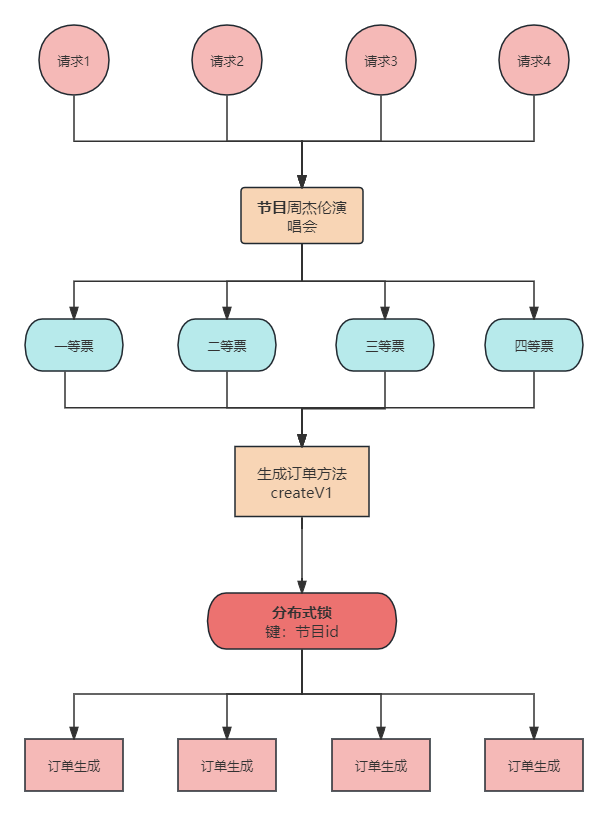
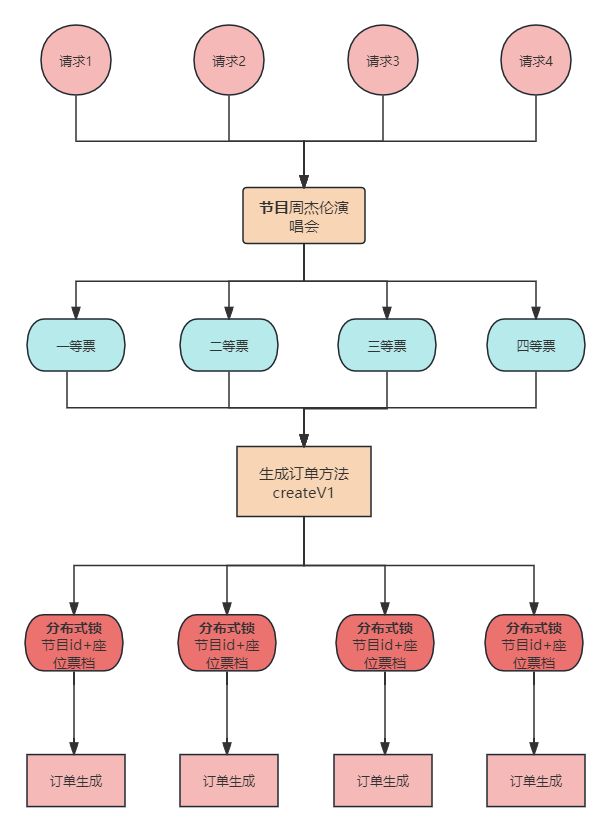
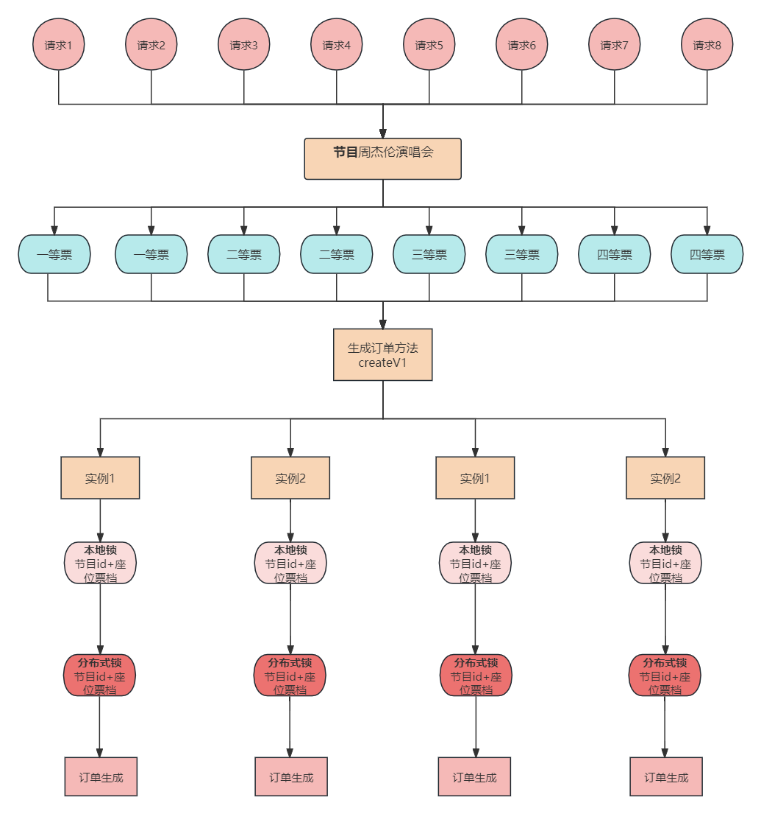
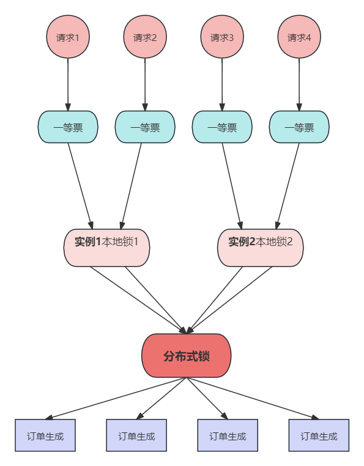

# 业务讲解-如何对锁进行优化更好的缓解购票压力

### 提要
在[业务讲解-如何应对高并发下的购票压力](https://www.yuque.com/u22210564/ykdrdh/schg4ewp7pupbb88)文章中讲解了用户流程，**关于如何加分布式锁，和修改数据进行生成订单的流程**。小伙伴需要先阅读这篇文章，然后再来学习本文的内容


## 目前存在的问题
### 锁的类型
通过上述的方案已经解决了大部分锁的问题，但有个细节，就是锁的种类，这里要介绍的就是**公平锁和非公平锁**


公平锁和非公平锁是在并发编程中常用的两种锁的类型，它们在资源的访问方式上有所不同，影响着程序的公平性和效率。


1. **公平锁**： 
    - 公平锁是指多个线程按照申请锁的顺序来获取锁，先来先得，FIFO（先进先出）原则。即当线程尝试获取锁时，如果发现锁已被其他线程占用，则该线程会进入等待队列，等待其他线程释放锁。
    - 公平锁保证了所有线程都有公平竞争获取锁的机会，不存在线程饥饿（某些线程一直无法获取锁）的情况。
2. **非公平锁**： 
    - 非公平锁没有先来先得的规则，线程在尝试获取锁时，如果发现锁已经被其他线程占用，它会采取一些手段（如自旋等待）来尝试获取锁，而不是直接进入等待队列。
    - 当持有锁的线程释放锁时，会选择一个等待线程来获取锁，这个选择可能不是按照先来先得的原则，因此可能会导致某些线程长时间等待，降低了公平性。


#### **效率方面：**
+ 公平锁的效率可能会比非公平锁低一些，因为公平锁需要**维护一个等待队列**，线程进入队列和唤醒队列中的线程需要进**行上下文切换**，这会带来一定的性能开销。
+ 非公平锁在尝试获取锁时会尽可能地避免线程的上下文切换，因为它可能会通过自旋等待来获取锁，而不是直接进入等待队列，所以在一些情况下，非公平锁的效率可能会略高于公平锁。


选择公平锁还是非公平锁取决于具体的场景和需求。如果程序对公平性要求较高，希望所有线程都能有公平竞争获取锁的机会，那么可以选择公平锁；如果程序对性能要求较高，可以容忍部分线程长时间等待，那么可以选择非公平锁


本项目的解决方案是提供公平锁和非公平锁两种类型的分布式锁，如果想追求绝对的性能，那就使用非公平锁。如果想追求用户体验想先请求的用户先获得锁，那就使用公平锁


### 锁的粒度


```java
@ServiceLock(name = PROGRAM_ORDER_CREATE_V1,keys = {"#programOrderCreateDto.programId"})
public String createV1(ProgramOrderCreateDto programOrderCreateDto) {
    return programOrderService.create(programOrderCreateDto);
}
```




目前的用户购票方法中，分布式锁**锁的是整个节目**，思考下这有什么问题？答案就是**锁的粒度**，用户1购买的是一等票，用户2购买的是二等票。而票的数量是按照票的类型档次划分的，也就是说一等票和二等票的数量分开管理的。那用户1完全不需要和用户2来竞争同一把锁啊，也就是说 **使用节目id作为锁的粒度太大了**


把整个节目锁住了，那么凡是购买该节目的用户都要等待，在同一时间内，这个节目只能有一个用户购票，这并发是比较差的，所以将锁的粒度进一步缩小，改成按照**节目id+座位票档id来加锁**，这样请求1、请求2、请求3、请求4就可以并发购票了，互不影响，系统的处理效率**直接提高400%**啊




进行到这里确实将锁的效率提高了，但这样就没有问题了吗？问题确实存在，**如果请求1购买了一等票和二等票这两种类型的票，那么就有了锁重合的问题了**，虽然这种情况比较少，一般的人买多张都会买相同票档的，但确实可能会有这种情况出现，难道就没有办法了吗？并不是


**可以根据要购买的票档类型来获取多个锁**，还是以这个例子为例，这时请求1就要同时获取一等票和二等票两把锁了，执行完后再释放这两把锁，有人可能会想**如果有多把锁会不会有死锁的问题？**

**<font style="color:#213BC0;">这里要把加锁的顺序和解锁的顺序处理好，以及还要把已获得锁的请求，即使在业务执行出现异常后也要能安全的解开，把这两点做好了，就不会出现死锁的问题了</font>**


### 分布式锁的压力


短时间内这么多请求来竞争锁，其实对redis的压力也是不小的，那么有没有办法能减少这么多在redis上的请求呢？


其实可以**再加一个本地锁的方案**，使用本地锁的效率可比分布式锁要强太多了，一个是内存操作，一个有网络请求，根本不是一个量级的。先让在同一个实例中的请求去竞争自己实例的本地锁，当获得本地锁的请求再去竞争分布式锁，这样一来和之前的方案相比，短时间内的分布式锁的压力就会小很多了


#### 其他问题


进行到这是不是就没有问题了？事实并不是这般美好，确实还有问题，就是本地锁的内存压力，每个节目票档都会有一把本地锁，那么当请求多了，本地锁的对象也会增多，这就给系统造成内存压力，时间长了就会内存溢出。


所以要有一个过期时间的机制，当某个节目+票档在一段时间内没有访问的话，**那么就把对应的锁对象设置过期，等gc时直接回收掉。**


一般设计这种节目+票档 对应 锁 的关系基本都是用的Map结构，线程不安全的有HashMap，线程安全的有ConcurrentHashMap，这个结构是要管理该实例下所有本地锁对象的，肯定是要线程安全的，也就是ConcurrentHashMap，但ConcurrentHashMap并没有设置过期时间的功能


所以要换一种结构叫**Caffeine**，基于Java 1.8的高性能本地缓存库，由Guava改进而来，而且在Spring5开始的默认缓存实现就将Caffeine代替原来的Google Guava，官方说明指出，其缓存命中率已经接近最优值。实际上Caffeine这样的本地缓存和ConcurrentMap很像，即支持并发，并且支持O(1)时间复杂度的数据存取。二者的主要区别在于：


+ ConcurrentMap将存储所有存入的数据，直到你显式将其移除；
+ Caffeine将通过给定的配置，自动移除“不常用”的数据，以保持内存的合理占用。


因此，一种更好的理解方式是：Cache是一种带有存储和移除策略的Map。


官网地址：

[GitHub - ben-manes/caffeine: A high performance caching library for Java](https://github.com/ben-manes/caffeine)


#### 本地锁+分布式锁的流程图



针对于上述的优化方案，已经**都应用到了生成订单的createV2方法**，接下来来介绍此方法


## 生成订单的createV2接口


### 控制层


**com.damai.controller.ProgramOrderController#createV2**


```java
@ApiOperation(value = "购票V2")
@PostMapping(value = "/create/v2")
public ApiResponse<String> createV2(@Valid @RequestBody ProgramOrderCreateDto programOrderCreateDto) {
    return ApiResponse.ok(programOrderLock.createV2(programOrderCreateDto));
}
```


### 加锁层


**com.damai.lock.ProgramOrderLock#createV2**


```java
/**
 * 订单优化版本v2
 * 先用本地锁将没有获得锁的请求拦在外，获得本地锁后，再去获得分布式锁，这样可以减少对redis的压力
 * 本地锁和分布式锁的键为 节目id+票档id，这样同一节目下不同票档的用户请求依旧可以并发执行
 */
@RepeatExecuteLimit(
        name = RepeatExecuteLimitConstants.CREATE_PROGRAM_ORDER,
        keys = {"#programOrderCreateDto.userId","#programOrderCreateDto.programId"})
public String createV2(ProgramOrderCreateDto programOrderCreateDto) {
    //业务参数验证
    compositeContainer.execute(CompositeCheckType.PROGRAM_ORDER_CREATE_CHECK.getValue(),programOrderCreateDto);
    List<SeatDto> seatDtoList = programOrderCreateDto.getSeatDtoList();
    List<Long> ticketCategoryIdList = new ArrayList<>();
    //手动选择座位时统计出票档id
    if (CollectionUtil.isNotEmpty(seatDtoList)) {
        //按照票档id进行排序，这样为了避免不同请求获取票档的顺序不同加锁而可能产生的死锁问题
        ticketCategoryIdList = 
                seatDtoList.stream().map(SeatDto::getTicketCategoryId).distinct().sorted().collect(Collectors.toList());
    }else {
        //自动匹配座位时传入的票档id
        ticketCategoryIdList.add(programOrderCreateDto.getTicketCategoryId());
    }
    //本地锁集合
    List<ReentrantLock> localLockList = new ArrayList<>(ticketCategoryIdList.size());
    //分布式锁集合
    List<RLock> serviceLockList = new ArrayList<>(ticketCategoryIdList.size());
    //加锁成功的本地锁集合
    List<ReentrantLock> localLockSuccessList = new ArrayList<>(ticketCategoryIdList.size());
    //加锁成功的分布式锁集合
    List<RLock> serviceLockSuccessList = new ArrayList<>(ticketCategoryIdList.size());
    //根据统计出的票档id获得本地锁和分布式锁集合
    for (Long ticketCategoryId : ticketCategoryIdList) {
        //锁的key为d_program_order_create_v2_lock-programId-ticketCategoryId
        String lockKey = StrUtil.join("-",PROGRAM_ORDER_CREATE_V2,
                programOrderCreateDto.getProgramId(),ticketCategoryId);
        //获得本地锁实例
        ReentrantLock localLock = localLockCache.getLock(lockKey,false);
        //获得分布式锁实例
        RLock serviceLock = serviceLockTool.getLock(LockType.Reentrant, lockKey);
        //添加到本地锁集合
        localLockList.add(localLock);
        //添加到分布式锁集合
        serviceLockList.add(serviceLock);
    }
    //循环本地锁进行加锁
    for (ReentrantLock reentrantLock : localLockList) {
        try {
            reentrantLock.lock();
        }catch (Throwable t) {
            //如果加锁出现异常，则终止
            break;
        }
        localLockSuccessList.add(reentrantLock);
    }
    boolean serviceLockFail = false;
    //循环分布式锁进行加锁
    for (RLock rLock : serviceLockList) {
        try {
            rLock.lock();
        }catch (Throwable t) {
            //如果加锁出现异常，则终止
            serviceLockFail = true;
            break;
        }
        serviceLockSuccessList.add(rLock);
    }
    try {
        if (serviceLockFail) {
            throw new DaMaiFrameException(BaseCode.SERVICE_LOCK_FAIL);
        }
        //进行订单创建
        return programOrderService.create(programOrderCreateDto);
    }finally {
        //先循环解锁分布式锁
        for (int i = serviceLockSuccessList.size() - 1; i >= 0; i--) {
            RLock rLock = serviceLockSuccessList.get(i);
            try {
                rLock.unlock();
            }catch (Throwable t) {
                log.error("service lock unlock error",t);
            }
        }
        //再循环解锁本地锁
        for (int i = localLockSuccessList.size() - 1; i >= 0; i--) {
            ReentrantLock reentrantLock = localLockSuccessList.get(i);
            try {
                reentrantLock.unlock();
            }catch (Throwable t) {
                log.error("local lock unlock error",t);
            }
        }
    }
}
```


#### 业务参数验证


这里将业务参数的验证逻辑进行了调整，放到了获得锁的步骤之前，因为锁粒度拆分后，需要票档id，所以票档id需要先验证


#### 加锁流程总结：


1. **初始化锁集合**：为每个票档ID创建对应的本地锁和分布式锁，本地锁收集到**localLockList**集合中，分布式锁收集到**serviceLockList**集合中
2. **加锁：** 
    - **本地锁加锁**：遍历本地锁集合，尝试加锁，如果加锁成功，将该锁添加到加锁成功的本地锁**localLockSuccessList**集合中。如果加锁过程中遇到异常，则停止加锁流程。
    - **分布式锁加锁**：遍历分布式锁集合，尝试加锁，如果加锁成功，将该锁添加到加锁成功的分布式锁**serviceLockSuccessList**集合中。同样，如果加锁过程中遇到异常，则停止加锁流程。
3. **执行业务逻辑**：在所有锁成功加锁之后，执行订单创建业务逻辑
4. **解锁：** 
    - **分布式锁解锁**：从加锁成功的分布式锁集合中，按照逆序遍历解锁每一个分布式锁
    - **本地锁解锁**：从加锁成功的本地锁集合中，按照逆序遍历解锁每一个本地锁


#### 锁的类型：


代码中使用的非公平锁


```java
//获得本地锁实例
ReentrantLock localLock = localLockCache.getLock(lockKey,false);
```


```java
//获得分布式锁实例
RLock serviceLock = serviceLockTool.getLock(LockType.Reentrant, lockKey);
```


如果使用公平锁，可改为


```java
//获得本地锁实例
ReentrantLock localLock = localLockCache.getLock(lockKey,true);
```


```java
//获得分布式锁实例
RLock serviceLock = serviceLockTool.getLock(LockType.Fair, lockKey);
```


#### 本地锁实例的获取：


```java
//获得本地锁实例
ReentrantLock localLock = localLockCache.getLock(lockKey,false);
```


**localLockCache**是本地锁缓存，可根据锁名和锁类型(公平锁/非公平锁)来获得ReentrantLock的实例


#### LocalLockCache


```java
public class LocalLockCache {
    
    /**
     * 本地锁缓存
     * */
    private Cache<String, ReentrantLock> localLockCache;
    /**
     * 本地锁的过期时间(小时单位)
     * */
    @Value("${durationTime:2}")
    private Integer durationTime;
    
    @PostConstruct
    public void localLockCacheInit(){
        localLockCache = Caffeine.newBuilder()
                .expireAfterWrite(durationTime, TimeUnit.HOURS)
                .build();
    }
    
    /**
     * 获得锁，Caffeine的get是线程安全的
     * */
    public ReentrantLock getLock(String lockKey,boolean fair){
        return localLockCache.get(lockKey, key -> new ReentrantLock(fair));
    }
}
```


**LocalLockCache**其实是用Caffeine缓存来保存的锁信息，并可以设置锁实例的保存时间，默认是2小时，这个时间可以根据`durationTime`来进行配置，如果时间过大，那么锁的实例就会过多，对项目的内存就会有压力。如果时间过小，那么构建锁的频率就会增加，性能就会受到影响，使用时，可根据业务特点进行灵活配置


### 本地锁+分布式锁的公平性问题


上述提到了，如果想让锁的类型为公平锁的话，那么在获取锁的实例时候，指定锁的类型就行了，但就算本地锁和分布式锁都是公平锁了，用户获得锁的顺序就是公平的吗？其实并不是


**其实本地锁+分布式锁在全部采用公平锁的情况下，也只能保证局部有序，并不能保证全局有序**




假设请求的先后顺序分别为 请求1 > 请求2 > 请求3 > 请求4。在获取本地锁时，**能保证请求1先比请求2获得锁，请求3先比请求4获得锁。**


假设请求1先获得本地锁，请求4先获得本地锁。在获得分布式锁的时候，**是不能保证请求1一定先比请求4获得锁的**，有可能请求1的网络延迟比较高，请求4的网络延迟比较低，就让请求4先获得了


**所以任何的技术方案都不是万能的**，具体怎么使用就看业务怎么取舍。如果并发量很高，那么为了性能考虑，全局有序也就不那么重要了，执行效率才是第一位。


如果并发量不高，想提升用户体验，那么就只使用分布式锁，可以保证全局有序


加锁后执行的生成订单逻辑**com.damai.service.ProgramOrderService#create**，在 [业务讲解-如何应对高并发下的购票压力](https://www.yuque.com/u22210564/ykdrdh/schg4ewp7pupbb88) 文章中进行了详细的讲解，这里不再赘述


## 这样还不够！


进行到这里对锁的优化其实已经做的够多了，小伙伴出去面试可以说能吊打一片了，但做到这种程度就够了吗？No！完全还可以进一步的优化，**实现无锁化！**


在订单生成的逻辑中，余票数量的检验，进行了座位的验证，以及后续的的余票扣除，座位锁定的操作，如果要是将这些操作直接在lua中执行呢？如果余票数量充足，相应座位也可以购买，那么直接就在lua中全都搞定了，然后直接生成订单不就可以了吗


在下一篇文章[业务讲解-解决高并发下购票压力的终极杀招 "无锁化!"](https://www.yuque.com/u22210564/ykdrdh/zyr9pd9ogzqyas2z)会详细的介绍，小伙伴可跳转查看


> 更新: 2025-09-01 10:10:34  
> 原文: <https://www.yuque.com/u22210564/ykdrdh/fs2pbqaxyekxg9y3>