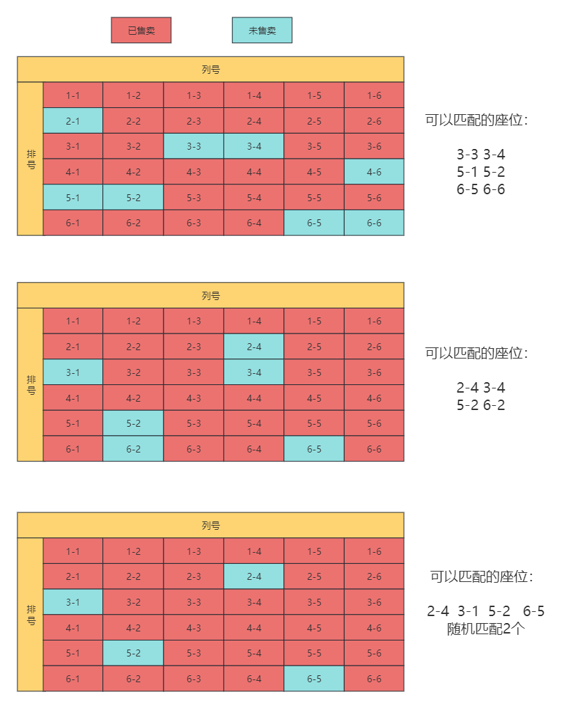
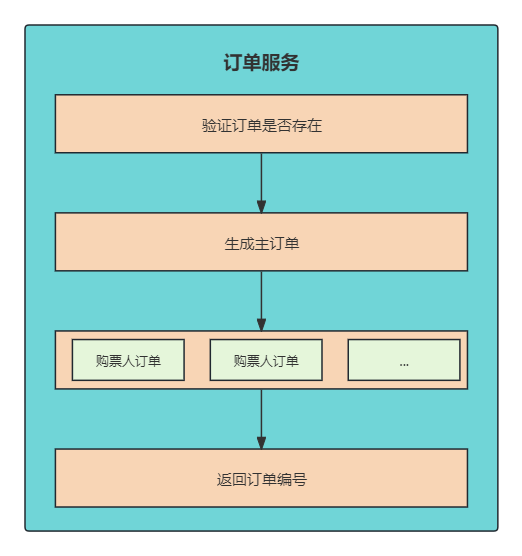

# 业务讲解-如何应对高并发下的购票压力

**本文要介绍的就是大麦项目中最为核心的业务，如果应对高并发下的购票压力？并解决数据的并发问题？**


在售票项目中，高并发购票会给系统带来多方面的挑战，这些挑战包括但不限于：


1. **性能瓶颈**：当大量用户同时尝试购买票务时，系统需要能够快速响应每个请求。性能瓶颈可能发生在服务器的计算能力、数据库访问、网络带宽或其他资源限制上
2. **数据一致性**：保证在高并发环境下数据的准确性和一致性是非常重要的。例如，在售票系统中，需要确保不会出售超过实际可用票数的票，这要求系统能够正确处理并发写操作，避免数据冲突和覆盖
3. **系统可靠性**：高并发请求可能会导致系统过载，甚至崩溃。系统需要具备自我恢复的能力，并能够在出现故障时保持一定程度的服务可用性
4. **用户体验**：在高并发情况下，系统的响应时间可能会变长，影响用户体验。系统需要通过合理的设计来优化响应时间，比如通过缓存常用数据，减少数据库查询等方式


针对购票流程，大麦网项目进行使用了各种技巧来提高效率，包括幂等性、本地锁、分布式锁、redis、lua、限流算法等。希望小伙伴能认真的学习此章节，对自己的开发能力绝对能提升一个层次


## 节目服务控制层入口
**com.damai.controller.ProgramOrderController#createV1**

```java
@ApiOperation(value = "购票V1")
@PostMapping(value = "/create/v1")
public ApiResponse<String> createV1(@Valid @RequestBody ProgramOrderCreateDto programOrderCreateDto) {
    return ApiResponse.ok(programOrderLock.createV1(programOrderCreateDto));
}
```


## 加锁层


**com.damai.lock.ProgramOrderLock#createV1**


```java
/**
 * 订单创建，使用节目id作为锁
 * */
@RepeatExecuteLimit(
        name = RepeatExecuteLimitConstants.CREATE_PROGRAM_ORDER,
        keys = {"#programOrderCreateDto.userId","#programOrderCreateDto.programId"})
@ServiceLock(name = PROGRAM_ORDER_CREATE_V1,keys = {"#programOrderCreateDto.programId"})
public String createV1(ProgramOrderCreateDto programOrderCreateDto) {
    compositeContainer.execute(CompositeCheckType.PROGRAM_ORDER_CREATE_CHECK.getValue(),programOrderCreateDto);
    return programOrderService.create(programOrderCreateDto);
}
```


在详细分析前，我们先来看下执行的流程图，让小伙伴更加的清晰


流程图中包含了关键的业务，小伙伴看完心里有个大概的印象，接下来详细介绍每个流程部分


## 幂等性的保护


**com.damai.lock.ProgramOrderLock#createV1**


```java
@RepeatExecuteLimit(
            name = RepeatExecuteLimitConstants.CREATE_PROGRAM_ORDER,
            keys = {"#programOrderCreateDto.userId","#programOrderCreateDto.programId"})
```


在此业务中为什么要做幂等性的保护，其实就是为了防止用户多次提交，前端的解决办法是将按钮置灰，但这种不靠谱。如果前端没有控制住、网络延迟、或者有人刷号直接调用接口来多次请求就会出现问题了，所以说后端也要做好幂等保护


### 为什么有分布式锁了还要加幂等组件？


可能小伙伴会有这样的疑惑，直接使用分布式锁不就行了，为什么还要额外设计出幂等组件？首先直接使用分布式锁是可以实现幂等的，当然业务逻辑验证也要做验证，但其实分布式锁会浪费一些性能


> <font style="color:#213BC0;">分布式锁的特点是多个请求并发执行，这些请求是来自不同的用户，</font>**<font style="color:#213BC0;">也就是这些请求虽然要依次等待锁执行，但最终还是要把这些请求都执行完的</font>**<font style="color:#213BC0;">(执行时间太长超时的异常情况排除)，总结起来就是都要获得锁，没有获得锁的请求，也要争取获得锁接着执行</font>
>
> <font style="color:#213BC0;"> </font>
>
> <font style="color:#213BC0;">幂等的特点也是多个请求并发执行，但这些请求是来自同一个用户，</font>**<font style="color:#213BC0;">也就是说这些请求只要保证第一个请求能执行，其余的请求要直接拒绝掉</font>**<font style="color:#213BC0;">，总结起来就是只有</font>**<font style="color:#213BC0;">第一个请求获得锁执行就可以，其余的请求看到已经上了锁，那么就要直接结束掉</font>**
>


这个也是我在面试别人时，经常会问的问题，知道这个特点后，才真正能掌握为什么需要幂等


关于幂等性的详细介绍以及幂等组件的使用和设计，可跳转到相应的文档

[组件讲解-如何打造高效幂等组件，确保数据一致性](https://www.yuque.com/u22210564/ykdrdh/ro5vey3tmlgzdw0p)


## 分布式锁


**com.damai.lock.ProgramOrderLock#createV1**


```java
@ServiceLock(name = PROGRAM_ORDER_CREATE_V1,keys = {"#programOrderCreateDto.programId"})
```


```java
/**
 * 节目服务订单创建V1
 * */
public final static String PROGRAM_ORDER_CREATE_V1 = "d_program_order_create_v1_lock";
```


分布式锁使用节目id作为锁，关于分布式锁组件的使用和详细的设计可跳转到相应的文档

[组件讲解-分布式锁使用全攻略，轻松掌握并发控制的利器](https://www.yuque.com/u22210564/ykdrdh/nvs9pa10gomg6ela)


[组件讲解-分布式锁原理的详细剖析-上](https://www.yuque.com/u22210564/ykdrdh/ag86c75wkxdhuz44)


[组件讲解-分布式锁原理的详细剖析-下](https://www.yuque.com/u22210564/ykdrdh/han0536p708u6thw)


## 组合模式的业务验证


**com.damai.service.ProgramOrderService#create**


```java
//进行业务验证
compositeContainer.execute(CompositeCheckType.PROGRAM_ORDER_CREATE_CHECK.getValue(),programOrderCreateDto);
```


此组环是使用了**组合模式和树形结构**来将业务的验证逻辑进行复用并且串联起来按照树形结构执行


用户购票验证逻辑的类型为`program_order_create_check`，验证的逻辑有


+ 验证座位参数 
+ 将节目缓存 
+ 验证缓存是否存在节目数据 
+ 验证用户是否存在 


关于此业务验证的详细介绍，可跳转到相关文档查看


[业务讲解-如何统一管理复杂的用户购票验证流程](https://www.yuque.com/u22210564/ykdrdh/cee3nk1as89bt8pc)


## 执行业务逻辑


**com.damai.service.ProgramOrderService#create**


在经过幂等、分布锁、业务验证后，开始执行真正的业务流程处理环节


```java
public String create(ProgramOrderCreateDto programOrderCreateDto) {
    //从多级缓存中查找节目演出时间ProgramShowTime
    ProgramShowTime programShowTime =
            programShowTimeService.selectProgramShowTimeByProgramIdMultipleCache(programOrderCreateDto.getProgramId());
    //查询对应的票档类型
    List<TicketCategoryVo> getTicketCategoryList = 
            getTicketCategoryList(programOrderCreateDto,programShowTime.getShowTime());
    //传入的座位总价格
    BigDecimal parameterOrderPrice = new BigDecimal("0");
    //库中的座位总价格
    BigDecimal databaseOrderPrice = new BigDecimal("0");
    //要购买的座位
    List<SeatVo> purchaseSeatList = new ArrayList<>();
    //入参的座位
    List<SeatDto> seatDtoList = programOrderCreateDto.getSeatDtoList();
    //该节目下所有未售卖的座位
    List<SeatVo> seatVoList = new ArrayList<>();
    //该节目下的余票数量
    Map<String, Long> ticketCategoryRemainNumber = new HashMap<>(16);
    //遍历得到的票档
    for (TicketCategoryVo ticketCategory : getTicketCategoryList) {
        //从缓存中查询座位
        List<SeatVo> allSeatVoList = 
                seatService.selectSeatResolution(programOrderCreateDto.getProgramId(), ticketCategory.getId(), 
                        DateUtils.countBetweenSecond(DateUtils.now(), programShowTime.getShowTime()), TimeUnit.SECONDS);
        //将查询到未售卖的座位放入seatVoList
        seatVoList.addAll(allSeatVoList.stream().
                filter(seatVo -> seatVo.getSellStatus().equals(SellStatus.NO_SOLD.getCode())).toList());
        //将查询到的余票数量放入ticketCategoryRemainNumber   key:票档id  value:余票数量
        ticketCategoryRemainNumber.putAll(ticketCategoryService.getRedisRemainNumberResolution(
                programOrderCreateDto.getProgramId(),ticketCategory.getId()));
    }
    //入参座位存在
    if (CollectionUtil.isNotEmpty(seatDtoList)) {
        //余票数量检测 key：票档id  value：票档数量
        Map<Long, Long> seatTicketCategoryDtoCount = seatDtoList.stream()
                .collect(Collectors.groupingBy(SeatDto::getTicketCategoryId, Collectors.counting()));
        for (Entry<Long, Long> entry : seatTicketCategoryDtoCount.entrySet()) {
            Long ticketCategoryId = entry.getKey();
            Long purchaseCount = entry.getValue();
            //余票数量
            Long remainNumber = Optional.ofNullable(ticketCategoryRemainNumber.get(String.valueOf(ticketCategoryId)))
                    .orElseThrow(() -> new DaMaiFrameException(BaseCode.TICKET_CATEGORY_NOT_EXIST_V2));
            //如果购买数量大于余票数量，那么提示数量不足
            if (purchaseCount > remainNumber) {
                throw new DaMaiFrameException(BaseCode.TICKET_REMAIN_NUMBER_NOT_SUFFICIENT);
            }
        }
        //验证入参的对象在库中的状态，不存在、已锁、已售卖
        Map<String, SeatVo> seatVoMap = seatVoList.stream().collect(Collectors
                .toMap(seat -> seat.getRowCode() + "-" + seat.getColCode(), seat -> seat, (v1, v2) -> v2));
        //循环入参的座位对象
        for (SeatDto seatDto : seatDtoList) {
            SeatVo seatVo = seatVoMap.get(seatDto.getRowCode() + "-" + seatDto.getColCode());
            //如果入参的座位在未售卖的座位中不存在，那么直接抛出异常提示
            if (Objects.isNull(seatVo)) {
                throw new DaMaiFrameException(BaseCode.SEAT_IS_NOT_NOT_SOLD);
            }
            purchaseSeatList.add(seatVo);
            //将入参的座位价格进行累加
            parameterOrderPrice = parameterOrderPrice.add(seatDto.getPrice());
            //将库中的座位价格进行类型
            databaseOrderPrice = databaseOrderPrice.add(seatVo.getPrice());
        }
        //传入的座位价格累加不能大于存放的相应座位累加价格
        if (parameterOrderPrice.compareTo(databaseOrderPrice) > 0) {
            throw new DaMaiFrameException(BaseCode.PRICE_ERROR);
        }
    }else {
        //入参座位不存在，利用算法自动根据人数和票档进行分配相邻座位
        Long ticketCategoryId = programOrderCreateDto.getTicketCategoryId();
        Integer ticketCount = programOrderCreateDto.getTicketCount();
        //余票检测
        Long remainNumber = Optional.ofNullable(ticketCategoryRemainNumber.get(String.valueOf(ticketCategoryId)))
                .orElseThrow(() -> new DaMaiFrameException(BaseCode.TICKET_CATEGORY_NOT_EXIST_V2));
        //如果购票的数量大于余票数量，则直接抛出异常提示
        if (ticketCount > remainNumber) {
            throw new DaMaiFrameException(BaseCode.TICKET_REMAIN_NUMBER_NOT_SUFFICIENT);
        }
        //用算法匹配座位
        purchaseSeatList = SeatMatch.findAdjacentSeatVos(seatVoList.stream().filter(seatVo ->
                Objects.equals(seatVo.getTicketCategoryId(), ticketCategoryId)).collect(Collectors.toList()), ticketCount);
        //如果匹配出来的座位数量小于要购买的数量，拒绝执行
        if (purchaseSeatList.size() < ticketCount) {
            throw new DaMaiFrameException(BaseCode.SEAT_OCCUPY);
        }
    }
    //进行操作缓存中的数据
    updateProgramCacheDataResolution(programOrderCreateDto.getProgramId(),purchaseSeatList,OrderStatus.NO_PAY);
    //将筛选出来的购买的座位信息传入，执行创建订单的操作
    return doCreate(programOrderCreateDto,purchaseSeatList);
}
```


### 获取节目演出时间
先从缓存中获取获取 **节目演出时间ProgramShowTime**，此数据在查询节目详情的时候放入了进去，所以这里一定会存在


### 获取对应的票档类型
```java
//查询对应的票档类型
List<TicketCategoryVo> getTicketCategoryList = 
        getTicketCategoryList(programOrderCreateDto,programShowTime.getShowTime());
```

```java
public List<TicketCategoryVo> getTicketCategoryList(ProgramOrderCreateDto programOrderCreateDto, Date showTime){
    List<TicketCategoryVo> getTicketCategoryVoList = new ArrayList<>();
    //查询该节目下的所有票档集合
    List<TicketCategoryVo> ticketCategoryVoList =
            ticketCategoryService.selectTicketCategoryListByProgramIdMultipleCache(programOrderCreateDto.getProgramId(),
                    showTime);
    //将查询出的票档集合转为map结构 key:票档id value:票档对象
    Map<Long, TicketCategoryVo> ticketCategoryVoMap =
            ticketCategoryVoList.stream()
                    .collect(Collectors.toMap(TicketCategoryVo::getId, ticketCategoryVo -> ticketCategoryVo));
    List<SeatDto> seatDtoList = programOrderCreateDto.getSeatDtoList();
    //如果手动选择座位
    if (CollectionUtil.isNotEmpty(seatDtoList)) {
        for (SeatDto seatDto : seatDtoList) {
            //验证前端传入的座位信息中的票档id是否真实存在
            TicketCategoryVo ticketCategoryVo = ticketCategoryVoMap.get(seatDto.getTicketCategoryId());
            if (Objects.nonNull(ticketCategoryVo)) {
                //如果存在则放入得到的票档集合中
                getTicketCategoryVoList.add(ticketCategoryVo);
            }else {
                throw new DaMaiFrameException(BaseCode.TICKET_CATEGORY_NOT_EXIST_V2);
            }
        }
    } else {
        //如果自动匹配座位
        //验证前端传入的票档id是否真实存在
        TicketCategoryVo ticketCategoryVo = ticketCategoryVoMap.get(programOrderCreateDto.getTicketCategoryId());
        if (Objects.nonNull(ticketCategoryVo)) {
            //如果存在则放入得到的票档集合中
            getTicketCategoryVoList.add(ticketCategoryVo);
        }else {
            throw new DaMaiFrameException(BaseCode.TICKET_CATEGORY_NOT_EXIST_V2);
        }
    }
    //将得到的票档集合返回
    return getTicketCategoryVoList;
}
```

**getTicketCategoryList** 的作用是验证传入的手动座位中的票档id或者自动选座的票档id是否正确，如果正确的话则将这些传入的票档数据返回


### 注意：
在向Redis中存放的余票数据的key是 d_mai_program_ticket_remain_number_resolution_节目id_票档id

在向Redis中存放的座位数据的key是:

+ d_mai_program_seat_no_sold_resolution_hash_节目id_票档id
+ d_mai_program_seat_lock_resolution_hash_节目id_票档id
+ d_mai_program_seat_sold_resolution_hash_节目id_票档id

在设计缓存结构的时候key命名除了节目id**还有票档id**

#### <font style="color:#213BC0;">为什么缓存key命名除了节目id要额外加个票档id?</font>
> **试想一下key如果只有节目id的话，那么此节目的座位数据都放到一个hash中。如果大型演唱会1w个座位的话，那么每次验证座位和更新状态都要取出这1w个座位，这对项目的压力其实不小的**
>

> **所以要在节目id的基础上再加个票档id，这样每个hash存的就是节目id+票档id下的座位了，如果1w个座位有5个票档的话，那么每个hash就可需要存储2000个座位了**
>
> **还有一点，如果两个用户选择不同的票档，比如第一个用户选择一等票，第二个用户选择二等票，如果在redis集群环境下，进行修改座位状态时，一等票和二等票不再同一个redis集群分片的情况下，那么这两个用户还可以实现并发执行，进一步提供了吞吐量！**
>


### 得到未售卖座位和余票
将上一步得到的票档数据集合进行遍历，在遍历中开始组装数据，根据**遍历的票档id+节目id**得到未售卖的座位和余票数量

```java
//从缓存中查询座位
List<SeatVo> allSeatVoList = 
        seatService.selectSeatResolution(programOrderCreateDto.getProgramId(), ticketCategory.getId(), 
                DateUtils.countBetweenSecond(DateUtils.now(), programShowTime.getShowTime()), TimeUnit.SECONDS);
```

```java
//将查询到的余票数量放入ticketCategoryRemainNumber   key:票档id  value:余票数量
ticketCategoryRemainNumber.putAll(ticketCategoryService.getRedisRemainNumberResolution(
        programOrderCreateDto.getProgramId(),ticketCategory.getId()));
```

这里的座位和余票先是从缓存查询，如果缓存中查询不到，则从数据库中查询，然后再放入缓存中，再返回数据


### 处理座位数据
#### **<font style="color:#213BC0;">如果是手动选座位</font>**
那么先要验证选择的座位票档以及购票数量和真实对应的余票数量是否充足，如果不充足则抛出异常提示。

接着依次验证这些座位是在未售卖的座位集合中，如果这些座位都验证通过了，那么最后验证这些座位的价格总和是否超过存储对应座位价格总和


#### **<font style="color:#213BC0;">如果是自动匹配座位</font>**
****那么先要验证购买的票档数量是否和真实对应的余票数量是否充足

验证通过的话，使用算法自动根据人数和票档进行分配相邻座位，接着验证匹配出来的座位数量是否小于要购票的数量，如果小于，直接抛出异常提示


### 自动匹配座位


#### 分配介绍


一般购票时如果选择多个购票人的话都是想尽量坐在一起，比如说一次买了两张票，那么这两人是要尽可能挨在一起的，如果某一排没有两个相邻的座位了，那么就要到下一排去找到两个相邻的位置


#### 分配流程(以两个人为例)


+ 要在相同的票档中进行匹配
+ 从所属票档的第一排中查找是否有相邻的两个位置
+ 如果没有则依次从第一排找到最后一排
+ 如果没有存在相邻的两个位置，但存在前一排和后一排的列相同，那么也匹配出来
+ 如果都没有匹配到，那么就只能随机查找两个位置
+ 如果没有找到有位置，或者找到的位置不够两个，那么就抛出异常，不继续执行


#### 分配座位流程图


#### 自动匹配座位算法


**com.damai.service.tool.SeatMatch#findAdjacentSeatVos**


```java
public class SeatMatch {
    
    /**
     * 自动选座
     * @param allSeats 可选座位（已按票档过滤）
     * @param seatCount 需要的座位数
     * @return 匹配到的座位列表
     * @throws RuntimeException 如果找不到满足条件的座位
     */
    public static List<SeatVo> findAdjacentSeatVos(List<SeatVo> allSeats, int seatCount) {
        if (CollectionUtil.isEmpty(allSeats)) {
            throw new RuntimeException("没有可用的座位");
        }
        if (seatCount <= 0) {
            throw new IllegalArgumentException("seatCount 必须大于 0");
        }
        
        // 1. 按行分组 & 排序
        Map<Integer, List<SeatVo>> rowMap = allSeats.stream()
                .collect(Collectors.groupingBy(SeatVo::getRowCode));
        rowMap.values().forEach(row -> row.sort(Comparator.comparingInt(SeatVo::getColCode)));
        
        // 2. 从第一排开始，查找同排连续座位
        for (int row : rowMap.keySet().stream().sorted().toList()) {
            List<SeatVo> rowSeats = rowMap.get(row);
            List<SeatVo> result = findConsecutiveSeats(rowSeats, seatCount);
            if (!result.isEmpty()) {
                return result;
            }
        }
        
        // 3. 查找跨排同列座位
        List<SeatVo> sameColResult = findSameColumnSeats(allSeats, seatCount);
        if (!sameColResult.isEmpty()) {
            return sameColResult;
        }
        
        // 4. 随机兜底
        if (allSeats.size() >= seatCount) {
            List<SeatVo> shuffled = new ArrayList<>(allSeats);
            Collections.shuffle(shuffled);
            return shuffled.subList(0, seatCount);
        }
        
        // 5. 都没有找到，抛出异常
        throw new RuntimeException("没有足够的座位可供分配");
    }
    
    /**
     * 在同一排中查找 seatCount 个连续座位
     */
    private static List<SeatVo> findConsecutiveSeats(List<SeatVo> rowSeats, int seatCount) {
        for (int i = 0; i <= rowSeats.size() - seatCount; i++) {
            boolean ok = true;
            for (int j = 1; j < seatCount; j++) {
                if (rowSeats.get(i + j).getColCode() - rowSeats.get(i + j - 1).getColCode() != 1) {
                    ok = false;
                    break;
                }
            }
            if (ok) {
                return rowSeats.subList(i, i + seatCount);
            }
        }
        return Collections.emptyList();
    }
    
    /**
     * 在不同排同一列查找 seatCount 个连续行的座位
     */
    private static List<SeatVo> findSameColumnSeats(List<SeatVo> allSeats, int seatCount) {
        // 按列分组
        Map<Integer, List<SeatVo>> colMap = allSeats.stream()
                .collect(Collectors.groupingBy(SeatVo::getColCode));
        colMap.values().forEach(col -> col.sort(Comparator.comparingInt(SeatVo::getRowCode)));
        
        for (int col : colMap.keySet()) {
            List<SeatVo> colSeats = colMap.get(col);
            for (int i = 0; i <= colSeats.size() - seatCount; i++) {
                if (colSeats.get(i + seatCount - 1).getRowCode() - colSeats.get(i).getRowCode() == seatCount - 1) {
                    return colSeats.subList(i, i + seatCount);
                }
            }
        }
        return Collections.emptyList();
    }
}
```


以上就是关于座位的验证了，如果这些都验证通过了，那么开始进行扣除余票数量和将对应的座位状态从未售卖修改为锁定中


### 更新缓存余票数量和修改座位状态


**com.damai.service.ProgramOrderService#updateProgramCacheDataResolution**


```java
private void updateProgramCacheDataResolution(Long programId,List<SeatVo> seatVoList,OrderStatus orderStatus){
    //如果要操作的订单状态不是未支付和取消，那么直接拒绝
    if (!(Objects.equals(orderStatus.getCode(), OrderStatus.NO_PAY.getCode()) ||
            Objects.equals(orderStatus.getCode(), OrderStatus.CANCEL.getCode()))) {
        throw new DaMaiFrameException(BaseCode.OPERATE_ORDER_STATUS_NOT_PERMIT);
    }
    List<String> keys = new ArrayList<>();
    //这里key只是占位，并不起实际作用
    keys.add("#");
    
    String[] data = new String[3];
    Map<Long, Long> ticketCategoryCountMap =
            seatVoList.stream().collect(Collectors.groupingBy(SeatVo::getTicketCategoryId, Collectors.counting()));
    //更新票档数据集合
    JSONArray jsonArray = new JSONArray();
    ticketCategoryCountMap.forEach((k,v) -> {
        //这里是计算更新票档数据
        JSONObject jsonObject = new JSONObject();
        //票档数量的key
        jsonObject.put("programTicketRemainNumberHashKey",RedisKeyBuild.createRedisKey(
                RedisKeyManage.PROGRAM_TICKET_REMAIN_NUMBER_HASH_RESOLUTION, programId, k).getRelKey());
        //票档id
        jsonObject.put("ticketCategoryId",String.valueOf(k));
        //如果是生成订单操作，则将扣减余票数量
        if (Objects.equals(orderStatus.getCode(), OrderStatus.NO_PAY.getCode())) {
            jsonObject.put("count","-" + v);
            //如果是取消订单操作，则将恢复余票数量
        } else if (Objects.equals(orderStatus.getCode(), OrderStatus.CANCEL.getCode())) {
            jsonObject.put("count",v);
        }
        jsonArray.add(jsonObject);
    });
    //座位map key:票档id  value:座位集合
    Map<Long, List<SeatVo>> seatVoMap = 
            seatVoList.stream().collect(Collectors.groupingBy(SeatVo::getTicketCategoryId));
    JSONArray delSeatIdjsonArray = new JSONArray();
    JSONArray addSeatDatajsonArray = new JSONArray();
    seatVoMap.forEach((k,v) -> {
        JSONObject delSeatIdjsonObject = new JSONObject();
        JSONObject seatDatajsonObject = new JSONObject();
        String seatHashKeyDel = "";
        String seatHashKeyAdd = "";
        //如果是生成订单操作，则将座位修改为锁定状态    
        if (Objects.equals(orderStatus.getCode(), OrderStatus.NO_PAY.getCode())) {
            //没有售卖座位的key
            seatHashKeyDel = (RedisKeyBuild.createRedisKey(RedisKeyManage.PROGRAM_SEAT_NO_SOLD_RESOLUTION_HASH, programId, k).getRelKey());
            //锁定座位的key
            seatHashKeyAdd = (RedisKeyBuild.createRedisKey(RedisKeyManage.PROGRAM_SEAT_LOCK_RESOLUTION_HASH, programId, k).getRelKey());
            for (SeatVo seatVo : v) {
                seatVo.setSellStatus(SellStatus.LOCK.getCode());
            }
            //如果是取消订单操作，则将座位修改为未售卖状态
        } else if (Objects.equals(orderStatus.getCode(), OrderStatus.CANCEL.getCode())) {
            //锁定座位的key
            seatHashKeyDel = (RedisKeyBuild.createRedisKey(RedisKeyManage.PROGRAM_SEAT_LOCK_RESOLUTION_HASH, programId, k).getRelKey());
            //没有售卖座位的key
            seatHashKeyAdd = (RedisKeyBuild.createRedisKey(RedisKeyManage.PROGRAM_SEAT_NO_SOLD_RESOLUTION_HASH, programId, k).getRelKey());
            for (SeatVo seatVo : v) {
                seatVo.setSellStatus(SellStatus.NO_SOLD.getCode());
            }
        }
        //要进行删除座位的key
        delSeatIdjsonObject.put("seatHashKeyDel",seatHashKeyDel);
        //如果是订单创建，那么就扣除未售卖的座位id
        //如果是订单取消，那么就扣除锁定的座位id
        delSeatIdjsonObject.put("seatIdList",v.stream().map(SeatVo::getId).map(String::valueOf).collect(Collectors.toList()));
        delSeatIdjsonArray.add(delSeatIdjsonObject);
        //要进行添加座位的key
        seatDatajsonObject.put("seatHashKeyAdd",seatHashKeyAdd);
        //如果是订单创建的操作，那么添加到锁定的座位数据
        //如果是订单订单的操作，那么添加到未售卖的座位数据
        List<String> seatDataList = new ArrayList<>();
        //循环座位
        for (SeatVo seatVo : v) {
            //选放入座位did
            seatDataList.add(String.valueOf(seatVo.getId()));
            //接着放入座位对象
            seatDataList.add(JSON.toJSONString(seatVo));
        }
        //要进行添加座位的数据
        seatDatajsonObject.put("seatDataList",seatDataList);
        addSeatDatajsonArray.add(seatDatajsonObject);
    });
    
    //票档相关数据
    data[0] = JSON.toJSONString(jsonArray);
    //要进行删除座位的key
    data[1] = JSON.toJSONString(delSeatIdjsonArray);
    //要进行添加座位的相关数据
    data[2] = JSON.toJSONString(addSeatDatajsonArray);
    //执行lua脚本
    programCacheResolutionOperate.programCacheOperate(keys,data);
}
```


**此方法是负责生成订单和取消订单的两种操作，这两种操作都是操作余票数量和座位状态，操作正好是彼此相反的，所以可以直接将两种操作放在一起，实现共用**

> **<font style="color:#213BC0;">生成订单是要扣减余票数量，将座位状态从未售卖修改为锁定中</font>**
>
> **<font style="color:#213BC0;">取消订单是要恢复余票数量，将座位状态从锁定中修改为未售卖</font>**
>


本文是介绍用户购票的流程，所以只分析生成订单的操作，此方法其实就是拼接要修改redis的键和值，拼接好后统一放到lua中执行，详细的流程已经在代码中做了注释，这里把拼接好的键和值梳理出来


请注意，**下面列举的键是去掉了个人前缀(默认为 **`**damai**`**)的情况下，避免小伙伴会有下面列举的键名和自己启动项目中对不上的情况**


#### data 数组结构 是存放要修改的数据


+  **第一个元素** 票档数量数据，是一个数组，数组的元素是json字符串，存放着票档缓存的key、票档id、要购票的数量 

| <font style="color:#213BC0;">programTicketRemainNumberHashKey</font> | <font style="color:#213BC0;">ticketCategoryId</font> | <font style="color:#213BC0;">count</font> |
| --- | :---: | :---: |
| damai-d_mai_program_ticket_remain_number_hash_resolution_1_2 | 2 | -1 |


+  **第二个元素** 进行删除座位的key，是一个数组，数组的元素是json字符串，存放着要删除座位的hash的key、座位id集合

| <font style="color:#213BC0;">seatHashKeyDel</font> | <font style="color:#213BC0;">seatIdList</font> |
| --- | :---: |
| damai-d_mai_program_seat_no_sold_resolution_hash_1_2 | 1 |


+  **第三个元素** 要购买的座位数据，是一个数组，数组的元素是String的json字符串，存放着座位对象集合、要添加座位的hash的key

**座位对象集合**：这个数组比较特殊，不是同一个元素，而是一个座位id，一个对应的座位对象，再一个座位id，一个对应的座位对象 ... 

| <font style="color:#213BC0;">seatDataList</font> | <font style="color:#213BC0;">seatHashKeyAdd</font> |
| --- | :---: |
| ["1","{\"colCode\":1,\"id\":1,\"price\":180,\"programId\":1,\"rowCode\":1,\"seatType\":1,\"seatTypeName\":\"通用座位\",\"sellStatus\":2,\"ticketCategoryId\":2}"] | damai-d_mai_program_seat_lock_resolution_hash_1_2 |


**data 真实结构json形式展示**

```json
[
    "[{\"programTicketRemainNumberHashKey\":\"damai-d_mai_program_ticket_remain_number_hash_resolution_1_2\",\"ticketCategoryId\":\"2\",\"count\":\"-1\"}]",
    "[{\"seatHashKeyDel\":\"damai-d_mai_program_seat_no_sold_resolution_hash_1_2\",\"seatIdList\":[\"1\"]}]",
    "[{\"seatDataList\":[\"1\",\"{\\\"colCode\\\":1,\\\"id\\\":1,\\\"price\\\":180,\\\"programId\\\":1,\\\"rowCode\\\":1,\\\"seatType\\\":1,\\\"seatTypeName\\\":\\\"通用座位\\\",\\\"sellStatus\\\":2,\\\"ticketCategoryId\\\":2}\"],\"seatHashKeyAdd\":\"damai-d_mai_program_seat_lock_resolution_hash_1_2\"}]"
]
```


#### 介绍一下这些数据在redis中的真正存储：
+  **d_mai_program_ticket_remain_number_hash_resolution_节目id_票档id** 节目下的票档余票数量  值的存储结构为hash，hash的key为票档id，hash的value为票档数量 

| key | value |
| :---: | :---: |
| 1 | 0 |
| 2 | 60 |


+  **d_mai_program_seat_no_sold_resolution_hash_节目id_票档id** 节目下没有售卖的座位集合 值的存储结构为hash，hash的key为座位id，hash的value为座位对象 

| key | value |
| :---: | :---: |
| 1 | {"colCode":1,"id":1,"price":180,"programId":1,"rowCode":1,"seatType":1,"seatTypeName":"通用座位","sellStatus":1,"ticketCategoryId":2} |
| 2 | {"colCode":2,"id":2,"price":180,"programId":1,"rowCode":1,"seatType":1,"seatTypeName":"通用座位","sellStatus":1,"ticketCategoryId":2} |
| ... | .... |


+  **d_mai_program_seat_lock_resolution_hash_节目id_票档id** 节目下锁定的座位集合 值的存储结构为hash，hash的key为座位id，hash的value为座位对象 

| key | value |
| :---: | :---: |
| 10 | {"colCode":10,"id":10,"price":180,"programId":1,"rowCode":1,"seatType":1,"seatTypeName":"通用座位","sellStatus":2,"ticketCategoryId":2} |
| 17 | {"colCode":7,"id":17,"price":180,"programId":1,"rowCode":2,"seatType":1,"seatTypeName":"通用座位","sellStatus":2,"ticketCategoryId":2} |
| ... | .... |


把这些键和数据拼接好后，就是在lua中执行了


### lua脚本执行


**脚本位置：** resources/lua/programDataResolution.lua


```lua
-- 票档数量数据
local ticket_category_list = cjson.decode(ARGV[1])
-- 如果是订单创建，那么就扣除未售卖的座位id
-- 如果是订单取消，那么就扣除锁定的座位id
local del_seat_list = cjson.decode(ARGV[2])
-- 如果是订单创建的操作，那么添加到锁定的座位数据
-- 如果是订单订单的操作，那么添加到未售卖的座位数据
local add_seat_data_list = cjson.decode(ARGV[3])

-- 如果是订单创建，则扣票档数量
-- 如果是订单取消，则恢复票档数量
for index,increase_data in ipairs(ticket_category_list) do
    -- 票档数量的key
    local program_ticket_remain_number_hash_key = increase_data.programTicketRemainNumberHashKey
    -- 票档id
    local ticket_category_id = increase_data.ticketCategoryId
    -- 扣除的数量
    local increase_count = increase_data.count
    redis.call('HINCRBY',program_ticket_remain_number_hash_key,ticket_category_id,increase_count)
end
-- 如果是订单创建,将没有售卖的座位删除，再将座位数据添加到锁定的座位中
-- 如果是订单取消,将锁定的座位删除，再将座位数据添加到没有售卖的座位中
for index, seat in pairs(del_seat_list) do
    -- 要去除的座位对应的hash的键
    local seat_hash_key_del = seat.seatHashKeyDel
    -- 座位id集合
    local seat_id_list = seat.seatIdList
    redis.call('HDEL',seat_hash_key_del,unpack(seat_id_list))
end
for index, seat in pairs(add_seat_data_list) do
    -- 要添加的座位对应的hash的键
    local seat_hash_key_add = seat.seatHashKeyAdd
    -- 作为数据
    local seat_data_list = seat.seatDataList
    redis.call('HMSET',seat_hash_key_add,unpack(seat_data_list))
end
```


lua中的执行逻辑也是执行订单生成和订单取消两种操作，这里依旧只分析订单生成的流程


**KEYS的数据就是传入的keys，ARGV的数据就是传入的data **


如果是订单生成的流程，那么此时的键具体为


+ program_ticket_remain_number_hash_key 实际为 **d_mai_program_ticket_remain_number_hash_resolution_1_2**
+ seat_hash_key_del 实际为 **d_mai_program_seat_no_sold_resolution_hash_1_2**
+ seat_hash_key_add 实际为 **d_mai_program_seat_lock_resolution_hash_1_2**


**执行流程是先把对应的票档的余票数量进行扣减，然后从没有售卖的座位集合中删除掉要购买的座位，接着再将要购买的座位添加到锁定的座位集合中**


执行到这里，**是将余票也扣除了，座位也修改为锁定了，接下来就是组装订单数据调用订单服务创建订单的流程了**


### 组装订单数据


**com.damai.service.ProgramOrderService#doCreate**


```java
private String doCreate(ProgramOrderCreateDto programOrderCreateDto,List<SeatVo> purchaseSeatList){
    //节目id
    Long programId = programOrderCreateDto.getProgramId();
    //获取要购买的节目信息
    ProgramVo programVo = redisCache.get(RedisKeyBuild.createRedisKey(RedisKeyManage.PROGRAM, programId), ProgramVo.class);
    //查询节目演出时间
    ProgramShowTime programShowTime = redisCache.get(RedisKeyBuild.createRedisKey(RedisKeyManage.PROGRAM_SHOW_TIME
            ,programId),ProgramShowTime.class);
    //主订单参数构建
    OrderCreateDto orderCreateDto = new OrderCreateDto();
    //生成订单编号
    orderCreateDto.setOrderNumber(uidGenerator.getOrderNumber(programOrderCreateDto.getUserId(),ORDER_TABLE_COUNT));
    orderCreateDto.setProgramId(programOrderCreateDto.getProgramId());
    orderCreateDto.setProgramItemPicture(programVo.getItemPicture());
    orderCreateDto.setUserId(programOrderCreateDto.getUserId());
    orderCreateDto.setProgramTitle(programVo.getTitle());
    orderCreateDto.setProgramPlace(programVo.getPlace());
    orderCreateDto.setProgramShowTime(programShowTime.getShowTime());
    orderCreateDto.setProgramPermitChooseSeat(programVo.getPermitChooseSeat());
    BigDecimal databaseOrderPrice = 
            purchaseSeatList.stream().map(SeatVo::getPrice).reduce(BigDecimal.ZERO, BigDecimal::add);
    orderCreateDto.setOrderPrice(databaseOrderPrice);
    orderCreateDto.setCreateOrderTime(DateUtils.now());

    //购票人订单构建
    List<Long> ticketUserIdList = programOrderCreateDto.getTicketUserIdList();
    List<OrderTicketUserCreateDto> orderTicketUserCreateDtoList = new ArrayList<>();
    for (int i = 0; i < ticketUserIdList.size(); i++) {
        Long ticketUserId = ticketUserIdList.get(i);
        OrderTicketUserCreateDto orderTicketUserCreateDto = new OrderTicketUserCreateDto();
        orderTicketUserCreateDto.setOrderNumber(orderCreateDto.getOrderNumber());
        orderTicketUserCreateDto.setProgramId(programOrderCreateDto.getProgramId());
        orderTicketUserCreateDto.setUserId(programOrderCreateDto.getUserId());
        orderTicketUserCreateDto.setTicketUserId(ticketUserId);
        //给购票人绑定座位
        SeatVo seatVo = 
                Optional.ofNullable(purchaseSeatList.get(i))
                        .orElseThrow(() -> new DaMaiFrameException(BaseCode.SEAT_NOT_EXIST));
        orderTicketUserCreateDto.setSeatId(seatVo.getId());
        orderTicketUserCreateDto.setSeatInfo(seatVo.getRowCode()+"排"+seatVo.getColCode()+"列");
        orderTicketUserCreateDto.setTicketCategoryId(seatVo.getTicketCategoryId());
        orderTicketUserCreateDto.setOrderPrice(seatVo.getPrice());
        orderTicketUserCreateDto.setCreateOrderTime(DateUtils.now());
        orderTicketUserCreateDtoList.add(orderTicketUserCreateDto);
    }

    orderCreateDto.setOrderTicketUserCreateDtoList(orderTicketUserCreateDtoList);

    String orderNumber;
    ApiResponse<String> createOrderResponse = orderClient.create(orderCreateDto);
    if (Objects.equals(createOrderResponse.getCode(), BaseCode.SUCCESS.getCode())) {
        orderNumber = createOrderResponse.getData();
    }else {
        //订单创建失败将操作缓存中的数据还原
        updateProgramCacheDataResolution(programId,purchaseSeatList,OrderStatus.CANCEL);
        log.error("创建订单失败 需人工处理 orderCreateDto : {}",JSON.toJSONString(orderCreateDto));
        throw new DaMaiFrameException(createOrderResponse);
    }

    //延迟队列创建
    DelayOrderCancelDto delayOrderCancelDto = new DelayOrderCancelDto();
    delayOrderCancelDto.setOrderNumber(orderCreateDto.getOrderNumber());
    delayOrderCancelSend.sendMessage(JSON.toJSONString(delayOrderCancelDto));

    return orderNumber;
}
```


这里的逻辑并不复杂，先查询节目信息，然后组装主订单和购票人订单需要的数据，在组装订单人的数据过程中，将座位依次绑定到购票人上


**重点要关注的就是订单编号的创建：**


```java
//生成订单编号
orderCreateDto.setOrderNumber(uidGenerator.getOrderNumber(programOrderCreateDto.getUserId(),ORDER_TABLE_COUNT));
```


订单表的分库分表时，采用的分片键是**订单编号**，而涉及到订单查询的业务有，通过订单编号查询订单详情，以及通过用户id来查询该用户下的订单列表。这是就有问题了啊，用户id不是分片键了，这不就有了读扩散的问题了吗？


> <font style="color:#213BC0;">解决此问题的方式可以通过再设计个订单用户表，先去用户表查询订单编号，然后再去订单编号查询订单列表，但这么做要额外再设计个表出来维护。所以最终并没有采用这种额外设计附属表的方案。</font>
>
> <font style="color:#213BC0;">而是采用了</font>**<font style="color:#213BC0;">基因法，将雪花算法和用户id融合在一起生成新的订单编号</font>**<font style="color:#213BC0;"> ，通过这种方法，用订单编号对分库和分表取模的结果 和 用户id对分库和分表的取模的结果是相同的，相当于订单编号和用户id都是分片键了，解决了读扩散的问题，又不用再额外维护订单用户表</font>
>


关于基因法的详细介绍，可跳转到相应文档查看


[技术精华-解锁分库分表新姿势：基因法完全解读](https://www.yuque.com/u22210564/ykdrdh/lnsmfsas4e7b3cvs)


关于订单表的分库分表算法详细介绍，可跳转到相应文档查看


[分库分表-订单服务](https://www.yuque.com/u22210564/ykdrdh/nxlm5yyydfazz76p)


当所有的订单数据组装好后，就是订单服务生成订单了


```java
ApiResponse<String> createOrderResponse = orderClient.create(orderCreateDto);
```


## 订单服务
### 流程图


### 控制层入口
**com.damai.controller.OrderController#create**

```java
@ApiOperation(value = "订单创建(不提供给前端调用，只允许内部program服务调用)")
@PostMapping(value = "/create")
public ApiResponse<String> create(@Valid @RequestBody OrderCreateDto orderCreateDto) {
    return ApiResponse.ok(orderService.create(orderCreateDto));
}
```


#### service层
**com.damai.service.OrderService#create**

```java
@Transactional(rollbackFor = Exception.class)
public String create(OrderCreateDto orderCreateDto) {
    LambdaQueryWrapper<Order> orderLambdaQueryWrapper = 
            Wrappers.lambdaQuery(Order.class).eq(Order::getOrderNumber, orderCreateDto.getOrderNumber());
    //如果订单存在了，那么直接拒绝
    Order oldOrder = orderMapper.selectOne(orderLambdaQueryWrapper);
    if (Objects.nonNull(oldOrder)) {
        throw new DaMaiFrameException(BaseCode.ORDER_EXIST);
    }
    Order order = new Order();
    BeanUtil.copyProperties(orderCreateDto,order);
    order.setDistributionMode("电子票");
    order.setTakeTicketMode("请使用购票人身份证直接入场");
    //转化订单对象
    List<OrderTicketUser> orderTicketUserList = new ArrayList<>();
    for (OrderTicketUserCreateDto orderTicketUserCreateDto : orderCreateDto.getOrderTicketUserCreateDtoList()) {
        OrderTicketUser orderTicketUser = new OrderTicketUser();
        BeanUtil.copyProperties(orderTicketUserCreateDto,orderTicketUser);
        orderTicketUser.setId(uidGenerator.getUid());
        orderTicketUserList.add(orderTicketUser);
    }
    //插入主订单
    orderMapper.insert(order);
    //插入购票人订单
    orderTicketUserService.saveBatch(orderTicketUserList);
    //记录用户下此节目的订单数量操作
    redisCache.incrBy(RedisKeyBuild.createRedisKey(
                RedisKeyManage.ACCOUNT_ORDER_COUNT,
                        orderCreateDto.getUserId(),
                        orderCreateDto.getProgramId()),
                orderCreateDto.getOrderTicketUserCreateDtoList().size());
    return String.valueOf(order.getOrderNumber());
}
```


+ 看流程图就能理解了，流程很简单，先是验证订单是否存在，如果不存在，那么就生成主订单和购票人订单
+ 成功生成订单后，将用户下此节目的订单数量加1操作


以上流程就是将订单创建完毕，但对于异常的情况：

+ **调用订单服务失败后，将相应的余票数量和座位状态进行回滚**
+ **调用订单服务成功后，接着要发送订单延迟关闭消息放入延迟队列中，当达到消息的消费时间后，订单仍然没有支付，那么就将此订单取消掉**


本文篇幅有限，关于这部分的详细讲解，可跳转到相应文档来查询

[业务讲解-订单生成失败后如何快速回滚数据](https://www.yuque.com/u22210564/ykdrdh/zuuu0ggcadzwgw0w)

[业务讲解-取消订单和延迟订单关闭后如何正确处理数据](https://www.yuque.com/u22210564/ykdrdh/dfvtmyqgfz8z6nie)


> 更新: 2025-08-25 10:26:39  
> 原文: <https://www.yuque.com/u22210564/ykdrdh/schg4ewp7pupbb88>