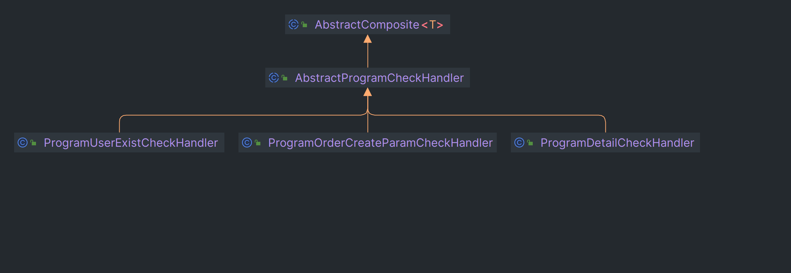
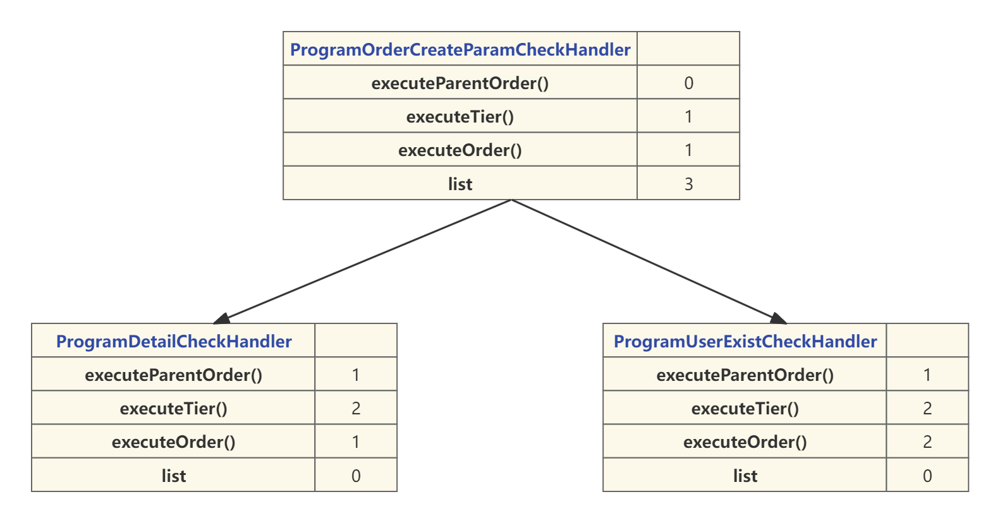

# 业务讲解-如何统一管理复杂的用户购票验证流程

**本文要介绍的是 用户在进行购票流程时，如何将多个参数的业务验证逻辑进行统一管理起来，并且设置执行的先后顺序**


## service层入口
**com.damai.service.ProgramOrderService#create**

```java
public String create(ProgramOrderCreateDto programOrderCreateDto) {
    //进行业务验证
    compositeContainer.execute(CompositeCheckType.PROGRAM_ORDER_CREATE_CHECK.getValue(),programOrderCreateDto);
    //省略...
}
```


此验证是使用了**组合模式和树形结构**来将业务的验证逻辑进行复用并且串联起来按照树形结构执行


关于此组件的详细介绍，可跳转相应文档查询

[组件讲解-利用组合模式打造强大验证功能，轻松应对复杂验证需求](https://www.yuque.com/u22210564/ykdrdh/baixnwbm4fhze9w7)


通过阅读组合模式实现复杂的验证功能文档后，我们知道了验证功能的树结构是如何构建的了，下面我们就来分析下，用户购票验证逻辑的树结构构建过程


```java
public enum CompositeCheckType {
    PROGRAM_ORDER_CREATE_CHECK(2,"program_order_create_check","订单创建"),
}
```


用户购票验证逻辑的类型为`program_order_create_check`，验证的逻辑有


+  验证座位参数 
+  将节目缓存 
+  验证缓存是否存在节目数据 
+  验证缓存是否存在演出时间数据 
+  验证用户是否存在 


### 思考


我们思考一个问题，这几个验证逻辑，都是`program_order_create_check`类型，也就是说这几个验证类都要实现`AbstractComposite`的`type()`方法，类型都是相同的，如果以后再加一个验证逻辑的话，那么还要再实现一遍，这是不是就产生冗余了呢？


所以为了解决此问题，我们可以再设计**一个抽象层**，将相同类型的`type`方法抽象出来，其余的方法仍旧由验证实现类来实现


**com.damai.service.composite.AbstractProgramCheckHandler**

```java
/**
 * @program: 极度真实还原大麦网高并发实战项目。 添加 阿宽不是程序员 微信，添加时备注 damai 来获取项目的完整资料 
 * @description: 生成节目订单验证基类，生成节目订单的相关验证逻辑继承此类
 * @author: 阿宽不是程序员
 **/
public abstract class AbstractProgramCheckHandler extends AbstractComposite<ProgramOrderCreateDto> {
    
    @Override
    public String type() {
        return CompositeCheckType.PROGRAM_ORDER_CREATE_CHECK.getValue();
    }
}
```


`AbstractProgramCheckHandler`作为抽象类，集成了`AbstractComposite`验证接口，将`type()`进行了实现，类型为`program_order_create_check`，以后所有的用户购票的验证逻辑，只需继承`AbstractProgramCheckHandler`即可


目前用户购票的验证功能有这几种， `ProgramOrderCreateParamCheckHandler` 、 `ProgramDetailCheckHandler` 、`ProgramUserExistCheckHandler`都继承了`AbstractProgramCheckHandler`


#### 类结构图
这几种验证功能的具体验证逻辑稍后再详细介绍，我们先看来这3个验证功能的层级关系和执行顺序，直接用流程图来体现


**通过流程图可以看到用户注册验证的树结构，以及彼此之间的层级关系**


第一层只有一个节点 **ProgramOrderCreateParamCheckHandler** 其子节点list有 2 个

第二层有2个节点，执行顺序依次为

1. **ProgramDetailCheckHandler**
2. **ProgramUserExistCheckHandler**


先看下入参


**com.damai.dto.ProgramOrderCreateDto**


```java
@Data
@ApiModel(value="ProgramOrderCreateDto", description ="节目订单创建")
public class ProgramOrderCreateDto {
    
    @ApiModelProperty(name ="programId", dataType ="Long", value ="节目id")
    @NotNull
    private Long programId;
    
    @ApiModelProperty(name ="userId", dataType ="Long", value ="用户id")
    @NotNull
    private Long userId;
    
    @ApiModelProperty(name ="ticketUserIdList", dataType ="List<Long>", value ="购票人id集合")
    @NotNull
    private List<Long> ticketUserIdList;
    
    @ApiModelProperty(name ="seatDtoList", dataType ="List<SeatDto>", value = "座位")
    private List<SeatDto> seatDtoList;
    
    @ApiModelProperty(name ="ticketCategoryId", dataType ="Long", value = "节目票档id(如果不选座位，那么票档id必填)")
    private Long ticketCategoryId;
    
    @ApiModelProperty(name ="ticketCount", dataType ="Integer", value = "购买票数量(如果不选座位，那么购买票数量必填)")
    private Integer ticketCount;
}
```


接下来我们详细的介绍这4个验证逻辑的执行过程


#### com.damai.service.composite.impl.ProgramOrderCreateParamCheckHandler


```java
@Component
public class ProgramOrderCreateParamCheckHandler extends AbstractProgramCheckHandler {
    @Override
    protected void execute(final ProgramOrderCreateDto programOrderCreateDto) {
        //验证手动选择座位和自动分配座位的参数是否正确
        List<SeatDto> seatDtoList = programOrderCreateDto.getSeatDtoList();
        //验证传入的购票人id是否重复
        List<Long> ticketUserIdList = programOrderCreateDto.getTicketUserIdList();
        Map<Long, List<Long>> ticketUserIdMap = 
                ticketUserIdList.stream().collect(Collectors.groupingBy(ticketUserId -> ticketUserId));
        for (List<Long> value : ticketUserIdMap.values()) {
            if (value.size() > 1) {
                throw new DaMaiFrameException(BaseCode.TICKET_USER_ID_REPEAT);
            }
        }
        //手动选座
        if (CollectionUtil.isNotEmpty(seatDtoList)) {
            //验证传入的座位数量和购票人的数量是否相等
            if (seatDtoList.size() != programOrderCreateDto.getTicketUserIdList().size()) {
                throw new DaMaiFrameException(BaseCode.TICKET_USER_COUNT_UNEQUAL_SEAT_COUNT);
            }
            for (SeatDto seatDto : seatDtoList) {
                //座位id不能为空
                if (Objects.isNull(seatDto.getId())) {
                    throw new DaMaiFrameException(BaseCode.SEAT_ID_EMPTY);
                }
                //节目票档id不能为空
                if (Objects.isNull(seatDto.getTicketCategoryId())) {
                    throw new DaMaiFrameException(BaseCode.SEAT_TICKET_CATEGORY_ID_EMPTY);
                }
                //座位行号不能为空
                if (Objects.isNull(seatDto.getRowCode())) {
                    throw new DaMaiFrameException(BaseCode.SEAT_ROW_CODE_EMPTY);
                }
                //座位列号不能为空
                if (Objects.isNull(seatDto.getColCode())) {
                    throw new DaMaiFrameException(BaseCode.SEAT_COL_CODE_EMPTY);
                }
                //座位价格不能为空
                if (Objects.isNull(seatDto.getPrice())) {
                    throw new DaMaiFrameException(BaseCode.SEAT_PRICE_EMPTY);
                }
            }
        }else {
            //自动匹配选择
            //节目票档id不能为空
            if (Objects.isNull(programOrderCreateDto.getTicketCategoryId())) {
                throw new DaMaiFrameException(BaseCode.TICKET_CATEGORY_NOT_EXIST);
            }
            //购票数量不能为空
            if (Objects.isNull(programOrderCreateDto.getTicketCount())) {
                throw new DaMaiFrameException(BaseCode.TICKET_COUNT_NOT_EXIST);
            }
            //购票数量不能负数
            if (programOrderCreateDto.getTicketCount() <= 0) {
                throw new DaMaiFrameException(BaseCode.TICKET_COUNT_ERROR);
            }
        }
    }
    
    @Override
    public Integer executeParentOrder() {
        return 0;
    }
    
    @Override
    public Integer executeTier() {
        return 1;
    }
    
    @Override
    public Integer executeOrder() {
        return 1;
    }
}
```


验证座位参数是否符合业务逻辑

+  验证传入的购票人id是否重复 
+  如果手动选择座位 
    - 验证传入的座位数量和购票人的数量是否相等
    - 那么座位id不能为空、节目票档id不能为空、座位行号不能为空、座位列号不能为空、座位价格不能为空
+  如果自动匹配座位，那么节目票档id不能为空、购票数量不能为空、购票数量不能负数 


#### com.damai.service.composite.impl.ProgramDetailCheckHandler


```java
package com.damai.service.composite.impl;


import com.damai.dto.ProgramGetDto;
import com.damai.dto.ProgramOrderCreateDto;
import com.damai.enums.BaseCode;
import com.damai.enums.BusinessStatus;
import com.damai.exception.DaMaiFrameException;
import com.damai.service.ProgramService;
import com.damai.service.composite.AbstractProgramCheckHandler;
import com.damai.vo.ProgramVo;
import org.springframework.beans.factory.annotation.Autowired;
import org.springframework.stereotype.Component;

import java.util.List;
import java.util.Objects;
import java.util.Optional;

/**
 * @program: 极度真实还原大麦网高并发实战项目。 添加 阿星不是程序员 微信，添加时备注 大麦 来获取项目的完整资料 
 * @description: 节目检查
 * @author: 阿星不是程序员
 **/
@Component
public class ProgramDetailCheckHandler extends AbstractProgramCheckHandler {
    
    @Autowired
    private ProgramService programService;
    
    @Override
    protected void execute(final ProgramOrderCreateDto programOrderCreateDto) {
        //查询要购买的节目
        ProgramGetDto programGetDto = new ProgramGetDto();
        programGetDto.setId(programOrderCreateDto.getProgramId());
        ProgramVo programVo = programService.detail(programGetDto);
        //如果节目不允许选择座位，但传入的了手动座位，则抛出异常
        if (programVo.getPermitChooseSeat().equals(BusinessStatus.NO.getCode())) {
            if (Objects.nonNull(programOrderCreateDto.getSeatDtoList())) {
                throw new DaMaiFrameException(BaseCode.PROGRAM_NOT_ALLOW_CHOOSE_SEAT);
            }
        }
        //手动选择座位时，选择座位的数量
        Integer seatCount = Optional.ofNullable(programOrderCreateDto.getSeatDtoList()).map(List::size).orElse(0);
        //自动匹配座位时，选择票档的数量
        Integer ticketCount = Optional.ofNullable(programOrderCreateDto.getTicketCount()).orElse(0);
        //只要有一个超过了规定的数量，那么就直接拒绝
        if (seatCount > programVo.getPerOrderLimitPurchaseCount() || ticketCount > programVo.getPerOrderLimitPurchaseCount()) {
            throw new DaMaiFrameException(BaseCode.PER_ORDER_PURCHASE_COUNT_OVER_LIMIT);
        }
    }
    
    @Override
    public Integer executeParentOrder() {
        return 1;
    }
    
    @Override
    public Integer executeTier() {
        return 2;
    }
    
    @Override
    public Integer executeOrder() {
        return 1;
    }
}

```


+ 此验证逻辑是再次节目详情，放入到redis中。此流程其实在节目详情中已经执行过，这里再次执行的原因的防止有人会绕过节目详情，直接调用购票接口，造成的数据库压力过大，所以再次判断redis中是否存在，不存在的话放入redis中
+ 如果节目不允许选择座位，但传入的了手动座位，则抛出异常
+ 验证订单的购票数量，无论是 **手动选择座位时，选择座位的数量** 还是 **自动匹配座位时，选择票档的数量** 都不能超过限制规定，否则直接拒绝


#### com.damai.service.composite.impl.ProgramUserExistCheckHandler


```java
@Slf4j
@Component
public class ProgramUserExistCheckHandler extends AbstractProgramCheckHandler {
    
    @Autowired
    private UserClient userClient;
    
    @Autowired
    private RedisCache redisCache;
    
    @Autowired
    private OrderClient orderClient;
    
    @Autowired
    private ProgramService programService;
    
    @Autowired
    private TokenExpireManager tokenExpireManager;
    
    @Override
    protected void execute(ProgramOrderCreateDto programOrderCreateDto) {
        //验证用户和购票人信息正确性
        //先从缓存中查询
        List<TicketUserVo> ticketUserVoList = redisCache.getValueIsList(RedisKeyBuild.createRedisKey(
                RedisKeyManage.TICKET_USER_LIST, programOrderCreateDto.getUserId()), TicketUserVo.class);
        //缓存不存在，再调用用户服务查询
        if (CollectionUtil.isEmpty(ticketUserVoList)) {
            TicketUserListDto ticketUserListDto = new TicketUserListDto();
            ticketUserListDto.setUserId(programOrderCreateDto.getUserId());
            ApiResponse<List<TicketUserVo>> apiResponse = userClient.list(ticketUserListDto);
            if (Objects.equals(apiResponse.getCode(), BaseCode.SUCCESS.getCode())) {
                ticketUserVoList = apiResponse.getData();
            }else {
                log.error("user client rpc getUserAndTicketUserList select response : {}", JSON.toJSONString(apiResponse));
                throw new DaMaiFrameException(apiResponse);
            }
        }
        //如果没有购票人则抛出异常
        if (CollectionUtil.isEmpty(ticketUserVoList)) {
            throw new DaMaiFrameException(BaseCode.TICKET_USER_EMPTY);
        }
        Map<Long, TicketUserVo> ticketUserVoMap = ticketUserVoList.stream()
                .collect(Collectors.toMap(TicketUserVo::getId, ticketUserVo -> ticketUserVo, (v1, v2) -> v2));
        //如果传入的购票人在查询出的购票人中不存在，则抛出异常
        for (Long ticketUserId : programOrderCreateDto.getTicketUserIdList()) {
            if (Objects.isNull(ticketUserVoMap.get(ticketUserId))) {
                throw new DaMaiFrameException(BaseCode.TICKET_USER_EMPTY);
            }
        }
        //查询节目信息
        ProgramGetDto programGetDto = new ProgramGetDto();
        programGetDto.setId(programOrderCreateDto.getProgramId());
        ProgramVo programVo = programService.detail(programGetDto);
        if (Objects.isNull(programVo)) {
            throw new DaMaiFrameException(BaseCode.PROGRAM_NOT_EXIST);
        }
        //如果redis中存在账户节目订单数量，则直接从redis中查询
        Integer count = 0;
        if (redisCache.hasKey(RedisKeyBuild.createRedisKey(RedisKeyManage.ACCOUNT_ORDER_COUNT,
                programOrderCreateDto.getUserId(),programOrderCreateDto.getProgramId()))) {
            count = redisCache.get(RedisKeyBuild.createRedisKey(RedisKeyManage.ACCOUNT_ORDER_COUNT,
                    programOrderCreateDto.getUserId(),programOrderCreateDto.getProgramId()), Integer.class);
        }else {
            //如果redis不存在，则调用订单服务查询，然后再放入redis中
            AccountOrderCountDto accountOrderCountDto = new AccountOrderCountDto();
            accountOrderCountDto.setUserId(programOrderCreateDto.getUserId());
            accountOrderCountDto.setProgramId(programOrderCreateDto.getProgramId());
            ApiResponse<AccountOrderCountVo> apiResponse = orderClient.accountOrderCount(accountOrderCountDto);
            if (Objects.equals(apiResponse.getCode(), BaseCode.SUCCESS.getCode())) {
                count = Optional.ofNullable(apiResponse.getData()).map(AccountOrderCountVo::getCount).orElse(0);
                redisCache.set(RedisKeyBuild.createRedisKey(RedisKeyManage.ACCOUNT_ORDER_COUNT,
                                programOrderCreateDto.getUserId(),
                                programOrderCreateDto.getProgramId()),
                        count, tokenExpireManager.getTokenExpireTime() + 1, TimeUnit.MINUTES);
            }
        }
        
        Integer seatCount = Optional.ofNullable(programOrderCreateDto.getSeatDtoList()).map(List::size).orElse(0);
        
        Integer ticketCount = Optional.ofNullable(programOrderCreateDto.getTicketCount()).orElse(0);
        //如果手动选择座位，那么就累加手动座位的数量
        if (seatCount != 0) {
            count = count + seatCount;
        }else if (ticketCount != 0) {
            //如果自动选择座位，那么就累加票档的数量
            count = count + ticketCount;
        }
        //验证该用户该节目下的订单数量是否超过了限制
        if (count > programVo.getPerAccountLimitPurchaseCount()) {
            throw new DaMaiFrameException(BaseCode.PER_ACCOUNT_PURCHASE_COUNT_OVER_LIMIT);
        }
    }
    
    @Override
    public Integer executeParentOrder() {
        return 1;
    }
    
    @Override
    public Integer executeTier() {
        return 2;
    }
    
    @Override
    public Integer executeOrder() {
        return 2;
    }
}

```


+ 验证传入的用户和购票人的信息是否正确，根据用户id缓存中查询用户和购票人信息，如果缓存不存在再调用用户服务查询，如果购票人不存在，则抛出异常，如果传入的购票人信息在查询的购票人列表中不存在的话，说明传入的购票人信息是错误的，也抛出异常不再执行
+ 验证该用户下此节目的订单数量是否超过了限制


> 更新: 2024-07-23 17:19:00  
> 原文: <https://www.yuque.com/u22210564/ykdrdh/cee3nk1as89bt8pc>