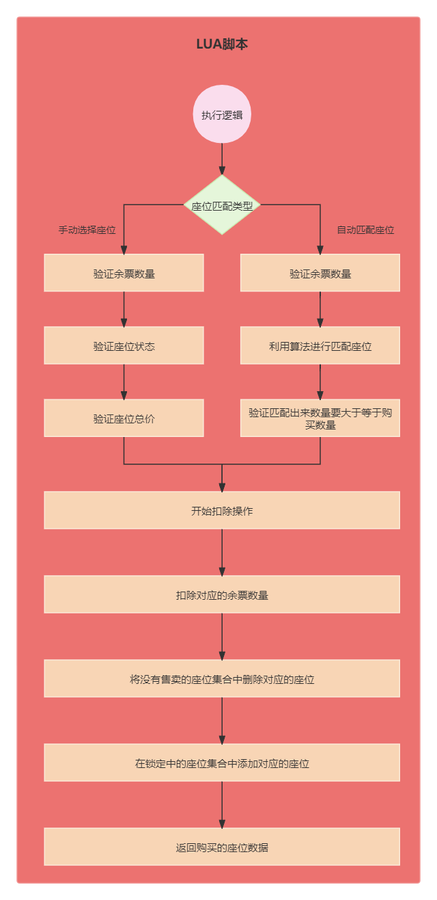

# 业务讲解-解决高并发下购票压力的终极杀招 "无锁化!"

# 提要


在 [业务讲解-如何应对高并发下的购票压力](https://www.yuque.com/u22210564/ykdrdh/schg4ewp7pupbb88) 文章中讲解了用户流程，关于如何加分布式锁，和修改数据进行生成订单的流程


在 [业务讲解-如何对锁进行优化更好的缓解购票压力](https://www.yuque.com/u22210564/ykdrdh/fs2pbqaxyekxg9y3) 文章中有讲解了如何拆分分布式锁的粒度、引入本地锁的方案来对锁进行优化


如果小伙伴还没有看过，一定要去先学习，然后再来阅读本文

# 分析


我们再回顾一下订单生成的逻辑


### service层


**com.damai.service.ProgramOrderService#create**


```java
public String create(ProgramOrderCreateDto programOrderCreateDto) {
    //从多级缓存中查找节目演出时间ProgramShowTime
    ProgramShowTime programShowTime =
            programShowTimeService.selectProgramShowTimeByProgramIdMultipleCache(programOrderCreateDto.getProgramId());
    //查询对应的票档类型
    List<TicketCategoryVo> getTicketCategoryList = 
            getTicketCategoryList(programOrderCreateDto,programShowTime.getShowTime());
    //传入的座位总价格
    BigDecimal parameterOrderPrice = new BigDecimal("0");
    //库中的座位总价格
    BigDecimal databaseOrderPrice = new BigDecimal("0");
    //要购买的座位
    List<SeatVo> purchaseSeatList = new ArrayList<>();
    //入参的座位
    List<SeatDto> seatDtoList = programOrderCreateDto.getSeatDtoList();
    //该节目下所有未售卖的座位
    List<SeatVo> seatVoList = new ArrayList<>();
    //该节目下的余票数量
    Map<String, Long> ticketCategoryRemainNumber = new HashMap<>(16);
    //遍历得到的票档
    for (TicketCategoryVo ticketCategory : getTicketCategoryList) {
        //从缓存中查询座位
        List<SeatVo> allSeatVoList = 
                seatService.selectSeatResolution(programOrderCreateDto.getProgramId(), ticketCategory.getId(), 
                        DateUtils.countBetweenSecond(DateUtils.now(), programShowTime.getShowTime()), TimeUnit.SECONDS);
        //将查询到未售卖的座位放入seatVoList
        seatVoList.addAll(allSeatVoList.stream().
                filter(seatVo -> seatVo.getSellStatus().equals(SellStatus.NO_SOLD.getCode())).toList());
        //将查询到的余票数量放入ticketCategoryRemainNumber   key:票档id  value:余票数量
        ticketCategoryRemainNumber.putAll(ticketCategoryService.getRedisRemainNumberResolution(
                programOrderCreateDto.getProgramId(),ticketCategory.getId()));
    }
    //入参座位存在
    if (CollectionUtil.isNotEmpty(seatDtoList)) {
        //余票数量检测 key：票档id  value：票档数量
        Map<Long, Long> seatTicketCategoryDtoCount = seatDtoList.stream()
                .collect(Collectors.groupingBy(SeatDto::getTicketCategoryId, Collectors.counting()));
        for (Entry<Long, Long> entry : seatTicketCategoryDtoCount.entrySet()) {
            Long ticketCategoryId = entry.getKey();
            Long purchaseCount = entry.getValue();
            //余票数量
            Long remainNumber = Optional.ofNullable(ticketCategoryRemainNumber.get(String.valueOf(ticketCategoryId)))
                    .orElseThrow(() -> new DaMaiFrameException(BaseCode.TICKET_CATEGORY_NOT_EXIST_V2));
            //如果购买数量大于余票数量，那么提示数量不足
            if (purchaseCount > remainNumber) {
                throw new DaMaiFrameException(BaseCode.TICKET_REMAIN_NUMBER_NOT_SUFFICIENT);
            }
        }
        //验证入参的对象在库中的状态，不存在、已锁、已售卖
        Map<String, SeatVo> seatVoMap = seatVoList.stream().collect(Collectors
                .toMap(seat -> seat.getRowCode() + "-" + seat.getColCode(), seat -> seat, (v1, v2) -> v2));
        //循环入参的座位对象
        for (SeatDto seatDto : seatDtoList) {
            SeatVo seatVo = seatVoMap.get(seatDto.getRowCode() + "-" + seatDto.getColCode());
            //如果入参的座位在未售卖的座位中不存在，那么直接抛出异常提示
            if (Objects.isNull(seatVo)) {
                throw new DaMaiFrameException(BaseCode.SEAT_IS_NOT_NOT_SOLD);
            }
            purchaseSeatList.add(seatVo);
            //将入参的座位价格进行累加
            parameterOrderPrice = parameterOrderPrice.add(seatDto.getPrice());
            //将库中的座位价格进行类型
            databaseOrderPrice = databaseOrderPrice.add(seatVo.getPrice());
        }
        //传入的座位价格累加不能大于存放的相应座位累加价格
        if (parameterOrderPrice.compareTo(databaseOrderPrice) > 0) {
            throw new DaMaiFrameException(BaseCode.PRICE_ERROR);
        }
    }else {
        //入参座位不存在，利用算法自动根据人数和票档进行分配相邻座位
        Long ticketCategoryId = programOrderCreateDto.getTicketCategoryId();
        Integer ticketCount = programOrderCreateDto.getTicketCount();
        //余票检测
        Long remainNumber = Optional.ofNullable(ticketCategoryRemainNumber.get(String.valueOf(ticketCategoryId)))
                .orElseThrow(() -> new DaMaiFrameException(BaseCode.TICKET_CATEGORY_NOT_EXIST_V2));
        //如果购票的数量大于余票数量，则直接抛出异常提示
        if (ticketCount > remainNumber) {
            throw new DaMaiFrameException(BaseCode.TICKET_REMAIN_NUMBER_NOT_SUFFICIENT);
        }
        //用算法匹配座位
        purchaseSeatList = SeatMatch.findAdjacentSeatVos(seatVoList.stream().filter(seatVo ->
                Objects.equals(seatVo.getTicketCategoryId(), ticketCategoryId)).collect(Collectors.toList()), ticketCount);
        //如果匹配出来的座位数量小于要购买的数量，拒绝执行
        if (purchaseSeatList.size() < ticketCount) {
            throw new DaMaiFrameException(BaseCode.SEAT_OCCUPY);
        }
    }
    //进行操作缓存中的数据
    updateProgramCacheDataResolution(programOrderCreateDto.getProgramId(),purchaseSeatList,OrderStatus.NO_PAY);
    //将筛选出来的购买的座位信息传入，执行创建订单的操作
    return doCreate(programOrderCreateDto,purchaseSeatList);
}
```


## 更新缓存余票数量和修改座位状态


**com.damai.service.ProgramOrderService#updateProgramCacheDataResolution**


```java
private void updateProgramCacheDataResolution(Long programId,List<SeatVo> seatVoList,OrderStatus orderStatus){
    //如果要操作的订单状态不是未支付和取消，那么直接拒绝
    if (!(Objects.equals(orderStatus.getCode(), OrderStatus.NO_PAY.getCode()) ||
            Objects.equals(orderStatus.getCode(), OrderStatus.CANCEL.getCode()))) {
        throw new DaMaiFrameException(BaseCode.OPERATE_ORDER_STATUS_NOT_PERMIT);
    }
    List<String> keys = new ArrayList<>();
    //这里key只是占位，并不起实际作用
    keys.add("#");
    
    String[] data = new String[3];
    Map<Long, Long> ticketCategoryCountMap =
            seatVoList.stream().collect(Collectors.groupingBy(SeatVo::getTicketCategoryId, Collectors.counting()));
    //更新票档数据集合
    JSONArray jsonArray = new JSONArray();
    ticketCategoryCountMap.forEach((k,v) -> {
        //这里是计算更新票档数据
        JSONObject jsonObject = new JSONObject();
        //票档数量的key
        jsonObject.put("programTicketRemainNumberHashKey",RedisKeyBuild.createRedisKey(
                RedisKeyManage.PROGRAM_TICKET_REMAIN_NUMBER_HASH_RESOLUTION, programId, k).getRelKey());
        //票档id
        jsonObject.put("ticketCategoryId",String.valueOf(k));
        //如果是生成订单操作，则将扣减余票数量
        if (Objects.equals(orderStatus.getCode(), OrderStatus.NO_PAY.getCode())) {
            jsonObject.put("count","-" + v);
            //如果是取消订单操作，则将恢复余票数量
        } else if (Objects.equals(orderStatus.getCode(), OrderStatus.CANCEL.getCode())) {
            jsonObject.put("count",v);
        }
        jsonArray.add(jsonObject);
    });
    //座位map key:票档id  value:座位集合
    Map<Long, List<SeatVo>> seatVoMap = 
            seatVoList.stream().collect(Collectors.groupingBy(SeatVo::getTicketCategoryId));
    JSONArray delSeatIdjsonArray = new JSONArray();
    JSONArray addSeatDatajsonArray = new JSONArray();
    seatVoMap.forEach((k,v) -> {
        JSONObject delSeatIdjsonObject = new JSONObject();
        JSONObject seatDatajsonObject = new JSONObject();
        String seatHashKeyDel = "";
        String seatHashKeyAdd = "";
        //如果是生成订单操作，则将座位修改为锁定状态    
        if (Objects.equals(orderStatus.getCode(), OrderStatus.NO_PAY.getCode())) {
            //没有售卖座位的key
            seatHashKeyDel = (RedisKeyBuild.createRedisKey(RedisKeyManage.PROGRAM_SEAT_NO_SOLD_RESOLUTION_HASH, programId, k).getRelKey());
            //锁定座位的key
            seatHashKeyAdd = (RedisKeyBuild.createRedisKey(RedisKeyManage.PROGRAM_SEAT_LOCK_RESOLUTION_HASH, programId, k).getRelKey());
            for (SeatVo seatVo : v) {
                seatVo.setSellStatus(SellStatus.LOCK.getCode());
            }
            //如果是取消订单操作，则将座位修改为未售卖状态
        } else if (Objects.equals(orderStatus.getCode(), OrderStatus.CANCEL.getCode())) {
            //锁定座位的key
            seatHashKeyDel = (RedisKeyBuild.createRedisKey(RedisKeyManage.PROGRAM_SEAT_LOCK_RESOLUTION_HASH, programId, k).getRelKey());
            //没有售卖座位的key
            seatHashKeyAdd = (RedisKeyBuild.createRedisKey(RedisKeyManage.PROGRAM_SEAT_NO_SOLD_RESOLUTION_HASH, programId, k).getRelKey());
            for (SeatVo seatVo : v) {
                seatVo.setSellStatus(SellStatus.NO_SOLD.getCode());
            }
        }
        //要进行删除座位的key
        delSeatIdjsonObject.put("seatHashKeyDel",seatHashKeyDel);
        //如果是订单创建，那么就扣除未售卖的座位id
        //如果是订单取消，那么就扣除锁定的座位id
        delSeatIdjsonObject.put("seatIdList",v.stream().map(SeatVo::getId).map(String::valueOf).collect(Collectors.toList()));
        delSeatIdjsonArray.add(delSeatIdjsonObject);
        //要进行添加座位的key
        seatDatajsonObject.put("seatHashKeyAdd",seatHashKeyAdd);
        //如果是订单创建的操作，那么添加到锁定的座位数据
        //如果是订单订单的操作，那么添加到未售卖的座位数据
        List<String> seatDataList = new ArrayList<>();
        //循环座位
        for (SeatVo seatVo : v) {
            //选放入座位did
            seatDataList.add(String.valueOf(seatVo.getId()));
            //接着放入座位对象
            seatDataList.add(JSON.toJSONString(seatVo));
        }
        //要进行添加座位的数据
        seatDatajsonObject.put("seatDataList",seatDataList);
        addSeatDatajsonArray.add(seatDatajsonObject);
    });
    
    //票档相关数据
    data[0] = JSON.toJSONString(jsonArray);
    //要进行删除座位的key
    data[1] = JSON.toJSONString(delSeatIdjsonArray);
    //要进行添加座位的相关数据
    data[2] = JSON.toJSONString(addSeatDatajsonArray);
    //执行lua脚本
    programCacheResolutionOperate.programCacheOperate(keys,data);
}
```


## lua脚本执行


**脚本位置：** resources/lua/programDataResolution.lua


```lua
-- 票档数量数据
local ticket_category_list = cjson.decode(ARGV[1])
-- 如果是订单创建，那么就扣除未售卖的座位id
-- 如果是订单取消，那么就扣除锁定的座位id
local del_seat_list = cjson.decode(ARGV[2])
-- 如果是订单创建的操作，那么添加到锁定的座位数据
-- 如果是订单订单的操作，那么添加到未售卖的座位数据
local add_seat_data_list = cjson.decode(ARGV[3])

-- 如果是订单创建，则扣票档数量
-- 如果是订单取消，则恢复票档数量
for index,increase_data in ipairs(ticket_category_list) do
    -- 票档数量的key
    local program_ticket_remain_number_hash_key = increase_data.programTicketRemainNumberHashKey
    -- 票档id
    local ticket_category_id = increase_data.ticketCategoryId
    -- 扣除的数量
    local increase_count = increase_data.count
    redis.call('HINCRBY',program_ticket_remain_number_hash_key,ticket_category_id,increase_count)
end
-- 如果是订单创建,将没有售卖的座位删除，再将座位数据添加到锁定的座位中
-- 如果是订单取消,将锁定的座位删除，再将座位数据添加到没有售卖的座位中
for index, seat in pairs(del_seat_list) do
    -- 要去除的座位对应的hash的键
    local seat_hash_key_del = seat.seatHashKeyDel
    -- 座位id集合
    local seat_id_list = seat.seatIdList
    redis.call('HDEL',seat_hash_key_del,unpack(seat_id_list))
end
for index, seat in pairs(add_seat_data_list) do
    -- 要添加的座位对应的hash的键
    local seat_hash_key_add = seat.seatHashKeyAdd
    -- 作为数据
    local seat_data_list = seat.seatDataList
    redis.call('HMSET',seat_hash_key_add,unpack(seat_data_list))
end
```


总结起来就是 先**获得锁，然后获取座位和余票信息，接着验证座位是否可以购买，余票是否充足。然后拼接lua需要的数据，接着在lua中完整扣减的操作**


## 思考
我们再将整个流程想一想，鸟巢应该算是容纳人数最多的演唱会场馆了，可以容纳9万人左右。而抢票的人有几百万很正常，**也就是说100个人也就一个人能抢到票**，能执行生成订单的流程，**那么有没有什么方案能在最开始的时候就把没有抢到票的人直接拒绝了呢？**


目前的逻辑确实有在座位逻辑那里，做了座位状态验证和余票数量验证逻辑，但它是从redis中获取然后再Java中做的验证，然后再组装数据在redis中运行修改状态，再加上开头都用了分布式锁也是借助redis，这多次操作redis，也就造成了多次的网络性能的消耗，要知道网络请求对性能的影响可以说是和慢sql的影响不相上下。


**既然开头用了分布式锁锁住了，那何不全都在redis中执行呢**


# 实现无锁化


**com.damai.controller.ProgramOrderController#createV3**


```java
@ApiOperation(value = "购票V3")
@PostMapping(value = "/create/v3")
public ApiResponse<String> createV3(@Valid @RequestBody ProgramOrderCreateDto programOrderCreateDto) {
    return ApiResponse.ok(programOrderLock.createV3(programOrderCreateDto));
}
```

## 幂等层


**com.damai.lock.ProgramOrderLock#createV3**


```java
/**
 * 订单创建，进行优化，一开始直接利用lua执行判断要购买的座位和票的数量是足够，不足够直接返回，足够的话进行相应扣除，
 * 这样既能将大量无用的抢购请求直接返回掉，又可以实现无锁化
 * */
@RepeatExecuteLimit(
        name = RepeatExecuteLimitConstants.CREATE_PROGRAM_ORDER,
        keys = {"#programOrderCreateDto.userId","#programOrderCreateDto.programId"})
public String createV3(ProgramOrderCreateDto programOrderCreateDto) {
    
}
```


虽然不需要分布式锁了，但幂等性的保证还是要依然实现的

## 本地锁
文章强调的“无锁化”的意思值得是将分布式锁去掉，以此来减少Redis和网络的压力。但是本地锁还是要保留的，因为在前一篇章节介绍过，本地锁的作用就是来缓解分布式锁的压力。所以不能去除。


这里要将本地锁的逻辑拆分出来，而且要考虑到后面的生成订单V4版本也要使用本地锁，所以要实现复用。这里用了一个设计模式来实现，下面来详细解析：

### LockTask
```java
@FunctionalInterface
public interface LockTask<V> {
    /**
     * 执行锁的任务
     * @return 结果
     */
    V execute();
}
```

LockTask是专门用来实现获得锁后的执行任务


### ProgramOrderLock#localLockCreateOrder
```java
public String localLockCreateOrder(String lockKeyPrefix,ProgramOrderCreateDto programOrderCreateDto,LockTask<String> lockTask){
    List<SeatDto> seatDtoList = programOrderCreateDto.getSeatDtoList();
    List<Long> ticketCategoryIdList = new ArrayList<>();
    if (CollectionUtil.isNotEmpty(seatDtoList)) {
        //按照票档id进行排序，这样为了避免不同请求获取票档的顺序不同加锁而可能产生的死锁问题
        ticketCategoryIdList =
                seatDtoList.stream().map(SeatDto::getTicketCategoryId).distinct().sorted().collect(Collectors.toList());
    }else {
        ticketCategoryIdList.add(programOrderCreateDto.getTicketCategoryId());
    }
    //本地锁集合
    List<ReentrantLock> localLockList = new ArrayList<>(ticketCategoryIdList.size());
    //加锁成功的本地锁集
    List<ReentrantLock> localLockSuccessList = new ArrayList<>(ticketCategoryIdList.size());
    //根据统计出的票档id获得本地锁集合
    for (Long ticketCategoryId : ticketCategoryIdList) {
        //锁的key为d_program_order_create_v3_lock-programId-ticketCategoryId
        String lockKey = StrUtil.join("-",lockKeyPrefix,
                programOrderCreateDto.getProgramId(),ticketCategoryId);
        //获得本地锁实例
        ReentrantLock localLock = localLockCache.getLock(lockKey,false);
        //添加到本地锁集合
        localLockList.add(localLock);
    }
    //循环本地锁进行加锁
    for (ReentrantLock reentrantLock : localLockList) {
        try {
            reentrantLock.lock();
        }catch (Throwable t) {
            //如果加锁出现异常，则终止
            break;
        }
        localLockSuccessList.add(reentrantLock);
    }
    try {
        //执行真正的逻辑
        return lockTask.execute();
    }finally {
        //再循环解锁本地锁
        for (int i = localLockSuccessList.size() - 1; i >= 0; i--) {
            ReentrantLock reentrantLock = localLockSuccessList.get(i);
            try {
                reentrantLock.unlock();
            }catch (Throwable t) {
                log.error("local lock unlock error",t);
            }
        }
    }
}
```

这里将本地锁的生成、加锁、解锁都抽取了出来新建了一个方法，用于复用

### 注意：
当获得锁成功后，通过执行** lockTask.execute()** 来实现执行任务流程。而 **lockTask **是一个接口，当调用 localLockCreateOrder 方式时，可以将加锁逻辑当做一个任务传入此方法，类型就是 **lockTask**，这样就可以实现复用了，这样方式就是 **<font style="color:#213BC0;">命令模式</font>**。在多线程中的 **Runnable** 和 **Callable** 就是用到了这种方式。


### 控制层
```java
@RepeatExecuteLimit(
        name = RepeatExecuteLimitConstants.CREATE_PROGRAM_ORDER,
        keys = {"#programOrderCreateDto.userId","#programOrderCreateDto.programId"})
public String createV3(ProgramOrderCreateDto programOrderCreateDto) {
    compositeContainer.execute(CompositeCheckType.PROGRAM_ORDER_CREATE_CHECK.getValue(),programOrderCreateDto);
    return localLockCreateOrder(PROGRAM_ORDER_CREATE_V3,programOrderCreateDto,
            () -> programOrderService.createNew(programOrderCreateDto));
}
```


这里同样将业务参数验证流程放在最前面，因为后续就开始直接拼接数据了


### service层


**com.damai.service.ProgramOrderService#createNew**


```java
public String createNew(ProgramOrderCreateDto programOrderCreateDto) {
    //修改节目相关数据
    List<SeatVo> purchaseSeatList = createOrderOperateProgramCacheResolution(programOrderCreateDto);
    //将筛选出来的购买的座位信息传入，执行创建订单的操作
    return doCreate(programOrderCreateDto,purchaseSeatList);
}
```

```java
public List<SeatVo> createOrderOperateProgramCacheResolution(ProgramOrderCreateDto programOrderCreateDto){
    //从多级缓存中查找节目演出时间ProgramShowTime
    ProgramShowTime programShowTime =
            programShowTimeService.selectProgramShowTimeByProgramIdMultipleCache(programOrderCreateDto.getProgramId());
    //查询对应的票档类型
    List<TicketCategoryVo> getTicketCategoryList =
            getTicketCategoryList(programOrderCreateDto,programShowTime.getShowTime());
    //遍历得到的票档
    for (TicketCategoryVo ticketCategory : getTicketCategoryList) {
        //从缓存中查询座位，如果缓存不存在，则从数据库查询后再放入缓存
        seatService.selectSeatResolution(programOrderCreateDto.getProgramId(), ticketCategory.getId(),
                        DateUtils.countBetweenSecond(DateUtils.now(), programShowTime.getShowTime()), TimeUnit.SECONDS);
        //从缓存中查询余票数量，如果缓存不存在，则从数据库查询后再放入缓存
        ticketCategoryService.getRedisRemainNumberResolution(
                programOrderCreateDto.getProgramId(),ticketCategory.getId());
    }
    Long programId = programOrderCreateDto.getProgramId();
    List<SeatDto> seatDtoList = programOrderCreateDto.getSeatDtoList();
    List<String> keys = new ArrayList<>();
    String[] data = new String[2];
    //更新票档数据集合
    JSONArray jsonArray = new JSONArray();
    //添加座位数据集合
    JSONArray addSeatDatajsonArray = new JSONArray();
    if (CollectionUtil.isNotEmpty(seatDtoList)) {
        keys.add("1");
        Map<Long, List<SeatDto>> seatTicketCategoryDtoCount = seatDtoList.stream()
                .collect(Collectors.groupingBy(SeatDto::getTicketCategoryId));
        for (Entry<Long, List<SeatDto>> entry : seatTicketCategoryDtoCount.entrySet()) {
            Long ticketCategoryId = entry.getKey();
            int ticketCount = entry.getValue().size();
            //这里是计算更新票档数据
            JSONObject jsonObject = new JSONObject();
            //票档数量的key
            jsonObject.put("programTicketRemainNumberHashKey",RedisKeyBuild.createRedisKey(
                    RedisKeyManage.PROGRAM_TICKET_REMAIN_NUMBER_HASH_RESOLUTION, programId, ticketCategoryId).getRelKey());
            //票档id
            jsonObject.put("ticketCategoryId",ticketCategoryId);
            //扣减余票数量
            jsonObject.put("ticketCount",ticketCount);
            jsonArray.add(jsonObject);
            
            JSONObject seatDatajsonObject = new JSONObject();
            //未售卖座位的hash的key
            seatDatajsonObject.put("seatNoSoldHashKey",RedisKeyBuild.createRedisKey(
                    RedisKeyManage.PROGRAM_SEAT_NO_SOLD_RESOLUTION_HASH, programId, ticketCategoryId).getRelKey());
            //座位数据
            seatDatajsonObject.put("seatDataList",JSON.toJSONString(entry.getValue()));
            addSeatDatajsonArray.add(seatDatajsonObject);
        }
    }else {
        keys.add("2");
        Long ticketCategoryId = programOrderCreateDto.getTicketCategoryId();
        Integer ticketCount = programOrderCreateDto.getTicketCount();
        JSONObject jsonObject = new JSONObject();
        //票档数量的key
        jsonObject.put("programTicketRemainNumberHashKey",RedisKeyBuild.createRedisKey(
                RedisKeyManage.PROGRAM_TICKET_REMAIN_NUMBER_HASH_RESOLUTION, programId, ticketCategoryId).getRelKey());
        //票档id
        jsonObject.put("ticketCategoryId",ticketCategoryId);
        //扣减余票数量
        jsonObject.put("ticketCount",ticketCount);
        //未售卖座位的hash的key
        jsonObject.put("seatNoSoldHashKey",RedisKeyBuild.createRedisKey(
                RedisKeyManage.PROGRAM_SEAT_NO_SOLD_RESOLUTION_HASH, programId, ticketCategoryId).getRelKey());
        jsonArray.add(jsonObject);
    }
    //未售卖座位hash的key(占位符形式)
    keys.add(RedisKeyBuild.getRedisKey(RedisKeyManage.PROGRAM_SEAT_NO_SOLD_RESOLUTION_HASH));
    //锁定座位hash的key(占位符形式)
    keys.add(RedisKeyBuild.getRedisKey(RedisKeyManage.PROGRAM_SEAT_LOCK_RESOLUTION_HASH));
    keys.add(String.valueOf(programOrderCreateDto.getProgramId()));
    data[0] = JSON.toJSONString(jsonArray);
    data[1] = JSON.toJSONString(addSeatDatajsonArray);
    //执行lua脚本
    ProgramCacheCreateOrderData programCacheCreateOrderData = 
            programCacheCreateOrderResolutionOperate.programCacheOperate(keys, data);
    if (!Objects.equals(programCacheCreateOrderData.getCode(), BaseCode.SUCCESS.getCode())) {
        throw new DaMaiFrameException(Objects.requireNonNull(BaseCode.getRc(programCacheCreateOrderData.getCode())));
    }
    return programCacheCreateOrderData.getPurchaseSeatList();
}
```

这里把拼接好的键和值梳理出来，请注意，**下面列举的键是去掉了个人前缀(默认为 **`**damai**`**)的情况下，避免小伙伴会有下面列举的键名和自己启动项目中对不上的情况**

#### keys List结构 是存放操作redis的键
+ **第一个元素** 操作类型 1 用户选座位 2自动匹配座位
+ 第二个元素 未售卖座位hash的key(占位符形式)
+ 第三个元素 锁定座位hash的key(占位符形式)
+ 第四个元素 节目id


+  **d_mai_program_ticket_remain_number_hash_节目id_票档id** 节目下的票档余票数量  值的存储结构为hash，hash的key为票档id，hash的value为票档数量 

| key | value |
| :---: | :---: |
| 1 | 0 |
| 2 | 60 |


+  **d_mai_program_seat_no_sold_resolution_hash_节目id_票档id** 节目下没有售卖的座位集合 值的存储结构为hash，hash的key为座位id，hash的value为座位对象 

| key | value |
| :---: | :---: |
| 1 | {"colCode":1,"id":1,"price":180,"programId":1,"rowCode":1,"seatType":1,"seatTypeName":"通用座位","sellStatus":1,"ticketCategoryId":2} |
| 2 | {"colCode":2,"id":2,"price":180,"programId":1,"rowCode":1,"seatType":1,"seatTypeName":"通用座位","sellStatus":1,"ticketCategoryId":2} |
| ... | .... |


+  **d_mai_program_seat_lock_resolution_hash_节目id_票档id** 节目下锁定的座位集合 值的存储结构为hash，hash的key为座位id，hash的value为座位对象 

| key | value |
| :---: | :---: |
| 10 | {"colCode":10,"id":10,"price":180,"programId":1,"rowCode":1,"seatType":1,"seatTypeName":"通用座位","sellStatus":2,"ticketCategoryId":2} |
| 17 | {"colCode":7,"id":17,"price":180,"programId":1,"rowCode":2,"seatType":1,"seatTypeName":"通用座位","sellStatus":2,"ticketCategoryId":2} |
| ... | .... |


**keys真实结构json形式展示**


```json
[
    "2",
    "damai-d_mai_program_seat_no_sold_resolution_hash_%s_%s",
    "damai-d_mai_program_seat_lock_resolution_hash_%s_%s",
    "1"
]
```


#### data 数组结构 是存放要修改的数据


+  **第一个元素** 票档数量数据，是一个数组，数组的元素是json字符串，存放着票档缓存的key、票档id、要购票的数量、未售卖座位hash的key

| programTicketRemainNumberHashKey | ticketCategoryId | ticketCount | seatNoSoldHashKey |
| --- | :---: | :---: | :---: |
| damai-d_mai_program_ticket_remain_number_hash_resolution_1_2 | 2 | 1 | damai-d_mai_program_seat_no_sold_resolution_hash_1_2 |


+  **第二个元素 **手动选择座位的数据 

| <font style="color:#213BC0;">seatNoSoldHashKey</font> | <font style="color:#213BC0;">seatDataList</font> |
| :---: | --- |
| damai-d_mai_program_seat_no_sold_resolution_hash_1_2 | [{\"colCode\":1,\"id\":1,\"price\":180,\"rowCode\":1,\"ticketCategoryId\":2}] |


**data 真实结构json形式展示**


```json
["[{\"ticketCount\":2,\"ticketCategoryId\":2}]","[{\"colCode\":1,\"id\":1,\"price\":180,\"rowCode\":1,\"ticketCategoryId\":2},{\"colCode\":2,\"id\":2,\"price\":180,\"rowCode\":1,\"ticketCategoryId\":2}]"]
```


把这些键和数据拼接好后，就是在lua中执行了


### lua脚本执行


**脚本位置：** resources/lua/programDataCreateOrderResolution.lua


```lua
-- 类型 1 用户选座位 2自动匹配座位
local type = tonumber(KEYS[1])
-- 没有售卖的座位key
local placeholder_seat_no_sold_hash_key = KEYS[2]
-- 锁定的座位key
local placeholder_seat_lock_hash_key = KEYS[3]
-- 节目id
local program_id = KEYS[4]
-- 要购买的票档 包括票档id和票档数量
local ticket_count_list = cjson.decode(ARGV[1])
-- 过滤后符合条件可以购买的座位集合
local purchase_seat_list = {}
-- 入参座位价格总和
local total_seat_dto_price = 0
-- 缓存座位价格总和
local total_seat_vo_price = 0
-- 匹配座位算法 
local function find_adjacent_seats(all_seats, seat_count)
    local adjacent_seats = {}

    -- 对可用座位排序
    table.sort(all_seats, function(s1, s2)
        if s1.rowCode == s2.rowCode then
            return s1.colCode < s2.colCode
        else
            return s1.rowCode < s2.rowCode
        end
    end)

    -- 寻找相邻座位
    for i = 1, #all_seats - seat_count + 1 do
        local seats_found = true
        for j = 0, seat_count - 2 do
            local current = all_seats[i + j]
            local next = all_seats[i + j + 1]

            if not (current.rowCode == next.rowCode and next.colCode - current.colCode == 1) then
                seats_found = false
                break
            end
        end
        if seats_found then
            for k = 0, seat_count - 1 do
                table.insert(adjacent_seats, all_seats[i + k])
            end
            return adjacent_seats
        end
    end
    -- 如果没有找到，返回空列表
    return adjacent_seats
end

-- 入参座位存在
if (type == 1) then
    for index,ticket_count in ipairs(ticket_count_list) do
        -- 票档数量的key
        local ticket_remain_number_hash_key = ticket_count.programTicketRemainNumberHashKey
        -- 入参座位的票档id
        local ticket_category_id = ticket_count.ticketCategoryId
        -- 入参座位的票档数量
        local count = ticket_count.ticketCount
        -- 从缓存中获取相应票档数量
        local remain_number_str = redis.call('hget', ticket_remain_number_hash_key, tostring(ticket_category_id))
        -- 如果为空直接返回
        if not remain_number_str then
            return string.format('{"%s": %d}', 'code', 40010)
        end
        local remain_number = tonumber(remain_number_str)
        -- 入参座位的票档数量大于缓存中获取相应票档数量，说明票档数量不足，直接返回
        if (count > remain_number) then
            return string.format('{"%s": %d}', 'code', 40011)
        end
    end
    -- 座位集合
    local seat_data_list= cjson.decode(ARGV[2])
    for index, seatData in pairs(seat_data_list) do
        -- 没有售卖的座位key
        local seat_no_sold_hash_key = seatData.seatNoSoldHashKey;
        -- 入参座位集合
        local seat_dto_list = cjson.decode(seatData.seatDataList)
        for index2,seat_dto in ipairs(seat_dto_list) do
            -- 入参座位id
            local id = seat_dto.id
            -- 入参座位价格
            local seat_dto_price = seat_dto.price
            -- 根据座位id从缓存中没有售卖的座位
            local seat_vo_str = redis.call('hget', seat_no_sold_hash_key, tostring(id))
            -- 如果从缓存中为空，则直接返回
            if not seat_vo_str then
                return string.format('{"%s": %d}', 'code', 40001)
            end
            local seat_vo = cjson.decode(seat_vo_str)
            -- 如果从缓存查询的座位状态是锁定的，直接返回
            if (seat_vo.sellStatus == 2) then
                return string.format('{"%s": %d}', 'code', 40002)
            end
            -- 如果从缓存查询的座位状态是已经售卖的，直接返回
            if (seat_vo.sellStatus == 3) then
                return string.format('{"%s": %d}', 'code', 40003)
            end
            table.insert(purchase_seat_list,seat_vo)
            -- 入参座位价格累加
            total_seat_dto_price = total_seat_dto_price + seat_dto_price
            -- 缓存座位价格累加
            total_seat_vo_price = total_seat_vo_price + seat_vo.price
            if (total_seat_dto_price > total_seat_vo_price) then
                return string.format('{"%s": %d}', 'code', 40008)
            end
        end
    end
end
-- 入参座位不存在
if (type == 2) then
    -- 这里的外层循环其实就一次
    for index,ticket_count in ipairs(ticket_count_list) do
        -- 票档数量的key
        local ticket_remain_number_hash_key = ticket_count.programTicketRemainNumberHashKey
        -- 入参选择的票档id
        local ticket_category_id = ticket_count.ticketCategoryId
        -- 入参选择的票档数量
        local count = ticket_count.ticketCount
        -- 从缓存中获取相应票档数量
        local remain_number_str = redis.call('hget', ticket_remain_number_hash_key, tostring(ticket_category_id))
        -- 如果为空直接返回
        if not remain_number_str then
            return string.format('{"%s": %d}', 'code', 40010)
        end
        local remain_number = tonumber(remain_number_str)
        -- 入参的票档数量大于缓存中获取相应票档数量，说明票档数量不足，直接返回
        if (count > remain_number) then
            return string.format('{"%s": %d}', 'code', 40011)
        end
        local seat_no_sold_hash_key = ticket_count.seatNoSoldHashKey
        -- 获取没有售卖的座位集合
        local seat_vo_no_sold_str_list = redis.call('hvals',seat_no_sold_hash_key)
        local filter_seat_vo_no_sold_list = {}
        -- 这里遍历的原因，座位集合是以hash存储在缓存中，而每个座位是字符串，要把字符串转成对象
        for index,seat_vo_no_sold_str in ipairs(seat_vo_no_sold_str_list) do
            local seat_vo_no_sold = cjson.decode(seat_vo_no_sold_str)
            table.insert(filter_seat_vo_no_sold_list,seat_vo_no_sold)
        end
        -- 利用算法自动根据人数和票档进行分配相邻座位
        purchase_seat_list = find_adjacent_seats(filter_seat_vo_no_sold_list,count)
        -- 如果匹配出的数量 < 对应的购买数量，直接返回
        if (#purchase_seat_list < count) then
            return string.format('{"%s": %d}', 'code', 40004)
        end
    end
end
-- 经过以上的验证，说明座位和票档数量是够用的，下面开始真正的锁定座位和扣除票档数量操作
-- 要注意 seat_id_list数组的索引值是ticket_category_id(票档id)，数组的值是seat_id_array(座位id数组)
local seat_id_list = {}
-- 要注意 seat_data_list数组的索引值是ticket_category_id(票档id)，数组的值是seat_data_array(座位数据数组)
local seat_data_list = {}
for index,seat in ipairs(purchase_seat_list) do
    local seat_id = seat.id
    local ticket_category_id = seat.ticketCategoryId
    if not seat_id_list[ticket_category_id] then
        seat_id_list[ticket_category_id] = {}
    end
    table.insert(seat_id_list[ticket_category_id], tostring(seat_id))

    if not seat_data_list[ticket_category_id] then
        seat_data_list[ticket_category_id] = {}
    end
    -- 这里在放入值的时候先是放入了座位id
    table.insert(seat_data_list[ticket_category_id], tostring(seat_id))
    seat.sellStatus = 2
    -- 然后又放入了座位数据
    table.insert(seat_data_list[ticket_category_id], cjson.encode(seat))
end
-- 扣票档数量
for index,ticket_count in ipairs(ticket_count_list) do
    -- 票档数量的key
    local ticket_remain_number_hash_key = ticket_count.programTicketRemainNumberHashKey
    -- 票档id
    local ticket_category_id = ticket_count.ticketCategoryId
    -- 票档数量
    local count = ticket_count.ticketCount
    redis.call('hincrby',ticket_remain_number_hash_key,ticket_category_id,"-" .. count)
end
-- 将没有售卖的座位删除
for ticket_category_id, seat_id_array in pairs(seat_id_list) do
    redis.call('hdel',string.format(placeholder_seat_no_sold_hash_key,program_id,tostring(ticket_category_id)),unpack(seat_id_array))
end
-- 再将座位数据添加到锁定的座位中
for ticket_category_id, seat_data_array in pairs(seat_data_list) do
    redis.call('hmset',string.format(placeholder_seat_lock_hash_key,program_id,tostring(ticket_category_id)),unpack(seat_data_array))    
end
return string.format('{"%s": %d, "%s": %s}', 'code', 0, 'purchaseSeatList', cjson.encode(purchase_seat_list))
```


这里是将原本生成订单的所有的操作都转移到了lua中执行，为了小伙伴更好的理解，本人把详细的流程图展示出来





**com.damai.service.lua.ProgramCacheCreateOrderData**


```java
@Data
public class ProgramCacheCreateOrderData {

    private Integer code;
    
    private List<SeatVo> purchaseSeatList;
}
```


**在lua执行过程中，将对应的异常code码和成功执行后生成的座位数据组装成了ProgramCacheCreateOrderData对象**


```java
if (!Objects.equals(programCacheCreateOrderData.getCode(), BaseCode.SUCCESS.getCode())) {
    throw new DaMaiFrameException(Objects.requireNonNull(BaseCode.getRc(programCacheCreateOrderData.getCode())));
}
```


接着通过ProgramCacheCreateOrderData对象的code就可以判断是否执行成功，如果失败，根据code码从BaseCode中获取异常提示信息，然后抛出业务异常直接拒绝继续执行


### 创建订单


```java
List<SeatVo> purchaseSeatList = programCacheCreateOrderData.getPurchaseSeatList();
//将筛选出来的购买的座位信息传入，执行创建订单的操作
return doCreate(programOrderCreateDto,purchaseSeatList);
```


接着就是调用**com.damai.service.ProgramOrderService#doCreate**来组装生成订单的数据了，在之前的文章中详细介绍过，这里就不再赘述


> 更新: 2025-08-26 10:01:50  
> 原文: <https://www.yuque.com/u22210564/ykdrdh/zyr9pd9ogzqyas2z>