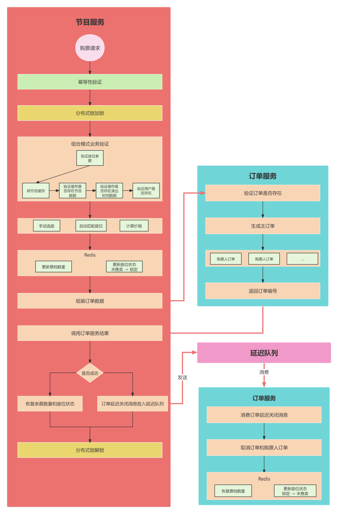

# 业务讲解-订单生成失败后如何快速回滚数据

本文要介绍的是在用户购票过程中，调用订单服务生成订单失败后，如果将余票数量和座位的状态进行回滚的流程


这里把用户购票的流程图再贴出来，方便小伙伴回顾




## 调用订单服务创建订单失败后，回滚数据


**com.damai.service.ProgramOrderService#doCreate**


```java
private String doCreate(ProgramOrderCreateDto programOrderCreateDto,List<SeatVo> purchaseSeatList){
    //节目id
    Long programId = programOrderCreateDto.getProgramId();
    //获取要购买的节目信息
    ProgramVo programVo = redisCache.get(RedisKeyBuild.createRedisKey(RedisKeyManage.PROGRAM, programId), ProgramVo.class);
    //查询节目演出时间
    ProgramShowTime programShowTime = redisCache.get(RedisKeyBuild.createRedisKey(RedisKeyManage.PROGRAM_SHOW_TIME
            ,programId),ProgramShowTime.class);
    //主订单参数构建
    OrderCreateDto orderCreateDto = new OrderCreateDto();
    //生成订单编号
    orderCreateDto.setOrderNumber(uidGenerator.getOrderNumber(programOrderCreateDto.getUserId(),ORDER_TABLE_COUNT));
    orderCreateDto.setProgramId(programOrderCreateDto.getProgramId());
    orderCreateDto.setProgramItemPicture(programVo.getItemPicture());
    orderCreateDto.setUserId(programOrderCreateDto.getUserId());
    orderCreateDto.setProgramTitle(programVo.getTitle());
    orderCreateDto.setProgramPlace(programVo.getPlace());
    orderCreateDto.setProgramShowTime(programShowTime.getShowTime());
    orderCreateDto.setProgramPermitChooseSeat(programVo.getPermitChooseSeat());
    BigDecimal databaseOrderPrice = 
            purchaseSeatList.stream().map(SeatVo::getPrice).reduce(BigDecimal.ZERO, BigDecimal::add);
    orderCreateDto.setOrderPrice(databaseOrderPrice);
    orderCreateDto.setCreateOrderTime(DateUtils.now());

    //购票人订单构建
    List<Long> ticketUserIdList = programOrderCreateDto.getTicketUserIdList();
    List<OrderTicketUserCreateDto> orderTicketUserCreateDtoList = new ArrayList<>();
    for (int i = 0; i < ticketUserIdList.size(); i++) {
        Long ticketUserId = ticketUserIdList.get(i);
        OrderTicketUserCreateDto orderTicketUserCreateDto = new OrderTicketUserCreateDto();
        orderTicketUserCreateDto.setOrderNumber(orderCreateDto.getOrderNumber());
        orderTicketUserCreateDto.setProgramId(programOrderCreateDto.getProgramId());
        orderTicketUserCreateDto.setUserId(programOrderCreateDto.getUserId());
        orderTicketUserCreateDto.setTicketUserId(ticketUserId);
        //给购票人绑定座位
        SeatVo seatVo = 
                Optional.ofNullable(purchaseSeatList.get(i))
                        .orElseThrow(() -> new DaMaiFrameException(BaseCode.SEAT_NOT_EXIST));
        orderTicketUserCreateDto.setSeatId(seatVo.getId());
        orderTicketUserCreateDto.setSeatInfo(seatVo.getRowCode()+"排"+seatVo.getColCode()+"列");
        orderTicketUserCreateDto.setTicketCategoryId(seatVo.getTicketCategoryId());
        orderTicketUserCreateDto.setOrderPrice(seatVo.getPrice());
        orderTicketUserCreateDto.setCreateOrderTime(DateUtils.now());
        orderTicketUserCreateDtoList.add(orderTicketUserCreateDto);
    }

    orderCreateDto.setOrderTicketUserCreateDtoList(orderTicketUserCreateDtoList);
	
    //调用订单服务
    String orderNumber;
    ApiResponse<String> createOrderResponse = orderClient.create(orderCreateDto);
    if (Objects.equals(createOrderResponse.getCode(), BaseCode.SUCCESS.getCode())) {
        orderNumber = createOrderResponse.getData();
    }else {
        //订单创建失败将操作缓存中的数据还原
        updateProgramCacheDataResolution(programId,purchaseSeatList,OrderStatus.CANCEL);
        log.error("创建订单失败 需人工处理 orderCreateDto : {}",JSON.toJSONString(orderCreateDto));
        throw new DaMaiFrameException(createOrderResponse);
    }

    //延迟队列创建
    DelayOrderCancelDto delayOrderCancelDto = new DelayOrderCancelDto();
    delayOrderCancelDto.setOrderNumber(orderCreateDto.getOrderNumber());
    delayOrderCancelSend.sendMessage(JSON.toJSONString(delayOrderCancelDto));

    return orderNumber;
}
```


重点看调用订单服务这部分，当返回的ApiResponse的code不是0，也就是没有调用成功的话，那么执行**updateProgramCacheDataResolution **方法将数据回滚回去，**updateProgramCacheDataResolution **是处理生成订单的扣减数据和取消订单的回滚数据两种操作


在用户购票的章节中已经介绍过了生成订单的扣减数据操作，这里再介绍此方法的取消订单的回滚数据流程，也算是本人对小伙伴的负责，让小伙伴不用再回去看文档了，直接在本文理解回滚的流程，话不多说，继续开始讲解


### 更新缓存余票数量和修改座位状态


**com.damai.service.ProgramOrderService#updateProgramCacheDataResolution**


```java
private void updateProgramCacheDataResolution(Long programId,List<SeatVo> seatVoList,OrderStatus orderStatus){
    //如果要操作的订单状态不是未支付和取消，那么直接拒绝
    if (!(Objects.equals(orderStatus.getCode(), OrderStatus.NO_PAY.getCode()) ||
            Objects.equals(orderStatus.getCode(), OrderStatus.CANCEL.getCode()))) {
        throw new DaMaiFrameException(BaseCode.OPERATE_ORDER_STATUS_NOT_PERMIT);
    }
    List<String> keys = new ArrayList<>();
    //这里key只是占位，并不起实际作用
    keys.add("#");
    
    String[] data = new String[3];
    Map<Long, Long> ticketCategoryCountMap =
            seatVoList.stream().collect(Collectors.groupingBy(SeatVo::getTicketCategoryId, Collectors.counting()));
    //更新票档数据集合
    JSONArray jsonArray = new JSONArray();
    ticketCategoryCountMap.forEach((k,v) -> {
        //这里是计算更新票档数据
        JSONObject jsonObject = new JSONObject();
        //票档数量的key
        jsonObject.put("programTicketRemainNumberHashKey",RedisKeyBuild.createRedisKey(
                RedisKeyManage.PROGRAM_TICKET_REMAIN_NUMBER_RESOLUTION, programId, k).getRelKey());
        //票档id
        jsonObject.put("ticketCategoryId",String.valueOf(k));
        //如果是生成订单操作，则将扣减余票数量
        if (Objects.equals(orderStatus.getCode(), OrderStatus.NO_PAY.getCode())) {
            jsonObject.put("count","-" + v);
            //如果是取消订单操作，则将恢复余票数量
        } else if (Objects.equals(orderStatus.getCode(), OrderStatus.CANCEL.getCode())) {
            jsonObject.put("count",v);
        }
        jsonArray.add(jsonObject);
    });
    //座位map key:票档id  value:座位集合
    Map<Long, List<SeatVo>> seatVoMap = 
            seatVoList.stream().collect(Collectors.groupingBy(SeatVo::getTicketCategoryId));
    JSONArray delSeatIdjsonArray = new JSONArray();
    JSONArray addSeatDatajsonArray = new JSONArray();
    seatVoMap.forEach((k,v) -> {
        JSONObject delSeatIdjsonObject = new JSONObject();
        JSONObject seatDatajsonObject = new JSONObject();
        String seatHashKeyDel = "";
        String seatHashKeyAdd = "";
        //如果是生成订单操作，则将座位修改为锁定状态    
        if (Objects.equals(orderStatus.getCode(), OrderStatus.NO_PAY.getCode())) {
            //没有售卖座位的key
            seatHashKeyDel = (RedisKeyBuild.createRedisKey(RedisKeyManage.PROGRAM_SEAT_NO_SOLD_RESOLUTION_HASH, programId, k).getRelKey());
            //锁定座位的key
            seatHashKeyAdd = (RedisKeyBuild.createRedisKey(RedisKeyManage.PROGRAM_SEAT_LOCK_RESOLUTION_HASH, programId, k).getRelKey());
            for (SeatVo seatVo : v) {
                seatVo.setSellStatus(SellStatus.LOCK.getCode());
            }
            //如果是取消订单操作，则将座位修改为未售卖状态
        } else if (Objects.equals(orderStatus.getCode(), OrderStatus.CANCEL.getCode())) {
            //锁定座位的key
            seatHashKeyDel = (RedisKeyBuild.createRedisKey(RedisKeyManage.PROGRAM_SEAT_LOCK_RESOLUTION_HASH, programId, k).getRelKey());
            //没有售卖座位的key
            seatHashKeyAdd = (RedisKeyBuild.createRedisKey(RedisKeyManage.PROGRAM_SEAT_NO_SOLD_RESOLUTION_HASH, programId, k).getRelKey());
            for (SeatVo seatVo : v) {
                seatVo.setSellStatus(SellStatus.NO_SOLD.getCode());
            }
        }
        //要进行删除座位的key
        delSeatIdjsonObject.put("seatHashKeyDel",seatHashKeyDel);
        //如果是订单创建，那么就扣除未售卖的座位id
        //如果是订单取消，那么就扣除锁定的座位id
        delSeatIdjsonObject.put("seatIdList",v.stream().map(SeatVo::getId).map(String::valueOf).collect(Collectors.toList()));
        delSeatIdjsonArray.add(delSeatIdjsonObject);
        //要进行添加座位的key
        seatDatajsonObject.put("seatHashKeyAdd",seatHashKeyAdd);
        //如果是订单创建的操作，那么添加到锁定的座位数据
        //如果是订单订单的操作，那么添加到未售卖的座位数据
        List<String> seatDataList = new ArrayList<>();
        //循环座位
        for (SeatVo seatVo : v) {
            //选放入座位did
            seatDataList.add(String.valueOf(seatVo.getId()));
            //接着放入座位对象
            seatDataList.add(JSON.toJSONString(seatVo));
        }
        //要进行添加座位的数据
        seatDatajsonObject.put("seatDataList",seatDataList);
        addSeatDatajsonArray.add(seatDatajsonObject);
    });
    
    //票档相关数据
    data[0] = JSON.toJSONString(jsonArray);
    //要进行删除座位的key
    data[1] = JSON.toJSONString(delSeatIdjsonArray);
    //要进行添加座位的相关数据
    data[2] = JSON.toJSONString(addSeatDatajsonArray);
    //执行lua脚本
    programCacheResolutionOperate.programCacheOperate(keys,data);
}
```


**此方法是负责生成订单和取消订单的两种操作，这两种操作都是操作余票数量和座位状态，操作正好是彼此相反的，所以可以直接将两种操作放在一起，使用共用**

> **<font style="color:#213BC0;">生成订单是要扣减余票数量，将座位状态从未售卖修改为锁定中</font>**
>
> **<font style="color:#213BC0;">取消订单是要恢复余票数量，将座位状态从锁定中修改为未售卖</font>**
>


本文是介绍回滚数据的流程，所以只分析取消订单的操作，此方法其实就是拼接要修改redis的键和值，拼接好后统一放到lua中执行，详细的流程已经在代码中做了注释，这里把拼接好的键和值梳理出来


请注意，**下面列举的键是去掉了个人前缀(默认为 **`**damai**`**)的情况下，避免小伙伴会有下面列举的键名和自己启动项目中对不上的情况**


#### data 数组结构 是存放要修改的数据


+  **第一个元素** 票档数量数据，是一个数组，数组的元素是json字符串，存放着票档缓存的key、票档id、要购票的数量 

| <font style="color:#213BC0;">programTicketRemainNumberHashKey</font> | <font style="color:#213BC0;">ticketCategoryId</font> | <font style="color:#213BC0;">count</font> |
| --- | :---: | :---: |
| damai-d_mai_program_ticket_remain_number_hash_resolution_1_2 | 2 | 1 |


+   **第二个元素** 进行删除座位的key，是一个数组，数组的元素是json字符串，存放着要删除座位的hash的key、座位id集合

| <font style="color:#213BC0;">seatHashKeyDel</font> | <font style="color:#213BC0;">seatIdList</font> |
| --- | :---: |
| damai-d_mai_program_seat_lock_resolution_hash_1_2 | 1 |


+   **第三个元素** 要添加的座位数据，是一个数组，数组的元素是String的json字符串，存放着座位对象集合、要添加座位的hash的key

**座位对象集合**：这个数组比较特殊，不是同一个元素，而是一个座位id，一个对应的座位对象，再一个座位id，一个对应的座位对象 ... 

| <font style="color:#213BC0;">seatDataList</font> | <font style="color:#213BC0;">seatHashKeyAdd</font> |
| --- | :---: |
| ["1","{\"colCode\":1,\"id\":1,\"price\":180,\"programId\":1,\"rowCode\":1,\"seatType\":1,\"seatTypeName\":\"通用座位\",\"sellStatus\":1,\"ticketCategoryId\":2}"] | damai-d_mai_program_seat_no_sold_resolution_hash_1_2 |


**data 真实结构json形式展示**

```json
[
    "[{\"programTicketRemainNumberHashKey\":\"damai-d_mai_program_ticket_remain_number_hash_resolution_1_2\",\"ticketCategoryId\":\"2\",\"count\":1}]",
    "[{\"seatHashKeyDel\":\"damai-d_mai_program_seat_lock_resolution_hash_1_2\",\"seatIdList\":[\"1\"]}]",
    "[{\"seatDataList\":[\"1\",\"{\\\"colCode\\\":1,\\\"id\\\":1,\\\"price\\\":180,\\\"programId\\\":1,\\\"rowCode\\\":1,\\\"seatType\\\":1,\\\"seatTypeName\\\":\\\"通用座位\\\",\\\"sellStatus\\\":1,\\\"ticketCategoryId\\\":2}\"],\"seatHashKeyAdd\":\"damai-d_mai_program_seat_no_sold_resolution_hash_1_2\"}]"
]
```


#### 介绍一下这些数据在redis中的真正存储：
+  **d_mai_program_ticket_remain_number_hash_resolution_节目id_票档id** 节目下的票档余票数量  值的存储结构为hash，hash的key为票档id，hash的value为票档数量 

| key | value |
| :---: | :---: |
| 1 | 0 |
| 2 | 58 |


+  **d_mai_program_seat_lock_resolution_hash_节目id_票档id** 节目下锁定中的座位集合 值的存储结构为hash，hash的key为座位id，hash的value为座位对象 

| key | value |
| :---: | :---: |
| 1 | {"colCode":1,"id":1,"price":180,"programId":1,"rowCode":1,"seatType":1,"seatTypeName":"通用座位","sellStatus":2,"ticketCategoryId":2} |
| 2 | {"colCode":2,"id":2,"price":180,"programId":1,"rowCode":1,"seatType":1,"seatTypeName":"通用座位","sellStatus":2,"ticketCategoryId":2} |


+  **d_mai_program_seat_no_sold_resolution_hash_节目id_票档id** 节目下没有售卖的座位集合 值的存储结构为hash，hash的key为座位id，hash的value为座位对象 

| key | value |
| :---: | :---: |
| 3 | {"colCode":3,"id":10,"price":180,"programId":1,"rowCode":1,"seatType":1,"seatTypeName":"通用座位","sellStatus":1,"ticketCategoryId":2} |
| 4 | {"colCode":4,"id":17,"price":180,"programId":1,"rowCode":2,"seatType":1,"seatTypeName":"通用座位","sellStatus":1,"ticketCategoryId":2} |
| ... | .... |


把这些键和数据拼接好后，就是在lua中执行了


### lua脚本执行


**脚本位置：** resources/lua/programDataResolution.lua


```lua
-- 票档数量数据
local ticket_category_list = cjson.decode(ARGV[1])
-- 如果是订单创建，那么就扣除未售卖的座位id
-- 如果是订单取消，那么就扣除锁定的座位id
local del_seat_list = cjson.decode(ARGV[2])
-- 如果是订单创建的操作，那么添加到锁定的座位数据
-- 如果是订单订单的操作，那么添加到未售卖的座位数据
local add_seat_data_list = cjson.decode(ARGV[3])

-- 如果是订单创建，则扣票档数量
-- 如果是订单取消，则恢复票档数量
for index,increase_data in ipairs(ticket_category_list) do
    -- 票档数量的key
    local program_ticket_remain_number_hash_key = increase_data.programTicketRemainNumberHashKey
    -- 票档id
    local ticket_category_id = increase_data.ticketCategoryId
    -- 扣除的数量
    local increase_count = increase_data.count
    redis.call('HINCRBY',program_ticket_remain_number_hash_key,ticket_category_id,increase_count)
end
-- 如果是订单创建,将没有售卖的座位删除，再将座位数据添加到锁定的座位中
-- 如果是订单取消,将锁定的座位删除，再将座位数据添加到没有售卖的座位中
for index, seat in pairs(del_seat_list) do
    -- 要去除的座位对应的hash的键
    local seat_hash_key_del = seat.seatHashKeyDel
    -- 座位id集合
    local seat_id_list = seat.seatIdList
    redis.call('HDEL',seat_hash_key_del,unpack(seat_id_list))
end
for index, seat in pairs(add_seat_data_list) do
    -- 要添加的座位对应的hash的键
    local seat_hash_key_add = seat.seatHashKeyAdd
    -- 作为数据
    local seat_data_list = seat.seatDataList
    redis.call('HMSET',seat_hash_key_add,unpack(seat_data_list))
end
```


lua中的执行逻辑也是执行订单生成和订单取消两种操作，这里来分析订单取消的流程


**KEYS的数据就是传入的keys，ARGV的数据就是传入的data **


如果是订单生成的流程，那么此时的键具体为


+ program_ticket_remain_number_hash_key 实际为 **d_mai_program_ticket_remain_number_hash_1_2**
+ seat_hash_key_del 实际为 **d_mai_program_seat_lock_resolution_hash_1_2**
+ seat_hash_key_add 实际为 **d_mai_program_seat_no_sold_resolution_hash_1_2**


**执行流程是先把对应的票档的余票数量进行恢复，然后从锁定的座位集合中删除掉要还原的座位，接着再将要还原的座位添加到未售卖的座位集合中**


以上就是节目调用订单服务创建订单失败后，回滚数据的流程了。除了上述介绍的订单创建失败后需要回滚数据外，在订单延迟关闭的业务中，假设订单长期没有支付，订单服务消费到了订单要进行关闭的消息，同样也是要回滚数据的，相关这部分的详细介绍，可跳转到相应文档部分进行学习

[业务讲解-取消订单和延迟订单关闭后如何正确处理数据](https://www.yuque.com/u22210564/ykdrdh/dfvtmyqgfz8z6nie)


> 更新: 2025-02-20 17:00:19  
> 原文: <https://www.yuque.com/u22210564/ykdrdh/zuuu0ggcadzwgw0w>