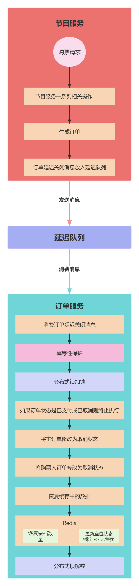

# 业务讲解-取消订单和延迟订单关闭后如何正确处理数据

## 订单服务消费延迟订单关闭消息处理流程
### 项目流程图


### 接收订单延迟关闭消息


**com.damai.service.delayconsumer.DelayOrderCancelConsumer#execute**


```java
@Slf4j
@Component
public class DelayOrderCancelConsumer implements ConsumerTask {
    
    @Autowired
    private OrderService orderService;
    
    @Override
    public void execute(String content) {
        log.info("延迟订单取消消息进行消费 content : {}", content);
        if (StringUtil.isEmpty(content)) {
            log.error("延迟队列消息不存在");
            return;
        }
        DelayOrderCancelDto delayOrderCancelDto = JSON.parseObject(content, DelayOrderCancelDto.class);
        
        //取消订单
        OrderCancelDto orderCancelDto = new OrderCancelDto();
        orderCancelDto.setOrderNumber(delayOrderCancelDto.getOrderNumber());
        boolean cancel = orderService.cancel(orderCancelDto);
        if (cancel) {
            log.info("延迟订单取消成功 orderCancelDto : {}",content);
        }else {
            log.error("延迟订单取消失败 orderCancelDto : {}",content);
        }
    }
    
    @Override
    public String topic() {
        return SpringUtil.getPrefixDistinctionName() + "-" + DELAY_ORDER_CANCEL_TOPIC;
    }
}
```


### service层执行取消订单


**com.damai.service.OrderService#cancel**


```java
@RepeatExecuteLimit(name = CANCEL_PROGRAM_ORDER,keys = {"#orderCancelDto.orderNumber"})
@ServiceLock(name = UPDATE_ORDER_STATUS_LOCK,keys = {"#orderCancelDto.orderNumber"})
@Transactional(rollbackFor = Exception.class)
public boolean cancel(OrderCancelDto orderCancelDto){
    updateOrderRelatedData(orderCancelDto.getOrderNumber(),OrderStatus.CANCEL);
    return true;
}
```


**com.damai.service.OrderService#updateOrderRelatedData**


```java
/**
 * 更新订单和购票人订单状态以及操作缓存数据
 * */
@Transactional(rollbackFor = Exception.class)
public void updateOrderRelatedData(Long orderNumber,OrderStatus orderStatus){
    //如果不是取消或者支付操作，则直接抛出异常提示
    if (!(Objects.equals(orderStatus.getCode(), OrderStatus.CANCEL.getCode()) ||
            Objects.equals(orderStatus.getCode(), OrderStatus.PAY.getCode()))) {
        throw new DaMaiFrameException(BaseCode.OPERATE_ORDER_STATUS_NOT_PERMIT);
    }
    //查询订单
    LambdaQueryWrapper<Order> orderLambdaQueryWrapper =
            Wrappers.lambdaQuery(Order.class).eq(Order::getOrderNumber, orderNumber);
    Order order = orderMapper.selectOne(orderLambdaQueryWrapper);
    //检查订单的状态 已取消、已支付、已退单的状态不再执行
    checkOrderStatus();
    //将订单更新为取消或者支付状态
    Order updateOrder = new Order();
    updateOrder.setId(order.getId());
    updateOrder.setOrderStatus(orderStatus.getCode());

    //将购票人订单更新为取消或者支付状态
    OrderTicketUser updateOrderTicketUser = new OrderTicketUser();
    updateOrderTicketUser.setOrderStatus(orderStatus.getCode());
    //支付状态的操作
    if (Objects.equals(orderStatus.getCode(), OrderStatus.PAY.getCode())) {
        updateOrder.setPayOrderTime(DateUtils.now());
        updateOrderTicketUser.setPayOrderTime(DateUtils.now());
    //取消状态的操作
    } else if (Objects.equals(orderStatus.getCode(), OrderStatus.CANCEL.getCode())) {
        updateOrder.setCancelOrderTime(DateUtils.now());
        updateOrderTicketUser.setCancelOrderTime(DateUtils.now());
    }
    //更新订单
    LambdaUpdateWrapper<Order> orderLambdaUpdateWrapper =
            Wrappers.lambdaUpdate(Order.class).eq(Order::getOrderNumber, order.getOrderNumber());
    int updateOrderResult = orderMapper.update(updateOrder,orderLambdaUpdateWrapper);

    //更新购票人订单
    LambdaUpdateWrapper<OrderTicketUser> orderTicketUserLambdaUpdateWrapper =
            Wrappers.lambdaUpdate(OrderTicketUser.class).eq(OrderTicketUser::getOrderNumber, order.getOrderNumber());
    int updateTicketUserOrderResult =
            orderTicketUserMapper.update(updateOrderTicketUser,orderTicketUserLambdaUpdateWrapper);
    if (updateOrderResult <= 0 || updateTicketUserOrderResult <= 0) {
        throw new DaMaiFrameException(BaseCode.ORDER_CANAL_ERROR);
    }
    //查询该订单下的购票人订单列表
    LambdaQueryWrapper<OrderTicketUser> orderTicketUserLambdaQueryWrapper =
            Wrappers.lambdaQuery(OrderTicketUser.class).eq(OrderTicketUser::getOrderNumber, order.getOrderNumber());
    List<OrderTicketUser> orderTicketUserList = orderTicketUserMapper.selectList(orderTicketUserLambdaQueryWrapper);
    if (CollectionUtil.isEmpty(orderTicketUserList)) {
        throw new DaMaiFrameException(BaseCode.TICKET_USER_ORDER_NOT_EXIST);
    }
    //如果是取消操作，那么把用户下该节目的订单数量要-1
    if (Objects.equals(orderStatus.getCode(), OrderStatus.CANCEL.getCode())) {
        redisCache.incrBy(RedisKeyBuild.createRedisKey(
                RedisKeyManage.ACCOUNT_ORDER_COUNT,order.getUserId(),order.getProgramId()),-1);
    }
    Long programId = order.getProgramId();
    //将购票人订单集合转换成map结构，key：票档id value：购票人订单
    Map<Long, List<OrderTicketUser>> orderTicketUserSeatList = 
            orderTicketUserList.stream().collect(Collectors.groupingBy(OrderTicketUser::getTicketCategoryId));
    Map<Long,List<Long>> seatMap = new HashMap<>(orderTicketUserSeatList.size());
    //根据orderTicketUserSeatList得到seatMap
    //seatMap结构 key：票档id  value：座位id集合
    orderTicketUserSeatList.forEach((k,v) -> {
        seatMap.put(k,v.stream().map(OrderTicketUser::getSeatId).collect(Collectors.toList()));
    });
    //更新缓存相关数据
    updateProgramRelatedDataResolution(programId,seatIdList,orderStatus);
}
```


**updateProgramRelatedDataResolution** 方法同样也是负责两种状态的操作，订单取消和订单支付，这两种操作刚好也都是相反的


这里只分析取消订单的流程：


+ 查询主订单 如果为空，抛出异常。如果状态为已取消、已支付、已退单的状态，则不再执行
+ 将主订单修改为已取消状态
+ 将购票人订单修改为已取消状态
+ 查询该订单下的购票人订单列表，过滤出购票人的座位列表
+ 如果是取消操作，那么把用户下该节目的订单数量要-1
+ 将节目id、座位列表、订单取消类型传入lua执行处理器
+ 组装lua执行需要的数据


### 恢复缓存余票数量和座位状态


**com.damai.service.OrderService#updateProgramRelatedDataResolution**


```java
public void updateProgramRelatedDataResolution(Long programId,Map<Long,List<Long>> seatMap,OrderStatus orderStatus){
    Map<Long, List<SeatVo>> seatVoMap = new HashMap<>(seatMap.size());
    //从redis中查询锁定中的座位
    seatMap.forEach((k,v) -> {
        seatVoMap.put(k,redisCache.multiGetForHash(
                RedisKeyBuild.createRedisKey(RedisKeyManage.PROGRAM_SEAT_LOCK_RESOLUTION_HASH, programId, k),
                v.stream().map(String::valueOf).collect(Collectors.toList()), SeatVo.class));
   
    });
    if (CollectionUtil.isEmpty(seatVoMap)) {
        throw new DaMaiFrameException(BaseCode.LOCK_SEAT_LIST_EMPTY);
    }
    //票档相关数据
    JSONArray jsonArray = new JSONArray();
    //要添加的座位相关数据
    JSONArray addSeatDatajsonArray = new JSONArray();
    List<TicketCategoryCountDto> ticketCategoryCountDtoList = new ArrayList<>(seatVoMap.size());
    //锁定的座位相关数据
    JSONArray unLockSeatIdjsonArray = new JSONArray();
    //锁定的座位id集合(用于发送给节目服务使用)
    List<Long> unLockSeatIdList = new ArrayList<>();
    seatVoMap.forEach((k,v) -> {
        JSONObject unLockSeatIdjsonObject = new JSONObject();
        //锁定的座位hash的key
        unLockSeatIdjsonObject.put("programSeatLockHashKey", RedisKeyBuild.createRedisKey(
                RedisKeyManage.PROGRAM_SEAT_LOCK_RESOLUTION_HASH, programId, k).getRelKey());
        //扣除锁定的座位数据
        unLockSeatIdjsonObject.put("unLockSeatIdList",v.stream()
                .map(SeatVo::getId).map(String::valueOf).collect(Collectors.toList()));
        unLockSeatIdjsonArray.add(unLockSeatIdjsonObject);
        
        JSONObject seatDatajsonObject = new JSONObject();
        //要添加的座位hash的key
        String seatHashKeyAdd = "";
        //如果是订单取消操作
        if (Objects.equals(orderStatus.getCode(), OrderStatus.CANCEL.getCode())) {
            //要添加的座位hash的key就是未售卖座位
            seatHashKeyAdd = RedisKeyBuild.createRedisKey(
                    RedisKeyManage.PROGRAM_SEAT_NO_SOLD_RESOLUTION_HASH, programId, k).getRelKey();
            for (SeatVo seatVo : v) {
                //座位状态要改成未售卖
                seatVo.setSellStatus(SellStatus.NO_SOLD.getCode());
            }
            //如果是订单支付操作
        }else if (Objects.equals(orderStatus.getCode(), OrderStatus.PAY.getCode())) {
            //要添加的座位hash的key就是已售卖座位
            seatHashKeyAdd = RedisKeyBuild.createRedisKey(
                    RedisKeyManage.PROGRAM_SEAT_SOLD_RESOLUTION_HASH, programId, k).getRelKey();
            for (SeatVo seatVo : v) {
                //座位状态要改成已售卖
                seatVo.setSellStatus(SellStatus.SOLD.getCode());
            }
        }
        seatDatajsonObject.put("seatHashKeyAdd",seatHashKeyAdd);
        List<String> seatDataList = new ArrayList<>();
        for (SeatVo seatVo : v) {
            seatDataList.add(String.valueOf(seatVo.getId()));
            seatDataList.add(JSON.toJSONString(seatVo));
        }
        //如果是订单取消的操作，那么添加到未售卖的座位数据
        //如果是订单支付的操作，那么添加到已售卖的座位数据
        seatDatajsonObject.put("seatDataList",seatDataList);
        addSeatDatajsonArray.add(seatDatajsonObject);
        
        //票档相关数据（只在订单取消操作有用）
        JSONObject jsonObject = new JSONObject();
        //票档的hash的key
        jsonObject.put("programTicketRemainNumberHashKey",RedisKeyBuild.createRedisKey(
                RedisKeyManage.PROGRAM_TICKET_REMAIN_NUMBER_HASH_RESOLUTION, programId, k).getRelKey());
        //票档id
        jsonObject.put("ticketCategoryId",String.valueOf(k));
        //票档恢复的余票数量
        jsonObject.put("count",v.size());
        jsonArray.add(jsonObject);
        
        //组装发送给节目服务的数据
        TicketCategoryCountDto ticketCategoryCountDto = new TicketCategoryCountDto();
        ticketCategoryCountDto.setTicketCategoryId(k);
        ticketCategoryCountDto.setCount((long) v.size());
        ticketCategoryCountDtoList.add(ticketCategoryCountDto);
        
        unLockSeatIdList.addAll(v.stream().map(SeatVo::getId).toList());
    });
    
    List<String> keys = new ArrayList<>();
    //操作类型
    keys.add(String.valueOf(orderStatus.getCode()));
    
    Object[] data = new String[3];
    //扣除锁定的座位数据
    data[0] = JSON.toJSONString(unLockSeatIdjsonArray);
    //如果是订单取消的操作，那么添加到未售卖的座位数据
    //如果是订单支付的操作，那么添加到已售卖的座位数据
    data[1] = JSON.toJSONString(addSeatDatajsonArray);
    //恢复库存数据
    data[2] = JSON.toJSONString(jsonArray);
    //执行lua脚本
    orderProgramCacheResolutionOperate.programCacheReverseOperate(keys,data);
    
    if (Objects.equals(orderStatus.getCode(), OrderStatus.PAY.getCode())) {
        ProgramOperateDataDto programOperateDataDto = new ProgramOperateDataDto();
        programOperateDataDto.setProgramId(programId);
        programOperateDataDto.setSeatIdList(unLockSeatIdList);
        programOperateDataDto.setTicketCategoryCountDtoList(ticketCategoryCountDtoList);
        programOperateDataDto.setSellStatus(SellStatus.SOLD.getCode());
        delayOperateProgramDataSend.sendMessage(JSON.toJSONString(programOperateDataDto));
    }
}
```


此方法是负责订单取消和订单支付的两种操作，这两种操作正好是彼此相反的，但订单取消多了一个操作就是恢复余票数量，而订单支付已经在生成订单的步骤中将余票扣除了，所以无需再扣除余票数量


> **<font style="color:#213BC0;">订单取消是要恢复余票数量，将座位状态从锁定中修改为未售卖</font>**
>
> **<font style="color:#213BC0;">订单支付是将座位状态从锁定中修改为已售卖</font>**
>


**下面列举的键是去掉了个人前缀(默认为 **`**damai**`**)的情况下，避免小伙伴会有下面列举的键名和自己启动项目中对不上的情况**


#### keys List结构 是存放操作的类型


+  **要操作的类型** 
    - 2 订单取消
    - 3 订单支付


**keys真实结构json形式展示**


```json
[
    "2"
]
```


#### data 数组结构 是存放要修改的数据


+  **第一个元素** 要解除锁定的座位id，是一个数组，数组的元素是String 

| <font style="color:#213BC0;">programSeatLockHashKey</font> | <font style="color:#213BC0;">unLockSeatIdList</font> |
| --- | :---: |
| damai-d_mai_program_seat_lock_resolution_hash_1_2 | 1 |


+  **第二个元素** 要添加的座位数据，是一个数组，数组的元素是String的json字符串，存放着座位对象集合、要添加座位的hash的key

**座位对象集合**：这个数组比较特殊，不是同一个元素，而是一个座位id，一个对应的座位对象，再一个座位id，一个对应的座位对象 ... 

| <font style="color:#213BC0;">seatDataList</font> | <font style="color:#213BC0;">seatHashKeyAdd</font> |
| --- | :---: |
| ["1","{\"colCode\":1,\"id\":1,\"price\":180,\"programId\":1,\"rowCode\":1,\"seatType\":1,\"seatTypeName\":\"通用座位\",\"sellStatus\":1,\"ticketCategoryId\":2}"<br/>        ] | damai-d_mai_program_seat_no_sold_resolution_hash_1_2 |


+  **第三个元素** 票档数量数据，是一个数组，数组的元素是json字符串，存放着票档缓存的key、票档id、要购票的数量 

| <font style="color:#213BC0;">programTicketRemainNumberHashKey</font> | <font style="color:#213BC0;">ticketCategoryId</font> | <font style="color:#213BC0;">count</font> |
| --- | :---: | :---: |
| damai-d_mai_program_ticket_remain_number_hash_resolution_1_2 | 2 | 1 |


**data 真实结构json形式展示**


```json
[
    "[{\"programSeatLockHashKey\":\"damai-d_mai_program_seat_lock_resolution_hash_1_2\",\"unLockSeatIdList\":[\"1\"]}]",
    "[{\"seatDataList\":[\"1\",\"{\\\"colCode\\\":1,\\\"id\\\":1,\\\"price\\\":180,\\\"programId\\\":1,\\\"rowCode\\\":1,\\\"seatType\\\":1,\\\"seatTypeName\\\":\\\"通用座位\\\",\\\"sellStatus\\\":1,\\\"ticketCategoryId\\\":2}\"],\"seatHashKeyAdd\":\"damai-d_mai_program_seat_no_sold_resolution_hash_1_2\"}]",
    "[{\"programTicketRemainNumberHashKey\":\"damai-d_mai_program_ticket_remain_number_hash_resolution_1_2\",\"ticketCategoryId\":\"2\",\"count\":1}]"
]
```


#### 介绍一下这些数据在redis中的真正存储：
+  **d_mai_program_ticket_remain_number_hash_resolution_节目id_票档id** 节目下的票档余票数量  值的存储结构为hash，hash的key为票档id，hash的value为票档数量 

| key | value |
| :---: | :---: |
| 1 | 0 |
| 2 | 58 |


+  **d_mai_program_seat_lock_resolution_hash_节目id_票档id** 节目下锁定中的座位集合 值的存储结构为hash，hash的key为座位id，hash的value为座位对象 

| key | value |
| :---: | :---: |
| 1 | {"colCode":1,"id":1,"price":180,"programId":1,"rowCode":1,"seatType":1,"seatTypeName":"通用座位","sellStatus":2,"ticketCategoryId":2} |
| 2 | {"colCode":2,"id":2,"price":180,"programId":1,"rowCode":1,"seatType":1,"seatTypeName":"通用座位","sellStatus":2,"ticketCategoryId":2} |


+  **d_mai_program_seat_no_sold_resolution_hash_节目id_票档id** 节目下没有售卖的座位集合 值的存储结构为hash，hash的key为座位id，hash的value为座位对象 

| key | value |
| :---: | :---: |
| 3 | {"colCode":3,"id":10,"price":180,"programId":1,"rowCode":1,"seatType":1,"seatTypeName":"通用座位","sellStatus":1,"ticketCategoryId":2} |
| 4 | {"colCode":4,"id":17,"price":180,"programId":1,"rowCode":2,"seatType":1,"seatTypeName":"通用座位","sellStatus":1,"ticketCategoryId":2} |
| ... | .... |


把这些键和数据拼接好后，就是在lua中执行了


### lua脚本执行


**脚本位置：** resources/lua/OrderProgramDataResolution.lua


```lua
-- 订单操作的类型 2：订单取消 3：订单支付
local operate_order_status = tonumber(KEYS[1])
-- 解除锁定的座位id列表
local un_lock_seat_id_json_array = cjson.decode(ARGV[1])
-- 座位数据
local add_seat_data_json_array = cjson.decode(ARGV[2])
-- 将锁定的座位集合进行扣除
for index, un_lock_seat_id_json_object in pairs(un_lock_seat_id_json_array) do
    local program_seat_hash_key = un_lock_seat_id_json_object.programSeatLockHashKey
    local un_lock_seat_id_list = un_lock_seat_id_json_object.unLockSeatIdList
    redis.call('HDEL',program_seat_hash_key,unpack(un_lock_seat_id_list))    
end

-- 如果是订单取消的操作，那么添加到未售卖的座位hash数据
-- 如果是订单支付的操作，那么添加到已售卖的座位hash数据
for index, add_seat_data_json_object in pairs(add_seat_data_json_array) do
    local seat_hash_key_add = add_seat_data_json_object.seatHashKeyAdd
    local seat_data_list = add_seat_data_json_object.seatDataList
    redis.call('HMSET',seat_hash_key_add,unpack(seat_data_list))
end

-- 如果是将订单取消
if (operate_order_status == 2) then
    -- 票档数量数据
    local ticket_category_list = cjson.decode(ARGV[3])
    -- 恢复库存
    for index,increase_data in ipairs(ticket_category_list) do
        -- 票档数量的key
        local program_ticket_remain_number_hash_key = increase_data.programTicketRemainNumberHashKey
        local ticket_category_id = increase_data.ticketCategoryId
        local increase_count = increase_data.count
        redis.call('HINCRBY',program_ticket_remain_number_hash_key,ticket_category_id,increase_count)
    end
end
```


lua中的执行逻辑也是执行订单取消和订单支付两种操作，这里来分析订单取消的流程


**KEYS的数据就是传入的keys，ARGV的数据就是传入的data **


如果是订单取消的流程，那么此时的键具体为


+  operate_order_status 实际为 2 
+  program_seat_hash_key实际为 **d_mai_program_seat_lock_resolution_hash_1_2**
+  seat_hash_key_add实际为 **d_mai_program_seat_no_sold_resolution_hash_1_2**
+  program_ticket_remain_number_hash_key实际为 **d_mai_program_ticket_remain_number_hash_resolution_1_2**


**执行流程是先从锁定的座位集合中删除掉要还原的座位，接着再将要还原的座位添加到未售卖的座位集合中，然后将对应的票档的余票数量进行恢复**


> 更新: 2025-09-01 09:55:51  
> 原文: <https://www.yuque.com/u22210564/ykdrdh/dfvtmyqgfz8z6nie>