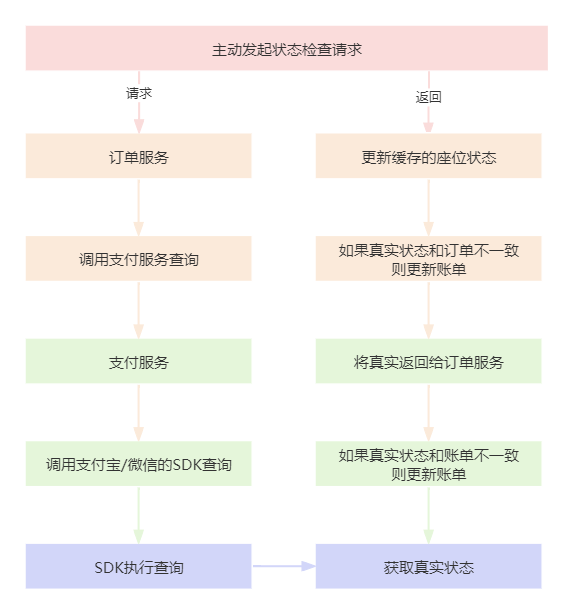

# 业务讲解-支付后如何主动检查状态

在支付宝回调章节中，我们介绍了支付后，支付宝会回调到指定的接口，然后更新订单状态以及节目相关的数据，但由于是回调，所以时效性不能很好的保证

[业务讲解-接收支付宝回调通知后如何进行数据更新](https://www.yuque.com/u22210564/ykdrdh/fg5m1zqgfm3l4r80)


所以在此章节中，我们来介绍当支付后如何主动的检查支付后的状态

### 订单支付后状态检查
### 流程图


**com.damai.controller.OrderController#payCheck**


```java
@ApiOperation(value = "订单支付后状态检查")
@PostMapping(value = "/pay/check")
public ApiResponse<OrderPayCheckVo> payCheck(@Valid @RequestBody OrderPayCheckDto orderPayCheckDto) {
    return ApiResponse.ok(orderService.payCheck(orderPayCheckDto));
}
```


**com.damai.service.OrderService#payCheck**


```java
/**
 * 支付后订单检查，以订单编号加锁，防止多次更新
 * */
@ServiceLock(name = UPDATE_ORDER_STATUS_LOCK,keys = {"#orderPayCheckDto.orderNumber"})
public OrderPayCheckVo payCheck(OrderPayCheckDto orderPayCheckDto){
    OrderPayCheckVo orderPayCheckVo = new OrderPayCheckVo();
    LambdaQueryWrapper<Order> orderLambdaQueryWrapper =
            Wrappers.lambdaQuery(Order.class).eq(Order::getOrderNumber, orderPayCheckDto.getOrderNumber());
    Order order = orderMapper.selectOne(orderLambdaQueryWrapper);
    if (Objects.isNull(order)) {
        throw new DaMaiFrameException(BaseCode.ORDER_NOT_EXIST);
    }
    BeanUtil.copyProperties(order,orderPayCheckVo);

    //如果订单已取消则进行退款
    if (Objects.equals(order.getOrderStatus(), OrderStatus.CANCEL.getCode())) {
        RefundDto refundDto = new RefundDto();
        refundDto.setOrderNumber(String.valueOf(order.getOrderNumber()));
        refundDto.setAmount(order.getOrderPrice());
        refundDto.setChannel("alipay");
        refundDto.setReason("延迟订单关闭");
        ApiResponse<String> response = payClient.refund(refundDto);
        if (response.getCode().equals(BaseCode.SUCCESS.getCode())) {
            //调用支付服务退款成功后，把订单更新为已退款状态
            Order updateOrder = new Order();
            updateOrder.setEditTime(DateUtils.now());
            updateOrder.setOrderStatus(OrderStatus.REFUND.getCode());
            orderMapper.update(updateOrder,Wrappers.lambdaUpdate(Order.class).eq(Order::getOrderNumber, order.getOrderNumber()));
        }else {
            log.error("pay服务退款失败 dto : {} response : {}",JSON.toJSONString(refundDto),JSON.toJSONString(response));
        }
        orderPayCheckVo.setOrderStatus(OrderStatus.REFUND.getCode());
        orderPayCheckVo.setCancelOrderTime(DateUtils.now());
        return orderPayCheckVo;
    }

    //调用支付服务查询支付渠道的真实状态
    TradeCheckDto tradeCheckDto = new TradeCheckDto();
    tradeCheckDto.setOutTradeNo(String.valueOf(orderPayCheckDto.getOrderNumber()));
    tradeCheckDto.setChannel(Optional.ofNullable(PayChannel.getRc(orderPayCheckDto.getPayChannelType()))
            .map(PayChannel::getValue).orElseThrow(() -> new DaMaiFrameException(BaseCode.PAY_CHANNEL_NOT_EXIST)));
    ApiResponse<TradeCheckVo> tradeCheckVoApiResponse = payClient.tradeCheck(tradeCheckDto);
    if (!Objects.equals(tradeCheckVoApiResponse.getCode(), BaseCode.SUCCESS.getCode())) {
        throw new DaMaiFrameException(tradeCheckVoApiResponse);
    }
    TradeCheckVo tradeCheckVo = Optional.ofNullable(tradeCheckVoApiResponse.getData())
            .orElseThrow(() -> new DaMaiFrameException(BaseCode.PAY_BILL_NOT_EXIST));
    if (tradeCheckVo.isSuccess()) {
        Integer payBillStatus = tradeCheckVo.getPayBillStatus();
        Integer orderStatus = order.getOrderStatus();
        //如果订单的状态和账单的状态不一致，说明支付的回调没有成功，那么就在这次更新数据
        if (!Objects.equals(orderStatus, payBillStatus)) {
            orderPayCheckVo.setOrderStatus(payBillStatus);
            try {
                //如果账单的状态是支付，那么执行订单支付的操作
                if (Objects.equals(payBillStatus, PayBillStatus.PAY.getCode())) {
                    orderPayCheckVo.setPayOrderTime(DateUtils.now());
                    orderService.updateOrderRelatedData(order.getOrderNumber(),OrderStatus.PAY);
                    //如果账单的状态是取消，那么执行订单取消的操作
                }else if (Objects.equals(payBillStatus, PayBillStatus.CANCEL.getCode())) {
                    orderPayCheckVo.setCancelOrderTime(DateUtils.now());
                    orderService.updateOrderRelatedData(order.getOrderNumber(),OrderStatus.CANCEL);
                }
            }catch(Exception e) {
                log.warn("updateOrderRelatedData warn message",e);
            }
        }
    }else {
        throw new DaMaiFrameException(BaseCode.PAY_TRADE_CHECK_ERROR);
    }
    return orderPayCheckVo;
}
```

首先判断订单是否是已取消状态，至于为什么是取消状态，以及为什么是取消状态要进行退款，在上面的回调通知流程中已经解释了，这里不再赘述


如果订单不是取消状态，则继续执行正常的逻辑：

这里是调用了支付服务的查询支付状态方法，接着支付服务又会调用具体支付渠道的方法(比如 支付宝的SDK)，来查询支付宝的真正支付状态，接着根据真正的支付状态和支付服务的账单状态进行对比，如果不一致，说明支付渠道的回调没有执行成功，那么将账单状态进行更新。这里看一下支付服务的状态检查逻辑


#### 支付服务的状态检查


#### com.damai.service.PayService#tradeCheck


```java
@Transactional(rollbackFor = Exception.class)
@ServiceLock(name = TRADE_CHECK,keys = {"#tradeCheckDto.outTradeNo"})
public TradeCheckVo tradeCheck(TradeCheckDto tradeCheckDto) {
    TradeCheckVo tradeCheckVo = new TradeCheckVo();
    //通过渠道获取具体的支付渠道策略
    PayStrategyHandler payStrategyHandler = payStrategyContext.get(tradeCheckDto.getChannel());
    //调用支付状态查询
    TradeResult tradeResult = payStrategyHandler.queryTrade(tradeCheckDto.getOutTradeNo());
    BeanUtil.copyProperties(tradeResult,tradeCheckVo);
    if (!tradeResult.isSuccess()) {
        return tradeCheckVo;
    }
    BigDecimal totalAmount = tradeResult.getTotalAmount();
    String outTradeNo = tradeResult.getOutTradeNo();
    Integer payBillStatus = tradeResult.getPayBillStatus();
    //查询对应的账单信息
    LambdaQueryWrapper<PayBill> payBillLambdaQueryWrapper = 
            Wrappers.lambdaQuery(PayBill.class).eq(PayBill::getOutOrderNo, outTradeNo);
    PayBill payBill = payBillMapper.selectOne(payBillLambdaQueryWrapper);
    if (Objects.isNull(payBill)) {
        log.error("账单为空 tradeCheckDto : {}",JSON.toJSONString(tradeCheckDto));
        return tradeCheckVo;
    }
    //如果支付渠道的金额和账单的金额不一致，则直接返回
    if (payBill.getPayAmount().compareTo(totalAmount) != 0) {
        log.error("支付渠道 和库中账单支付金额不一致 支付渠道支付金额 : {}, 库中账单支付金额 : {}, tradeCheckDto : {}",
                totalAmount,payBill.getPayAmount(),JSON.toJSONString(tradeCheckDto));
        return tradeCheckVo;
    }
    //如果支付渠道的状态和账单的状态不一致，说明回调没有执行成功，则更新账单状态
    if (!Objects.equals(payBill.getPayBillStatus(), payBillStatus)) {
        log.warn("支付渠道和库中账单交易状态不一致 支付渠道payBillStatus : {}, 库中payBillStatus : {}, tradeCheckDto : {}",
                payBillStatus,payBill.getPayBillStatus(),JSON.toJSONString(tradeCheckDto));
        PayBill updatePayBill = new PayBill();
        updatePayBill.setId(payBill.getId());
        updatePayBill.setPayBillStatus(payBillStatus);
        LambdaUpdateWrapper<PayBill> payBillLambdaUpdateWrapper =
                Wrappers.lambdaUpdate(PayBill.class).eq(PayBill::getOutOrderNo, outTradeNo);
        payBillMapper.update(updatePayBill,payBillLambdaUpdateWrapper);
        return tradeCheckVo;
    }
    return tradeCheckVo;
}
```


接着以支付宝为例


```java
public TradeResult queryTrade(String outTradeNo) {
    String successCode = "10000";
    String successMsg = "Success";
    TradeResult tradeResult = new TradeResult();
    tradeResult.setSuccess(false);
    try {
        //构建查询参数，将订单号放入，调用SDK查询
        AlipayTradeQueryRequest request = new AlipayTradeQueryRequest();
        JSONObject bizContent = new JSONObject();
        bizContent.put("out_trade_no", outTradeNo);
        request.setBizContent(bizContent.toString());
        AlipayTradeQueryResponse response = alipayClient.execute(request);
        if (response.isSuccess()) {
            JSONObject jsonResponse = JSON.parseObject(response.getBody());
            JSONObject alipayTradeQueryResponse = jsonResponse.getJSONObject("alipay_trade_query_response");
            String code = alipayTradeQueryResponse.getString("code");
            String msg = alipayTradeQueryResponse.getString("msg");
            //如果调用成功
            if (successCode.equals(code) && successMsg.equals(msg)) {
                tradeResult.setSuccess(true);
                //订单编号
                tradeResult.setOutTradeNo(alipayTradeQueryResponse.getString("out_trade_no"));
                //支付金额
                tradeResult.setTotalAmount(new BigDecimal(alipayTradeQueryResponse.getString("total_amount")));
                //账单状态，需将支付的状态转换为对应的支付服务中账单状态
                tradeResult.setPayBillStatus(convertPayBillStatus(alipayTradeQueryResponse.getString("trade_status")));
                return tradeResult;
            }
        }
    }catch (Exception e) {
        log.error("alipay trade query error",e);
    }
    return tradeResult;
}
```


流程就是调用支付渠道去查询真实的状态，然后以这个状态为准，如果账单的状态和真实的状态不一致，说明支付渠道的回调没有执行成功，那么将账单修改为真实的状态


当支付服务更新完账单状态后，接着判断订单服务中的订单状态是否和账单状态一致，如果不一致，说明支付渠道的回调没有执行成功，那么执行**orderService.updateOrderRelatedData** ，将订单状态进行更新，缓存中的数据也更新。关于**orderService.updateOrderRelatedData**方法的详细介绍在之前的文章已经详细讲解了，这里就不再赘述


> 更新: 2025-09-01 10:00:53  
> 原文: <https://www.yuque.com/u22210564/ykdrdh/zk3kme275tulz22v>