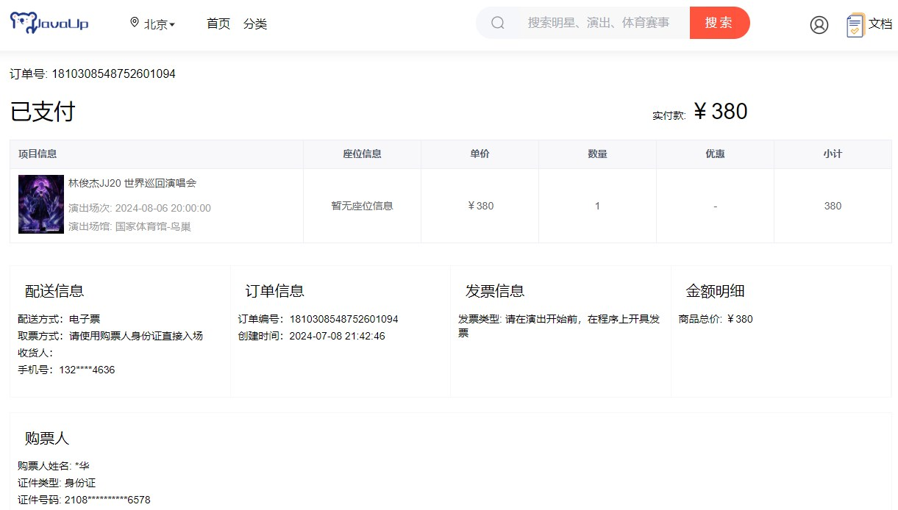
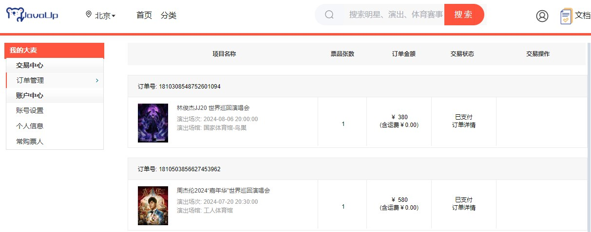

# 业务讲解-查询订单详情和订单列表

## 查询订单详情
### 页面



### 代码实现


**com.damai.controller.OrderController#get**


```java
@ApiOperation(value = "查看订单详情")
@PostMapping(value = "/get")
public ApiResponse<OrderGetVo> get(@Valid @RequestBody OrderGetDto orderGetDto) {
    return ApiResponse.ok(orderService.get(orderGetDto));
}
```


**com.damai.service.OrderService#get**


```java
public OrderGetVo get(OrderGetDto orderGetDto) {
    //查询订单
    LambdaQueryWrapper<Order> orderLambdaQueryWrapper =
            Wrappers.lambdaQuery(Order.class).eq(Order::getOrderNumber, orderGetDto.getOrderNumber());
    Order order = orderMapper.selectOne(orderLambdaQueryWrapper);
    if (Objects.isNull(order)) {
        throw new DaMaiFrameException(BaseCode.ORDER_NOT_EXIST);
    }
    //查询购票人订单
    LambdaQueryWrapper<OrderTicketUser> orderTicketUserLambdaQueryWrapper = 
            Wrappers.lambdaQuery(OrderTicketUser.class).eq(OrderTicketUser::getOrderNumber, order.getOrderNumber());
    List<OrderTicketUser> orderTicketUserList = orderTicketUserMapper.selectList(orderTicketUserLambdaQueryWrapper);
    if (CollectionUtil.isEmpty(orderTicketUserList)) {
        throw new DaMaiFrameException(BaseCode.TICKET_USER_ORDER_NOT_EXIST);   
    }
    
    OrderGetVo orderGetVo = new OrderGetVo();
    BeanUtil.copyProperties(order,orderGetVo);
    
    //组装购票订单信息
    List<OrderTicketInfoVo> orderTicketInfoVoList = new ArrayList<>();
    //按照购票订单的金额进行分组
    Map<BigDecimal, List<OrderTicketUser>> orderTicketUserMap = 
            orderTicketUserList.stream().collect(Collectors.groupingBy(OrderTicketUser::getOrderPrice));
    orderTicketUserMap.forEach((k,v) -> {
        OrderTicketInfoVo orderTicketInfoVo = new OrderTicketInfoVo();
        String seatInfo = "暂无座位信息";
        //如果节目是允许选座的，才显示出当时生成订单时产生的座位信息
        if (order.getProgramPermitChooseSeat().equals(BusinessStatus.YES.getCode())) {
            seatInfo = v.stream().map(OrderTicketUser::getSeatInfo).collect(Collectors.joining(","));
        }
        orderTicketInfoVo.setSeatInfo(seatInfo);
        orderTicketInfoVo.setPrice(v.get(0).getOrderPrice());
        orderTicketInfoVo.setQuantity(v.size());
        orderTicketInfoVo.setRelPrice(v.stream().map(OrderTicketUser::getOrderPrice)
                .reduce(BigDecimal.ZERO,BigDecimal::add));
        orderTicketInfoVoList.add(orderTicketInfoVo);
    });
    
    orderGetVo.setOrderTicketInfoVoList(orderTicketInfoVoList);
    
    //查询用户和购票人信息
    UserGetAndTicketUserListDto userGetAndTicketUserListDto = new UserGetAndTicketUserListDto();
    userGetAndTicketUserListDto.setUserId(order.getUserId());
    ApiResponse<UserGetAndTicketUserListVo> userGetAndTicketUserApiResponse = 
            userClient.getUserAndTicketUserList(userGetAndTicketUserListDto);
    
    if (!Objects.equals(userGetAndTicketUserApiResponse.getCode(), BaseCode.SUCCESS.getCode())) {
        throw new DaMaiFrameException(userGetAndTicketUserApiResponse);
        
    }
    //验证用户和购票人信息是否存在
    UserGetAndTicketUserListVo userAndTicketUserListVo =
            Optional.ofNullable(userGetAndTicketUserApiResponse.getData())
                    .orElseThrow(() -> new DaMaiFrameException(BaseCode.RPC_RESULT_DATA_EMPTY));
    //如果用户信息空，抛出异常
    if (Objects.isNull(userAndTicketUserListVo.getUserVo())) {
        throw new DaMaiFrameException(BaseCode.USER_EMPTY);
    }
    //如果购票人信息空，抛出异常
    if (CollectionUtil.isEmpty(userAndTicketUserListVo.getTicketUserVoList())) {
        throw new DaMaiFrameException(BaseCode.TICKET_USER_EMPTY);
    }
    //从查询得到的购票人信息中进行过滤出该订单下购票人的信息
    List<TicketUserVo> filterTicketUserVoList = new ArrayList<>();
    Map<Long, TicketUserVo> ticketUserVoMap = userAndTicketUserListVo.getTicketUserVoList()
            .stream().collect(Collectors.toMap(TicketUserVo::getId, ticketUserVo -> ticketUserVo, (v1, v2) -> v2));
    for (OrderTicketUser orderTicketUser : orderTicketUserList) {
        filterTicketUserVoList.add(ticketUserVoMap.get(orderTicketUser.getTicketUserId()));
    }
    //组装数据
    UserInfoVo userInfoVo = new UserInfoVo();
    BeanUtil.copyProperties(userAndTicketUserListVo.getUserVo(),userInfoVo);
    UserAndTicketUserInfoVo userAndTicketUserInfoVo = new UserAndTicketUserInfoVo();
    userAndTicketUserInfoVo.setUserInfoVo(userInfoVo);
    userAndTicketUserInfoVo.setTicketUserInfoVoList(BeanUtil.copyToList(filterTicketUserVoList, TicketUserInfoVo.class));
    orderGetVo.setUserAndTicketUserInfoVo(userAndTicketUserInfoVo);
    
    return orderGetVo;
}
```


#### 流程


+ 查询主订单
+ 查询购票人订单
+ 调用用户服务查询用户和购票人的信息
+ 将数据组装好后返回


## 查询订单列表
### 页面



### 代码实现


**com.damai.controller.OrderController#selectList**


```java
@ApiOperation(value = "查看订单列表")
@PostMapping(value = "/select/list")
public ApiResponse<List<OrderListVo>> selectList(@Valid @RequestBody OrderListDto orderListDto) {
    return ApiResponse.ok(orderService.selectList(orderListDto));
}
```


**com.damai.service.OrderService#selectList**


```java
public List<OrderListVo> selectList(OrderListDto orderListDto) {
    List<OrderListVo> orderListVos = new ArrayList<>();
    LambdaQueryWrapper<Order> orderLambdaQueryWrapper = 
            Wrappers.lambdaQuery(Order.class).eq(Order::getUserId, orderListDto.getUserId());
    //查询主订单列表
    List<Order> orderList = orderMapper.selectList(orderLambdaQueryWrapper);
    if (CollectionUtil.isEmpty(orderList)) {
        return orderListVos;
    }
    orderListVos = BeanUtil.copyToList(orderList, OrderListVo.class);
    //每个订单下的购票人订单数量统计
    List<OrderTicketUserAggregate> orderTicketUserAggregateList = 
            orderTicketUserMapper.selectOrderTicketUserAggregate(orderList.stream().map(Order::getOrderNumber).
                    collect(Collectors.toList()));
    Map<Long, Integer> orderTicketUserAggregateMap = orderTicketUserAggregateList.stream()
            .collect(Collectors.toMap(OrderTicketUserAggregate::getOrderNumber, 
                    OrderTicketUserAggregate::getOrderTicketUserCount, (v1, v2) -> v2));
    for (OrderListVo orderListVo : orderListVos) {
        orderListVo.setTicketCount(orderTicketUserAggregateMap.get(orderListVo.getOrderNumber()));
    }
    return orderListVos;
}
```


#### 流程


+ 查询主订单列表
+ 每个订单下的购票人订单数量统计
+ 循环主订单列表，将上一步获得的数量统计填充进去
+ 返回数据


整个流程其实也比较简单，值得注意的两点：


+  订单表使用**订单编号**作为分库分表的分片键，而在使用用户id查询时，依旧可以完成分片逻辑，没有读扩散的全路由问题，这是因为使用了基因法，关于详细介绍，可跳转到相应文档学习 

[技术精华-解锁分库分表新姿势：基因法完全解读](https://www.yuque.com/u22210564/ykdrdh/lnsmfsas4e7b3cvs)


+  在统计每个订单下的购票人订单数量统计时，使用的自定义sql查询 

```xml
<select id="selectOrderTicketUserAggregate" resultType="com.damai.entity.OrderTicketUserAggregate">
    select
        order_number,count(*) as order_ticket_user_count
    from d_order_ticket_user
    where order_number in
    <foreach collection='orderNumberList' item='orderNumber' index='index' open='(' close=')' separator=','>
        #{orderNumber,jdbcType=BIGINT}
    </foreach>
    group by order_number
</select>
```

 


> 更新: 2024-07-09 16:49:12  
> 原文: <https://www.yuque.com/u22210564/ykdrdh/xygch0ctvgygif6x>