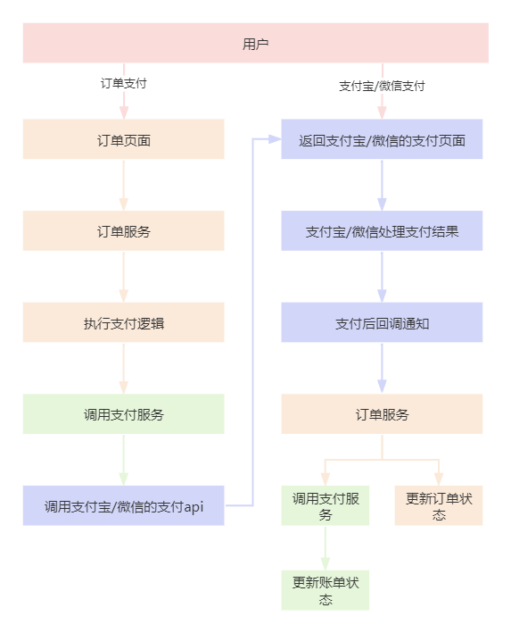
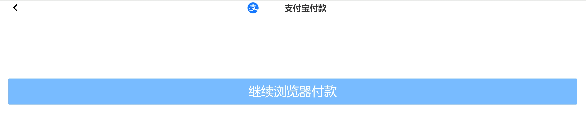
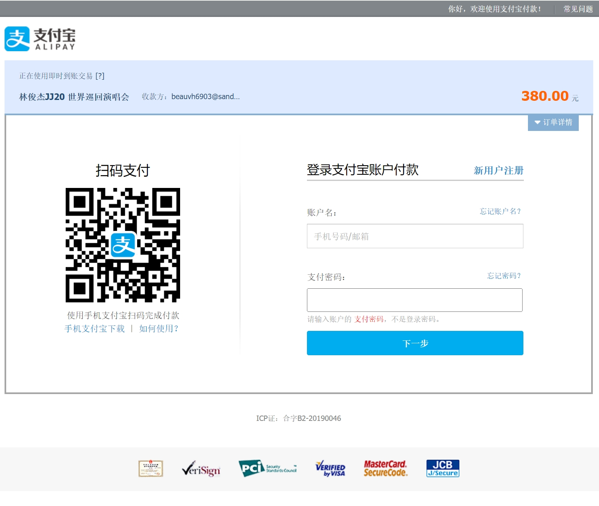

# 业务讲解-详解生成订单后的支付流程

本文要讲解的是用户购票生成订单后，对此订单进行支付的过程，可能有的小伙伴没有接触过支付相关的流程，所以把大麦网的整个支付流程通过流程图展现出来，理解的更加清晰




#### 订单支付页面





## 订单服务
### 入参


**com.damai.dto.OrderPayDto**


```java
@Data
@ApiModel(value="OrderPayDto", description ="订单支付")
public class OrderPayDto implements Serializable {

    private static final long serialVersionUID = 1L;
    
    
    @ApiModelProperty(name ="platform", dataType ="Integer", value ="支付平台 1：小程序  2：H5  3：pc网页  4：app")
    @NotNull
    private Integer platform;
    
    @ApiModelProperty(name ="orderNumber", dataType ="Long", value ="订单编号")
    @NotNull
    private Long orderNumber;
    
    @ApiModelProperty(name ="subject", dataType ="String", value ="订单标题")
    @NotBlank
    private String subject;
    
    @ApiModelProperty(name ="price", dataType ="BigDecimal", value ="价格")
    @NotNull
    private BigDecimal price;
    
    @ApiModelProperty(name ="channel", dataType ="Integer", value ="支付渠道 alipay：支付宝 wx：微信")
    @NotBlank
    private String channel;

    @ApiModelProperty(name ="payBillType", dataType ="Integer", value ="支付种类 1节目")
    @NotNull
    private Integer payBillType;
}
```


### 控制层


**com.damai.controller.OrderController#pay**


```java
@ApiOperation(value = "订单支付")
@PostMapping(value = "/pay")
public ApiResponse<String> pay(@Valid @RequestBody OrderPayDto orderPayDto) {
    return ApiResponse.ok(orderService.pay(orderPayDto));
}
```


### servie层


**com.damai.service.OrderService#pay**


```java
public String pay(OrderPayDto orderPayDto) {
    //查询生成的订单
    Long orderNumber = orderPayDto.getOrderNumber();
    LambdaQueryWrapper<Order> orderLambdaQueryWrapper =
            Wrappers.lambdaQuery(Order.class).eq(Order::getOrderNumber, orderNumber);
    Order order = orderMapper.selectOne(orderLambdaQueryWrapper);
    //订单为空，抛出异常信息
    if (Objects.isNull(order)) {
        throw new DaMaiFrameException(BaseCode.ORDER_NOT_EXIST);
    }
    //订单已取消，抛出异常信息
    if (Objects.equals(order.getOrderStatus(), OrderStatus.CANCEL.getCode())) {
        throw new DaMaiFrameException(BaseCode.ORDER_CANCEL);
    }
    //订单已支付，抛出异常信息
    if (Objects.equals(order.getOrderStatus(), OrderStatus.PAY.getCode())) {
        throw new DaMaiFrameException(BaseCode.ORDER_PAY);
    }
    //订单已退款，抛出异常信息
    if (Objects.equals(order.getOrderStatus(), OrderStatus.REFUND.getCode())) {
        throw new DaMaiFrameException(BaseCode.ORDER_REFUND);
    }
    //支付价格不等于订单价格，抛出异常信息
    if (orderPayDto.getPrice().compareTo(order.getOrderPrice()) != 0) {
        throw new DaMaiFrameException(BaseCode.PAY_PRICE_NOT_EQUAL_ORDER_PRICE);
    }
    //调用支付服务进行支付
    PayDto payDto = getPayDto(orderPayDto, orderNumber);
    ApiResponse<String> payResponse = payClient.commonPay(payDto);
    if (!Objects.equals(payResponse.getCode(), BaseCode.SUCCESS.getCode())) {
        throw new DaMaiFrameException(payResponse);
    }
    return payResponse.getData();
}
```


```java
private PayDto getPayDto(OrderPayDto orderPayDto, Long orderNumber) {
    PayDto payDto = new PayDto();
    payDto.setOrderNumber(String.valueOf(orderNumber));
    payDto.setPayBillType(orderPayDto.getPayBillType());
    payDto.setSubject(orderPayDto.getSubject());
    payDto.setChannel(orderPayDto.getChannel());
    payDto.setPlatform(orderPayDto.getPlatform());
    payDto.setPrice(orderPayDto.getPrice());
    payDto.setNotifyUrl(orderProperties.getOrderPayNotifyUrl());
    payDto.setReturnUrl(orderProperties.getOrderPayReturnUrl());
    return payDto;
}
```


订单服务的支付方法流程并不复杂，验证订单状态**必须是未支付的状态才可以**，其余状态都是异常状态。如果是未支付状态，那么就调用支付服务进行支付，所以在支付流程中，**支付服务的执行才是重头戏**


## 支付服务


### 入参


**com.damai.dto.PayDto**


```java
@Data
@ApiModel(value="PayDto", description ="支付")
public class PayDto implements Serializable {

    private static final long serialVersionUID = 1L;
    
    
    @ApiModelProperty(name ="platform", dataType ="Integer", value ="支付平台 1：小程序  2：H5  3：pc网页  4：app")
    @NotNull
    private Integer platform;
    
    @ApiModelProperty(name ="orderNumber", dataType ="Long", value ="订单号")
    @NotNull
    private String orderNumber;
    
    @ApiModelProperty(name ="subject", dataType ="String", value ="订单标题")
    @NotBlank
    private String subject;
    
    @ApiModelProperty(name ="price", dataType ="BigDecimal", value ="价格")
    @NotNull
    private BigDecimal price;
    
    @ApiModelProperty(name ="channel", dataType ="Integer", value ="支付渠道 alipay：支付宝 wx：微信")
    @NotNull
    private String channel;

    @ApiModelProperty(name ="payBillType", dataType ="Integer", value ="支付种类")
    @NotNull
    private Integer payBillType;
    
    @ApiModelProperty(name ="notifyUrl", dataType ="String", value ="支付成功后通知接口地址")
    @NotBlank
    private String notifyUrl;
    
    @ApiModelProperty(name ="returnUrl", dataType ="String", value ="支付成功后跳转页面")
    @NotBlank
    private String returnUrl;
}
```


### 控制层


**com.damai.controller.PayController#commonPay**


```java
/**
 * 通用支付，用订单号加锁防止多次支付成功，不依赖第三方支付的幂等性
 * */
@ServiceLock(name = COMMON_PAY,keys = {"payDto.orderNumber"})
@Transactional(rollbackFor = Exception.class)
public String commonPay(PayDto payDto) {
    LambdaQueryWrapper<PayBill> payBillLambdaQueryWrapper = 
            Wrappers.lambdaQuery(PayBill.class).eq(PayBill::getOutOrderNo, payDto.getOrderNumber());
    PayBill payBill = payBillMapper.selectOne(payBillLambdaQueryWrapper);
    if (Objects.nonNull(payBill) && !Objects.equals(payBill.getPayBillStatus(), PayBillStatus.NO_PAY.getCode())) {
        throw new DaMaiFrameException(BaseCode.PAY_BILL_IS_NOT_NO_PAY);
    }
    PayStrategyHandler payStrategyHandler = payStrategyContext.get(payDto.getChannel());
    PayResult pay = payStrategyHandler.pay(String.valueOf(payDto.getOrderNumber()), payDto.getPrice(), 
            payDto.getSubject(),payDto.getNotifyUrl(),payDto.getReturnUrl());
    if (pay.isSuccess()) {
        payBill = new PayBill();
        payBill.setId(uidGenerator.getUid());
        payBill.setOutOrderNo(String.valueOf(payDto.getOrderNumber()));
        payBill.setPayChannel(payDto.getChannel());
        payBill.setPayScene("生产");
        payBill.setSubject(payDto.getSubject());
        payBill.setPayAmount(payDto.getPrice());
        payBill.setPayBillType(payDto.getPayBillType());
        payBill.setPayBillStatus(PayBillStatus.NO_PAY.getCode());
        payBill.setPayTime(DateUtils.now());
        payBillMapper.insert(payBill);
    }

    return pay.getBody();
}
```


> **在支付服务中，设计一张核心的账单表，负责订单业务和支付宝/微信的对账功能，支付钱多钱少，多退少退，都可以靠这张账单表来追溯**
>


在流程中，首先就是通过传入的订单编号查询账单是否存在，如果这是第一次正在支付流程，正常来说账单肯定是不存在的，如果存在了，说明之前支付过，直接抛出异常


接着开始调用支付宝或者微信的处理器来进行支付，这里使用了策略模式，来将支付宝/微信抽取成两种不同的策略，如果后续有银联、翼支付等多种支付渠道的话，直接添加策略即可


关于支付渠道策略的详细介绍可跳转到相应文档


[业务讲解-支付渠道策略的初始化](https://www.yuque.com/u22210564/ykdrdh/gy0g15cn2o0crnyh)


这里以使用支付宝为例，当传入的支付渠道**channel**是**alipay**支付宝时，获得的策略实现就是支付宝策略，调用的支付方法


```java
PayResult pay = payStrategyHandler.pay(String.valueOf(payDto.getOrderNumber()), payDto.getPrice(), 
                payDto.getSubject(),payDto.getNotifyUrl(),payDto.getReturnUrl());
```


就是支付宝策略的支付方法，我们来看下支付策略的支付


#### 支付宝策略支付


**com.damai.pay.alipay.AlipayStrategyHandler**


```java
@Slf4j
@AllArgsConstructor
public class AlipayStrategyHandler implements PayStrategyHandler {

    /**
     * 支付宝的SDK
     * */
    private final AlipayClient alipayClient;
    
    /**
     * 支付宝相关配置
     * */
    private final AlipayProperties aliPayProperties;
    
    @Override
    public PayResult pay(String outTradeNo, BigDecimal price, String subject, String notifyUrl, String returnUrl){
        try {
            AlipayTradePagePayRequest request = new AlipayTradePagePayRequest();
            //异步接收地址，仅支持http/https，公网可访问
            request.setNotifyUrl(notifyUrl);
            //同步跳转地址，仅支持http/https
            request.setReturnUrl(returnUrl);
            //必传参数
            JSONObject bizContent = new JSONObject();
            //商户订单号，商家自定义，保持唯一性
            bizContent.put("out_trade_no", outTradeNo);
            //支付金额，最小值0.01元
            bizContent.put("total_amount", price);
            //订单标题，不可使用特殊符号
            bizContent.put("subject", subject);
            //电脑网站支付场景固定传值FAST_INSTANT_TRADE_PAY
            bizContent.put("product_code", "FAST_INSTANT_TRADE_PAY");
            request.setBizContent(bizContent.toString());
            AlipayTradePagePayResponse response = alipayClient.pageExecute(request,"POST");
            return new PayResult(response.isSuccess(),response.getBody());
        }catch (Exception e) {
           log.error("alipay pay error",e);
           throw new DaMaiFrameException(BaseCode.PAY_ERROR);
        }
    }
    
    //省略...
}
```


调用支付宝的SDK支付后，将结果直接返回给订单服务


```java
ApiResponse<String> payResponse = payClient.commonPay(payDto);
if (!Objects.equals(payResponse.getCode(), BaseCode.SUCCESS.getCode())) {
    throw new DaMaiFrameException(payResponse);
}
return payResponse.getData();
```


订单服务再将结果返回给前端，**这个结果其实就是支付宝支付页面**


#### 支付宝支付页面





当支付完后，支付宝会处理支付结果，如果支付成功了，支付会异步回调传入的接口地址，这个地址在订单服务中可以通过SpringBoot的配置文件来设置`orderPayReturnUrl = 接口地址`，这里的接口在订单服务中**com.damai.controller.OrderController#alipayNotify**


而在这个接收回调通知的方法中，就是将订单状态、座位状态修改的操作了，流程较长，由于本文篇幅有限，接收回调通知的详细介绍，可跳转到相应文档查看


[业务讲解-接收支付宝回调通知后如何进行数据更新](https://www.yuque.com/u22210564/ykdrdh/fg5m1zqgfm3l4r80)


> 更新: 2024-08-15 11:09:24  
> 原文: <https://www.yuque.com/u22210564/ykdrdh/lpu4oizpgzxbcfcw>