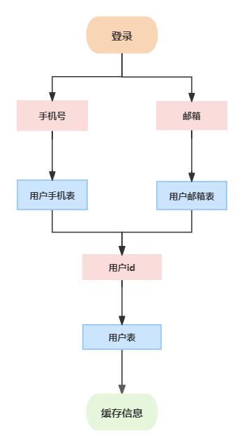

# 分库分表-用户服务-用户表

阅读此文前，建议小伙伴先阅读分库分表的前置知识，对分库分表 和 shardingsphere 有了大概的理解后，在继续阅读本文


[技术精华-全面剖析分库分表](https://www.yuque.com/u22210564/ykdrdh/zod7zrsra0l8e08h)


# 介绍


在开始介绍前，需要先知道大麦网中数据库表的关系是怎么样，关于数据库表设计的详细介绍，小伙伴可跳转到相关文档


[基础讲解-数据库表关系](https://www.yuque.com/u22210564/ykdrdh/eykr15ak9zod9g5u)


### 配置


#### 引入 ShardingSphere 的相关依赖


```xml
<properties>
	<shardingsphere.version>5.3.2</shardingsphere.version>
</properties>
<dependency>
    <groupId>org.apache.shardingsphere</groupId>
    <artifactId>shardingsphere-jdbc-core</artifactId>
    <version>${shardingsphere.version}</version>
    <exclusions>
        <exclusion>
            <artifactId>logback-classic</artifactId>
            <groupId>ch.qos.logback</groupId>
        </exclusion>
    </exclusions>
</dependency>
```


#### 根据规则进行分库分表的规则配置


ShardingSphere 官网的规则配置说明：


[数据分片](https://shardingsphere.apache.org/document/5.3.2/cn/user-manual/shardingsphere-jdbc/yaml-config/rules/sharding/)


用户项目相关配置：


```yaml
spring:
  datasource:
    driver-class-name: org.apache.shardingsphere.driver.ShardingSphereDriver
    url: jdbc:shardingsphere:classpath:shardingsphere-user.yaml
```


shardingsphere-user.yaml配置：


```yaml
dataSources:
  # 第一个用户库
  ds_0:
    dataSourceClassName: com.zaxxer.hikari.HikariDataSource
    driverClassName: com.mysql.cj.jdbc.Driver
    jdbcUrl: jdbc:mysql://127.0.0.1:3306/damai_user_0?useUnicode=true&characterEncoding=UTF-8&rewriteBatchedStatements=true&allowMultiQueries=true&serverTimezone=Asia/Shanghai
    username: xxx
    password: xxx
  # 第二个用户库
  ds_1:
    dataSourceClassName: com.zaxxer.hikari.HikariDataSource
    driverClassName: com.mysql.cj.jdbc.Driver
    jdbcUrl: jdbc:mysql://127.0.0.1:3306/damai_user_1?useUnicode=true&characterEncoding=UTF-8&rewriteBatchedStatements=true&allowMultiQueries=true&serverTimezone=Asia/Shanghai
    username: xxx
    password: xxx

rules:
  # 分库分表规则
  - !SHARDING
    tables:
      # 对d_user_mobile表进行分库分表
      d_user_mobile:
        # 库为damai_user_0 damai_user_1 表为d_user_mobile_0 至 d_user_mobile_1
        actualDataNodes: ds_${0..1}.d_user_mobile_${0..1}
        # 分库策略
        databaseStrategy:
          standard:
            # 使用mobile作为分片键
            shardingColumn: mobile
            # 用user_mobile列使用hash取模作为分库算法
            shardingAlgorithmName: databaseUserMobileHashModModel
        # 分表策略      
        tableStrategy:
          standard:
            # 使用mobile作为分片键
            shardingColumn: mobile
            # 用user_mobile列使用hash取模作为分表算法
            shardingAlgorithmName: tableUserMobileHashMod
      # 对d_user_email表进行分库分表
      d_user_email:
        # 库为damai_user_0 damai_user_1 表为d_user_email_0 至 d_user_email_1
        actualDataNodes: ds_${0..1}.d_user_email_${0..1}
        # 分库策略
        databaseStrategy:
          standard:
            # 使用email作为分片键
            shardingColumn: email
            # 用user_mobile列使用hash取模作为分库算法
            shardingAlgorithmName: databaseUserEmailHashModModel
        # 分表策略      
        tableStrategy:
          standard:
            # 使用email作为分片键
            shardingColumn: email
            # 用user_mobile列使用hash取模作为分表算法
            shardingAlgorithmName: tableUserEmailHashMod
      # 对d_user表进行分库分表
      d_user:
        # 库为damai_user_0 damai_user_1 表为d_user_0 至 d_user_1
        actualDataNodes: ds_${0..1}.d_user_${0..1}
        # 分库策略
        databaseStrategy:
          standard:
            # 使用id作为分片键
            shardingColumn: id
            # 用id列使用hash取模作为分库算法
            shardingAlgorithmName: databaseUserModModel
        # 分表策略      
        tableStrategy:
          standard:
            # 使用id作为分片键
            shardingColumn: id
            # 用id列使用hash取模作为分表算法
            shardingAlgorithmName: tableUserModModel
      # 对d_ticket_user表进行分库分表
      d_ticket_user:
        # 库为damai_user_0 damai_user_1 表为d_ticket_user_0 至 d_ticket_user_1
        actualDataNodes: ds_${0..1}.d_ticket_user_${0..1}
        # 分库策略
        databaseStrategy:
          standard:
            # 使用user_id作为分片键
            shardingColumn: user_id
            # 用user_id列使用hash取模作为分库算法
            shardingAlgorithmName: databaseTicketUserModModel
        # 分表策略      
        tableStrategy:
          standard:
            # 使用user_id作为分片键
            shardingColumn: user_id
            # 用user_id列使用hash取模作为分表算法
            shardingAlgorithmName: tableTicketUserModModel
    # 具体的算法        
    shardingAlgorithms:
      # d_user_mobile表分库算法
      databaseUserMobileHashModModel:
        type: HASH_MOD
        props:
          # 分库数量
          sharding-count: 2
      # d_user_mobile表分表算法
      tableUserMobileHashMod:
        type: HASH_MOD
        props:
          # 分表数量
          sharding-count: 2
      # d_user_email表分库算法
      databaseUserEmailHashModModel:
        type: HASH_MOD
        props:
          # 分库数量
          sharding-count: 2
      # d_user_email表分表算法
      tableUserEmailHashMod:
        type: HASH_MOD
        props:
          # 分表数量
          sharding-count: 2
      # d_user表分库算法
      databaseUserModModel:
        type: MOD
        props:
          # 分库数量
          sharding-count: 2
      # d_user表分表算法
      tableUserModModel:
        type: MOD
        props:
          # 分表数量
          sharding-count: 2
      # d_ticket_user表分库算法
      databaseTicketUserModModel:
        type: MOD
        props:
          # 分库数量
          sharding-count: 2
      # d_ticket_user表分表算法
      tableTicketUserModModel:
        type: MOD
        props:
          # 分表数量
          sharding-count: 2    
  # 加密规则
  - !ENCRYPT
    tables:
      # d_user表
      d_user:
        columns:
          # 对mobile列进行加密
          mobile:
            # 密文列mobile
            cipherColumn: mobile
            # 自定义的加密算法
            encryptorName: user_encryption_algorithm
          # 对password列进行加密
          password:
            # 密文列password
            cipherColumn: password
            # 自定义的加密算法
            encryptorName: user_encryption_algorithm
          # 对id_number列进行加密
          id_number:
            # 密文列id_number
            cipherColumn: id_number
            # 自定义的加密算法
            encryptorName: user_encryption_algorithm
      # d_user_mobile表
      d_user_mobile:
        columns:
          # 对mobile列进行加密
          mobile:
            # 密文列id_number
            cipherColumn: mobile
            # 自定义的加密算法
            encryptorName: user_encryption_algorithm
props:
  # 打印真实sql
  sql-show: true
```


#### 总结


+ `d_user_mobile`表的分库分表都是用的`mobile`作为分片键，算法为`HASH_MOD`，hash取模
+ `d_user_email`表的分库分表都是用的`email`作为分片键，算法为`HASH_MOD`，hash取模
+ `d_user`表的分库分表都是用的`id`作为分片键，算法为`MOD`，取模


小伙伴可能会有疑惑，为什么要额外设计 用户手机表 和 用户邮箱表 呢？ 直接把邮箱和手机号放进用户表里不就行了吗？别急，本人都会解答到


在用户登录时，是可以用手机号和邮箱登录的，也就是需要用手机号和邮箱来查询用户信息，而在订单业务中也需要查询用户信息，使用的是用户id来查询。而我们是使用的用户id作为分片键，使用手机号 和 邮箱 就会造成 全路由 的问题


**所谓的全路由**，就是查询或者操作数据时，没有分片键的条件，ShardingSphere  无法定位数据具体到在哪个库，哪个表。就只能去所有的分片库，分片表上查询，这种情况的执行效率是非常慢的，会有数据库连接超时、接口超时 各种的问题


### 解决


为了解决 手机号和邮箱登录 而且不造成 全路由 的问题。采取附属表的方案，设置了 用户手机表 和 用户邮箱表 ，通过手机号 和 邮箱 查询到 用户id，然后使用用户id查询用户表，这样就解决了问题


**d_user 用户表**


```sql
CREATE TABLE `d_user` (
  `id` bigint(20) NOT NULL COMMENT '主键id',
  `name` varchar(256) DEFAULT NULL COMMENT '用户名字',
  `rel_name` varchar(256) DEFAULT NULL COMMENT '用户真实名字',
  `mobile` varchar(512) NOT NULL COMMENT '手机号',
  `gender` int(11) NOT NULL DEFAULT '1' COMMENT '1:男 2:女',
  `password` varchar(512) DEFAULT NULL COMMENT '密码',
  `email_status` tinyint(1) NOT NULL DEFAULT '0' COMMENT '是否邮箱认证 1:已验证 0:未验证',
  `email` varchar(256) DEFAULT NULL COMMENT '邮箱地址',
  `rel_authentication_status` tinyint(1) NOT NULL DEFAULT '0' COMMENT '是否实名认证 1:已验证 0:未验证',
  `id_number` varchar(512) DEFAULT NULL COMMENT '身份证号码',
  `address` varchar(256) DEFAULT NULL COMMENT '收货地址',
  `create_time` datetime DEFAULT NULL COMMENT '创建时间',
  `edit_time` datetime DEFAULT NULL COMMENT '编辑时间',
  `status` tinyint(1) NOT NULL DEFAULT '1' COMMENT '1:正常 0:删除',
  PRIMARY KEY (`id`)
) ENGINE=InnoDB DEFAULT CHARSET=utf8mb4 COMMENT='用户表';
```


**d_user_mobile 用户手机表**


```sql
CREATE TABLE `d_user_mobile` (
  `id` bigint(20) NOT NULL COMMENT '主键id',
  `user_id` bigint(20) NOT NULL COMMENT '用户id',
  `mobile` varchar(512) NOT NULL COMMENT '手机号',
  `create_time` datetime NOT NULL COMMENT '创建时间',
  `edit_time` datetime NOT NULL COMMENT '编辑时间',
  `status` tinyint(1) NOT NULL DEFAULT '1' COMMENT '1:正常 0:删除',
  PRIMARY KEY (`id`)
) ENGINE=InnoDB DEFAULT CHARSET=utf8mb4 COMMENT='用户手机表';
```


**d_user_email 用户邮箱表**


```sql
CREATE TABLE `d_user_email` (
  `id` bigint(20) NOT NULL COMMENT '主键id',
  `user_id` bigint(20) NOT NULL COMMENT '用户id',
  `email` varchar(512) NOT NULL COMMENT '邮箱',
  `create_time` datetime NOT NULL COMMENT '创建时间',
  `edit_time` datetime NOT NULL COMMENT '编辑时间',
  `status` tinyint(1) NOT NULL DEFAULT '1' COMMENT '1:正常 0:删除',
  PRIMARY KEY (`id`)
) ENGINE=InnoDB DEFAULT CHARSET=utf8mb4 COMMENT='用户邮箱表';
```


**d_ticket_user 购票人表**


```sql
CREATE TABLE `d_ticket_user` (
  `id` bigint(20) NOT NULL COMMENT '主键id',
  `user_id` bigint(20) NOT NULL COMMENT '用户id',
  `rel_name` varchar(256) NOT NULL COMMENT '用户真实名字',
  `id_type` int(11) NOT NULL DEFAULT '1' COMMENT '证件类型 1:身份证 2:港澳台居民居住证 3:港澳居民来往内地通行证 4:台湾居民来往内地通行证 5:护照 6:外国人永久居住证',
  `id_number` varchar(512) NOT NULL COMMENT '证件号码',
  `create_time` datetime NOT NULL COMMENT '创建时间',
  `edit_time` datetime NOT NULL COMMENT '编辑时间',
  `status` tinyint(1) NOT NULL DEFAULT '1' COMMENT '1:正常 0:删除',
  PRIMARY KEY (`id`)
) ENGINE=InnoDB DEFAULT CHARSET=utf8mb4 COMMENT='购票人表';
```


流程：




如果以后登录业务修改的话，比如再增加使用用户名登录，那么再增加一个 用户名 表 即可解决。但使用这种附属表就没有任何问题了吗？显示不是不可能，任何的解决方案都是有相应代价的


#### 缺点


+ 还是 用户登录 业务，使用手机号登录，需要先用手机号去用户手机表查询到用户id，再使用 用户id去用户表查询用户信息，这样多了一步查询的过程，额外产生了性能的消耗
+ 额外多了用户手机表和用户邮箱表，随着数据量的越来越大，表容量的占用也越来越大，需要额外的维护


目前来说 这种使用 附属表路由的方案 是互联网公司比较通用的方案，那么像这种多字段查询的业务都必须使用附属表的方案吗？答案是** 不一定 **

比如 订单业务，订单可以根据订单编号查询，也可以根据用户id查询，这种业务可以用另一种方案，并不需要额外的表来维护，叫分片基因算法。此方案在订单服务的分库分表中得到了应用，小伙伴们可跳转到相应的文档查看


[分库分表-订单服务](https://www.yuque.com/u22210564/ykdrdh/nxlm5yyydfazz76p)


> 更新: 2025-06-29 17:27:47  
> 原文: <https://www.yuque.com/u22210564/ykdrdh/etrdd3hhzbqb5xzh>